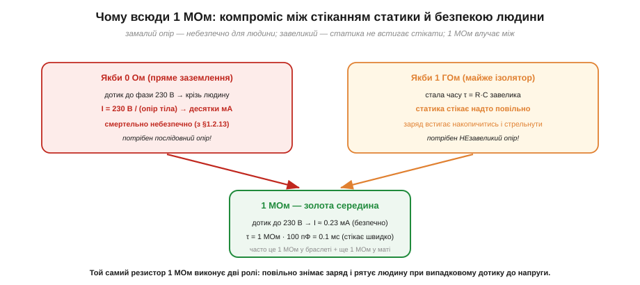

# Антистатичне робоче місце: браслет, мат, заземлення

Робота з електронікою впирається в одне практичне питання: **як працювати з нею так, щоб її не вбити?** Відповідь — облаштувати робоче місце так, щоб статиці не було де накопичитись, а будь-який заряд стікав **повільно й безпечно** в одну спільну землю. Це не набір окремих гаджетів, а єдина продумана система: браслет, настільний мат і заземлення, з'єднані за чіткими правилами. І в кожному з цих елементів незмінно зустрічається загадковий резистор на **1 мегаом** — розберемося й чому саме він.

### Головна ідея: усе на одному потенціалі

Ключ до всього — проста думка про [різницю потенціалів](topic:physics/electric-charge): вона небезпечна, а **однаковий потенціал — ні**. Розряд тече тоді, коли між двома точками є різниця напруг. Якщо ж усе на робочому місці — твоє тіло, виріб, інструмент, мат — тримати на **тому самому** потенціалі, то між ними просто нема чому розряджатися. Заряд може стекти кудись назовні, але **не крізь чутливий виріб**.


*Браслет на зап'ясті, настільний мат і виріб ведуть до однієї **спільної точки** (common point), а вона — до землі розетки. У шляху браслета й мата стоїть по 1 МОм. Корпус приладу при цьому заземлений «твердо», без 1 МОм. Так між тілом, матом і виробом ніколи не виникає різниці потенціалів — розряджатися нема чому.*

Розгляньмо елементи. **Антистатичний браслет** (*wrist strap*) — провідний ремінець на зап'ясті, з'єднаний шнуром із землею. Він **постійно** стікає заряд із тіла, не даючи накопичитись тим [кіловольтам на тілі людини](topic:physics/body-charge). **Настільний мат** (*mat*) — розсіювальне покриття столу, на якому лежить виріб; він теж заземлений і вирівнює заряд на всьому, що на ньому стоїть. **Спільна точка** (*common ground point*) — вузол, куди сходяться всі заземлення, щоб гарантовано бути одним потенціалом. Усе це — пряме застосування [заземлення](topic:physics/electric-charge): під'єднати до велетенського резервуара заряду (землі), щоб прибрати надлишок.

> 🔧 **Навіщо це.** Браслет важливіший за все інше разом узяте — бо людина є головним носієм статики. Але працює він, лише поки **надітий на голу шкіру й під'єднаний**: браслет «на потім», звисаючий зі столу, або вдягнений поверх рукава — нуль захисту. Перед роботою з чутливим виробом порядок такий: спершу надів і під'єднав браслет, став заземленим — і **лише тоді** дістаєш плату з [екранувального пакета](topic:electronics/esd-packaging). Що саме всередині браслета й мата і як перевірити їх тестером — вставка 🔌 [Браслет, мат і тестер браслетів](topic:electronics/antistatic-workplace/comp-wrist-strap.md).

Тут важливо зрозуміти, чому система працює саме як **єдине ціле**, а не як набір окремих заземлень. Якби браслет вів в одну землю, мат — в іншу, а прилад — у третю, між цими «землями» могла б виникати різниця потенціалів (вони ж розведені різними дротами з різним опором). А різниця потенціалів — це рівно те, чого ми боїмося: вона жене розряд. Тому всі заземлення зводять в **одну спільну точку** й уже від неї ведуть до землі. Це зветься **вирівнюванням потенціалів** (*equipotential bonding*): мета — не стільки «з'єднати з землею», скільки зробити так, щоб тіло, мат і виріб були **рівні між собою**. Навіть якби ця спільна точка раптом «попливла» по потенціалу, попливла б вона разом з усім — а отже, всередині робочого місця розряджатись усе одно нема чому. Заземлення тут — спосіб тримати рівність, а не самоціль.

Звідси й чесне застереження про **інший** бік: працювати «без заземлення взагалі» гірше, ніж здається. Якщо браслет ні до чого не під'єднаний, тіло **плаває** (floating) — воно не стікає заряд, а просто накопичує його, як і раніше. Гірше: іноді люди, боячись струму, навмисно лишають усе ізольованим — і тоді чутливий виріб, узятий у руки, заряджається разом із тілом до тих самих кіловольтів, а вб'є його перший же дотик до чогось заземленого. Тому правильна відповідь — не «уникати землі», а **під'єднатись до неї правильно**, через резистор, про який далі.

Чому ж не обійтися без браслета, просто **час від часу торкаючись** заземленого предмета, щоб «скинути» заряд? Тому що це знімає заряд лише в **одну мить** — а вже за наступний рух (поворот у кріслі, потягнувся за деталлю) тіло набирає нові кіловольти, і до наступного дотику ти знову небезпечний. Періодичне розряджання — як вичерпувати воду з дірявого човна вряди-годи: між «черпаннями» вода (заряд) знову набігає. Браслет натомість тримає стік **постійно відкритим**, тож заряд не встигає накопичитись узагалі. Різниця між «іноді торкнутись» і «постійно під'єднаний» — це різниця між кількома небезпечними мілісекундами на кожен рух і **повною** відсутністю накопичення. Для чипа, ушкодження якого [людина ніяк не відчуває](topic:physics/body-charge), тільки друге надійне.

### Чому скрізь стоїть 1 мегаом

Тепер та сама загадка: чому в браслеті й маті завжди вшито резистор приблизно на **1 МОм**? Чому не з'єднати тіло із землею просто дротом — стікало б іще краще? Відповідь — у тому, що цей резистор мусить догодити **двом вимогам одразу**, які тягнуть у протилежні боки.


*Якби заземлення було пряме (0 Ом), випадковий дотик зап'ястям до фази 230 В пустив би крізь тіло десятки міліампер — смертельно. Якби опір був завеликий (1 ГОм), стала часу стікання τ = R·C стала б завеликою, і статика не встигала б стікати. 1 МОм влучає між: дотик до 230 В дає лише ~0.23 мА (безпечно), а τ = 1 МОм · 100 пФ ≈ 0.1 мс (стікає швидко).*

Перша вимога — **безпека людини**. Якщо тіло заземлене прямим дротом (0 Ом) і ти ненароком торкнешся фази мережі, увесь струм піде крізь тебе в землю. При 230 В і типовому опорі тіла це десятки міліампер — [небезпечний для життя струм](topic:physics/current-safety). Отже, потрібен **послідовний опір**, що обмежить струм при випадковому дотику до напруги.

Друга вимога — **швидке стікання статики**. Заряд тіла стікає через резистор за час порядку сталої τ = R·C (де C — ємність тіла, ~100 пФ). Якщо опір завеликий (наприклад, 1 ГОм), τ виходить великою, і заряд встигає накопичитись між стіканнями. Отже, опір не має бути завеликим.

Тут варто наголосити, що це **компроміс**, а не точне магічне число. Дві вимоги тягнуть у протилежні боки: безпека хоче опір **більший** (менший струм при дотику до фази), швидкість стікання хоче опір **менший** (мала стала часу). Між «не менше, ніж треба для безпеки» і «не більше, ніж дозволяє стікання» лежить широке вікно — приблизно від сотень кілоом до десятків мегаом, — і 1 МОм просто зручно сидить посередині цього вікна, з добрим запасом в обидва боки. Тому в браслетах і трапляються номінали трохи різні (часто саме 1 МОм, інколи більше): важлива не точна цифра, а те, щоб опір лишався в цьому безпечно-дієвому вікні. Перевіримо тепер обидва боки числом.

**Приклад (1 МОм задовольняє обидві вимоги).** Безпека: який струм крізь людину при дотику до 230 В через 1 МОм? Швидкість: яка стала часу стікання при C ≈ 100 пФ?

```
Безпека (струм при дотику до фази):
I = V / R = 230 В / 1 000 000 Ом
I ≈ 0.23 мА        — нижче порога відчуття, безпечно

Швидкість (стала часу стікання заряду тіла):
τ = R · C = (1 × 10⁶ Ом) · (100 × 10⁻¹² Ф)
τ = 1 × 10⁻⁴ с = 0.1 мс    — заряд стікає майже миттєво
```

0.23 міліампера — людина навіть не відчує; 0.1 мілісекунди — статика стікає швидше, ніж устигне нашкодити. Одне число, 1 МОм, влучає в обидві цілі. Часто опір розкладають: ~1 МОм у браслеті плюс ~1 МОм у маті — щоб навіть пошкодження одного шляху лишало захист.

Варто відчути, наскільки 0.1 мс — це швидко в людських масштабах. Заряд стікає не миттєво, а за експонентою (точну форму дає [розрядка RC через сталу часу](topic:electronics/rc-time-constant)): за одну сталу часу залишається близько 37% заряду, за п'ять сталих — менш як 1%. П'ять сталих по 0.1 мс — це 0.5 мс, пів тисячної частки секунди. Тобто від моменту, коли ти став заземленим через браслет, до моменту, коли від кіловольтів не лишилось і відсотка, минає менше мілісекунди — ти й оком не встигнеш кліпнути. Ось чому надітий браслет тримає тіло «розрядженим» **безперервно**: будь-який свіжонабраний заряд зникає швидше, ніж устигаєш до чогось доторкнутись.

**Приклад (за скільки браслет «здуває» кіловольти).** Тіло C = 100 пФ заряджене до 4 кВ, браслет із резистором 1 МОм. За який час напруга впаде до безпечних ~100 В? (Розрядка: V(t) = V₀·e^(−t/τ), τ = R·C = 0.1 мс.)

```
треба:  V(t)/V₀ = 100 / 4000 = 0.025
e^(−t/τ) = 0.025   →   t = τ · ln(1/0.025) = τ · ln(40)
ln(40) ≈ 3.7
t ≈ 0.1 мс × 3.7 ≈ 0.37 мс
```

Менш ніж за пів мілісекунди тіло падає з 4 кВ до сотні вольтів. Жоден рух людини не встигає за цим — тому при справному браслеті небезпечні кіловольти на тілі просто не накопичуються.

### Виняток із правила: корпус приладу — «тверда» земля

Важлива тонкість, яку видно на схемі робочого місця: резистор 1 МОм стоїть у шляхах **антистатичного** захисту (браслет, мат), але **не** на корпусі приладу. Металевий корпус, що може опинитись під небезпечною напругою при несправності, заземлюють «твердо», прямим провідником захисного заземлення (PE) розетки — без жодного мегаома. Логіка протилежна: тут опір нам **не** потрібен, навпаки — треба, щоб при пробої на корпус великий струм миттєво пішов у землю й вибив запобіжник, рятуючи людину. Тобто 1 МОм — це інструмент **антистатики** (повільне стікання + захист від дотику до фази), а не захисного заземлення (миттєвий злив аварійного струму). Плутати ці дві землі не можна.

> 🔧 **Навіщо це.** Розрізняти «антистатичну землю через 1 МОм» і «захисну землю напряму» — питання і деталей, і людської безпеки. Якщо хтось «для надійності» закоротить браслет прямо на землю (прибравши 1 МОм), він перетворить засіб захисту електроніки на смертельну пастку при дотику до фази. А якщо, навпаки, заземлити корпус приладу через 1 МОм, аварійний струм не зможе вибити запобіжник. Кожне з двох заземлень робить свою роботу — і саме тому вони різні.

### Типові помилки й чому місце треба перевіряти

Антистатичне місце оманливо просте на вигляд — і саме тому в нього легко закрастись «тихим» помилкам, через які захист є лише номінально. Перша й найчастіша — **браслет, що не контактує зі шкірою**: надітий поверх рукава, пересохлий, із брудним контактом. Зовні все «як треба», а насправді тіло ізольоване й накопичує заряд, як без браслета. Друга — **обрив у шнурі браслета**: тоненький провідник усередині спіралі ламається від згинань, і ланцюг тихо розривається. Третя — **незаземлений мат**: мат лежить, але його провідник нікуди не під'єднано, тож він лише вирівнює заряд на собі, не зливаючи його. Усі ці помилки об'єднує те, що вони **невидимі**: місце виглядає робочим, а захисту немає.

Звідси й практика **перевірки**. Браслет і мат не приймають на віру, а контролюють: щодня (а в серйозних умовах — щоразу перед роботою) перевіряють опір ланцюга «зап'ястя — земля» тестером браслетів, який показує, чи лежить опір у потрібному вікні (приблизно в районі того самого мегаома: не обрив і не коротке). Там, де ціна помилки висока, ставлять **безперервний монітор** (*continuous monitor*) — пристрій, що весь час стежить за ланцюгом браслета й пищить, щойно контакт зник. Це теж пряме застосування думки про те, що [людина не відчуває статики](topic:physics/body-charge): оскільки не чути ні заряду, ні обриву браслета, надійність дає лише **вимірювання**, а не відчуття.

Корисно й узагальнити саме поняття «земля» в цьому контексті, бо слово це має кілька різних ролей, і їх не можна змішувати: є **захисна земля** розетки (для безпеки людини, тверда, без опору), є **сигнальна/опорна земля** схеми (нуль відліку напруг) і є **антистатична земля** робочого місця (для повільного стікання заряду, через мегаом). Фізично вони часто сходяться в одній точці будівлі, але роль у кожної своя. Плутанина ролей — джерело і небезпек (як із браслетом без 1 МОм), і загадкових завад. Тримаючи в голові «яка це земля й для чого», легше не наробити саме тих помилок, що роблять захист уявним.

Уся ця система тримається на трьох речах, які варто винести з теми разом. Антистатичне місце тримає тіло, виріб і мат на **одному потенціалі**, зливаючи заряд у спільну землю, — і саме рівність потенціалів, а не «з'єднання з землею» сама собою, прибирає причину розряду. Повсюдний резистор **1 МОм** — це компроміс між швидким стіканням статики й захистом людини від випадкового дотику до напруги, тому важлива не точна цифра, а вікно, у якому опір лишається і безпечним, і дієвим. А корпус приладу при цьому заземлюють **твердо**, без опору, бо його земля розв'язує протилежну задачу — миттєвий злив аварійного струму. Браслет і мат стережуть виріб, поки він на столі; щойно його треба зберігати чи везти, на зміну приходить [захист компонентів в екранувальній упаковці](topic:electronics/esd-packaging), де браслета вже не надінеш.

---
