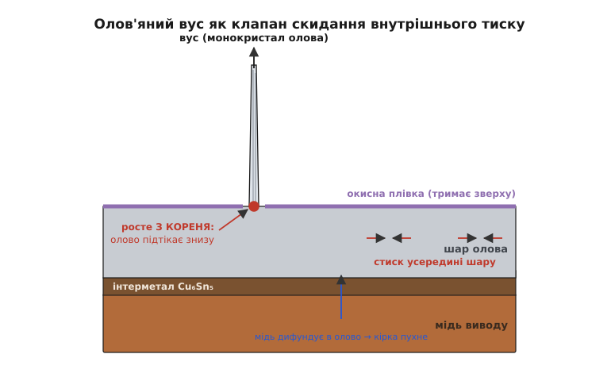

# 🔌 Олов'яні вуса: метал, що сам відрощує голки

<preknowlist>
- [Металічний зв'язок](root:basic-chemistry/metallic-bond) — атоми металу тримаються спільною хмарою електронів, тож можуть повільно переповзати одне повз одне навіть у твердому стані.
- [Дефекти кристалічної ґратки](topic:physics/crystal-defects) — межі зерен і дислокації: саме ними атоми металу рухаються, коли шар знімає з себе напругу.
</preknowlist>

Уяви покриття зі щирого олова — тонкий блискучий шар, яким виробник вкриває мідні виводи мікросхеми, щоб вони не окислювались і добре бралися припоєм. Плата припаяна, прилад працює. Мине рік, два, п'ять — і з того гладенького олова, ні з того ні з сього, починає **рости волосина**. Тонка, як павутина, металева, блискуча, пряма. Вона не з'явилася з бруду й не осіла з повітря — вона **проросла зсередини самого олова**, як голка з подушечки, і олово нікуди для цього не наливали. Ось так виглядає один із найпідступніших і найдовше незрозумілих дефектів у всій електроніці — **олов'яні вуса** (англ. *tin whiskers*, дослівно «олов'яні вусики»).

Підступність тут не в екзотиці, а навпаки — у буденності. Це не рідкісний збій одного бракованого чипа. Це властивість **самого металу за нормальних кімнатних умов**: щире олово, залишене саме собою, з роками відрощує ці ниточки практично на будь-якому виробі. І кожна така ниточка — **суцільний метал**, тобто провідник. Досить їй дорости від одного виводу до сусіднього — і між ними коротке замикання, якого вчора не було й яке з'явилося без жодного втручання людини. Прилад, що п'ять років минав усі перевірки, одного дня замикається сам по собі.

Ця стаття — про клас дефекту загалом: **звідки береться ця сила**, що виштовхує метал у голку; **чому колись цю проблему приборкали, а потім власноруч повернули**; де вона по-справжньому небезпечна; і що з нею роблять сьогодні. Жодних конкретних партномерів — бо вуса не залежать від виробника чи моделі. Це фізика олова, однакова для всіх.

## Що це таке насправді — одна волосина під мікроскопом

Спершу треба точно уявити сам об'єкт, бо назва «вуса» трохи оманлива — це не пух і не наліт. Візьмімо одну ниточку й роздивімося.

Типовий олов'яний вус — це **монокристал** (гр. *mónos* — один + *krýstallos* — лід, кристал): суцільна нитка, у якій атоми олова вишикувані в один правильний кристалічний ряд від кореня до вершини, без розривів на зерна. Саме тому він прямий і міцний, а не крихкий, як осад. Розміри його промовисті:

```
діаметр      ≈ 1…10 мкм   (рідко < 0.1 мкм; людська волосина — ~70 мкм)
довжина      частіше кілька мм; спостерігали й > 10 мм (понад 400 mil)
форма        пряма або злегка вигнута голка, іноді з борозенками вздовж
```

Тобто в поперек вус у десятки разів тонший за волосину, а завдовжки сягає міліметрів — співвідношення довжини до товщини тут як у доброго дроту. І цей «дріт» — **чистий метал**, а метал проводить струм. NASA у своїх дослідах з'ясувала, що тонкий олов'яний вус здатний нести струм, поки той не перевищить приблизно 50 мА — лише тоді ниточка перегорає, наче запобіжник. Але в логіці, де сигнали течуть мікроамперами, 50 мА — це ціла вічність: вус спокійно проводить робочі струми й тримає коротке замикання скільки завгодно довго.

> 🔧 **Навіщо це знати.** Розмір і провідність задають, де вуса вбивають, а де — ні. На платі зі старим «широким» кроком виводів (2.5 мм між ніжками) вусу треба дорости на два з половиною міліметри, щоб дотягтися до сусіда — це роки й везіння. На сучасному чипі з кроком 0.4 мм досить піврічної ниточки. Тобто **та сама фізика олова стає небезпечною рівно тоді, коли ми ущільнюємо монтаж** — а ми ущільнюємо його весь час.

Ще одна риса, яку варто засвоїти одразу, бо вона відрізняє вуса від майже всіх інших дефектів: **вус росте сам, без жодної напруги на схемі**. Його не «наводить» електричне поле й не «притягує» струм. Виріб може лежати на полиці роками знеструмлений — вуса однаково ростимуть. Це чисто механічне, а не електричне явище; електрика тут — лише жертва, а не причина.

## Чому метал взагалі вирощує голку — сила зсередини

Тепер найцікавіше — **ЧОМУ**. Що змушує твердий метал за кімнатної температури, без нагріву, сам виштовхнути з себе нитку? Відповідь одним словом — **напруження**. А от звідки воно береться і чому виходом стає саме голка — розберімо по ланці.

Почнімо з того, що метал за кімнатної температури **не такий уже й твердий у розумінні нерухомості атомів**. Атоми металу тримаються спільною електронною хмарою — металічним зв'язком, — і ця хмара дозволяє атомам повільно переповзати одне повз одне, не розриваючи зв'язку зовсім. Для олова це особливо помітно: у нього низька температура плавлення (232 °C), а отже кімнатні +20 °C — це вже досить «тепла» для олова частка шляху до плавлення, щоб його атоми потроху мандрували. Метал ніби живий: якщо його стиснути, він з роками намагається «розтектися» туди, де вільніше.

Тепер — звідки стиск. Уяви тонкий шар олова, нанесений просто на мідь виводу. Мідь і олово не лишаються байдужими сусідами: на їхній межі атоми зустрічаються й **зростаються в новий спільний метал** — інтерметалеву сполуку (найчастіше Cu₆Sn₅), тверду кірку, що росте від межі вглиб олова.

> 🔧 **Навіщо це знати.** Той самий інтерметалевий прошарок — це і є та «зварка», якою припій зчіплюється з міддю: без нього був би просто наліт. У парі мідь–олово цей прошарок корисний для пайки, але шкідливий для покриття — він же й накачує в олово напругу. Одна межа, два різні наслідки.

І тут криється рушій. Мідь дифундує в олово **швидше**, ніж олово встигає дифундувати назад у мідь. Атоми міді підходять до межі, вбудовуються в інтерметалеву кірку, та **розпихає** довколишнє олово — займає об'єм, якого раніше не було. Уяви, що в уже повну коробку хтось знизу весь час підкладає нові кульки: коробка нікуди не побільшала, а вмісту стало більше — все всередині опиняється **під тиском**. Так і в олов'яному шарі народжується **внутрішній стискальний тиск**: не ззовні притиснули, а зсередини напхали.

```
мідь у олово дифундує ШВИДШЕ, ніж олово в мідь
        ↓
на межі росте інтерметалева кірка Cu₆Sn₅ — займає зайвий об'єм
        ↓
шар олова напхано зсередини → усередині СТИСКАЛЬНА напруга
        ↓
метал шукає, куди «випустити» тиск
```

Далі — суто механіка. Стиснений метал хоче розширитися, але йому нікуди: він приклеєний знизу до міді, а зверху затягнутий власною тонкою окисною плівкою (олово на повітрі миттю вкривається щільною оксидною шкіркою, як яблуко на зрізі темніє). Стиск є, а розправитися ні вбік, ні вгору суцільним фронтом не дає окисна кірка. І тоді метал знаходить єдиний спосіб скинути тиск: у якомусь **слабкому місці окисної плівки** олово продавлюється назовні тоненьким струмочком — і, підживлюючись атомами, що підтікають зсередини вздовж меж зерен, нарощується в голку. Вус — це **клапан скидання тиску**: у точці, де шкірка тонша, метал витискається, наче паста з тюбика крізь проколену дірочку.

Ключовий і не одразу очевидний момент: **вус росте з кореня, а не з вершини**. Це не вершинка тягнеться вгору, як трава до сонця, — це знизу під ниточку весь час підпихають нові атоми олова, і вона стає дедалі довшою, як стовпчик зубної пасти подовжується від того, що видавлюють біля дна тюбика. Тому й немає значення, що там зверху: поки під шаром живе стискальна напруга й підтікає олово, голка росте.


*Дифузія міді нарощує інтерметалеву кірку, та розпихає олово зсередини — виникає стискальна напруга; окисна плівка тримає шар зверху, тож метал скидає тиск лише в її слабкій точці, витискаючись у голку від самого кореня.*

Чи розуміє наука цей механізм остаточно? Чесна відповідь — **не до кінця**. Єдиної загальноприйнятої теорії, яка передбачала б, де саме й коли виросте вус, досі немає — це відкрито визнають і NASA, і галузеві стандарти. Але **головний рушій встановлено твердо**: це саме внутрішня стискальна напруга в шарі олова та її градієнт. Усе інше — деталі про те, що цю напругу підсилює чи послаблює.

І тут доречно назвати одну таку деталь, бо вона напряму пов'язана з іншим відомим явищем: якщо крізь провідник пустити достатньо щільний струм, електрони своїм «вітром» починають фізично зштовхувати атоми металу — накопичувати їх на одному кінці. Це [електроміграція](topic:physics/electromigration) — той самий механізм, що зношує тонесенькі доріжки всередині мікросхем. Її нам знати не обов'язково, щоб зрозуміти вуса, але варто пам'ятати одне: там, де струм великий, електроміграція **докидає** атоми туди ж, де вже є стискальна напруга, і тим **пришвидшує** ріст вусів. Тобто навантажений струмом вивід у щільному корпусі — подвійно вразливий.

## Чому це стало проблемою двічі: свинець і його вигнання

Ось найповчальніша частина історії — бо це рідкісний випадок, коли галузь **уже приборкала** явище, а потім свідомим рішенням **повернула** його собі. Щоб зрозуміти, треба почати з того, як вуса взагалі помітили.

**Коротка правдива історія.** Олов'яні (а спершу — споріднені кадмієві та цинкові) вуса завважили ще в **добу вакуумних ламп**, у першій половині XX століття, коли металеві покриття почали масово застосовувати в радіотехніці. Систематично ж проблему притисло до стіни телефонне господарство: наприкінці 1940-х інженери (класично називають Bell Telephone Laboratories) з'ясували, що покриття зі щирого олова в їхньому обладнанні самі відрощують ниточки, які спричиняють збої. Тоді ж — і це головне відкриття — виявилося, що **варто домішати до олова свинцю (Pb), і вуса майже перестають рости**. Це не була теорія з першопринципів; це був емпіричний рятунок, який спрацював. *(Статус: усталено — задокументовано в галузевих оглядах і стандартах.)*

Чому свинець стримує вуса? Тут наука теж не має однослівної відповіді, але напрям ясний. Свинець, домішаний до олова, змінює те, як росте й веде себе олов'яний шар: він втручається в структуру зерен і в те, як метал скидає напругу. Спрощено — свинець дає олову **інший, «мирніший» спосіб зняти внутрішній тиск**, розподілений і повзучий, замість того, щоб продавлюватися голкою в одній точці. Стискальна напруга нікуди не зникає повністю, але їй є куди подітися **без** утворення нитки. Тому олов'яно-свинцевий припій (класика — приблизно 63% олова, 37% свинцю) десятиліттями був не лише зручним у пайці, а й **тихо застрахованим від вусів** — і про проблему майже забули. З 1950-х аж до середини 2000-х вуса вважалися розв'язаною, майже музейною темою.

А тоді свинець вигнали. Свинець — отрута, і накопичення електронного брухту зі свинцевим припоєм — реальна екологічна шкода. Європейська директива **RoHS** (англ. *Restriction of Hazardous Substances* — «обмеження небезпечних речовин») від **1 липня 2006 року** заборонила свинець у більшості споживчої електроніки. Наслідок для нашої теми був прямий і майже іронічний: заборонивши свинець, галузь **прибрала саме ту домішку, яка стримувала вуса**. Припої стали безсвинцевими — тобто вміст олова в них підскочив понад 95% (типова заміна — сплав олово-срібло-мідь, який позначають SAC), а покриття виводів масово перейшли на **щире олово**. І проблема, приспана на півстоліття, **прокинулася**.

```
1940-і   помітили вуса на щирому олові; додали Pb → вуса зникли
1950–2005  Pb-Sn припій усюди → вуса «розв'язані», майже забуті
2006-07-01 RoHS забороняє Pb → повернення до щирого олова
далі      вуса ПОВЕРНУЛИСЯ як інженерна проблема
```

Тут важливо не впасти в дешеву мораль «RoHS — помилка». Заборона свинцю зважує здоров'я й довкілля проти інженерної незручності, і це складний, а не однобокий вибір. Правильний висновок інший і суто технічний: **свинець був не просто наповнювачем — він виконував приховану захисну роль**, про яку в момент заборони мало хто голосно думав. Прибравши його, довелося наново вчитися жити з вусами — і саме тому все, про що йдеться далі (сплави-замінники, підшари, покриття), знову стало гарячою темою після 2006-го, а не лишилося в підручниках 1950-х.

*(Уточнення щодо доказовості: у самій електроніці масові приписані вусам відмови задокументовано переважно **до** 2006-го й переважно на блискучому щирому олові — база відмов NASA це підтверджує. Тобто RoHS не стільки «спричинив хвилю аварій», скільки **повернув ризик**, який тепер доводиться активно стримувати конструкцією, а не покладатися на свинець. Це чесніше формулювання, ніж «RoHS усе поламав».)*

## Де це по-справжньому вбиває

Тепер практичне питання: якщо вуса ростуть на щирому олові майже всюди, чому світ не завалило коротких замикань щодня? Бо для більшості побутових приладів збіг обставин рідко фатальний, а строк служби короткий. Небезпечним вус стає там, де сходяться **три умови**: виводи близько один до одного, збій дорого коштує, і замінити виріб нема як. Розберімо ці осередки — і на реальних, перевірених випадках.

**Щільний крок виводів.** Це головний множник ризику, і чиста геометрія. Що ближче сусідні провідники, то коротшій ниточці досить, щоб їх з'єднати, а коротка ниточка виростає **швидше й імовірніше** за довгу. Мільйони років тому вивід від виводу відділяли міліметри — сьогодні це десяті частки міліметра, а всередині корпусів і мікрометри. Тому ущільнення монтажу й повернення до щирого олова — небезпечна пара: ми водночас **зменшили відстань, яку треба подолати вусу, і повернули метал, який їх ростить**.

**Авіоніка й космос — де взагалі немає права на збій.** Тут зібралися всі три умови одразу, тому найгучніші випадки саме звідси. Кілька задокументованих (усі — усталені, з відкритих джерел):

- **Супутник Galaxy IV, травень 1998.** Втрата основного керувального процесора вивела супутник з ладу; причиною назвали олов'яні вуса на щирому оловʼяному покритті, яким вдалося прорости через ділянку, де захисне покриття було нанесене з дефектом. У той день замовкли близько **45 мільйонів пейджерів** та інші канали зв'язку — рідкісний приклад, коли одна металева волосина зачепила півконтиненту.
- **АЕС Millstone (Коннектикут), 17 квітня 2005.** Олов'яний вус закоротив логічну плату, що стежила за тиском пари; хибний сигнал про падіння тиску змусив блок безпечно зупинитися. Аварії не сталося — спрацював захист, — але зупинка реактора через одну ниточку олова показала, наскільки далеко тягнуться наслідки. Після цього на станції запровадили огляд на вуса при кожній перезаправці палива (кожні ~18 місяців).
- **Військова та космічна техніка загалом.** Вусам приписують збої радарів (зокрема згадують радар F-15), відмови інших супутників, а також відкликання деяких **кардіостимуляторів** — приладів, де ціна збою — людське життя. NASA веде окрему базу таких випадків саме тому, що для космічного апарата виправити коротке замикання після запуску неможливо.

> 🔧 **Навіщо це знати.** Спільне в усіх цих історіях — не «поганий виробник», а **довгий строк служби плюс ціна збою**. Супутник, реактор, літак, імплантат живуть роками-десятиліттями й не терплять втручання — саме той горизонт, за який вуса встигають дорости. Побутова електроніка часто просто **не доживає** до свого вуса: її викидають раніше. Тому вуса — насамперед проблема **довговічної й відповідальної** техніки, і саме там на них витрачають гроші й увагу.

Варто окремо застерегти й від протилежної крайності — вішати на вуса все підряд. Гучне звинувачення, ніби олов'яні вуса спричиняли **раптове прискорення автомобілів Toyota**, після розслідування було **відкинуте** (регулятор не підтвердив цієї версії). Це добра ілюстрація правила: вус — реальна й серйозна загроза там, де є геометрія й строк служби, але не універсальне пояснення будь-якого збою. Кожен випадок треба доводити, а не приписувати.

## Як цей клас дефекту приборкують

Позаяк єдиної «пігулки» немає, боротьба з вусами — це набір заходів, що б'ють по різних ланках механізму. Логіка проста: якщо рушій — стискальна напруга в шарі щирого олова, то й діяти можна трьома шляхами — **не робити шар щирим оловом**, **зменшити в ньому напругу**, або **фізично не пустити ниточку до сусіда**. Пройдімо їх у цьому порядку — від кореня причини до останнього рубежу.

### Не щире олово — сплави й домішки

Найпряміший удар — узагалі не давати металу бути щирим оловом, бо саме щире олово росте вуса найохочіше. Історично це і є той самий трюк зі свинцем, тільки тепер без свинцю. До олова домішують інші метали, які, подібно до колишнього Pb, дають шару **мирніший спосіб зняти напругу**. Типово згадують невеликі добавки (порядку кількох відсотків) вісмуту (Bi) чи стибію (Sb, він же сурма) до олова — вони помітно стримують ріст ниток. Той самий дух і в безсвинцевих припоях типу SAC (олово-срібло-мідь): це не щире олово, і поводяться вони спокійніше за нього, хоч і не абсолютно безвусо.

Сюди ж — і **вибір самого олова, якщо без нього не обійтися**. Олово буває блискуче (bright) і матове (matte), і різниця для вусів принципова, бо впирається в **розмір зерна**. Блискуче олово має дрібні зерна (менші за мікрон) — а дрібне зерно означає **більше меж і більше слабких точок**, звідки може полізти вус. Матове олово має зерна крупніші (приблизно 1–5 мкм) — менше меж на ту саму площу, менше стартових майданчиків для ниток. Тому правило галузі однозначне: **якщо вже щире олово, то матове, ніколи не блискуче**. Але й тут без ілюзій — матове олово **не є безвусим**, воно лише росте їх рідше.

```
щире блискуче олово   дрібне зерно  → найбільше вусів     (уникати)
щире матове олово      крупне зерно  → помітно менше       (прийнятніше)
олово + Bi/Sb, сплав SAC             → мирніше знімає напругу
свинцевий припій Sn-Pb (там, де ще дозволено) → історичний еталон стриму
```

### Зменшити напругу в корені — підшар і відпал

Другий шлях — прибрати не саме олово, а **причину тиску в ньому**. Пригадаймо рушій: тиск качає інтерметалева кірка, що росте від міді, бо мідь надто швидко дифундує в олово. Отже — **перекрити міді дорогу**.

Це роблять **підшаром нікелю** (Ni) між міддю й оловом. Нікель — поганий партнер для швидкої дифузії міді в олово: він працює бар'єром, що **гальмує** утворення тієї самої кірки Cu₆Sn₅, а отже й накачування напруги. Практично це не прибирає вуса зовсім, але **відсуває в часі** їхню появу — подовжує «інкубаційний» період настільки, що виріб може встигнути відпрацювати свій строк раніше, ніж вилізе перша небезпечна ниточка. Для довговічної техніки виграти роки інкубації — вже багато.

Інший спосіб зняти напругу — **відпал** (англ. *annealing*): виріб після нанесення олова короткочасно прогрівають. Прогрів дає два ефекти одразу: він **розряджає** початкові внутрішні напруження в свіжому шарі (метал встигає «розправитися», поки теплий) і робить інтерметалевий прошарок **рівнішим і зрілішим**, щоб він далі ріс спокійно, а не ривками, що знову накачують тиск. Це теж не гарантія, а ще один множник, що зменшує ймовірність.

Тверезе застереження, яке дає й галузева практика: **ані підшар, ані відпал не зупиняють вуса, спричинені зовнішнім тиском**. Якщо вивід зігнули, притиснули, затиснули в роз'єм — механічна напруга прийде ззовні, і жоден бар'єр знизу від неї не врятує. Тому заходи виробника деталі — необхідні, але **недостатні**; у відповідальній техніці на них саме по собі не покладаються.

### Останній рубіж — конформне покриття

Коли причину до кінця не прибрати, лишається **не пустити ниточку туди, куди їй не можна**. Це робить **конформне покриття** (англ. *conformal coating* — покриття, що облягає рельєф) — тонкий шар лаку (акрилового, уретанового тощо), яким укривають готову плату, повторюючи всі її виступи й западини. Ідея пряма: вус, що спробує вирости, впирається в шар лаку.

Але тут криється тонкість, яку конче треба розуміти, інакше покриття дає **оманливу впевненість**. Конформне покриття **не заважає вусу рости** — воно лише ставить йому на дорозі перешкоду. І тонкий, гострий, міцний монокристал цілком здатний **проколоти** недостатньо товстий чи нерівний лак наскрізь, як голка протикає плівку. Тому покриття рятує лише тоді, коли воно **суцільне й достатньо товсте** над кожним вразливим місцем: у практиці космічної техніки називають конкретні лаки завтовшки порядку кількох десятків мікрон (2–3 mil) саме тому, що тонший шар вус проб'є. І навпаки — **пропущена, недопокрита ділянка перекреслює весь захист**: саме через дефект покриття вусам вдалося дотягтися до фатальної точки в історії з Galaxy IV. Покриття — це справжній рубіж, але лише якщо воно без дірок.

> 🔧 **Навіщо це знати.** Звідси головний практичний висновок про всі три шляхи разом: **срібної кулі немає, є ешелонована оборона**. Матове олово чи сплав замість щирого блискучого — зменшують охоту рости. Нікелевий підшар і відпал — відсувають початок у часі. Конформне покриття — стримує ту ниточку, що все-таки полізла. Кожен захід сам по собі дірявий; надійність дає **їх поєднання** плюс тверезе розуміння, що жоден не дає стовідсоткової гарантії. Тому у по-справжньому критичних застосунках (космос, авіоніка, медицина) до цього додають ще й **оцінку ризику та регулярний огляд** — як на тій АЕС, де почали перевіряти плати на вуса щопівтора року.

## Що з цього винести

Олов'яні вуса — рідкісний приклад дефекту, який не приносить хтось ззовні: його **вирощує сам метал** за звичайних кімнатних умов, без нагріву й без напруги на схемі. Рушій — **внутрішня стискальна напруга** в шарі олова, яку накачує дифузія міді та ріст інтерметалевої кірки; метал скидає цей тиск єдиним доступним способом — виштовхуючи назовні тонкий монокристалічний **клапан**, що росте з кореня в провідну голку завдовжки до міліметрів.

Найповчальніше в цій історії — що людство вже було **приборкало** вуса домішкою свинцю, а тоді, забороняючи свинець заради довкілля (RoHS, 2006), **повернуло** проблему собі, бо свинець тихо виконував захисну роль. Небезпечні вуса там, де сходяться щільний крок виводів, ціна збою й довгий строк служби, — тому їхні найгучніші жертви це супутники, реактори, авіоніка та імпланти, а не побутова дрібниця, що не доживає до свого вуса. А оборона проти них — не одна пігулка, а **шари**: не щире олово (сплави, матове замість блискучого), менше напруги в корені (нікелевий підшар, відпал) і фізична перешкода на шляху (суцільне конформне покриття) — з ясним розумінням, що кожен шар дірявий поодинці й надійний лише в сумі.
