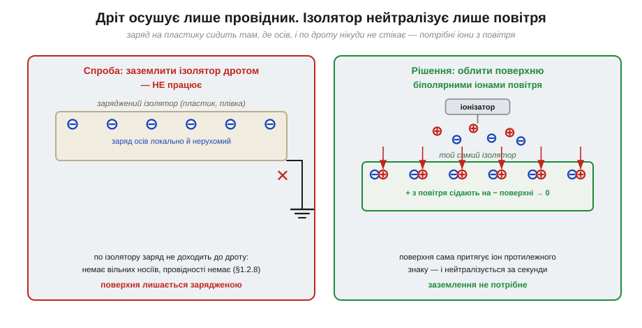
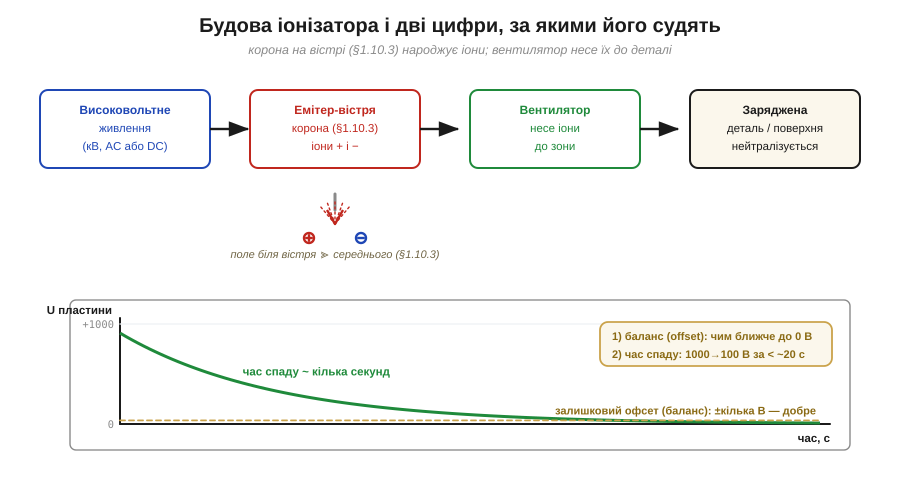

# 🔌 Іонізатор повітря: нейтралізувати заряд там, де не можна заземлити

> Браслет і мат [антистатичного робочого місця](book:electronics/antistatic-workplace) стікають заряд **через провідник** — крізь шкіру, метал, антистатичний пластик. Але половина деталей на столі **не провідники**: корпус приладу, котушка скотчу, захисна плівка дисплея, сама плата без оголеного металу. До ізолятора дріт не причепиш — заряд сидить там, де осів, і нікуди по ньому не тече. Саме на цей випадок є **іонізатор повітря** (*air ionizer*).

### Що це за клас

Іонізатор — це **активний нейтралізатор статики**: маленький прилад, що робить з повітря джерело рухомих зарядів обох знаків. Чому без нього не обійтися, видно з межі заземлення: воно прибирає заряд **тільки з того, що проводить**. Ізолятор же тримає заряд локально (немає вільних носіїв — немає й провідності, як у [діелектриках](book:physics/conductors-insulators)), і єдиний спосіб його зняти — піднести **протилежні заряди ззовні**. Саме їх іонізатор і постачає по повітрю.


*Рис. Ліворуч: заряд на пластику не доходить до заземлювального дроту — стікати нічим. Праворуч: потік біполярних іонів накриває поверхню, і заряджені ділянки самі притягують іон протилежного знаку, аж поки не стануть нейтральними. Заземлення тут ні до чого.*

### Блок-схема: звідки беруться іони

Звідки ж прилад бере ці іони? Його серце — **корона** (*corona discharge*) на гострому вістрі, та сама фізика [пробою повітря](book:physics/air-breakdown), що й у громовідводу. На емітер подають **кіловольти**; біля вістря радіус малий, тож поле там у кілька разів вище за середнє і рве молекули повітря на іони, не доходячи до повного пробою-іскри. Далі **вентилятор** (у настільних «обдувачах») жене цю іонізовану хмару до робочої зони; у стельових та компактних моделях іони розходяться самі.


*Рис. Високовольтне живлення → корона на вістрі (іони + і −) → потік повітря → заряджена деталь. Унизу — як це міряють пластиною-мішенню: важливі дві цифри — **час спаду** (як швидко напруга падає до нуля) і **баланс**, тобто на яку напругу прилад сідає сам.*

Ключова вимога — **біполярність**: іонізатор має давати **порівну** додатних і від'ємних іонів. Тоді поверхня сама «вибирає» з потоку іон потрібного знаку: додатна ділянка притягне від'ємні іони, від'ємна — додатні, і кожна нейтралізується незалежно. У змінному (*AC*) типі знаки чергуються в часі на одному вістрі; у постійному (*DC*) — окремі емітери на + і −, інколи імпульсами.

### Розпіновка й підключення

З погляду користувача це **майже не компонент, а прилад**: на вході — низьковольтне живлення (часто 5–24 В чи мережа через адаптер), усередині — підвищувач до кіловольтів. Назовні високовольтні дроти **не виводять** — там небезпечна напруга. Корпус приладу заземлюють на ту саму спільну «землю» столу, що й [антистатичний мат](book:electronics/antistatic-workplace), щоб струм корони мав куди повертатися. Більших «шин даних» немає; складніші моделі дають хіба сигнал тривоги «потрібне чищення/калібрування».

### «Перший байт»

Заговорити до іонізатора — це не команда по шині, а **ввімкнути живлення й націлити потік** на ізолятор, який не вдається зняти інакше:

```
1. подати живлення (вентилятор загув, корона тихо шипить)
2. спрямувати обдув на заряджену деталь, відстань ~0.3–0.6 м
3. витримати кілька секунд — стільки, скільки триває «час спаду»
4. перевірити поверхню вимірювачем поля; має впасти до ~0
```

Якщо чути тихе сичання корони й легкий запах озону — прилад працює.

### Типові граблі

- **Розбалансований потік.** Якщо + і − не порівну, прилад сам **залишає** на поверхні залишковий заряд (offset). Тому баланс періодично перевіряють пластиною-мішенню і калібрують.
- **Брудні вістря.** Корона осаджує на емітери пил і нагар; забруднене вістря іонізує гірше й порушує баланс. Вістря чистять за графіком.
- **Озон.** Корона побічно дає **озон** (*ozone, O₃*) — у малих дозах дратує дихання. Зону провітрюють; беруть моделі з низькою емісією.
- **Заміна заземленню — ні.** Іонізатор **доповнює**, а не замінює браслет і [мат робочого місця](book:electronics/antistatic-workplace). Провідні речі заземлюють напряму; іонізатор — для ізоляторів, до яких дроту не причепиш.
- **Повільно — отже, замало.** Якщо час спаду великий (десятки секунд), потік слабкий або вістря брудні: деталь устигне розрядитися крізь чутливий вузол раніше, ніж її нейтралізує повітря.

### Варіації класу

Бувають **настільні обдувачі** (вентилятор + кілька вістер — на одне робоче місце), **стельові смуги** (накривають іонами цілу лінію), **пістолети-обдувачі** зі стиснутим повітрям (здувають і нейтралізують пил водночас) і компактні **точкові** іонізатори на конвеєрах. За принципом їх ділять на **AC** (одне вістря, знаки по черзі), **DC-біполярні** (роздільні емітери) та **імпульсні** (керують часом і часткою кожного знаку). Спільне в усіх одне: де заземлити **нічого**, заряд знімають не дротом, а зустрічними іонами з повітря.

> 🔧 **Навіщо це.** Щойно на столі з'являється заряджений **ізолятор** — корпус, плівка, скотч, плата без оголеного металу — браслет і [мат](book:electronics/antistatic-workplace) безсилі: стікати нічим. Тоді в хід іде іонізатор: він обливає поверхню біполярними іонами (корона — [пробій повітря](book:physics/air-breakdown)), і та сама нейтралізується за секунди — без жодного дроту. Дивишся на дві цифри: баланс (щоб не лишав свого заряду) і час спаду (щоб устигав до того, як деталь розрядиться через чутливий вузол).
