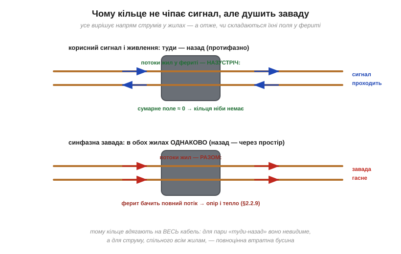
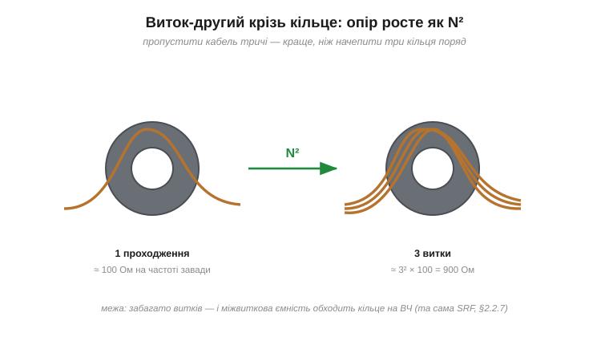

# 🔌 Феритове кільце на кабелі: навіщо «бочечка» на USB-шнурі

> Каталог «Компоненти» · сектор `passive`.

### Клас компонента

Феритовий циліндр, крізь який проходить **увесь кабель**: литий незнімний (його заформовують у шнур на виробництві) або знімна защіпка (*snap-on clamp*) із двох половинок у пластиковому замку — її можна начепити на будь-який кабель за секунду. Матеріал — той самий утратний [NiZn-ферит](book:electronics/ferrite-beads), розрахований на десятки-сотні мегагерців.

### Ключ: протифазне проти синфазного

Корисний сигнал і живлення течуть кабелем **парою**: туди однією жилою, назад іншою. Такі струми звуть **протифазними** (*differential mode*): у кожну мить вони рівні й протилежні. А отже, їхні магнітні поля у фериті — теж рівні й протилежні: сумарний потік **нуль**, і кільце для корисного струму просто не існує — ні індуктивності, ні втрат.

Завада ж поводиться інакше. Вона наводиться чи випромінюється кабелем **як цілим**: струм у всіх жилах тече **в один бік**, а повертається через землю й паразитні ємності простору. Це **синфазний** струм (*common mode*) — той самий, що його душить [синфазний дросель](book:electronics/inductor-types). Для нього поля всіх жил у фериті **додаються**: кільце бачить повний потік і вмикається на повну — [опір і втрати фериту](book:electronics/ferrite-beads) перетворюють енергію завади на тепло.

*Рис. Та сама пара жил крізь те саме кільце. Для струму «туди-назад» потоки жил скасовуються — ферит невидимий, сигнал проходить. Для струму, спільного всім жилам, потоки додаються — і ферит працює втратною бусиною. Тому кільце вдягають на весь кабель, а не на окрему жилу.*

Звідки береться синфазний струм у житті: плата всередині пристрою шумить фронтами й перетворювачем, «земля» пристрою гойдається — і кабель, як антена, випромінює цей шум назовні; або навпаки, зовнішнє радіополе наводить однаковий струм у всіх жилах. Кільце біля виходу кабелю з корпуса працює в обидва боки: не випускає власний шум (заради норм випромінювання) і не впускає чужий.

### Скільки воно дає — і як отримати більше

Одне проходження кабелю крізь типову защіпку — це десятки-сотні ом для синфазного струму на частотах у десятки-сотні мегагерців (читається з кривої в даташиті, як у будь-якої [феритової бусини](book:electronics/ferrite-beads)). Якщо цього мало, кабель пропускають крізь кільце **кілька разів**: поле кожного витка додається, і опір росте приблизно як **N²** (та сама квадратична логіка, що в [індуктивності котушки](book:electronics/inductance)).

*Рис. Три витки замість одного проходження — приблизно вдев'ятеро більший опір заваді. Це майже завжди вигідніше, ніж кілька кілець уряд. Межа — міжвиткова ємність: забагато витків, і ВЧ-завада обходить кільце повз ферит.*

**Приклад.** Защіпка дає 100 Ом на 100 МГц за одне проходження. Три витки: ≈ 9 × 100 = **900 Ом** — синфазна завада послаблюється на порядок сильніше, і все це безплатно, без жодної зміни в схемі пристрою.

### Защіпка як інструмент діагностики

Знімна защіпка — улюблений інструмент налагодження електромагнітної сумісності. Пристрій «фонить» на вимірюваннях чи глючить біля радіопередавача? Начепіть кільце на підозрілий кабель: якщо стало краще — завада синфазна й тікає саме цим шляхом, і тепер відомо, де лікувати по-справжньому (фільтр на платі, екран, земля). Якщо не допомогло — шлях інший, шукаємо далі. Дешевий експеримент, що заміняє годину гадань.

### Типові граблі

- **Чекати порятунку від гулу 50 Гц.** Кільце працює на мегагерцах; мережевий гул, пульсації живлення й «фон» в аудіо воно не чіпає — це не його частоти.
- **Кільце на одній жилі пари.** Тоді воно бачить повний потік і корисного струму теж — сигнал гасне разом із завадою (деталь перетворюється на звичайну [послідовну бусину](book:electronics/ferrite-beads) з усіма наслідками для фронтів).
- **Нещільно закрита защіпка.** Зазор у магнітному шляху різко зменшує ефект ([зазор «розмагнічує» осердя](book:electronics/inductance)) — половинки мають зімкнутися чисто, без бруду й перекосу.
- **Десять витків «про запас».** Міжвиткова ємність шунтує кільце на високих частотах — ефект може навіть погіршати. Два-чотири витки — практична стеля.

### Варіації класу

Литі «бочечки» на готових шнурах, снап-он защіпки всіх діаметрів, плоскі ферити для шлейфів і навіть кільця, крізь які мотають кілька витків прямо на платі. А компонентна рідня в корпусі — [**синфазний дросель**](book:electronics/inductor-types) із двома обмотками на спільному осерді: той самий принцип «протифазне проходить, синфазне гасне», лише виконаний як деталь для монтажу. Побачивши будь-кого з цієї родини, ви тепер знаєте і що він робить, і чому сигналу від нього не гірше.
