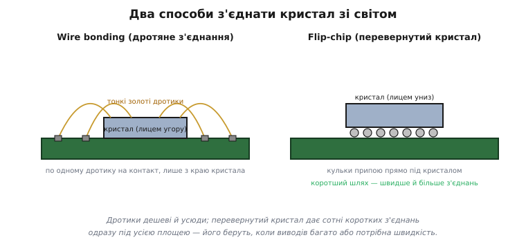
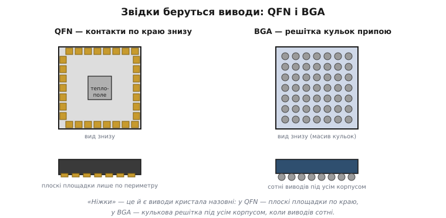
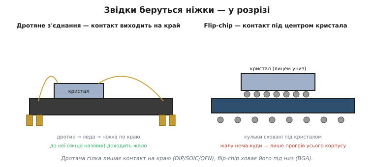

# Корпусування у деталях: від дротика до 3D-стека

Базовий розбір [корпусування](book:electronics/packaging) показує суть: кристал вкладають у корпус, виводять контакти назовні, з'єднання роблять дротиком або перевернутим кристалом, а виводи виходять по краю (QFN) чи решіткою (BGA). Тут — другий шар: **чому** кожне рішення саме таке, де його межа, скільки тепла й виводів воно дає в числах, і чому за останнє десятиліття цей «механічний» крок став однією з головних арен боротьби за продуктивність — настільки, що сучасний прискорювач для штучного інтелекту визначається радше своїм корпусом, ніж окремим кристалом.

Нитка проста: спершу два способи з'єднати кристал розберемо до фізики й чисел; тоді пройдемо повний спектр корпусів і зрозуміємо, чому крок виводів падає саме так; далі — тепловий шлях від кристала назовні з конкретним опором у градусах на ват; і нарешті — складання кількох кристалів в одному корпусі: інтерпозер, наскрізні канали крізь кремній, стек пам'яті, корпусування без підкладки й те, чому проста гонитва за меншим транзистором поступилася місцем розумному складанню.

## Дротяне з'єднання: фізика «пришивання» дротика

Дротяне з'єднання (англ. *wire bonding* — «дротяне зварювання») здається грубим поряд із нанометровою літографією, але саме воно тримає близько 90 % усіх мікросхем у світі — і не випадково. Розберімо, що насправді відбувається, коли машина «пришиває» дротик.

Кристал спершу приклеюють тильним боком до основи корпусу — до мідної рамки-**леди** (англ. *leadframe*, від *lead* — «вивід» і *frame* — «рамка»), майбутніх ніжок. Тоді капіляр — тонка трубка з дротиком усередині — підводить кінчик дроту до контактної площадки кристала, і з'єднання робиться **не паянням, а зварюванням у твердій фазі**: метал дроту й метал площадки зчіплюються під дією тиску, ультразвукового тремтіння й (часто) тепла, без розплаву. Класична техніка — *термозвук* (англ. *thermosonic*): кінчик золотого дроту оплавляють у кульку, притискають до площадки нагрітого кристала, додають ультразвук — і атоми двох металів дифундують один в одного, утворюючи суцільний контакт. Капіляр піднімається, веде дріт дугою до виводу на леді, робить там друге, видовжене з'єднання — і відрізає дріт. Уся ця послідовність триває **мілісекунди**; сучасна машина робить десятки з'єднань за секунду, тисячі за хвилину.

Чому золото, мідь чи алюміній? Усі троє добре зварюються в твердій фазі й не іржавіють так, щоб контакт деградував. Золото найзручніше (м'яке, не окиснюється, ідеально утворює кульку), але дороге, тож індустрія масово перейшла на **мідь** — дешевшу й з кращою провідністю, ціною складнішого процесу (мідь твердіша й окиснюється, тому зварювати її доводиться в захисній атмосфері). Алюмінієвий дріт (товстий) живе там, де течуть великі струми, — у силових корпусах.

Тепер дві межі, які з цієї механіки **неминуче** випливають.

**Межа периметра.** Дротик іде від площадки кристала вгору й убік до леди. Дотягтися капіляром можна лише до площадок **по краю** кристала — у глиб поля він не залізе, бо там немає куди вивести дріт, не зачепивши сусідні. Отже, всі площадки під дротяне з'єднання шикуються в один (іноді два) ряди по периметру. А периметр квадрата зі стороною L росте як 4L — **лінійно**. Подвоїш кристал — периметр лише подвоїться, тоді як площа (де живуть транзистори) учетвериться. Складному кристалу з тисячами потрібних виводів периметра просто не вистачить.

**Межа індуктивності.** Кожен дротик — це петля проводу кілька міліметрів завдовжки, що висить у повітрі дугою. Така петля має **паразитну індуктивність** — приблизно 1 нГ на міліметр довжини. На низьких частотах це дрібниця, але згадаймо, що індуктивність опирається швидкій зміні струму (напруга на ній V = L·dI/dt). Коли по виводу живлення сотні транзисторів одночасно перемикаються за десятки пікосекунд, dI/dt величезне, і навіть кілька наногенрі дають помітний стрибок напруги — «дзвін» на шині живлення. Тому на найвищих частотах і найбільших струмах довгий дротик стає вузьким місцем.

> 🔧 **Навіщо це.** Обидві межі пояснюють, чому той самий кристал у дротяному корпусі (QFN) дешевший і повільніший за себе ж у flip-chip BGA. Якщо проєктуєте щось на високій частоті чи з різкими імпульсами струму, довгі дротики корпусу — реальне джерело завад на живленні; короткі виводи (flip-chip, LGA) тут виграють не «на папері», а вимірювано.

## Flip-chip: чому перевернути вигідно — і чим за це платять

Flip-chip (англ. *flip* — «перевертати», *chip* — «кристал») розриває обидві межі одним рухом — кристал перевертають контактами вниз. Розберімо чому.

На кожну площадку кристала ще на пластині вирощують маленький горбик припою — **кульку** (англ. *bump* — «горбик»). Тоді кристал перевертають лицем униз і саджають прямо на підкладку, сумістивши кульки з її контактними майданчиками; у печі всі кульки розплавляються разом і застигають, з'єднавши кристал із підкладкою сотнями коротких стовпчиків одночасно. Сам розплав ще й **самоцентрує** кристал: поверхневий натяг рідкого припою стягує кульку точно на майданчик, виправляючи невелике зміщення.

Що це дає, видно з тих самих двох меж, тільки навпаки.

**Площа замість периметра.** Кульки можна ставити по **всій** нижній поверхні кристала, не лише по краю, — адже з'єднання йде прямо вниз, нікуди не треба «вести дріт убік». Кількість контактів тепер обмежена не периметром, а площею: для кроку p на стороні L це (L/p)² замість 4·(L/p). Відрив — на порядок (точні числа — нижче, у розборі QFN проти BGA).

**Короткий шлях замість дуги.** З'єднання — стовпчик припою кілька десятків мікронів заввишки, а не дротик кілька міліметрів. Індуктивність, опір і ємність падають у рази: швидше, менше «дзвону», краще з живленням. І ще один бонус — **тепловий**: тильна сторона перевернутого кристала тепер дивиться вгору, нічим не закрита, і на неї можна просто покласти радіатор. У дротяному корпусі між кристалом і радіатором завжди стоїть тіло корпусу; у flip-chip кристал гріє радіатор майже напряму.

За все це платять **складністю й крихкістю**. Нанести тисячі однакових кульок, ідеально сумістити кристал, рівномірно пропаяти, проконтролювати приховані з'єднання — усе це дорожче й вибагливіше за дротяне зварювання. Є й окрема механічна біда: кремній кристала й органічна підкладка **по-різному розширюються від тепла** (різний коефіцієнт теплового розширення). Кристал нагрівся-охолов — і кульки на краю, де різниця ходу найбільша, втомлюються й тріскають. Лік — **підлив** (англ. *underfill*, «заливка знизу»): під кристал затягують рідку смолу, яка застигає й «зшиває» кристал із підкладкою в одне ціле, розподіляючи напругу по всій площі, а не лише по кульках. Без підливу великий flip-chip не пережив би й кількох тисяч теплових циклів.


*Дротяне з'єднання тягне по дротику від кожної площадки лише з краю кристала; flip-chip ставить кульки по всій площі прямо під кристалом — коротший шлях і на порядок більше контактів.*

> 🔧 **Навіщо це.** Підлив — не екзотика з фабрики, а причина, чому BGA на платі не можна безкарно перегрівати й вигинати: тріщина в кульці під центром корпусу не видно оком, лише рентгеном, і проявляється вона як плавучий, «то є то нема» контакт. Знаючи про різницю розширення, ви розумієте, навіщо великі BGA додатково підклеюють по кутах (*corner bond*) і чому їх не люблять ставити на плати, що гнуться.

## Повний спектр корпусів і чому крок виводів падає

Між старим DIP і сучасним BGA лежить ціла еволюційна драбина, і вона рухається в один бік: **менше місця, дрібніший крок, більше виводів, ближче до кристала**. Пройдемо її, тримаючи в голові, що форму ніжок диктує спосіб з'єднання всередині.

**Наскрізний монтаж (through-hole).** Найстарше — DIP (англ. *dual in-line package*, «корпус із двома рядами виводів»): два ряди товстих ніжок, що прошивають плату наскрізь, крок аж **2.54 мм** (рівно одна десята дюйма — спадок дюймової сітки). Ніжки міцні, припій сам затягується в металізований отвір, деталь тримається механічно. Платою за дружність до рук є розмір: 2.54 мм на вивід — це величезна площа під будь-яку скільки-небудь складну мікросхему, тож наскрізний монтаж лишився для простого, силового й макетного.

**Поверхневий монтаж (SMD, англ. *surface-mounted device* — «прилад поверхневого монтажу»).** Корпус більше не прошиває плату, а лягає контактами на її поверхню — це звільняє внутрішні шари плати від отворів і дозволяє монтаж з обох боків. Драбина всередині SMD:

- **SOIC / SOP** — пласкі ніжки-«крила» (англ. *gull-wing* — «крило чайки», за формою згину) обабіч, крок **1.27 мм** (половина дюймової десятки). Відкриті, паяти легко.
- **SSOP / TSSOP** — те саме, але стиснене й тоншає: крок **0.65 / 0.5 мм**.
- **QFP** (англ. *quad flat package* — «квадратний плаский корпус») — крила вже з **усіх чотирьох** боків (квадрат), крок **0.5–0.8 мм**, до сотень виводів. Перехід від двох сторін до чотирьох — перший спосіб «втиснути» більше виводів: периметр виріс із 2L до 4L.
- **QFN** (англ. *quad flat no-lead* — «квадратний плаский без виводів») — крила прибрали зовсім, лишилися плоскі майданчики знизу по краю плюс теплове поле посередині, крок **0.4–0.5 мм**. Без ніжок корпус менший і нижчий, індуктивність виводу — менша. Жало під корпус уже не лізе.
- **BGA** (англ. *ball grid array* — «решітка кульок») — виводи з краю переїхали під усю нижню площу у вигляді кульок, крок **0.5–1 мм**. Це вже не «втиснути більше по краю», а зміна геометрії: периметр → площа.

Чому крок узагалі падає драбиною, а не плавно? Бо кожне зменшення впирається у дві стіни. Перша — **виробництво корпусу**: дрібніший крок вимагає тоншого дроту, точнішого позиціонування, кращого друку кульок. Друга, і часто головніша, — **плата**: контакти корпусу треба ще розвести доріжками. Між двома сусідніми майданчиками з кроком 0.5 мм має пролізти доріжка, а її ширина й зазор обмежені класом точності плати. Тож крок корпусу не може бути дрібнішим, ніж дозволяє плата під ним; саме плата, а не кристал, часто ставить нижню межу.


*QFN виводить контакти плоскими площадками по краю знизу (плюс теплове поле); BGA — решіткою кульок по всій нижній площі. Перше впирається в периметр, друге користується площею.*

### Worked-приклад: периметр, площа і коли BGA неминучий

Порахуймо, на якій кількості виводів дротяний край здається. Візьмемо реальний мікроконтролер, якому треба, скажімо, 180 виводів (живлення, земля, дві шини пам'яті, периферія). Скільки вийде на QFN із кроком 0.5 мм і на BGA?

```
Дано: треба N = 180 виводів, крок p = 0.5 мм.

QFN (по периметру, сторона L_q):
  виводів = 4 · (L_q / p)
  180 = 4 · (L_q / 0.5)  →  L_q = 180 · 0.5 / 4 = 22.5 мм сторона

BGA (по площі, сторона L_b):
  виводів = (L_b / p)²
  180 = (L_b / 0.5)²  →  L_b / 0.5 = √180 ≈ 13.4  →  L_b ≈ 6.7 мм сторона

Площа на платі:
  QFN: 22.5 × 22.5 ≈ 506 мм²
  BGA:  6.7 ×  6.7 ≈  45 мм²   (у ~11 разів менше)
```

QFN на 180 виводів був би абсурдним квадратом 22 мм у боці — майже сірникова коробка заради однієї мікросхеми. Той самий кристал у BGA сідає в 6.7 мм. Ось чому за кілька сотень виводів вибору вже немає: периметр фізично не вміщає контакти в розумний розмір, і всі складні чипи живуть у BGA. А обернено: для 20–40 виводів BGA був би марнотратством (дрібний корпус важко паяти, прихований монтаж), і там безроздільно панує QFN. Драбина не примха — вона прямо випадає з того, що периметр росте як √площі.

## Тепловий шлях: куди дівається ват і що таке Θ-JA

Корпус — це ще й **тепловий міст**. Кристал виділяє потужність на крихітній площі, і якщо тепло не відвести, температура кристала (її звуть *температурою переходу*, англ. *junction temperature*, бо історично грілися p-n-переходи) злетить за межу, де кремній деградує чи горить (зазвичай 125–150 °C). Питання — наскільки гаряче стане кристалу за дану розсіювану потужність. На це відповідає **тепловий опір**.

Аналогія точна й корисна: тепловий потік поводиться як струм, різниця температур — як напруга, тепловий опір — як електричний. Закон той самий, що Ом:

```
ΔT = P · θ

ΔT — перегрів (°C),  P — розсіювана потужність (Вт),
θ — тепловий опір (°C/Вт)
```

Найуживаніша цифра в даташиті — **Θ-JA** (англ. *theta junction-to-ambient* — «від переходу до довкілля»): на скільки градусів кристал гарячіший за навколишнє повітря на кожен розсіюваний ват. Чим менше Θ-JA, тим краще корпус «дихає». Порядок величин прямо за драбиною корпусів:

```
Корпус            Θ-JA (приблизно)
DIP / SOIC        90–100 °C/Вт      (тепло йде лише через тонкі ніжки)
QFP               ~40 °C/Вт
QFN з тепл. полем 15–40 °C/Вт       (поле під низом — широкий канал тепла)
BGA (PBGA)        10–30 °C/Вт
flip-chip BGA     < 10 °C/Вт        (радіатор майже на голому кристалі)
```

Видно фізику: у DIP/SOIC єдиний шлях тепла — крізь тонкі металеві ніжки, тому опір великий; кристал на ваті стане на цілих 90 °C гарячіший за повітря. У QFN під кристалом є велике мідне **теплове поле** (англ. *thermal pad*), припаяне до плати, — широкий канал, що скидає тепло прямо в мідь плати, тому опір у рази менший. У flip-chip радіатор сидить майже на самому кристалі — звідси найнижчі цифри.

### Worked-приклад: чи виживе чіп без радіатора

Регулятор у QFN розсіює 1.5 Вт. Θ-JA = 30 °C/Вт, довкілля 40 °C (усередині корпусу пристрою). Гарячіше за 125 °C кристалу не можна.

```
ΔT = P · Θ-JA = 1.5 · 30 = 45 °C
T_кристала = T_довкілля + ΔT = 40 + 45 = 85 °C
Запас до межі: 125 − 85 = 40 °C  →  норм, але без запасу на спеку
```

85 °C — прийнятно. Та якщо теплове поле QFN **не** припаяти до полігона міді на платі, Θ-JA для того самого корпусу легко зросте до 60–70 °C/Вт (тепло нікуди йти, крім тонких бічних площадок), і тоді:

```
ΔT = 1.5 · 65 = 97.5 °C  →  T_кристала = 40 + 97.5 = 137.5 °C  →  ЗА МЕЖЕЮ
```

Той самий чіп, та сама потужність — і перегрів лише через те, що мідного «радіатора» під ним немає. Звідси практичне правило.

> 🔧 **Навіщо це.** Θ-JA у даташиті завжди наведений **за конкретних умов плати** (скільки міді, скільки перехідних отворів під полем). Це не властивість самого корпусу — це властивість пари «корпус + ваша плата». Тому теплове поле QFN треба свідомо саджати на полігон міді й прошивати його перехідними отворами (via) у внутрішній шар-радіатор: без цього паспортний Θ-JA недосяжний, і потужний чіп перегрівається саме там, де даташит обіцяв запас. Це пряма дія в розведенні, а не абстракція.

## Складання кількох кристалів: інтерпозер, TSV, стек

Доти корпус був «коробкою для одного кристала». Передове складання (англ. *advanced packaging*) перевертає цю роль: корпус стає **ареною**, де поруч чи один на одному живуть **кілька** кристалів, з'єднаних так щільно й коротко, як на платі ніколи не вийде. Розберімо інструменти цієї арени.

**Чиплет** (англ. *chiplet*, зменшувальне від *chip* — «маленький кристал») — це не цілий «процесор», а окремий функціональний блок (ядра, кеш, контролер пам'яті, ввід-вивід), зроблений окремим кристалом, щоб потім зібрати його з іншими в одному корпусі. Замість одного велетенського монолітного кристала — набір малих, кожен оптимальний під своє.

**Інтерпозер** (англ. *interposer*, від лат. *interponere* — «вкладати поміж») — тонка проміжна підкладка (часто кремнієва), на яку кристали саджають **поруч**, і в якій прокладено густу мережу дуже тонких доріжок між сусідами. Кристали спілкуються не через грубі доріжки органічної плати, а через нанометрові лінії в кремнії — тисячі паралельних з'єднань на коротесенькій відстані. Така схема «кристали на інтерпозері, інтерпозер на підкладці» зветься **2.5D** — бо кристали лежать в одній площині (як 2D), але з'єднані через окремий кремнієвий шар (натяк на 3D). Промисловий приклад — CoWoS (англ. *Chip-on-Wafer-on-Substrate*, «кристал-на-пластині-на-підкладці»), на якому збирають великі прискорювачі для штучного інтелекту.

**Наскрізний канал крізь кремній** — TSV (англ. *through-silicon via* — «перехідний отвір крізь кремній») — це мідний стовпчик, проведений **наскрізь** через тіло кристала, з лиця на спід. Він дозволяє складати кристали **один на одного** й з'єднувати їх вертикально найкоротшим можливим шляхом — це **3D**-стек. Зробити TSV непросто: пластину доводиться стоншувати, протравлювати глибокі вузькі колодязі й заповнювати їх міддю без пустот, а самі канали створюють механічну напругу в кремнії — тому це дорогий і вибагливий процес.

**Стек пам'яті (HBM).** Канонічний приклад 3D — HBM (англ. *high-bandwidth memory*, «пам'ять високої пропускної здатності»): кілька кристалів DRAM, поставлених стосом і прошитих тисячами TSV. Такий стос ставлять **поруч** із процесором на спільному інтерпозері (тобто 2.5D-збірка, що містить 3D-стек пам'яті). Виграш — у ширині шини: коли пам'ять за кілька міліметрів від ядра й з'єднана тисячами ліній, пропускна здатність вимірюється терабайтами за секунду, а енергія на біт падає, бо сигнал долає міліметри, а не сантиметри плати.


*Той самий принцип «коротше — краще» масштабується вгору: від кульки під кристалом до TSV крізь кристал і густих ліній в інтерпозері між сусідніми кристалами.*

## Корпусування без підкладки: fan-out

Окрема й важлива гілка — **fan-out** (англ. *fan-out* — «розведення віялом»), точніше fan-out на рівні пластини (FOWLP, англ. *fan-out wafer-level packaging*). Ідея радикальна: викинути підкладку й інтерпозер зовсім.

У звичайному корпусі контакти кристала «розводять» до паяльного масштабу через окрему підкладку (а в 2.5D — ще й через інтерпозер). Fan-out робить це розведення **прямо в шарах смоли навколо кристала**: кристал заливають у штучну «пластину» з епоксиду, а поверх неї будують **шари перерозподілу** (RDL, англ. *redistribution layer* — «шар перерозподілу») — тонкі металеві доріжки, що віялом розводять контакти кристала на ширші майданчики назовні, до яких уже кріплять кульки. Підкладки немає взагалі; її роль виконують ці намальовані шари.

Що це дає, прямо випливає з викидання зайвого шару: корпус **тонший**, шлях коротший (отже, менша індуктивність і **нижчий тепловий опір**, ніж у flip-chip BGA з товстою підкладкою), а ціна — менша, бо дорогий кремнієвий інтерпозер і складні TSV не потрібні. Розплата — **механіка процесу**: коли кристали залиті у велику смоляну пластину, вони норовлять зміститися під час заливки (англ. *die shift*) і повело́ло (англ. *warpage*) усю пластину від різниці розширень. Якщо це не приборкати точним процесом, виграш у ціні з'їдається браком. Цю техніку TSMC уперше масово застосувала (під назвою InFO) у процесорі iPhone 7 (2016), і відтоді fan-out поступово витісняє класичний flip-chip там, де важать тонкість і ціна, — у мобільних і носимих пристроях.

## Чому корпус став вузьким місцем

Лишилося головне «чому»: чому весь цей складний звіринець — інтерпозери, стеки, fan-out — раптом став центром уваги саме тепер. Відповідь — у зіткненні трьох стін, у які вперлося звичне [зменшення транзистора](book:electronics/process-node).

**Стіна перша — межа ретикули.** Літографія засвічує кристал крізь маску-ретикулу, і максимальне поле, яке вона може засвітити за раз, обмежене оптикою — приблизно **800 мм²**. Це жорстка фізична стеля: більший за неї монолітний кристал просто не виготовити одним засвіченням. А апетити сучасних прискорювачів давно вперлися в цю межу — топові кристали йдуть упритул до ~800 мм². Хочеш більше логіки, ніж влазить у ретикулу, — мусиш брати **кілька** кристалів і зшивати їх у корпусі.

**Стіна друга — [вихід придатних](book:electronics/yield).** Дефекти на пластині розподілені більш-менш рівномірно, тож імовірність, що великий кристал виявиться без жодного дефекту, падає **експоненційно** з його площею. Один кристал 800 мм² має куди гірший вихід (і шалену ціну за придатний), ніж чотири по 200 мм², зібрані разом. Розбити велике на чиплети — це прямо купити собі вищий вихід.

**Стіна третя — змішування процесів.** Найновіший і найдорожчий техпроцес виправданий для швидкої логіки, але марнотратний для блоків, що від нього нічого не виграють (аналог, ввід-вивід, велика пам'ять). На монолітному кристалі все мусить бути на одному процесі. Чиплети ж дозволяють зробити швидку логіку на передовому вузлі, а решту — на дешевшому зрілому, і поєднати в одному корпусі, не переплачуючи за все.

Три стіни штовхають в один бік: розбивати систему на кристали й **збирати її в корпусі**. Тому корпусування з останнього механічного кроку перетворилося на повноцінний рівень архітектури — місце, де тепер виграють пропускну здатність, вихід і вартість. Сучасний прискорювач для штучного інтелекту — це по суті **два кристали логіки на межі ретикули плюс стоси HBM, зшиті на одному інтерпозері**; його визначає корпус не менше, ніж кристал. Те, що десятиліттями давало просте зменшення транзистора, дедалі частіше дає розумне складання.

> 🔧 **Навіщо це.** Навіть якщо ви не проєктуєте прискорювачів, ця логіка пояснює, що ви бачите на платах: чому потужні чипи приходять у великих BGA з тепловою кришкою, чому пам'ять у телефоні часто складена стосом просто на процесорі (англ. *package-on-package*), і чому «той самий» кристал у різних корпусах коштує по-різному. Корпус — це не упаковка наприкінці, а інженерне рішення нарівні зі схемою.

---
