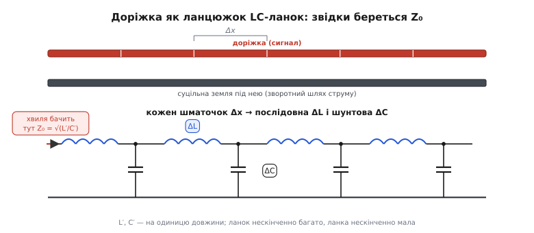
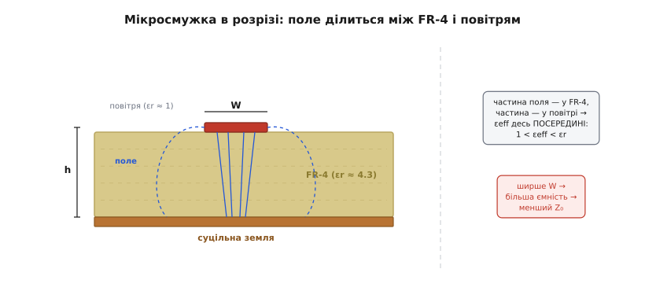
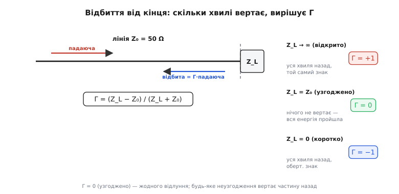

# Стек PCB і характеристичний опір мікросмужки

<preknowlist>
- [Індуктивність](book:electronics/inductance) — L як «інерція» струму: опір **зміні** струму.
- [Ємність](book:electronics/capacitance) — C як здатність накопичити заряд на різниці потенціалів.
- [Реактивність](book:electronics/reactance) — опір котушки й конденсатора змінному струму (реактанс jωL і 1/(jωC)).
</preknowlist>

На платі мідь, якою з'єднані деталі, — сама деталь. Кожна доріжка має маленький опір, поводиться як крихітна котушка, а пара сусідніх смужок міді — як крихітний конденсатор. На постійному струмі ці приховані елементи невидимі. Але щойно доріжкою біжить швидкий фронт — тактовий сигнал на сотні мегагерц, шина пам'яті, USB — вони оживають, і доріжка перестає бути «дротом із паразитами».

Вона стає **лінією передачі**: об'єктом із власною величиною, якої не має ані резистор, ані конденсатор, ані котушка окремо. Ця величина — **характеристичний імпеданс** Z₀, і саме вона диктує, чи домчить фронт до приймача чистим, чи повернеться луною й задзвенить. А задає Z₀ не сама доріжка, а **стек плати** — те, як укладені мідні шари й діелектрик між ними: саме звідси беруться ширина доріжки, висота над найближчою землею й діелектрик, від яких усе залежить.

Мета цієї статті конкретна: **вивести Z₀ = √(L/C) з першопринципів** — із тих самих погонних L і C, які насправді має кожна доріжка, — дати робочу інженерну формулу для мідної смужки на платі, і зрозуміти, чому неузгоджений кінець відбиває сигнал і звідки взялося магічне число 50 Ω.

> 🔧 **Навіщо це.** Поки доріжка коротка проти довжини фронту, її можна лишити «дротом» — і 90 % плат так і розводять. Але щойно ви ведете тактовий сигнал 100 МГц, шину пам'яті чи USB — доріжка стає лінією передачі, і якщо її Z₀ не той, приймач бачить не чистий перепад, а дзвін із перельотами вище живлення. Уміти порахувати Z₀ доріжки з її ширини й висоти над землею — це різниця між платою, що працює з першого разу, і платою, яку «чомусь глючить на швидкості».

## Означення: що таке характеристичний імпеданс

Почнімо строго — з того, **що** це за число, бо назва оманлива. «Імпеданс» звучить як «опір», і хочеться уявити, що доріжка чинить струму опір Z₀ ом, як резистор. Це не так, і плутанина тут дорого коштує.

Уявімо дуже довгу доріжку — таку довгу, що ми не бачимо її кінця. Прикладемо до її початку напругу й дивимося, який струм у неї потече **в перший момент**. Струм не може бути нульовим (напруга ж є), але й не нескінченним. Виявляється, відношення напруги до струму на вході такої лінії — **стала величина**, яка не залежить ані від довжини лінії, ані від того, що там на далекому кінці. Оцю сталу й називають характеристичним (хвильовим) імпедансом:

```
Z₀ = U / I  (для хвилі, що біжить лінією)
```

Ключова тонкість, заради якої й потрібне окреме поняття: **це не опір навантаження, а властивість самої лінії**. Резистор 50 Ω перетворює електричну енергію на тепло. Ідеальна лінія з Z₀ = 50 Ω **нічого не гріє** — вона лише нав'язує хвилі, що в неї входить, жорстке відношення «на кожен вольт стільки-то міліампер». Енергія не зникає: вона біжить лінією далі у вигляді хвилі напруги й струму. Лінія поводиться як резистор Z₀ **тимчасово** — рівно доти, доки хвиля не добігла до кінця й не з'ясувала, що там насправді.

Ця «тимчасовість» — не абстракція, а причина, чому драйвер спершу бачить лінію як резистор Z₀, а не як відкритий вхід приймача: інформація про далекий кінець ще летить туди зі швидкістю сигналу. Що робиться на неузгодженому кінці й чому там народжується відлуння, розберемо нижче, у розділі про відбиття; тут ми з'ясовуємо, **звідки** береться сам Z₀.

Отже, наше завдання — знайти цю сталу для мідної смужки на платі. І перший крок — визнати, що доріжка не точковий елемент, а **розподілена** система.

## Інтуїція: доріжка — це нескінченний ланцюжок LC-ланок

Ось перелом, на якому все тримається. Коли кажуть «доріжка має індуктивність L і ємність C», мовчки уявляють їх як **один** конденсатор і **одну** котушку, десь причеплені до дроту. Для короткої доріжки на повільному сигналі це годиться. Але фізично і L, і C **розмазані по всій довжині** доріжки рівномірно — кожен міліметр міді має свою частку індуктивності й свою частку ємності на землю.

Зробімо з цього модель. Поріжемо доріжку подумки на дуже короткі шматочки завдовжки Δx. Що є в одному шматочку? Дві речі:

- **Послідовна індуктивність** ΔL. Струм тече вздовж шматочка міді, довкола нього намотується магнітне поле — це і є [індуктивність](book:electronics/inductance): опір **зміні** струму. Вона послідовна, бо струм мусить пройти крізь шматочок наскрізь.
- **Шунтова ємність** ΔC. Між міддю шматочка й суцільною землею під ним є напруга, а отже й [ємність](book:electronics/capacitance): здатність накопичити заряд. Вона шунтова (поперечна), бо з'єднує сигнальну мідь із землею — вбік від напряму струму.


*Угорі — фізична доріжка над суцільною землею, поділена на однакові шматочки Δx. Унизу — та сама доріжка як електрична схема: кожен шматочок дає послідовну котушку ΔL (уздовж міді) і конденсатор ΔC на землю (від міді вниз). Ланок нескінченно багато, кожна нескінченно мала. Хвиля, що входить зліва, бачить не окремий елемент, а весь цей ланцюжок — і його вхідний опір є Z₀ = √(L′/C′).*

Ціла доріжка — це такий ланцюжок (драбина), де ланки ΔL–ΔC йдуть одна за одною, скільки завгодно разів. Це і зветься **розподіленою** моделлю, або LC-драбиною лінії передачі. (Строго кажучи, у ланці є ще послідовний опір міді R і провідність втрат крізь діелектрик G — модель тоді звуть RLGC, — але для чистої інтуїції Z₀ їх поки відкинемо: на платі до сотень мегагерців вони малі проти реактивних ΔL і ΔC. Про те, як опір міді росте з частотою, — окрема тема [скін-ефекту](book:electronics/skin-effect).)

Тепер найважливіше слово — **погонні**. Оскільки L і C розмазані рівномірно, зручно говорити не про повну індуктивність доріжки, а про індуктивність **на одиницю довжини**: скільки наногенрі припадає на метр. Позначмо їх штрихом:

```
L′ = L / довжина   (Гн/м) — погонна індуктивність
C′ = C / довжина   (Ф/м) — погонна ємність
```

Ці дві величини **не залежать від довжини** доріжки — вони визначаються тільки її **поперечним перерізом**: шириною міді, висотою над землею, товщиною й діелектриком між ними. Двометрова доріжка має вдвічі більші повні L і C, ніж метрова, але ті самі L′ і C′. Саме тому Z₀, як ми зараз побачимо, від довжини не залежить — він народжується з геометрії перерізу, тобто зі стека плати.

## Формальний апарат: виводимо Z₀ = √(L′/C′)

Тепер від інтуїції — до виведення. Хочемо знайти вхідний опір нескінченної LC-драбини. Є два способи дійти до відповіді: короткий (самоподібність) і довгий (хвильове рівняння). Пройдімо обидва — короткий дає число за півхвилини, довгий показує, **чому** це число ще й швидкість хвилі задає.

### Спосіб самоподібності: нескінченне не змінюється, якщо відкусити ланку

Ось трюк, гарний саме тим, що не вимагає жодного інтеграла. Нехай вхідний опір нескінченної драбини є Z₀ (він існує — ми його щойно означили). Тепер відкусимо від початку **одну** ланку: послідовну ΔL і шунтову ΔC. Те, що лишилося, — знову **нескінченна** драбина, точно така сама. Отже, її вхідний опір теж Z₀. Виходить самоузгоджене рівняння: повна драбина = одна ланка + така сама повна драбина.

Запишімо це на мові імпедансів (у гармонічному режимі з частотою ω, де реактанс котушки jωL, а конденсатора 1/(jωC)). Вхідний опір = послідовна котушка, а далі паралельно з'єднані конденсатор ланки й уся решта драбини (яка знову дорівнює Z₀):

```
Z₀ = jωΔL + ( 1/(jωΔC) ∥ Z₀ )
```

де ∥ — паралельне з'єднання. Розкриймо паралель і спрямуймо ланку до нуля (Δx → 0, тобто ΔL = L′·Δx і ΔC = C′·Δx стають нескінченно малими). У цій межі член з jωΔL другого порядку малості зникає швидше, ніж решта, і після акуратного скорочення лишається напрочуд просте:

```
Z₀² = ΔL / ΔC = (L′·Δx) / (C′·Δx) = L′ / C′
```

Δx скоротився — ось де формально народжується незалежність від довжини. Звідси:

```
      ┌─────────────────┐
      │  Z₀ = √(L′/C′)  │
      └─────────────────┘
```

Це і є шуканий результат — характеристичний імпеданс лінії передачі є **корінь із відношення погонної індуктивності до погонної ємності**. Погляньмо, що він каже фізично, бо формула коротка, а сенсу в ній багато.

Індуктивність — це «інерція» струму: чим більша L′, тим важче хвилі розігнати струм, тим **менший** струм за той самий вольт, тим **вищий** Z₀. Ємність — це «місткість» для заряду: чим більша C′, тим більше заряду треба перекачати, щоб підняти напругу, тим **більший** струм тече, тим **нижчий** Z₀. Z₀ = √(L′/C′) точно ловить це протиборство: індуктивність тягне імпеданс угору, ємність — униз, а корінь бере їхнє геометричне середнє. **Вузька доріжка високо над землею** має велику L′ і малу C′ (мало міді напроти землі) → високий Z₀. **Широка доріжка близько до землі** — навпаки: мала L′, велика C′ → низький Z₀. Цей важіль — **ширше й ближче до землі = менший Z₀** — знадобиться, коли доходитимемо до проєктування доріжки під конкретний імпеданс.

### Спосіб хвильового рівняння: звідки береться швидкість

Короткий спосіб дав Z₀, але змовчав про дещо важливе — **як швидко** хвиля біжить лінією. Пройдімо трохи довшим шляхом, і вискочать обидві величини разом.

На нескінченно малій ділянці Δx запишімо два закони. Перший: напруга падає вздовж ділянки на індуктивності — це закон індуктивності u = L·(di/dt), переписаний для погонних величин. Другий: струм «стікає» з ділянки в шунтову ємність — це закон ємності i = C·(du/dt). У межі Δx → 0 вони стають парою рівнянь у частинних похідних (телеграфні рівняння без втрат):

```
∂u/∂x = −L′ · ∂i/∂t
∂i/∂x = −C′ · ∂u/∂t
```

Продиференціюймо перше по x, друге по t, підставмо одне в одне — і кожна з величин (і u, і i) задовольняє **хвильове рівняння**:

```
∂²u/∂x² = L′C′ · ∂²u/∂t²
```

А хвильове рівняння виду ∂²u/∂x² = (1/v²)·∂²u/∂t² описує збурення, що біжить зі швидкістю v без спотворення форми. Порівнявши коефіцієнти, читаємо швидкість поширення хвилі лінією:

```
v = 1 / √(L′C′)
```

Ось воно. **Добуток** L′C′ задає швидкість (як швидко фронт мчить), а **відношення** L′/C′ задає імпеданс (яке відношення напруги до струму несе хвиля). Дві незалежні комбінації тих самих двох чисел — і кожна відповідає за свій бік явища. Це не збіг: L′ і C′ вичерпно описують ідеальну лінію, тож усе про неї мусить виражатися через них. Підставивши розв'язок-хвилю u(x,t) = f(x − vt) у телеграфні рівняння, дістанемо u/i = √(L′/C′) для хвилі, що біжить уперед, — той самий Z₀, тепер уже як властивість **біжучої хвилі**, а не вхідного опору. Обидва способи узгоджені.

### Швидкість на платі: чому фронт «гальмує» в діелектрику

Швидкість v варто прив'язати до чогось знайомого. У вакуумі електромагнітна хвиля йде зі швидкістю світла c ≈ 3·10⁸ м/с. У лінії, зануреній у діелектрик, вона повільніша — бо діелектрик «в'язкий» для електричного поля. Виходить гарний зв'язок:

```
v = c / √εeff
```

де εeff — **ефективна діелектрична проникність** середовища навколо доріжки. Для доріжки, повністю зануреної в матеріал (внутрішній шар плати), εeff ≈ εr самого матеріалу. Для мідної смужки **на поверхні** плати — окрема історія: там поле живе одразу у двох середовищах, і саме до неї ми переходимо.

## Від Z₀ до геометрії: робоча формула мікросмужки

Абстрактне Z₀ = √(L′/C′) — правильне, але непридатне для роботи: ніхто не міряє L′ і C′ доріжки лінійкою. Інженер знає **геометрію**, яку задає стек: ширину міді W, висоту над землею h, товщину міді t і матеріал (εr). Треба формула, що з цих чисел одразу дає Z₀. Її й виводять — рахуючи L′ і C′ з геометрії поля, — але результат зручно взяти готовим.

Найпоширеніша на платі конфігурація — **мікросмужка** (англ. *microstrip*): доріжка на **зовнішньому** шарі, а під нею, через діелектрик, суцільний мідний полігон землі. Саме таку доріжку ми бачимо на верхньому боці будь-якої плати.


*Смужка-провідник шириною W лежить на осерді FR-4, під ним через висоту h — суцільна земля. Силові лінії електричного поля йдуть від смужки до землі двома шляхами: центральні — прямо вниз крізь FR-4 (εr ≈ 4.3), крайові — дугами крізь повітря над платою (εr ≈ 1). Тому поле «відчуває» суміш двох середовищ, і ефективна проникність εeff лягає десь посередині: 1 < εeff < εr. Ширша смужка притискає більше поля до землі — росте ємність, падає Z₀.*

Тут з'являється тонкість, якої немає у внутрішній лінії. Мікросмужка **не занурена** в FR-4 — над нею повітря. Частина силових ліній поля йде від смужки до землі крізь FR-4, а частина «випинається» вгору й замикається крізь повітря. Тому хвиля відчуває не εr = 4.3 (як у суцільному FR-4) і не εr = 1 (як у повітрі), а **суміш** — ту саму εeff, десь між одиницею й εr. Скільки саме — залежить від того, яка частка поля притиснута до плати (ширша й нижча смужка більше поля тримає в FR-4, тож ближче до εr). Практична апроксимація:

```
εeff = (εr + 1)/2 + (εr − 1)/2 · 1/√(1 + 12·h/W)
```

Для типової доріжки на FR-4 це дає εeff ≈ 3.2–3.3 — саме між повітрям і склоепоксидкою, як і має бути. А сам характеристичний імпеданс мікросмужки дає закрита формула (варіант із довідника IPC-2141, зручний для оцінки):

```
Z₀ ≈ (87 / √(εr + 1.41)) · ln( 5.98·h / (0.8·W + t) )    [Ω]
```

де W — ширина доріжки, h — висота діелектрика до землі, t — товщина міді, всі в однакових одиницях. Прочитаймо її очима, а не як магічний рядок. Логарифм від h/W означає: **тонша доріжка (менше W) або вища над землею (більше h) → більший Z₀**; ширша або нижча → менший. Це рівно той важіль, що ми вивели з √(L′/C′): ширше й ближче до землі = менша L′, більша C′ = менший Z₀. Формула лише вбирає це в числа. (Точність такої формули — кілька відсотків і лише в діапазоні W/h ≈ 0.1…2; для серйозного розведення беруть точніші формули Вілера чи Гаммерстада-Єнсена або польовий розв'язувач, але для розуміння й прикидки цієї досить. *Статус: закрита формула IPC-2141, усталений інженерний довідник; діапазон і точність задокументовані.*)

**Приклад: доріжка 50 Ω на FR-4.** Візьмімо реальну задачу — розвести на зовнішньому шарі сигнальну доріжку з Z₀ = 50 Ω. Осердя до найближчої землі тонке, h = 0.20 мм; мідь стандартна 1 oz, t = 0.035 мм; матеріал FR-4, εr = 4.3. Яка потрібна ширина W?

```
Ціль: Z₀ = 50 Ω. Підбираємо W із формули мікросмужки.

Спроба W = 0.33 мм (W/h = 1.65):
  ефективна проникність:
  εeff = (4.3+1)/2 + (4.3−1)/2 · 1/√(1 + 12·0.20/0.33)
       = 2.65 + 1.65 · 1/√(1 + 7.27)
       = 2.65 + 1.65 · 1/2.876
       = 2.65 + 0.574
       = 3.22

  імпеданс:
  Z₀ = (87 / √(4.3 + 1.41)) · ln(5.98·0.20 / (0.8·0.33 + 0.035))
     = (87 / √5.71)  · ln(1.196 / 0.299)
     = (87 / 2.390)  · ln(4.00)
     = 36.4 · 1.386
     = 50.5 Ω   ✓
```

Виходить **≈ 0.33 мм** — і це знайома цифра: типова 50-омна доріжка на тонкому FR-4 справді має ширину близько третини міліметра. Порахуймо заодно, з якою швидкістю по ній біжить фронт і скільки часу займає кожен міліметр:

```
швидкість:  v = c/√εeff = 3·10⁸ / √3.22 = 1.67·10⁸ м/с ≈ 0.55·c
затримка:   t_зат = 1/v = 6.0 пс на кожен міліметр доріжки
```

Два числа варто мати в пальцях. Сигнал на платі йде **вдвічі повільніше за світло** (≈ 0.55 c — «гальмує» діелектрик), а кожен міліметр доріжки додає **≈ 6 пс** затримки. Звідси беруться правила «довжини доріжок шини вирівнювати з точністю до міліметрів»: 10 мм різниці — це вже 60 пс розбіжності приходу, помітних для швидкої пам'яті.

### Замикаємо коло: перевірка √(L/C) на числах

Щоб апарат не висів у повітрі, зведімо обидві формули докупи й переконаймося, що вони узгоджені. З Z₀ = 50 Ω і v = 1.67·10⁸ м/с можна відновити самі L′ і C′ (бо Z₀ = √(L′/C′) і v = 1/√(L′C′) — це два рівняння на два невідомих):

```
L′ = Z₀ / v = 50 / (1.67·10⁸) = 3.0·10⁻⁷ Гн/м = 0.30 нГн/мм
C′ = 1 / (Z₀·v) = 1 / (50 · 1.67·10⁸) = 1.2·10⁻¹⁰ Ф/м = 0.12 пФ/мм

перевірка Z₀:  √(L′/C′) = √(0.30·10⁻⁹ / 0.12·10⁻¹²) = √(2500) = 50.0 Ω   ✓
перевірка v:   1/√(L′C′) = 1/√(3.0·10⁻⁷ · 1.2·10⁻¹⁰) = 1.67·10⁸ м/с   ✓
```

Погонна індуктивність доріжки — близько **0.3 нГн на міліметр**, погонна ємність — **0.12 пФ на міліметр**. Це і є та крихітна котушка й крихітний конденсатор за кожним шматочком міді — тепер із числами. Обидві формули дають той самий Z₀ і ту саму v — коло замкнулося: √(L/C) з першопринципів і закрита формула мікросмужки з геометрії описують **один і той самий об'єкт**.

Коротко про родичку мікросмужки, бо саме тут відкривається сенс *стека*. Якщо доріжку заховати **всередину** плати, між двома шарами землі (згори й знизу), — це **смужкова лінія** (англ. *stripline*). Тепер поле цілком у FR-4 (повітря немає), тож εeff = εr, а її імпеданс дає схожа закрита формула з іншими сталими:

```
Z₀ ≈ (60 / √εr) · ln( 1.9·(2h + t) / (0.8·W + t) )    [Ω]
```

де h — відстань від доріжки до кожної землі. Смужкова лінія повільніша за мікросмужку (більша εeff — усе поле в діелектрику) і краще екранована (землі з обох боків), тож швидку критичну цифру часто ведуть саме нею. Ось чому вибір шару в стеку — це вибір фізики лінії: та сама доріжка на поверхні й усередині плати має різні Z₀ і різну швидкість. Але апарат один: обидві — лінії передачі з Z₀ = √(L′/C′), різниця лише в тому, як геометрія стека задає ці L′ і C′.

## Навіщо весь цей імпеданс: фізика відбиття

Тепер — плата за всю цю математику, момент, заради якого інженери взагалі рахують Z₀. Питання руба: **чому взагалі важливо, щоб Z₀ доріжки був якийсь конкретний**? Доріжка ж проводить струм за будь-якої ширини. Відповідь — у тому, що робиться на **кінці** лінії.

Хвиля добігає лінією до навантаження — входу приймача з опором Z_L. І тут вона наштовхується на стик: до стику середовище нав'язувало їй відношення U/I = Z₀, а за стиком навантаження вимагає U/I = Z_L. Якщо Z_L ≠ Z₀, ці дві вимоги **несумісні** — хвиля не може одночасно нести відношення Z₀ і задовольнити Z_L. Природа розв'язує конфлікт єдиним способом: **частина хвилі відбивається назад**. Відбита хвиля добудовує на стику потрібне відношення напруги до струму — і біжить у зворотний бік, до джерела.

Скільки саме відбивається, задає **коефіцієнт відбиття** Γ (грецька «гамма») — відношення відбитої напруги до падаючої:

```
      ┌────────────────────────────┐
      │  Γ = (Z_L − Z₀)/(Z_L + Z₀) │
      └────────────────────────────┘
```

Ця формула — не постулат, а прямий наслідок двох законів збереження на стику: напруга по обидва боки стику однакова (це одна точка), і струм однаковий (заряд не зникає). Падаюча хвиля несе пару U_пад/I_пад = Z₀, відбита біжить назад, тож у неї U_відб/I_відб = −Z₀ (той самий модуль, обернений напрям струму), а на навантаженні повна напруга поділена на повний струм має дати Z_L. Чесно зшивши ці три умови, отримуємо саме (Z_L − Z₀)/(Z_L + Z₀). Нам досить самої формули й трьох її крайніх випадків.


*Хвиля біжить лінією з Z₀ = 50 Ω і впирається в навантаження Z_L. Частина проходить, частина повертається — відбита = Γ·падаюча. Три крайні випадки: відкритий вхід (Z_L → ∞) відбиває все зі знаком «плюс» (Γ = +1); узгоджене навантаження (Z_L = Z₀) не відбиває нічого (Γ = 0) — вся енергія пройшла; коротке на землю (Z_L = 0) відбиває все зі знаком «мінус» (Γ = −1). Мета термінації — загнати Γ у нуль.*

Прочитаймо три випадки, бо в них уся суть:

```
Z_L → ∞  (відкритий вхід)      : Γ = (∞−Z₀)/(∞+Z₀) = +1   уся хвиля назад, той самий знак
Z_L = Z₀ (узгоджено)           : Γ = (Z₀−Z₀)/(Z₀+Z₀) =  0   нічого не відбивається
Z_L = 0  (коротке на землю)    : Γ = (0−Z₀)/(0+Z₀) = −1    уся хвиля назад, протилежний знак
```

Ось відповідь на «навіщо конкретний Z₀». Вхід цифрової мікросхеми — це майже відкритий кінець (величезний опір, крихітна ємність): Z_L → ∞, отже Γ ≈ +1. Хвиля добігає до приймача й **майже повністю відбивається** назад, ще й зі знаком «плюс» — тобто **додається** до себе, і напруга на вході підскакує майже вдвічі, вилітаючи вище живлення. Повернувшись до драйвера, вона знову відбивається (драйвер теж неузгоджений), летить назад — і так гуляє туди-сюди, поступово згасаючи. На осцилографі це той самий **дзвін** із перельотами й просіданнями, який б'є по захисних діодах входу й може дати хибні перемикання на тактовій лінії. Джерело всієї цієї біди — одне: **Z_L ≠ Z₀**, тобто неузгодження.

І тут видно ліки. Щоб дзвону не було, треба **прибрати відбиття** — загнати Γ у нуль. А Γ = 0 буває рівно тоді, коли **Z_L = Z₀**. Звідси вся практика **термінації**: до входу приймача доставляють резистор Z₀ на землю (паралельна термінація) — і навантаження стає рівним Z₀, Γ_L = 0, перша ж хвиля переходить у резистор без відлуння. Або ставлять послідовний резистор біля драйвера, щоб узгодити **джерело** й погасити повторні відбиття. Обидва прийоми — це буквально «зробити так, щоб чисельник Z_L − Z₀ (чи його аналог на боці джерела) став нулем». Ось чому Z₀ доріжки мусить бути **конкретним і сталим по всій довжині**: термінація дібрана під одне число (скажімо, 50 Ω), і якщо доріжка десь звузилась і Z₀ стрибнув, у тому місці Z_L ≠ Z₀ знову — з'являється часткове відбиття навіть при ідеальній термінації на кінці.

> 🔧 **Навіщо це.** Тепер зрозуміло, чому в даташиті швидкої пам'яті пишуть «доріжки 40 Ω ±10 %» або «послідовний резистор 22 Ω на лінії». Це не забаганка: перше — вимога тримати Z₀ доріжки сталим (щоб не було відбиттів у розривах), друге — термінація, що зануляє Γ на боці драйвера. Обидва — прямі наслідки формули Γ = (Z_L − Z₀)/(Z_L + Z₀). Порахувавши Z₀ своєї доріжки й знаючи опір драйвера, ви можете самі сказати, чи буде дзвін і який резистор його вб'є, — не запускаючи симулятор.

## Чому саме 50 Ω: історія одного компромісу

Лишилося пояснити число, яке видно скрізь — 50 Ω. Чому саме воно стало галузевим стандартом, а не 60 чи 75? Тут корисно розділити міф і факт, бо число справді має документоване походження.

Історія тягнеться в кінець 1920-х, коли в Bell Labs будували **коаксіальні** лінії для радіопередавачів на кіловати потужності. 1929 року інженери **Ллойд Еспеншід (Lloyd Espenschied) і Герман Аффель (Herman Affel)** подали заявку на коаксіальний кабель для передачі сигналу на сотні миль (патент US 1,835,031). І тут виявилася прикра фізика: у повітряного коаксіалу з фіксованим зовнішнім діаметром **бажання не вдовольнити водночас**. Найбільша **потужність** передається при хвильовому опорі ≈ 30 Ω. Найменші **втрати** (загасання) — при ≈ 77 Ω. Найвища **пробивна напруга** — при ще іншому значенні. Оптимуми лежать у різних точках, і доводиться вибирати.

Інженери зробили те, що роблять інженери перед несумісними оптимумами, — узяли **компроміс посередині**. Геометричне середнє «потужнісного» 30 Ω і «низьковтратного» 77 Ω:

```
√(30 · 77) = √2310 ≈ 48 Ω  →  округлили вгору до 50 Ω
```

Так народилося 50 Ω — не з фундаментального закону природи, а як **інженерний компроміс** між максимальною потужністю й мінімальними втратами, зручно округлений (для порівняння: арифметичне середнє 30 і 77 дало б 53.5 Ω — тому й беруть саме геометричне, воно чесніше усереднює відношення). Наприкінці 1940-х військовий стандарт США MIL-C-17 закріпив набір коаксіальних ліній і їхні імпеданси, зробивши 50 Ω де-факто стандартом для радіотехніки; звідти воно розповзлося в усю високочастотну техніку, а згодом і на плати. *(Статус: усталено — авторство Bell Labs і патент US 1,835,031, поданий 1929 р., задокументовані; логіка «геометричне середнє 30 і 77 → 48 → 50» — стандартне пояснення в галузевих джерелах; MIL-C-17 як точка стандартизації підтверджується.)*

Варто чесно додати: **75 Ω** — теж стандарт, і саме воно оптимальне за втратами для діелектрично заповненого коаксіалу, тому його взяли там, де важить дальність і слабкий сигнал, а не потужність, — телебачення, антенні кабелі, відео. Тобто 50 і 75 Ω — це два різні компроміси для двох різних задач, а не «правильне» й «неправильне» число.

А чому 50 Ω перебралося на **плату**, де ніяких кіловатів немає? Здебільшого з інерції екосистеми: генератори, аналізатори, роз'єми, антени, мікросхеми ВЧ — усе роблять під 50 Ω, і плату зручно тримати в тій самій системі, щоб усе стикувалося без узгоджувальних ланок. Тому «типова» контрольована доріжка на платі — 50 Ω (одиночна) чи 90–100 Ω (диференційна пара, як USB чи Ethernet). Але це вже **угода**, а не закон: для конкретної шини стандарт може вимагати 40, 60 чи інше — і тоді доріжку рахують саме під нього тими самими формулами мікросмужки й смужкової лінії, що виведені вище зі стека плати.
