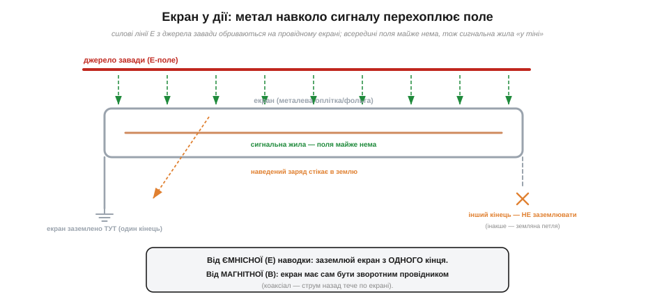
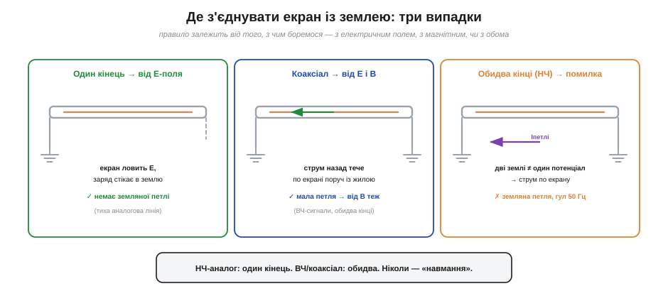

# Екран у дії: клітка Фарадея для сигналу

Екран — головні ліки від наводки, і час розібрати його по-справжньому. В основі лежить таке явище: **усередині провідника, що оточує об'єм, електричного поля немає.** Це [клітка Фарадея](topic:physics/faraday-cage) (*Faraday cage*) — провідна оболонка, всередину якої не проникає зовнішнє електричне поле, бо вільні заряди оболонки самі перерозподіляються так, щоб погасити поле всередині. Той самий принцип захищає цілий простір (нутро мікрохвильовки, екранована кімната) — а тут застосуємо його точково, щоб **захистити сигнальний провід**: обгорнемо тонку чутливу жилу провідною оболонкою, і зовнішні електричні поля до неї вже не доберуться. Це та сама клітка Фарадея, лише стиснута до розмірів кабелю.

Варто на мить здивуватися, наскільки це сильна ідея. Майкл Фарадей колись зачинявся в металевій кімнаті, обвішаній зовні зарядами, і не виявляв усередині **жодного** сліду електричного поля — заряди оболонки самі вишиковувалися так, щоб усе погасити. Та сама фізика працює й у мідній оплітці завтовшки з волосину навколо сигнальної жили: зовнішнє поле наводить заряди на оплітку, ті перерозподіляються — і всередині поля практично не лишається. Дивовижно, що для електричного поля важлива не товщина металу й не його кількість, а лише **те, що він суцільний і провідний**: навіть тонка фольга чи густа сітка повністю перехоплюють статичне й низькочастотне поле. Тому екран сигнального кабелю не мусить бути масивним — досить тонкої, але суцільної й заземленої провідної оболонки.

### Як екран перехоплює поле

Механізм той самий, що в [ємнісній наводці](topic:physics/capacitive-coupling), лише тут він працює як повноцінний інструмент захисту. Сигнальну жилу охоплює провідна оболонка — **екран** (*shield*): суцільна фольга, обплетення з тонких дротинок (оплітка), або трубка. Зовнішнє електричне поле від агресора (мережі, сусіднього кабелю) натрапляє на цю провідну оболонку — і його силові лінії **обриваються на ній**, не проникаючи всередину. Наведений зовнішнім полем заряд осідає на екрані, а звідти стікає в **землю** (екран заземлений). Сигнальна жила всередині лишається «в тіні» — поля біля неї майже немає, тож і наводити нема чому.


*Силові лінії E від джерела завади обриваються на провідному екрані (всередині провідника поля немає) і стікають у землю. Сигнальна жила всередині — «у тіні», поля майже нема. Екран заземлено з ОДНОГО кінця: інший кінець навмисно лишають вільним, щоб не утворити земляну петлю.*

Є річ, без якої екран не працює: проти електричного поля екран рятує, **лише коли заземлений**. Незаземлена металева оболонка навколо проводу мало що дає — поле наводиться на неї, а з неї крізь внутрішню ємність на жилу. Лінії E мають кудись **стікати**, і це «кудись» — земля. Заземлений екран — це працююча клітка Фарадея; незаземлений — просто шматок металу, що сам став антеною.

Якою має бути добра клітка Фарадея для сигналу? Тут є кілька практичних тонкощів, що відрізняють надійний екран від декоративного. По-перше, **суцільність покриття**. Ідеальний екран повністю охоплює жилу; реальна оплітка має дірочки між дротинками, і крізь них трохи поля просочується. Тому якісні кабелі роблять із густою опліткою (висока «щільність покриття», %), а для відповідальних застосувань — з суцільною фольгою або з фольгою плюс оплітка. По-друге, **розриви — це зло**. Будь-яка щілина в екрані (місце, де він не з'єднаний, або довгий незаекранований хвостик біля роз'єму — «косичка») працює як прохід для поля; на високих частотах навіть коротка щілина помітно псує захист — саме тому так важливо, як [екранований сигнальний кабель і коаксіал влаштовані зсередини](topic:electronics/shielded-cable) (фольга, оплітка, їхнє покриття) і як саме екран кріплять до роз'єму без довгої косички. По-третє, екран має оточувати сигнал **по всьому шляху** — обірваний на півдорозі екран лишає жилу відкритою саме там, де він закінчився. Звідси й суто практичні правила монтажу: щільна оплітка, мінімум косичок, безперервність екрана від кінця до кінця.

### Найважливіше: де з'єднувати екран із землею

А тепер — найтонше і найважливіше питання всієї теми, на якому спотикаються навіть бувалі: **в якому місці з'єднувати екран із землею?** Інтуїція кричить «заземли з обох кінців, надійніше» — і часто саме це псує все. Бо тут стикаються два механізми завад, які тягнуть у протилежні боки.

Зрозуміймо спершу, чому «надійніше з обох» — пастка. Заземливши екран з обох кінців, ти **навмисно** з'єднав землю одного приладу із землею іншого ще й через екран кабелю. А дві землі — це майже ніколи не той самий потенціал: різниця їхніх потенціалів і породжує [земляну петлю](topic:electronics/ground-loops). Тож між кінцями екрана з'явиться різниця Uзем, вона **жене струм по екрану**, а той струм наводить на жилу гул. Вийшло, що екран, поставлений «для надійності», сам став джерелом завади — класична земляна петля. Ось чому тут не можна діяти за гаслом «що більше з'єднань із землею, то краще»: для екрана це гасло хибне. Кількість точок заземлення екрана треба **обирати свідомо**, а не «про всяк випадок».

З одного боку — [ємнісна наводка](topic:physics/capacitive-coupling): для неї байдуже, де заземлено екран, аби лиш наведений заряд мав куди стікати; досить **одного** кінця. З іншого боку — земляна петля: якщо заземлити екран із **обох** кінців, він стає частиною контуру «екран + дві землі + проводка будівлі», по ньому потече струм від різниці потенціалів двох земель, і цей струм наведе на сигнал гул. Дві поради конфліктують: ємнісна каже «заземли», земляна каже «не замикай петлю».

Розв'язання залежить від частоти й від того, з чим боремося:


*Три випадки. (1) Низькочастотний аналог, головна загроза — E-поле й земляні петлі: заземлюй екран з ОДНОГО кінця — поле перехоплено, петлі немає. (2) Коаксіал на високих частотах: екран сам є зворотним провідником, заземлюють ОБИДВА кінці. (3) Помилка — обидва кінці на низькій частоті: дві землі ≠ один потенціал → струм по екрану → гул 50 Гц.*

- **Низькочастотний аналоговий сигнал** (давачі, аудіо, постійка): головні вороги — ємнісна наводка й земляні петлі. **Заземлюй екран лише з одного кінця** (зазвичай з боку приймача чи спільної точки «землі»). Поле перехоплено, а петля розімкнена — струму завади текти нема де. Інший кінець навмисно лишають вільним.
- **Високочастотний сигнал, коаксіальний кабель** (відео, радіо, швидкі лінії): тут екран працює інакше — він **сам є зворотним провідником** сигналу (струм назад тече по екрані щільно навколо жили, площа петлі мала — заразом і від [магнітної наводки](topic:physics/inductive-coupling) захист). Такий екран заземлюють із **обох** кінців: на високих частотах це потрібно, а земляна петля менш страшна, бо її низькочастотний струм не заважає високочастотному сигналу.
- **Обидва кінці на низькій частоті без потреби** — типова **помилка**: створює земляну петлю там, де вона не потрібна, і додає гул замість того, щоб прибрати.

Чому ж не можна просто «завжди один кінець» і не морочитися? Бо на високих частотах одного кінця замало для магнітного захисту. Проти B працює мала петля, а для неї зворотний струм має текти по екрані впритул до жили — а це можливо, лише коли екран під'єднаний з **обох** кінців (інакше струму нема куди замкнутися по екрану). Тому вибір — це завжди компроміс між двома загрозами: «один кінець» рятує від земляної петлі, але лишає екран магнітно неактивним; «обидва кінці» вмикають магнітний захист, але ризикують земляною петлею. На низьких частотах страшніша петля (тож один кінець), на високих — магнітна наводка й хвильові ефекти (тож обидва). Існують і компромісні хитрощі — заземлити один кінець «намертво», а другий через конденсатор (тоді для високих частот екран замкнений з обох боків, а для низьких — лише з одного, і петлі немає), — але це вже тонке налаштування; на нашому рівні досить чітко тримати дві базові настанови.

> 🔧 **Навіщо це.** Правило «аналоговий екран — з одного кінця, коаксіал ВЧ — з обох» розв'язує безліч загадкових гулів. Якщо екранований кабель між двома приладами гуде на 50 Гц — найперше, що пробують, це **роз'єднати екран з одного кінця**: дуже часто гул зникає миттєво, бо ви щойно розірвали земляну петлю. І навпаки — якщо «земля» одна (обидва кінці на тій самій точці), заземлення з двох боків уже не страшне. Тому грамотний інженер ніколи не заземлює екран «навмання»: він спершу питає, з якою завадою бореться і яка тут частота.

### Чим екран допомагає проти магнітної наводки (і чим ні)

Тут є чесна межа, про яку треба сказати прямо: проста заземлена оболонка чудово глушить **електричну** наводку, але **магнітне** поле проходить крізь тонкий немагнітний екран майже без перешкод. Тож від магнітної наводки на низьких частотах сам по собі екран мало рятує. Допомагає він проти B лише в одному (зате дуже поширеному) випадку — коли **зворотний струм тече по самому екрані**, щільно охоплюючи жилу. Тоді поля прямого струму (по жилі) і зворотного (по екрану навколо) майже взаємно гасяться, площа петлі стискається до нуля — і магнітної наводки теж майже нема. Саме так влаштований коаксіал. Тому коаксіальний екранований кабель захищає **і** від електричної (як клітка Фарадея), **і** від магнітної (як співвісний зворотний провідник) наводки — звідки його популярність для тонких і швидких сигналів.

Чому для аналогової лінії екран заземлюють саме **з боку приймача** (чи спільної точки), а не передавача? Бо саме приймач — найчутливіше місце, його «земля» має бути опорою для вимірювання, і логічно прив'язати екран до тієї самої опорної точки, щоб наведений на екран заряд стікав туди, де й так нуль сигналу. Якщо ж заземлити екран на дальньому кінці (біля давача), то між екраном і землею приймача може лишитися невелика різниця потенціалів, яка через паразитну ємність екран–жила трохи підмішається до сигналу. Тонкість невелика, але правило «екран на землю приймача» — добра звичка за замовчуванням для однокінцевого заземлення. Головне ж — **не на обох кінцях** (на низькій частоті), щоб не замкнути земляну петлю.

**Приклад (як вибрати схему заземлення екрана).** Три типові лінії — і правильне рішення для кожної:

```
(1) Мікрофон/давач, кабель 3 м, сигнал слабкий, частоти до кількох кГц:
    → екран заземлити з ОДНОГО кінця (з боку підсилювача). Розрив земляної петлі важливіший.
(2) Відеосигнал по коаксіалу, частоти до сотень МГц:
    → екран = зворотний провідник, заземлити з ОБОХ кінців. ВЧ цього вимагає.
(3) Два прилади в різних розетках гудуть на 50 Гц:
    → роз'єднати екран з одного кінця (або розв'язати входи трансформатором/оптроном).
```

Три однакові на вигляд кабелі — три різні правильні відповіді, і всі випливають із того, **з якою завадою** маєш справу. Це і є практична зрілість у роботі з екраном: не «заземлити надійніше», а «заземлити правильно для цього випадку». А щоб усе це працювало, важливо ще й те, як [екранований сигнальний кабель і коаксіал влаштовані зсередини](topic:electronics/shielded-cable) — фольга, оплітка, їхнє покриття — і як саме екран кріплять до роз'єму, не лишаючи довгої «косички» (незаекранованого хвостика екрана), яка псує захист на високих частотах.

Екран і правильна «земля» — потужна зброя проти електричної наводки. Проти ж **магнітної** найдієвіший і найдешевший прийом інший — мала площа петлі. Доведена до досконалості, ця ідея дає, мабуть, найгеніальніший витвір простої геометрії в усій техніці зв'язку — [виту пару](topic:electronics/twisted-pair).

---
