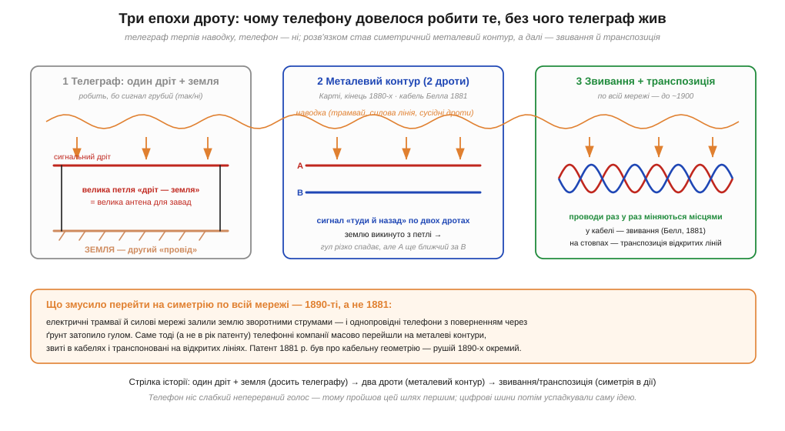
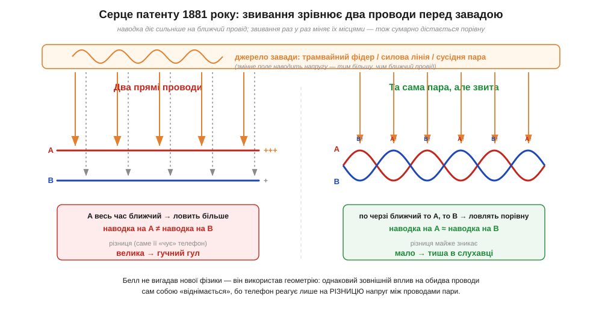

# 📜 Телефон проти телеграфу: як Белл запатентував звивання

Сама ідея витої пари — суто фізичний фокус: якщо два проводи раз у раз міняти місцями, зовнішня наводка діє на них порівну — і «віднімається». Здавалося б, очевидна геометрична хитрість. Та народилася вона не в лабораторії від гарної ідеї, а під тиском дуже конкретного лиха: телефон, ледь з'явившись, потонув у гулі. І перше, що тут варто зрозуміти, — чому та сама мережа дротів, яка чудово служила телеграфу десятиліттями, для телефону раптом виявилася непридатною.

## Чому телеграф терпів те, чого не стерпів телефон

Телеграф (*telegraph*) — прилад грубий і витривалий. Він передає лише два стани: є струм або немає, крапка чи тире. Навіть якщо до сигналу домішається стороння наводка, оператор однаково розрізнить різкий «стук» від фонового тремтіння стрілки. Тому телеграфні лінії десятиліттями обходилися **одним дротом**, а другим «проводом» служила сама **земля** (*earth return*, повернення через ґрунт): струм ішов дротом туди й повертався крізь товщу ґрунту назад до станції. Це вдвічі економило мідь — і телеграфу такого вистачало (повернення струму через [землю як спільний провід](book:electronics/ground-power-rails) — окрема тема).

Телефон (*telephone*) виявився створінням зовсім іншої породи. Він несе не «так/ні», а **слабкий неперервний звуковий сигнал** — тихий змінний струм, що повторює всі тонкощі голосу. Будь-яка стороння напруга, наведена на лінію, домішується просто у вухо як гул, шипіння й тріск. А наводитися було від чого: телефонні дроти тяглися тими самими стовпами, що й телеграфні, поряд бігли інші телефонні пари, а невдовзі під ними загуркотіли ще страшніші сусіди. Однопровідна лінія з поверненням через землю утворює **величезну петлю** «дріт — ґрунт», а велика петля — це чудова антена для будь-якої завади, бо чим більша площа контуру, тим більше [магнітної наводки](book:physics/inductive-coupling) він ловить. Те, що телеграф просто не помічав, телефон підсилював до нестерпного.

Тут варто на хвильку спинитися на тому, **чому** різниця така разюча, бо це і є коренем усієї історії. Справа не лише в тому, що телефонний струм слабший. Телеграфний приймач — це фактично пороговий пристрій: він питає «струм більший за поріг чи ні?», і доки наводка не дотягує до порога, відповідь не міняється. Телефонний же приймач — це **вухо людини**, а вухо є детектором надзвичайно тонким і до того ж чутливим саме до тих частот, на яких гудуть мережі. Гул, що для телеграфної стрілки лишався б нижче порога, для вуха вже звучить виразним фоном поверх голосу. Через це телефонна лінія потребувала не «трохи кращого» захисту від наводок, а **якісно іншого**: телеграф міг дозволити собі недбалу геометрію, телефон — ні.

*Три епохи лінії. Телеграфу досить одного дроту, бо сигнал грубий, а другим «проводом» служить земля (ліворуч). Телефон цього не стерпів: розв'язком став симетричний металевий контур із двох дротів (посередині), а далі — звивання в кабелях і транспозиція відкритих ліній (праворуч). Нижня смуга нагадує: масовий перехід стався під тиском трамваїв і силових мереж 1890-х — це окремий рушій, не рік патенту.*

## Белл і кабельна тіснява: патент 1881 року

Тут і виходить на сцену **Александер Грем Белл** (*Alexander Graham Bell*) — той самий, чиє ім'я носить телефон. До 1881 року телефонна справа вже росла вибухово, дроти зводили в товсті **кабелі** (*cable*), де поряд тісно лежали десятки пар. І тут вилізла нова біда: пари наводили завади **одна на одну**. Розмова з одного кола просочувалася в сусіднє — те, що згодом назвуть **перехресною завадою** (*crosstalk*, перехресні наведення). У тісному кабелі кожна пара купалася в полях усіх сусідніх.

4 червня 1881 року Белл подав заявку, і вже 19 липня дістав **патент США № 244 426** під назвою «Telephone-circuit» («Телефонне коло»). Документ короткий і б'є точно в суть. Белл прямо називає причину лиха: «Inductive disturbance… arises from the unequal inductive effect of the latter upon the two wires» — індуктивна завада постає через **нерівний** вплив сусіднього кола на два проводи пари. Якщо один провід пари стабільно ближчий до джерела завади, ніж другий, він ловить більше — і ця **різниця** й лізе в слухавку.

Звідси й розв'язок, який Белл формулює геометрично, майже без фізики: зробити так, щоб «the two wires of each circuit are equidistant, or substantially equidistant, from every other wire in the cable» — щоб обидва проводи пари були **однаково віддалені** від кожного іншого дроту. А досягти цього найпростіше **звиванням**: «by the twist the wires of each pair are brought alternately to the same position relative to the other wires» — звивання раз у раз ставить кожен провід пари по черзі в те саме положення відносно сусідів. Те, що один сегмент пари ловить «забагато», наступний сегмент із переставленими проводами компенсує. Власне формула винаходу (*claim*) скромна: кабель зі зсуканих пар, у якому проводи кожної пари рівновіддалені від проводів інших пар.

*Серце патенту. Ліворуч — два прямі проводи: A весь час ближчий до завади, тож ловить більше за B, і ця різниця стає гулом. Праворуч — та сама пара, але звита: по черзі ближчим стає то A, то B, наводка дістається обом порівну, і різниця майже зникає. Белл не вигадав нової фізики — він використав те, що телефон реагує лише на РІЗНИЦЮ напруг між проводами.*

Варто чесно окреслити **межі** цього патенту, бо довкола нього легко наростити міф. Белл не «винайшов електромагнетизм» і навіть не першим помітив, що симетрія рятує від наводок, — він запатентував конкретне інженерне рішення для **кабелю**: як укласти багато пар поряд, щоб вони не заважали одна одній. Це важливий, але вузький крок. Патент 1881 року — про **кабельну тісняву й перехресну заваду між парами**, а не про велику війну з зовнішніми завадами, яка розгорнеться згодом. Цю відмінність легко змазати — і саме тут починаються плутанина й перебільшення.

## Хто насправді приборкав гул: металевий контур і Джон Карті

Якщо звести історіографію докупи, винахід «двопровідної» телефонії — **колективний**, і ім'я, яке тут не можна оминути, — **Джон Джозеф Карті** (*John J. Carty*, 1861–1932), згодом головний інженер компанії AT&T. Саме Карті наполегливо доводив, що корінь гулу — у поверненні через землю, і що ліки радикальні: викинути землю з кола взагалі й пустити сигнал «туди й назад» **двома дротами**. Таке коло назвали **металевим контуром** (*metallic circuit*), бо весь шлях струму тепер металевий, без ділянки крізь ґрунт. За свідченнями інженерної історіографії, там, де Карті ставив металеве повернення, шум «майже повністю зникав одразу». Найраніші його успіхи відносять до початку 1880-х (зокрема налагодження ранньої міжміської лінії Бостон — Провіденс, хоча точна дата в джерелах подається по-різному); широке ж застосування — кінець 1880-х і далі.

Карті пішов і глибше за просту пару. Працюючи з відкритими **багатопровідними** лініями на стовпах, він зрозумів: коли поряд тягнуться багато дротів, навіть металеві контури наводять один на одного, і причина тут — переважно **електростатична** наводка ([ємнісний зв'язок](book:physics/capacitive-coupling)), а не лише магнітна. Ліки — **транспозиція** (*transposition*): через певні проміжки дроти лінії систематично міняють місцями на стовпах, щоб усереднити взаємні впливи. Близько 1891 року Карті виклав робочу теорію транспозиції відкритих ліній. Це той самий принцип, що й звивання Белла, тільки в іншому масштабі: у кабелі проводи переплітають густо, а на відкритій лінії — переставляють раз на кілька стовпів. Тож «звивання» Белла й «транспозиція» Карті — дві версії однієї ідеї: **рівноправ'я проводів перед завадою**.

Наскільки глибоко Карті розумів цю симетрію, видно з винаходу, який він запатентував 1886 року, — **фантомного кола** (*phantom circuit*, фантомний контур). Хитрість майже фокусницька: маючи **дві** металеві пари, можна вести ними **три** розмови водночас. Дві розмови йдуть звичними парами, а третя — між **серединами** цих пар, так що кожна пара працює як один «провід» третього кола. І ось що тут красиве: третя розмова накладається на перші дві, **не заважаючи** їм, саме тому, що пари симетричні — для фантомного кола кожна пара поводиться як єдине ціле, а власні сигнали пар лишаються «невидимими». Симетрія, що боронила від завад, тут ще й **додала ємності** мережі без жодного нового дроту. Це показує, що принцип рівноправ'я проводів був для тогочасних інженерів не випадковою хитрістю, а добре зрозумілим робочим інструментом.

> 🔧 **Навіщо це.** Розрізняти «звивання в кабелі» (Белл, проти перехресної завади між парами) і «транспозицію відкритих ліній» (Карті, проти наводок між сусідніми лініями) корисно й сьогодні: вита пара всередині кабелю та «транспоновані» доріжки чи лінії — це не різні явища, а той самий прийом у різних масштабах.

## Рік патенту — не рік перемоги: трамваї й силові мережі 1890-х

Тепер — найголовніше застереження цієї історії, бо саме тут найлегше схибити. **Дуже спокусливо** склеити дві події в одну гладеньку легенду: мовляв, Белл 1881 року побачив, як телефонні дроти гудуть від трамвая, і відразу винайшов звивання, що врятувало мережу. Це **неправда** в частині причини й хронології, і варто пояснити чому.

У 1881 році електричних трамваїв (*electric tram / trolley*) ще практично не було — масова електрифікація вуличного транспорту почалася наприкінці 1880-х. Великі **силові мережі** (*power distribution*) розгорнулися ще пізніше. Тож рушій, який зробив однопровідний телефон геть непридатним, **фізично не міг** стояти за патентом 1881 року: тоді Белл розв'язував задачу **кабельної тісняви**, а не війну з трамваями.

Справжня драма розгорнулася в **1890-ті**. Електричні трамваї живляться постійним струмом, і зворотний струм вони часто пускали **через рейки й землю** — ту саму землю, якою «поверталися» однопровідні телефони. Місто буквально залило ґрунт потужними блукальними струмами, що стрибали з кожним рушанням і гальмуванням вагона; додалися гудучі силові мережі. Однопровідна телефонія з поверненням через ґрунт у такому середовищі стала просто непридатною — у слухавці стояв суцільний гул. **Ось що змусило** телефонні компанії в 1890-ті масово й остаточно перейти на симетрію: металеві контури всюди, звивання в кабелях, транспозиція на відкритих лініях. До 1900 року практично вся американська телефонна мережа стала або витою парою, або відкритою лінією з транспозицією; між 1890 і 1910 роками металеві контури витіснили однопровідні лінії майже скрізь.

Тож чесна хронологія — двоступенева. **1881-й**: Белл патентує звивання як засіб проти перехресної завади **в кабелі** — крок реальний, але вузький. **1890-ті**: під ударом трамваїв і силових мереж симетричний металевий контур стає **обов'язковим стандартом** усієї мережі, і вже тут вирішальну роль грає інженерна школа Карті з її металевим контуром і транспозицією. Звивання Белла і ширша перемога симетрії — пов'язані, але **не тотожні** події, рознесені майже на десятиліття. Зливати їх в одну — типова аберація історіографії техніки, де складний колективний процес стискають до одного героя й одного осяяння.

## Що з цієї історії бере інженер

Перший урок — фізичний, і він прямо живить саму ідею [витої пари](book:electronics/twisted-pair): симетрія перемагає заваду не магією, а арифметикою. Якщо приймач реагує лише на **різницю** напруг двох проводів, то будь-який вплив, **однаковий** для обох, сам собою віднімається. Уся хитрість — змусити заваду діяти на обидва проводи **однаково**, а для цього їх треба раз у раз міняти місцями: звивати в кабелі або транспонувати на стовпах. Це той самий принцип, на якому стоять і сучасні [диференційні пари](book:communications/differential-pair) цифрових шин, — пряма спадкоємність ідеї.

Другий урок — історичний і обережний. За звичним рядком «вита пара — це Белл, 1881» ховається тонша правда: патент Белла розв'язував **кабельну тісняву**, ширшу війну з наводками виграла **колективна** інженерна праця (передусім металевий контур і транспозиція Карті), а **рушієм** масового переходу були **трамваї й силові мережі 1890-х**, а не рік патенту. Це не применшує Белла — це лише ставить його крок на правильне місце в ланцюжку. А заразом нагадує корисну звичку: коли техніку приписують одній людині й одному року, варто перепитати, що саме винайшли, що — лише запатентували, а що зробив час і чужі руки.
