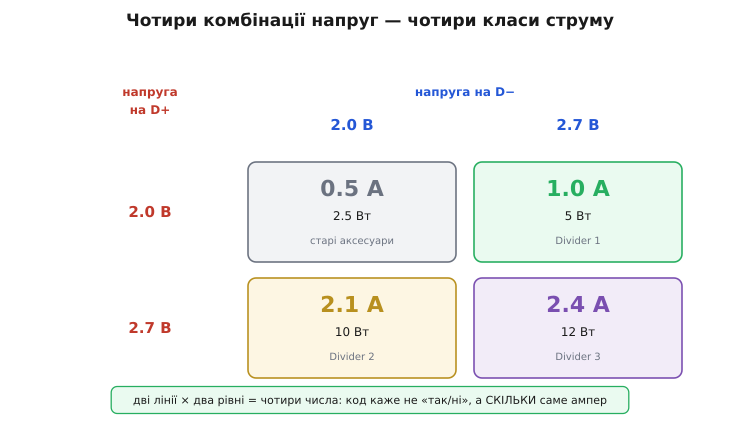
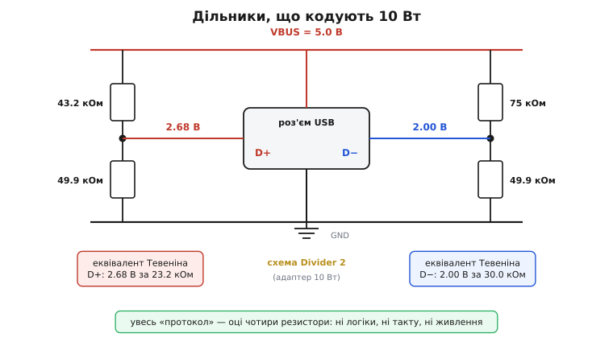
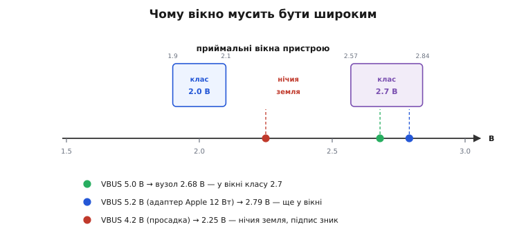
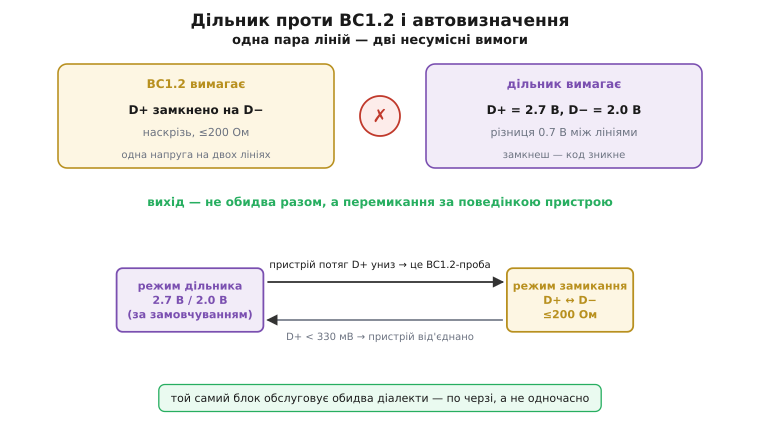

# Apple D+/D− кодування зарядного струму

<preknowlist>
- [Дільник напруги](topic:electronics/voltage-divider) — два резистори від живлення до землі задають на середньому вузлі напругу за відношенням плечей.
- [Легасі-зарядка](topic:electronics/legacy-charging) — навіщо взагалі щось кодувати на лініях D+/D−: у зарядного блока нема процесора, а BC1.2 упізнає його за замкненими лініями.
- [Теорема Тевеніна](topic:electronics/thevenin) — будь-яке лінійне джерело зводиться до напруги за послідовним опором; саме цей опір тут вирішує долю коду.
- [Компаратор](topic:electronics/comparator) — порівняння напруги з порогом: так пристрій і читає код.
</preknowlist>

Зарядний блок у розетці не вміє сказати про себе нічого: процесора в ньому нема, вести перемовини нема кому. Тому в п'ятивольтовому світі USB склалася традиція, дивна на перший погляд: джерело мовчки **позначає себе** станом двох ліній даних D+/D−, а пристрій цей стан читає. Відповідь консорціуму USB-IF на цю задачу гранично проста — замкнути D+ на D− через малий опір: побачив замикання, значить перед тобою зарядка. Але зверніть увагу, скільки інформації несе таке замикання: рівно **один біт**. Зарядка чи не зарядка.

Тепер уявімо виробника, у якого до того самого роз'єму приходять джерела дуже різної сили: порт комп'ютера на пів ампера, маленький блок для телефона на один ампер і плаский блок для планшета на два з гаком. Один біт тут не рятує — усі троє чесно скажуть «я зарядка», і пристрій однаково не знатиме, скільки з них можна брати. Планшет, що потягне з порту комп'ютера два ампери, просадить його; планшет, що візьме з двохамперного блока пів ампера, заряджатиметься всю ніч. Отже, питання, на яке насправді треба відповісти, звучить не «чи ти зарядка?», а **«скільки саме ампер?»**. Це питання не про наявність — воно про число, і одним бітом на нього не відповісти.

Кодування, яке Apple завела для своїх блоків, відповідає саме на нього. Замість замикання ліній воно тримає на D+ і D− **сталі постійні напруги**, а пара цих напруг і є числом — дозволеним струмом.

### Число, складене з двох напруг

Хід думки тут такий. Замикання ліній — стан спільний: він або є, або нема, і третього не дано. А от напруга — величина, і на ній можна домовитися про кілька впізнаваних рівнів. Домовмося про два: лінія з двома рівнями несе один біт. Але ліній у нас **дві**, і вони незалежні одна від одної — отже, разом вони несуть два біти, тобто чотири різні комбінації. Чотири класи струму замість одного біта — і все це без жодного протоколу, такту чи активної схеми.

Два рівні обрано так, щоб їх ніхто не сплутав: **2.0 В** і **2.7 В**. Комбінації розібрані так:


*Дві лінії з двома рівнями кожна дають чотири комбінації — і кожна означає конкретний струм, а не «так/ні». Обидві по 2.0 В — це слабке джерело на 0.5 А (так позначали себе старі аксесуари). Далі три робочі схеми, що їх виробники мікросхем звуть Divider 1, 2 і 3: 2.0/2.7 — це 1 А (блок 5 Вт), 2.7/2.0 — це 2.1 А (блок 10 Вт), 2.7/2.7 — це 2.4 А (блок 12 Вт). Порядок напруг має значення: переставиш D+ і D− місцями — і 10 Вт перетворяться на 5.*

Назви «Divider» (англ. *divider* — дільник) закріпилися не з документів Apple, а з даташитів мікросхем, які це кодування реалізують: виробники кремнію мусили якось назвати режими — і назвали їх за способом, яким ця напруга робиться, тобто резистивним дільником. Помітьте асиметрію в таблиці: пара 2.7/2.0 і пара 2.0/2.7 означають різні речі — 2.1 А проти 1 А. Лінії не рівноправні, порядок несе інформацію, і саме тому це повноцінні два біти, а не «скільки ліній підтягнуто».

> 🔧 **Навіщо це.** Ця таблиця — робочий інструмент, а не довідка. Коли ви робите власне джерело (павербанк, автомобільну зарядку, USB-розетку) і хочете, щоб телефон брав із нього повний струм, ви буквально обираєте рядок цієї таблиці — і виставляєте відповідну пару напруг. Якщо ваш блок тягне 1 А, чесно поставте 2.0/2.7; поставите 2.7/2.7 «щоб швидше» — пристрій повірить, візьме 2.4 А, і далі почнеться те, чим закінчується будь-яка брехня джерела про свої сили.

### Увесь протокол — чотири резистори

Найдивовижніше в цій схемі те, з чого вона зроблена. Напруга береться з самої VBUS звичайним дільником: два резистори від VBUS до землі, а середній вузол іде на лінію даних. Дві лінії — два дільники — чотири резистори. Більше нема нічого.


*Схема блока на 10 Вт цілком. Плече 43.2 кОм / 49.9 кОм дає на D+ рівно 2.68 В, плече 75 кОм / 49.9 кОм дає на D− 2.00 В — і це вже готовий підпис «бери 2.1 А». Праворуч від кожного дільника — його еквівалент Тевеніна: джерело не просто видає напругу, воно видає її за помітним послідовним опором у 23–30 кОм. Саме цей опір, а не самі вольти, визначить далі майже все.*

**Приклад (що дають ці чотири резистори).** Порахуймо обидва плечі й одразу їхній вихідний опір за Тевеніном.

```
Плече D+ :  R_верх = 43.2 кОм,  R_низ = 49.9 кОм

  U = VBUS · R_низ / (R_верх + R_низ)
    = 5.0 · 49.9 / (43.2 + 49.9)
    = 5.0 · 49.9 / 93.1  = 5.0 · 0.5360  = 2.68 В

  R_тев = R_верх ‖ R_низ = 43.2 · 49.9 / 93.1 = 23.2 кОм
  I_дільника = 5.0 / 93.1 кОм = 53.7 мкА

Плече D− :  R_верх = 75 кОм,  R_низ = 49.9 кОм

  U = 5.0 · 49.9 / (75 + 49.9)
    = 5.0 · 49.9 / 124.9 = 5.0 · 0.3995  = 2.00 В

  R_тев = 75 · 49.9 / 124.9 = 30.0 кОм
  I_дільника = 5.0 / 124.9 кОм = 40.0 мкА

Разом на підпис:  53.7 + 40.0 = 93.7 мкА  →  5.0 В · 93.7 мкА = 0.47 мВт
```

Номінали не випадкові: 43.2, 49.9 і 75.0 кОм — це стандартні значення одновідсоткового ряду E96, тобто найдешевші резистори, якими взагалі можна влучити в потрібне відношення. Уся «фірмова технологія» коштує чотири копійчані резистори й пів мілівата, які течуть, доки на блоці є напруга. Пів мілівата — дрібниця проти дванадцяти ватів корисної потужності, але це та дрібниця, що тече й тоді, коли до блока нічого не під'єднано, і саме вона потрапляє в норми на споживання блоків на холостому ходу.

Звідси й головна вада — і водночас головна перевага — цього рішення: **джерело нічого не перевіряє**. Воно не питає, хто під'єднався, не чекає відповіді, не вміє передумати. Воно просто тримає на двох лініях напругу, як напис на дверях. Тому підпис починає діяти миттєво, ще до того, як пристрій узагалі прокинувся, — і тому ж цей напис може безкарно брехати.

### Чому вікно мусить бути широким

Пристрій читає код найпростішим способом: міряє напругу на D+ і D− та порівнює її з порогами. Але порівнювати з точним числом не можна — доводиться приймати цілу смугу довкола нього: у залізі це [віконний компаратор](topic:electronics/window-comparator), у коді — кілька рядків. Мікросхеми, що видають підпис, гарантують напругу 2.7 В у межах **2.57–2.84 В**, а напругу 2.0 В — у межах **1.9–2.1 В**. Смуги широченні, майже ±5 %. Чому так щедро?

Причина — у самій природі дільника. Дільник тримає не вольти, а **частку** від VBUS: відношення 0.5360 стале, а от вольти на виході їдуть слідом за живленням. Пристрій же міряє **абсолютні** вольти й порівнює їх з абсолютними порогами. Ці дві логіки не збігаються, і вся різниця лягає у вікно.


*Пристрій приймає не точку, а смугу; між смугами лишається нічия земля, куди краще не потрапляти. Оскільки дільник тримає частку від VBUS, точка їздить по осі разом із живленням: при 5.0 В вузол сідає на 2.68 В, при 5.2 В — на 2.79 В, і обидва ще у вікні класу 2.7. А просаджені 4.2 В зсувають вузол аж на 2.25 В — у нічию землю, де код уже не читається жодним класом.*

**Приклад (та сама схема при різній VBUS).** Відношення плеча D+ лишається 0.5360 завжди; рухається тільки живлення.

```
Приймальне вікно класу 2.7:  2.57 … 2.84 В

VBUS = 5.0 В  →  5.0 · 0.5360 = 2.68 В   у вікні    ✓
VBUS = 5.2 В  →  5.2 · 0.5360 = 2.79 В   у вікні    ✓   ← адаптер Apple 12 Вт
VBUS = 4.2 В  →  4.2 · 0.5360 = 2.25 В   ПОЗА вікном ✗

Те саме для плеча D− (відношення 0.3995), вікно 1.9 … 2.1 В:

VBUS = 5.0 В  →  2.00 В  ✓
VBUS = 5.2 В  →  2.08 В  ✓  (лишилося 0.02 В запасу до стелі!)
VBUS = 4.2 В  →  1.68 В  ✗
```

Рядок про 5.2 В — не вигадка для прикладу. Фірмовий адаптер Apple на 12 Вт видає саме 5.2 В, а не 5.0: зайва дещиця напруги компенсує падіння на кабелі, щоб на дальньому кінці лишалося чесних п'ять вольтів. Але дільник цього задуму не знає — він слухняно множить свої відношення на 5.2 і посуває обидва вузли вгору. Клас 2.7 це переживає з запасом, а от клас 2.0 опиняється за два мілівольти від стелі свого вікна. Ось вам і відповідь, чому вікна такі широкі: вони мусять уміщати не лише розкид резисторів, а й розкид самої VBUS — і ще похибку АЦП пристрою згори. Як складається цей бюджет і чому 2.0 і 2.7 стоять саме на такій відстані одне від одного, розібрано окремо в [бюджеті вікна](topic:electronics/apple-charging-protocol/math-divider-window.md): там видно, що зазор між класами — не смак, а результат складання допусків.

А ось нижній рядок таблиці — це вже не арифметика, а механізм відмови. Коли VBUS просідає до 4.2 В, обидва вузли випадають зі своїх вікон, і підпис просто **зникає**: код був складений з часток напруги, яка поїхала. Пристрій, перечитавши лінії, не впізнає жодного класу й відкочується в безпечні пів ампера. Струм падає — блок відпускає — VBUS вертається — підпис знову читається — пристрій знову бере повний струм — і блок знову просідає. Так народжується та сама зарядка, що «то заряджає, то ні», причому винна тут не логіка, а фізика: слабкий блок, який пообіцяв більше, ніж може, гойдається між обіцянкою й реальністю.

### Слабке джерело, яке не можна навантажувати

Повернімося до тих 23–30 кОм вихідного опору. Коли інженер бачить у даташиті мікросхеми рядок «вихідний опір 30 кОм», перша реакція — «недоробка, поставили б повторювач». Але це зроблено навмисно, і причина глибша, ніж економія.

Дільник із резисторів **фізично не може** бути жорстким джерелом: його вихідний опір — це паралельне з'єднання плечей, і зробити його малим означало б лити крізь дільник міліампери намарно. Мікросхеми, що видають підпис, цього не виправляють, а **відтворюють**: типове значення 30 кОм у даташиті — це рівно 75 кОм ‖ 49.9 кОм, тобто кремній свідомо вдає з себе саме той дільник, що колись стояв у фірмовому блоці. Схема мусить поводитися так, як очікує пристрій, — а пристрої налаштовані на слабке джерело.

Наскільки слабке — видно з простого множення. Пристрій міряє лінію високоомним входом, і струм туди тече мізерний:

```
Витік вимірювального входу 1 мкА:   1 мкА · 23.2 кОм = 0.023 В
   → вузол сів з 2.68 на 2.66 В: похибка 23 мВ, дрібниця проти вікна ±140 мВ

Стороннє навантаження 100 мкА:    100 мкА · 23.2 кОм = 2.32 В
   → вузол сів з 2.68 аж на 0.36 В: підпису більше нема
```

Різниця разюча. Сто мікроампер — струм, який у силовій електроніці й за струм не вважають, — обвалюють підпис 2.68 В майже до нуля. Тобто будь-що, що чіпляється до лінії даних із опором, помітно меншим за мегаом, стирає код начисто. Звідси практичний висновок: читати ці лінії можна тільки високоомним входом, і ще треба пильнувати, щоб конденсатор вибірки АЦП не «вкусив» заряд із такого кволого джерела при перемиканні мультиплексора. Як влаштувати таке читання на боці пристрою — з поправкою на [вибірку й зберігання](topic:electronics/adc-sample-hold), гістерезис і порядок дій після появи VBUS — показано в [читанні підпису на мікроконтролері](topic:electronics/apple-charging-protocol/proj-divider-signature.md).

Сама ж класифікація, коли вольти вже виміряно, — це чотири порівняння з вікнами й ні рядка більше:

```c
#include <stdbool.h>

typedef enum { SRC_UNKNOWN, SRC_500MA, SRC_1A, SRC_2A1, SRC_2A4 } src_class_t;

static bool in_window(int mv, int lo, int hi) { return mv >= lo && mv <= hi; }

#define IS_2V0(mv)  in_window((mv), 1900, 2100)
#define IS_2V7(mv)  in_window((mv), 2570, 2840)

/* mv_dp, mv_dm — уже виміряні АЦП мілівольти на лініях D+ і D− */
src_class_t classify(int mv_dp, int mv_dm)
{
    if (IS_2V0(mv_dp) && IS_2V0(mv_dm)) return SRC_500MA;  /* слабке джерело  */
    if (IS_2V0(mv_dp) && IS_2V7(mv_dm)) return SRC_1A;     /* Divider 1, 5 Вт */
    if (IS_2V7(mv_dp) && IS_2V0(mv_dm)) return SRC_2A1;    /* Divider 2, 10 Вт*/
    if (IS_2V7(mv_dp) && IS_2V7(mv_dm)) return SRC_2A4;    /* Divider 3, 12 Вт*/
    return SRC_UNKNOWN;                                    /* чужий діалект   */
}
```

Гілка `SRC_UNKNOWN` — не формальність, а найчастіший результат у полі: побачивши чужий підпис, пристрій зобов'язаний відкотитися до найнижчого безпечного струму. Саме так «повільно заряджає» перетворюється з містики на арифметику.

### Дві мови, яких не сказати одночасно

Тепер найцікавіше зіткнення. Стандарт BC1.2 вимагає від блока замкнути D+ на D− наскрізь. Дільникове кодування вимагає тримати на D+ і D− **різні** напруги — 2.7 і 2.0 В. Ці дві вимоги не просто різні, вони фізично суперечать одна одній: замкнеш лінії — і різниця 0.7 В зникне разом із кодом.


*Замкнути дві лінії й водночас тримати між ними 0.7 В неможливо, тож обидва діалекти в одну мить не вимовиш. Вихід — перемикання: блок за замовчуванням стоїть у режимі дільника, а коли під'єднаний пристрій починає свою BC1.2-пробу й тягне D+ униз, блок розуміє, з ким має справу, і перемикається в режим замикання. Коли пристрій від'єднують, D+ провисає нижче ≈330 мВ — і блок вертається до дільника, чекаючи наступного гостя.*

Розв'язок виявився красивим саме тому, що спирається на вже знайому нам кволість дільника. Блок вмикається в режимі дільника — це стан за замовчуванням, бо він пасивний і не заважає нікому. Пристрій, який знає лише BC1.2, під'єднавшись, починає свою пробу: подає на D+ власну напругу близько 0.6 В зі значно жорсткішого джерела. Дільник цьому опиратися не може — ми щойно порахували, що сотня мікроампер кладе його вузол майже до нуля. І ось цей обвал власного вузла блок і бачить: так поводиться тільки пристрій, що активно тягне лінію, тобто BC1.2-детекція. Блок перемикається в режим замикання — і гість дістає ту саму відповідь, на яку чекав. А коли пристрій від'єднують, у режимі замикання лінію вже ніщо не тримає: внутрішня підтяжка до землі (сотні кілоом) стягує D+ нижче порогу близько 330 мВ, і це для блока знак, що гість пішов, — можна вертатися до дільника.

> 🔧 **Навіщо це.** Коли в даташиті контролера зарядного порту ви читаєте «auto-detect», за цими словами стоїть саме описаний автомат, а не магія. Практичний наслідок один, але важливий: **блок не говорить обома мовами одночасно, він перемикається**. Тому, ловлячи осцилографом лінії такого порту, не дивуйтеся, що підпис «змінюється сам собою» після під'єднання пристрою: ви бачите не збій, а перехід стану. І тому ж не варто чіпляти до цих ліній сторонні підтяжки чи щупи з низьким опором: ви імітуєте BC1.2-пристрій і власноруч вибиваєте блок із дільникового режиму.

### Стеля, брехня й межа підходу

Дільникове кодування вирішило свою задачу — і на тому ж уперлося у власну стелю. Розберімо чому.

Найбільше, що воно обіцяє, — 2.4 А, тобто 12 Вт при п'яти вольтах. Далі шлях угору закритий: потужність при сталій напрузі росте лише струмом, а струм гріє кабель і роз'єм за квадратом. Щоб рухатися далі, треба піднімати напругу — а це вже неможливо зробити мовчазним написом на дверях, бо джерело мусить **спитати дозволу**, перш ніж подати на пристрій дев'ять чи двадцять вольтів замість п'яти. Отже, потрібен зворотний зв'язок і справжні перемовини. Саме туди й пішли наступні рішення: [Quick Charge](topic:electronics/quick-charge) лишився на лініях даних, але додав підняття напруги, а [Power Delivery](topic:electronics/usb-pd) переніс усе на окрему лінію CC і зробив із цього повноцінний протокол із повідомленнями та контрактом.

Друга межа тонша. Дільник — це **одностороння заява**, а не домовленість. Ніхто не перевіряє її правдивість: блок, здатний на один ампер, коштує рівно тих самих чотирьох резисторів, щоб написати «2.4 А». Пристрій вірить напису, бо перевірити його не має чим — і саме тому дешеві зарядки з завищеним підписом працюють гірше за чесні слабкі. Порівняйте це з контрактом PD, де джерело **перелічує** свої можливості, пристрій **просить** конкретну, а джерело **підтверджує** — і будь-яка сторона будь-коли може розірвати угоду. Різниця між написом і контрактом тут не стилістична: у написі просто нема місця, куди вписати «я передумав».

Третя межа — мовчання про час. Підпис незмінний: він однаковий і на холодному блоці, і на перегрітому, і коли той уже віддає струм двом портам одразу. Джерело не має способу сказати «я зараз слабший, ніж написано». Через це блок або тримає підпис із запасом (і не віддає всього, що міг би), або тримає оптимістичний (і просідає під навантаженням).

І все ж кодування живе — саме тому, що воно нічого не коштує. Будь-який роз'єм USB-A на павербанку, в автомобільній зарядці, у розетці з USB чи в моніторі-хабі досі позначає себе цими напругами; напис «2.4 A smart port» на коробці означає рівно нижній правий рядок нашої таблиці. Заводять цей підпис або чотирма резисторами, або спеціальною мікросхемою — контролером зарядного порту; це цілий клас дешевих чипів, які вміють і дільник, і BC1.2, і перемикання між ними, а про сам клас, його типове ввімкнення й граблі — у [контролерах зарядного порту](topic:electronics/apple-charging-protocol/comp-dcp-signature-ic.md). Самі ж фірмові блоки Apple давно переїхали на USB-C із PD, але світ роз'ємів типу A, куди щодня встромляють мільйони кабелів, говорить старою мовою й не збирається її забувати.

### Звідки взялася таблиця

Про походження цього кодування варто сказати прямо, бо воно незвичне. **Apple ніколи не публікувала цієї специфікації.** Таблиця, яку сьогодні реалізує кремній половини світу, зібрана **зворотною інженерією**: ентузіасти випаювали резистори з фірмових блоків, міряли їх і зіставляли з поведінкою пристроїв. Найвідоміший епізод — історія набору MintyBoost від Adafruit: саморобна зарядка на пальчикових батарейках справно живила старі плеєри, а новіші відмовлялися заряджатися й показували «CHARGING IS NOT SUPPORTED WITH THIS ACCESSORY». Розібравши фірмовий блок, Лімор Фрід (Limor «Ladyada» Fried) знайшла всередині ту саму пару 75 кОм / 49.9 кОм і оприлюднила знахідку в серпні 2010 року; решту комбінацій добудувала спільнота, міряючи блоки на 10 і 12 Вт. Як саме цю закриту схему розплутували й чому хобі-набір змусив індустрію задокументувати чужий секрет — окремо в [історії розгадування підпису](topic:electronics/apple-charging-protocol/hist-mintyboost.md).

Статус цих фактів варто розрізняти. Сама таблиця напруг і струмів — **усталена**: її незалежно підтверджують і виміри на реальних блоках, і даташити виробників мікросхем, які цю схему реалізують у кремнії й наводять точні вікна 2.57–2.84 В та 1.9–2.1 В. А от розкид у джерелах — одні пишуть 2.7 В, інші 2.8 В — це не суперечність і не помилка, а **відбиток самого способу здобуття знання**: люди міряли різні екземпляри блоків із різною VBUS і різними резисторами й називали числом те, що бачили на своєму столі. Широке вікно приймання й робить обидві цифри правдивими. Офіційної специфікації від Apple, з якою можна було б звірити, просто не існує — де-факто стандартом таблиця стала тоді, коли її почали закладати в кремній.

### Підсумок теми

Дільникове кодування Apple відповідає на питання, якого BC1.2 не ставить: не «чи ти зарядка?», а **«скільки саме ампер?»**. Відповідь складається з двох сталих напруг на лініях даних — 2.0 або 2.7 В на кожній, — і чотири комбінації дають чотири класи: 0.5 А, 1 А (Divider 1, 5 Вт), 2.1 А (Divider 2, 10 Вт) і 2.4 А (Divider 3, 12 Вт); порядок ліній має значення. Робиться це **чотирма резисторами** зі звичайного ряду E96, які тягнуть із VBUS менш ніж сотню мікроампер. Пристрій читає код віконними порівняннями, і вікна навмисно широкі (2.57–2.84 і 1.9–2.1 В), бо дільник тримає **частку** від VBUS, а пороги абсолютні: фірмовий адаптер на 5.2 В зсуває вузли вгору, а просадка до 4.2 В зсуває їх аж у нічию землю — і підпис зникає разом із обіцянкою. Вихідний опір дільника в 23–30 кОм — не недогляд, а частина домовленості: код можна читати лише високоомним входом, бо сотня мікроампер його стирає. Ця ж кволість дала й розв'язок конфлікту з BC1.2, який вимагає від тих самих ліній прямо протилежного — замикання: блок стоїть у режимі дільника, а обвал власного вузла читає як появу BC1.2-гостя й перемикається в режим замикання, повертаючись назад, коли лінія провисне нижче ≈330 мВ. Межа підходу вбудована в його природу: односторонній напис не вміє ні брехати менше, ні передумати, ні підняти напругу вище п'яти вольтів — для цього потрібні справжні перемовини, як у [Power Delivery](topic:electronics/usb-pd). Але для роз'ємів типу A, де все ще живуть мільйони пристроїв, чотири резистори лишаються найдешевшим способом сказати «бери сміливо».
