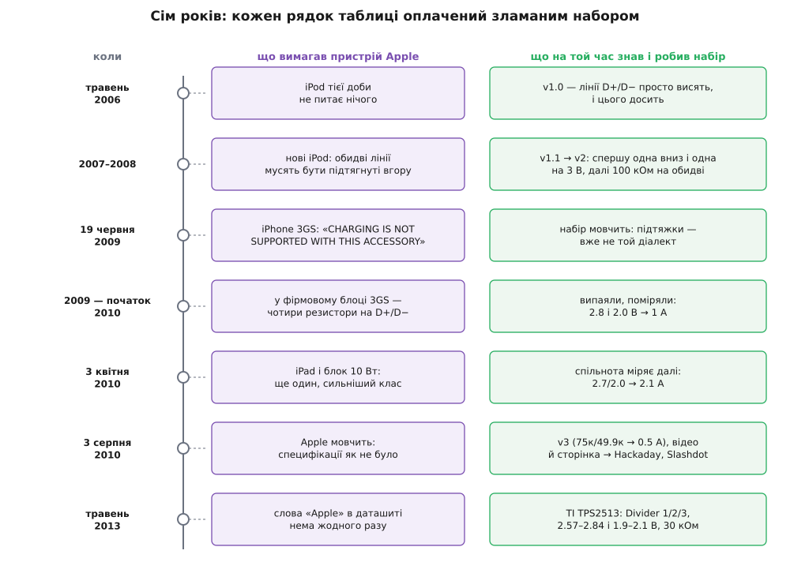
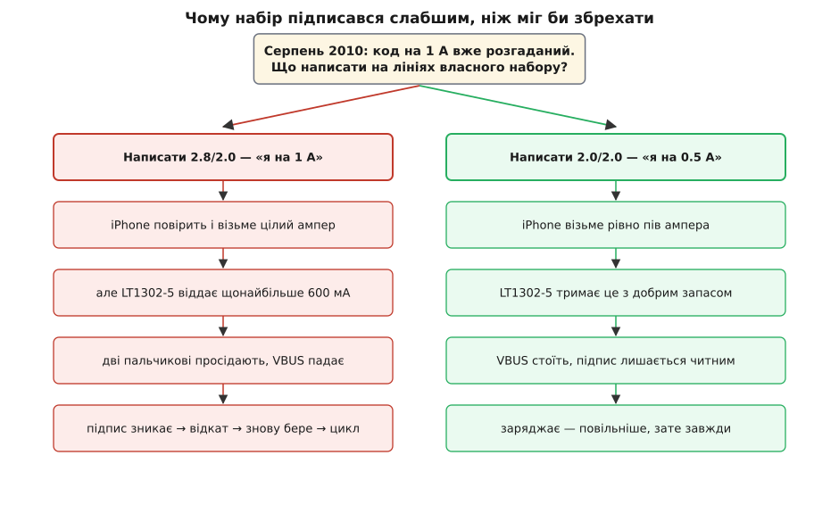

# 📜 Як розгадали підпис, якого ніхто не публікував

> Таблицю з чотирьох рядків, яку сьогодні реалізує кремній половини світу, ніколи не публікував той, хто її придумав. Її склали люди, що розв'язували геть іншу задачу: вони хотіли, щоб бляшанка з-під льодяників заряджала плеєр. Ця історія цікава не тим, «хто здогадався», а тим, **як узагалі можна дізнатися правило, якого ніхто не написав** — коли єдиний, хто його знає, мовчить за угодою, а єдиний доступний свідок відповідає лише «так» або «ні».

---

## Бляшанка з-під льодяників

31 травня 2006 року Hackaday написав про дивний пристрій: дві пальчикові батарейки, [підвищувальний перетворювач](topic:electronics/boost) і USB-розетка — усе запхане в бляшанку з-під м'ятних льодяників Altoids. Називалося це MintyBoost, а зробила його **Лімор Фрід** (*Limor Fried*) — американська інженерка, випускниця MIT (бакалаврат з електротехніки та інформатики 2003-го, магістратура 2005-го), відома в мережі під ніком **ladyada** — на честь Ади Лавлейс. Із цього набору виросла компанія Adafruit Industries, яку Фрід заснувала 2005 року ще в гуртожитку MIT, а потім перевезла до Нью-Йорка.

І ось найважливіша деталь, з якої все починається. У першій версії набору лінії даних D+ і D− **не були під'єднані взагалі** — вони просто висіли в повітрі. І це працювало. Плеєр тієї доби бачив п'ять вольтів і заряджався, ні про що не питаючи.

Це нульова точка відліку: 2006 року знання спільноти про «підпис зарядки» дорівнювало нулю — і нуль був правильною відповіддю. Кодувати ще не було чого.

## Оракул, що вміє казати лише «так» і «ні»

Далі почалося те, що й перетворило хобі-набір на інструмент дослідження.

Спершу зламався iPod Mini: висячі лінії його не влаштували. Полагодили навпомацки — одну лінію притягнули до землі, другу підняли до 3 В просто від самих батарейок. Запрацювало. Десь через рік нові плеєри забажали, щоб **обидві** лінії були підтягнуті вгору, — знову правка. Потім прийшли iPhone, яким треба було вже не менш як пів ампера: набір переїхав на потужнішу мікросхему LT1302, а на лінії даних стали дві підтяжки по 100 кОм.

Придивімося до методу, бо він тут головний. У дослідника **нема специфікації**. У нього є пристрій, який на будь-яку спробу відповідає рівно одним бітом: заряджається або ні. Такий свідок знає правило, але переказати його не вміє — лише судить кожну спробу. Дізнатися правило можна тільки одним способом: висунути здогад, збудувати його в залізі, спитати — і подивитися на біт.

Ціна такого пізнання несиметрична. «Так» майже нічого не пояснює: воно каже, що ти влучив, але не каже, наскільки широка ціль і чи не влучив ти випадково. «Ні» цінніше — воно окреслює межу — але й воно не показує, з якого боку ти промахнувся. Тому кожна нова модель плеєра, що ламала набір, була для спільноти не прикрістю, а **експериментом, оплаченим наперед**: Apple мовчки міняла правило, а тисячі зібраних бляшанок ставали вимірювальною сіткою, яка це показувала.


*Знання не з'явилося одним осяянням — воно накопичувалося відмовами. Кожен рядок праворуч написаний після того, як рядок ліворуч зламав чергову версію набору. Зверніть увагу на розрив між червнем 2009-го й початком 2010-го: саме там метод «підкрути й спробуй» вичерпався остаточно.*

## «CHARGING IS NOT SUPPORTED WITH THIS ACCESSORY»

19 червня 2009 року вийшов iPhone 3GS (Apple показала його на WWDC одинадцятьма днями раніше, 8 червня). І гра в підтяжки скінчилася.

3GS не просто не заряджався — він **виводив на екран звинувачення**: CHARGING IS NOT SUPPORTED WITH THIS ACCESSORY. Форуми Adafruit залило скаргами.

Вчитаймося в цей напис, бо він набагато інформативніший, ніж здається. Пристрій не каже «нема живлення» й не мовчить розгублено. Він каже: живлення я бачу, але **брати відмовляюся**. Тобто десь усередині є правило, є перевірка — і набір її не проходить. Причому напис звинувачує аксесуар: з погляду телефона підпис не просто нечитний, а **чужий**.

Але свідок, як завжди, не сказав ні слова про те, чого саме бракує. Простір здогадів тим часом виріс так, що перебирати стало нíчим: якщо річ не в тому, підтягнута лінія чи ні, а в конкретній напрузі на кожній із двох ліній, то шукати доведеться пару неперервних величин. Навпомацки такого не беруть.

## Випаяти чотири резистори

Тоді метод перевернули. Замість питати пристрій — розпитали **джерело**.

Логіка проста до нахабства: якщо фірмовий блок телефон визнає, то відповідь фізично лежить усередині цього блока — треба тільки його розкрити. Фірмову зарядку 3GS розібрали, знайшли на платі чотири резистори, що сиділи на лініях даних, **випаяли їх і поміряли**.

І тут розсипалася не цифра, а рамка. Усі попередні роки набір морочився з підтяжками — тобто вважав, що лінія має бути «вгорі» чи «внизу», логічною одиницею чи нулем. А в блоці стояли не підтяжки. Стояли два [дільники напруги](topic:electronics/voltage-divider), і тримали вони на лініях не 3.3 В і не нуль, а щось геть неочікуване: за вимірами Фрід — «2.8 і 2.0 В (чи десь так)».

Виявилося, що лінія даних тут узагалі не логічний сигнал. Це **аналогова шкала**, а пара напруг на ній — число.

Перевірка на живому телефоні підтвердила здогад і навіть переклала його на струми: пара 2.8/2.0 змушувала iPhone брати **цілий ампер**, а пара 2.0/2.0 — **пів ампера**.

## Відповідь знайшлася в чужій зарядці

І тут несподіванка, яка робить цю історію повчальною. Здогад справдився, код на 1 А був у руках — і виявився **непридатним**.

Причина суто фізична. Набір живився двома пальчиковими батарейками, а його перетворювач LT1302-5 за даташитом видає 5 В при щонайбільше **600 мА**:

```
Обіцянка «1 А» на виході:   5.0 В · 1.0 А = 5.0 Вт
Стеля LT1302-5:             5.0 В · 0.6 А = 3.0 Вт   ← фізична межа набору

Заявити 1 А означало б пообіцяти майже вдвічі більше, ніж чип узагалі вміє.
```

Потрібен був код на пів ампера — а його не знали: фірмовий блок на 5 Вт такого не писав. І знайшовся він там, де мало хто шукав би, — **у чужому виробі**. Розібрали TuneJuice, зарядку від Griffin Technology на чотирьох мізинчикових батарейках, і побачили всередині ту саму ідею, тільки в іншому наборі номіналів: обидві лінії тримала однакова пара резисторів.

```
Дільник TuneJuice (на обох лініях однаковий):

  U = 5.0 · 49.9 / (49.9 + 75) = 5.0 · 49.9 / 124.9 = 5.0 · 0.3995 = 2.0 В

  на D+ : 2.0 В        на D− : 2.0 В        →  пристрій бере 0.5 А
```

Гляньте, що тут насправді сталося. Конкурент із такою самою фізичною межею — батарейки не дають ампера — уже розв'язав цю задачу раніше й носив розв'язок у себе всередині, відкрито. Бо кожна зарядка на світі носить свою відповідь на лініях даних напоказ: підпис, який мусить бути читним для будь-якого пристрою, читний і для будь-якої людини з мультиметром. У цієї схеми **немає режиму секретності**. Її захищала не фізика й не криптографія.

## Спокуса написати 1 А

Спинімося на розвилці, бо в ній — уся мораль цієї історії.

Улітку 2010-го автори набору знали обидва коди. Написати можна було будь-який: резистори коштують копійки, пристрій вірить напису й не перевіряє нічого. Спокуса очевидна — «1 А» на коробці продає краще за «0.5 А».


*Ліва гілка карається не мораллю, а фізикою — і карається негайно. Телефон повірив би напису й потягнув ампер; чип на 600 мА і дві пальчикові батарейки такого струму не дають; напруга просіла б, підпис — складений із часток цієї ж напруги — зник би разом із нею; телефон відкотився б на пів ампера, живлення відпустило б, підпис ожив — і все повторилося б спочатку. Замість швидшої зарядки вийшов би генератор циклів.*

Набір пішов правою гілкою. У третій версії MintyBoost стали дві пари 75 кОм / 49.9 кОм — тобто підпис «0.5 А», рівно те, що набір справді може віддати. Те, що [просадка джерела під навантаженням](topic:electronics/battery-sag) стирає підпис разом із напругою, з якої він зроблений, працює тут як вбудований детектор брехні: джерело, яке приписало собі зайве, першим від цього й страждає.

> 🔧 **Навіщо це.** Ця розвилка досі стоїть перед кожним, хто робить власне джерело. Резистори не знають, скільки ампер тягне ваш перетворювач, — число на лініях пишете ви, і пристрій його не перевіряє. Тому підпис виставляють не за бажаною цифрою на коробці, а за найслабшим місцем тракту: стелею чипа, просадкою батареї, перерізом кабелю. Історія MintyBoost показує, що чесний нижчий клас працює, а завищений не працює навіть на користь того, хто його завищив.

## 3 серпня 2010: сім хвилин відео

3 серпня 2010 року Adafruit опублікувала семихвилинне відео «The mysteries of Apple device charging» і сторінку з повним розбором схеми. Того ж дня це підхопили Hackaday («Reverse Engineering Apple's Recharging Scheme»), Make: і Slashdot — під заголовком «Hardware Hackers Reveal Apple's Charger Secrets». Того ж дня вийшла й третя версія набору.

І саме в підводці Slashdot лежить ключ до всієї історії. Там сказано просто: щоб написати на коробці «works with iPhone / iPod», виробник мусить підписати з Apple угоду про нерозголошення — і після того **не має права розповідати, як воно влаштоване всередині**.

Перечитайте це поруч із тим, що ми щойно порахували. Секрет — чотири резистори зі звичайного ряду, які продаються в будь-якій крамниці. Дізнатися його — пів години з викруткою й мультиметром. Тут нема ні складності, ні хитрощів, ні захисту. Уся таємниця трималася на одному: **той, хто знав, не мав права сказати, а той, хто мав право сказати, не знав**.

Саме тому розгадка прийшла звідки прийшла. Хобі-набір із відкритими схемами ніколи тієї угоди не підписував — йому нíчого було порушувати. Він не мав доступу до знання, зате мав право говорити; ліцензовані виробники мали доступ, але не мали права. Розв'язати цю пару могла лише третя сторона — така, що здобуде знання самотужки й нікому нічого не винна.

## Решту таблиці добудувала спільнота

Опублікована сторінка була не кінцем, а **точкою збирання**. Таблиця на той момент мала два рядки з чотирьох: 2.0/2.0 = 0.5 А і 2.8/2.0 = 1 А.

Решту дописали інші руки. 3 квітня 2010-го вийшов iPad зі своїм блоком на 10 Вт — і з'явився клас, сильніший за все, що бачили доти; виміри дали 2.1 А. Ще один рядок додав дванадцятиватний блок (A1401, 5.2 В / 2.4 А), що прийшов 2012 року з iPad четвертого покоління, — 2.4 А. Виробники автономних батарей, як-от Voltaic Systems, публікували власні таблиці напруг для своїх виходів; читачі звіряли їх на своєму залізі й дописували в коментарях, що бачать на iPad 2 та iPhone 5: 0.5 А при 2.0/2.0, 1.0 А при 2.0/2.8, 2.1 А при 2.8/2.0.

Так таблиця й склалася — не одкровенням, а нашаруванням: кожен, хто мав блок і мультиметр, додавав рядок і звіряв чужі.

## Чому в джерелах то 2.7, то 2.8

Це нашарування лишило слід, який видно й сьогодні. Візьміть кілька джерел про це кодування — і побачите, що високий рівень називають то 2.8 В, то 2.7 В. Схоже на суперечність. Насправді це **відбиток самого способу здобуття знання**, і його легко відтворити арифметикою.

Дільник тримає не вольти, а **частку** від VBUS: плече 43.2 кОм / 49.9 кОм задає відношення 0.5360 і множить на нього те, що є на шині. А на шині в різних блоків різне.

```
Відношення плеча:  49.9 / (43.2 + 49.9) = 49.9 / 93.1 = 0.5360

VBUS = 5.00 В  →  5.00 · 0.5360 = 2.68 В   ← «майже 2.7»
VBUS = 5.20 В  →  5.20 · 0.5360 = 2.79 В   ← «майже 2.8»
VBUS = 5.25 В  →  5.25 · 0.5360 = 2.81 В   ← «2.8 (чи десь так)»
```

Ті самі резистори, той самий блок — і два різні числа, залежно лише від того, скільки вольтів видавало живлення на столі в того, хто міряв. П'ять і чверть вольта — не аномалія, а верхня межа, дозволена USB; фірмові блоки Apple справді тримають шину вище рівних п'яти (дванадцятиватний — 5.2 В), щоб компенсувати падіння на кабелі.

**Статус цього пояснення: правдоподібне, але не доведене документом.** Прямого свідчення, що Фрід міряла блок саме з підвищеною VBUS, нема; проте арифметика сходиться, а розкид «2.7…2.8» у джерелах точно накриває той діапазон, який дає той самий дільник при 5.0–5.25 В.

Головне ж інше. Хто **міряв**, той записував результат — те, що показав прилад на його екземплярі. Хто пізніше **проєктував**, той записував намір — число, довкола якого будуватиме допуски. Тому 2.8 — це число зі столу, а 2.7 — число з креслення. Обидва правдиві, і жодне не помилка.

## Травень 2013: індустрія записує чужий секрет

Минуло майже три роки — і сталася річ, заради якої цю історію варто дочитати.

У травні 2013-го Texas Instruments випустила даташит на TPS2513/TPS2514 (документ SLVSBY8D) — контролери зарядного порту. Відкриваєте — і бачите всю таблицю, викладену з інженерною скрупульозністю:

```
Divider 1 DCP —  2.0 В на D+  і  2.7 В на D−
Divider 2 DCP —  2.7 В на D+  і  2.0 В на D−
Divider 3 DCP —  2.7 В на D+  і  2.7 В на D−

Вихідна напруга 2.7 В:   мін 2.57 · тип 2.70 · макс 2.84 В
Вихідна напруга 2.0 В:   мін 1.90 · тип 2.00 · макс 2.10 В
Вихідний опір лінії:     мін 24   · тип 30   · макс 36 кОм   (при I = −5 мкА)
```

Придивіться до останнього рядка. Типові 30 кОм — це не кругле «десь тридцять». Це:

```
75 кОм ‖ 49.9 кОм = 75 · 49.9 / 124.9 = 29.98 кОм ≈ 30 кОм
```

— рівно [еквівалентний опір за Тевеніном](topic:electronics/thevenin) тієї самої пари 75 / 49.9 кОм, яку випаяли з чужої зарядки й поклали в бляшанку з-під льодяників. Кремній не просто видає потрібні вольти: він **вдає з себе конкретний резистивний дільник**, аж до його вихідного опору.

А тепер те, заради чого все це:

**У цьому даташиті слово «Apple» не трапляється жодного разу.**

Це не недогляд. Той самий документ спокійно називає на ім'я стандарт [USB Battery Charging 1.2](topic:electronics/legacy-charging) і навіть китайський галузевий стандарт YD/T 1591-2009 — обидва мають авторів, номери й публічні тексти, тож посилатися на них можна вільно. А режими Apple звуться в ньому безіменно: Divider 1, Divider 2, Divider 3. І формулювання таке: режим, «required to apply 2 V and 2.7 V» — вимагається подати. Ким вимагається? Підмета нема.

Ось звідки взялися ті «дільники», що ними сьогодні розмовляють інженери всього світу. Це не термін Apple — Apple цю схему не називала ніяк. Це ім'я, яке кремнієвій індустрії довелося вигадати, щоб описати те, чого не можна назвати: спосіб, у який ця напруга робиться, став назвою самої напруги.

І тут коло замикається. Схему, якої не публікували, тепер можна прочитати в публічному документі з точністю до мілівольта й кілоома — треба лише знати, що «Divider 2» означає «як у Apple». Правило перестало бути таємницею не тоді, коли автор його розкрив (він не розкрив його ніколи), а тоді, коли його **незалежно описали ті, кому треба було його виконувати**. Де-факто стандартом таблиця стала в мить, коли лягла в кремній.

Чи дізналася TI ці числа з публічного розбору 2010 року, чи мала їх від Apple за ліцензійною угодою — **невідомо**, і даташит про це, звісно, теж мовчить. Але для нас це вже й не так важливо: змінилося те, що числа стало **можна прочитати всім**.

## Що з цього лишилося

Статус фактів, щоб не змішувати рівні:

- **Усталено:** MintyBoost і роль Лімор Фрід; дата публікації розбору — 3 серпня 2010; резистори 75 кОм / 49.9 кОм у третій версії набору; напис CHARGING IS NOT SUPPORTED WITH THIS ACCESSORY на iPhone 3GS; вимога нерозголошення до ліцензованих виробників аксесуарів; зміст даташита TPS2513 (травень 2013) і відсутність у ньому слова «Apple».
- **Усталено й підтверджено незалежно:** сама таблиця напруг і струмів — її дають і виміри на реальних блоках, і кремній кількох виробників.
- **Правдоподібно, але не доведено:** пояснення розкиду «2.7 проти 2.8» саме різною VBUS під час вимірів.
- **Невідомо:** чи спиралася TI на публічний розбір, чи на ліцензійні відомості.
- **Не існує:** офіційної специфікації Apple на це кодування. Її ніколи не публікували, і звірити таблицю нема з чим — вона правдива рівно настільки, наскільки сходяться незалежні виміри.

Остання іронія. Фірмові блоки Apple давно переїхали на USB-C і [Power Delivery](topic:electronics/usb-pd), де джерело вже не пише напис на дверях, а веде справжні перемовини. Кодування пережило власного автора: чотирма резисторами досі підписуються павербанки, автомобільні зарядки, USB-розетки й монітори-хаби. Таблиця, якої ніколи не було в жодному офіційному документі, працює далі — тільки тому, що кілька людей із мультиметром не полінувалися виміряти те, про що їм не було кому розповісти.
