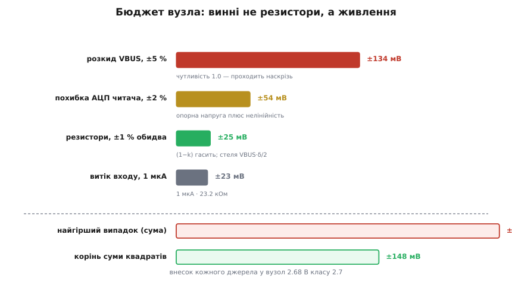
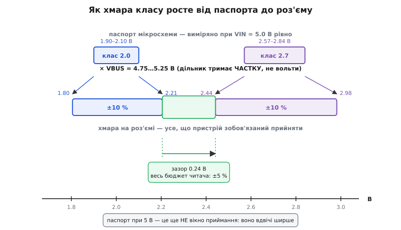
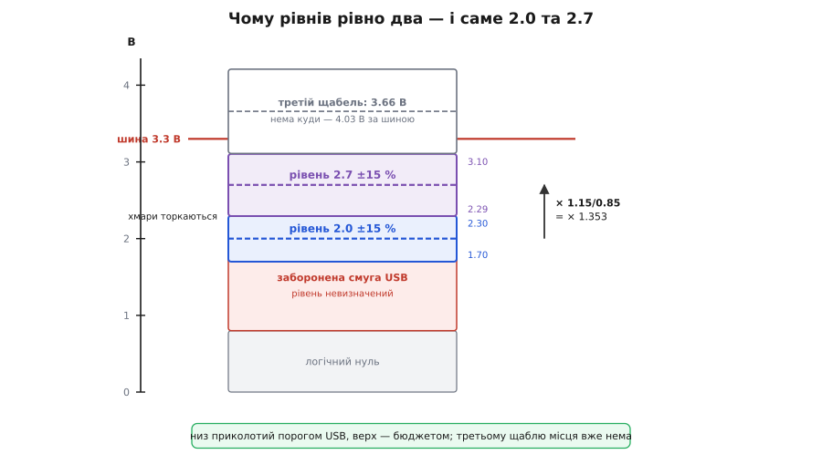

# 🧮 Бюджет вікна: звідки ±5 % і чому рівні стоять за 0.7 В

> Числова вставка до дільникового кодування Apple. У самій темі приймальні вікна подано як даність: 1.9–2.1 В для класу 2.0 і 2.57–2.84 В для класу 2.7 — щедрі смуги, майже ±5 % кожна. Тут вони перестають бути даністю. Ми складемо бюджет по кожному доданку — живлення, резистори, АЦП, витік — і побачимо дві речі, яких із готових цифр не видно. Перша: паспортна смуга мікросхеми **не є** вікном приймання, справжнє вікно вдвічі ширше. Друга: зазор між 2.0 і 2.7 не вибрано на смак — він **порахований**, і рівні стоять рівно так далеко, як вимагає бюджет, ні на сотку далі.

### Що таке бюджет і чому це не просто сума

Слово «бюджет» тут не метафора бухгалтерії, а точний термін. Є величина, яку схема **мала б** видати, — номінал. Є те, що видає конкретний примірник о третій ночі на морозі, — і воно інше. Різницю творить не одна причина, а кілька незалежних: резистор із заводу вийшов не тим, живлення просіло, опорна напруга читача поїхала. Бюджет — це облік, який перетворює **список причин** на **один гарантований проміжок**: ось межі, за які не вийде жоден законний примірник.

Але сам по собі проміжок нічого не вартий, поки не сказано, **навіщо** його рахують. А рахують його заради рішення. Вікно приймання — це вирішальна область: пристрій міряє вольти й за ними називає клас. І така область мусить одночасно вдовольнити дві вимоги, що тягнуть у різні боки:

- **повнота** — кожне законне джерело свого класу мусить потрапити всередину, інакше чесний блок відкинуть як чужий; це тисне вікно **ширшати**;
- **роздільність** — жодне джерело сусіднього класу не сміє потрапити всередину, інакше десятиватний блок прочитають як дванадцятиватний; це тисне вікно **вужчати**.

Ось де бюджет робить свою справжню роботу. Він не просто називає число — він відповідає, чи ці дві вимоги взагалі **сумісні** за даного розкладу рівнів. Якщо хмара відхилів класу 2.0 дістає туди, куди дістає хмара класу 2.7, то вікна не існує: жодним вибором порогів код не врятувати, бо два різні джерела фізично видають ту саму напругу. Бюджет — це перевірка, чи код узагалі можливий, і аж потім — креслення його меж.

Звідси й спосіб читати цю вставку. Ми не будемо доводити готові цифри до готових цифр. Ми складемо хмару кожного класу з фізичних причин, подивимося, скільки між хмарами лишилося порожнечі, — і ця порожнеча сама розкаже, чому рівні саме такі.

### Дільник тримає частку — і це змінює арифметику

Перш ніж рахувати доданки, треба зрозуміти, у чому їх рахувати. І тут дільник підказує відповідь сам.

[Дільник напруги](book:electronics/voltage-divider) не тримає вольтів. Він тримає **частку**: вузол сідає на k = R_низ / (R_верх + R_низ) від того, що прийшло згори. Частка — величина безрозмірна, і вольти народжуються лише множенням її на VBUS:

```
U = VBUS · k
```

Множення, а не додавання. Це дрібниця на вигляд, але вона перевертає всю арифметику бюджету. Візьміть логарифм від обох боків — і побачите, чому:

```
ln U = ln VBUS + ln k
```

Відхили, які додаються, — це відхили **логарифмів**, тобто **відносні** відхили, відсотки. Не мілівольти. Мілівольт — величина похідна: він у різних місцях осі важить по-різному, бо тридцять мілівольт на вузлі 2.0 В і тридцять мілівольт на вузлі 2.7 В — це різні частки того, що є. Природна одиниця бюджету дільника — відсоток, а природна відстань між двома рівнями — **відношення**, а не різниця.

Тримайте цю думку: вона одна пояснить наприкінці, чому 0.7 В — не те число, яке хтось вибирав.

### Чутливість: чому резистори майже не винні

Перший доданок — резистори. Інтуїція каже: два резистори по одному відсотку, значить, разом два відсотки. Інтуїція помиляється, і помиляється повчально.

Як саме допуски просочуються крізь дільник, у книзі вже розібрано, тож візьмімо готовий результат. Відносний відхил частки дорівнює `δk/k = (1 − k)(δ₂ − δ₁)`: важить **різниця** відхилів, а не їхня сума. Тому однакове зрушення обох плечей — спільний нагрів, старіння — скорочується начисто: помножте чисельник і знаменник дробу на те саме число, і дріб не ворухнеться. Гине лише те, що розводить плечі різно, та ще й пригашене множником (1 − k). Виведення, узгоджені пари й порівняння з RSS — у [допусках дільника](book:electronics/voltage-divider/math-tolerance.md).

Нам ця формула потрібна не сама по собі. Бюджет складається в **мілівольтах**, бо вікно задано в них, — тож переведімо відносне в абсолютне, помноживши на живлення:

```
|δU| = VBUS · k · |δk/k| = VBUS · k(1 − k) · |δ₂ − δ₁|
```

І ось тут з'являється те, чого у відносній формулі не видно. Добуток k(1 − k) — це парабола, і вона має стелю: за k = ½ вона дорівнює ¼ і більше не буває **ніколи**. А найгірше, що можуть утнути два одновідсоткові резистори, — розійтися в різні боки, |δ₂ − δ₁| = 2δ. Складімо:

```
|δU| ≤ VBUS · ¼ · 2δ = VBUS · δ/2
```

Для п'яти вольтів і одновідсоткових резисторів це **25 мВ**. Стеля. Не «зазвичай», а фізично недосяжна межа: хай там які плечі ви підберете, з одновідсоткових резисторів більшої абсолютної похибки на п'яти вольтах не витиснути. Перевірмо на обох плечах теми:

**Приклад (внесок резисторів у кожен вузол).**

```
Плече D+ :  43.2 кОм / 49.9 кОм
  k = 49.9/93.1 = 0.5360        (1 − k) = 0.4640
  δk/k = 0.4640 · 0.02 = 0.928 %
  U = 5.0 · 0.5360 = 2.680 В  →  δU = 2.680 · 0.00928 = 24.9 мВ

Плече D− :  75 кОм / 49.9 кОм
  k = 49.9/124.9 = 0.3995       (1 − k) = 0.6005
  δk/k = 0.6005 · 0.02 = 1.201 %
  U = 5.0 · 0.3995 = 1.998 В  →  δU = 1.998 · 0.01201 = 24.0 мВ

Обидва вперлися в ту саму стелю VBUS·δ/2 = 25 мВ — і не дивно:
k(1−k) = 0.249 і 0.240, тобто обидва плеча сидять майже на вершині параболи.
```

Двадцять п'ять мілівольт. Проти вікна завширшки ±140 мВ — шум, дрібниця, майже нічого. Головний підозрюваний виявився невинним.

> 🔧 **Навіщо це.** Тут — практична відповідь на щоденну спокусу. Побачивши вікно ±5 %, інженер тягнеться поставити резистори точніші: не 1 %, а 0.1 %, «щоб напевно». Порахуйте, що він купує: 25 мВ перетворяться на 2.5 мВ. Двадцять два мілівольти виграшу — у бюджеті, де самé живлення гуляє на сто тридцять чотири. Це не економія на резисторах, це розуміння, куди дивитися: у бюджеті дільника резистори майже ніколи не є вузьким місцем, і гроші, вкладені в їхню точність, здебільшого викинуто. Про те, звідки взагалі береться відсоток розкиду й чому 43.2 кОм — це [ряд E96](book:math/e-series), а не примха, — у [допуску резисторів](book:electronics/resistor-tolerance).

### VBUS: єдиний, хто справді важить

Якщо не резистори, то хто? Погляньмо на другий множник у U = VBUS · k тим самим способом — через відносну чутливість.

```
S(VBUS) = (∂U/∂VBUS) · VBUS/U = k · VBUS/(VBUS·k) = 1
```

Одиниця. Рівно одиниця, без жодного пригашення. Скільки відсотків набере живлення — стільки ж набере вузол, один в один, і ніякий вибір плечей цього не змінить: частка на те й частка, щоб чесно віддавати все, що їй дали.

А скільки набирає живлення? [Специфікація USB 2.0](book:electronics/legacy-charging) дозволяє порту з повним навантаженням тримати від **4.75 до 5.25 В** — це рівно 5.00 ±5 %. Отже, ±5 % проходять у вузол наскрізь і без бою: на вузлі 2.68 В це ±134 мВ.

Порівняння вбивче. Резистори — 25 мВ, живлення — 134. У п'ять із половиною разів більше. І це ще не все: свою частку додає читач. Пристрій міряє вольти своїм АЦП, а той міряє їх відносно власної [опорної напруги](book:electronics/voltage-reference); нескалібрований внутрішній бандгеп дешевого мікроконтролера на ±2 % — звичайне діло, і це вже ±54 мВ. Плюс той витік, що вже пораховано в темі: мікроампер на вихідному опорі 23.2 кОм — ще 23 мВ.


*Увесь бюджет вузла класу 2.7 в одній картинці. Смуга живлення довша за решту разом узяту — і саме її не можна ні здешевити, ні підтягнути кращими деталями, бо вона приходить іззовні. Резистори, на яких зосереджена вся увага новачка, — третя знизу.*

### Як складати: і чому живлення не має права на знижку

Чотири числа є. Лишається питання, від якого залежить усе: **як їх з'єднати в одне?**

Два звичні способи вже знайомі з допусків дільника. Скласти в лоб — [найгірший випадок](book:electronics/worst-case-analysis): 134 + 54 + 25 + 23 = 236 мВ, гарантія залізна, за ці межі не вийде ніхто, але й песимізм неабиякий. Або [скласти квадратично](book:math/error-propagation), бо шанс, що всі чотири біди трапляться разом і саме в один бік, мізерний:

```
√(134² + 54² + 25² + 23²) = √(17956 + 2916 + 625 + 529) = √22026 = 148 мВ
```

Сто сорок вісім проти двохсот тридцяти шести. Різниця в півтора раза — і в ній уся різниця між схемою, що ледве влазить, і схемою, що влазить із запасом. Спокуса взяти менше число велика.

Але квадратичне складання не безкоштовне: воно **припускає**, що доданки незалежні й розкидані випадково довкола нуля. Купа резисторів із заводу — так, це чесна випадкова вибірка. А живлення? І тут ховається пастка, задля якої це й варто рахувати руками. **Розкид VBUS — не випадковий.** Конкретний блок не «розігрує» своє живлення щоразу заново — він сидить на своєму зміщенні **завжди**. Фірмовий дванадцятиватний адаптер Apple видає 5.2 В — не інколи, а щоразу, кожен примірник, усе своє життя. Десятиватний видає 5.1 В. Для цих блоків «+4 %» і «+2 %» — не хвіст розподілу, а паспорт. Це системне зміщення, і в бюджет воно мусить іти **лінійно**, повною величиною, без жодних поблажок від теорії ймовірностей.

Тому чесний бюджет тут — мішаний: систематичне складаємо лінійно, випадкове — квадратично. Живлення заходить усіма своїми п'ятьма відсотками; резистори й нелінійність АЦП можуть скинутися квадратично між собою. Саме так ми й рахуватимемо далі — і саме тому всюди фігуруватимуть круглі п'ять відсотків, а не пригладжені три. (Ширший погляд на те, як такий облік ведуть за правилами й чому в ньому розрізняють тип A і тип B, — у [бюджеті невизначеності](book:physics/uncertainty-budget).)

### Що насправді означає 2.57–2.84

Тепер, маючи доданки й спосіб їх складати, повернімося до паспортних цифр — і прочитаймо їх уважніше, ніж зазвичай читають.

Ось рядок із даташита TI на TPS2513/TPS2514 — мікросхеми, що видають цей підпис у кремнії (SLVSBY8D, розділ Electrical Characteristics):

```
VDP1_2.7V   DP1 output voltage   VIN = 5 V, IDP1 = −5 мкА   min 2.57  typ 2.7  max 2.84  В
VDM1_2V     DM1 output voltage   VIN = 5 V, IDM1 = −5 мкА   min 1.9   typ 2    max 2.1   В
RDP1_PAD1   DP1 output impedance VIN = 5 V                  min 24    typ 30   max 36    кОм
```

Придивіться до колонки умов. **VIN = 5 V.** Не «4.5…5.5», хоч уся решта даташита живе в цьому діапазоні, — а рівно п'ять вольтів. Ці смуги виміряно на ідеальному живленні.

Отже, 2.57–2.84 — це **паспорт джерела**, розкид самої мікросхеми: технологія, температура від −40 до 125 °C, і нічого більше. Це ще не вікно приймання. Це навіть не те, що побачить пристрій, — бо між кремнієм і пристроєм лежить VBUS, яка рівно п'ять вольтів буває хіба на стенді.

Додаймо її. Чутливість до VBUS — одиниця, тож паспортні межі просто множаться на межі живлення:

```
Клас 2.7 на роз'ємі:  2.57 · (4.75/5) … 2.84 · (5.25/5)  =  2.44 … 2.98 В
Клас 2.0 на роз'ємі:  1.90 · (4.75/5) … 2.10 · (5.25/5)  =  1.81 … 2.21 В
```

Хмара кожного класу подвоїлася: паспортні ±5 % плюс живленнєві ±5 % дають **±10 %** на роз'ємі. І це вже не гіпотеза, а зобов'язання: пристрій, який хоче працювати з будь-яким законним джерелом — і з мікросхемою, і з блоком на чотирьох резисторах, — мусить приймати **всю** цю смугу. Вікно приймання класу 2.7 — це 2.44–2.98, а не 2.57–2.84.


*Паспорт мікросхеми — верхній ряд — виміряно на рівно п'яти вольтах. На роз'єм він приходить помноженим на живлення й розповзається вдвічі. Те, що лишилося між хмарами, — зелена смужка 0.24 В — і є весь бюджет читача. Ані міліметра більше йому ніхто не дасть.*

Порахуймо цю смужку — вона тут головна:

```
Стеля хмари 2.0 :  2.21 В
Підлога хмари 2.7:  2.44 В
Зазор            :  0.24 В,  середина 2.32 В

У відсотках від середини:  ±0.118/2.32 = ±5.1 %
```

**Рівно п'ять відсотків.** Стільки, і ні на йоту більше, лишилося на все, що є в пристрої: на його опорну напругу, на нелінійність АЦП, на гістерезис порогів, на витік входу.

Отже, бюджет замикається трьома п'ятірками: **±5 % джерело, ±5 % живлення, ±5 % читач**. Разом ±15 %. Запам'ятайте це число — за хвилину воно пояснить усе інше.

### Зазор: 0.7 В — це тінь відношення 1.35

Тепер повернімо ту думку, що всі відхили тут множаться, а не додаються. Вона й дасть відповідь на головне питання.

Два класи не сплутати, поки їхні хмари не перетнулися. Хай рівні — U₁ і U₂ (U₂ вище), а сумарний відносний бюджет — w однаковий для обох, бо всі доданки відносні. Хмара нижнього класу дістає вгору до U₁(1 + w), хмара верхнього провисає вниз до U₂(1 − w). Умова, щоб вони розминулися:

```
U₂ · (1 − w)  >  U₁ · (1 + w)
```

Поділімо обидва боки на U₁(1 − w) — і U₁ з U₂ злипнуться в одне-єдине число:

```
U₂/U₁  >  (1 + w) / (1 − w)
```

Ось воно. Умова роздільності не знає ні вольтів, ні різниць — вона знає **тільки відношення рівнів**. Різниця 0.7 В сама по собі не означає нічого: якби рівні стояли на 20 і 20.7 В, той самий зазор у сім десятих вольта не рятував би вже нічого, бо ±15 % від двадцяти — це три вольти. Роздільність — властивість відношення, і крапка.

Підставмо наш бюджет:

```
w = 15 %  →  мінімальне відношення = 1.15 / 0.85 = 1.3529
```

А тепер порахуймо те, що обрала Apple:

```
2.7 / 2.0 = 1.35
```

Тридцять п'ять сотих проти тридцяти п'яти й двадцяти дев'яти десятитисячних. Розбіжність — **дві десятих відсотка**. Рівні стоять рівно на межі: ще на волосину ближче — і класи почали б плутатися.

Перевірмо це з іншого боку — спитаймо навпаки: а який бюджет ця пара витримує? Хай хмари торкаються рівно:

```
2.7 · (1 − w) = 2.0 · (1 + w)
2.7 − 2.7w = 2.0 + 2.0w
0.7 = 4.7w
w = 0.7/4.7 = 14.89 %
```

Чотирнадцять і дев'ять десятих відсотка. Три наші п'ятірки дають п'ятнадцять. Пара 2.0/2.7 витримує рівно той бюджет, який у неї є, — і **ані відсотка більше**. Це не запас, це точна підгонка: конструкція сидить на лезі.

Ось і відповідь, обіцяна на початку. Зазор 0.7 В ніхто не вибирав. Вибирали **відношення** 1.35, і вибирало його не чуття, а нерівність `r > (1 + w)/(1 − w)` з трьома п'ятивідсотковими доданками всередині. Сім десятих вольта — лише тінь, яку це відношення кидає на вісь, коли нижній рівень стоїть на двійці. Постав нижній рівень інде — і «магічні» 0.7 В стануть іншим числом, а відношення 1.35 лишиться.

### Чому низький рівень — рівно 2.0

Але звідки взявся сам нижній рівень? Чому двійка, а не одиниця й не півтора? Це вже не бюджет — це чужий поріг, у який кодування вперлося.

Лінії D+/D− — не просто дроти, це входи USB-приймача, і в нього є свої уявлення про те, що на них написано. Ось рядки з даташита фізичного рівня USB (Microchip USB3250, таблиця DC-характеристик аналогових виводів DP/DM):

```
VILSE   Single-Ended Receiver Low Level Input Voltage    max  0.8   В
VIHSE   Single-Ended Receiver High Level Input Voltage   min  2.0   В
VHYSSE  Single-Ended Receiver Hysteresis                 0.050 … 0.150 В
```

**2.0 В — це поріг логічної одиниці.** Рівно та напруга, від якої однокінцевий приймач USB починає впевнено бачити на лінії одиницю. А нижче двійки й вище 0.8 В простягається смуга, де він не бачить нічого певного: не нуль і не одиниця, вихід приймача може блукати або дзвонити.

Тепер ясно, чому нижній код не можна опустити. Постав його на 1.5 В — і обидві лінії даних сядуть у заборонену смугу й лишаться там **назавжди**, поки блок під'єднано. Не на наносекунду переходу, а постійно. Приймач пристрою весь цей час стоятиме в невизначеності, і що він при цьому надумає про стани шини — питання до конкретного кремнію, а не до специфікації.

Тому 2.0 В — не вибір із міркувань зручності, а **найнижче безпечне місце**, куди взагалі можна поставити код: перша напруга, яку кожен USB-приймач у світі читає як однозначну одиницю. Знизу кодування приколоте намертво, і не Apple цей кілок забивала.

### Чому високий — 2.7, і чому третього не буде

Далі все складається саме собою, і це найкраща частина.

Нижній рівень приколотий порогом USB до 2.0 В. Мінімальне відношення до наступного щабля диктує бюджет — 1.3529. Помножмо:

```
2.0 · (1.15/0.85) = 2.0 · 1.3529 = 2.706 В  →  2.7 В
```

**Верхній рівень не вибирали — його порахували.** Це нижній рівень, відсунутий рівно на товщину бюджету, заокруглений до десятих. Уся «магія» пари 2.0/2.7 — це поріг USB, помножений на три п'ятивідсоткові допуски.

А чому щаблів рівно два? Спитаймо: де стояв би третій? Та за тим самим правилом:

```
третій рівень = 2.0 · 1.3529² = 3.66 В
його хмара вгорі = 3.66 · 1.10 = 4.03 В
```

Чотири вольти на лінії даних. Лінії D+/D− живуть від трьохвольтової з третиною шини — приймач пристрою живиться з неї ж. Чотири вольти на такому вході — це не «поза вікном», це прямий шлях крізь захисний діод у шину живлення. Третьому щаблю **фізично нема куди стати**.


*Уся конструкція в одному кадрі. Знизу — заборонена смуга USB, нижче 2.0 В коду ставити не можна. Згори — шина 3.3 В, вище неї нема місця. Між ними двома влазять рівно два щаблі з кроком 1.353, і другий із них падає на 2.706 — тобто на 2.7. Третій щабель мусив би стати на 3.66 і своїм верхнім краєм вилізти на 4.03 В — за шину. Двох рівнів на лінію не мало й не багато: це стеля, яку дозволяє смуга.*

Ось чому код Apple — рівно два біти. Не тому, що чотирьох класів вистачило (хоча вистачило), і не тому, що більше не хотілося. Два рівні на лінію — **максимум**, який уміщається між порогом приймача знизу й шиною живлення згори за бюджету в п'ятнадцять відсотків. Дві лінії по два рівні дають чотири комбінації — і саме чотири класи струму ми й бачимо в таблиці. Кількість класів у цьому кодуванні — не рішення продуктової команди, а наслідок трьох допусків і двох чужих порогів.

### Де це працює: три наслідки, які видно тільки з бюджетом

Бюджет складено. Тепер найцікавіше — подивитися, що він пояснює з того, що інакше лишається загадкою.

**Наслідок перший: загадка 5.2 В розв'язується.** У темі показано, що фірмовий адаптер на 5.2 В піднімає вузол класу 2.0 до 2.08 В і той опиняється за два десятки мілівольт від стелі 2.10. Тривожно. Доведімо рахунок до кінця — додаймо резистори:

```
VBUS = 5.2 В,  плече D− (75 кОм / 49.9 кОм,  k = 0.3995)

  U_ном = 5.2 · 0.3995 = 2.0775 В        → до стелі 2.10 лишилось 22 мВ
  розкид резисторів: ±(1−k)·2 % = ±1.201 %  →  ±25 мВ

  верхній кут:  2.0775 · 1.01201 = 2.1025 В   ← на 2.5 мВ ВИЩЕ за 2.10
```

Тобто справа гірша, ніж здавалося: чесний блок на законних резисторах не просто підходить до стелі — він її **переступає**. Якби 1.9–2.1 справді було вікном приймання, такий блок відкидали б як чужий.

Але ми вже знаємо, що це не вікно приймання, а паспорт при VIN = 5 В. Справжнє вікно класу 2.0 — 1.81–2.21 В, і 2.1025 сидить у ньому глибоко, з запасом у сотню мілівольт. Тривога знімається — але знімає її саме бюджет, і тільки він. Пристрій, чий програміст узяв цифри 1.9–2.1 з даташита джерела й поставив їх за пороги приймання, зробив рівно ту помилку, від якої ця вставка й застерігає: **паспорт джерела — не вікно приймача**.

**Наслідок другий: збіг, який уже не збіг.** Помітьте, який саме блок видає 5.2 В. Дванадцятиватний — а він, за таблицею, підписаний парою 2.7/2.7. У нього **взагалі нема лінії на 2.0 В**. Найгарячіший по живленню блок — єдиний, якому клас 2.0 не потрібен. А той, що таки має лінію 2.0, — десятиватний із парою 2.7/2.0 — тримає скромніші 5.1 В:

```
VBUS = 5.1 В,  плече D− :  U = 5.1 · 0.3995 = 2.038 В
  верхній кут із резисторами: 2.038 · 1.01201 = 2.062 В
  до паспортної стелі 2.10 — ще 38 мВ запасу
```

Чи то Apple порахувала це навмисно, чи так вийшло — сказати нема з чого, специфікації ніхто не публікував. Але арифметика виходить рівною: жоден фірмовий блок не притискає власний клас 2.0 до стелі, бо блок, який притиснув би, цього класу не використовує.

**Наслідок третій, найкорисніший: п'ять відсотків можна не платити.** Погляньте ще раз на бюджет читача. Він має ±5 %, і половину з них з'їдає власна опорна напруга АЦП. Але ж пристрій міряє **частку** — то навіщо йому взагалі абсолютні вольти?

Хай АЦП міряє й лінію, і саму VBUS (через свій дільник 1:2 — його вішати на силову шину можна, вона це навіть не помітить). Тоді:

```
відлік лінії :  N_dp = N_повн · U_dp / U_оп
відлік VBUS  :  N_vb = N_повн · (VBUS/2) / U_оп

їхнє відношення:  N_dp / N_vb = U_dp / (VBUS/2) = 2 · U_dp/VBUS = 2k
```

Опорна напруга U_оп скоротилася. VBUS скоротилася. Лишилося чисте k — те саме число, яке дільник і тримає незмінним. [Рейтіометричне вимірювання](book:electronics/ratiometric-measurement) прибирає з бюджету **обидва** найбільші доданки — ±5 % живлення й похибку опорної — за ціною двох резисторів і одного ділення. Бюджет із п'ятнадцяти відсотків падає десь до шести-семи, і конструкція злазить із леза.

```c
#include <stdbool.h>
#include <stdint.h>

typedef enum { SRC_UNKNOWN, SRC_500MA, SRC_1A, SRC_2A1, SRC_2A4 } src_class_t;

/* Міряємо не вольти, а ЧАСТКУ від VBUS — тоді розкид живлення й похибка
   опорної напруги скорочуються самі. adc_dp, adc_dm — сирі відліки з ліній
   D+/D−; adc_vb — відлік із дільника 1:2, підвішеного на саму VBUS. */

#define K_SCALE     1000   /* частка × 1000 */
#define K_2V0        400   /* 2.0/5.0 = 0.400 */
#define K_2V7        540   /* 2.7/5.0 = 0.540 */
#define K_TOL_PCT     10   /* ±10 %: паспорт джерела ⊕ дільник VBUS ⊕ нелінійність */

static int32_t k_of(uint32_t adc_line, uint32_t adc_vb)
{
    /* adc_vb міряє VBUS/2, тож повна шина — це 2·adc_vb */
    return (int32_t)((adc_line * (uint32_t)K_SCALE) / (2u * adc_vb));
}

static bool near_level(int32_t k, int32_t k_nom)
{
    int32_t tol = k_nom * K_TOL_PCT / 100;
    return k >= k_nom - tol && k <= k_nom + tol;
}

src_class_t classify_ratiometric(uint32_t adc_dp, uint32_t adc_dm, uint32_t adc_vb)
{
    if (adc_vb == 0) return SRC_UNKNOWN;      /* шина ще не піднялася */

    int32_t k_dp = k_of(adc_dp, adc_vb);
    int32_t k_dm = k_of(adc_dm, adc_vb);

    bool dp20 = near_level(k_dp, K_2V0), dp27 = near_level(k_dp, K_2V7);
    bool dm20 = near_level(k_dm, K_2V0), dm27 = near_level(k_dm, K_2V7);

    if (dp20 && dm20) return SRC_500MA;       /* слабке джерело   */
    if (dp20 && dm27) return SRC_1A;          /* Divider 1,  5 Вт */
    if (dp27 && dm20) return SRC_2A1;         /* Divider 2, 10 Вт */
    if (dp27 && dm27) return SRC_2A4;         /* Divider 3, 12 Вт */
    return SRC_UNKNOWN;
}
```

**Приклад (проженімо крізь нього справжній блок).** Десятиватний адаптер на 5.1 В, 12-бітний АЦП, опорна 3.3 В — числа беремо реальні.

```
D+ = 5.1 · 0.5360 = 2.734 В  →  adc_dp = 4095 · 2.734/3.3 = 3393
D− = 5.1 · 0.3995 = 2.038 В  →  adc_dm = 4095 · 2.038/3.3 = 2529
VBUS/2 = 2.55 В              →  adc_vb = 4095 · 2.55/3.3  = 3164

k_dp = 3393 · 1000 / (2 · 3164) = 536      вікно 2.7: 486…594  ✓
k_dm = 2529 · 1000 / (2 · 3164) = 399      вікно 2.0: 360…440  ✓

→ 2.7 / 2.0  →  SRC_2A1,  бери 2.1 А
```

Зверніть увагу, що вийшло: 536 і 399 — це рівно ті частки 0.536 і 0.400, які задали резистори блока. П'ять вольтів чи п'ять і одна десята — код не ворухнувся. Ми питали дільник про те єдине, що він насправді знає, — і він відповів без похибки живлення, бо тієї похибки в його відповіді ніколи й не було. Вона з'являлася лише тоді, коли ми наполягали міряти вольти.

> 🔧 **Навіщо це.** Це не хитрий трюк, а загальне правило, яке варто винести за межі цієї теми. Коли джерело сигналу **рейтіометричне** — тобто його вихід пропорційний власному живленню, — міряти його треба теж рейтіометрично, від того самого живлення. Тоді найбільший доданок бюджету зникає не завдяки кращим деталям, а тому, що його ніколи й не було в тій величині, яку ви насправді хочете знати. Так само поводяться тензомости, потенціометри-датчики положення й самі резистивні дільники: усі вони кажуть частку, і всі вони псуються, щойно ви почнете віднімати від їхніх слів абсолютні вольти.

### Статус цих чисел

Наостанок — чесно про доказовість, бо вона тут різна.

**Виміряне й задокументоване:** паспортні смуги 2.57/2.7/2.84 і 1.9/2/2.1 при VIN = 5 В, вихідний опір 24/30/36 кОм, поріг від'єднання 310/330/350 мВ — усе це прямі рядки з даташита TI SLVSBY8D на TPS2513/TPS2514. Межі VBUS 4.75–5.25 В — специфікація USB 2.0. Пороги приймача VILSE = 0.8 В і VIHSE = 2.0 В — даташит USB-фізики. Напруги фірмових блоків 5.1 В (10 Вт, A1357) і 5.2 В (12 Вт, A1401) — їхні власні шильдики.

**Реконструкція:** ланцюжок «поріг 2.0 В × (1.15/0.85) = 2.706 ≈ 2.7» — це **наш** висновок, а не цитата. Apple цієї специфікації не публікувала ніколи, тож перевірити задум нема з чим. На користь реконструкції — те, як щільно сходиться арифметика: обране відношення 1.35 відрізняється від порахованого 1.3529 на дві десятих відсотка, а бюджет, який ця пара витримує (14.89 %), збігається з трьома п'ятивідсотковими допусками з точністю до похибки заокруглення. Збіг такої тісноти буває або задумом, або дуже добре замаскованим випадком. Але це саме сильний аргумент, а не документ.

І остання дрібниця, яку бюджет пояснює мимохідь. У темі згадано, що джерела не сходяться в цифрі: одні пишуть 2.7 В, інші 2.8. Тепер видно, звідки різнобій і чому обидві сторони по-своєму мають рацію. Хмара класу 2.7 на роз'ємі — це 2.44–2.98 В; ентузіаст, який міряв свій блок на своєму столі, бачив у ній **одну точку** й називав її іменем усього класу. Той, чий адаптер видавав 5.2 В, чесно бачив 2.79 і писав «2.8». Той, чий тримав 5.0, бачив 2.68 і писав «2.7». Обидва праві, обидва міряли те саме — просто вимірювали не рівень, а свій примірник живлення. Широке вікно на те й широке, щоб умістити обидві правди.
