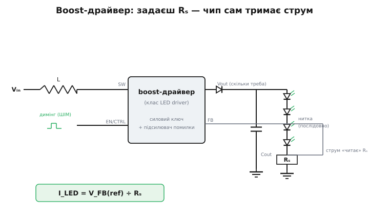
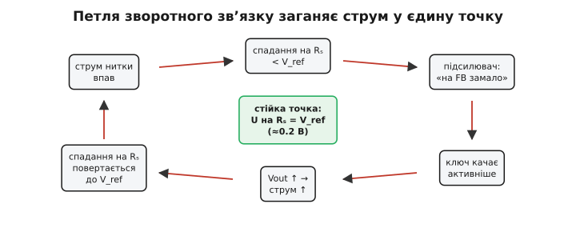

# Драйвер підсвітки: керування струмом, а не напругою

### Що це за клас

Це спеціалізована мікросхема — **підвищувальний (boost, англ. *to boost* — підняти) драйвер світлодіодів** для підсвітки. Вона бере низьку напругу живлення (3.3–5 В), піднімає її до тієї, що потрібна нитці послідовних білих світлодіодів (часом 15–25 В), і — головне — тримає крізь нитку **заданий струм**, а не напругу. По суті це готове кероване **джерело струму** (англ. *constant-current driver* — драйвер сталого струму) з усією силовою частиною всередині. Англійський фах так його й називає — *LED driver* (драйвер світлодіодів), де *driver* у силовій електроніці означає вузол, що сам формує потрібну величину для навантаження, а не просто його вмикає.

Чому саме струм, а не напруга? Бо яскравість і колір білого світлодіода визначає **струм крізь нього**, а не напруга на ньому. [Світлодіод — це діод](book:electronics/led-photodiode): його вольт-амперна характеристика експоненційна, тож крихітна зміна прямої напруги Vf дає величезну зміну струму. Поставите фіксовані, скажімо, 3.2 В на синій кристал — і за межами кімнатної температури струм «попливе»: нагрівся кристал, його Vf трохи впав, на тих самих 3.2 В струм підскочив, кристал нагрівся ще дужче — це **тепловий розгін**, типова смерть світлодіода від керування напругою. Якщо ж тримати фіксований струм, драйвер сам підкручує напругу слідом за Vf, і робоча точка стоїть як укопана. Тому **яскравість стабільна лише при стабільному струмі** — звідси весь цей клас мікросхем.

Чому **послідовна нитка**, а не паралель? Бо в послідовному з'єднанні крізь усі світлодіоди тече **той самий струм** — однакова яскравість гарантована автоматично. Якби ви з'єднали кристали паралельно й подали спільну напругу, той, у кого Vf трохи менший, забрав би собі більше струму, світив би яскравіше й грівся дужче — а нерівність із часом тільки росте. Послідовне з'єднання знімає цю проблему ціною високої сумарної напруги: чотири білих світлодіоди по ~3.2 В — це вже ~13 В, шість — під 20 В. Ось чому потрібен [**boost** — підвищувальний перетворювач](book:electronics/boost): підняти 3.3–5 В живлення до напруги, якої просить уся нитка.

> 🔧 **Навіщо це.** Будь-який кольоровий дисплей із LCD-панеллю (а це переважна більшість екранів у embedded-пристрої) світиться не сам — його підсвічує нитка білих світлодіодів іззаду. Саме цей чип нею керує: тримає яскравість рівною попри розряд батареї та нагрів, і дає вам одну ручку димінгу. Без нього панель або тьмяніє з просадкою живлення, або вигорає. Як влаштована вся [підсистема підсвітки](book:electronics/backlight-dimming) — від простого резистора до повного перетворювача, з боку керування яскравістю й мерехтінням — це окрема тема; тут ми дивимося на саму **схему драйвера**.

### Плата й розпіновка

Навколо мікросхеми — класична boost-обвʼязка: **котушка** L від входу до вузла комутації, вбудований (або зовнішній) ключ і діод, вихідний конденсатор, нитка світлодіодів — і **вимірювальний резистор Rₛ** знизу нитки, спадання на якому й каже драйверу поточний струм.


*Драйвер качає енергію через котушку L, піднімаючи Vout рівно настільки, щоб крізь нитку йшов заданий струм. Струм «читає» резистор Rₛ на ніжці FB; ніжка EN вмикає драйвер і приймає ШІМ-димінг. Напругу Vout чип виставляє сам — стільки, скільки просить нитка.*

Типові виводи: **VIN** (живлення), **SW** (до котушки), **GND**, **FB** (вхід зворотного звʼязку — сюди заводять Rₛ), **EN/CTRL** (увімкнення й димінг), нерідко окремий вхід захисту від перенапруги (**OVP**).

Як ці деталі працюють разом, варто проговорити, бо це пояснює, чому boost узагалі здатний підняти напругу — енергії ж нізвідки не береться. Ключ усередині чипа періодично замикає вузол **SW** на землю. Поки він замкнений, до котушки прикладена вхідна напруга, і струм у ній наростає лінійно — котушка **накопичує енергію в магнітному полі** (½·L·I²). Коли ключ розмикається, струм у котушці не може обірватися миттєво (індуктивність опирається зміні струму), тож котушка «вистрілює» цей струм далі — крізь діод у вихідний конденсатор, піднімаючи напругу на ньому **вище** вхідної. Діод не пускає заряд назад, конденсатор тримає напругу між імпульсами, а нитка живиться вже від нього. Тобто boost — це не «підсилювач напруги», а **перекачувач енергії порціями**: котушка набирає енергію від входу й віддає її у вихід на вищій напрузі, зберігаючи добуток V·I (мінус втрати). Звідси одразу випливає важливий наслідок: раз потужність на вході дорівнює потужності на виході, а напруга на виході вища — **струм на вході більший**, ніж у нитці.

### Як задати струм

Тут і захована вся суть струмового керування — а ключ до неї лежить у **зворотному зв'язку**. Розберімо механізм по колу, бо без нього формула нижче виглядає як магія.

Усередині чипа сидить підсилювач помилки. Він порівнює напругу на ніжці **FB** зі своєю внутрішньою **опорною напругою V_FB(ref)** (типово близько 0.2 В) і керує силовим ключем так, щоб ці дві величини зрівняти. А що стоїть на FB? Резистор Rₛ, увімкнений **послідовно з ниткою**, знизу: увесь струм нитки тече крізь нього на землю, і за законом Ома створює на ньому спадання U = I_LED·Rₛ. Саме це спадання заведене на FB.

Тепер замкнемо петлю причинно-наслідково. Хай струм нитки трохи **впав** (підсіла батарея, нагрілися кристали) → спадання на Rₛ стало **меншим** за 0.2 В → підсилювач помилки бачить «на FB замало» → наказує ключу качати **активніше** → Vout трохи зростає → крізь нитку йде **більший** струм → спадання на Rₛ повертається до 0.2 В. І навпаки: струм підскочив — на FB стало більше 0.2 В — чип пригальмовує. Петля сама заганяє систему в єдину стійку точку: ту, де **U на Rₛ дорівнює рівно опорним 0.2 В**.


*Будь-яке відхилення струму петля гасить тим самим колом причин і повертає в одну стійку точку — де спадання на Rₛ дорівнює опорним ≈0.2 В. Драйвер не «знає» напруги нитки; він лише тримає цю умову на FB.*

А струм у цій стійкій точці — це просто закон Ома, розв'язаний відносно I:

```
U_FB = I_LED · Rₛ        (закон Ома на вимірювальному резисторі)
у рівновазі U_FB = V_FB(ref)
⇒  I_LED = V_FB(ref) / Rₛ
наприклад:  I_LED = 0.2 В / 10 Ом = 20 мА
```

Ось чому струм задається **одним резистором**, а опорна напруга мала (0.2 В, а не 1.2 В, як у регуляторів напруги): на Rₛ губиться потужність U·I = 0.2·0.02 = 4 мВт замість 24 мВт — менший «податок» на вимірювання, менший нагрів і вищий ККД. Ви **не задаєте напругу** — ви ставите Rₛ під потрібний струм, а драйвер сам піднімає Vout рівно до тієї величини, якої просить нитка (хай скільки в ній світлодіодів). Це й є струмове керування в залізі: ви фіксуєте умову на FB, петля зворотного зв'язку робить решту.

**Worked example: вибір Rₛ і оцінка Vout для нитки підсвітки.**
Треба засвітити нитку з шести білих світлодіодів струмом 18 мА від ESP32-плати з живленням 3.7 В (літієва батарея). Кожен світлодіод при 18 мА має Vf ≈ 3.1 В; опорна напруга драйвера V_FB(ref) = 0.2 В.

```
Резистор під заданий струм:
  Rₛ = V_FB(ref) / I_LED = 0.2 В / 0.018 А = 11.1 Ом
  беремо найближчий зі стандартного ряду E24: 11 Ом
  фактичний струм = 0.2 / 11 = 18.2 мА  (похибка +1 %, у нормі)

Яку напругу виставить чип сам (нічого не задаємо — лише перевіряємо межі):
  Vнитки = 6 · Vf = 6 · 3.1 В      = 18.6 В
  + спадання на Rₛ = I·Rₛ = 0.0182·11 ≈ 0.2 В
  Vout ≈ 18.8 В

Перевірка вхідного струму (boost зберігає потужність):
  Pвих = Vout · I_LED = 18.8 · 0.0182      ≈ 0.342 Вт
  при ККД ~85 %: Pвх = 0.342 / 0.85        ≈ 0.402 Вт
  Iвх = Pвх / Vin = 0.402 / 3.7            ≈ 0.109 А ≈ 109 мА
```

Висновок: один резистор 11 Ом задає 18 мА у нитці. Чип сам підніме вихід до ~18.8 В, тож поріг OVP мікросхеми має бути **вищим** за це (інакше захист спрацює в нормальному режимі) — типово беруть запас, наприклад 25–28 В. А по входу драйвер бере ~109 мА — у шість разів більше за струм самої нитки; шина 3.7 В і її доріжки мусять це витримати без просадки.

### Як димати

Яскравість міняють через ніжку **EN/CTRL**. Найпростіше — подати на неї **ШІМ** (широтно-імпульсна модуляція, англ. *pulse-width modulation*): драйвер вмикається й вимикається з нею, нитка спалахує й гасне, а око, не встигаючи за швидким миготінням, бачить **усереднену** яскравість, що йде за шпаруватістю (англ. *duty cycle* — частка часу ввімкненого стану).

Чому димлять саме так, а не просто зменшують струм? Бо при малому струмі білий світлодіод **змінює відтінок** — люмінофор світиться інакше, ніж на номіналі, і екран жовтіє чи синіє з падінням яскравості. А ШІМ щоразу проганяє крізь нитку **повний номінальний струм** (тільки рідше) — колір лишається той самий на всіх рівнях яскравості, від 100 % до 1 %. Це і є головна причина, чому димінг роблять часом, а не амплітудою.

Звідси й пересторога про [частоту мерехтіння](book:electronics/panel-parameters): гнати ШІМ треба **швидко**, бо інакше періодичне гасіння стане видимим — як мерехтіння наживо й як смуги на знятому відео. Багато драйверів приймають і складніші способи: відфільтрований ШІМ як аналоговий рівень або навіть однопровідний **серійний код яскравості** (brightness code) на тій самій ніжці (схеми типу EasyScale — коротка послідовність імпульсів кодує число). Який саме — дивись у даташиті конкретної мікросхеми.

Глибокий димінг (відношення 1:1000 і більше), стійкість самої петлі струму, балансування кількох ниток і захист від EMI — це вже [другий шар, де ховаються підступи](book:electronics/backlight-driver/detail): boost-петля повільна за своєю природою, тож короткі імпульси повного струму потребують спецхитрощів, а частоту комутації беруть так, щоб не свистіли конденсатори й не глухло радіо.

### Типові граблі

- **Обрив нитки → перенапруга.** Це прямий наслідок самого механізму зворотного зв'язку: перегорів світлодіод — коло розірвалося — струму через Rₛ немає — на FB **нуль**, що драйверу здається «струму катастрофічно мало». Петля кидається качати на повну й **задирає Vout до межі**, намагаючись проштовхнути струм крізь розрив, якого вже не подолати. Без **OVP** (вбудованого чи зовнішнього компаратора, що обриває роботу при перевищенні) це палить ключ мікросхеми й вихідний конденсатор. OVP — не опція, а обов'язковий запобіжник саме через цю поведінку петлі.
- **Котушка.** Замала індуктивність → струм у ній за такт наростає надто круто й сильно пульсує; замалий **струм насичення** Isat → на піку котушка «насичується», її індуктивність обвалюється, струм стрибком злітає — драйвер «захлинається», гріється, шумить, а ключ ризикує згоріти. Тому L беруть так, щоб піковий струм котушки (а він вищий за вхідний — це ж пульсуючий заряд) із запасом не діставав Isat. Номінал L і її струм беруть за рекомендаціями даташита.
- **Вхідний струм більший за вихідний.** Boost зберігає потужність, а піднімає напругу — отже по входу тече **більше** струму, ніж у нитці (для нитки 18 мА під 18.8 В від шини 3.7 В це виходить близько 109 мА). Якщо про це забути, просяде вхідна шина або перегріються вхідні доріжки; джерело й доріжки входу мусять тягнути саме **вхідний**, а не вихідний струм.
- **Шум і layout FB.** FB — це крихітні десяті вольта (рівновага стоїть на 0.2 В), тож кожен мілівольт наведеної завади — це похибка струму у відсотках. Довга чи зашумлена доріжка до Rₛ ловить імпульсний шум від комутації SW і збиває регулювання — струм «дрижить», яскравість гуляє. Тому Rₛ ставлять **близько до ніжки** FB, а доріжку ведуть якнайкоротше й подалі від SW.
- **Низькочастотний ШІМ-димінг** дає [видиме мерехтіння панелі](book:electronics/panel-parameters): на низькій частоті усереднення оком ламається, і періодичне гасіння нитки стає помітним.

### Варіації класу

Для зовсім дрібних дисплеїв (один-два світлодіоди) замість котушкового boost іноді ставлять **зарядну помпу** (charge pump) — вона піднімає напругу не котушкою, а перекидаючи заряд між конденсаторами, тож обходиться **без котушки**: простіша, тихіша (нема магнітного свисту) і дешевша в розводці. Платить за це **нижчою віддачею** — помпа множить напругу дискретно (×1.5, ×2) і має гірший ККД на проміжних рівнях, тому її вистачає лише на малий струм кількох кристалів. Для кількох ниток є **багатоканальні** драйвери з вирівнюванням струму між нитками: кожна нитка має свій Rₛ-канал зі своєю петлею, щоб однакову яскравість тримати навіть при різному числі чи розкиді світлодіодів. А контролери дисплеїв вищого класу нерідко мають драйвер підсвітки **вбудованим**, керованим тими ж командами, що й сама панель, — одна мікросхема замість двох.

> 🔧 **Навіщо це.** Boost-драйвер підсвітки — це готове джерело струму, що тримає його петлею зворотного зв'язку: вона заганяє спадання на Rₛ рівно на опорні 0.2 В, тож I_LED = V_FB/Rₛ. Ви ставите Rₛ під потрібний I_LED, даєте котушку за даташитом, димаєте швидким ШІМом по EN (повним струмом, щоб не плив колір). Три обовʼязкові перевірки: захист від обриву нитки (без OVP петля сама спалить чип, задерши Vout), достатній вхідний струм (boost бере по входу в кілька разів більше, ніж віддає) і чистий, короткий FB до Rₛ (десяті вольта легко збити шумом). Напругу не чіпаєте взагалі — її чип виставить сам.
