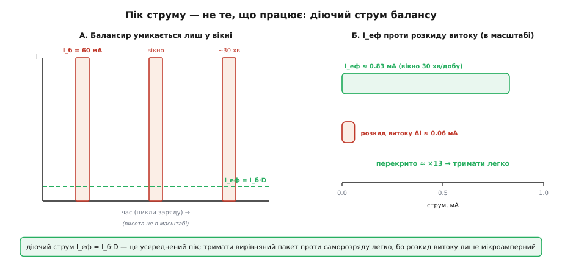
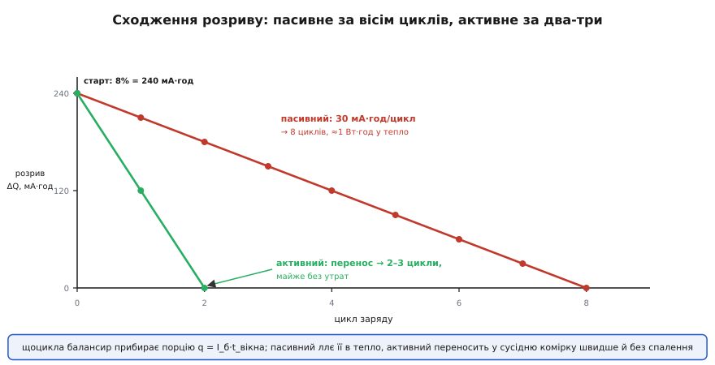
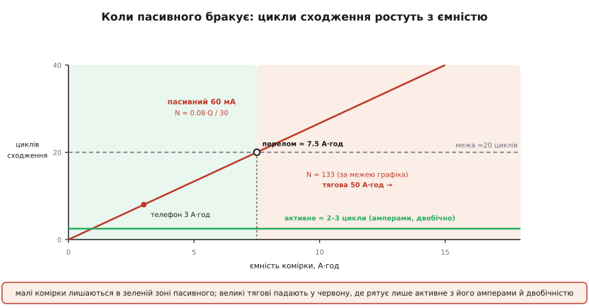

# 🧮 Бюджет струму балансування: скільки треба, щоб тримати й щоб виправити

«Скільки струму балансування треба?» — питання звучить так, ніби відповідь є одним числом. Насправді балансир воює на двох фронтах, і струми на них різняться на порядки. Один фронт тихий і безперервний: не дати коміркам розповзтися, поки вони просто лежать і саморозряджаються врізнобій. Другий гучний і разовий: стягнути назад розрив, що вже накопичився. Перший живиться **мікроамперами**, другий вимагає **десятків міліампер**. Тож «скільки треба» — це два бюджети, не один. Обидва, однак, зводяться до однієї величини, з якої варто почати, бо саме вона робить усю роботу.

## Одна величина, що вирішує все: діючий струм балансу

Балансир має струм, який ллється, **поки він увімкнений**, — назвімо його I_б. У пасивного балансира це струм крізь резистор зливу, типово десятки міліампер. Але тут ховається пастка, повз яку легко проскочити: балансир увімкнений **не завжди**. Пасивний балансир працює лише у вузькому вікні наприкінці заряду, коли напруги комірок близькі до повного й різниці добре читаються (саме там, де [OCV-крива](topic:electronics/ocv-curve) крута). Решту часу — під час розряду, у спокої, на полиці — він мовчить.

Введімо частку часу, коли балансир реально ллє струм у цю комірку, і назвімо її D (від англ. *duty* — частка ввімкнення). Тоді величина, яку насправді «бачить» комірка за довгий проміжок, — не пік I_б, а середнє:

```
I_еф = I_б · D          діючий (усереднений) струм балансу
```

Чому середнє, а не пік? Бо комірка — це резервуар заряду, а резервуарові байдуже, вливаєш ти відром раз на хвилину чи цівкою безперервно, — важить, скільки заряду прибуло **за годину**. Шістдесят міліампер, що течуть 1% часу, переносять за добу рівно стільки ж заряду, скільки 0.6 мА безперервних. Для балансу комірок це те саме джерело. Ось чому наївне «балансир дає 60 мА» оманливе: реальний важіль — 60 мА, помножені на шпаруватість, і ця шпаруватість буває крихітною.

> 🔧 **Навіщо це.** У даташиті на [монітор комірок](topic:electronics/cell-monitor-ic) стоїть струм балансування — скажімо, 50 мА. Це I_б, пікове значення. А реальна швидкість вирівнювання — I_еф = I_б·D, і вона на один-два порядки менша, бо балансир умикається лише в кінці заряду на кілька хвилин. Хто плутає I_б з I_еф, той дивується, чому пакет вирівнюється тижнями, а не за годину: розрахунок вівся по піку, а працює середнє. Обидві роботи балансира — і тримання, і виправлення — треба міряти саме через I_еф.

Тепер обидва бюджети читаються через цю одну величину. Тримати баланс — це щоб I_еф переганяв швидкість, з якою комірки розходяться. Виправити розрив — це щоб I_еф за прийнятний час стягнув накопичений заряд. Розберімо кожну роботу окремо й побачимо, які числа з них випадають.

## Робота перша — тримати: переганяти розкид витоку

Почнімо з тихого фронту. Уяви пакет, який щойно ідеально вирівняли, і лишили в спокої. Комірки не з'єднані з навантаженням, струму назовні немає. Здавалося б, стан має застигнути. Не застигає: кожна комірка потроху [губить заряд сама собою](topic:electronics/self-discharge) — електроліт повільно проводить, паразитні реакції з'їдають літій. Це саморозряд, і його виражають у відсотках ємності за місяць: у справного Li-ion це десь 1–3%/міс.

Ключ ось у чому: сам собою саморозряд **не створює розбалансу**. Якби всі комірки витікали з однаковою швидкістю, вони спорожнялися б синхронно й лишалися врівень — просто весь пакет тихо сідав би. Розбаланс родить не витік, а **розкид** швидкостей витоку. Одна комірка тече на 2%/міс, сусідня — на 3.5%/міс, і щодня друга відстає на крихту більше. Гап між ними росте зі швидкістю, що дорівнює **різниці** струмів витоку, а не самим струмам.

Щоб працювати з цим числом, переведімо відсотки-за-місяць у струм. Витік — це заряд, що йде з комірки за час, тобто струм. Якщо комірка ємністю Q губить частку r за місяць, її струм витоку:

```
I_витоку = r · Q / T_міс
```

де T_міс — місяць у годинах. Тоді розкид, що й розводить дві комірки, — це різниця двох таких струмів. Порахуймо на живих числах.

**Умова: дві сусідні комірки по 3 А·год; одна саморозряджається на 2%/міс, друга — на 3.5%/міс.**

```
місяць у годинах:     T_міс = 30.4 · 24 ≈ 730 год
витік повільнішої:    I₁ = 0.020 · 3000 / 730 = 60 / 730  ≈ 0.082 мА = 82 мкА
витік швидшої:        I₂ = 0.035 · 3000 / 730 = 105 / 730 ≈ 0.144 мА = 144 мкА
розкид витоку:        ΔI = I₂ − I₁ = 144 − 82 = 62 мкА
```

Гап відкривається зі швидкістю **62 мікроампери**. Це напрочуд мало — стільки, що людині важко й уявити такий струмець. Ось і критерій тримання: щоб рядок не розповзався, діючий струм балансу мусить повертати заряд щонайменше так само швидко, як розкид його розводить:

```
щоб тримати:   I_еф = I_б · D ≥ ΔI
```

Підставмо реальний пасивний балансир з піком 60 мА й спитаймо, яка шпаруватість тут потрібна:

```
за I_б = 60 мА:   D ≥ ΔI / I_б = 62 мкА / 60 мА = 0.00103 = 0.10%
у хвилинах за добу:  0.00103 · 1440 хв ≈ 1.5 хв/добу
```

Півтори хвилини балансування на добу перекривають увесь розкид витоку. Це майже дарма: будь-який пакет, який щодня заряджають (а отже щодня має вікно балансування хоч на кілька хвилин), тримає баланс проти саморозряду **з величезним запасом** — реальне вікно триває десятки хвилин, тобто D разів у сто більше за потрібний мінімум. Тримати баланс — легка робота; мікроамперний розкид перекривається сливе задарма.


*Пасивний балансир ллє 60 мА, але лиш у коротке вікно наприкінці кожного заряду, тож усереднений діючий струм I_еф = I_б·D — це вже частки міліампера. Утім навіть він у рази перекриває розкид саморозряду (тут ≈ 0.06 мА), тому тримати вирівняний пакет проти витоку — легко, поки він регулярно заряджається.*

Але є лиха межа, і вона повчальна. Уся легкість трималася на припущенні, що пакет **заряджають** — інакше вікна балансування немає й D падає до нуля. Пакет, що місяцями лежить на полиці зарядженим, ніхто не балансує: пасивний балансир прив'язаний до кінця заряду, а заряду нема. І тоді навіть той мізерний розкид у 62 мкА безперешкодно розводить комірки місяць за місяцем. За рік простою повільніша комірка втратить 24% ємності, швидша — 42%; розрив між ними наросте на 18% — чималий провал, який доведеться потім виправляти. Тому небезпечний не сам витік, а витік **без нагоди балансувати**.

> 🔧 **Навіщо це.** Практичний висновок різкий: балансир тримає пакет, лише поки той **живе** — заряджається й розряджається. Пакет на тривалому зберіганні дрейфує безкарно, бо вікна балансування не настають. Звідси два реальні прийоми: зберігати пакет частково зарядженим (де саморозряд повільніший і його розкид менший) і час від часу «продихати» його зарядом, щоб дати балансиру попрацювати. Стелаж зі складованими пакетами, які ніхто не циклить, — класичне місце, де ідеально вирівняні комірки тихо розповзаються.

## Робота друга — виправити: спалити накопичений розрив

Тепер гучний фронт. Припустимо, розбаланс уже накопичився — з розкиду ємності під глибоким циклуванням, з місяців простою, з градієнта температури. Між крайніми комірками зяє розрив у заряді ΔQ, виражений уже не у відсотках-за-місяць, а в **мілі-ампер-годинах** — це конкретна порція заряду, яку треба прибрати з лідера (пасивний уміє лише зливати надлишок повнішої, стягуючи її до рівня решти).

Скільки часу забере злив? Заряд — це струм, помножений на час, тож порція ΔQ, що витікає струмом I_б, піде за:

```
t_зливу = ΔQ / I_б
```

Це чистий час, поки резистор реально ллє. Формула тримається на тому, що струм зливу сталий, — а він майже сталий, бо балансування йде у **фазі сталої напруги** наприкінці заряду, де напруга комірки завмерла коло 4.1 В і струм I = V/R майже не пливе. Поза цим вікном напруга під навантаженням стрибала б і струм зливу разом із нею; саме сталість CV-напруги й дає праву на просте t = ΔQ / I_б.

Але, як і в першій роботі, чистий час зливу — не той час, що бачить календар. Пасивний балансир ллє лише у вікні щозаряду, тож реальне сходження розтягується на **багато циклів**. За один цикл резистор устигає прибрати:

```
q_цикл = I_б · t_вікна
```

а циклів до повного сходження треба:

```
N = ΔQ / q_цикл = ΔQ / (I_б · t_вікна)
```

І остання ціна — енергія. Кожен мілі-ампер-годину, злитий крізь резистор, — це заряд, що падає з напруги комірки в нуль на резисторі, віддаючи свою енергію **теплом**. Уся прибрана порція перетворюється на тепло за:

```
W = V · ΔQ
```

Нічого з цієї енергії не повертається — пасивне балансування її **палить** (у цьому вся різниця з активним, яке заряд переносить, а не нищить). Зведімо все на числах брифу.

**Умова: розбаланс 8% на комірці 3 А·год; пасивний злив I_б = 60 мА; вікно балансування ≈ 30 хв за цикл заряду; напруга комірки ≈ 4.1 В.**

```
накопичений розрив:   ΔQ = 0.08 · 3000 = 240 мА·год
чистий час зливу:     t = ΔQ / I_б = 240 / 60 = 4.0 год
заряд за один цикл:   q = I_б · t_вікна = 60 мА · 0.5 год = 30 мА·год
циклів до сходження:  N = ΔQ / q = 240 / 30 = 8 циклів
змарнована енергія:   W = V · ΔQ = 4.1 · 0.24 = 0.98 Вт·год ≈ 3.5 кДж
теплова потужність:   P = V · I_б = 4.1 · 0.060 = 0.25 Вт  (поки ллється)
```

Числа говорять самі. Вісім відсотків на комірці 3 А·год — це чотири години чистого зливу, розкидані на **вісім циклів заряду**: приблизно тиждень щоденного користування, поки пакет тихо доганяє сам себе. Майже ват·година згорає теплом на одній лише комірці, і поки резистор ллє, він розсіює чверть ватта — на всі комірки пакета це вже відчутний нагрів у корпусі, який і не дає підняти струм зливу вище. Пасивне балансування працює саме так: **повільний рівний підштовх щозаряду**, а не разова полагодка.


*Накопичений розрив ΔQ = 240 мА·год (8% від 3 А·год) щоцикла зменшується на порцію q = I_б·t_вікна. Пасивний за 30 мА·год/цикл сходить за вісім циклів, віддаючи ≈1 Вт·год у тепло. Активний, що переносить заряд більшим струмом і в обидва боки, стягує той самий розрив за два-три цикли й майже без утрат.*

## Коли десятків мА бракує: критерій переходу на активне

Обидва бюджети тепер стоять поряд, і між ними — той самий діючий струм I_еф. Це й дає точний критерій, коли пасивних десятків міліампер досить, а коли треба активне балансування. Пасивне провалюється двома різними способами, і варто бачити обидва.

**Провал тримання.** Якщо розкид витоку більший за діючий струм балансу — ΔI > I_еф — гап відкривається швидше, ніж балансир його стуляє, і росте без упину. Це буває, коли комірки старі й «дірчасті» (саморозряд і його розкид зростають з віком), а нагод балансувати мало (D мале). Пасивний тут програє не потужністю, а тим, що не встигає.

**Провал виправлення.** Навіть якщо тримати вдається, накопичений розрив може бути таким великим, що N циклів сходження стає неприйнятним. Ось де боляче б'є розрив масштабів, названий у брифі: **десятки міліампер проти тисяч мілі-ампер-годин**. Візьмімо ту саму 8%, але вже на тяговій комірці 50 А·год:

```
ΔQ = 0.08 · 50000 = 4000 мА·год
пасивний 60 мА:  t = 4000 / 60 ≈ 67 год чистого зливу
                 N = 4000 / 30 ≈ 133 цикли
```

Сто тридцять три цикли заряду, щоб вирівняти один пакет, — це піврічне очікування, за яке комірки встигнуть розійтися наново. Десятки міліампер просто не можуть перегнати тисячі мілі-ампер-годин за розумний час: відношення ємності до струму зливу, 50000/60 ≈ 830 годин на повний прогін комірки, робить пасивний злив безнадійно повільним для великого пакета. Підняти струм зливу теж не можна — тепло стало б некерованим (кіловат на пакет).

Ось тут окуповується активне балансування, і його перевагу видно кількісно, як зростання I_еф з усіх трьох боків одразу:

- **Більший I_б.** Перетворювач переносить заряд амперами, а не десятками міліампер, бо енергія не гріє резистор, а йде в сусідню комірку. Одразу в 20–30 разів більший піковий струм.
- **Більша D.** Активний балансир не прив'язаний до кінця заряду — він уміє вирівнювати й **під час розряду**, і в спокої, бо переносить заряд між комірками незалежно від фази. Вікно роботи ширшає, а з ним і шпаруватість.
- **Двобічність — множник 2 на розрив.** Пасивний лише зливає лідера, тож щоб стулити розрив ΔQ, мусить прибрати з лідера всі ΔQ. Активний **перекладає** заряд із повнішої комірки в порожнішу: порція q, знята з лідера й покладена аутсайдеру, опускає одного на q і піднімає другого на q — розрив між ними стуляється на 2q. Отже активному досить перенести ΔQ/2, щоб закрити той самий розрив.

Складімо це на числах великої комірки:

```
активний 1.5 А, двобічний (рухає ΔQ/2 = 2000 мА·год):
   t = 2000 / 1500 ≈ 1.3 год        замість 67 год пасивного
```

Понад п'ятдесятикратна перевага у швидкості сходження — ось відповідь, коли пасивного бракує. Плюс до неї активне не палить ват·години теплом (лишень втрати перетворення) і вміє **піднімати** відстаючу комірку, тобто повертати корисну ємність, а не тільки зрізати верхівку. Сам перенос, утім, не безкоштовний: ємнісний метод має вбудовану [втрату від поділу заряду](topic:electronics/charge-redistribution), що росте з різницею напруг, — тому й активний ККД не сто відсотків, хоч і незрівнянно вищий за «спалити все».


*Пасивне сходження 8%-розриву за 30 мА·год/цикл вимагає N = 0.08·Q/30 циклів — пряма, що з ростом ємності комірки Q швидко пробиває будь-яку розумну межу (тут ≈20 циклів десь коло 7–8 А·год). Малі комірки побутової техніки лишаються ліворуч, у зоні пасивного; великі тягові комірки падають праворуч, де рятує лише активне з його амперами й двобічністю.*

Звідси й пролягає межа з практики: телефонні й інструментальні пакети (комірки одиниці А·год) лишаються ліворуч від перелому — їм пасивних десятків міліампер досить, і його майже-дармова простота виграє. Тягові й накопичувальні пакети (комірки десятки А·год, ще й із розкидом ємності від вживаних комірок «другого життя») падають праворуч — там пасивний злив тонув би у власному теплі й ніколи не наздогнав дрейфу, тож ставлять активне попри його ціну.

## Бюджет одним поглядом

Уся арифметика балансування зводиться до однієї величини — діючого струму I_еф = I_б·D — і двох умов на неї. Перша, легка: **тримати**, тобто I_еф ≥ розкид витоку; він мікроамперний, і будь-який регулярно циклений пакет перекриває його з запасом, аби лиш йому давали заряджатися. Друга, важка: **виправити**, тобто стягнути накопичений розрив ΔQ за прийнятне число циклів N = ΔQ/(I_б·t_вікна) — і саме вона диктує, коли десятків міліампер уже мало.

Пасивне сидить у нижньому куті цієї шкали: малий I_б (десятки мА), мале D (лише кінець заряду), однобічність (тільки вниз) і плата теплом. Цього рівно досить, щоб тримати справний малий пакет і поволі підправляти дрібний розбаланс, — і ні на крихту більше. Щойно комірки більшають, розкид ємності росте, а виправляти треба тисячі мілі-ампер-годин — той самий I_еф доводиться піднімати всіма трьома важелями активного балансира: більший струм, ширше вікно, перенос замість спалення. Число, з якого все почалося, — I_еф — і є той спільний циферблат, на якому пасивне й активне стоять просто в різних точках.
