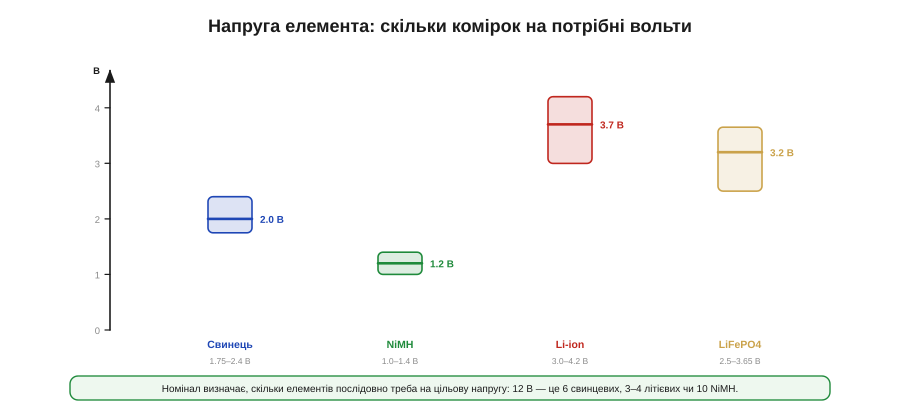
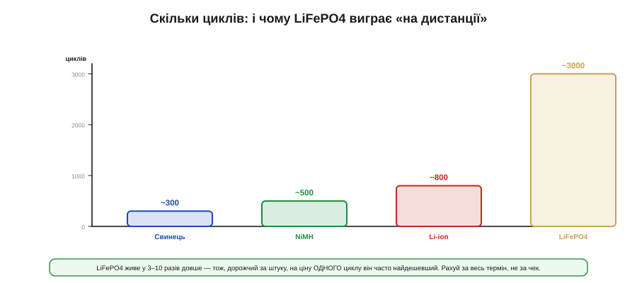
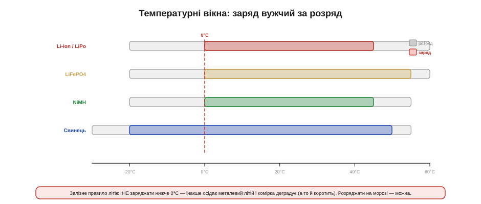
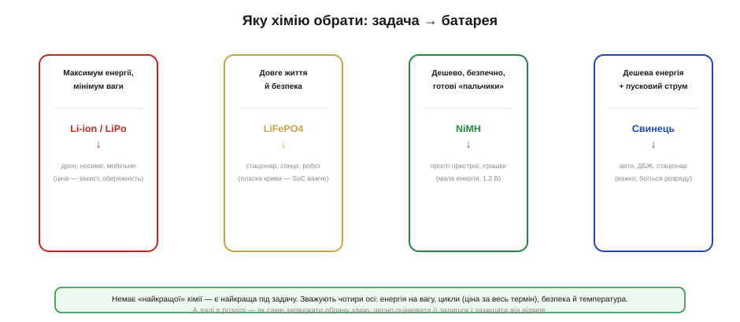

# Хімії порівняно: Li-ion/LiPo, LiFePO4, NiMH, свинець

Перше, що варто прийняти, обираючи акумулятор: **«найкращої» батареї не існує**. Літій — не універсальний переможець, а добрий старий свинець — не пережиток. Кожна хімія — це **компроміс** на кількох осях одразу, і виграючи на одній, вона неминуче програє на іншій. Інженерова робота — не знайти «найкращу», а свідомо зважити ці осі під свою задачу. Тому замість заучувати, «що краще», варто навчитися **порівнювати** — за тими самими шістьма мірками, що визначають придатність будь-якого акумулятора: напруга елемента, питома енергія, форма кривої розряду, ресурс циклів, температурне вікно й безпека.

Розглянемо чотири хімії, що покривають майже всі практичні випадки embedded-розробки: **Li-ion** (і його конструктивний різновид **LiPo**), **LiFePO4** (скорочено LFP), **NiMH** і добрий старий **свинець**. Пройдемося осями по черзі — і наприкінці складемо карту, яка хімія під яку роботу.

### Напруга елемента: фундамент, з якого все починається

Найперша й найфундаментальніша характеристика — **номінальна напруга** одного елемента. Вона задається самою хімією й визначає, скільки комірок доведеться з'єднати послідовно, щоб дістати потрібну напругу шини.


*Рис. Номінал і робочий діапазон одного елемента: свинець ~2.0 В (1.75–2.4), NiMH ~1.2 В (1.0–1.4), Li-ion ~3.7 В (3.0–4.2), LiFePO4 ~3.2 В (2.5–3.65). Що вища напруга елемента, то менше їх треба послідовно на цільову напругу.*

Числа варто тримати в голові: **Li-ion** дає ~3.7 В номіналу й «гуляє» від 3.0 (порожній) до 4.2 (повний); **LiFePO4** — ~3.2 В у вужчому діапазоні 2.5–3.65; **NiMH** — лише ~1.2 В; **свинець** — ~2.0 В на елемент. Звідси прямий практичний наслідок. Щоб зібрати звичні 12 В, треба **шість** свинцевих елементів, або **десять** NiMH, або всього **три-чотири** літієвих. А популярна «одна літієва комірка» (3.7 В) сама по собі вже живить багато 3.3-вольтових пристроїв через простий стабілізатор — тоді як на NiMH для того ж довелося б ставити три елементи. Висока напруга елемента — це менше комірок, простіша збірка й менше місць, де щось піде не так.

Діапазон напруги має й другий, менш очевидний наслідок — для **перетворювача** після батареї. Одна літієва комірка гуляє від 4.2 до 3.0 В, тобто цільові 3.3 В опиняються то нижче входу, то вище: щоб тримати їх стабільними весь розряд, потрібен або малопадінний LDO (працює, лише поки вхід вищий за вихід), або [**buck-boost**](book:electronics/buck-boost), що однаково тягне і з 4.2, і з 3.0 В. На NiMH картина не легша: три елементи дають близько 3.6 В свіжими й 3.0 В сівшими — знову той самий клопіт переходу через цільову напругу. Тож вибір хімії й кількості комірок — це одразу й вибір топології живлення, а не лише питання «скільки вольтів».

### Питома енергія: чому це перша вісь для мобільного

Якщо пристрій носять, возять чи піднімають у повітря, **питома енергія** (*specific energy*, Вт·год/кг) стає віссю номер один: скільки енергії вдається запхати в кожен грам ваги. Тут різниця між хіміями не у відсотках, а в **разах**.


*Рис. Грубі орієнтири: свинець ~40 Вт·год/кг, NiMH ~90, LiFePO4 ~120, Li-ion/LiPo ~200. Літій тримає вп'ятеро більше енергії на грам, ніж свинець, — тому панує там, де вага критична.*

**Приклад (вага батареї під 50 Вт·год).** Порахуймо, скільки важитимуть самі комірки, щоб запасти ту саму енергію — 50 Вт·год — на різних хіміях.

```
маса ≈ енергія / питома_енергія      (лише комірки, без корпусу)

Li-ion  (~200 Вт·год/кг):  50 / 200 = 0.25 кг   (250 г)
LiFePO4 (~120):            50 / 120 ≈ 0.42 кг   (420 г)
NiMH    (~90):             50 / 90  ≈ 0.56 кг   (560 г)
Свинець (~40):             50 / 40  = 1.25 кг   (+ важкий корпус, ще більше)
```

Розкид — **уп'ятеро**, від чверті кілограма до півтора. Для дрона, де кожен грам віднімається від корисного навантаження й часу польоту, відповідь очевидна — Li-ion. А для метеостанції, що нерухомо стоїть біля стовпа, зайвий кілограм нічого не вартий, зате інші осі (ціна, ресурс, безпека) переважують — і там часто виграє LiFePO4 чи навіть свинець. Питома енергія — перша вісь, але не єдина.

Поряд із енергією на вагу існує й енергія на **об'єм** (Вт·год/л), і для маленького корпусу вона часом важливіша за грами. Тут літій теж попереду, хоч розрив із рештою менший. А LiPo додає окремий козир — **форму**: його плаский пакет роблять майже будь-яких пропорцій і втискають у тонкий корпус годинника чи навушника, тоді як свинець і циліндричні елементи диктують свою геометрію. Тобто «скільки енергії влізе» залежить не лише від хімії, а й від того, наскільки ви вільні у виборі форми.

Варто розрізняти й дві речі, які легко плутають: **енергію** (скільки всього запасено, ват-години) і **потужність** (як швидко її можна віддати, обмежену допустимим струмом). Хімії різняться й тут: свинець і деякі «силові» літієві елементи віддають великі струми, тоді як «енергоємні» комірки тримають багато заряду, але не люблять різких ривків. Для стартера авто головна — потужність, для метеостанції — енергія; а та сама вісь «потужність проти ємності» впирається в [внутрішній опір елемента](book:electronics/battery-sag), який і вирішує, наскільки різкий струм хімія віддасть без просідання.

### Криві розряду: чи видно заряд по напрузі

Тепер тонша, але дуже практична відмінність — **форма кривої розряду**: як падає напруга елемента в міру того, як з нього беруть заряд. Здавалося б, технічна дрібниця, та саме вона визначає, чи зможемо ми згодом оцінити залишок заряду «на око», по вольтметру.


*Рис. Li-ion і свинець розряджаються **похило** — напруга помітно падає від повного до порожнього, тож по ній можна грубо судити про залишок. LiFePO4 і NiMH мають **пласке плато**: майже весь розряд напруга тримається сталою й «бреше» про заряд, різко падаючи лише в кінці.*

У **Li-ion** напруга плавно сповзає з 4.2 до 3.0 В — за нею, знаючи хімію й навантаження, можна прикинути відсоток заряду. У **свинцю** теж похило (а ще й густина кислоти підказує). А от **LiFePO4** і **NiMH** мають підступне **пласке плато**: майже весь розряд напруга стоїть майже незмінна (у LFP — близько 3.2 В), і лише наприкінці обвалюється. Це чудово для навантаження (стабільне живлення), але жахливо для оцінки заряду: 80% і 20% залишку виглядають по напрузі майже однаково. Наслідок цей центральний для того, [як чесно виміряти залишок заряду](book:electronics/state-of-charge): на пласкій хімії самої напруги мало, потрібен облік відданих ампер-годин.

Форма кривої б'є й по **корисній** ємності. Пристрій вимикається не на нулі, а на своєму порозі — коли перетворювачу вже бракує входу. На **похилій** кривій частина заряду лишається «під порогом» недосяжною: останні відсотки віддаються вже на надто низькій напрузі, до якої схема не дотягне. На **пласкій** же хімії майже вся ємність віддається на робочій напрузі, а тоді різкий обвал, — тож корисною стає чи не вся паспортна ємність, зате попередження «скоро сяду» приходить пізно й раптово. Це ще один бік того самого компромісу: рівна напруга зручна для схеми, але підступна для прогнозу залишку.

### Скільки циклів і за яку ціну

Батарея старіє: з кожним циклом «заряд-розряд» її ємність потроху тане. **Ресурс циклів** — скільки таких циклів вона витримає, поки ємність не впаде, скажімо, до 80%, — пряма економічна вісь, але рахувати її треба правильно.


*Рис. Орієнтовний ресурс: свинець ~300 циклів, NiMH ~500, Li-ion ~800, LiFePO4 ~3000 і більше. LFP живе у рази довше — тому, дорожчий за штуку, на ціну одного циклу він часто найдешевший.*

Тут криється поширена помилка — дивитися лише на **ціну за штуку**. LiFePO4 коштує дорожче за звичайний Li-ion, але витримує у три-десять разів більше циклів. Якщо поділити ціну на кількість циклів, тобто рахувати **за весь термін служби**, LFP нерідко виявляється найдешевшим. Свинець дешевий на касі, але його скромний ресурс (надто якщо його глибоко розряджати) робить «дешеву» батарею дорогою в перерахунку на роки. Тому для стаціонарної системи, що працюватиме десятиліття, рахують не чек у магазині, а **вартість одного циклу** — і ця арифметика часто перевертає інтуїцію з ніг на голову.

Саме поняття «цикл» хитріше, ніж здається, і це варто розуміти, щоб не помилитися в розрахунку. Ресурс сильно залежить від **глибини розряду** (*depth of discharge*, DoD): якщо щоразу розряджати літій лише наполовину, циклів буде в рази більше, ніж за розрядів «у нуль». Тому, проєктуючи «під деградацію», часто навмисне беруть більшу батарею й користуються тільки її серединою. Додається й **календарне** старіння: батарея потроху втрачає ємність просто від часу й температури, навіть якщо лежить без діла, — тож для систем, які циклюють рідко, рахують не лише цикли, а й роки. Механізми цього [старіння — від DoD до календарної деградації](book:electronics/battery-aging) мають власну фізику й заслуговують окремого розгляду.

### Температура: вузьке вікно заряду

Батарея жива на морозі й у спеку по-різному, і — що критично — **заряд** має набагато вужче температурне вікно, ніж розряд. Сплутати ці два вікна — класична й небезпечна помилка.


*Рис. Вузька кольорова смуга — дозволений діапазон заряду, ширша сіра — розряду. Для всіх літієвих хімій заряд починається від 0°C; розряджати ж можна й добряче нижче нуля. Свинець і NiMH трохи терпиміші до холодного заряду, LiFePO4 — найстійкіший до спеки.*

Найважливіше правило тут стосується **літію** й варте того, щоб закарбувати його: **не заряджати нижче 0°C**. На холоді під час заряду літій не встигає зайти в електрод і осідає на ньому металевими голками (дендритами) — це незворотно вбиває ємність, а в гіршому разі проколює сепаратор і коротить комірку. Розряджати літій на морозі можна (хіба що ємність тимчасово падає), а ось заряджати — категорично ні, доки комірка не відігріється. Свинець і NiMH до холодного заряду трохи терпиміші, а LiFePO4 з усіх літієвих найкраще зносить **спеку**. Саме тому грамотний [зарядний вузол](book:electronics/li-ion-charger) завжди має давач температури (вивід TS у зарядних чипах) і блокує заряд за межами вікна.

Що ж робити, коли заряджати треба, а надворі мороз? Рішень кілька: або **гріти** комірку перед зарядом (власним тепловиділенням чи окремим нагрівачем), або тимчасово **обмежити струм** заряду до крихітного, безпечного навіть на холоді, доки батарея не відігріється. А на іншому кінці шкали підступна **спека**: висока температура майже не заважає роботі, зате різко прискорює старіння — особливо якщо тримати літій гарячим **і** повністю зарядженим. Тому довговічні системи уникають саме цього поєднання; інколи батарею навмисне недозаряджають, щоб подовжити їй життя. Температурна вісь, отже, керує не лише безпекою «тут і зараз», а й тим, скільки років батарея проживе.

### Безпека й норов: чотири характери

Нарешті — **безпека** й загальний «характер» кожної хімії, бо за однаковими вольтами ховаються дуже різні норови. Пройдімося коротко по чотирьох.

**Li-ion / LiPo** — чемпіон за енергією, але й найвимогливіший: боїться перезаряду, переохолодженого заряду й проколу, а при відмові здатен на **тепловий розгін** (*thermal runaway*) — самопідігрів аж до займання. Тому він **ніколи** не ходить без захисної електроніки. LiPo в м'якому пакеті ще й механічно вразливий: надувся — на спокій і утилізацію. **LiFePO4** — спокійний родич літію: трохи менше енергії, зате помітно **безпечніший** (тепловий розгін значно важче спровокувати, кисень при розкладі не виділяється), довговічний і витриваліший до спеки; плата — пласка крива й нижча напруга. **NiMH** — добродушний трудяга: безпечний, не потребує складного захисту, продається готовими «пальчиками», але енергії мало й саморозряд історично великий (сучасні «low self-discharge» це полагодили). **Свинець** — дешевий силач: віддає шалений пусковий струм, прощає перезаряд краще за літій, але важкий і **смертельно боїться глибокого розряду** (сульфатація — наростання нерозчинних кристалів сульфату свинцю на пластинах, що незворотно з'їдає ємність).

Окрема, часто вирішальна вісь для embedded — **саморозряд**: як швидко батарея «худне» просто лежачи. Тут літієві елементи хороші: втрачають одиниці відсотків на місяць. NiMH класично були ненажерливі (сідали за кілька місяців), поки «low self-discharge» різновиди це не виправили. Свинець розряджається помірно, але його не можна лишати **розрядженим** надовго — засульфатується. Тож для пристрою, що місяцями дрімає в режимі сну (а таких в автономній електроніці більшість), саме саморозряд раптом стає головною віссю, важливішою за питому енергію: батарея має пережити простій, а не лише робочі години.

### Карта вибору

Зведімо всі осі в одне практичне рішення.


*Рис. Максимум енергії на мінімумі ваги — Li-ion/LiPo (ціна — обов'язковий захист). Довге життя й безпека — LiFePO4 (ціна — пласка крива, складніша оцінка заряду). Дешево, безпечно, з готових елементів — NiMH (мало енергії). Дешева об'ємна енергія з потужним пусковим струмом — свинець (важко, боїться розряду).*

Логіка проста, щойно осі розкладено. **Носимий, літаючий, мобільний** пристрій, де вага — усе → Li-ion/LiPo. **Стаціонарна, сонячна, відповідальна** система, де цінують роки служби й спокій → LiFePO4. **Простий, дешевий** прилад із малим апетитом, для якого хочеться готових елементів із магазину → NiMH. **Великий запас енергії за малі гроші** плюс величезний миттєвий струм, коли вага байдужа → свинець. Жоден вибір не «правильний» сам по собі — він правильний **під конкретні осі**, які важать саме у вашій задачі.

Одне застереження наостанок: цифри в цій темі — це **орієнтири порядку величини**, а не паспорт конкретної комірки. Усередині кожної хімії елементи різняться за версією (енергоємні проти силових), за якістю й виробником, тож остаточний вибір завжди звіряють із даташитом саме тієї комірки, яку купують. Карта каже, **куди дивитися** й що з чим зважувати, але не звільняє від читання паспорта — як і всюди в інженерії.

### Підсумок теми

Порівнювати акумулятори означає зважувати **компроміс на шести осях**: напруга елемента (скільки комірок на потрібні вольти), питома енергія (вага під задану енергію — літій вп'ятеро легший за свинець), форма кривої розряду (похила в Li-ion і свинцю дає судити про заряд, пласка в LiFePO4 і NiMH — ні), ресурс циклів (LFP живе в рази довше, тож дешевший «за весь термін»), температурне вікно (заряд вужчий за розряд; літій — **ніколи нижче 0°C**) і безпека (Li-ion вимагає захисту й здатен на тепловий розгін; LiFePO4, NiMH і свинець спокійніші). «Найкращої» хімії нема — є найкраща під конкретні осі: літій для ваги, LiFePO4 для життя й безпеки, NiMH для простоти, свинець для дешевої об'ємної енергії. А коли хімію обрано, постає наступне інженерне питання — як вона поводиться [**під навантаженням**](book:electronics/battery-sag): чому під різким стрибком струму напруга просідає й від чого це залежить.
