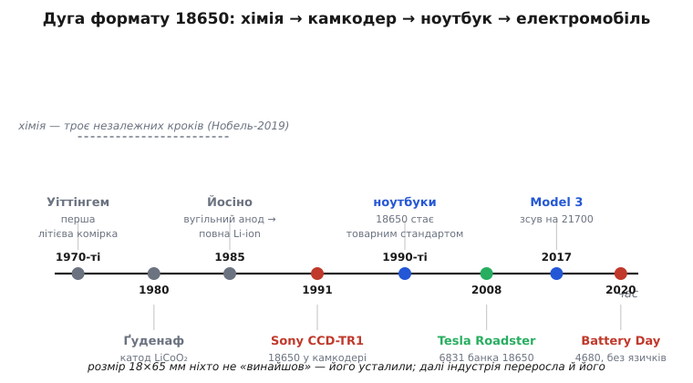

# 📜 18650: як мірка відеокамери стала стандартом для електромобіля

Число 18650 сьогодні знають напам'ять там, де ще двадцять років тому знали хіба «пальчикову» AA: у майстернях із дронами, на складах повербанків, у цехах, де зварюють тягові батареї. А народилося воно як внутрішня мірка одного конкретного виробу — портативної відеокамери початку 1990-х, якій просто бракувало компактного джерела живлення. Ніхто не сідав креслити «стандарт майбутнього»: інженери шукали, як прибрати негарний горб акумулятора з боку камкодера, підібрали під нього циліндричну банку 18 на 65 міліметрів — і ця банка, пройшовши через ноутбуки, несподівано опинилася тисячами штук під підлогою першого електромобіля Tesla. Це історія про те, як випадкова мірка перетворюється на галузевий стандарт, як контроверсійною буває навіть відповідь на питання «хто перший», і чому індустрія, розігнавшись, зрештою переростає власний стандарт.

*Шлях розміру 18×65 мм. Ліворуч — хімія, яку створили троє незалежними кроками впродовж 1970–80-х (за неї дали Нобеля 2019 року). Далі Sony пакує цю хімію в циліндр і ставить у камкодер (1991); формат розповзається по ноутбуках; Tesla будує Roadster на майже семи тисячах таких банок (2008); і зрештою галузь переростає розмір, переходячи на товщі 21700 і 4680.*

## Спершу — хімія, і її винайшли не в Японії

Щоб чесно розповісти історію 18650, треба одразу розвести дві різні речі, які легко злити в одну. Є **хімія** — фізика й склад літій-іонної комірки, той рух іонів літію між катодом і анодом, що дає напругу близько 3.6 вольта. І є **формат** — конкретний спосіб запакувати цю хімію в корпус розміром 18 на 65 міліметрів. Ці дві речі мають різних авторів і різні дати, і плутанина між ними — джерело половини легенд про «хто винайшов 18650».

Саму літій-іонну хімію створили троє людей упродовж п'ятнадцяти років, і жоден із них не японець і не пов'язаний із форматом 18650. На початку 1970-х британець **Стенлі Уіттінгем** (*M. Stanley Whittingham*), працюючи в лабораторії Exxon, зібрав першу дієздатну літієву комірку на інтеркаляційних електродах. У 1980-му американець **Джон Ґуденаф** (*John B. Goodenough*) в Оксфорді знайшов катод із кобальтату літію (LiCoO₂), що подвоїв напругу й відкрив дорогу до по-справжньому потужної комірки. А в 1985-му японець **Акіра Йосіно** (*Akira Yoshino*) з компанії Asahi Kasei зробив вирішальний крок: замінив небезпечний металевий літій вугільним анодом, у якому іони літію просто ховаються між шарами графіту. Так народилася повна літій-**іонна** комірка — без металевого літію, а отже, придатна для масового вжитку.

За цю роботу всі троє — Уіттінгем, Ґуденаф і Йосіно — розділили **Нобелівську премію з хімії 2019 року**. Це найнадійніший можливий доказ того, кому належить хімія: не одній компанії й не одній країні, а трьом дослідникам на трьох континентах, кожен зі своїм окремим внеском. Тримайте цю картину в голові, коли далі йтиметься про «першість» у форматі: формат — це вже інша, набагато вужча заслуга, ніж винахід самої батареї.

> 🔧 **Навіщо це.** Коли в суперечці про 18650 хтось каже «це винайшла така-то фірма», перше питання — про що саме йдеться: про хімію чи про розмір корпусу. Хімію створили Уіттінгем, Ґуденаф і Йосіно (Нобель-2019); формат 18×65 мм — це вже про те, хто першим спакував готову хімію в цю конкретну банку. Дві різні заслуги, дві різні відповіді.

## Sony і горб на камкодері

Готову хімію Йосіно треба було ще довести до заводу — а це окрема інженерна епопея, і взялася за неї Sony. У другій половині 1980-х японська електроніка мала гостру потребу, яку тодішні акумулятори не закривали. Відеокамери щойно навчилися вміщатися в долоні, але живили їх нікель-кадмієві батареї — важкі й об'ємні. Через них елегантна камера мала негарний горб збоку: пристрій уже став маленьким, а джерело живлення за ним не встигло. Sony потрібне було джерело, що вмістило б досить енергії на зйомку, але було достатньо дрібним, щоб не псувати саму камеру.

Саме під цю задачу Sony й довела до серії літій-іонну комірку. Хроніка тут точна. Виробничу заяву компанія зробила в **лютому 1990-го**, зразки почала розсилати того ж року, а **1991-го** запустила масове виробництво на заводі в місті Коріяма (префектура Фукусіма). Перша серія називалася US-61: циліндричні комірки з катодом LiCoO₂ (той самий, що знайшов Ґуденаф) і вугільним анодом (той самий принцип, що в Йосіно), з номінальною напругою 3.6 вольта. І першим виробом, куди їх поставили, став 8-міліметровий камкодер **Sony CCD-TR1** — та сама камера, з якої треба було прибрати горб.

Ринок відповів вибухово. Уже 1993 року Sony продала близько трьох мільйонів літій-іонних комірок, наступного — п'ятнадцять мільйонів. Компактне джерело, якого бракувало портативній електроніці, нарешті з'явилося — і потягло за собою цілий клас пристроїв, які доти впиралися саме в батарею. Керував цим напрямком у Sony інженер **Кейдзабуро Тодзава** (*Keizaburo Tozawa*), якого згодом у галузі напівжартома звали «хрещеним батьком літій-іонного акумулятора» — не за винахід хімії, а за те, що перевів її з лабораторії в масовий продукт.

## Хто «винайшов» 18650: чесний статус суперечки

Тепер — найтонше місце цієї історії, і його треба подати без прикрас. На питання «хто перший зробив саме формат 18650» різні джерела дають **різну** відповідь, і жодна з них не є остаточно доведеною.

З одного боку, Sony від 1991 року вже випускала циліндричні літій-іонні комірки, і серед її ранніх розмірів був той, що згодом усталився як 18650. З цього боку логічно казати, що формат іде від Sony — компанії, яка перша вивела літій-іонну банку на ринок і задала саму традицію називати круглі комірки їхніми розмірами в міліметрах. З іншого боку, Panasonic у власній корпоративній хроніці відносить розробку своїх літій-іонних комірок форматів CGR17500/18650 до **1994 року** — і на цій підставі претендує на формат сама. Довідкові джерела фіксують обидві заяви поруч, не примиряючи їх: інфобокс англомовної «Вікіпедії», приміром, у графі «вперше вироблено» ставить саме **1994**, спираючись на дату Panasonic, хоча в тексті згадує й претензію Sony на 1991-й.

Як це чесно оцінити? Формула проста: **розмір 18×65 мм ніхто не «винайшов» у сенсі осяяння — його усталили.** Це не патент на геометрію циліндра (циліндричні елементи називали розмірами задовго до літію) і не гучний винахід — це промисловий стандарт де-факто, що склався, коли кілька виробників почали робити взаємозамінні банки саме цих габаритів. Sony має найсильнішу претензію на першість самого літій-іонного циліндра й на традицію маркування; Panasonic — задокументовану дату для своєї лінійки 18650. Правильний статус доказовості тут — **контроверсійна першість, усталений формат**, а не одноосібний винахід. Приписати 18650 одній людині чи одній фірмі як «винахід» було б спрощенням, яке історія не підтверджує.

> 🔧 **Навіщо це.** Це навчальний випадок, як узагалі народжуються стандарти в електроніці. Найпоширеніші формати рідко мають одного «винахідника» з патентом на розмір — вони усталюються, коли ринок збігається на зручних габаритах і починає робити взаємозамінні деталі. Тому питання «хто перший» для таких стандартів часто не має однієї правильної відповіді — і це нормально.

## Ноутбуки: як мірка камери стала товаром

Хай там як із першістю, далі формат зажив власним життям — і зробили це не камкодери, а ноутбуки. Упродовж 1990-х портативний комп'ютер став масовим товаром, і йому був потрібен саме такий елемент: компактна, місткіша за нікелеві акумулятори банка, яку зручно складати по кілька штук у батарею. 18650 пасувала ідеально. Її почали робити всі великі виробники, банки стали взаємозамінними, обсяги пішли на десятки й сотні мільйонів — і 18650 перетворилася на найпоширенішу літій-іонну комірку у світі, свого роду **товарний стандарт** (*commodity*), який можна купувати мільйонами, як гвинти чи резистори.

Це перетворення важливіше, ніж здається, і саме воно підготувало наступний поворот. Коли деталь стає масовим товаром, у неї падає ціна, зростає надійність і з'являється передбачувана, добре вивчена поведінка: скільки циклів вона живе, як гріється, як старіє. Мільйони однакових ноутбучних банок означали, що будь-хто, кому потрібне багато літієвої енергії, міг узяти готовий, дешевий, перевірений елемент із полиці — замість того, щоб замовляти щось особливе. Саме ця дешева повсюдність 18650 і зробила можливим те, чого ніхто в Sony 1991 року не планував.

## Несподіваний поворот: електромобіль на ноутбучних банках

На початку 2000-х невелика каліфорнійська компанія Tesla поставила зухвале питання: а що, як зібрати автомобільну батарею не з особливих тягових елементів, а з тих самих дешевих ноутбучних банок 18650 — просто взявши їх дуже багато? Ідея звучала майже несерйозно, але арифметика сходилася: тисячі перевірених масових комірок давали і потрібну енергію, і — головне — вже відому, передбачувану поведінку за ціною товару, а не експерименту.

Перший **Tesla Roadster** (2008) утілив цю ідею буквально. Його батарея складалася з **6831** циліндричної комірки 18650 — по суті, ноутбучних елементів — з'єднаних у струнку структуру: 69 банок паралельно в «цеглину», 9 цеглин послідовно в «лист», 11 листів послідовно в пакет. Разом це давало близько 53 кіловат-годин при напрузі десь 375 вольтів — досить, щоб електромобіль проїхав кілька сотень кілометрів, чого доти від акумуляторної машини не чекали. Комірки були настільки звичайні, що інженери самі дивувалися їхньому ресурсу в цій незвичній ролі. Так формат, придуманий для відеокамери й вирощений ноутбуками, несподівано став основою електромобіля.

Далі Tesla лишалася вірною 18650 ще довго: на цих банках (уже спеціально доопрацьованих разом із Panasonic, а не буквально ноутбучних) поїхали Model S (2012) і Model X (2015). Тисячі однакових циліндричних комірок виявилися напрочуд зручними для авто: якщо одна банка з тисяч псується, це не вбиває всю батарею, а сам циліндр міцний і добре тримає внутрішній тиск. Те, що починалося як спосіб прибрати горб із камкодера, стало промисловою основою цілої нової галузі транспорту.

> 🔧 **Навіщо це.** Мораль тут суто інженерна й дуже практична: перевірений масовий компонент часто б'є ідеальний спеціальний — не характеристиками, а передбачуваністю, ціною й доступністю. Tesla виграла перший раунд не тому, що знайшла особливу батарею, а тому, що взяла найзвичайнішу і склала її розумно. Обираючи елемент для власного пристрою, варто спершу спитати, чи не закриває задачу дешевий стандартний формат, перш ніж гнатися за екзотикою.

## Індустрія переростає власний стандарт: 21700 і 4680

Історія 18650 повчальна ще й тим, як вона **закінчується** — точніше, як формат сходить зі сцени там, де сам колись переміг. Щойно на циліндричні банки почав спиратися цілий автопром, стара мірка 18×65 мм показала свою межу. Річ у простій геометрії. Кожна банка має власну металеву стінку й службові деталі на торцях; це «накладні витрати» об'єму та ваги, які не запасають енергії. Що дрібніша банка, то більша частка цих накладних витрат — і то більше швів між тисячами комірок доводиться зварювати. Коли банок у машині тисячі, ця дрібність починає дорого коштувати.

Логічний вихід — зробити банку більшою, лишивши систему тією самою. У 2017 році з Model 3 Tesla разом із Panasonic перейшла на формат **21700** (21 мм у діаметрі, 70.0 мм завдовжки). Число читається за тим самим правилом, що й 18650: перші дві цифри — діаметр, наступні — довжина в десятих міліметра. Товща й вища банка вміщає помітно більше активної речовини — за об'ємом вона приблизно в півтора раза більша за 18650 — а отже, дає більше енергії й струму на одну комірку, і водночас зменшує кількість самих комірок та швів у батареї. Той самий шаблон коду, нові розміри — і відчутний виграш саме там, де 18650 уперлася в стіну.

Наступний крок Tesla оголосила на «Дні батареї» (*Battery Day*) 2020 року — формат **4680** (46 мм у діаметрі, 80.0 мм завдовжки), ще значно більший. Тут ідеться вже не лише про габарит: 4680 несе конструктивну новацію — **безъязичкову** (*tabless*) архітектуру, де струм знімається не через один тонкий вивід-«язичок», а по всій кромці рулону електродів одразу. Це різко знижує внутрішній опір і полегшує відведення тепла — обидві проблеми загострюються, коли банка більшає. До жовтня 2023 року Tesla відзвітувала про двадцятимільйонну вироблену комірку 4680. Так галузь, яку 18650 колись зробила можливою, поступово переросла її саму — не тому, що формат був поганий, а тому, що задачі виросли за його межі.

Варто чесно додати: 18650 нікуди не зникла. Вона й досі панує в акумуляторному інструменті, ліхтарях, повербанках, електровелосипедах — усюди, де не потрібні автомобільні масштаби й де цінують саме дешевизну та повсюдність перевіреного стандарту. З електромобільної сцени формат відступає, але як робоча конячка масової електроніки лишається на своєму місці. Стандарт не «помер» — він повернувся туди, де його компроміс досі оптимальний.

## Що ця історія каже розробникові

Дуга 18650 — це стисла притча про життя технічних стандартів, і з неї варто винести кілька речей.

По-перше, **розрізняйте хімію й формат**. Літій-іонну хімію створили Уіттінгем, Ґуденаф і Йосіно (Нобель-2019); 18650 — це лише корпус, у який цю хімію спакували, і в нього окрема, набагато вужча й контроверсійніша історія «першості». Про самі відмінності катодів і те, як хімія задає напругу й характер комірки, — тема [акумуляторів](book:electronics/batteries); тут ішлося не про хімію, а про геометрію та про те, як геометрія стає стандартом.

По-друге, **найпоширеніші стандарти рідко «винаходять» — їх усталюють**. Питання «хто перший зробив 18650» не має однієї доведеної відповіді (Sony проти Panasonic — контроверсія, а не факт), і це типово: масові формати народжуються зі збігу ринку на зручних габаритах, а не з одного патенту на розмір. Коли наступного разу читатимете «стандартний роз'єм/елемент/формат», варто пам'ятати, що за словом «стандартний» зазвичай стоїть саме такий тихий процес усталення, а не гучний винахід.

По-третє, **перевірений масовий компонент — сила, а не компроміс**. Tesla збудувала перший електромобіль на ноутбучних банках саме тому, що вони були дешеві, доступні й передбачувані. І та сама історія показує зворотний бік: коли масштаб задачі виростає, навіть найуспішніший стандарт доводиться переростати — 18650 поступилася 21700 і 4680 не через ваду, а через нову межу. Обираючи формат для власного пристрою — від того, скільки їх стане в ряд, до того, як їх [зварювати в збірку](book:electronics/spot-welding-batteries) чи [возити готову батарею](book:electronics/battery-transport-regs), — тримайте в голові обидва боки цього уроку: перевірений формат економить силу сьогодні, але одного дня і його доведеться перерости.
