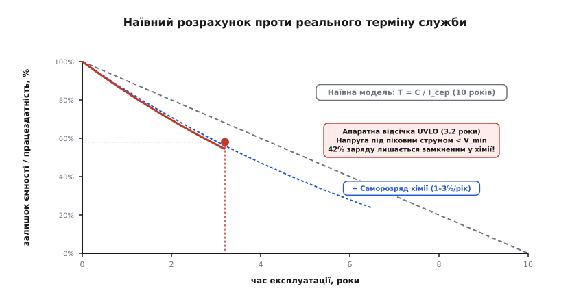
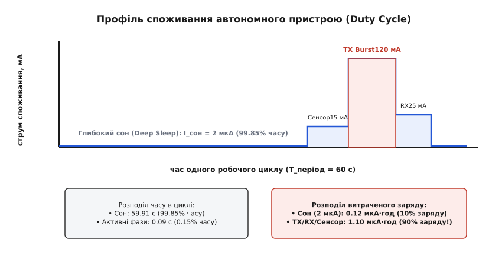
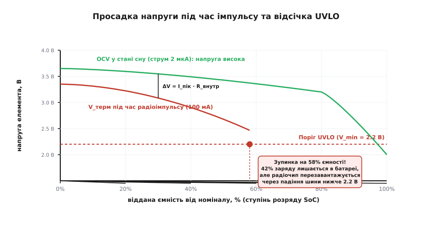
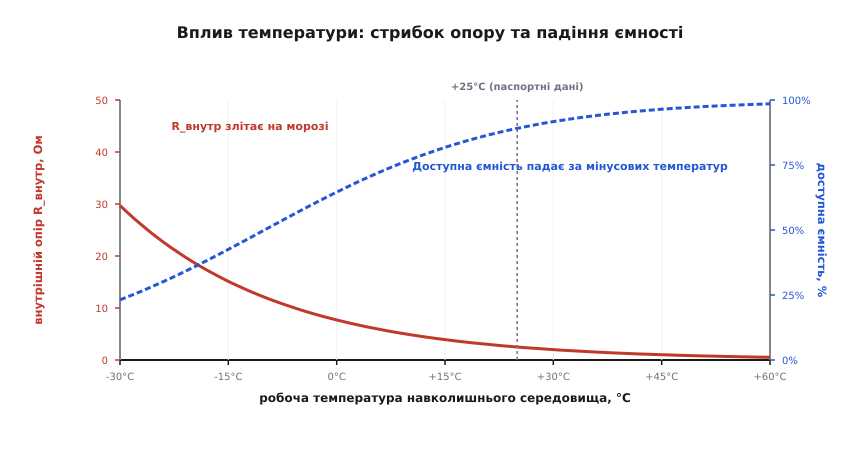
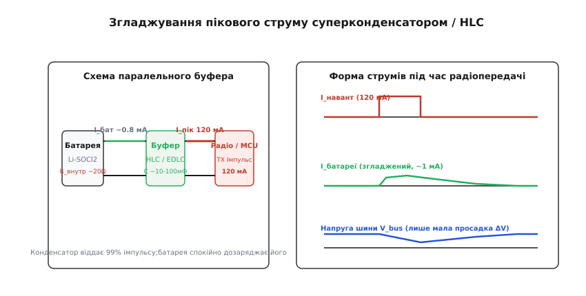

# Розрахунок терміну служби батареї

<preknowlist>
- [Акумулятори й батареї](topic:electronics/batteries) — хімічні джерела струму, номінальна ємність, напруга розімкненого кола (OCV) та механізми деградації.
- [Внутрішній опір джерела](topic:electronics/internal-resistance) — падіння напруги на внутрішньому опорі під час протікання струму навантаження.
- [Ефект Пойкерта й доступна ємність](topic:electronics/peukert-effect) — чому за високих струмів розряду хімічна батарея віддає менше енергії, ніж заявлено в паспорті.
- [Саморозряд батареї](topic:electronics/self-discharge) — втрата хімічної енергії у стані спокою та витік заряду через внутрішні паразитні реакції.
- [Блокування за низькою напругою (UVLO)](topic:electronics/uvlo) — поріг вимкнення та апаратного перезавантаження мікроконтролера чи стабілізатора при просіданні напруги шини.
</preknowlist>

Автономний вузол обліку газу або бездротовий датчик вібрації на магістральному трубопроводі проектують на десять років безперервної роботи від одного первинного літієвого елемента типорозміру AA ємністю 2400 мА·год. У лабораторії вимірюють струм глибокого сну мікроконтролера — 2.5 мкА, вимірюють тривалість сеансу радіозв'язку раз на годину — 30 мілісекунд при струмі 100 мА, підставляють середньозважене значення струму в базову формулу ділення ємності на струм і отримують розрахунковий час автономності понад 10.5 років. Проте у реальній польовій експлуатації через два роки і вісім місяців першої ж морозної зими пристрій раптово перестає виходити на зв'язок: радіомодуль перезавантажується під час спроби передачі пакета, хоча вимірювання знятої батареї показують, що в ній залишилося ще понад 40% номінального хімічного заряду.

Цей класичний інженерний провал виникає тому, що просте співвідношення між зарядом і середнім струмом ігнорує фізику хімічних процесів усередині джерела струму. Батарея — це не ідеальний резервуар з електрикою, з якого можна вичерпати кожен закладений кулон незалежно від темпу та температури, а динамічний електрохімічний реактор з обмеженою швидкістю дифузії іонів, власним внутрішнім саморозрядом, залежністю доступної ємності від величини струму розряду та змінним внутрішнім опором, що різко зростає при охолодженні та виснаженні реагентів. Точний розрахунок терміну автономної служби вимагає поєднання профілювання робочого циклу з урахуванням закону Пойкерта, струмів хімічного витоку, динаміки падіння напруги на внутрішньому опорі під час імпульсів та методів апаратної буферизації пікових навантажень.

### Чому наївна формула бреше: чотири бар'єри електрохімії

Базовий підхід до оцінки тривалості роботи джерела живлення спирається на просте лінійне рівняння:

```
T_життя = C_номінал ÷ I_середнє
```

де `C_номінал` — номінальна паспортна ємність батареї в ампер-годинах, а `I_середнє` — інтегральний середній струм споживання навантаження в амперах. Якщо батарея має паспортну ємність 2.4 А·год (2400 мА·год), а середнє споживання вбудованого пристрою становить 25 мкА (0.025 мА), формульне ділення обіцяє 96 000 годин роботи, що дорівнює майже 11 рокам безперервної служби.


*Наївна лінійна модель розряду порівняно з реальною деградацією батареї. Наївна пряма прогнозує повне вичерпання через 10 років. Саморозряд хімії поступово відбирає заряд паралельно з навантаженням. Реальна крива під навантаженням обривається значно раніше через зростання внутрішнього опору, коли напруга під час пікового імпульсу просідає нижче апаратного порогу UVLO, залишаючи значну частку заряду недосяжною.*

Реальний час автономності виявляється у два-чотири рази коротшим через чотири послідовні фізичні обмеження, кожне з яких зменшує корисну віддачу джерела струму:

1. **Електрохімічний саморозряд хімії.** Навіть коли до батареї не підключено жодного навантаження, активні матеріали анода й катода повільно реагують з електролітом через внутрішні паразитні окисно-відновні реакції. Для надмалопотужних пристроїв струм власного хімічного витоку батареї виявляється сумірним зі струмом споживання схеми у стані сну або навіть перевищує його.
2. **Нелінійність відбору ємності за законом Пойкерта.** Номінальну ємність на наклейці вимірюють за строго стандартизованого, дуже малого струму розряду (типово струмом розряду за 100 або 1000 годин — струми `0.01C` чи `0.001C`). Під час коротких радіосеансів, коли передавач споживає десятки або сотні міліампер, швидкість хімічної дифузії в електроліті не встигає за відбором електронів, і ефективна ємність, яку джерело здатне віддати за високого струму, різко скорочується.
3. **Динамічне просідання напруги на внутрішньому опорі (ESR).** Кожна батарея має внутрішній активний опір `R_внутр`. Коли радіопередавач вмикається і споживає імпульс струму `I_пік`, напруга на виводах батареї миттєво просідає на величину `ΔV = I_пік · R_внутр`. Щойно напруга під навантаженням падає нижче мінімальної робочої напруги мікроконтролера чи стабілізатора (поріг [блокування за низькою напругою UVLO](topic:electronics/uvlo)), схема перезавантажується або вимикається. Прилад гине не тоді, коли в хімії скінчилися іони літію чи цинку, а тоді, коли його клеми більше не здатні утримати мінімальну напругу під час чергового радіоімпульсу.
4. **Температурне зростання імпедансу.** Зниження робочої температури навколишнього середовища сповільнює кінетику хімічних реакцій та збільшує в'язкість електроліту. При -20°C внутрішній опір літієвих первинних елементів зростає у 5–15 разів порівняно з кімнатною температурою, викликаючи катастрофічну просадку напруги на перших же мілісекундах передачі сигналу.

Щоб створити достовірну інженерну модель терміну служби, необхідно послідовно розібрати кожну ланку цього процесу — від побудови точного часового профілю струму до обчислення залишкової напруги в найгірших температурних умовах.

### Профілювання робочого циклу: інтегрування заряду за станами

Сучасна вбудована мікроелектроніка для автономних застосувань (інтернет речей IoT, медичні трекери, автономні датчики) працює у вираженому імпульсному режимі з чергуванням активних фаз і глибокого сну (англ. *duty cycle* — коефіцієнт заповнення робочого циклу). 


*Часовий профіль струму одного циклу роботи датчика. Понад 99.8% часу пристрій перебуває у глибокому сні, споживаючи мікроампери. Проте короткі фази пробудження, вимірювання та радіопередачі зі струмами у десятки й сотні міліампер споживають левову частку сумарного електричного заряду.*

Типовий цикл роботи бездротового вузла розпадається на кілька функціональних фаз, кожна з яких має власний струм і часову тривалість:

* **Фаза глибокого сну (`Deep Sleep`):** процесорні ядра зупинені, основні кварцові генератори вимкнені, активними залишаються лише низькочастотний таймер реального часу (RTC на 32.768 кГц) або ультранизькоспоживаючий внутрішній RC-генератор. Струм споживання `I_сон` лежить у межах від 0.5 до 5 мкА, а час перебування у цьому стані `t_сон` становить від кількох секунд до кількох годин (типово 99.5–99.99% усього часу життя пристрою).
* **Фаза пробудження та стабілізації живлення (`Wake-up`):** запуск генератора високої частоти (HFXO/PLL), перехід вбудованих DC-DC або LDO перетворювачів живлення з режиму очікування в активний стан, заряджання внутрішніх блокувальних ємностей кристала. Струм `I_прокидання` становить 2–8 мА, тривалість `t_прокидання` — від 0.5 до 5 мс.
* **Фаза вимірювання та цифрової обробки (`Sense & Process`):** увімкнення живлення зовнішніх датчиків, зняття аналогових сигналів за допомогою АЦП, калібрування, виконання алгоритмів цифрової фільтрації чи шифрування пакета. Струм `I_сенсор` становить 5–20 мА, тривалість `t_сенсор` — 10–50 мс.
* **Фаза передачі даних у радіоефір (`Radio TX Burst`):** увімкнення синтезатора частоти та вихідного підсилювача потужності (PA — Power Amplifier) трансивера (LoRa, BLE, Zigbee, NB-IoT, Wi-Fi HaLow). Струм `I_пер` становить від 30 до 150 мА (для субгігагерцових та BLE передавачів потужністю 10–20 дБм) або 200–500 мА (для стільникових модулів NB-IoT / LTE-M). Тривалість імпульсу `t_пер` залежить від швидкості передачі даних у радіоканалі (Data Rate / Spreading Factor) і зазвичай становить від 10 до 100 мс.
* **Фаза прийому підтвердження (`Radio RX / Ack Window`):** очікування квитанції від базової станції або прийом конфігураційного пакета. Малошумний вхідний підсилювач (LNA) і цифровий демодулятор споживають струм `I_прийом` на рівні 10–25 мА протягом 10–50 мс.

Сумарний електричний заряд `Q_цикл`, який схема відбирає від джерела живлення за один повний період повторення `T_період`, дорівнює визначеному інтегралу миттєвого струму за часом, що для кусково-сталих фаз розраховується як сума добутків струму кожного стану на його тривалість:

```
Q_цикл = I_сон·t_сон + I_прокидання·t_прокидання + I_сенсор·t_сенсор + I_пер·t_пер + I_прийом·t_прийом
```

де струми виражено в амперах, а інтервали часу — у секундах, що дає сумарний заряд у кулонах (А·с). Для переведення заряду в загальноприйняті міліампер-години (мА·год) результат у кулонах ділять на 3600:

```
Q_мАгод = Q_кулони ÷ 3.6
```

Середній еквівалентний струм споживання вузла за повний період циклу дорівнює:

```
I_сер = Q_цикл ÷ T_період
```

> 🔧 **Навіщо це на практиці.** Якщо пристрій споживає `I_сон = 2.0 мкА` протягом `t_сон = 59.9 с`, а під час сеансу зв'язку відбирає `I_пер = 100 мА` протягом `t_пер = 50 мс` (0.05 с) та `I_сенсор = 10 мА` протягом `t_сенсор = 50 мс` (0.05 с), то сумарний заряд за цикл 60 секунд становить: `2.0 мкА · 59.9 с + 10 000 мкА · 0.05 с + 100 000 мкА · 0.05 с = 119.8 + 500 + 5000 = 5619.8 мкКл ≈ 1.561 мкА·год`. Середній струм дорівнює `5619.8 мкКл ÷ 60 с ≈ 93.66 мкА`. Хоча радіопередавач активний лише 0.083% загального часу, він забирає 89% усього витраченого заряду.

Для автоматизації такого багатофазного обліку з врахуванням апаратної специфіки мікроконтролерів створено [інженерний калькулятор профілю навантаження на C та C++](topic:electronics/battery-life-calculation/proj-battery-life-calc.md), який підсумовує заряд довільної кількості станів системи.

### Закон Пойкерта: чому ємність падає на піках струму

Паспортна ємність, вказана в технічній документації на батарею, справедлива лише за строго визначеного, повільного розряду. Коли хімічне джерело струму розряджається малим постійним струмом, швидкість хімічних реакцій на поверхні електродів точно відповідає швидкості надходження свіжих реагентів із товщі електроліту шляхом дифузії. 

Коли ж пристрій вмикає радіопередавач і струм стрибає від мікроампер до сотень міліампер, швидкість електрохімічного відновлення на поверхні електрода перевищує швидкість підведення іонів крізь в'язкий рідкий або гелевий електроліт. Приелектродний шар збіднюється на активні носії заряду, внутрішній опір масопереносу різко зростає, напруга на комірці передчасно падає, і частина активної маси в глибині пір електрода виявляється відрізаною від реакції.

Цю закономірність ще 1897 року встановив німецький інженер [Вільгельм Пойкерт](topic:electronics/peukert-effect), вивівши емпіричний закон зв'язку між струмом розряду `I` та часом розряду `t` до фіксованої порогової напруги:

```
Iᵏ · t = C_p
```

де `k` — безрозмірний **показник Пойкерта** (Peukert exponent), а `C_p` — константа Пойкерта для цієї електрохімічної системи.

Для ідеального джерела струму показник `k = 1.0`, що означає повну незалежність відданої ємності від величини струму (`I · t = const`). У реальних хімічних джерелах показник `k` завжди перевищує одиницю:

* **Свинцево-кислотні акумулятори (Lead-Acid):** `k ≈ 1.15 – 1.35` (найсильніша чутливість до струму; при струмі `1C` свинець віддає менше 50–60% паспортної ємності).
* **Лужні первинні елементи (Alkaline Zn-MnO2):** `k ≈ 1.20 – 1.40` (при розряді струмом понад 100 мА доступна ємність падає у 1.5–2 рази порівняно з повільним струмом 5 мА).
* **Первинні літієві елементи (Li-SOCl2, Li-MnO2):** `k ≈ 1.04 – 1.12` (висока стабільність, але імпульси понад 50–100 мА для елементів бобінного типу викликають виражене дифузійне голодування).
* **Літій-іонні та літій-залізо-фосфатні акумулятори (Li-ion / LiFePO4):** `k ≈ 1.02 – 1.06` (найменша чутливість серед масових хімій).

Якщо батарея має номінальну ємність `C_ном` за стандартного струму тестування `I_ном`, то її ефективна доступна ємність `C_еф` при розряді сталим струмом `I_розряд` виражається як:

```
C_еф(I_розряд) = C_ном · (I_ном ÷ I_розряд)ᵏ⁻¹
```

У мікропотужних бездротових пристроях струм не є постійним — він чергується між мікроамперами сну та десятками міліампер передачі. Під час інтервалу глибокого сну приелектродний простір частково відновлює концентрацію іонів (процес електрохімічної релаксації заряду). Проте якщо період між радіопередачами надто малий, дифузія не встигає зрівняти градієнт концентрацій, і батарея зазнає накопичувального пойкертівського виснаження.

Детальне математичне виведення імпульсного коефіцієнта з урахуванням часу хімічної релаксації подано в [математичній моделі імпульсного розряду та релаксації батарей](topic:electronics/battery-life-calculation/math-pulsed-discharge-model.md).

### Саморозряд хімічних систем: ціна десятирічного очікування

Коли середнє споживання вбудованої системи оптимізовано до одиниць мікроампер, [внутрішній саморозряд батареї](topic:electronics/self-discharge) перестає бути другорядною поправкою і перетворюється на домінуючий канал втрати заряду.

Хімічний саморозряд виникає внаслідок термодинамічної нерівноваги між високоактивними матеріалами електродів та компонентами рідкого електроліту. Навіть при розімкненому зовнішньому колі всередині комірки відбуваються мікроскопічні паразитичні реакції: розчинення металевого літію або цинку, відновлення оксидів катода, окиснення органічних розчинників та прямий витік заряду через дефекти пористого полімерного сепаратора.

Швидкість саморозряду вимірюється у відсотках втрати початкової ємності за одиницю часу (типово за рік або за місяць) за нормальної кімнатної температури (+20°C):

| Електрохімічна система | Типова напруга OCV | Річний саморозряд (+20°C) | Еквівалентний струм витоку для елемента 2400 мА·год |
| :--- | :--- | :--- | :--- |
| **Li-SOCl2 (літій-тіонілхлорид)** | 3.65 В | **0.7% – 1.5% на рік** | **0.19 – 0.41 мкА** |
| **Li-MnO2 (літій-діоксид марганцю)** | 3.00 В | **1.0% – 2.0% на рік** | **0.27 – 0.55 мкА** |
| **Li-FeS2 (літій-дисульфід заліза)** | 1.50 В | **1.0% – 1.5% на рік** | **0.27 – 0.41 мкА** |
| **Alkaline (лужний Zn-MnO2)** | 1.50 В | **2.0% – 3.5% на рік** | **0.55 – 0.96 мкА** |
| **Li-ion / Li-Po (літій-іонний)** | 3.70 В | **20% – 40% на рік** (2–4%/міс) | **5.5 – 11.0 мкА** |
| **NiMH (нікель-металогідридний)** | 1.20 В | **15% – 25% на рік** (LSD Eneloop) | **4.1 – 6.8 мкА** |

Переведення річного відсотка саморозряду `S_рік` у еквівалентний постійний струм внутрішнього хімічного витоку `I_витік` здійснюється за формулою:

```
I_витік = (C_ном · S_рік) ÷ (100% · 8760 год)
```

де 8760 — кількість годин у календарному невисокосному році.

З наведеної таблиці чітко видно фундаментальну інженерну межу: вторинні акумулятори (Li-ion, класичний NiMH) мають настільки високий саморозряд, що пристрій зі споживанням 2–5 мкА розрядить акумулятор за рахунок внутрішніх паразитичних процесів за 2–3 роки, навіть якщо саме навантаження взагалі не виконуватиме жодної роботи. Саме тому для необслуговуваних датчиків із терміном служби 10–15 років застосовують виключно первинні (неперезаряджувані) літієві системи, серед яких беззаперечним лідером є хімія Li-SOCl2.

Унікально низький саморозряд Li-SOCl2 (менше 1% на рік) забезпечується явищем **пасивації** (passivation layer): щойно металевий літієвий анод контактує з рідким тіонілхлоридом, на поверхні літію миттєво наростає надтонкий кристалічний шар хлориду літію (`LiCl`). Ця плівка є діелектриком для електронів і не дозволяє літію напряму реагувати з електролітом, фактично заморожуючи саморозряд. Проте ця сама захисна плівка створює серйозну проблему під час роботи на імпульсне навантаження — ефект затримки напруги (Voltage Delay), коли при першому різкому зростанні струму опір плівки викликає глибоке короткочасне просідання напруги, доки іонний струм не зруйнує кристалічну решітку пасивації.

### Внутрішній опір та поріг апаратної відсічки UVLO

Найчастіша причина передчасної відмови автономного приладу — це не повне хімічне спустошення батареї, а досягнення критичного порогу напруги відсічки під час короткочасного пікового струму.

Будь-яке реальне хімічне джерело струму в схемотехніці моделюється як ідеальне джерело напруги розімкненого кола (OCV — Open Circuit Voltage) `V_ocv`, увімкнене послідовно з внутрішнім еквівалентним послідовним опором `R_внутр` (ESR). 

Напруга на зовнішніх клемах батареї `V_клеми` у будь-який момент часу визначається законом Ома для повного кола:

```
V_клеми(t) = V_ocv(SoC, T) - I_навант(t) · R_внутр(SoC, T)
```

де `SoC` (State of Charge) — поточний ступінь зарядженості батареї (від 100% до 0%), а `T` — робоча температура.


*Динаміка напруги розімкненого кола OCV та термінальної напруги під час імпульсу навантаження 100 мА. У міру розряду внутрішній опір зростає, спричиняючи збільшення просадки `ΔV`. Коли напруга під навантаженням досягає порогу UVLO (2.2 В), пристрій блокується та перезавантажується, хоча OCV становить 3.2 В і в батареї залишається понад 40% невикористаної ємності.*

У міру розряджання хімічного елемента відбуваються два одночасні процеси:
1. Напруга розімкненого кола `V_ocv` поступово знижується в міру вичерпання активних реагентів.
2. Внутрішній опір `R_внутр` неперервно зростає, оскільки продукти хімічної реакції мають значно нижчу провідність, ніж вихідні речовини, а товщина ефективного дифузійного шару збільшується.

Для типового первинного літієвого елемента Li-SOCl2 типорозміру AA на початку життя внутрішній опір становить близько 2–4 Ом. Після віддачі 50% номінальної ємності опір зростає до 10–15 Ом, а наприкінці життєвого циклу (EOL — End of Life) сягає 25–50 Ом і більше.

Цифрова мікроелектроніка пристрою має строго визначену нижню межу робочої напруги `V_мін`:
* Мікроконтролер (ядро Cortex-M) зазвичай працездатний до напруги 1.8 В або 2.0 В, нижче якої спрацьовує апаратний супервізор живлення (Brownout Reset / POR).
* Радіочастотний трансивер (наприклад, чіп Semtech SX1262 для LoRa або TI CC2652 для Zigbee/BLE) вимагає мінімальної напруги 1.8–2.2 В для стабільної генерації частоти ГУН (VCO) та роботи підсилювача потужності.
* Лінійний стабілізатор з малим падінням напруги ([LDO](topic:electronics/ldo)) має власну напругу насичення прохідного транзистора `V_падіння` (типово 100–300 мВ), тому вимагає на вході напругу `V_вхід ≥ V_вихід + V_падіння`.

Розглянемо числовий розрахунок точки апаратної відсічки для пристрою з мінімальною напругою живлення `V_мін = 2.2 В` і струмом радіопередачі `I_пер = 100 мА` (0.10 А):

```
V_клеми = V_ocv - I_пер · R_внутр
```

* На початку експлуатації (новий елемент): `V_ocv = 3.65 В`, `R_внутр = 3.0 Ом`.
  `V_клеми = 3.65 В - 0.10 А · 3.0 Ом = 3.65 В - 0.30 В = 3.35 В` (напруга значно вища за поріг 2.2 В, система працює абсолютно стабільно).
* Після відбору 60% заряду: `V_ocv = 3.45 В`, `R_внутр = 14.0 Ом`.
  `V_клеми = 3.45 В - 0.10 А · 14.0 Ом = 3.45 В - 1.40 В = 2.05 В`.

Напруга на шині живлення під час виходу передавача в ефір падає до 2.05 В, що виявляється нижче порогу блокування 2.2 В. Вбудована схема [UVLO](topic:electronics/uvlo) негайно вимикає радіочіп або скидає мікроконтролер. Щойно передавач вимикається і струм спадає назад до 2 мкА, просадка на внутрішньому опорі зникає, і напруга на клемах миттєво підстрибує назад до 3.45 В. Контролер успішно стартує знову, переходить у режим вимірювання, робить спробу нової передачі, знову викликає просадку до 2.05 В і знову перезавантажується. Пристрій потрапляє у нескінченний цикл аварійних перезапусків (bootloop crash), безповоротно виходячи з ладу, маючи 40% невитраченої хімічної ємності усередині батареї.

Звідси випливає фундаментальне правило: **термін служби автономного імпульсного пристрою визначається моментом, коли динамічна напруга найгіршого пікового імпульсу перетинає поріг UVLO, а не моментом вичерпання хімічних ампер-годин.**

### Температурний фактор: поведінка на морозі

Електрохімічні процеси підпорядковуються класичному термодинамічному рівнянню Арреніуса: швидкість іонного переносу та хімічних реакцій експоненційно зменшується зі зниженням абсолютної температури:

```
k_реакції = A · e^(-E_a ÷ (R_газ · T_кельвін))
```

де `E_a` — енергія активації реакції, `R_газ` — універсальна газова стала, `T_кельвін` — абсолютна температура в Кельвінах.


*Залежність внутрішнього опору та доступної ємності батареї від температури навколишнього середовища. При охолодженні нижче 0°C внутрішній опір стрімко зростає внаслідок підвищення в'язкості електроліту та потовщення пасиваційного шару, викликаючи значну просадку напруги під час імпульсів струму.*

Зниження температури викликає два взаємопов'язані негативні наслідки:
1. **Зростання в'язкості рідкого електроліту.** Рухливість іонів літію в органічних або неорганічних розчинниках сповільнюється, що призводить до різкого стрибка омічного та дифузійного опору `R_внутр`. При охолодженні від +25°C до -20°C внутрішній опір дискового елемента CR2032 зростає від 15 Ом до 120–180 Ом, а для елемента Li-SOCl2 AA — від 3 Ом до 35–60 Ом.
2. **Падіння термодинамічної доступної ємності.** За низьких температур швидкість розчинення активної маси не встигає підтримувати навіть помірні струми розряду. Якщо при +25°C батарея віддає 100% номінальної ємності, то при -20°C за струму `0.05C` доступно лише 50–65%, а при -40°C — менше 25–35%.

З іншого боку, підвищення температури під час літньої спеки (наприклад, у датчиках під прямим сонячним промінням у герметичному корпусі, де температура сягає +60°C..+70°C) різко прискорює паразитарний хімічний саморозряд: за емпіричним правилом Вант-Гоффа та законом Арреніуса, підвищення температури на кожні 10°C збільшує швидкість хімічних реакцій приблизно у 2–2.5 рази. Батарея Li-SOCl2, яка при +20°C втрачає 1% заряду на рік, при безперервній температурі +60°C втрачатиме понад 8–12% ємності щороку.

### Буферизація пікового струму: суперконденсатори та гібридні модулі HLC

Щоб поєднати велетенську питому енергоємність первинних елементів живлення з вимогами радіопередавачів до високих імпульсних струмів, у сучасній радіоелектроніці застосовують схемотехнічне розділення функцій: хімічне джерело забезпечує довготривале накопичення енергії, а паранельно підключений високоємний конденсатор з ультранизьким внутрішнім опором (ESR) забезпечує миттєву віддачу імпульсного струму.

Первинні літієві елементи виготовляють у двох принципово різних конструктивних виконаннях:
* **Бобінна конструкція (Bobbin type):** внутрішні циліндричні суцільні електроди. Забезпечує максимальну густину енергії (до 650 Вт·год/кг) і мінімальну площу контакту, завдяки чому саморозряд становить лише 0.7% на рік. Проте площа поверхні електрохімічної реакції дуже мала, тому максимальний тривалий струм обмежений рівнем 10–20 мА, а внутрішній опір становить 10–30 Ом. Пряме живлення радіопередавача зі струмом 100 мА від такого елемента неможливе.
* **Спіральна конструкція (Spiral / Wound type):** електроди згорнуто у щільну тонку спіраль великої площі. Елемент легко віддає імпульси до 1.5–3.0 А з внутрішнім опором менше 0.5 Ом. Проте велика площа поверхні збільшує паразитний саморозряд до 3–5% на рік, а ємність елемента на 30–40% нижча, ніж у бобінного аналога того самого габариту.


*Схема та часові діаграми паралельної буферизації. Накопичувальний конденсатор або гібридний шар HLC бере на себе 98% імпульсу струму радіопередачі (120 мА), після чого батарея спокійно дозаряджає буфер малим безпечним струмом ~1 мА, запобігаючи небезпечному просіданню напруги шини живлення.*

Оптимальним інженерним рішенням є паралельне з'єднання енергоємного бобінного елемента Li-SOCl2 з буферним накопичувачем:
* **Суперконденсатори (EDLC — іоністори):** ємність від 0.1 до 5.0 Фарад, внутрішній опір `R_esr` становить лише 0.05–0.5 Ом. Вони легко віддають струми у сотні міліампер практично без просадки напруги. Проте класичні іоністори мають власний струм витоку (Leakage current) на рівні 2–15 мкА, що подвоює або потроює загальне споживання пристрою у стані сну.
* **Гібридні шарові конденсатори (HLC — Hybrid Layer Capacitor):** спеціалізовані вторинні літієві конденсатори (наприклад, елементи серії HLC від Tadiran або комбіновані модулі PulsesPlus). Вони поєднують наднизький опір (менше 0.2 Ом), здатність віддавати імпульси до 1–2 А та струм внутрішнього витоку менше 1 мкА при робочій напрузі до 3.6–3.9 В, що робить їх ідеальними партнерами для довговічних бобінних елементів Li-SOCl2.

Розрахунок мінімальної необхідної ємності буферного конденсатора `C_буфер` базується на збереженні заряду за час імпульсу. Якщо припустити, що весь піковий струм `I_пік` протягом тривалості імпульсу `t_пік` віддає виключно конденсатор, а максимально допустима динамічна просадка напруги на шині становить `ΔV_допустиме` (різниця між поточною напругою розімкненого кола батареї та мінімальною напругою UVLO з урахуванням запасу):

```
C_буфер ≥ (I_пік · t_пік) ÷ ΔV_допустиме
```

> 🔧 **Навіщо це на практиці.** Якщо модуль LoRa передає пакет струмом `I_пік = 120 мА` протягом `t_пік = 40 мс` (0.04 с), а допустиме падіння напруги на шині становить `ΔV_допустиме = 0.3 В` (від 3.3 В до 3.0 В), то мінімальна ємність конденсатора дорівнює: `C_буфер = (0.12 А · 0.04 с) ÷ 0.3 В = 0.0048 Кл ÷ 0.3 В = 0.016 Ф = 16 000 мкФ (16 мФ)`. Таку ємність легко забезпечує компактний суперконденсатор або маленький гібридний елемент HLC1020, запобігаючи перевантаженню хімічного джерела.

Після завершення радіоімпульсу конденсатор відновлює свій заряд від батареї через експоненційний процес заряду з постійною часу `τ = R_внутр · C_буфер`. Оскільки тривалість паузи між передачами (хвилини або години) на багато порядків перевищує постійну часу `τ` (частки секунди), батарея підзаряджає буфер надзвичайно малим і безпечним струмом, що повністю усуває негативний ефект Пойкерта.

### Повна покрокова методика інженерного розрахунку

Для точного проектування системи автономного живлення виконують послідовний інженерний розрахунок у шість кроків:

#### Крок 1: Складання точної часової картини споживання

За допомогою прецизійного вимірювального комплексу (профілювальника живлення Power Profiler / Current Sense Amplifier) вимірюють струм і тривалість кожного окремого стану системи при номінальній напрузі:
* Струм сну `I_сон` та період сну `t_сон`.
* Струм пробудження `I_прокидання` та час `t_прокидання`.
* Струм вимірювання сенсорів `I_сенсор` та час `t_сенсор`.
* Струм радіопередавача `I_пер` та час передачі `t_пер`.
* Струм радіоприймача `I_прийом` та час прийому `t_прийом`.

Обчислюють корисний заряд навантаження за один робочий цикл:

```
Q_навант_цикл = ∑ (I_k · t_k)
```

Обчислюють річний заряд, споживаний електронною схемою:

```
N_циклів_рік = (365.25 · 86400) ÷ T_період
Q_навант_рік = (Q_навант_цикл · N_циклів_рік) ÷ 3600   [у мА·год]
```

#### Крок 2: Врахування ККД перетворювачів живлення

Якщо між батареєю та мікроконтролером встановлено стабілізатор (імпульсний понижувальний Buck або лінійний LDO), струм, відібраний від батареї, перераховують через баланс потужності:
* Для імпульсного перетворювача (Buck) з коефіцієнтом корисної дії `η` (типово 0.85–0.92):
  `I_батарея = (V_схема · I_схема) ÷ (V_батарея · η)`
* Для лінійного стабілізатора (LDO) струм від батареї дорівнює струму навантаження плюс власний струм спокою мікросхеми (Quiescent current `I_q`):
  `I_батарея = I_схема + I_q`

#### Крок 3: Врахування внутрішнього саморозряду та витоків буфера

Визначають максимальну робочу температуру експлуатації `T_макс` і розраховують річний саморозряд хімії з урахуванням температурного коефіцієнта Арреніуса `S_рік(T)`:

```
Q_саморозряд_рік = C_ном · (S_рік(T) ÷ 100%)   [у мА·год]
```

Якщо в схемі використовується буферний суперконденсатор зі струмом витоку `I_витік_конд`, додають річний заряд його витоку:

```
Q_витік_конд_рік = (I_витік_конд · 8766 год) ÷ 1000   [у мА·год]
```

Сумарний річний бюджет споживання заряду дорівнює:

```
Q_сума_рік = Q_навант_рік + Q_саморозряд_рік + Q_витік_конд_рік
```

#### Крок 4: Перевірка просадки напруги та розрахунок буфера

Для найгіршого випадку (кінець терміну служби, температура -20°C, максимальний внутрішній опір `R_внутр_EOL_cold`) обчислюють мінімальну напругу без буферного конденсатора:

```
V_клеми_пік = V_ocv_EOL - I_пер_пік · R_внутр_EOL_cold
```

Якщо `V_клеми_пік < V_мін_UVLO + V_запас` (де `V_запас ≈ 0.2 В`), батарея не зможе живити навантаження напряму. Розраховують необхідну ємність буферного конденсатора `C_буфер`:

```
C_буфер = (I_пер_пік · t_пер) ÷ (V_ocv_EOL - V_мін_UVLO - V_запас)
```

#### Крок 5: Визначення коефіцієнта корисної ємності (Derating Factor)

Через ефект Пойкерта, залишкову напругу відсічки та температурні втрати реальна корисна ємність батареї `C_корисна` завжди менша за номінальну наклейку:

```
C_корисна = C_ном · K_темп · K_пойкерт · K_відсічка
```

де:
* `K_темп` — коефіцієнт зниження ємності на морозі (0.80–0.95 при помірних мінусових температурах, 1.0 при +20°C).
* `K_пойкерт` — коефіцієнт пойкертівських втрат (0.95–0.98 при буферизації суперконденсатором, 0.70–0.85 без буферизації на великих імпульсах).
* `K_відсічка` — частка ємності, що встигає виділитися до досягнення порогу відсічки напруги (типово 0.85–0.95 для пологих розрядних кривих Li-SOCl2).

#### Крок 6: Підсумковий розрахунок терміну автономної роботи

Розрахунковий час служби у роках отримують діленням корисної ємності на сумарний річний бюджет витрати заряду:

```
T_років = C_корисна ÷ Q_сума_рік
```

Для гарантування надійності в промислових проектах отриманий результат множать на коефіцієнт інженерного запасу `K_надійність = 0.80 – 0.85` (запас 15–20% на виробничий розкид параметрів хімії та екстремальні погодні аномалії):

```
T_гарантований = T_років · K_надійність
```

### Порівняльний приклад розрахунку для промислового LoRaWAN датчика

Зіставимо результати наївного та точного розрахунку для типового автономного датчика тиску в системі водопостачання з такими параметрами:
* Джерело живлення: первинний елемент Li-SOCl2 бобінного типу, типорозмір C, `C_ном = 8500 мА·год`, `V_ном = 3.6 В`, саморозряд `S_рік = 1.2%/рік` при середньорічній температурі +15°C.
* Стан глибокого сну: `I_сон = 3.0 мкА`.
* Сеанс зв'язку LoRaWAN (раз на 15 хвилин, `T_період = 900 с`):
  * Вимірювання тиску: `I_сенсор = 12 мА`, `t_сенсор = 40 мс` (0.04 с).
  * Передача LoRa (SF10, 14 дБм): `I_пер = 85 мА`, `t_пер = 120 мс` (0.12 с).
  * Прийом вікон RX1/RX2: `I_прийом = 15 мА`, `t_прийом = 60 мс` (0.06 с).
* Апаратний поріг вимкнення мікроконтролера та радіо: `V_мін_UVLO = 2.4 В`.
* Внутрішній опір батареї наприкінці терміну служби взимку при -15°C: `R_внутр_EOL = 28 Ом`.

#### 1. Наївний розрахунок:
* Заряд за цикл 900 с: `Q_цикл = 3.0 мкА · 899.78 с + 12 000 мкА · 0.04 с + 85 000 мкА · 0.12 с + 15 000 мкА · 0.06 с = 2699.3 + 480 + 10200 + 900 = 14 279.3 мкКл ≈ 0.003966 мА·год`.
* Середній струм споживання: `I_сер = 14 279.3 мкКл ÷ 900 с ≈ 15.87 мкА`.
* Наївний термін служби:
  `T_наївний = 8500 мА·год ÷ (0.01587 мА · 8760 год/рік) = 8500 ÷ 139.02 ≈ 61.1 року` (абсурдний результат, що повністю ігнорує фізику).

#### 2. Реальний інженерний розрахунок (без буферного конденсатора):
* Перевірка просадки напруги взимку: при струмі передачі `I_пер = 85 мА` падіння напруги на внутрішньому опорі становить `ΔV = 0.085 А · 28 Ом = 2.38 В`.
* Залишкова напруга на клемах: `V_клеми = 3.6 В - 2.38 В = 1.22 В`, що значно нижче порогу UVLO (2.4 В). Пристрій вимкнеться за перших же морозів уже на другий рік експлуатації, коли `R_внутр` перевищить `(3.6 В - 2.4 В) ÷ 0.085 А = 14.1 Ом`, віддавши менше 30% ємності. Реальний час роботи складе **менше 2.5 років**.

#### 3. Реальний інженерний розрахунок (із буферним гібридним конденсатором HLC1520):
* Буферний конденсатор із внутрішнім опором 0.15 Ом бере на себе імпульс 85 мА. Просадка напруги під час імпульсу: `ΔV_конд = 0.085 А · 0.12 с ÷ 0.080 Ф ≈ 0.128 В`.
* Напруга на шині живлення тримається вище `3.45 В`, що гарантує 100% захист від UVLO.
* Річна витрата заряду навантаження: `N_циклів = 35 064`, `Q_навант_рік = 35 064 · 0.003966 мА·год ≈ 139.06 мА·год/рік`.
* Річний саморозряд батареї (1.2%): `Q_саморозряд_рік = 8500 · 0.012 = 102.0 мА·год/рік`.
* Річний витік HLC конденсатора (0.8 мкА): `Q_витік_конд_рік = 0.0008 мА · 8760 год = 7.01 мА·год/рік`.
* Сумарний річний бюджет: `Q_сума_рік = 139.06 + 102.0 + 7.01 = 248.07 мА·год/рік`.
* Корисна ємність з урахуванням температурного та пойкертівського коефіцієнтів (`K_корисний = 0.90`): `C_корисна = 8500 · 0.90 = 7650 мА·год`.
* Реальний термін автономної служби:
  `T_реальний = 7650 мА·год ÷ 248.07 мА·год/рік ≈ 30.8 року` (обмежений лише фізичним старінням герметика та ущільнювачів батареї — практичний гарантований термін становить **15–20 років**).

Зверніть увагу: врахування лише саморозряду збільшило річні витрати заряду майже на 80% (зі 139 до 248 мА·год/рік), а додавання буферного накопичувача врятувало прилад від передчасного аварійного вимкнення на морозі.

### Інженерні правила проектування надійної автономності

1. **Скорочуйте активний час, а не лише струм сну.** Зменшення тривалості радіосеансу на 10 мс (за рахунок підвищення швидкості передачі або оптимізації стека протоколу) заощаджує більше мілікулонів заряду, ніж зниження струму сну мікроконтролера з 2.0 до 1.0 мкА за цілу добу.
2. **Ніколи не підключайте радіопередавач напряму до бобінних елементів Li-SOCl2.** Використовуйте паралельний буферний суперконденсатор або модуль HLC для всіх імпульсних навантажень зі струмом понад 10–15 мА.
3. **Розраховуйте напругу відсічки для найгіршої температури.** Тестування живлення в теплому приміщенні лабораторії за +22°C не дає жодного уявлення про працездатність приладу на морозі -20°C.
4. **Вимикайте невикористовувану периферію апаратними ключами.** Підтягувальні резистори інтерфейсів I2C/SPI та вхідні дільники напруги, підключені до шини живлення безпосередньо, створюють витоки у десятки мікроампер, що здатні знищити десятирічний ресурс батареї за лічені місяці. Використовуйте p-канальні польові транзистори (Load Switches) для повного знеструмлення сенсорів під час сну.
5. **Враховуйте старіння герметизації корпусу.** Проникнення вологи всередину корпусу збільшує струми поверхневого витоку на друкованій платі, тому для високоомних вузлів обов'язковим є нанесення вологозахисного конформного покриття (Conformal Coating).
