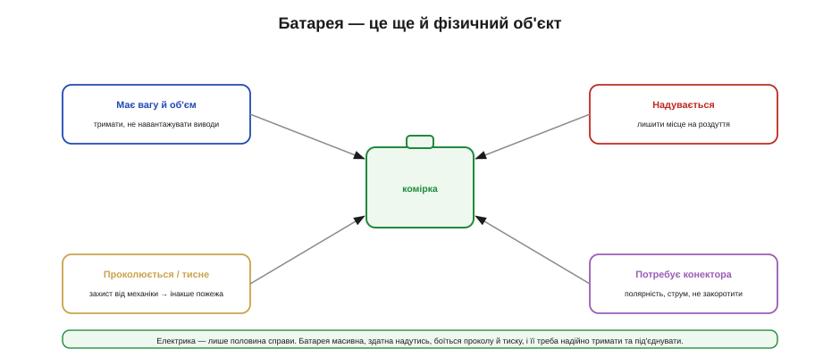
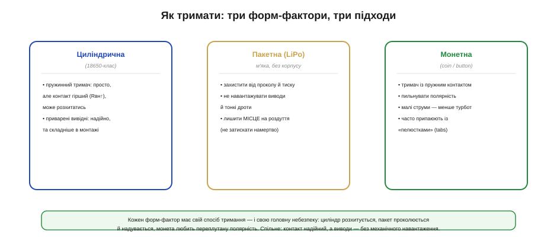
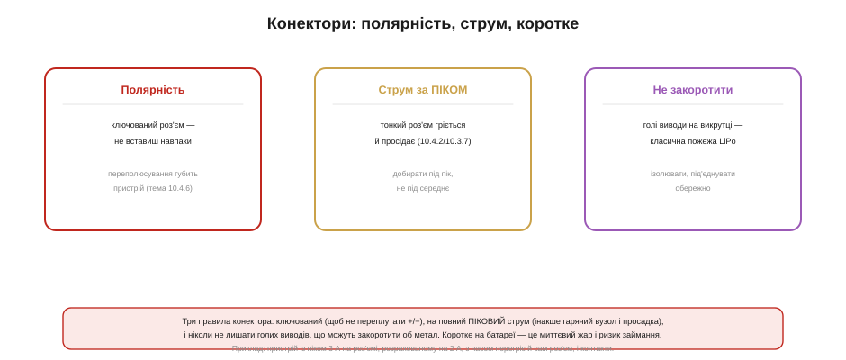
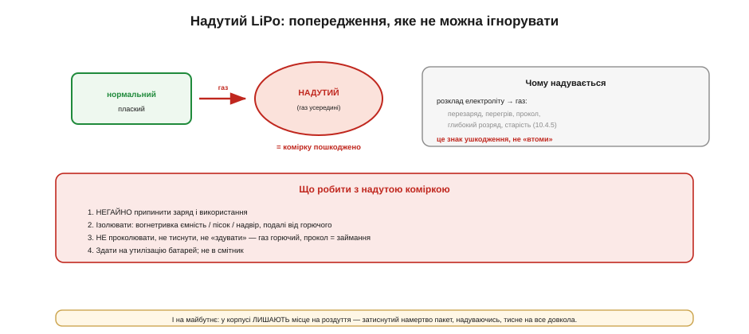
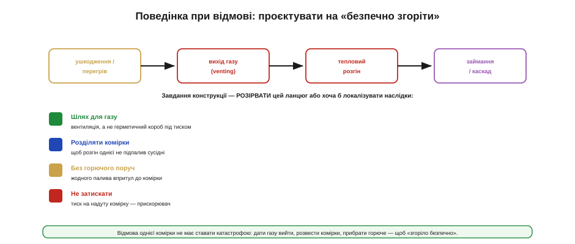
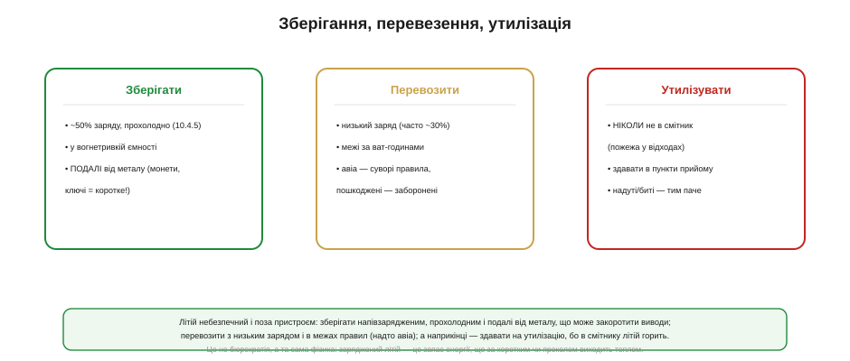

# Механіка і безпека: тримачі, конектори, поведінка при відмові

Батарею легко уявляти як саму лише **електрику** — напругу, струм, заряд. Та в реальному пристрої вона ще й **фізичне тіло**: має вагу, займає місце, надувається, проколюється й вимагає, щоб її надійно тримали й під'єднували. І саме на цьому, нібито «несерйозному» механічному боці народжується більшість справді **небезпечних** відмов: не від хитрого алгоритму заряду, а від проколотого пакета, переплутаного конектора чи закороченого об викрутку виводу. Ця тема — про батарею як об'єкт: як її тримати й під'єднувати, що робити з надутим LiPo, як проєктувати на безпечну відмову й як зберігати, возити та утилізувати літій. І хоч матеріал тут менш «формульний», ставки в ньому найвищі — бо йдеться про пожежу.

Головна установка теми: **літій — це запас енергії, і будь-який неконтрольований вихід цієї енергії (коротке, прокол, перегрів) обертається теплом, а то й вогнем**. Уся механіка й безпека зводяться до одного — не дати цьому статись, а якщо вже сталось, локалізувати наслідки.

### Батарея як фізичний об'єкт

Перш ніж говорити про деталі, окинемо оком чотири механічні турботи, що супроводжують будь-яку комірку.


*Рис. Чотири механічні турботи: батарея **має вагу й об'єм** (її треба тримати, не навантажуючи виводи), **надувається** (потрібне місце на роздуття), **проколюється й боїться тиску** (звідси ризик пожежі) і **потребує конектора** (полярність, струм, захист від короткого). Електрика — лише половина справи.*

Кожна з цих турбот веде до конкретних рішень. Вага й об'єм диктують **кріплення**: важка комірка на вібрації не має теліпатися на власних дротах. Здатність надуватися вимагає **зазору** в корпусі. Вразливість до проколу й тиску — **захисту від механіки**. А потреба під'єднати — **правильного конектора**. Жодне з цих питань не про електрику, та зігнорувати їх означає отримати або ненадійний пристрій, або небезпечний.

### Тримачі: три форм-фактори

Спосіб кріплення залежить від форми комірки, а їх у нашому світі три головні, і кожна зі своїм характером.


*Рис. **Циліндрична** (18650-клас): пружинний тримач простий, але дає гірший контакт (росте Rвн) і може розхитатись; приварені вивідні надійніші, та складніші. **Пакетна (LiPo)**: м'яка, без корпусу — захистити від проколу й тиску, не навантажувати виводи й дроти, лишити місце на роздуття. **Монетна**: тримач із пружним контактом, увага до полярності.*

**Циліндричні** комірки (18650, 21700 і подібні) тримають або в **пружинних тримачах** (швидко, зручно для заміни, але контакт під пружиною має більший опір — він додається до внутрішнього опору комірки і [просаджує напругу під піком струму](book:electronics/battery-sag) — і може розхитатися на вібрації), або через **приварені вивідні смужки** (надійний контакт, але комірку вже так просто не поміняєш). **Пакетні** LiPo — найделікатніші: вони м'які, без жорсткого корпусу, тож їх треба **берегти від проколу й здавлювання**, кріпити, не навантажуючи тонкі виводи й дротики (зламаний у корінні дротик — і коротке), і обов'язково лишати їм **простір на роздуття**. **Монетні** комірки сидять у спеціальних тримачах із пружним контактом; головна тут пастка — переплутана полярність. Спільне для всіх трьох: контакт має бути **надійним**, а виводи комірки — **без механічного навантаження**.

Окрема біда — **вібрація й удари**, надто в дронах, роботах і всьому, що рухається. Незакріплена комірка на трясінні «гуляє», обриває власні дротики чи розхитує пружинний контакт — а зламаний у корінні вивід LiPo легко дає коротке. Тому в рухомій техніці батарею не лише тримають, а й **демпфують**: м'яка проставка, надійне, але не жорстке кріплення, без гострих країв, що труться об оболонку. Комірка має сидіти **щільно**, та не бути ні затиснутою, ні навантаженою через виводи.

Варто пам'ятати й про **довговічність контакту**. Пружинні контакти з часом окислюються й слабнуть, тож їхній опір росте, а з ним — просадка під струмом; у відповідальних місцях беруть позолочені чи добре підпружинені контакти й стежать за їх чистотою. Приварені ж смужки цієї хвороби не мають, але унеможливлюють заміну комірки користувачем — класичний компроміс між ремонтопридатністю (а [старіння комірки](book:electronics/battery-aging) робить заміну рано чи пізно неминучою) і надійністю контакту. Що критичніший струм, то більше схиляються до зварювання.

### Конектори: три правила

Під'єднати батарею здається дрібницею — і саме тому на конекторах роблять стільки небезпечних помилок. Правил тут три, і всі варті того, щоб їх дотримувати без винятків.


*Рис. Три правила: **полярність** — ключований роз'єм, щоб батарею не можна було вставити навпаки (переполюсування губить пристрій); **струм за піком** — тонкий роз'єм гріється й просідає, тож добирають під піковий струм, не середній; **не закоротити** — голі виводи, що торкнулися металу, — класична причина пожежі.*

Перше правило — **полярність**. Батарею не можна давати змогу вставити навпаки: переполюсування здатне спалити пристрій, якщо його не береже [захисна плата](book:electronics/bms). Розв'язок механічний — **ключований** (поляризований) роз'єм, фізично несиметричний, який просто не з'єднається в неправильному положенні. Друге — **струм**. Конектор має пропускати **піковий** струм пристрою, а не середній: тонкий роз'єм під піком грітиметься, його контакти просядуть, а з часом і відмовлять, бо їхній опір додається туди ж, де й Rвн, саме під час найбільшого струму.

**Приклад (конектор за піком, а не за середнім).** Пристрій бере в піку 3 А, у середньому 0.5 А.

```
Добирати конектор треба за ПІКОМ (3 А), не за середнім (0.5 А):
   роз'єм на ~2 А при піку 3 А → грітиметься, просідає, з часом відмова
   роз'єм на десятки ампер      → із запасом, холодний

Опір контактів конектора додається до внутрішнього опору комірки:
   зайве падіння виникає саме там, де струм найбільший.
```

Третє правило — **не закоротити**. Голі виводи батареї, що торкнулися металу (викрутки, ножиць, сусіднього дроту), дають коротке замикання, а воно на зарядженому літії — це миттєвий жар і реальний ризик займання. Тому виводи **ізолюють**, під'єднують обережно й не лишають оголеними. [Захисна плата з BMS](book:electronics/bms) тут друга лінія оборони, але перша — банальна акуратність: не дати металу замкнути клеми.

Конектори зручно ділити на **класи** за струмом: малострумні (для сигналів і живлення логіки) і силові (для моторів, потужного навантаження). Поставити малострумний роз'єм у силове коло — пряма дорога до перегріву, тож клас добирають під найбільший очікуваний струм із запасом. Не менш важлива **фіксація**: роз'єм, що сам випадає від вібрації, на батареї особливо небезпечний — то пропадання живлення, то іскра від поганого контакту. Тому в рухомій техніці беруть роз'єми із **замком** або додатково страхують їх механічно, щоб трясіння не роз'єднало живлення в найгірший момент.

І ще одна дрібниця, що рятує від коротких, — **розвантаження дротів** (*strain relief*). Тонкі дроти LiPo ламаються саме там, де виходять із пакета; якщо їх не закріпити, кожен рух смикає за корінь виводу, поки той не трісне — а тріснутий усередині дріт нерідко й коротить. Тому дроти фіксують біля комірки так, щоб механічне навантаження йшло на **кріплення**, а не на місце пайки чи на тонкий вивід пакета.

### Надутий LiPo: що робити

Чи не найважливіша практична деталь, бо з нею стикається майже кожен, хто працює з LiPo. **Надутий** (роздутий, як подушка) пакет — це не косметична дрібниця, а **сигнал серйозного ушкодження**, який не можна ігнорувати.


*Рис. Пакет надувається, бо електроліт усередині розклався з виділенням **газу** — наслідок перезаряду, перегріву, проколу, глибокого розряду чи старості. Це знак ушкодження, а не «втоми». Що робити: негайно припинити заряд і використання, ізолювати у вогнетривкій ємності подалі від горючого, **не проколювати** й не тиснути, здати на утилізацію.*

Чому пакет надувається? Усередині від зловживання чи [старіння комірки](book:electronics/battery-aging) **розкладається електроліт**, виділяючи газ, який і роздуває м'яку оболонку. Тобто здуття — пряма ознака того, що комірку **пошкоджено**, а не що вона просто «втомилася». Алгоритм дій чіткий і не терпить імпровізації. **По-перше**, негайно припинити заряд і використання — надута комірка непередбачувана. **По-друге**, ізолювати її: покласти у вогнетривку ємність (спеціальний мішок, металева банка, пісок) чи винести надвір, подалі від усього горючого. **По-третє** — і це критично — **не проколювати, не тиснути й не намагатися «здути»**: газ усередині горючий, а прокол чи здавлювання надутого пакета — пряма дорога до займання. **По-четверте**, здати на належну утилізацію батарей, а не в смітник. І висновок на майбутнє: у корпусі пристрою комірці **лишають місце на роздуття** — затиснутий намертво пакет, надуваючись, тисне на сусідні деталі й сам на себе, що лише погіршує справу.

Ловити роздуття краще **рано**. Перші ознаки тонкі: пристрій став важче складатися, кришка не клацає, як раніше, пакет на дотик пружний, а не плаский. Це вже привід вивести комірку з гри, бо здуття саме не минає — воно лише наростає. Корисна звичка для пристроїв із LiPo — лишити змогу **оглянути** комірку, а не заливати її намертво, щоб помітити проблему, поки вона ще локальна, а не коли корпус уже розпирає зсередини.

Утім, найкраще роздуття — те, якого не сталося. Більшість його випадків родом із того, чого варто **не допускати**: перезаряду, перегріву й глибокого розряду. Тобто [правильний заряд CC/CV](book:electronics/li-ion-charger), лагідний режим і [захист BMS](book:electronics/bms) — це водночас і профілактика здуття: бережена комірка надувається куди рідше за ту, з якою поводяться навмання.

> 🔧 **Навіщо це.** Надутий акумулятор — найчастіша «жива» небезпека, з якою стикається embedded-розробник. Запам'ятати алгоритм варто раз і назавжди: **припинити → ізолювати → не проколювати → утилізувати**. Спокуса «дотиснути ще трохи» чи «акуратно випустити газ голкою» закінчується пожежею. Здута на вигляд комірка вже не повертається в роботу — їй одна дорога, на утилізацію.

### Коли комірка відмовляє

Навіть із усіма пересторогами комірка може відмовити — і грамотна конструкція проєктується так, щоб ця відмова **минула безпечно**, а не переросла в катастрофу.


*Рис. Ланцюг відмови: ушкодження/перегрів → вихід газу (venting) → тепловий розгін → займання, а в багатокомірковому пакеті — каскад на сусідні комірки. Завдання конструкції — розірвати цей ланцюг або локалізувати наслідки: дати газу вийти (вентиляція, не герметичний короб під тиском), розділяти комірки, не тримати горючого впритул і не затискати.*

Сценарій відмови літію розгортається ланцюгом: ушкодження чи перегрів → **вихід газу** (venting) → **тепловий розгін** (самопідігрів, що сам себе підживлює) → займання, а в збірці з кількох комірок — **каскад**, коли одна підпалює сусідні. Конструкція не може гарантувати, що жодна комірка ніколи не відмовить, але може **розірвати цей ланцюг**. Передбачають **шлях для газу** — пристрій не має бути герметичним коробом, що накопичує тиск; **розділяють комірки** в пакеті, щоб розгін однієї не передався сусіднім; прибирають **горюче** з безпосередньої близькості до батареї; і не **затискають** комірку так, щоб роздуття її чавило. Це і є проєктування на «безпечно згоріти»: відмова однієї комірки лишається локальним інцидентом, а не пожежею всього виробу.

Грає роль і те, **з чого** зроблено корпус та що лежить упритул до комірки. Поряд із літієм не місце легкозаймистим матеріалам — м'якому пінопласту, паперу, тонкому горючому пластику; натомість беруть матеріали, що бодай **не підтримують горіння**. А отвір для виходу газу спрямовують **геть** від користувача й від чутливої електроніки, щоб гарячий струмінь при вентингу нікого не травмував і не підпалив сусідній вузол. Це дрібні рішення компонування, та саме вони визначають, локальною буде відмова чи переросте в біду.

### Зберігання, транспорт, утилізація

Літій небезпечний і **поза** пристроєм — на полиці, у валізі, у смітнику, — тож кілька правил стосуються всього його життєвого циклу.


*Рис. **Зберігати** — на ~50% заряду й прохолодно, у вогнетривкій ємності, подалі від металу (монети чи ключі в кишені здатні закоротити виводи!). **Перевозити** — з низьким зарядом, у межах правил за ват-годинами, а авіа — за суворими нормами (пошкоджені комірки везти заборонено). **Утилізувати** — ніколи не в смітник (пожежа у відходах), лише в пункти прийому батарей.*

**Зберігання** має й хімічний бік ([наполовину заряджена, прохолодна — щоб повільніше старіла](book:electronics/battery-aging)), і механічний: вільні комірки **не можна тримати поряд із металом** — монета, ключ чи скріпка, замкнувши виводи, влаштують коротке з усіма наслідками; тому їх кладуть у вогнетривку ємність із заізольованими клемами. **Перевезення** літію регламентоване: возять із **низьким зарядом**, у межах за ват-годинами, а авіаперевезення підлягає особливо суворим нормам (зокрема пошкоджені чи надуті комірки до перевезення взагалі не допускають). **Утилізація** — окрема відповідальність: літій **ніколи не викидають у звичайне сміття**, бо роздавлена чи закорочена в сміттєвому пресі комірка спричиняє пожежі на сміттєзвалищах і в сміттєвозах; його здають у спеціальні пункти прийому, а надуті чи биті комірки — тим паче. Усе це не бюрократія, а та сама фізика: заряджений літій носить у собі енергію, яка за коротким чи проколом виходить теплом, де б це не сталося.

Окремо варто знати, що правила різняться для **запасних** комірок і для батарей, **уже встановлених** у пристрої: вільні комірки зазвичай під суворішими обмеженнями (через ризик короткого), тож їх і везуть, і зберігають окремо, із заізольованими клемами. А для відправлення — особливо повітрям — літій вимагає **маркування** й супровідних документів, і це теж не формальність: перевізник має знати, що везе, щоб правильно зреагувати на інцидент. Простіше кажучи, заряджена комірка в дорозі — це вантаж, який поважають, а не дрібничка в кишені, тож і поводяться з ним відповідно.

### Підсумок теми

Батарея — не лише електрика, а й **фізичний об'єкт**, і саме на її механіці народжуються найнебезпечніші відмови. **Тримати** комірку треба надійно, не навантажуючи виводи: циліндричні — у пружинних тримачах (гірший контакт, росте Rвн) чи на приварених смужках; пакетні LiPo — берегти від проколу й тиску й лишати їм **місце на роздуття**; монетні — пильнувати полярність. **Конектор** підкоряється трьом правилам: ключований (проти переполюсування), на повний **піковий** струм (інакше гарячий вузол і просадка) і захищений від **короткого**. **Надутий LiPo** — знак ушкодження: припинити → ізолювати → **не проколювати** → утилізувати. Конструкцію проєктують на **безпечну відмову**: шлях для газу, розділення комірок, без горючого впритул, без затискання. А поза пристроєм літій зберігають напівзарядженим і подалі від металу, возять із низьким зарядом у межах правил і **ніколи не викидають у смітник**. Над усім цим — одна думка: заряджений літій — це енергія, і вся механіка та безпека існують, щоб ця енергія виходила лише там і тоді, де ми дозволили.

Механіка й безпека — остання, але не найменш важлива грань роботи з акумулятором. Поряд із [вибором хімії](book:electronics/battery-chemistries), [просадкою під навантаженням](book:electronics/battery-sag), [зарядом CC/CV](book:electronics/li-ion-charger), [оцінкою заряду](book:electronics/state-of-charge), [старінням](book:electronics/battery-aging) і [захисною платою з BMS](book:electronics/bms) вона перетворює акумулятор із «чорної скриньки з відсотками» на компонент із власною фізикою, нормами й норовом — який треба свідомо вибрати, зарядити, обрахувати, захистити й безпечно вмонтувати в корпус.
