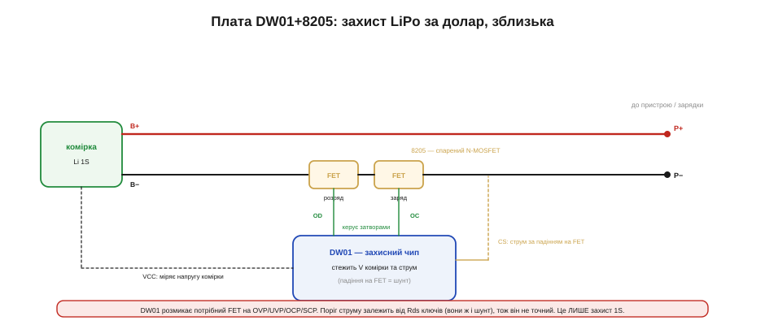

# 🔌 Захист LiPo DW01+8205: розбір плати за долар

Найпоширеніша реалізація однокоміркової захисної плати — на чипі DW01 і спареному MOSFET 8205. Це та сама крихітна смужка, що висить майже на кожному LiPo; розберімо її зблизька — як вона збудована, чому пороги саме такі й чому ключів два.

### Клас пристрою

**DW01+8205-клас** — це канонічна захисна плата однієї літієвої комірки, та сама крихітна смужка, що висить майже на кожному LiPo. Вона складається з двох деталей: **DW01** — захисний чип (protection IC), що стежить за напругою комірки й струмом, і **8205** — спарений N-MOSFET (dual N-MOSFET, два ключі в одному корпусі), яким DW01 розмикає коло на аварії. Це найтиражніший захисний вузол у світі, і коштує він копійки. Як і будь-яка [захисна плата літієвої комірки](book:electronics/bms), він мовчить у нормі й **відрубує** комірку на чотирьох порогах — OVP (overcharge), UVP (overdischarge), OCP (overcurrent) і SCP (short-circuit).

Чому взагалі потрібна окрема плата, а не «розумний» зарядник, який сам не нашкодить? Бо літієва комірка живе власним життям ще довго після того, як її від'єднали від зарядки: до неї чіпляють пристрій, її розряджають у польоті, її кидають у шухляду на пів року. Зарядник керує лише фазою заряду; усе інше комірка проходить сама. А межі, за якими в ній починається **незворотна хімія**, вузькі — і саме на цих межах вартові стоять DW01 і 8205. Тому захист фізично сидить на самій батареї, між коміркою й рештою світу, і живиться від неї ж: він має працювати тоді, коли більше не працює ніщо.

Щоб зрозуміти, **чому пороги саме такі**, і **чому ключів два, а не один**, треба окремо розібрати дві речі — хімію меж комірки й фізику низькостороннього N-MOSFET. Та спершу — як усе це з'єднано.

### Блок-схема


*Рис. Плюс комірки (B+) йде прямо на вихід P+. Мінус (B−) проходить через **два послідовні MOSFET** (8205) до P− — окремий ключ для заряду й для розряду. DW01 живиться від комірки, міряє її напругу (VCC) і струм (CS — за падінням на самих ключах) і керує затворами через виводи OD/OC. На будь-якій аварії розмикає потрібний ключ.*

Зверни увагу на головну архітектурну рису: плюс комірки йде на вихід **навпростець**, а вся комутація — на мінусі. Чому захист ріже саме мінусову (нижню) шину, а не плюсову — не випадковість і не дрібниця монтажу; це випливає з фізики N-MOSFET. Головне в картинці: B+ напряму на P+, а B− через два послідовні ключі на P−.

### Типова розпіновка

```
DW01:
  VCC   плюс комірки — живлення чипа й вимір напруги
  GND   мінус (через малий RC)
  OD    затвор FET РОЗРЯДУ (over-discharge drive)
  OC    затвор FET ЗАРЯДУ (over-charge drive)
  CS    вимір струму (падіння на ключах = шунт)
8205 (спарений N-MOSFET):
  два ключі послідовно в лінії B− — окремо заряд і розряд
B+ / B−  до комірки;   P+ / P−  до пристрою/зарядки
```

### Підключення

VCC DW01 — на плюс комірки, GND — на мінус через невелику RC-ланку (фільтр, що згладжує імпульсні стрибки напруги, аби чип не «бачив» хибних аварій від комутаційних шумів). **8205** вмикають у розрив мінусової лінії між B− (комірка) і P− (вихід), а DW01 керує його двома затворами через OD (ключ розряду) і OC (ключ заряду). Вивід CS заведено так, щоб чип бачив **падіння напруги на самих ключах** — вони ж і служать струмовим шунтом. Пристрій під'єднують до **P+ / P−**, а не прямо до комірки: уся суть у тому, щоб струм ішов через захист.

Тепер — фізика за цією архітектурою: **чому захист на мінусі й чому ключів два.** N-MOSFET відкривається, коли напруга затвор–витік V_GS перевищує поріг V_GS(th) — тобто затвор має бути на кілька вольтів **вищим за витік**. Найпростіше це забезпечити, коли витік прибитий до найнижчого потенціалу схеми — до мінуса комірки. Тоді DW01 живиться від тих самих 3–4 В комірки й легко піднімає затвор над витоком: відкрити ключ дешево й надійно. Якби ключі стояли в плюсовій лінії (high-side), їхній витік «висів» би біля плюса комірки, і щоб відкрити N-канал, затвор довелося б тягнути **вище за плюс батареї** — а такої напруги на платі просто немає, довелося б ставити зарядну помпу. Тому однокоміркові захисні плати майже завжди ріжуть мінус: це дозволяє обійтися дешевими N-MOSFET без жодного підвищувача напруги. (P-канальний ключ на high-side відкрити простіше, але P-MOSFET за тих самих розмірів має більший опір — програш по нагріву й струму, тож для дешевої плати беруть N на low-side.)

Тепер — **чому ключів два, та ще й увімкнені «спина до спини».** Польовий транзистор не симетричний: усередині нього паразитом сидить **діод тіла** (body diode) між витоком і стоком. Коли N-MOSFET закритий, він блокує струм лише в один бік; у зворотному напрямку струм усе одно протече через цей вбудований діод, наче ключа й нема. Один транзистор тому не може перекрити коло в обидва боки. Розв'язок — два ключі в зустрічному ввімкненні (back-to-back), так що їхні діоди тіла дивляться **назустріч**: який би напрямок струму ми не хотіли заблокувати, на шляху завжди стоїть хоча б один діод, повернений «глухим» боком. У нормі обидва ключі відкриті й коло провідне в обидва боки (заряд і розряд ідуть вільно); на аварії DW01 закриває потрібний — і відповідний діод тіла блокує саме той напрямок, який треба зупинити. Ось чому FET розряду (OD) і FET заряду (OC) — окремі: розряд тече в один бік, заряд у протилежний, і блокувати їх треба незалежно.

### «Перший байт»

Його немає — плата **повністю аналогова й автономна**. Жодного коду, жодної шини, жодного налаштування: усі пороги зашиті в кремній DW01 на етапі виробництва й не міняються. Припаяв між коміркою й пристроєм — і захист працює сам. Але самі числа порогів не випадкові: кожне стоїть рівно там, де в літієвій комірці **починається незворотна хімія**. Розберімо чотири пороги через те, що вони бороняться.

**OVP — перезаряд, ~4.25–4.30 В.** Номінал зарядженої LiPo — 4.20 В. Тримати її трохи вище можна, але недовго: за 4.2 В іони літію починають заходити в графітовий анод **швидше**, ніж той встигає їх «всмоктати» у свою структуру (інтеркалювати), і зайвий літій осідає на поверхні анода металевою плівкою — це **літієве плакування** (lithium plating). Воно не повертається назад: ємність падає, а голки металевого літію (дендрити) з часом можуть проколоти сепаратор і замкнути комірку. Паралельно за високої напруги починає розкладатися електроліт — звідси газ і нагрів. Тому DW01 ставить поріг OVP біля 4.25–4.30 В: це той вузький запас над 4.2 В, де ще нічого фатального не сталося, але далі пускати вже не можна. Знімає захист він не на 4.25, а нижче — десь біля 4.10 В (overcharge release): це **гістерезис**, щоб плата не «торохтіла» вмикання-вимикання, коли напруга тремтить біля порога.

**UVP — переглибокий розряд, ~2.4–2.5 В.** Знизу межа ще критичніша, ніж зверху, і за зовсім іншою хімією. Робочий мінімум LiPo — близько 3.0 В; нижче комірка майже порожня. Якщо тягти струм далі, потенціал анода починає **повзти вгору**, і за глибокого розряду доходить до рівня, на якому окислюється вже не літій, а **мідна фольга струмознімача анода** (copper current collector). Мідь розчиняється в електроліті у вигляді іонів Cu²⁺, мігрує крізь сепаратор і осідає там металевими містками — це повільно вбиває комірку зсередини, аж до внутрішнього короткого. Цей процес незворотний так само, як плакування зверху. Тому DW01 розмикає розряд десь на 2.4–2.5 В: трохи нижче робочого мінімуму, поки мідь ще не пішла розчинятися. Знімає UVP він аж біля 2.9–3.0 В (overdischarge release) — і знову це широкий гістерезис: щойно навантаження відключиться й напруга «відпружинить» назад угору, плата не вмикається миттєво, аби не посадити вже виснажену комірку повторно.

**OCP і SCP — перевантаження струмом і коротке.** Ці два пороги бороняться не від хімії меж напруги, а від **струму**: надмірний струм гріє і комірку, і ключі, а коротке замикання може спричинити тепловий розгін. DW01 міряє струм непрямо — за падінням напруги на відкритих ключах 8205 (вони ж самі правлять за шунт, що позначається на точності порога). Поріг OCP — це фіксована напруга на цьому «шунті» (типово ~150 мВ): щойно падіння перевищить її, чип розмикає коло. SCP — окремий, набагато вищий поріг (типово ~1.3 В на шунті) з дуже коротким часом реакції: це реакція на справжнє коротке замикання, коли струм лавиноподібний і чекати ніколи.

І ще одна тонкість, яку дає аналогова природа плати: усі чотири пороги мають **затримку спрацювання** (detection delay) — десятки-сотні мілісекунд для OVP/UVP, але мікросекунди для SCP. Затримка — це не недолік, а навмисний фільтр: вона відсіює короткі сплески (стрибок струму при ввімкненні двигуна, просадка напруги під ривком навантаження), щоб плата не рубала живлення від кожного нормального перехідного процесу. А коротке замикання, навпаки, треба ловити за мікросекунди — тому SCP реагує майже миттєво.

### Типові граблі

- **Це лише захист.** DW01+8205 не заряджає (для цього потрібен окремий [зарядний контролер літієвої комірки](book:electronics/li-ion-charger)) і не балансує (балансування — для багатокоміркових пакетів, де його робить [BMS](book:electronics/bms)). Тільки 1S.
- **Поріг струму неточний.** Оскільки шунтом служать самі ключі, поріг OCP залежить від їхнього опору Rds(on) — а той «гуляє» з температурою (у кремнію опір каналу росте з нагрівом, бо рухливість носіїв падає). Тому той самий струм за гарячих ключів дасть більше падіння на «шунті» й спрацює OCP раніше, ніж за холодних. Звідси струм спрацювання — орієнтовний, не точна уставка.
- **«Нуль вольт» після UVP.** Спрацював захист від глибокого розряду — і на **P−** напруга падає до нуля, хоча комірка ще жива; звичайний зарядник вважає таку батарею мертвою, і вивести її з цього стану вміє не кожна [система керування батареєю](book:electronics/bms).
- **Під'єднуй до P, не до B.** Пристрій і зарядку вішають на **P+/P−**; під'єднати їх прямо до комірки (B) — значить обійти захист.
- **Не від усього.** Плата боронить лише за своїми чотирма порогами; від переполюсування, зовнішньої перенапруги понад вікно чи механічного пошкодження вона не рятує — це окремі захисти.

### Числовий приклад

**Скільки струму комірка віддасть, перш ніж спрацює OCP, і як цей поріг «попливе» від нагріву.** Візьмемо типову плату DW01+8205: поріг OCP за напругою на шунті V_OCP ≈ 150 мВ, а опір пари ключів 8205 (два по ~25 мОм послідовно) R ≈ 50 мОм за кімнатної температури. DW01 розмикає коло, щойно падіння на ключах перевищить 150 мВ. Поріг струму:

```
I_trip = V_OCP / R
I_trip = 0.150 В / 0.050 Ом
I_trip = 3.0 А   (за ~25 °C)
```

Тепер припустимо, що під навантаженням ключі прогрілися до ~75 °C. Опір каналу N-MOSFET росте приблизно лінійно з температурою; для типового кремнію коефіцієнт ≈ +0.4 %/°C, тож за ΔT = 50 °C опір зросте десь на 20 %:

```
R_hot = R × (1 + 0.004 × 50)
R_hot = 0.050 × 1.20
R_hot = 0.060 Ом

I_trip(hot) = 0.150 / 0.060
I_trip(hot) ≈ 2.5 А
```

Висновок: той самий поріг у мілівольтах за гарячих ключів спрацьовує вже на 2.5 А замість 3.0 А — на 17 % раніше. Ось чому OCP цього класу — груба «запобіжна стеля», а не точне обмеження струму. Якщо проєкту потрібен **точний** ліміт (скажімо, ESP32 із силовим каскадом, де треба знати поріг із точністю до сотень міліампер), беруть захист зі **зовнішнім шунтом** відомого опору, а не той, що міряє струм по самих ключах.

### Варіації класу

Канонічна пара — **DW01 + 8205**, але є й **однокристальні** рішення, де контролер і ключі зведено в один чип (компактніше). Дуже поширені **комбіновані модулі**, де поряд із захистом стоїть і [зарядний контролер](book:electronics/li-ion-charger): такий зарядник плюс DW01+8205 — це й є ті «зарядні плати з захистом». А для **багатокоміркових** пакетів беруть зовсім інші захисні чипи з балансуванням і моніторингом кожної комірки — аж до повноцінної [BMS](book:electronics/bms).
