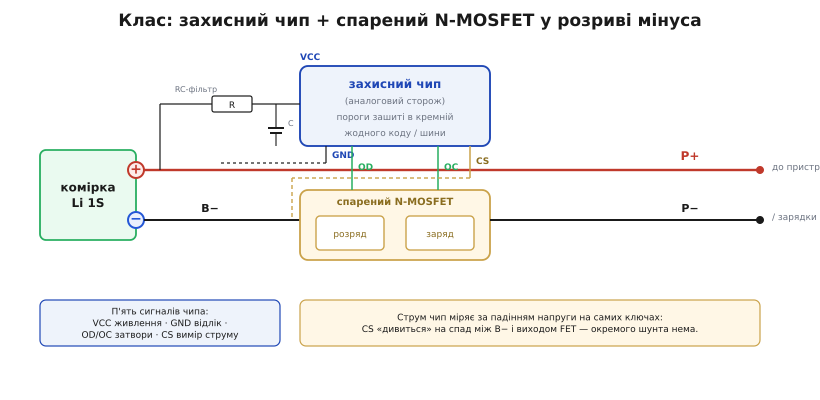
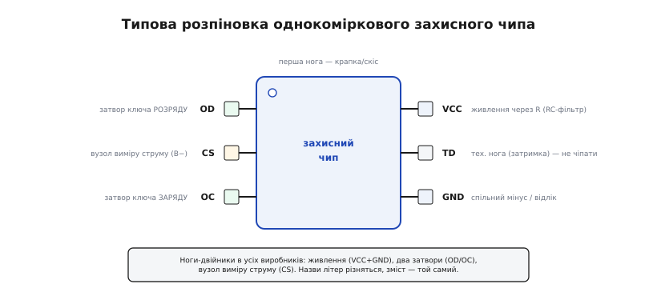
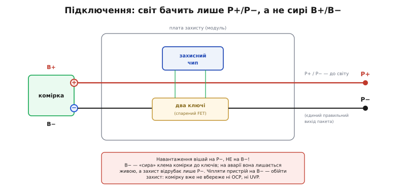

# 🔌 Однокоміркова захисна мікросхема

Візьми будь-який літій-полімерний пакет — з навушників, повербанка, іграшкового дрона — і зазирни під жовтий скотч на його торці. Майже завжди там та сама картина: крихітна смужка плати з двома чорними цятками, приклеєна просто до клем комірки, з якої виходять дроти живлення. Одна цятка — восьминога більша, друга — шестинога дрібніша. Це і є **однокоміркова захисна мікросхема** (англ. *single-cell protection*): найтиражніший захисний вузол на планеті, той самий вартовий біля батареї, який фізично рве коло, щойно комірка підходить до небезпечної межі напруги чи струму.

Найважливіше про цей клас — що це не одна мікросхема, а **пара**, і завжди пара: **захисний чип** (аналоговий сторож, що міряє напругу й струм) плюс **спарений N-канальний MOSFET** (два силові ключі в одному корпусі). Чип — це мозок без м'язів: він вирішує, але сам великий струм не тримає. Ключі — м'язи без мозку: вони рвуть коло, але самі не знають коли. Порізно жоден нічого не боронить; разом вони й складають захисну ланку. Ця пара повторюється в мільярдах виробів під сотнями різних партномерів різних виробників — та влаштована всюди **однаково**, бо продиктована не примхою інженера, а фізикою літієвої комірки й польового транзистора. Саме тому про неї є сенс говорити як про **клас**, а не про конкретну модель: розпіновка, підключення й граблі в них спільні, а різняться лише порогами й літерами на корпусі.

> 🔧 **Навіщо це.** Розпізнати цю пару на платі й правильно її підключити — базова навичка кожного, хто робить щось на літії. Наплутати тут легко, а ціна помилки висока: підключиш навантаження не до тієї клеми — і захист просто **не працюватиме**, хоча зовні все ніби зібрано. Гірше — можеш роками не знати про це, поки перший глибокий розряд не вб'є комірку або перший коротун не закінчиться нагрівом. Хто розуміє, **як** ця пара міряє й **що** саме рве, той підключає її за хвилину й спить спокійно; хто ні — збирає бомбу сповільненої дії.

## Що це за клас пристроїв

Однокоміркова захисна мікросхема — це **автономний аналоговий сторож напруги й струму однієї літієвої комірки**. Слово «однокоміркова» (англ. *single-cell*, скорочено 1S) — визначальне: клас розрахований рівно на **одну** комірку, від 2.5 до 4.3 В приблизно. Не на дві послідовно, не на батарею — на одну. Це задає весь його характер: чипові не треба ні стежити за кількома напругами, ні їх вирівнювати, ні спілкуватися з зовнішнім світом. Одна комірка, чотири пороги, два ключі — і все.

Ключове слово, що визначає весь клас, — **аналоговий**. У цьому чипі немає ні процесора, ні прошивки, ні шини даних. Усі його пороги — перезаряд, переглибокий розряд, перевантаження, коротке — **зашиті в кремній на етапі виробництва** підбором внутрішніх опорів і компараторів. Він не програмується; ти не можеш «перепрошити» йому поріг чи вичитати з нього стан. Він просто вмикається від напруги комірки, роками сидить на її клемах, мовчки пропускає струм — і розмикає коло рівно тоді, коли якийсь із зашитих порогів перейдено. Ця тупість — не вада, а **головна чеснота** класу: нема чому зависати, нема що псувати, нема коду з помилками. Вартовий, що не спить і не думає, — саме тому йому й довіряють останню стіну оборони.

Другий стовп класу — **де він стоїть**. Захист вставляють у розрив **мінусової** шини комірки, а плюс пускають на вихід навпростець. Причина суто в фізиці ключа: [N-канальний MOSFET](topic:electronics/mosfet-power-switch) відкривається, коли затвор піднято на кілька вольтів вище за витік, а це найлегше забезпечити, коли витік прибитий до найнижчого потенціалу схеми — до мінуса комірки. Тоді чип живиться від тих самих 3–4 В комірки й легко тримає затвори відкритими. Постав ключі в плюсову шину — їхній витік «висів» би біля плюса батареї, і щоб відкрити N-канал, затвор довелося б тягти **вище за плюс комірки**, а такої напруги на дешевій платі просто нема (довелося б ставити [зарядну помпу](topic:electronics/charge-pump)). Тому весь клас однокоміркового захисту ріже мінус звичайними N-MOSFET без жодного підвищувача — це і робить його копійчаним.

Отже, портрет класу: **автономний аналоговий сторож однієї літієвої комірки, із зашитими в кремній порогами, що рве мінусову шину парою N-MOSFET**. Усе інше — деталі цього портрета.

## Що всередині пари: блок-схема

Розберімо пару на дві половини — і весь клас стане прозорим, бо в кожної половини рівно одна робота.


*Дві деталі складають захисну ланку. Захисний чип (мозок) живиться від комірки через RC-фільтр на VCC, міряє напругу між VCC і GND, а струм — за падінням на самих ключах (лінія CS). Спарений N-MOSFET (м'язи) стоїть у розриві мінуса B−→P−; його два ключі — розряду й заряду — чип відкриває сигналами OD і OC. Плюс комірки йде на вихід навпростець.*

**Захисний чип — мозок.** Це маленька аналогова мікросхема, зазвичай на шість ніг. Усередині неї сидять компаратори, кожен зі своїм зашитим порогом: один стежить, щоб напруга комірки не перевищила ~4.25 В (перезаряд), другий — щоб не впала нижче ~2.4 В (переглибокий розряд), третій і четвертий ловлять надмірний струм (перевантаження й коротке). Ще там — джерело опорної напруги (еталон, з яким компаратори звіряють), логіка затримок (щоб не панікувати від коротких сплесків) і два вихідні каскади, що керують затворами ключів. Уся ця начинка живиться мікроамперами з тієї самої комірки, яку боронить.

**Спарений N-MOSFET — м'язи.** Це два N-канальні силові ключі в одному корпусі, увімкнені **«спина до спини»** (англ. *back-to-back*). Чому два, а не один? Тому що [польовий транзистор несиметричний](topic:electronics/mosfet-back-to-back): усередині нього паразитом сидить [діод тіла](topic:electronics/body-diode), і закритий ключ блокує струм лише в **один** бік, а в зворотному струм усе одно протече крізь цей діод. Один ключ не може перекрити коло в обидва боки — а захисту треба вміти зупиняти і розряд (комірка → навантаження), і заряд (зарядник → комірка). Тому ключів **два**, з діодами тіла назустріч: закрив ключ розряду — блокується розряд, закрив ключ заряду — блокується заряд. У нормі обидва відкриті, коло провідне в обидва боки, а на малому опорі відкритих ключів діоди навіть не вмикаються.

Тепер — **як мозок говорить із м'язами**. Між ними біжить рівно п'ять сигналів, і кожен має причину бути:

- **VCC** — живлення чипа. Заведене на плюс комірки, зазвичай **через резистор**, а на самому чипі стоїть конденсатор на землю. Цей резистор із конденсатором — **RC-фільтр**: він згладжує стрибки напруги на клемах (коли навантаження смикає струм, напруга комірки просідає й підстрибує) і не дає завадам збити компаратори з пантелику. Дрібниця з двох деталей, а без неї чип «нервував» би на кожному ривку струму.
- **GND** — спільний відлік. Заведений на мінус комірки. Відносно цієї точки чип і міряє все інше.
- **OD** (англ. *over-discharge* / *output discharge*) — вихід на затвор **ключа розряду**. Поки все гаразд, чип тримає тут високий рівень, ключ відкритий. Стало погано на розряді (напруга впала нижче UVP, чи струм перевищив стелю) — чип роняє OD, ключ розряду закривається.
- **OC** (англ. *over-charge* / *output charge*) — вихід на затвор **ключа заряду**. Дзеркально: перезаряд — чип роняє OC, ключ заряду закривається, зарядний струм обрубано.
- **CS** (англ. *current sense*) — вузол виміру струму. Ось тут і ховається головна хитрість класу, розберімо її окремо.

**Як чип міряє струм — без окремого шунта.** Найдешевший спосіб виміряти струм — не ставити спеціальний вимірювальний резистор, а **дивитися на падіння напруги на самих ключах**, якими захист і так рве коло. Відкритий MOSFET має малий, але ненульовий опір (англ. *R*ds(on) — опір каналу у відкритому стані); струм, течучи крізь нього, створює на цьому опорі пропорційне падіння за законом Ома. Нога CS заведена так, щоб «бачити» цей спад між сирим мінусом комірки (B−) і виходом ключів (P−). Що більший струм — то більше падіння; перейшло падіння зашитий поріг — чип рахує це за перевантаження й розмикає коло. Ключі тут працюють одразу у двох ролях: і як вимикач, і як вимірювальний резистор. Дешево — бо задарма, жодної зайвої деталі; але **неточно**, і ця неточність — наскрізна риса класу, до якої ми ще повернемося в граблях.

## Типова розпіновка

Корпус захисного чипа майже завжди шестиногий (класичний дрібний корпус на шість ніжок), і хоча різні виробники звуть ніжки по-різному, **набір функцій у всіх той самий**. Якщо запам'ятати не літери, а ролі, то читаєш будь-який такий чип з першого погляду.


*Розпіновка однокоміркового захисного чипа. Із одного боку — два затвори (OD розряду, OC заряду) і вузол виміру струму (CS); з іншого — живлення (VCC через резистор, GND на мінус). Шоста нога зазвичай технологічна (задає внутрішню затримку) і в застосуванні не чіпається. Літери в різних виробників різняться, але ці шість ролей — незмінні.*

Отже, шість ніг і їхні ролі:

- **VCC** — живлення чипа, на плюс комірки через резистор (частина RC-фільтра).
- **GND** — земля чипа, на мінус комірки; відлік для всіх вимірів.
- **OD** — затвор ключа **розряду**.
- **OC** — затвор ключа **заряду**.
- **CS** (у декого зветься VM, від *V minus*) — вузол виміру струму, заведений на сирий мінус комірки B−.
- **Технологічна нога** — зазвичай задає внутрішню затримку спрацювання; на робочій платі її або лишають вільною, або підтягують згідно з довідником. У штатному застосуванні її не чіпають.

Зверни увагу на асиметрію: **двох затворів** (OD і OC) саме два, бо ключів два й рубати напрямки треба незалежно; а вимір струму — **один** вузол (CS), бо струм у мінусовій шині один і той самий, хоч куди він тече. Ця розкладка ніг — прямий відбиток того, що ми вже знаємо про будову ланки: два незалежні м'язи, один сенсор струму, одне живлення.

Спарений MOSFET теж шестиногий, але його ноги розкладено інакше — під силовий струм: кілька ніг об'єднано на спільний вузол (щоб провести більший струм товщою міддю), окремо виведено два затвори й окремо — спільний вивід. Точна розкладка залежить від корпусу, тож її звіряють із довідником конкретної збірки; важливо тримати в голові принцип — **два затвори (від OD і OC чипа), силовий вхід від комірки, силовий вихід на пакет**.

## Як це підключають

Зберімо пару в робочу плату. Тут з'являється єдине по-справжньому важливе поняття всього підключення — **дві різні мінусові клеми**. Плутанина саме тут — джерело половини помилок із цим класом.


*Підключення пари. Комірка має свої клеми B+ і B−. Плюс іде на вихід навпростець (B+ = P+). А ось мінус розрізано: сирий мінус комірки B− заходить у ключі, а назовні виходить уже мінус пакета P− — після ключів. Пристрій і зарядник чіпляють лише до P+/P−; B− — внутрішній вузол, до якого світ доступу мати не повинен.*

Розберімо ці чотири клеми, бо в них уся суть:

- **B+** (англ. *battery +*) — плюс самої комірки.
- **B−** (англ. *battery −*) — мінус самої комірки, «сира» клема **до** ключів.
- **P+** (англ. *pack +*) — плюс пакета, тобто те, що виходить назовні. Оскільки плюс не рвуть, **P+ = B+** просто напряму.
- **P−** (англ. *pack −*) — мінус пакета назовні, **після** ключів.

Ключова думка: **B− і P− — це різні точки**, розділені двома ключами. У нормі ключі відкриті, і B− майже дорівнює P− (їх розділяє лише крихітне падіння на опорі ключів). Але на аварії чип закриває ключі — і тоді B− лишається на клемі комірки, а P− «відлітає»: коло розірвано саме між ними. Ось чому весь зовнішній світ — і пристрій, і зарядник — треба чіпляти **до P+/P−**, а не до B−: тільки P− стоїть **за** захистом. Підключишся до B− — і струм піде повз ключі, обійшовши весь захист; чип боронитиме порожнечу.

Саме підключення пари зводиться до кількох з'єднань, і всі вони прямо випливають зі щойно сказаного:

1. **Плюс комірки B+ — на вихід P+ навпростець.** Жодного ключа в плюсі нема.
2. **Мінус комірки B− — на силовий вхід спареного MOSFET.** Це початок розриву.
3. **Силовий вихід MOSFET — це P−**, мінус пакета назовні.
4. **VCC чипа — на B+ через резистор**, а конденсатор VCC→GND ставлять поряд (RC-фільтр).
5. **GND чипа — на B−** (мінус комірки, до ключів).
6. **CS чипа — теж на B−** (сирий мінус), щоб чип бачив падіння на ключах як міру струму.
7. **OD і OC чипа — на затвори відповідних ключів** спареного MOSFET.

Ось і вся плата: дві деталі, резистор, конденсатор, сім-вісім з'єднань. Ніякого мікроконтролера, ніякого коду. Припаяв між коміркою й пристроєм — і захист працює сам, від першої ж мілісекунди подачі живлення.

## Перший байт

Найкраще все вкладається в голові, коли простежиш **один повний цикл аварії й відновлення** — те, з чого варто почати, щоб відчути роботу пари наживо. Візьмімо найтиповіший і найважливіший сценарій: **переглибокий розряд** (UVP), бо саме він найчастіше рятує реальні пристрої й саме на його «хвості» ховається найгостріша особливість класу.

**Вихідний стан — усе гаразд.** Комірка на 3.7 В, обидва ключі відкриті (чип тримає високий рівень на OD і OC). Пристрій тягне свій струм: плюс → пристрій → P− → крізь відкриті ключі → B− → назад у комірку. Чип мовчить і лише спостерігає: міряє напругу між VCC і GND, дивиться на падіння на ключах через CS. Усе в межах вікна.

**Користувач забув вимкнути пристрій.** Тижнями той тихенько смокче струм спокою, комірка повільно порожніє: 3.5 В… 3.2 В… 3.0 В. Чип досі мовчить — це ще робоче вікно.

**Напруга падає нижче UVP.** Ось воно: напруга комірки просіла до ~2.4 В. Компаратор переглибокого розряду спрацьовує — але **не миттєво**. Чип витримує зашиту затримку (типово десятки-сотні мілісекунд): а раптом це короткий провал під ривком навантаження, а не справжнє виснаження? Затримка минула, напруга досі низька — це не сплеск, це кінець. Чип **роняє OD**: затвор ключа розряду падає, ключ закривається. Коло розряду розірвано. Струм із комірки більше не тече — вона врятована від фатального переглибокого розряду.

**А тепер — найважливіший і найпідступніший наслідок.** Ключ розряду закрито. Що бачить пристрій на своїх клемах P+/P−? Плюс на місці (P+ = B+ = 2.4 В), а от P− «відлетів»: між P− і комміркою тепер закритий ключ. Напруга **на виході пакета впала майже до нуля**. Комірка ще жива (у ній 2.4 В), але **назовні пакет прикидається мертвим**: 0 В. Це навмисно — так захист і має поводитися. Але звідси випливає класична пастка, про яку — нижче, у граблях.

**Відновлення.** Як вивести пакет із цього стану? Підключити **зарядник**. Тонкість у тому, що ключ розряду закритий, а ключ **заряду досі відкритий** — і в закритого ключа розряду ще є його **діод тіла**, повернений так, щоб пропускати саме зарядний струм. Тому зарядник, притиснувши до P− свій мінус, жене струм у комірку крізь відкритий ключ заряду й діод тіла закритого ключа розряду. Комірка починає набирати напругу: 2.5 В… 2.7 В… І щойно вона підніметься вище **порога зняття** UVP (це не ті самі 2.4 В, а вище — близько 3.0 В; рознесення порогів спрацювання й зняття зветься гістерезисом і не дає платі «торохтіти» на межі), чип знову **піднімає OD**, ключ розряду відкривається, і пакет повертається до нормального життя. Цикл замкнувся: аварія — відруб — відновлення.

> 🔧 **Навіщо це.** Цей цикл — і є вся робота пари: мовчати в межах вікна, вчасно рубати потрібний ключ на межі, тримати відруб із гістерезисом і давати струмові дорогу назад крізь діод тіла для відновлення. Опанувавши його на переглибокому розряді, ти розумієш і решту: перезаряд працює дзеркально (чип роняє OC, ключ заряду закривається, розряджати ще можна крізь його діод тіла), а перевантаження й коротке — це той самий відруб ключа розряду, лише за іншим сенсором (струм замість напруги) і з іншою затримкою (мілісекунди для перевантаження, мікросекунди для короткого).

## Типові граблі

Клас простий і надійний, та має жменю пасток, на яких спотикаються чи не всі, хто зустрічає цю пару вперше. Кожна випливає прямо з того, як вона влаштована.

**Неточний поріг перевантаження — бо міряють по самих ключах.** Найглибша особливість класу. Оскільки струм чип міряє за падінням на ключах, а поріг зашитий у мілівольтах цього падіння, реальний струм спрацювання дорівнює:

```
I_поріг = V_поріг / R_ключів
```

де V_поріг — зашите в чипі порогове падіння (скажімо, 150 мВ), а R_ключів — сумарний опір відкритої пари. Біда в тому, що R_ключів **не стала величина**. По-перше, вона різна від екземпляра до екземпляра: паспортний розкид Rds(on) у MOSFET легко ±20–30 %, тож той самий чип із різними ключами дасть помітно різний поріг. По-друге, опір **росте з нагрівом** — у кремнію рухливість носіїв падає з температурою. Прикиньмо, наскільки:

**Пара ключів має 50 мОм за 25 °C, поріг чипа V_поріг = 150 мВ. Що буде за холодних і гарячих ключів (коефіцієнт ≈ +0.4 %/°C)?**

Холодні ключі, 25 °C:
```
I_поріг = 0.150 В / 0.050 Ом = 3.0 А
```

Прогрілися під навантаженням до 75 °C (ΔT = 50 °C, опір зросте на ~20 %):
```
R_гар = 0.050 · (1 + 0.004 · 50) = 0.060 Ом
I_поріг = 0.150 / 0.060 ≈ 2.5 А
```

Той самий чип із тими самими ключами спрацьовує то на 3.0 А (холодний), то на 2.5 А (гарячий) — на ~17 % раніше просто через нагрів. Висновок: поріг перевантаження в цього класу — **груба запобіжна стеля, а не точний ліміт струму**. Він годиться, щоб уберегти від відвертого перевантаження й короткого, але не для задачі «тримати струм рівно на 2.0 А ± 0.1 А». Кому треба точність — беруть варіацію з окремим [шунтом](topic:electronics/kelvin-shunt) відомого й стабільного опору (про це в кінці).

**Нуль вольт на виході після відрубу — зарядник вважає батарею мертвою.** Пряме продовження «першого байта». Після UVP пакет видає назовні 0 В, хоча комірка жива. Проблема: **багато простих зарядників, побачивши 0 В, вважають батарею дохлою й відмовляються її заряджати** — вони очікують на клемах бодай якусь напругу, щоб «упізнати» акумулятор, а нуль сприймають як обрив або мертву клітинку. Виходить глухий кут: щоб вийти з відрубу, треба зарядити; а зарядник не заряджає, бо бачить нуль. Розумніші зарядники вміють давати короткий «пробуджувальний» імпульс, який протискається крізь діод тіла й піднімає напругу комірки над порогом зняття — після чого чип відпускає ключ і все оживає. Тому, якщо саморобний пакет на такому захисті «раптово помер» (0 В на виході) — не поспішай його викидати: комірка часто ще жива, просто захист у відрубі, і потрібен зарядник, здатний його розбудити.

**Підключили пристрій до B−, а не до P−.** Найпідступніша монтажна помилка, бо плата при ній **зовні працює** — а захисту насправді нема. Хто плутає сирий мінус комірки (B−) з мінусом пакета (P−) і чіпляє навантаження до B−, той пускає струм **повз ключі**: коло замикається до того, як дійде до захисту. Чип справно міряє напругу й навіть чесно роняє OD на аварії — але струм тече не через ключі, тож цей відруб ні на що не впливає. Комірку в такому монтажі не вбереже ні перевантаження, ні переглибокий розряд, ні коротке: захист висить збоку декорацією. Правило залізне: **усе, що йде в зовнішній світ, — тільки на P−**; B− — внутрішній вузол між коміркою й ключами, до якого нічого зовнішнього чіпляти не можна.

**Прийняли захист за зарядку — і не заряджають комірку профілем.** Клас **боронить межі, але не заряджає**. У ньому нема регулятора зарядного струму й напруги; він лише пропускає зарядний струм, поки той у межах, і рубає, коли за межами. Правильно заряджати літій (спочатку сталим струмом, потім сталою напругою — профіль CC/CV) — робота окремого [зарядного контролера](topic:electronics/li-ion-charger). Ті «зарядні плати з захистом», що продають на модулях, — це якраз зарядник **плюс** захисна пара поряд, дві різні мікросхеми на одній платці, а не одна деталь, що вміє все.

**Прийняли за балансир — а він стереже лише одну комірку.** Клас — **строго 1S**. Він міряє одну напругу й нічого не знає про сусідні комірки. Коли комірок кілька послідовно, до захисту меж додається окрема задача — **вирівнювати заряд між комірками** (бо навіть однакові з виду комірки старіють по-різному, і без вирівнювання одна почне «тікати» за напругою). Однокоміркова пара цього не робить і не може: у неї немає ні входів на окремі комірки, ні схеми перекидання заряду. Ставити її на батарею з кількох комірок, чекаючи балансування, — марно.

**Прийняли за розумну систему керування — а це тупий вартовий.** Однокоміркова пара навмисно проста: зашиті пороги, жодного розуму, жодного зв'язку. Вона не рахує залишковий заряд, не веде статистики, не спілкується шиною й не оптимізує батарею. Коли все це потрібно — це вже [система керування батареєю (BMS)](topic:electronics/bms), окремий і значно складніший клас. У серйозних пакетах ставлять обидва: розумна BMS щодня оптимізує батарею, а тупа незалежна захисна пара стоїть **останньою стіною** на випадок, коли BMS осліпне чи зависне. Тупість тут — риса за призначенням: остання стіна не має права зависати.

## Варіації класу

Усередині класу є кілька осей, за якими пари різняться — корисно знати, що буває, щоб упізнати варіант і вибрати під задачу.

**Пороги під різну хімію.** Найголовніша вісь. Чипи різняться зашитими порогами під конкретну літієву хімію. Звична літій-кобальтова/полімерна комірка заряджається до 4.20 В — під неї поріг перезаряду ~4.25–4.30 В. А літій-залізо-фосфатна (англ. *LiFePO₄*) заряджається лише до ~3.65 В і має нижчий робочий мінімум — під неї потрібен **окремий** чип із нижчими порогами. Поставити «звичайний» чип на залізо-фосфат — груба помилка: він дасть перезарядити комірку, бо його поріг вищий за її стелю. Тому, беручи захист, перше, що звіряють, — **під яку хімію зашиті пороги**.

**Поодинокі ключі замість спареної збірки.** Спарений MOSFET в одному корпусі — найкомпактніше рішення, та не єдине. Де струми великі (потужні пакети на десятки ампер), два ключі ставлять **окремими** транзисторами — або навіть кілька паралельно на кожен напрямок, щоб розкидати струм і тепло. Схема від цього не міняється: та сама пара «спина до спини», лише в дискретному вигляді. Спарена збірка — це просто зручна упаковка того самого для малих струмів.

**Однокристальне рішення — чип і ключі разом.** Дзеркальний бік: там, де важить кожен квадратний міліметр (мініатюрні пристрої, чутки), захисний чип і обидва MOSFET кладуть **на один кристал** в один корпус. Зовні це одна крихітна деталь на кілька ніг (B+, B−, P−, іноді керувальні), а всередині — та сама пара «сторож + ключі». Принцип підключення той самий (усе на P−), просто рахувати ніг менше. Плата за компактність — обмежений струм: інтегровані ключі не бувають такими товстими, як зовнішня силова збірка.

**Комбіноване рішення — заряд плюс захист.** Найпоширеніша плутанина класу — зі «зарядно-захисними» модулями, тож варто чітко відділити. Буває, що на одному кристалі поєднують **дві різні функції**: зарядний контролер (той, що веде профіль CC/CV) **і** захисну ланку. Тоді одна мікросхема і правильно заряджає комірку від входу, і боронить її межі — зручно для дрібних виробів на кшталт бездротових навушників, де місця обмаль. Але важливо тримати в голові, що це **дві логічно різні підсистеми в одному корпусі**, а не одна чарівна деталь: зарядна частина живе, поки є вхід живлення, а захисна стереже комірку завжди. Класичний приклад такого поєднання «зарядник + захист» на одному модулі — популярні зарядні платки на базі [окремого зарядного контролера з доданою захисною парою](topic:electronics/tp4056), де захист лишається саме такою самою окремою парою «чип + спарений MOSFET» поряд із зарядником.

**Точний вимір струму через шунт.** Остання й найважливіша для інженера вісь. Стандартний клас міряє струм по власних ключах — дешево, але неточно (розкид Rds(on) плюс температурний дрейф). Де поріг має триматися точно, беруть варіацію з **окремим струмовим шунтом**: у розрив мінуса додають малий резистор відомого й стабільного опору (типово одиниці міліом, часто [чотиридротовий шунт Кельвіна](topic:electronics/kelvin-shunt) для точності), і чип міряє падіння вже на ньому, а не на ключах. Тоді поріг перевантаження стає точним і не пливе з нагрівом ключів — ціною однієї зайвої деталі й крихти втрат на шунті. Обирають між «по ключах» і «по шунту» за тим, що важливіше: копійчана простота (по ключах, більшість дешевих пакетів) чи точний ліміт струму (по шунту, там, де струм треба тримати строго).

> 📜 **Історична вставка:** [як народилася ідея «сторожа при батареї»](topic:electronics/battery-protection/hist-lithium-protection.md). Пара «аналоговий чип + два ключі» — не чиясь одинична вигадка, а рішення, що викристалізувалося в 1990-х, коли перші літієві пакети пішли в масу й показали, що без вартового просто на батареї вони небезпечні. Відтоді ця конфігурація стала галузевим стандартом де-факто й дожила майже незмінною до сьогодні — саме тому клас і описується без жодного партномера: усі виробники повторюють ту саму фізику.
