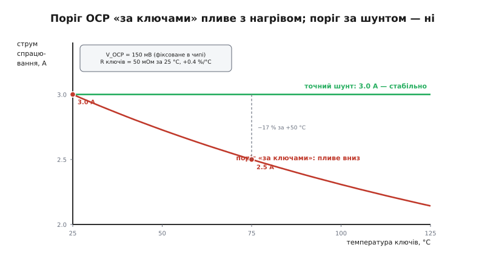
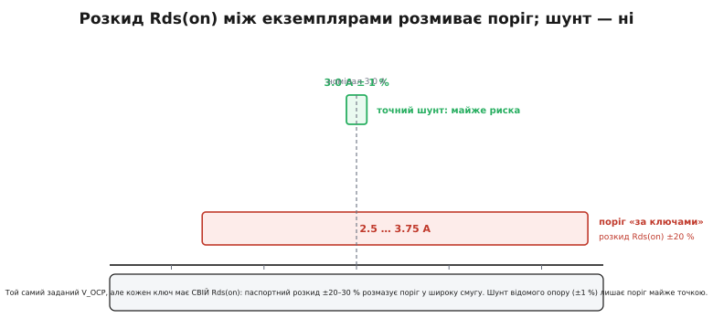

# 🧮 Плаваючий поріг OCP: чому «вимірювальна лінійка» сама змінює довжину

Найдешевший струмовий захист має одну красиву й одну підступну властивість, і обидві живуть в одному рядку. Красива: щоб зміряти струм, не треба ставити жодної окремої деталі — струм і так тече крізь ключі, якими захист рве коло, а на будь-якому опорі струм лишає слід у вигляді падіння напруги. Підступна: цей самий опір, що служить лінійкою, **сам гуляє** з температурою — а грітися ключам, крізь які тече робочий струм, сам бог велів. Виходить лінійка, що коротшає, коли нею активно міряють. Поріг спрацювання їде вниз рівно тоді, коли струм великий, — і саме тоді, коли на нього найбільше покладаєшся.

Розберімо цей рядок до кореня: звідки береться формула порога, чому опір відкритого MOSFET росте з нагрівом (і на скільки саме), як цей дрейф перекладається на похибку порога в амперах, і чому окремий шунт відомого опору цю ваду знімає начисто. Не як набір фактів, а як один причинно-наслідковий ланцюг, у якому кожна ланка тягне наступну.

## Означення: поріг як частка від ділення

Захист типу «міряю струм по власних ключах» (англ. *R_DS(on) sensing*) не має окремого вимірювального резистора. Замість нього він дивиться на **падіння напруги на парі відкритих ключів** — і порівнює його зі своїм внутрішнім, зашитим у кремній опорним рівнем V_OCP (типово ~100–150 мВ). Щойно падіння перевищить цей рівень, чип розмикає коло. А падіння на опорі — це закон Ома, U = I·R, тож умова спрацювання «падіння дійшло до V_OCP» — це просто:

```
V_OCP = I_trip · R                (умова спрацювання: падіння дійшло до опорного рівня)
```

де R — сумарний опір відкритої пари ключів R_DS(on). Розв'язавши відносно струму, дістаємо **струм спрацювання** OCP:

```
            V_OCP
I_trip = ──────────
             R
```

Ось і вся формула. Поріг у амперах — це фіксований опорний рівень V_OCP, поділений на опір ключів. І тут одразу видно **корінь проблеми**: у чисельнику стоїть величина, яку виробник тримає стабільною (V_OCP — це внутрішній опорний рівень чипа, точний і майже незалежний від температури), а в знаменнику — R_DS(on), який **нічого нікому не винен** і поводиться так, як йому диктує фізика кремнію. Поки R стоїть у знаменнику, будь-яка його зміна одразу перекидається на поріг: R зросло на скільки — I_trip упав на стільки ж (за оберненою пропорцією). А R зростає завжди, коли ключі гріються.

> 🔧 **Навіщо це.** Ця формула — не абстракція, а те, що визначає, на якому струмі реальна плата захисту відрубає навантаження. Виробник заявляє «OCP спрацьовує на 3 А», але заявляє це за кімнатної температури й для номінального ключа. У живому пристрої, де ключі прогріті робочим струмом, а конкретний екземпляр MOSFET має свій розкид опору, справжній поріг може виявитися помітно іншим — і саме поділ V_OCP/R каже, наскільки. Інженер, який тримає цей рядок у голові, не дивується, чому «трисамперний» захист відрубав виріб уже на двох з половиною.

## Інтуїція: лінійка, що коротшає від власного вжитку

Уявімо звичайну металеву лінійку, якою ми міряємо струм. «Довжина поділки» — це наш опорний рівень V_OCP: коли падіння на ключах доросло до 150 мВ, лінійка каже «стоп». Але сама лінійка — це опір R, і біда в тому, що метал лінійки **розширюється від тепла**. Що активніше ми міряємо (що більший струм тече), то дужче лінійка грється — і то більше вона «розтягується». А розтягнута лінійка показує ту саму поділку раніше: 150 мВ набирається вже на меншому струмі.

Аналогія точна в головному — опір справді росте з температурою, і росте тим більше, чим більший струм ми пропускаємо (бо тепло на ключі — це I²·R, воно й гріє). Але вона ламається в одному місці, і про це чесно: у справжній лінійки тепло приходить ззовні, а тут лінійка **гріє сама себе** тим самим струмом, який міряє. Це замкнений зв'язок: більший струм → більше тепла на ключах → вищий R → нижчий поріг. Тобто чим ближче струм підповзає до порога, тим активніше сам поріг сповзає йому назустріч. Не завжди на користь — бо поріг їде **вниз**, а не вгору, тож захист спрацьовує **раніше** заявленого, ріже навантаження, яке насправді ще в межах норми.

Щоб побачити це кількісно, треба відповісти на одне питання: **на скільки** росте R_DS(on) з температурою і **чому**. Без цього числа ми знаємо лише напрямок дрейфу, а не його величину.

## Формальний апарат, частина перша: чому опір каналу росте з нагрівом

Опір відкритого каналу MOSFET має **додатний температурний коефіцієнт** (англ. *positive temperature coefficient*): чим гарячіший кристал, тим вищий R_DS(on). Це не примха окремого приладу, а глибокий наслідок того, як влаштована провідність у кремнії. Щоб зрозуміти дрейф порога, треба спуститися на рівень руху носіїв заряду.

Струм у відкритому каналі несуть електрони (для n-канального ключа), і опір каналу обернено пропорційний до їхньої **рухливості** (англ. *mobility* μ) — того, наскільки легко електрон розганяється в електричному полі. Що вища рухливість, то менший опір; що нижча — то більший. А рухливість визначається тим, **як часто електрон спотикається** дорогою. У чистому кремнії за кімнатної температури й вище головна перешкода — це **теплові коливання кристалічної ґратки**, кванти яких звуть фононами (гр. *phōnḗ* — звук). Атоми ґратки не стоять на місці, а тремтять навколо своїх вузлів, і що гарячіший кристал, то сильніше вони розхитані. Електрон, летячи крізь такий тремкий ліс, частіше врізається в зміщені атоми — розсіюється, — і його середня рухливість падає.

> Як саме теплові коливання ґратки гальмують носії заряду, чому це називають фононним розсіянням і як рухливість пов'язана з опором — розгортає тема [рухливість носіїв заряду](book:physics/carrier-mobility). Тут нам досить одного факту й одного числа: у кремнії при кімнатній температурі й вище рухливість падає з нагрівом за степеневим законом, і саме це піднімає R_DS(on).

Для об'ємного кремнію, де панує фононне розсіяння, рухливість спадає з температурою за степеневим законом, близьким до

```
μ ∝ T^(−2.4)          (T — абсолютна температура, у кельвінах)
```

Показник близько −2.4 — це усталене експериментальне значення для електронів у кремнії в діапазоні температур, де фонони домінують над іншими механізмами розсіяння (усталений факт напівпровідникової фізики). Знак мінус і каже головне: рухливість **падає** з T, а отже опір **росте**. Степінь 2.4 пояснює, чому зростання таке відчутне: це не слабенька лінійна поправка, а досить крута залежність.

Порахуймо, у скільки разів. Кімнатна температура — це T₁ ≈ 298 К (25 °C), а розігрітий силовий ключ біля стелі свого діапазону — це T₂ ≈ 398 К (125 °C). Відношення рухливостей:

```
μ(125°C)   ( 398 )^(−2.4)   ( 298 )^2.4
──────── = (─────)        = (─────)      ≈ 1.34^2.4 ≈ 2.0
μ(25°C)    ( 298 )          ( 398 )
```

Рухливість упала приблизно **вдвічі** — а опір, обернений до неї, приблизно **вдвічі зріс**. Ось звідки береться відоме інженерне правило: **R_DS(on) кремнієвого MOSFET майже подвоюється при нагріві від 25 до 125 °C** (усталений факт, підтверджений паспортами приладів і нормованими графіками R_DS(on) від температури). Не «трохи більший» — а вдвічі. Це не дрібна поправка, яку можна відкинути, а зміна порядку самого опору.

## Формальний апарат, частина друга: лінеаризація до +0.4 %/°C

Степеневий закон точний, але незручний для оцінок «на серветці»: щоб ним користуватися, треба зводити температуру в дробовий степінь. На щастя, у робочому діапазоні (десятки градусів навколо кімнатної) степеневу криву чудово наближає **пряма** — лінійна модель із єдиним коефіцієнтом. Паспорти саме так і роблять: подають опір як

```
R(T) = R₂₅ · [1 + α · (T − 25)]
```

де R₂₅ — опір за 25 °C, а α — **температурний коефіцієнт опору** в частках на градус. Звідки взяти α? Він має бути таким, щоб пряма приблизно збіглася зі степеневою кривою на кінцях діапазону. Ми щойно з'ясували, що на ΔT = 100 °C опір подвоюється, тобто множник у дужках доростає до 2:

```
1 + α · 100 ≈ 2   →   α ≈ 1/100 = 0.01 /°C = 1 %/°C ?
```

Стоп — це дало б 1 %/°C, а не 0.4 %/°C. Розбіжність не помилка, а важлива тонкість: **подвоєння на 100 °C і коефіцієнт 0.4 %/°C — це два різні способи наблизити ту саму криву**, і вони не мусять збігатися, бо крива опукла. Степенева залежність вигинається: біля кімнатної температури вона росте повільніше, а до кінця діапазону — крутіше. Пряма з нахилом 1 %/°C проходила б через кінцеві точки 25 °C і 125 °C (хорда), але систематично завищувала б опір усередині. Пряма з нахилом ~0.4 %/°C — це **дотична біля кімнатної температури**, вона точна там, де прилад працює найчастіше, і трохи занижує до 125 °C.

Паспортні значення реальних кремнієвих силових MOSFET дають α у вузькому діапазоні **0.35…0.5 %/°C** — це напряму виміряний нахил, який виробники наводять у документації (наприклад, для приладів на кшталт Infineon OptiMOS коефіцієнт α = 0.4 наведено прямо в паспорті — усталений факт із документації). Число 0.4 %/°C — типова середина цього діапазону, і саме його беруть для оцінок. Воно неідеально узгоджене з «подвоєнням на 100 °C» рівно тому, що крива не пряма: біля кімнатної температури нахил менший (0.4 %/°C), до 125 °C він наростає, і в середньому по всьому діапазону опір таки встигає подвоїтися. Обидва орієнтири правдиві, кожен у своєму місці кривої.

Візьмімо для роботи інженерну лінійну модель:

```
R(T) = R₂₅ · [1 + 0.004 · (T − 25)]        (α = 0.4 %/°C)
```

Тепер у нас є все, щоб перекласти нагрів у зсув порога.

## З'єднуємо: як дрейф опору перекидається на поріг у амперах

Підставмо лінійну модель опору у формулу порога. Оскільки V_OCP стале, а R стоїть у знаменнику, зростання опору просто ділить поріг:

```
             V_OCP                 V_OCP                    I_trip(25°C)
I_trip(T) = ──────── = ─────────────────────────── = ──────────────────────
              R(T)      R₂₅ · [1 + 0.004·(T−25)]       1 + 0.004·(T−25)
```

Це головний результат вставки. Струм спрацювання за температурою T — це «холодний» поріг I_trip(25°C) = V_OCP/R₂₅, поділений на той самий множник [1 + 0.004·(T−25)], що роздуває опір. Опір зріс на скільки відсотків — поріг на стільки ж відсотків упав (для малих змін; строго — поділився). Знак мінус ховається в діленні: множник у знаменнику завжди більший за одиницю при нагріві, тож I_trip(T) завжди **менший** за холодний поріг.

**Worked-приклад: поріг за +50 °C.** Захист налаштований на V_OCP = 150 мВ, пара ключів має R₂₅ = 50 мОм. Знайдімо холодний поріг і поріг за 75 °C (ключі прогрілися робочим струмом на 50 градусів).

```
Холодний поріг (25 °C):
   I_trip(25) = V_OCP / R₂₅ = 0.150 / 0.050 = 3.0 А

Опір за 75 °C (ΔT = 50):
   R(75) = 0.050 · [1 + 0.004·50] = 0.050 · 1.20 = 0.060 Ом

Поріг за 75 °C:
   I_trip(75) = 0.150 / 0.060 = 2.5 А
```

Той самий чип із тим самим зашитим V_OCP = 150 мВ спрацьовує вже на **2.5 А замість 3.0 А** — на 17 % раніше, — лише тому, що ключі прогрілися на 50 градусів. Причому 17 %, а не 20 %: опір зріс рівно на 20 %, але поріг ділиться на 1.20, а 1/1.20 ≈ 0.833, тобто падіння на 16.7 %. Це наслідок оберненої пропорції — при зростанні опору на x відсотків поріг падає не на x, а на трохи менше (на x/(1+x)). За малих x різниця дрібна, за помітних — уже відчутна.


*Струм спрацювання OCP залежно від температури ключів. Зелена пряма — поріг за окремим шунтом: опір шунта майже не залежить від нагріву, тож поріг стоїть на 3.0 А по всьому діапазону. Червона крива — поріг «за ключами»: опір MOSFET росте з T, і поріг сповзає з 3.0 А (за 25 °C) до 2.5 А (за 75 °C) і далі вниз. Провал на 17 % за +50 °C — саме та похибка, що робить такий захист грубою стелею, а не точним обмеженням.*

Ще підступність у тому, що прогрів ключів **сам залежить від струму**. Тепло, що гріє ключі, — це переважно P = I²·R на них самих (плюс тепло сусідніх компонентів). Чим ближче струм до порога, тим більше тепла ключі виділяють, тим гарячіші стають — і тим нижче їде поріг їм назустріч. Це не лінійна історія, а зв'язок із додатним знаком: струм підганяє температуру, температура опускає поріг ближче до струму. За стійких умов система знаходить рівновагу (ключі нагріваються до якоїсь температури й поріг зупиняється на відповідному значенні), але сам факт, що «вимірювальна лінійка» реагує на вимірюваний струм, робить такий поріг **принципово нестабільним орієнтиром**. Він годиться сказати «струм точно завеликий, рубаю», але не годиться сказати «струм рівно 3.00 А».

## Друга вада: розкид між екземплярами

Температурний дрейф — це коли **один** ключ міняє опір із нагрівом. Але є й друга, незалежна причина, чому поріг «за ключами» неточний: **розкид R_DS(on) між різними екземплярами** одного й того ж приладу. Вийняв два транзистори з однієї котушки — і в них опір відкритого каналу відрізняється, бо технологія виготовлення тримає R_DS(on) лише в межах допуску, а не з точністю до відсотка.

Паспорти чесно це визнають: майже завжди наводять **типовий** і **максимальний** R_DS(on), і максимум переважно на 30–50 % вищий за типовий. Тобто заводський розкид опору легко сягає ±20…30 % від номіналу. А тепер згадаймо формулу порога: I_trip = V_OCP/R. Опір гуляє на ±20 % — і поріг гуляє на стільки ж (обернено), бо V_OCP у чипа той самий, а R у кожного екземпляра свій.

**Worked-приклад: смуга порога від розкиду опору.** Номінальний опір пари R = 50 мОм дає поріг 3.0 А. Хай заводський розкид опору ±20 %, тобто R від 40 до 60 мОм. Куди попаде поріг?

```
Найнижчий опір (R = 40 мОм):
   I_trip = 0.150 / 0.040 = 3.75 А        (поріг «завищений»: ріже пізно)
Номінал (R = 50 мОм):
   I_trip = 0.150 / 0.050 = 3.0 А
Найвищий опір (R = 60 мОм):
   I_trip = 0.150 / 0.060 = 2.5 А         (поріг «занижений»: ріже рано)
```

Той самий заданий V_OCP, ті самі паспортні «3 А» — а реальний поріг у партії плат розкидано **від 2.5 до 3.75 А**, смуга завширшки понад ампер. Одна плата відрубає виріб на 2.5 А, сусідня — терпить до 3.75 А, і жодна з них не бракована: обидві в межах паспортного розкиду опору. Це навіть без нагріву — суто від того, що опір ключа не константа, а величина з допуском.


*Струм спрацювання OCP для партії плат. Червона смуга — поріг «за ключами»: паспортний розкид R_DS(on) ±20 % розмазує поріг від 2.5 до 3.75 А, і кожна окрема плата сидить у випадковій точці цієї смуги. Зелена вузька смужка — поріг за точним шунтом (±1 %): майже риска на номіналі. Обидві вади — дрейф із температурою й розкид між екземплярами — б'ють по знаменнику R, тому обидві зникають, щойно знаменником стає стабільний шунт.*

Найважливіше: **обидві вади мають один корінь** — у формулі порога знаменником служить R_DS(on), а це величина ненадійна одразу з двох боків. Вона пливе з температурою (дрейф) і різниться між приладами (розкид). Дрейф і розкид складаються: холодна плата з «жадібним» (низькоомним) ключем відрубає на 3.75 А, гаряча плата з «в'ялим» (високоомним) ключем — уже на ~2 А. Загальна невизначеність порога такого захисту — легко ±25…30 %. Саме тому OCP цього класу — це **груба запобіжна стеля**, яка каже «десь тут забагато», а не точний струмовий ліміт.

## Розв'язок: винести лінійку зі схеми нагріву — окремий шунт

Обидві вади вилікує одна зміна: зробити знаменником R не опір ключів, а **окремий резистор відомого й стабільного опору** — струмовий [шунт](book:electronics/shunt-resistor). Шунт — це низькоомний прецизійний резистор, увімкнений послідовно в силове коло; струм тече крізь нього, лишає падіння U = I·R_shunt, і захист порівнює це падіння зі своїм порогом. Формула та сама:

```
             V_OCP
I_trip = ──────────────
            R_shunt
```

Але тепер у знаменнику стоїть зовсім інша за характером величина. Розберімо, чому обидві вади зникають.

**Розкид зникає.** Шунти роблять як прецизійні компоненти з паспортним допуском **±1 % або точніше** — на порядок краще за розкид R_DS(on) MOSFET. Знаменник відомий із точністю до відсотка, тож і поріг відомий до відсотка. Замість смуги 2.5…3.75 А маємо 3.0 А ± 1 %.

**Дрейф зникає.** Шунти навмисне роблять зі сплавів із **дуже малим температурним коефіцієнтом опору** — манганіну (мідь-марганець-нікель) чи подібних, у яких опір майже не залежить від температури (десятки ppm/°C проти 4000 ppm/°C = 0.4 %/°C у кремнію). Це різниця в сто разів. Плюс шунт можна поставити так, щоб він грівся менше, і його опір заданий геометрією металевої смужки, а не рухливістю носіїв, — тож степеневого закону μ ∝ T^(−2.4) тут просто немає. Опір шунта — майже константа в усьому робочому діапазоні.

Ось чому на графіку дрейфу зелена лінія шунта — рівна, а на графіку розкиду зелена смужка — майже риска. Обидві переваги виводяться з однієї заміни знаменника: варто винести «лінійку» зі схеми, яка гріється й розкидана за опором, і поставити натомість стабільний прецизійний резистор — і поріг перестає плавати.

За цю точність, звісно, платять. Шунт — це зайва деталь на платі й зайві гроші (прецизійний низькоомний резистор дорожчий за «безкоштовне» падіння на ключах). Гірше, шунт **сам розсіює тепло**: на ньому весь час падає I·R_shunt, і ця потужність P = I²·R_shunt гріє плату й трохи з'їдає ємність батареї (падіння на шунті — це напруга, яка не дійшла до навантаження). Тому опір шунта роблять якомога меншим (одиниці-десятки міліом), балансуючи між достатнім для вимірювання падінням і прийнятними втратами. Але там, де поріг мусить триматися точно — у силових каскадах, у [системах керування батареєю](book:electronics/bms), де струм треба не лише обмежувати, а й вимірювати, — шунт незамінний. Дешевий захист «за ключами» лишають там, де досить грубої стелі: у навушниках, у дрібних банках, де важлива не точність порога, а сам факт наявності захисту за копійки.

## Де це працює в самому захисті

Зведімо весь ланцюг в одне місце, бо кожна ланка тягне наступну:

```
поріг:      I_trip = V_OCP / R                 R у знаменнику → від нього все залежить
дрейф:      R(T) = R₂₅·[1 + 0.004·(T−25)]      опір росте ~+0.4 %/°C (бо μ ∝ T^−2.4)
наслідок:   I_trip(T) = I_trip(25) / [1+0.004·ΔT]   поріг ділиться на той самий множник
розкид:     R = R_ном · (1 ± 20…30 %)          опір різний у кожного екземпляра
наслідок:   поріг розкидано на ті самі ±20…30 %    смуга замість точки
шунт:       R_shunt відомий ±1 %, ТКО ~0        обидві вади зникають — поріг стабільний
```

Уся ця математика відповідає на одне практичне питання: **чому не можна вірити паспортному «3 А» дешевого OCP як точному числу**. Тому що це число народжене поділом на R_DS(on), а R_DS(on) — ненадійний знаменник одразу з двох причин: він росте з нагрівом (дрейф ~+0.4 %/°C, до подвоєння на 100 °C) і різниться між приладами (розкид ±20…30 %). Складіть обидві — і реальний поріг гуляє в межах, які роблять його придатним лише як грубу стелю: «струм точно завеликий, рубаю», не «струм рівно стільки-то». Це не хиба конструкції, а свідомий розмін: віддали точність порога за те, щоб не ставити жодної окремої деталі й міряти струм «безкоштовно» по тому, що й так стоїть у колі.

І зворотний бік того самого розміну: коли проєкту потрібен **точний** ліміт — щоб поріг тримався з точністю до сотень міліампер незалежно від того, холодна плата чи розпечена, цей екземпляр чи сусідній, — знаменник виносять зі схеми нагріву й розкиду, ставлячи прецизійний шунт. Один рядок формули, I_trip = V_OCP/R, містить і ваду, і ліки: усе вирішує, що саме стоїть у знаменнику — гарячий, розкиданий за опором канал транзистора чи холодний, точний резистор відомого номіналу.
