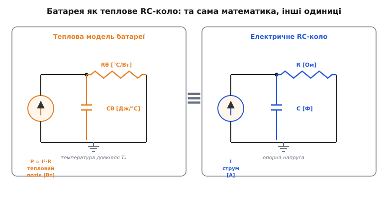
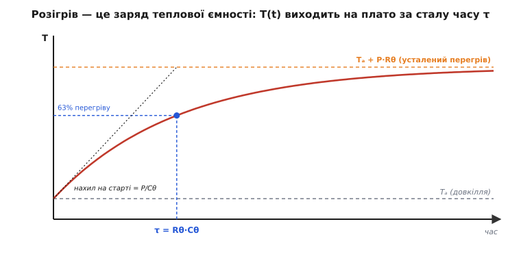
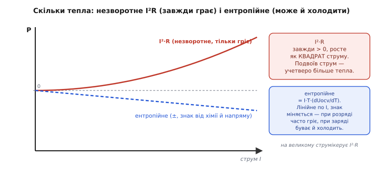

# Теплова модель батарейного пакета

Батарея гріється сама від себе. Не від сонця, не від процесора поруч — а від власного струму, що продирається крізь її внутрішній опір. І це не дрібниця, яку можна знехтувати: та сама температура, яку батарея нагріває, керує тим, як швидко батарея старіє, скільки віддає, і — на межі — чи не піде в некероване займання. Тепло тут не побічний ефект, а учасник кола зворотного зв'язку. Тому перш ніж ставити пакет у корпус, треба вміти передбачити: за такого струму, у такому корпусі, за такого довкілля — до якої температури він дійде і як швидко.

Хороша новина: щоб це передбачити, не треба розв'язувати рівнянь теплофізики в частинних похідних. Для інженерної відповіді «скільки градусів і за який час» вистачає моделі з двох чисел — теплового опору й теплової ємності. Причина, чому їх лише два, і чому вони поводяться *точнісінько* як звичайні резистор із конденсатором, — у тому, що тепло тече за тим самим законом, що й струм.

## Тепло тече, як струм

Уяви батарею, що виділяє потужність `P` ват і хоче позбутися цього тепла — віддати його довкіллю. Тепло не зникає миттєво: воно мусить *протекти* назовні — крізь корпус елемента, крізь повітряний прошарок, крізь стінку пристрою. Кожна така перепона тепловому потоку — це **тепловий опір** (грец. *thérmē* — тепло). Позначають його `Rθ` (тета — грецька «th»), а вимірюють у **градусах на ват**: скільки градусів перегріву коштує кожен протікаючий ват.

Аналогія зі струмом тут не приблизна, а буквальна, і варто побачити чому. Різниця температур `ΔT` жене тепловий потік `P` крізь опір `Rθ` — так само, як різниця напруг `ΔV` жене струм `I` крізь опір `R`. Постав поряд:

```
електрика:   ΔV = I  · R      [В  = А  · Ом]
тепло:       ΔT = P  · Rθ     [°C = Вт · °C/Вт]
```

Це той самий закон [Ома](book:electronics/ohms-law), лише з іншими одиницями. Температура грає роль напруги (те, що штовхає), тепловий потік у ватах — роль струму (те, що тече), а тепловий опір — роль звичайного опору. Наслідок прямий: якщо елемент розсіює `P` ват, а від його осердя до повітря тепловий опір `Rθ`, то в усталеному стані осердя буде гарячіше за повітря рівно на `P·Rθ` градусів. Оце й уся арифметика перегріву.

Але усталений стан настає не одразу. Спершу тепло має *накопичитися* в самій масі елемента — розігріти його метал, електроліт, оболонку. Здатність тіла запасати тепло — це **теплова ємність** `Cθ`, у **джоулях на градус**: скільки енергії треба влити, щоб підняти температуру на один градус. І тут аналогія знову тримається до кінця: теплова ємність поводиться як електричний конденсатор. Заряджати конденсатор — це наливати в нього заряд, піднімаючи напругу; «заряджати» теплову ємність — це наливати тепло, піднімаючи температуру.

> 🔧 **Навіщо це.** Два числа, `Rθ` і `Cθ`, — це весь тепловий паспорт пакета для розробника. `Rθ` каже, наскільки гаряче буде *зрештою* (небезпека довготривалого перегріву й старіння); `Cθ` каже, чи витримає пакет короткий сплеск струму без стрибка температури (велика маса — великий буфер). Знаючи обидва, ти відповідаєш на два різні питання одним колом.



*Батарея — це теплове RC-коло. Джерело потужності заряджає теплову ємність крізь тепловий опір; довкілля грає роль опорного «нуля», до якого все стікає.*

## Розігрів — це заряд теплового конденсатора

Склади ці два елементи разом — і матимеш **теплове RC-коло**. Джерело тепла `P` вливається у вузол; частина йде на розігрів ємності `Cθ`, решта витікає крізь опір `Rθ` до довкілля з температурою `Tₐ` (від *ambient* — навколишнє). Спочатку елемент холодний, різниця температур мала, отже, і витік малий — майже все тепло йде в ємність, температура шпарко росте. Що гарячіше стає, то більший витік, то менше лишається на розігрів — і зростання сповільнюється. Коли витік зрівняється з припливом, температура завмирає: настав усталений перегрів `P·Rθ`.

Це та сама крива, за якою [заряджається конденсатор](book:electronics/rc-time-constant) крізь резистор — плавний вихід на плато, спершу круто, далі все положистіше:

```
T(t) = Tₐ + P·Rθ · (1 − e^(−t/τ)),   де τ = Rθ · Cθ
```

Стала часу `τ` (тау) — добуток теплового опору на теплову ємність, у секундах. Її сенс той самий, що в електричному RC: за час `τ` елемент проходить приблизно **63 %** шляху до кінцевої температури, за `3τ` — уже близько 95 %, а на практиці кажуть, що за `5τ` перегрів устоявся. Велика теплова маса (великий `Cθ`) робить `τ` довгою — пакет реагує повільно, згладжуючи короткі сплески; тонкий елемент прогрівається за секунди.

**Приклад: до якої температури дійде елемент і як швидко.**
Візьмімо циліндричний елемент 18650, що віддає струм навантаженню. Його внутрішній опір `R ≈ 30 мОм`, струм `I = 3 А`, тепловий опір «осердя → повітря» `Rθ ≈ 20 °C/Вт`, теплова ємність `Cθ ≈ 40 Дж/°C`, довкілля `Tₐ = 25 °C`.

```
тепловиділення:   P  = I²·R   = 3² · 0.030   = 0.27 Вт
усталений перегрів: ΔT = P·Rθ   = 0.27 · 20     = 5.4 °C
кінцева температура: T  = 25 + 5.4               ≈ 30.4 °C
стала часу:        τ  = Rθ·Cθ  = 20 · 40        = 800 с ≈ 13 хв
```

Отже, за такого помірного струму елемент нагріється всього на ~5 °C і робитиме це неквапом — плато за ~час порядку години. А тепер підніми струм до `10 А` (агресивний розряд): тепловиділення злітає до `10²·0.030 = 3 Вт`, бо росте як *квадрат* струму, а перегрів — уже `3·20 = 60 °C`, тобто осердя піде під 85 °C. Той самий елемент, той самий корпус — але вчетверо більший струм дав у понад десять разів більший перегрів. Оце квадратична природа `I²R` і є головна пастка теплового розрахунку.



*Розігрів — це заряд теплової ємності. За сталу часу τ пройдено 63 % перегріву; початковий нахил кривої дорівнює P/Cθ — що масивніший елемент, то повільніше він стартує.*

## Звідки береться тепло

У формулі стояло `P = I²·R`, і для більшості інженерних оцінок цього досить: внутрішній опір елемента `R` перетворює струм у тепло, як звичайний резистор. Цей опір — не стала: він росте на холоді, росте зі старінням, залежить від рівня заряду. Скільки саме тепла дасть заданий струм — визначає [C-rate й внутрішній опір](book:electronics/c-rate) елемента; для теплової моделі важливо лише, що `R` — реальне, ненульове число, і що воно множиться на *квадрат* струму.

Але це не вся правда, і чесніше сказати повну. Виявляється, у батареї два джерела тепла, і вони різні за природою. Перше — оте `I²R`: **незворотне** (грец. корінь у слові *entropía* — поворот, розсіяння) тепло тертя. Воно завжди додатне, завжди гріє, і в який бік не жени струм — виділяється однаково. Друге джерело — **зворотне**, або **ентропійне** тепло: сама хімічна реакція в елементі під час заряду чи розряду або поглинає, або віддає тепло, бо перебудова іонів у кристалі змінює впорядкованість (ентропію) речовини. Повний баланс описує рівняння Бернарді:

```
P = I²·R  +  I·T·(dUₒc/dT)
    └─┬─┘     └────┬─────┘
 незворотне   ентропійне (зворотне)
```

Перший доданок росте як квадрат струму; другий — лише лінійно, і його знак залежить від хімії та напряму струму. Через це трапляється контрінтуїтивне: на *малому* струмі під час заряду деякі елементи можуть навіть трохи **холонути** — ентропійний член забирає тепла більше, ніж дає `I²R`. Але щойно струм стає великим, квадратичний `I²R` беззастережно перемагає, і ентропійним членом можна знехтувати. Тому інженерне правило просте: **на робочих струмах рахуй `I²R`, ентропію лиши хімікам** — вона важлива хіба для точної калориметрії й для дуже повільних режимів.



*Незворотне I²R гріє завжди й росте квадратично; ентропійне тепло лінійне по струму й може міняти знак. Праворуч у робочій зоні великих струмів перемагає I²R.*

## Пакет — не один елемент

Досі йшлося про одну комірку. Але апарат живиться **пакетом** — десятками елементів у щільній збірці, і тут проста модель дає збій у важливий бік. Кожен елемент гріє сусідів, а віддати тепло назовні може лише той, хто стоїть скраю. Елемент у *центрі* збірки оточений такими самими гарячими сусідами — йому нікуди зливати надлишок, і він стає найгарячішою точкою пакета. Кутовий елемент має два вільні боки й лишається найхолоднішим. Тому пакет ніколи не гріється рівномірно: всередині завжди утворюється **температурний градієнт** (лат. *gradiens* — крокуючий), і різниця між центром і краєм може сягати десятків градусів.

Це не косметична проблема. Гарячіші елементи старіють швидше й втрачають ємність — а в послідовній збірці всі елементи мусять пропускати однаковий струм, тож найслабший (найгарячіший) визначає ресурс усього пакета. Через рік центральні елементи «просядуть», збірка розбалансується, і [система керування батареєю (BMS)](book:electronics/bms) муситиме обрізати ємність за найгіршим. Ось чому теплова рівномірність пакета — не примха, а пряма економія його життя.

Є й гостріший бік. Тепло розганяє батарею через **позитивний зворотний зв'язок**, і саме він робить тепловий розрахунок питанням безпеки. Ланцюжок такий: температура зросла → хімічні реакції й струми втрат ідуть жвавіше → виділяється ще більше тепла → температура зростає ще → і по колу. Швидкість побічних реакцій росте з температурою за законом Арреніуса — грубим, але корисним правилом «на кожні ~10 °C реакція приблизно вдвічі швидша» (це орієнтир, не точний закон: справжня залежність експоненційна, а множник змінюється з температурою). Поки тепловідведення встигає забирати надлишок, петля стабільна й температура завмирає. Але якщо тепловиділення почне рости швидше, ніж встигає витікати крізь `Rθ`, — рівновага зривається, і починається **тепловий розгін**.


*У пакеті найгарячіша комірка — внутрішня, бо їй нікуди зливати тепло. А нагрів сам себе підганяє: доки тепловідведення встигає, петля стабільна; коли ні — розгін.*

## Коли петля зривається: тепловий розгін

**Тепловий розгін** (англ. *thermal runaway*) — це стан, коли елемент виділяє тепла більше, ніж фізично здатен віддати, і температура летить угору без зупину. Для літій-іонного елемента шлях приблизно такий. Перше самонагрівання починається, коли захисна плівка на аноді (SEI — solid electrolyte interphase, твердий електролітний прошарок) починає розкладатися — для поширених хімій це десь **80–120 °C** (у стійкіших елементів на основі літій-залізо-фосфату — вище, близько 150 °C; цифри залежать від хімії й розміру елемента). Далі процес прискорюється сам: розклад електроліту, коротке замикання через прогорілий сепаратор, лавинне виділення газів — і температура стрибає до сотень градусів за секунди. Пакет може зайнятися.

Практичний висновок для розробника рівно один, і він випливає з усього попереднього. Тепловий розгін — це наша RC-модель, у якої `Rθ` **завеликий** (тепло не встигає витікати) або тепловиділення `P` **зависоке** (надто великий струм), тож петля зворотного зв'язку з від'ємної стала додатною. Звідси три важелі, якими інженер тримає пакет у безпеці:

- **Зменшити `P`** — обмежити струм заряду й розряду. Це робота [BMS](book:electronics/bms) і [захисту акумулятора](book:electronics/battery-protection): не пускати струм, за якого `I²R` дає небезпечний перегрів.
- **Зменшити `Rθ`** — покращити тепловідведення: радіатор, тепловідвідні прокладки між елементами, простір для повітря, у великих пакетах — рідинне охолодження. Що менший `Rθ`, то нижчий перегрів за той самий струм.
- **Спитати температуру** — поставити давач (термістор) у найгарячішу точку пакета й дати BMS відрубати навантаження, щойно температура підповзе до межі.

Ось як виглядає остання лінія оборони у прошивці — проста перевірка, що читає температуру пакета й розмикає силовий ключ, коли гаряче:

:::tabs
```cpp
// Аварійне відсічення пакета за температурою.
// Виклик — з періодичного таска BMS (напр. 10 разів на секунду).
constexpr float T_WARN_C   = 45.0f;   // попередження: підрізати струм
constexpr float T_CUTOFF_C = 60.0f;   // відсічення: розімкнути силовий ключ

void battery_thermal_guard(float t_pack_c)
{
    if (t_pack_c >= T_CUTOFF_C) {
        pack_fet_open();          // розімкнути навантаження — приплив тепла в нуль
        fault_latch(FAULT_OVERTEMP);
    } else if (t_pack_c >= T_WARN_C) {
        charge_current_limit(0);  // припинити заряд
        discharge_derate();       // урізати дозволений струм розряду
    }
}
```
```python
# Аварійне відсічення пакета за температурою.
# Виклик — з періодичного таска BMS (напр. 10 разів на секунду).
T_WARN_C = 45.0      # попередження: підрізати струм
T_CUTOFF_C = 60.0    # відсічення: розімкнути силовий ключ


def battery_thermal_guard(t_pack_c):
    if t_pack_c >= T_CUTOFF_C:
        pack_fet_open()            # розімкнути навантаження — приплив тепла в нуль
        fault_latch(FAULT_OVERTEMP)
    elif t_pack_c >= T_WARN_C:
        charge_current_limit(0)    # припинити заряд
        discharge_derate()         # урізати дозволений струм розряду
```
```micropython
# Аварійне відсічення пакета за температурою.
# Виклик — з періодичного таска BMS (напр. 10 разів на секунду).
T_WARN_C = const(45)      # попередження: підрізати струм (°C)
T_CUTOFF_C = const(60)    # відсічення: розімкнути силовий ключ (°C)


def battery_thermal_guard(t_pack_c):
    if t_pack_c >= T_CUTOFF_C:
        pack_fet_open()            # розімкнути навантаження — приплив тепла в нуль
        fault_latch(FAULT_OVERTEMP)
    elif t_pack_c >= T_WARN_C:
        charge_current_limit(0)    # припинити заряд
        discharge_derate()         # урізати дозволений струм розряду
```
:::

Логіка спирається на модель напряму: розімкнути ключ означає обнулити `P` — джерело тепла в нашому RC-колі зникає, ємність `Cθ` перестає «заряджатися», і температура за сталу часу `τ` плавно сповзає назад до довкілля. Ми не боремося з фізикою — ми прибираємо приплив тепла й даємо тепловому конденсатору розрядитися крізь `Rθ`.

> 🔧 **Навіщо це.** Поріг відсічення `T_CUTOFF_C` ставлять із **запасом** нижче за температуру самонагрівання (60 °C проти ~90 °C — це не перестраховка, а необхідний зазор): щойно почалося самонагрівання, реагувати вже пізно — петля стала додатною. BMS мусить зупинити струм *задовго* до цієї межі, поки тепловідведення ще перемагає тепловиділення. Уся теплова модель існує, щоб цей поріг вибрати правильно, а не навмання.

## Що з цього лишається в руках

Зведімо нитку. Батарея гріє себе сама, і робить це за законами звичайного RC-кола: тепловий опір `Rθ` задає *кінцевий* перегрів `P·Rθ`, теплова ємність `Cθ` разом із опором задає *швидкість* виходу на нього через сталу часу `τ = Rθ·Cθ`. Головне джерело тепла — незворотне `I²R`, що росте як квадрат струму, тому подвоєння струму — це вчетверо більше тепла. У пакеті внутрішні елементи гарячіші за крайні, і температура сама себе підганяє через позитивний зв'язок; коли тепловідведення програє тепловиділенню, петля зривається в тепловий розгін. Тримають пакет у безпеці три важелі — обмежити струм (`P`), покращити відведення (`Rθ`) і слухати температуру давачем, — і кожен із них прямо читається з тих самих двох чисел, з яких почалася модель.

---

*Статус фактів: аналогія «тепло ↔ електрика» та формула RC-перехідного процесу — усталена фізика. Двочленне рівняння тепловиділення (незворотне `I²R` + ентропійне `I·T·dUₒc/dT`) — рівняння Бернарді, загальновживане в моделюванні літій-іонних елементів. Температури самонагрівання (~80–120 °C для типових хімій, вище для LFP) узгоджуються з експериментальними даними (напр. дослідження групи Фена для елементів 18650). Правило «×2 на 10 °C» — грубий орієнтир, а не точний закон: справжня температурна залежність швидкості реакцій — арреніусівська (експоненційна), і множник Q₁₀ не сталий.*
