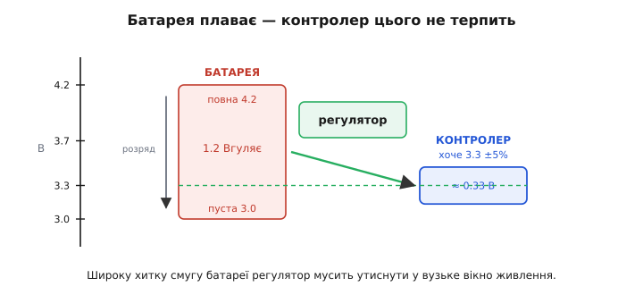
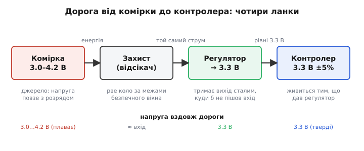
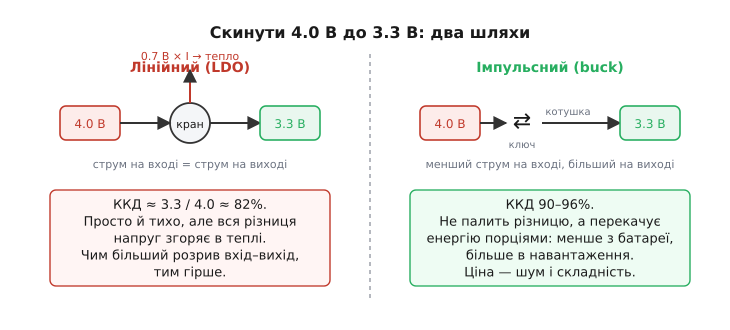

# Батарея до контролера: як довести живлення до мозку пристрою

Здається, що немає простішого: є літієва комірка на 3.7 В, є мікроконтролер, що теж хоче десь 3.3 В, — з'єднай два дроти й працюй. Спокуса велика, і саме на ній горить безліч перших саморобних плат. Бо між «є напруга» і «контролер живе стабільно» лежить прірва, яку видно, лише коли придивишся до цифр: **батарея не тримає свою напругу**. Свіжозаряджена комірка видає 4.2 В, розряджена сповзає до 3.0 В, а під різким навантаженням просідає ще нижче — і все це поки контролер вимагає рівно 3.3 В із точністю відсотків. Пряме з'єднання означає, що процесор бачить напругу, яка гуляє на понад вольт, і рано чи пізно або перевищить свою межу, або впаде нижче порога роботи й перезавантажиться посеред справи.

Тому «підвести живлення до контролера» — це насправді маленька система з кількох ланок, кожна з якої розв'язує свою частину задачі: узяти хитку напругу джерела й **перетворити її на тверду, передбачувану шину**, якою вже можна годувати цифрову логіку. Розберімо цю дорогу від початку до кінця — навіщо кожна ланка, що станеться, як її викинути, і як усе це виглядає в реальній прошивці.

### Чому не можна просто з'єднати дроти

Корінь усього — фізика комірки. Літій-іонний елемент — це не ідеальне джерело напруги, а хімічна система, чия напруга на клемах прямо каже, скільки в ній лишилось заряду. Повна — близько **4.2 В**, порожня (далі розряджати небезпечно) — близько **3.0 В**; посередині «умовно-номінальні» 3.7 В, які пишуть на наклейці. Ці числа усталені й однакові для звичайної літій-кобальтової хімії: номінал беруть як середину шляху від 4.20 В до 3.0 В під помірним навантаженням. Тобто впродовж одного розряду напруга джерела законно проходить **увесь діапазон 3.0–4.2 В** — це не збій, а нормальна поведінка.

Тепер порівняймо з апетитом контролера. Типовий мікроконтролер живиться від шини 3.3 В і терпить хіба що ±5–10% навколо неї — приблизно від 3.0 до 3.6 В. Вийди за верхню межу — ризикуєш пробити входи й ядро; провались під нижню — спрацює [схема захисту від зниженої напруги](book:electronics/uvlo), і чип перезавантажиться. Наклади один діапазон на інший, і проблема стає очевидною: **широка хитка смуга батареї мусить якось поміститися у вузьке вікно живлення**.


*Батарея впродовж розряду законно проходить увесь діапазон 3.0–4.2 В — понад вольт гуляння. Контролер натомість терпить лише вузьке вікно навколо 3.3 В (тут ±5% — близько третини вольта). Завдання всієї схеми живлення — узяти широку хитку смугу джерела й утиснути її в цю тонку щілину. Пунктир 3.3 В — рівень, який регулятор має тримати незалежно від того, повна батарея чи майже сіла.*

І це ще не враховує **[просадку під навантаженням](book:electronics/battery-sag)**: у комірки є внутрішній опір, тож щойно пристрій смикне великий струм — увімкнув радіо, крутнув мотор — напруга на клемах миттєво провалюється на десяті вольта, а то й на цілий вольт у зношеної батареї. Пряме з'єднання пропускає цей провал просто на живлення процесора. Ось чому «два дроти» не працюють: між джерелом і мозком пристрою потрібен посередник, який ізолює контролер від капризів батареї.

> 🔧 **Навіщо це.** Перш ніж проєктувати живлення, завжди клади поруч два числа: **діапазон напруги джерела** (для одинарної Li-ion це 3.0–4.2 В плюс просадка вниз) і **вікно, яке терпить споживач** (для 3.3-вольтового MCU — десь 3.0–3.6 В). Якщо смуги не збігаються — а вони майже ніколи не збігаються, — між ними обов'язково стоїть регулятор. Це найперше рішення в будь-якій платі на батареї.

### Чотири ланки дороги

Повна дорога від комірки до контролера — це ланцюг із чотирьох ланок, кожна зі своєю роллю. Пройдімо його зліва направо.


*Чотири ланки живлення. Комірка — джерело, чия напруга плаває з розрядом. Захист розриває коло, тільки-но напруга чи струм вийдуть за безпечне вікно. Регулятор — серце: він тримає вихід сталим, куди б не поповз вхід. Контролер живиться вже готовими твердими 3.3 В. Уздовж дороги напруга з хиткої (3.0–4.2 В) стає незмінною (3.3 В).*

**Комірка** — джерело. Її ми вже розібрали: дає енергію, але напругою, що повзе з розрядом.

**Захист** — сторож. Це вузол, який **розриває коло**, щойно щось виходить за безпечні межі: напруга комірки впала надто низько (глибокий розряд убиває літій), піднялася надто високо (перезаряд — шлях до займання), струм зашкалив (коротке замикання), елемент перегрівся. У готових акумуляторах цей вузол — окрема мікросхема захисту з польовими ключами, часто разом із функціями обліку заряду; у складніших пакетах з кількох комірок його роль бере на себе повноцінна [система керування батареєю (BMS)](book:electronics/bms). Головне тут: захист **нічого не перетворює** — він або пропускає струм як є, або відсікає геть. Без нього одне коротке замикання перетворює літієву комірку на факел.

**Регулятор** — серце всієї схеми. Саме він розв'язує головну задачу: бере хитку вхідну напругу й **тримає на виході стале значення**, скажімо, тверді 3.3 В, незалежно від того, повна батарея чи майже сіла, тихий пристрій чи смикає струм ривками. Як він це робить — розберемо далі, бо тут два принципово різні підходи. Але роль однозначна: усе гуляння джерела спиняється тут, а далі йде рівна шина.

**Контролер** — споживач. Йому дістається вже готова тверда напруга, і він може спокійно рахувати, не звертаючи уваги, що там коїться з батареєю. Замкнув коло — і живлення дороги вибудуване.

Зверни увагу на важливу річ: **струм тече крізь усі ланки той самий** (це ж послідовне коло), а от **напруга змінюється лише на регуляторі**. Захист напругу не чіпає — на ньому падає хіба кілька десятих вольта на опорі відкритих ключів. Уся робота з приведення напруги до потрібної живе в одній ланці, і саме її обирають найприскіпливіше.

### Регулятор: два способи скинути напругу

Коли батарея дає 4.0 В, а треба 3.3 В, регулятор мусить кудись подіти зайві 0.7 В. Є рівно два способи це зробити, і різниця між ними — це різниця між платою, що працює тиждень від заряду, і платою, що сідає за день.


*Два способи скинути 4.0 В до 3.3 В. Лінійний регулятор працює як кран: душить надлишок, а всю різницю напруг помножену на струм спалює в теплі — струм на вході дорівнює струмові на виході, тож зайва потужність гріє чип. Імпульсний нічого не палить: ключ із котушкою перекачують енергію порціями, беручи з батареї менший струм і віддаючи в навантаження більший. Ціна ефективності — шум і складніша схема.*

**Лінійний регулятор** (його низьковольтний різновид — [LDO](book:electronics/ldo)) працює як розумний кран. Усередині сидить [операційний підсилювач у контурі зворотного зв'язку](book:electronics/error-amplifier): він порівнює вихід із внутрішнім [опорним джерелом](book:electronics/voltage-reference-sources) і плавно прочиняє чи прикриває прохідний транзистор, щоб на виході трималося рівно 3.3 В. Куди дівається зайва напруга? У тепло. Струм крізь лінійний регулятор на вході й на виході **однаковий**, тож надлишок напруги, помножений на цей струм, згоряє прямо на кристалі:

```
P_тепла = (U_вхід − U_вихід) × I_навантаження
ККД     = U_вихід / U_вхід
```

**Приклад — LDO живить контролер від Li-ion.** Хай батарея дає 4.0 В, контролер бере 100 мА при 3.3 В.

```
P_тепла = (4.0 − 3.3) × 0.1 = 0.7 × 0.1 = 0.07 Вт
ККД     = 3.3 / 4.0 ≈ 0.82 = 82%
```

Вісімнадцять відсотків енергії батареї просто гріють плату. Поки різниця напруг мала, це стерпно; але спробуй тим самим LDO зробити 3.3 В із 12-вольтового джерела — і ти викинеш у тепло понад дві третини всієї енергії. Лінійний регулятор гарний, коли вхід **лише трохи вищий** за вихід: він простий, дешевий, тихий (не смітить у радіоефір) і чудово ловить дрібні коливання. Саме тому для «батарея 3.7 В → контролер 3.3 В» LDO — частий і цілком розумний вибір.

**Імпульсний регулятор** ([знижувальний, buck](book:electronics/buck)) грає інакше: він **нічого не палить, а перекачує енергію порціями**. Швидкий ключ вмикається й вимикається десятки-сотні тисяч разів на секунду, качаючи струм у котушку індуктивності, а та згладжує ці поштовхи в рівну напругу. Хитрість у тому, що така схема бере з батареї **менший струм**, ніж віддає в навантаження (адже напруга падає — значить, за законом збереження енергії струм росте). Тому ККД сягає 90–96%: майже вся енергія доходить до контролера, а не гріє повітря. Ціна — складніша схема (потрібні котушка, ключ, контролер) і **[шум перемикання](book:electronics/switching-noise)**, який доводиться фільтрувати, щоб він не поліз у чутливу аналогову частину.

> 🔧 **Навіщо це.** Правило вибору просте. Різниця вхід–вихід **мала** (Li-ion → 3.3 В) і струми **невеликі** — бери LDO: він простіший і не смітить. Різниця **велика** (12 В → 3.3 В, або треба підняти напругу вгору) чи струми **великі** — бери імпульсний, бо лінійний тут спалить недопустимо багато й перегріється. Проміжний випадок часто розв'язують у два поверхи: спершу імпульсний скидає з високого до, скажімо, 3.6 В (ефективно), а потім маленький LDO дочищає до тихих 3.3 В (без шуму).

### Тихий вампір: струм спокою

Є ще одна цифра, що для пристрою на батареї важить не менше за ККД під навантаженням, — **струм спокою** (англ. *quiescent current*, часто пишуть Iq). Це струм, який регулятор споживає **на самого себе**, просто щоб працювати, навіть коли контролер спить і майже нічого не бере. Його внутрішній опорний вузол, підсилювач, схема захисту — усе це хоче трохи струму цілодобово.

Чому це критично? Бо пристрій на батареї більшість часу **спить**. Датчик, що прокидається раз на хвилину виміряти температуру й знову засинає, у сплячці бере одиниці мікроампер. Якщо регулятор при цьому сам тягне 50 мкА, то саме він, а не корисна робота, висмокче батарею. Порахуймо на пальцях.

**Приклад — хто вбиває батарею у сплячому датчику.** Комірка 2000 мА·год, контролер у сплячці бере 5 мкА. Порівняймо два регулятори: «жадібний» з Iq = 50 мкА і «ощадний» з Iq = 1 мкА.

```
З жадібним:  I_разом = 5 + 50 = 55 мкА → 2000 мА·год / 0.055 мА ≈ 36 000 год ≈ 4.1 року
З ощадним:   I_разом = 5 + 1  =  6 мкА → 2000 мА·год / 0.006 мА ≈ 333 000 год ≈ 38 років
```

(На практиці стільки не протримає саморозряд самої комірки, але порядок різниці промовистий.) Регулятор зі струмом спокою 50 мкА скорочує строк життя на батареї майже вдесятеро — і винен у цьому вузол, який мав би просто «стояти й тримати напругу». Ось чому в специфікаціях мікросхем живлення для автономних пристроїв Iq виносять на перше місце: сучасні LDO для такого хваляться струмом спокою в частки мікроампера.

> 🔧 **Навіщо це.** Для пристрою, що переважно спить, дивись **дві** цифри регулятора: ККД під навантаженням (для активних сплесків) і струм спокою Iq (для сплячки — а її 99% часу). Ощадний Iq часто важить більше: якщо пристрій прокидається на секунду раз на годину, доля батареї вирішується тим, скільки жере схема решту 3599 секунд. І не забувай, що сам контролер у сплячці теж має брати мікроампери, інакше найкращий регулятор не врятує.

### Захист — не дрібниця, а страховка від пожежі

Повернімося до ланки, яку легко списати як необов'язкову, — до захисту. Спокуса його викинути велика: працює ж і без нього. Небезпека в тому, що літій прощає недбалість рівно до першої аварії, а тоді карає жорстоко.

Три сценарії, від яких стереже ця ланка, варто знати напам'ять. **Глибокий розряд**: якщо тягти струм із комірки нижче ~2.5 В, у ній починаються незворотні хімічні зміни — вона деградує, а спроба потім зарядити таку «переразряджену» банку може закінчитися внутрішнім коротким і займанням. **Перезаряд**: заганяти напругу вище 4.2 В — це осаджувати металевий літій на електроді, ростити провідні містки-дендрити, які колять сепаратор і ведуть до теплового розгону. **Надструм і коротке замикання**: літієва комірка здатна віддати десятки ампер у коротке — досить, щоб дроти розжарилися, а сама банка спалахнула. Захисна ланка стереже всі три межі й **розриває коло**, перш ніж станеться непоправне.

Саме тому в будь-якому серйозному літієвому живленні захист — не опція, а обов'язкова ланка. У простих пристроях на одну комірку його дає крихітна [мікросхема захисту акумулятора](book:electronics/battery-protection) з парою польових ключів; там, де комірок кілька й вони з'єднані послідовно, потрібна ще й [балансування](book:electronics/battery-balancing) — вирівнювання заряду між ними, — і всім цим керує [BMS](book:electronics/bms). Ланка захисту нічого не перетворює й у нормальному режимі просто пропускає струм — але саме вона стоїть між справним пристроєм і новиною про пожежу від саморобки.

> 🔧 **Навіщо це.** Ніколи не проєктуй живлення від літію без ланки захисту — навіть у прототипі. Мінімум: захист від переряду, перезаряду й короткого. Якщо береш готовий акумулятор «із платкою» — переконайся, що ця платка справді є (буває, дешеві комірки продають голими). А зайшла мова про кілька комірок послідовно — одразу закладай BMS із балансуванням, бо без нього одна відстала банка з часом виходить за межу перша й тягне весь пакет.

### Уся дорога разом

Зберімо картину. Пристрій на літієвій батареї живить свій контролер не «двома дротами», а короткою системою: **комірка** дає енергію хиткою напругою 3.0–4.2 В; **захист** стереже безпечні межі й рве коло за аварії, нічого не перетворюючи; **регулятор** — серце — утискає широку смугу джерела у вузьке вікно живлення, або спалюючи надлишок у теплі (лінійний, коли вхід трохи вищий за вихід), або перекачуючи енергію порціями (імпульсний, коли різниця велика чи струми великі); **контролер** нарешті дістає рівні, передбачувані 3.3 В і працює, не помічаючи капризів батареї. А над усім цим висить струм спокою — тихий вампір, що вирішує долю пристрою в сплячці.

Ця сама логіка масштабується від крихітного датчика до складної плати: там регуляторів може бути кілька — свій для цифрового ядра, свій для аналогової частини, свій для радіо, — і вмикають їх у [певній черговості](book:electronics/power-sequencing), щоб чутливі вузли не отримали живлення раніше за ті, від яких залежать. Але кістяк незмінний: між джерелом, чия напруга живе своїм життям, і мозком, що вимагає сталості, завжди стоїть ланка, яка перетворює хаос батареї на порядок шини живлення.

І остання, суто програмна ланка захисту, що лежить уже в самому контролері: він мусить **знати, коли батарея сідає, і гідно завершити роботу**, а не впасти посеред запису в пам'ять. Як побудувати таке стеження за напругою й безпечне вимкнення у прошивці — окрема практична [задача з детектором зниженої напруги (brown-out) та контролем заряду](book:electronics/battery-to-controller/proj-brownout-monitor.md): від калібрування вбудованого АЦП до чистого закриття файлів перед тим, як живлення зникне.

> 📜 Ідея зібрати «джерело опорної напруги плюс підсилювач плюс прохідний транзистор» в один компактний вузол-регулятор пройшла довгий шлях. Її кульмінацією став [монолітний три-вивідний регулятор — увесь стабілізатор у корпусі звичайного транзистора](book:electronics/battery-to-controller/hist-three-terminal-regulator.md), що зробив стале живлення дешевим і буденним. Раніше кожну плату доводилося обвішувати розсипом деталей; поява регулятора «на три ноги» перетворила приведення напруги на одну мікросхему, яку ставлять не думаючи.
