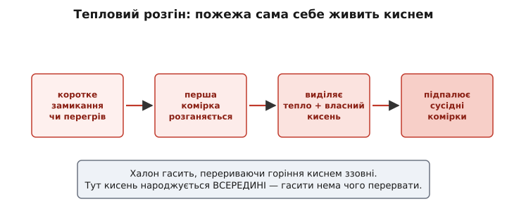
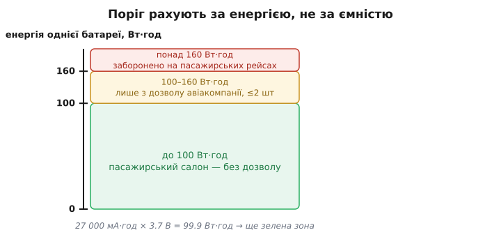
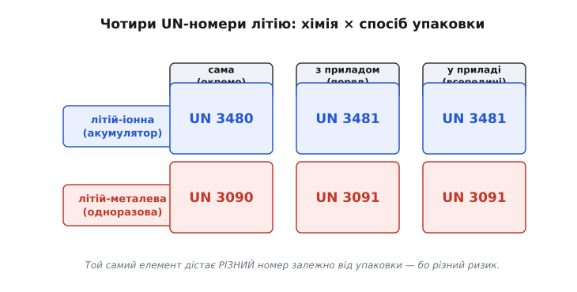

# Норми перевезення літієвих батарей

Ви спаяли пристрій, поставили в нього літієвий акумулятор і хочете відправити його поштою чи літаком клієнту. Раптом виявляється, що коробку не приймають без окремого маркування, декларації й обмежень на заряд. Спершу це дратує — це ж просто батарейка. Але за цими правилами стоїть цілком конкретна фізика: літієвий елемент носить у собі стільки запасеної енергії й такий реактивний хімічний набір, що за певних збоїв він займається сам, без зовнішнього вогню, і горить так, що звичайні засоби пожежогасіння в літаку його не гасять. Норми перевезення — це не бюрократія заради бюрократії, а спроба тримати цю енергію під контролем, поки батарея їде поряд із сотнями людей на висоті одинадцять кілометрів.

Розберімо, звідки саме береться небезпека, за яким числом усе ділиться на «можна» й «не можна», і як влаштована система маркувань, з якою ви зіткнетеся щоразу, коли відправлятимете щось із літієвим живленням.

## Чому саме літій вимагає окремих правил

Звичайна лужна батарейка теж має енергію, але коли її замкнути, вона просто розігріється й розрядиться. Літієвий елемент влаштований інакше — і небезпека тут не в одній причині, а в збігу трьох.

По-перше, **питома енергія**. Літій — найлегший метал і найактивніший у ряду, тож на кожен грам ваги він запасає більше енергії, ніж будь-яка масова хімія. Саме тому він усюди: телефон, дрон, електроінструмент. Але та сама щільна енергія, що дає вам довгу автономність, за аварії вивільняється так само щільно й швидко.

По-друге, **пальний електроліт**. Щоб іони літію бігали між електродами, їх занурюють у органічний розчинник — по суті, легкозаймисту рідину. Нагрійте елемент — і всередині вже є пальне.

По-третє, і це головне, **тепловий розгін** (англ. thermal runaway — «розгін наввипередки»). Це ланцюгова реакція, де тепло саме себе підживлює. Достатньо однієї комірки перегрітися — від короткого замикання, проколу, заводського дефекту чи перезаряду — і починається саморозкладання її хімії. Розклад виділяє тепло; тепло пришвидшує розклад; розклад іде швидше й гріє ще дужче. Гірше того: розкладаючись, катод віддає **власний кисень**. Пожежа перестає залежати від повітря — вона несе окисник у собі. А розжарена комірка гріє сусідні, ті теж переходять межу, і фронт біжить пакетом.



*Тепловий розгін живить сам себе: комірка виділяє тепло й окисник усередині, тож перервати горіння ззовні нема як.*

Тепер стає зрозуміло, чому літій — окремий випадок саме в літаку. Вантажні трюми давно гасять **халоном** (галогенованим вуглеводнем): він хімічно перериває горіння, зв'язуючи вільні радикали й відрізаючи полум'я від кисню. Проти паперу, тканини, пластику це працює — палива без повітря немає. Але літієва пожежа сама генерує кисень зсередини комірки, тож халону нема чого «перерізати»: він гасить полум'я на поверхні, а розжарені комірки під ним живляться власним окисником і за секунди спалахують знову. Пілоти лишаються з вогнищем, яке система на борту не бере.

Що це означало на практиці — показала одна катастрофа, після якої правила стали жорсткими.

## Урок, що переписав правила: рейс UPS 6

3 вересня 2010 року вантажний Boeing 747-400F компанії UPS (рейс 6) вилетів з Дубая на Кельн. Менш ніж за пів години після зльоту в головному вантажному відсіку почалася пожежа. Її пов'язали з **незадекларованими** літій-іонними батареями на палетах, завантажених у Гонконгу. Густий дим за лічені хвилини заповнив кабіну, вивів з ладу критичні системи, і екіпаж — двоє людей — утратив контроль над літаком, який розбився поблизу аеропорту. Штатна халонова система відсіку не спинила літієве вогнище. *(Статус: усталений факт — офіційний звіт розслідування GCAA ОАЕ.)*

Ключове слово тут — **незадекларовані**. Ніхто не знав, що на борту тонни енергоємних елементів; їх завантажили як звичайний вантаж. Тому наступні норми били одразу в двох напрямках: по-перше, **знизити ймовірність** розгону (обмежити заряд і кількість елементів у пакеті), а по-друге — **зробити небезпеку видимою** (обов'язкове маркування й декларація), щоб і вантажник, і екіпаж знали, що везуть, і могли ізолювати вантаж.

Рейс UPS 6 — не поодинокий випадок, а найгучніша точка в довгому ряду: [хроніка літієвих інцидентів у повітрі](topic:electronics/battery-transport-regs/hist-airborne-incidents.md) тягнеться від ранніх пожеж вантажних бортів до тривожної статистики останніх років — за даними авіаційних наглядачів, десятки перевірених випадків задимлення чи займання батарей на борту щороку, і крива не спадає. Саме ця статистика штовхає правила ставати жорсткішими рік за роком.

> 🔧 **Навіщо це.** Коли ви як розробник відправляєте прототип з акумулятором, спокуса «не морочитися з паперами» пряма. Але саме недекларована батарея — сценарій рейсу UPS 6. Правильне маркування коробки — це не про штраф, а про те, щоб у разі задимлення на борту вантаж упізнали й прибрали, а не шукали джерело диму наосліп.

## Головне число: ват-година, а не міліампер-година

Уся система обмежень крутиться довкола **енергії** окремого елемента чи батареї. І тут перша й найпоширеніша помилка розробника — дивитися на ємність у міліампер-годинах (мА·год), як написано на банку живлення. Ємність — це не енергія. Небезпека пожежі залежить від того, **скільки джоулів** запасено, а не скільки кулонів заряду.

Енергію дає добуток заряду на напругу:

```
E (Вт·год) = ємність (А·год) × номінальна напруга (В)
```

Або одразу з міліампер-годин:

```
E (Вт·год) = мА·год × номінальна напруга (В) ÷ 1000
```

Тонкість, на якій спотикаються: для розрахунку беруть **номінальну напругу елемента** (для літій-іонної хімії це близько 3.6–3.7 В), а не 5 В, які видає USB-порт банку живлення. Всередині банку сидять елементи по 3.7 В; перетворювач лише піднімає їх до 5 В на виході. Рахувати треба за тим, що всередині.

**Умова: банк живлення 27 000 мА·год, маркування «5 V / 3.7 V».**
```
E = 27000 × 3.7 ÷ 1000
E = 99.9 Вт·год
```
Висновок: 99.9 Вт·год — це трохи менше за 100. Не випадково: виробник підібрав ємність так, щоб влізти під поріг 100 Вт·год і дозволити пасажирам возити банк у салоні. Порахуй хтось за 5 В — вийшло б 135 Вт·год, і банк начебто «не проходить»; але це була б неправильна арифметика.

Тепер — самі пороги. Для **пасажира**, що везе пристрій чи запасний акумулятор у ручній поклажі, енергія ділить світ на три зони:



*Поріг рахують за запасеною енергією: до 100 Вт·год — вільно, 100–160 — з дозволу, понад 160 — заборона на пасажирських бортах.*

- **До 100 Вт·год** — вільно в ручній поклажі, без окремого дозволу авіакомпанії. Сюди потрапляє майже вся споживча електроніка: телефони, ноутбуки, більшість банків живлення.
- **Від 100 до 160 Вт·год** — можна, але **з дозволу авіакомпанії** й зазвичай **не більше двох** запасних батарей на пасажира. Це зона великих ноутбуків, професійних камер, деяких електроінструментів.
- **Понад 160 Вт·год** — на пасажирських рейсах **заборонено**. Такі батареї (тягові акумулятори, великі енергостанції) їдуть лише як спеціально оформлений вантаж на вантажних бортах.

Запасні елементи возять **тільки в салоні**, ніколи в багажі, який здають у трюм: у салоні задимлення видно й дістати вогнегасник можна, у герметичному трюмі — ні. І клеми запасних елементів мають бути захищені від замикання — заклеєні чи в окремому пакеті, — бо ключі в тій самій кишені легко кинуть коротке через два контакти.

Для **вантажу** (коли ви відправляєте партію, а не летите самі) поріг інший і хімія рахується окремо. Для літій-**металевих** одноразових елементів межу проводять не за ват-годинами, а за **вмістом літію**: приблизно 1 г на комірку і 2 г на батарею — вище цих чисел вантаж переходить у «повністю регульований» режим з усіма паперами.

## Шість номерів: як вантаж називають однозначно

Щоб і відправник, і перевізник, і рятувальник говорили про той самий вантаж без різночитань, кожен тип небезпечного вантажу має свій **UN-номер** — чотиризначний код зі списку ООН. Літій — це **клас небезпеки 9** (інші-різні небезпечні речовини; літій не отруйний і не їдкий, тож не лягає в «горючі» чи «токсичні» класи, але й безпечним не є). А всередині класу 9 літій ділять на чотири номери за двома ознаками: **хімія елемента** й **спосіб упаковки**.



*Той самий елемент дістає різний UN-номер залежно від того, їде він сам чи разом із приладом — бо різний ризик замикання.*

Хімія дає першу вилку. **Літій-іонна** (перезаряджувана — телефони, дрони, банки живлення) і **літій-металева** (одноразова — «таблетки» CR2032, деякі батарейки для лічильників і давачів) поводяться в пожежі по-різному, тож і номери різні.

Спосіб упаковки дає другу. Батарея їде **сама** (окремо, коробкою) чи **разом із приладом** — усередині нього або поряд у пакованні. Логіка проста: гола батарея наодинці — найризикованіша, бо її клеми відкриті й нема корпусу пристрою, що б їх боронив; батарея, вставлена в прилад, уже частково захищена його конструкцією.

Звідси чотири основні номери:

```
                 сама        з приладом / у приладі
літій-іонна    UN 3480            UN 3481
літій-металева UN 3090            UN 3091
```

Ці чотири — база, з якою ви зіткнетеся найчастіше. Є й свіжіші номери для окремих випадків: цілі **транспортні засоби** на літієвому живленні (електросамокати, електровелосипеди) відтепер їдуть під **UN 3556** (літій-іонні) чи **UN 3557** (літій-металеві), а не під старим загальним «транспортний засіб». *(Статус: усталено — зміна набула чинності 2025 року.)* А для новішої **натрій-іонної** хімії завели свої номери (UN 3551 / UN 3552) — знак, що система розширюється разом із технологіями. Але скелет лишається той самий: хімія плюс упаковка дають номер.

Особливий випадок — **UN 3480**, гола літій-іонна батарея сама по собі. Її як вантаж на **пасажирські** літаки не беруть взагалі: занадто ризиковано везти ящик відкритих елементів там, де люди. Тільки вантажні борти, з наліпкою «лише вантажним літаком» (Cargo Aircraft Only). *(Статус: усталено — заборона діє з 2016 року.)*

## Правило заряду: 30 % — і чому саме стільки

Найцікавіше обмеження — не на кількість, а на **стан заряду** (англ. state of charge, SoC — «наскільки заповнено»). З 1 квітня 2016 року голі літій-іонні елементи (UN 3480) для авіаперевезення можна пропонувати зарядженими **не більш ніж на 30 %** проєктної ємності. Спершу дивно: батарея ж однакова, чи заряджена, чи ні?

Насправді ні. Тепловий розгін живиться енергією, запасеною в комірці. Повністю заряджений елемент — це максимум пального й окисника напоготові; катод у зарядженому стані найнестабільніший і найлегше віддає кисень. Розряджений на 70 % елемент, якщо й піде в розгін, зробить це слабше й прохолодніше — менше запасеної енергії, стабільніший катод, повільніша реакція, менший шанс, що займеться сусід. 30 % — це компроміс: достатньо мало, щоб різко збити енергію аварії, але не нуль (глибокий нуль сам шкодить літієвій хімії й старить елемент).

> 🔧 **Навіщо це.** Це правило прямо стосується вашого виробничого процесу. Якщо ви замовляєте акумулятори партією або відправляєте свої вироби з заводу, елементи мають приїхати заряджені десь на третину. На складанні це означає окремий крок: не заряджати виріб «під зав'язку» перед відправкою, а тримати SoC близько 30 %. Порахувати «30 % ємності» ви зможете, якщо вмієте оцінювати [заряд елемента за напругою](topic:electronics/state-of-charge) — але точний перерахунок напруги в SoC для літій-іонної хімії нелінійний і потребує кривої розряду.

Далі правило **розширюється**. Довго воно стосувалося лише голих елементів (UN 3480). З 1 січня 2026 року межу 30 % поширюють і на елементи, що їдуть **з приладом** (UN 3481), — для тих, чия енергія перевищує 2.7 Вт·год на комірку. *(Статус: усталено — набуває чинності з приписаної дати.)* Тенденція очевидна: те, що починалося як виняток для найризикованішого вантажу, поступово стає загальним стандартом, бо кількість інцидентів на бортах не спадає.

## Чому взагалі можна довіряти цим елементам: тест UN 38.3

Пороги, номери й обмеження заряду стримують наслідки аварії. Але є й вхідний бар'єр іншого роду: перш ніж будь-який літієвий елемент узагалі допустять до перевезення, він мусить пройти набір випробувань, відомий за номером розділу в Посібнику ООН — **UN 38.3**. Це вісім тестів, що імітують усі знущання, яких елемент зазнає в дорозі. Сенс не в тому, щоб елемент нічого не відчув, а в тому, щоб після кожного випробування він **не потік, не спалахнув, не розірвався** й не втратив герметичність, а напруга лишилася в межах норми.

Найпоказовіші два — саме «авіаційні»:

- **T1, імітація висоти.** Елемент витримують за низького тиску **11.6 кПа протягом 6 годин** — це тиск у негерметичному вантажному відсіку на висоті близько 15 000 метрів. Перевіряють, чи не роздує й не розгерметизує елемент розрідження назовні.
- **T2, тепловий удар.** Десять циклів різкої зміни температури між **+72 °C і −40 °C** з коротким переходом. Матеріали то розширюються, то стискаються; погана зборка дасть тріщину чи внутрішнє замикання саме тут — як воно й буває в трюмі, що то на сонці, то на висоті в мороз.

Решта шість добивають механікою й електрикою: **T3** — вібрація, **T4** — удар, **T5** — зовнішнє коротке замикання, **T6** — удар/роздавлювання, **T7** — перезаряд, **T8** — примусовий глибокий розряд. Пройти треба **всі вісім** — без цього елемент не має права на міжнародне перевезення, і саме сертифікат UN 38.3 перевізник має підстави вимагати від виробника.

Механізм T5 і T7 вам як розробнику знайомий з іншого боку: від зовнішнього замикання й перезаряду елемент у виробі рятує окрема [схема захисту акумулятора](topic:electronics/battery-protection), і UN 38.3 по суті перевіряє, що елемент переживе відмову цього захисту.

## Що з цього виносить розробник

Складімо картину докупи. Літієва батарея — це щільно запасена енергія в пальному середовищі з хімією, яка за збою підпалює себе сама й несе власний окисник, тож штатні засоби літака її не гасять. Звідси вся будова норм:

- **Рахуйте енергію в ват-годинах**, не в міліампер-годинах, і завжди за номінальною напругою елемента (≈3.7 В), а не за напругою на виході. Три пороги для пасажира — 100 і 160 Вт·год; для одноразового літію вантажем — вміст літію 1 і 2 г.
- **Знайте свій UN-номер**: хімія (іонна / металева) × упаковка (сама / з приладом) дають один із чотирьох базових кодів; ціле пристрій-на-колесах — окремий номер.
- **Заряд під час відправки — близько 30 %**, і ця вимога дедалі ширшає. Закладайте це у виробничий цикл, а не згадуйте на пошті.
- **Робіть небезпеку видимою**: маркування, наліпка з UN-номером, декларація. Незадекларований вантаж — найгірший сценарій, як показав рейс UPS 6.
- **Вимагайте від постачальника елементів сертифікат UN 38.3** — це ваша підстава вважати, що елемент переживе дорогу.

Числа й дати в цих правилах щороку уточнюють — за ними стежать за чинним виданням Технічних інструкцій ІКАО чи ДТ (Правил перевезення небезпечних вантажів ІАТА), що спираються на них. Але фізика, яка їх породжує, не змінюється: та сама щільна енергія, за яку ми любимо літій у своїх пристроях, робить його вантажем, з яким рахуються.
