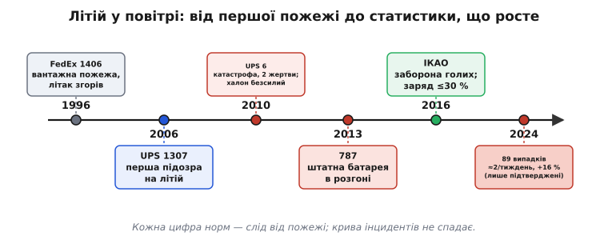

# 📜 Літій у повітрі: хроніка пожеж, що переписали правила

Норми перевезення літію не з'явилися одразу готовими. Кожна цифра в них — поріг ват-годин, вимога 30 % заряду, заборона голих елементів на пасажирських бортах — це слід від конкретної пожежі, конкретного диму в кабіні, конкретного розслідування. Правила не пишуть наперед: їх пишуть після того, як щось згоріло, і найчастіше після того, як хтось загинув. Ця хроніка — про те, як промислова наглядова система крок за кроком усвідомлювала, що звична, знайома батарейка в посилці — це вантаж, здатний убити літак.

Історія тут не лінійна й не героїчна. Немає одного винахідника правил і однієї дати прозріння. Є низка інцидентів, кожен трохи страшніший за попередній, і повільна, часто запізніла реакція регуляторів, які довго не хотіли вірити, що маленька комірка з телефона в кількості вантажної палети поводиться зовсім не так, як одна комірка на столі.



*Кожен твердий пункт норм — слід від конкретної пожежі, а крива інцидентів уперто повзе вгору.*

## Спершу горіли й без літію: чому вантажний трюм узагалі бояться

Щоб зрозуміти, чому саме літій налякав авіацію, треба спершу побачити, чого авіація боялася й до нього. Пожежа у вантажному відсіку в польоті — один із найстрашніших сценаріїв узагалі, бо екіпаж не може ні побачити вогонь, ні дістатися до нього, ні швидко приземлитися. Літак — це герметична труба на висоті, звідки нема куди вийти.

Показовий випадок стався **5 вересня 1996 року** — рейс FedEx Express 1406, вантажний McDonnell Douglas DC-10, летів із Мемфіса до Бостона. Над штатом Нью-Йорк у вантажному відсіку почалася пожежа. Екіпаж встиг здійснити аварійну посадку в Стюарті поблизу Ньюбурга; усі п'ятеро на борту (троє членів екіпажу й двоє пасажирів-супровідників) евакуювалися. А літак після евакуації **згорів дощенту**. Розслідування Національної ради з безпеки на транспорті США (NTSB) завершилося висновком, який тоді звучав буденно, а тепер — тривожно: «пожежа вантажу невстановленого походження». Джерело так і не знайшли. *(Статус: усталений факт — звіт NTSB AAR-98/03.)*

Урок цього випадку простий і страшний: навіть коли пощастило й люди вижили, вантажна пожежа знищує літак повністю за лічені десятки хвилин. І якщо джерело — щось, що завантажили як «звичайний вантаж», ти навіть не знатимеш, що саме горіло. Тут ще ніхто не показував пальцем на літій. Але сцена вже була готова.

## Перший дзвінок про батареї: рейс UPS 1307

Літій уперше потрапив під серйозну підозру **7 лютого 2006 року**. Вантажний McDonnell Douglas DC-8-71F компанії UPS, рейс 1307, наприкінці польоту заходив на посадку у Філадельфії, коли екіпаж помітив ознаки пожежі. Під час посадки густий чорний дим заповнив кабіну; щойно літак спинився, екіпаж провів негайну аварійну евакуацію. Усі троє вижили. Літак знову ж таки **знищила пожежа**.

Розслідування NTSB простежило вогонь до вантажних контейнерів і дійшло висновку, що пожежа найімовірніше почалася всередині контейнера номер 12, 13 або 14. Точну першопричину не довели, але слідчі прямо назвали як **підозрюваних літій-іонні батареї**, зокрема ноутбучні акумулятори, що були серед вантажу. *(Статус: усталено — звіт NTSB AAR-07/07; причетність літію — обґрунтована підозра, не доведений факт, бо вогонь знищив докази.)*

Це був поворот у мисленні. Уперше офіційне розслідування великої вантажної пожежі назвало ймовірним джерелом саме батареї — не проводку, не паливо, не недопалок, а вантаж, який мільйонами їде в кожній посилці. Але «ймовірне джерело» без доказу — слабкий важіль для того, щоб змінювати світові правила. Регулятори прийняли до відома й чекали. Чекання виявилося недовгим і коштувало життів.

> 🔧 **Навіщо це.** Зверніть увагу на повторюваний мотив: у всіх цих справах **точну причину не встановлено**, бо вогонь знищив і сам вантаж, і докази. Саме тому пізніші норми так тиснуть на **декларування** — не лише щоб екіпаж знав, що везе, а й щоб слідство мало з чого починати. Незадекларований вантаж — це не тільки ризик на борту, а й сліпа пляма для розслідування після.

## Катастрофа, що все змінила: рейс UPS Airlines 6

**3 вересня 2010 року**, за півтори години пополудні за місцевим часом, вантажний Boeing 747-400F компанії UPS Airlines із бортовим номером **N571UP** вилетів з Міжнародного аеропорту Дубая, прямуючи до Кельна. Рейс мав номер 6. На борту було двоє людей — командир **Даглас Лампе** (Douglas Lampe), 48 років, з Луїсвілла в Кентуккі, з понад 11 000 годин нальоту, і другий пілот **Метью Белл** (Matthew Bell), 38 років, зі Сенфорда у Флориді. Обоє — досвідчені пілоти вантажного «Боїнга».

За браком кількох хвилин до сьомої вечора, лише за пів години після зльоту, спрацювала пожежна сигналізація головного вантажного відсіку. Далі все розгорталося з жахливою швидкістю.

### Хронологія двадцяти дев'яти хвилин

Це найважливіша частина історії, бо вона показує, наскільки мало часу дає літієва пожежа на висоті. Від першого сигналу до удару об землю минуло **менше пів години**.

```
19:12:54  спрацьовує пожежна сигналізація головного відсіку
          (EICAS: FIRE MAIN DK FWD)
19:13     екіпаж оголошує аварію, повертає на Дубай
19:15     дим уже в кабіні; командир повідомляє про вогонь
~19:20    згорає гнучкий шланг подачі кисню; маска командира
          лишається без кисню, він непритомніє від гіпоксії
19:xx     другий пілот сам, майже наосліп у диму, веде літак;
          згоріла система керування — керма висоти нема
19:41:34  літак падає в ненаселеній місцевості біля дороги Emirates
```

За цими рядками — жахлива механіка. Пожежа пропалила гнучкий з'єднувальний шланг кисневої системи; коли командир потягнувся по аварійний кисень, подача вже не працювала, і він знепритомнів від нестачі кисню (гіпоксії). Другий пілот лишився сам у кабіні, повній густого диму, що заступив прилади й радіопанель настільки, що він не бачив, куди летить. Вогонь тим часом знищив первинну систему керування — літак утратив кермо висоти. Керувати ним по-справжньому вже було неможливо. За двадцять дев'ять хвилин після першого сигналу Boeing 747 упав. Обидва пілоти загинули. *(Статус: усталений факт — офіційний звіт розслідування GCAA ОАЕ, оприлюднений 24 липня 2013 року, за участі NTSB США.)*

### Що було в трюмі й чому халон не спинив вогонь

Розслідування Головної управи цивільної авіації ОАЕ (General Civil Aviation Authority, GCAA) встановило: пожежа почалася від **самозаймання** (autoignition) вмісту вантажної палети, на якій було **понад 81 000 літієвих батарей** та інші горючі матеріали. Серед них — десятки тисяч мініатюрних елементів, зокрема близько 54 800 «таблеток» для годинників. Багато цих небезпечних вантажів були **неправильно марковані** — фактично незадекларовані як небезпечний вантаж. *(Статус: усталено — GCAA; кількість і склад — з офіційного звіту.)*

Ключова технічна деталь, задля якої і варто розповідати цю історію докладно: **штатна халонова система вантажного відсіку не спинила літієву пожежу**. Причина не в тому, що халону було мало чи він спрацював пізно. Причина фізична й невблаганна. Халон (галогенований вуглеводень) гасить звичайну пожежу, хімічно перериваючи ланцюг горіння й відрізаючи полум'я від кисню повітря. Але літій у **тепловому розгоні** несе окисник **усередині** себе: катод, розкладаючись, віддає власний кисень. Халон гасить видиме полум'я на поверхні — а розжарені комірки під ним живляться внутрішнім киснем і за секунди спалахують знову. Як лаконічно кажуть про це фахівці: халон погасить полум'я, але **не спинить тепловий розгін** і не перерве ланцюгову реакцію, що розповзається пакетом. Пілоти лишилися з вогнищем, яке система на борту взяти не могла в принципі.

Ось чому саме ця катастрофа стала переломною, а не попередні. Тут збіглося все, чого регулятори доти боялися нарізно: велика кількість літію в одному місці, незадекларований вантаж, безсилля штатного пожежогасіння — і документоване, ретельно розслідуване підтвердження, що літій був причиною, а не лише підозрюваним. UPS 1307 дав підозру; UPS 6 дав докази, тіла й звіт.

### Що зробили регулятори — і як повільно

Реакція почалася майже одразу після катастрофи: вже **у жовтні 2010 року** Федеральна авіаційна адміністрація США (FAA) випустила застереження для авіаперевізників, наголосивши, що на борту рейсу 6 була велика кількість літієвих батарей. Це був сигнал тривоги, але ще не правило.

Справжня перебудова норм зайняла роки — і тут історія повчальна, бо показує, як важко зрушити міжнародну систему навіть після загибелі людей. Ключові дати:

```
2010, жовт.  FAA: застереження перевізникам після UPS 6
2013, лип.   GCAA оприлюднює остаточний звіт розслідування
2015, жовт.  Панель ІКАО з небезпечних вантажів узгоджує
             межу заряду 30 % для літій-іонних елементів
2016, лют.   Рада ІКАО (36 держав) забороняє везти голі
             літій-іонні батареї вантажем на пасажирських бортах
2016, 1 квіт. заборона й межа 30 % набувають чинності
```

Логіка нових норм била одразу у два боки, і обидва прямо випливають зі сценарію UPS 6. По-перше, **знизити ймовірність і силу розгону**: звідси заборона голих елементів (UN 3480) на пасажирських літаках і вимога віддавати їх на перевезення зарядженими не більш ніж на 30 % ємності — менше запасеної енергії означає слабшу, прохолоднішу пожежу, якщо вона таки почнеться. По-друге, **зробити небезпеку видимою**: обов'язкове маркування й декларація, щоб і вантажник, і екіпаж знали, що везуть, і могли ізолювати вантаж. Незадекларована палета — це рівно те, що вбило рейс 6. *(Статус: усталено — рішення Ради ІКАО від 22 лютого 2016 року, чинне з 1 квітня 2016.)*

Зверніть увагу на розрив у часі: катастрофа сталася 2010 року, звіт вийшов 2013-го, а перші тверді світові обмеження — аж 2016-го. Шість років від пожежі до правила. Це не недбальство окремих людей, а інерція системи, де кожна цифра мусить пройти крізь панелі, комітети й голосування держав. Саме тому норми ніколи не «наздоганяють» технологію — вони завжди йдуть слідом за черговою пожежею.

## Той самий механізм на землі: «Дрімлайнер» 2013 року

Щоб остаточно зрозуміти, що річ не в поганій упаковці, а в самій хімії літію, варто глянути на випадок, де батарея була **сертифікована, штатна й правильно встановлена** — і все одно спалахнула. Це історія «Боїнга-787 Дрімлайнер».

Новий лайнер уперше масово використав великі літій-іонні акумулятори (виробництва японської GS Yuasa) для бортового живлення й запуску допоміжної силової установки. **7 січня 2013 року**, за хвилину після того, як пасажири зійшли з рейсу Japan Airlines 008 у Бостоні, з акумулятора допоміжної установки повалив дим і вирвалося полум'я — просто на стоянці. Дев'ять днів по тому, **16 січня 2013 року**, головний акумулятор іншого «Дрімлайнера» All Nippon Airways перегрівся в польоті, і літак здійснив аварійну посадку в аеропорту Такамацу.

Того ж дня FAA видала екстрений припис і **посадила на землю весь світовий флот Boeing 787** — уперше з часів заборони польотів DC-10 у 1979 році. Розслідування NTSB встановило причину: внутрішнє коротке замикання в одній комірці акумулятора допоміжної установки запустило **тепловий розгін**, що каскадом перекинувся на сусідні комірки. Виною назвали недосконалу конструкцію, що не передбачала наслідків внутрішнього короткого, і недогляд FAA під час сертифікації. Показова цифра: Boeing розраховував на одну подію теплового розгону приблизно на 10 мільйонів годин нальоту — а флот дав **дві** менш ніж за 52 000 годин. *(Статус: усталено — звіт NTSB AIR-14/01; посадка флоту — екстрений припис FAA від 16 січня 2013.)*

Мораль «Дрімлайнера» доповнює мораль UPS 6 з іншого боку. UPS 6 показав: незадекларований, недбало упакований літій убиває. «Дрімлайнер» показав: навіть найкраще спроєктований, сертифікований, штатно встановлений літій здатний піти в розгін від однієї дефектної комірки. Небезпека не зникає з гарною упаковкою — вона вбудована у фізику. Це і є фундамент, на якому стоять усі норми: не «поганий літій треба обмежити», а «будь-який літій треба поважати».

## Крива, що не спадає: чому правила жорсткішають далі

Можна було б подумати, що після UPS 6 і «Дрімлайнера», після заборон і сертифікацій, проблема пішла на спад. Дані кажуть протилежне — і саме тому норми продовжують ставати жорсткішими рік за роком.

FAA веде облік теплових інцидентів із батареями на борту — випадків, коли батарея задиміла, спалахнула чи видала екстремальне тепло. **За 2024 рік FAA нарахувала 89 перевірених таких випадків** — у середньому близько **1.7 на тиждень**, тобто майже по два щотижня. Це на **16 % більше**, ніж роком раніше. З цих 89 випадків 77 сталися на пасажирських літаках і 12 — на вантажних; приблизно 18 % призвели до відхилення від маршруту, повернення до перону, аварійної евакуації чи незапланованого висадження. *(Статус: усталено — дані FAA за 2024 рік.)*

Щоб відчути масштаб зростання, порівняйте з початком обліку: **у 2014 році FAA зафіксувала лише 9 випадків за весь рік**. За десятиліття — з дев'яти на рік до майже двох на тиждень. *(Статус: усталено — дані FAA.)*

```
2014      9 випадків за рік
2024     89 перевірених випадків (+16 % за рік)
          ≈ 1.7 на тиждень; 77 пасажирських, 12 вантажних
          ≈ 18 % спричинили відхилення/евакуацію/висадження
```

І тут — **найважливіше застереження щодо цих чисел**, без якого статистику легко зрозуміти хибно. Дев'яносто випадків — це **не всі** інциденти, а лише **перевірені й задокументовані**. FAA спирається на звіти про небезпечні події, які подають самі авіаперевізники; сама адміністрація прямо визнає, що **багато випадків залишаються неповідомленими чи незадокументованими**. Тобто 89 — це підлога, а не стеля: реальне число майже напевно вище, просто не кожне задимлення батареї в багажі чи в кишені пасажира доходить до офіційного звіту. Тож зростання на 16 % — це зростання **видимої частини** явища; що діється в невидимій, ми точно не знаємо. *(Статус: застереження самої FAA — облік неповний за побудовою.)*

> 🔧 **Навіщо це.** Розробникові тут два уроки. Перший: не читайте «89 випадків на рік» як «мало, майже не трапляється» — це підтверджений мінімум, і крива росте. Другий, тонший: причина зростання — не так «літій став гіршим», як його стало **набагато більше** (кожен носить телефон, ноутбук, навушники, банк живлення, вейп), і кожен новий елемент — це ще одна крихітна ймовірність дефекту, помножена на мільярди штук. Саме тому норми не пом'якшуються з роками, хоча технологія дозріває: абсолютна кількість літію в повітрі росте швидше, ніж падає ймовірність відмови однієї комірки.

Тепер видно всю дугу. Ранні вантажні пожежі (FedEx 1406) навчили боятися вогню в трюмі. UPS 1307 уперше показав пальцем на батареї. UPS 6 дав докази, тіла й безсилля халону — і запустив перші тверді світові обмеження. «Дрімлайнер» довів, що річ у самій хімії, а не в недбалості. А статистика, що не спадає, тримає тиск на систему й далі: щороку хтось пропонує ще жорсткіший поріг, ще ширшу вимогу 30 % заряду, ще суворіше маркування. Не тому, що бюрократія любить правила, а тому, що крива інцидентів уперто повзе вгору, і кожна нова цифра в нормах — це спроба її пригнути.

## Що з цієї хроніки лишається в пам'яті

- **Вантажна пожежа знищує літак за десятки хвилин** — і найчастіше знищує й докази разом із вантажем (FedEx 1406, UPS 1307). Звідси одержимість норм декларуванням.
- **UPS 6 — переломна точка**, бо тут уперше збіглися докази, жертви й документоване безсилля халону проти теплового розгону. Двадцять дев'ять хвилин від сигналу до падіння — це весь час, який дає літій на висоті.
- **Халон не гасить літій** не через слабкість, а через фізику: пожежа несе окисник усередині себе.
- **«Дрімлайнер» 2013** довів, що небезпека вбудована в хімію: навіть сертифікований, штатний літій іде в розгін від однієї дефектної комірки.
- **Крива інцидентів не спадає** (9 випадків 2014 → 89 перевірених 2024), і це лише видима частина — саме вона штовхає норми жорсткішати рік за роком.

Історія літію в повітрі ще не дописана — вона дописується щотижня, приблизно двічі, у звітах про чергове задимлення на борту. Кожен такий звіт — маленький аргумент на користь того, щоб наступного року правила стали ще на крок суворіші.
