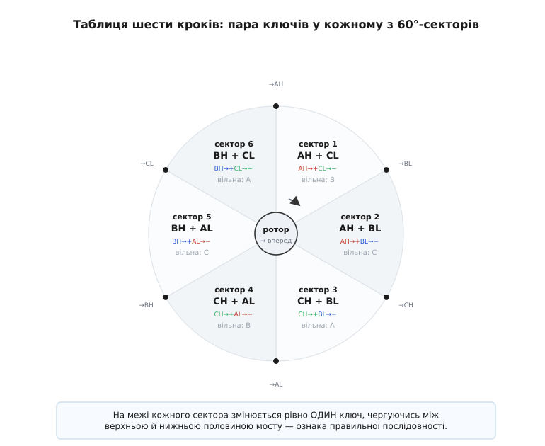

# ⚙️ Таблиця шести кроків: рядок за рядком у прошивці

Уся трапецоїдна комутація мотора вміщається в одну маленьку таблицю з шести рядків. Це не метафора — це буквальний масив у прошивці, який лежить у флеші мікроконтролера й до якого автомат керування звертається за номером сектора. Розберімо цю таблицю до останнього біта: що стоїть у кожному рядку, чому саме там, як прошивка переходить з рядка на рядок і які дві-три помилки перетворюють гладкий мотор на смикливий шматок заліза, що пищить і не крутиться.

Задача проста на словах і підступна в деталях. Ротор крутиться; електричний оберт поділено на **шість секторів по 60°**; у кожному секторі рівно **дві фази ведуть струм**, а третя висить вільна. Треба, щоб прошивка в кожну мить знала свій сектор, вмикала правильну пару ключів і переходила на наступний сектор **точно на його межі** — не раніше, не пізніше. Помилка в один рядок — і поле відстає або забігає, ротор губить синхронізм, мотор стає.

## Що таке «рядок таблиці» насправді

Трифазний інвертор — це шість силових ключів, зібраних у три півмости. Назвімо їх однозначно: у фазі A є верхній ключ **AH** (*A-high*, до плюса батареї) і нижній **AL** (*A-low*, до мінуса); так само BH/BL і CH/CL. Один рядок таблиці — це відповідь на питання «які з цих шести ключів зараз відкриті».

У 120°-комутації відповідь завжди одна за формою: **один верхній ключ однієї фази й один нижній ключ іншої фази**. Струм заходить у мотор через відкритий верхній ключ, тече крізь дві обмотки послідовно й виходить через відкритий нижній ключ. Третя фаза не має жодного відкритого ключа — обидва її транзистори (і верхній, і нижній) замкнені, тож її вивід ні до плюса, ні до мінуса не під'єднаний. Вона **висить вільна**, і саме на ній безсенсорний ESC слухає зворотну ЕРС.

> 🔧 **Навіщо це.** Розуміти рядок як пару «верхній однієї фази + нижній іншої» — це не педантизм, а захист від найпоширенішого способу спалити інвертор. Якщо через помилку в таблиці відкриються **верхній і нижній ключі однієї фази** (AH і AL разом), вони закоротять батарею навпростець через себе — це **наскрізний струм** (*shoot-through*), і півміст згорає за мікросекунди. Правильний рядок фізично не може містити двох ключів однієї фази; тому таблицю пишуть так, щоб ця комбінація не траплялася ніколи, а між вимиканням одного ключа й вмиканням протилежного лишають крихітну паузу — **мертвий час** (*dead-time*).

## Шість рядків: повна таблиця

Зафіксуймо один конкретний порядок обертання й тримаймося його весь час — половина помилок у комутації родом саме з того, що на різних аркушах порядок фаз різний. Ось шість секторів для обертання «вперед», з роллю кожної фази й парою відкритих ключів:

```
сектор   кут       фаза A   фаза B   фаза C    відкриті ключі   струм тече
  1     0°–60°       +        віл.     −          AH, CL         A → C
  2    60°–120°      +        −        віл.       AH, BL         A → B
  3   120°–180°      віл.     −        +          CH, BL         C → B
  4   180°–240°      −        віл.     +          CH, AL         C → A
  5   240°–300°      −        +        віл.       BH, AL         B → A
  6   300°–360°      віл.     +        −          BH, CL         B → C
```

Прочитаймо рядок 1 повільно. Верхній ключ фази A відкритий (**AH**) — вивід A сидить на плюсі. Нижній ключ фази C відкритий (**CL**) — вивід C сидить на мінусі. Струм заходить у A, іде через обмотку A, через з'єднану з нею в зірку обмотку C і виходить у мінус через CL. Фаза B зараз вільна: і BH, і BL замкнені, вивід B ні до чого не під'єднаний — там ми слухаємо ЕРС. Це і є весь сектор 1.

Тепер помітьте закономірність, і таблицю не доведеться зубрити. Придивіться до однієї фази — скажімо, до A: **+ + віл. − − віл.** Два сектори підряд вона на плюсі, один вільна, два на мінусі, один вільна. Рівно та сама картина в кожної фази, лише зсунута на два сектори. Ось звідки береться **трапеція**: напруга фази A два кроки тримається вгорі (пласка полиця), спадає, два кроки внизу, підіймається. Не синусоїда — трапеція з пласкими вершинами, бо між кроками фаза не міняється плавно, а стрибає.

І ще одна закономірність, яка врятує вас від плутанини порядку. Від сектора до сектора **міняється рівно один ключ у кожній половині** мосту — верхній «переїжджає» на сусідню фазу або нижній переїжджає, але ніколи обидва одночасно. З рядка 1 (AH, CL) у рядок 2 (AH, BL): верхній лишився AH, а нижній перескочив з CL на BL. З рядка 2 (AH, BL) у рядок 3 (CH, BL): нижній лишився BL, верхній перескочив з AH на CH. Це властивість правильної шестикрокової послідовності: **на кожен крок — одне перемикання, і воно чергується** між верхньою й нижньою половиною. Якщо ви виписуєте таблицю руками й раптом на якомусь кроці міняються два ключі відразу — таблиця збита, шукайте помилку.


*Таблиця шести кроків як коло. Ротор обходить електричний оберт за шість секторів; у кожному відкрита пара «верхній однієї фази + нижній іншої», третя фаза вільна (сіра). Стрілка всередині — напрям струму крізь мотор. Від сектора до сектора змінюється рівно один ключ (позначено), і зміна чергується між верхньою й нижньою половиною мосту — ознака правильної послідовності.*

## Куди подіти ШІМ: керуємо швидкістю, не ламаючи таблицю

Таблиця каже, **які** ключі відкриті, але не каже, **як сильно** крутити мотор. Швидкість задають напругою, а напругу регулюють [широтно-імпульсною модуляцією](topic:programming/pwm-on-mcu) (ШІМ) — швидким вмиканням-вимиканням ключа, від якого мотор бачить лише середнє. Питання: котрий із двох відкритих ключів «шимити»?

Відповідь у 120°-комутації зазвичай така: **ШІМ накладають на один ключ пари, а другий тримають постійно відкритим** протягом усього сектора. Хто саме шимить — питання схеми керування, і обидва варіанти живі:

- **High-side ШІМ** — модулюють верхній ключ (у секторі 1 це AH), а нижній (CL) тримають відкритим весь сектор. Тоді середня напруга на моторі задається шпаруватістю верхнього ключа.
- **Low-side ШІМ** — навпаки, шимлять нижній, верхній тримають відкритим. Так простіше вимірювати струм через шунт у мінусовій шині.

Головне для таблиці: **ШІМ не міняє того, який ключ у якому рядку відкритий** — вона лише модулює один із них у часі всередині сектора. Тому таблицю секторів і генератор ШІМ тримають окремо: таблиця відповідає «яка фаза куди під'єднана», а таймер ШІМ незалежно ріже цей стан на імпульси. Змішувати їх в одному місці коду — прямий шлях до заплутаної прошивки, де зміна швидкості випадково ламає порядок фаз.

## Таблиця в C: масив бітових масок

Запишімо таблицю так, як вона реально лежить у прошивці — окремим масивом на шість елементів. Кожен елемент — набір бітів, які прямо кладуться в регістр вихідного порту (або, на серйозних мікроконтролерах, у регістр таймера, що керує комплементарними виходами з мертвим часом). Візьмімо шість ліній: AH, AL, BH, BL, CH, CL.

:::tabs
```cpp
#include <stdint.h>

// Біти шести ключів у одному байті стану інвертора.
#define AH (1u << 0)
#define AL (1u << 1)
#define BH (1u << 2)
#define BL (1u << 3)
#define CH (1u << 4)
#define CL (1u << 5)

// Таблиця шести кроків для обертання "вперед".
// Індекс — номер сектора 0..5 (сектор 1 з таблиці = індекс 0).
// У кожному рядку рівно ОДИН верхній і ОДИН нижній ключ різних фаз.
static const uint8_t STEP_FWD[6] = {
    AH | CL,   // сектор 1: A→C, фаза B вільна
    AH | BL,   // сектор 2: A→B, фаза C вільна
    CH | BL,   // сектор 3: C→B, фаза A вільна
    CH | AL,   // сектор 4: C→A, фаза B вільна
    BH | AL,   // сектор 5: B→A, фаза C вільна
    BH | CL,   // сектор 6: B→C, фаза A вільна
};
```
```python
# Біти шести ключів у одному байті стану інвертора.
AH = 1 << 0
AL = 1 << 1
BH = 1 << 2
BL = 1 << 3
CH = 1 << 4
CL = 1 << 5

# Таблиця шести кроків для обертання "вперед".
# Індекс — номер сектора 0..5 (сектор 1 з таблиці = індекс 0).
# У кожному рядку рівно ОДИН верхній і ОДИН нижній ключ різних фаз.
STEP_FWD = [
    AH | CL,   # сектор 1: A→C, фаза B вільна
    AH | BL,   # сектор 2: A→B, фаза C вільна
    CH | BL,   # сектор 3: C→B, фаза A вільна
    CH | AL,   # сектор 4: C→A, фаза B вільна
    BH | AL,   # сектор 5: B→A, фаза C вільна
    BH | CL,   # сектор 6: B→C, фаза A вільна
]
```
:::

Зверніть увагу: у жодному рядку немає двох бітів однієї фази (ніде не стоїть `AH | AL`, `BH | BL`, `CH | CL`). Це не випадковість, а інваріант, який варто перевіряти навіть автоматично при старті — пройтися по таблиці й переконатися, що `(row & AH) && (row & AL)` ніде не істинне. Якщо цей інваріант порушено, найкраще не вмикати силову частину взагалі: рядок із наскрізним замиканням спалить міст на першому ж кроці.

Обертання назад — це та сама таблиця, прочитана у зворотному порядку. Не треба писати другий масив: досить іти по індексах у інший бік.

:::tabs
```cpp
// Той самий масив, зворотний обхід дає обертання "назад".
static inline uint8_t step_bits(uint8_t sector, int forward) {
    return forward ? STEP_FWD[sector] : STEP_FWD[5 - sector];
}
```
```python
# Той самий масив, зворотний обхід дає обертання "назад".
def step_bits(sector, forward):
    return STEP_FWD[sector] if forward else STEP_FWD[5 - sector]
```
:::

Чому обернений порядок дає реверс? Бо напрям обертання поля — це напрям, у якому ми переходимо між рядками. Ідемо 1→2→3→4→5→6 — поле крутиться в один бік; ідемо 6→5→4→3→2→1 — у протилежний. Фізика рядка не міняється, міняється лише послідовність їх увімкнення. Одна таблиця, два напрями обходу — і жодного дублювання, де могла б завестися розбіжність.

## Звідки береться номер сектора: два джерела кута

Таблиця готова, але вона марна, поки прошивка не знає **свого рядка** — поточного сектора. Номер сектора беруть з одного з двох джерел, і код автомата в кожному випадку свій.

### Сенсорний автомат: сектор із трьох датчиків Голла

У сенсорному моторі стоять три [датчики Голла](topic:electronics/hall-sensor), рознесені на 120° електричних. Кожен видає логічну одиницю, поки над ним «плюсовий» бік магніту, і нуль — поки «мінусовий». Три біти разом дають вісім комбінацій, але дві з них — `000` і `111` — фізично неможливі при справних датчиках (усі три не можуть бачити один полюс). Лишається рівно **шість дійсних комбінацій** — по одній на кожен із шести секторів. Датчики самі, своєю геометрією, кодують сектор.

Прошивці лишається прочитати три ноги, скласти з них тризначний код і перевести його в номер сектора. Переклад — це таблиця відповідності, яку кожен виробник мотора закладає своєю геометрією; ось типовий приклад для послідовності Голлів `1,3,2,6,4,5` (десяткові значення тризначного коду):

:::tabs
```cpp
// Три ноги Голлів у молодших бітах: (HC<<2)|(HB<<1)|HA -> код 1..6.
// Значення 0 і 7 — несправність (обрив/КЗ датчика або шум).
// sector_of_hall[код] = номер сектора 0..5, або 0xFF як "недійсно".
static const uint8_t sector_of_hall[8] = {
    0xFF,  // 000 — недійсно
    0,     // 001 -> сектор 1
    2,     // 010 -> сектор 3
    1,     // 011 -> сектор 2
    4,     // 100 -> сектор 5
    5,     // 101 -> сектор 6
    3,     // 110 -> сектор 4
    0xFF,  // 111 — недійсно
};

static inline uint8_t read_hall_code(void) {
    // Прочитати три ноги портів; тут — умовні макроси читання піна.
    uint8_t a = gpio_read(HALL_A_PIN);
    uint8_t b = gpio_read(HALL_B_PIN);
    uint8_t c = gpio_read(HALL_C_PIN);
    return (uint8_t)((c << 2) | (b << 1) | a);
}

void commutate_from_hall(int forward) {
    uint8_t code = read_hall_code();
    uint8_t sector = sector_of_hall[code];
    if (sector == 0xFF) {
        drive_off();            // недійсний код -> знеструмити міст, не гадати
        fault_latch(FAULT_HALL);
        return;
    }
    uint8_t bits = step_bits(sector, forward);
    apply_inverter(bits);       // виставити ключі на цей сектор
}
```
```python
# Три ноги Голлів у молодших бітах: (HC<<2)|(HB<<1)|HA -> код 1..6.
# Значення 0 і 7 — несправність (обрив/КЗ датчика або шум).
# sector_of_hall[код] = номер сектора 0..5, або None як "недійсно".
SECTOR_OF_HALL = [
    None,  # 000 — недійсно
    0,     # 001 -> сектор 1
    2,     # 010 -> сектор 3
    1,     # 011 -> сектор 2
    4,     # 100 -> сектор 5
    5,     # 101 -> сектор 6
    3,     # 110 -> сектор 4
    None,  # 111 — недійсно
]

def read_hall_code():
    # Прочитати три ноги портів; тут — умовні функції читання піна.
    a = gpio_read(HALL_A_PIN)
    b = gpio_read(HALL_B_PIN)
    c = gpio_read(HALL_C_PIN)
    return (c << 2) | (b << 1) | a

def commutate_from_hall(forward):
    code = read_hall_code()
    sector = SECTOR_OF_HALL[code]
    if sector is None:
        drive_off()             # недійсний код -> знеструмити міст, не гадати
        fault_latch(FAULT_HALL)
        return
    bits = step_bits(sector, forward)
    apply_inverter(bits)        # виставити ключі на цей сектор
```
:::

Краса сенсорного автомата в тому, що **тут немає стану** — сектор щоразу читається наново з датчиків. Прошивці не треба пам'ятати, де вона була; ротор сам «каже» кут трьома бітами. Тому сенсорна комутація безвідмовно працює з нуля обертів і під будь-яким навантаженням: навіть якщо ротор смикнули рукою, наступне читання Голлів дасть правильний сектор, і мотор поїде куди слід.

Одна тонкість, яка ловить новачків. Три конкретні дроти Голлів і три фази мотора можна з'єднати шістьма способами, і лише один з них дає правильну послідовність. Тому таблицю `sector_of_hall` майже завжди **знімають експериментально** для конкретної пари «мотор + контролер»: повільно крутять вал, дивляться, який код Голлів відповідає якому положенню, і заповнюють масив. Спроба вгадати її з даталиста часто дає мотор, що гуде на місці або крутиться назад.

> 🔧 **Навіщо це.** Обробка недійсних кодів `000`/`111` — не формальність. Обрив одного дроту Голла миттєво дає такий код, і якщо прошивка сліпо візьме з таблиці сміття замість сектора, вона ввімкне випадкову пару ключів проти реального положення ротора — мотор смикнеться й може вибити струмовий захист. Правильна реакція одна: побачив недійсний код — **знеструм міст і підняв прапор несправності**, а не «якось доїхати». Це різниця між мотором, що безпечно зупиниться при обриві датчика, і мотором, що спалить ключі.

### Безсенсорний автомат: сектор із лічильника переходів через нуль

Без датчиків номер сектора нема звідки прочитати миттєво — його доводиться **вести самому**, лічильником. Тут з'являється справжній державний автомат: прошивка **пам'ятає** свій сектор і збільшує його на одиницю щоразу, коли ловить подію комутації.

Подія — це не сам перехід зворотної ЕРС через нуль. Як докладно показано в самій темі про стратегії, перехід через нуль стається **посередині** сектора, а перемкнути ключі треба на **межі** — на 30° електричних пізніше. Тому автомат ловить нуль, зачікує половину тривалості попереднього сектора й аж тоді робить крок: збільшує номер сектора за модулем 6 і виставляє новий рядок таблиці.

:::tabs
```cpp
// Безсенсорний автомат: сектор ЖИВЕ у змінній й крокує по одному.
static volatile uint8_t g_sector = 0;      // поточний рядок 0..5
static volatile uint32_t g_last_sector_us; // тривалість минулого сектора

// Викликається з таймера рівно на МЕЖІ сектора (через 30° після нуля).
void commutation_tick(int forward) {
    g_sector = forward ? (uint8_t)((g_sector + 1) % 6)
                       : (uint8_t)((g_sector + 5) % 6);   // +5 ≡ −1 (mod 6)
    apply_inverter(STEP_FWD[forward ? g_sector : (5 - g_sector)]);
}

// Викликається компаратором, коли ЕРС вільної фази перетнула нуль.
void on_zero_crossing(uint32_t now_us) {
    static uint32_t prev_zc_us = 0;
    g_last_sector_us = now_us - prev_zc_us;   // час між двома нулями = сектор
    prev_zc_us = now_us;
    // чекати 30° = пів сектора, тоді commutation_tick():
    schedule_after(g_last_sector_us / 2, commutation_tick);
}
```
```python
# Безсенсорний автомат: сектор ЖИВЕ у стані й крокує по одному.
g_sector = 0            # поточний рядок 0..5
g_last_sector_us = 0    # тривалість минулого сектора
_prev_zc_us = 0         # час попереднього переходу через нуль

# Викликається з таймера рівно на МЕЖІ сектора (через 30° після нуля).
def commutation_tick(forward):
    global g_sector
    g_sector = (g_sector + 1) % 6 if forward else (g_sector + 5) % 6  # +5 ≡ −1 (mod 6)
    apply_inverter(STEP_FWD[g_sector if forward else (5 - g_sector)])

# Викликається компаратором, коли ЕРС вільної фази перетнула нуль.
def on_zero_crossing(now_us):
    global g_last_sector_us, _prev_zc_us
    g_last_sector_us = now_us - _prev_zc_us   # час між двома нулями = сектор
    _prev_zc_us = now_us
    # чекати 30° = пів сектора, тоді commutation_tick():
    schedule_after(g_last_sector_us // 2, commutation_tick)
```
:::

Ось де ховається головна вразливість безсенсорного шляху. Номер сектора тепер — **накопичена величина**: він правильний лише доти, доки правильні **всі** переходи від старту. Пропустив автомат один-єдиний перехід через нуль (шум замаскував його, або оберти стрибнули так, що вікно очікування не збіглося) — і `g_sector` відстає на один від справжнього положення ротора **назавжди**, аж до наступного повного перезапуску. Прошивка думає, що вона в секторі 3, а ротор фізично вже в секторі 4; вона вмикає пару ключів на 60° не туди, поле більше не тягне ротор уперед — **зрив синхронізму** (*loss of sync*). Мотор або різко втрачає момент, або зупиняється, а на слух це часто чути як раптовий виск і провал тяги.

> 🔧 **Навіщо це.** Саме цей механізм пояснює, чому безсенсорні дронові мотори іноді «спотикаються» на різкій зміні газу. Різкий ривок ручки миттєво міняє оберти, вікно очікування наступного нуля, розраховане на стару швидкість, не влучає — автомат пропускає крок, лічильник сектора з'їжджає, синхронізм зірвано. Тому в прошивці ESC є захист: якщо кілька переходів поспіль не приходять, коли їх чекали, ESC не намагається «доїхати» на збитому лічильнику, а **скидає лічильник і йде на повторний старт наосліп** — вирівняти ротор і розігнати заново. Краще на мить втратити тягу, ніж крутити поле проти ротора.

## Три пастки, що псують більшість перших спроб

Коли трапецоїдна комутація не працює з першого разу, причина майже завжди в одній із трьох речей нижче. Усі вони — не про формули, а про **порядок і синхронізм**.

**Плутанина порядку фаз.** Найпоширеніша. Ви або переплутали, який фізичний дріт мотора підключений до фази A/B/C контролера, або збили порядок у таблиці. Симптом характерний: мотор **сильно гуде на місці, гріється, але не набирає обертів**, або крутиться в інший бік, ніж очікувалось. Причина в тому, що з неправильним порядком поле стрибає не в той бік або не туди, куди дивиться ротор, і замість плавного розгону виходить боротьба струму сам із собою. Лікується перестановкою будь-яких **двох** із трьох фазних дротів (це інвертує напрям) або виправленням таблиці. Ключова діагностична ознака: якщо мотор *майже* крутиться, смикаючись, — це майже завжди зсув таблиці на один сектор; якщо гуде зовсім на місці — переплутано дроти.

**Пропущений крок і зрив синхронізму.** Друга за поширеністю, і суто безсенсорна. Лічильник сектора з'їхав на один через пропущений перехід через нуль, і поле відтоді комутує з постійним зсувом на 60°. Симптом: мотор нормально стартував і розігнався, а потім на якомусь режимі (часто на різкій зміні газу чи під навантаженням) раптово провалюється в тязі або зупиняється. На відміну від плутанини фаз, тут усе **починалося добре** — саме це вказує на накопичену помилку лічильника, а не на статичну помилку монтажу. Захист один: стежити за реальністю моменту приходу нулів і при серії промахів **скидати автомат на повторний старт**, а не тягти збитий лічильник.

**Наскрізний струм через брак мертвого часу.** Третя — найдорожча, бо палить залізо. Коли комутація перемикає верхній ключ фази на нижній (або навпаки в межах одного півмоста при синхронному випрямленні), обидва на мить можуть виявитися прочиненими одночасно — реальний MOSFET закривається не миттєво. Якщо між «закрити один» і «відкрити протилежний» немає паузи, півміст на частку мікросекунди коротить батарею сам через себе. Симптом: інвертор гріється без навантаження, споживає дивно багато на холостому ходу або відверто вигорає. Лікується **мертвим часом** — на серйозних мікроконтролерах його вставляє апаратно той самий таймер, що керує комплементарними виходами (задаєш кількість тактів паузи, і залізо саме розводить фронти); робити мертвий час у програмному циклі — ненадійно й тому небезпечно.

Спільна нитка всіх трьох пасток одна: шестикрокова таблиця сама собою тривіальна, а вся інженерія — навколо неї. Правильний **порядок** рядків (щоб поле йшло за ротором, а не проти), надійне **джерело сектора** (датчики без стану чи лічильник, що не втрачає кроків), і безпечні **переходи** між ключами (з мертвим часом, без наскрізного струму). Тримаєш ці три речі — і шість рядків у флеші крутять мотор рівно, і крутять уже стільки десятиліть, скільки існують дешеві ESC.
