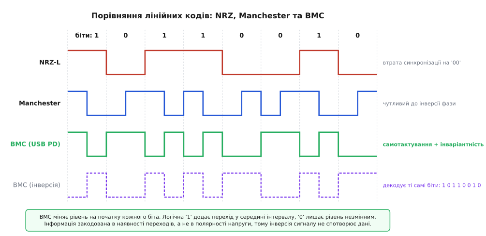
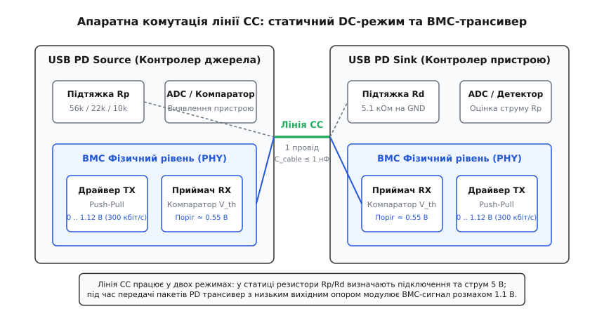
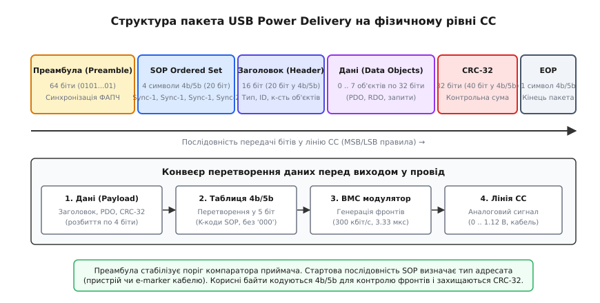
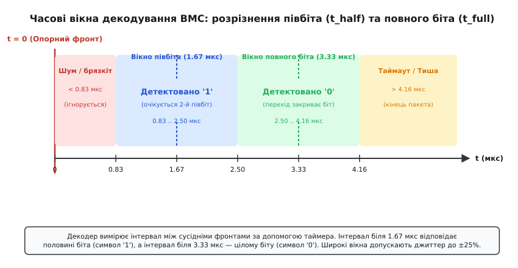

# BMC-кодування: як USB-C передає біти по CC

<preknowlist>
[Type-C без PD](book:electronics/type-c-cc) — дільник Rp/Rd, орієнтація роз'єму та базовий струм 5 В.
[USB Power Delivery](book:electronics/usb-pd) — багаторівневий протокол живлення, типи повідомлень та узгодження контрактів.
[Дільник напруги](book:electronics/voltage-divider) — розрахунок статичних потенціалів на лінії CC.
[Стала RC](book:electronics/rc-time-constant) — перехідні процеси перезаряджання ємності кабелю та спотворення фронтів.
</preknowlist>

Коли джерело живлення USB-C підключається до споживача, на лінії Configuration Channel (CC) встановлюється постійна напруга від 0.41 В до 1.68 В. Цей статичний потенціал формується звичайним дільником напруги між підтягуючим резистором Rp на стороні джерела та підтягуючим резистором Rd на стороні пристрою. За величиною цієї напруги мікроконтролери обох вузлів миттєво дізнаються про фізичне з'єднання, визначають орієнтацію симетричного штекера (CC1 чи CC2) і дозволяють подачу базового живлення 5 В зі струмом до 3 А.

Проте для передачі потужностей понад 15 Вт (аж до 240 Вт у стандарті USB PD 3.1 Extended Power Range), перемикання напруги шини VBUS на 9 В, 15 В, 20 В чи 48 В, а також для опитування електронних маркерів усередині активних кабелів статичного дільника вже недостатньо. Потрібен повноцінний двосторонній цифровий обмін пакетами.

Виникає фундаментальне інженерне протиріччя: провідник CC у кабелі всього один, окремої лінії тактування немає, заземлення спільне з силовим поверненням великих струмів, а статичне зміщення постійного струму на лінії не можна розривати чи спотворювати, бо його падіння нижче 0.2 В буде сприйнято аналоговою схемою як відключення кабелю.

Рішенням цього протиріччя стала фізична модуляція Biphase Mark Code (BMC) — двофазний код із міткою, який накладає високочастотний цифровий потік поверх лінії CC без застосування зовнішніх тактових генераторів та без зміщення середньої постійної складової.

---

### 1. Чому стандартні методи передачі зазнають поразки на одній жилі

Щоб оцінити елегантність кодування BMC, розглянемо поведінку класичних цифрових інтерфейсів, якби їх спробували застосувати на єдиній жилі CC.

```
Класичний NRZ (UART / SPI Data):
Біти:            0       0       0       1       1       1
Рівень:    ──────┴───────┴───────┴───────┬───────┬───────┬───────► Час t
           [     суцільний 0 В    ]      [    суцільний 3.3 В    ]
           * Дрейф постійної складової (DC Bias Wander)
           * Повна втрата тактової синхронізації
```

Перший природний кандидат — кодування без повернення до нуля (Non-Return-to-Zero, NRZ), яке використовується у звичайних UART або SPI:
1. **Зрив синхронізації на довгих серіях однакових бітів**: Якщо в пакеті передається довгий ланцюжок нулів (`0x00`) або одиниць (`0xFF`), напруга на лінії стає абсолютно пласкою. Приймач не отримує жодного перепаду напруги. Навіть мізерне розходження тактових генераторів передавача й приймача на 2–3% призводить до того, що внутрішній лічильник приймача зсувається, і біти зчитуються в хибні моменти часу. Для стабілізації NRZ потрібні прецизійні кварцові резонатори в кожному пристрої та в кожному кабельному чипі, що різко здорожчує виробництво.
2. **Знищення статичного стану лінії (DC Wander)**: Якщо лінія тривалий час утримується на рівні 0 В, напруга на виводі CC падає до нуля. Аналоговий компаратор визначення підключення реєструє відключення навантаження (vOpen / vUnattached) і негайно розриває силовий ключ живлення VBUS.
3. **Чутливість до полярності**: У класичному NRZ логічний рівень прив'язаний до абсолютної напруги (високий рівень — '1', низький — '0'). Якщо на вході приймача встановити інвертуючий буфер, усі дані спотворюються на протилежні.

Другий кандидат — класичний манчестерський код (Manchester Coding, IEEE 802.3):
У манчестерському коді кожен біт містить перехід у середині інтервалу: наростаючий фронт позначає одиницю, а спадаючий — нуль. Це гарантує самосинхронізацію, проте породжує жорстку залежність від полярності сигналу. Якщо в схемі компаратора випадково переплутати інвертуючий та неінвертуючий входи, або якщо вхідний каскад змінює полярність через внутрішню топологію кристала, усі нулі перетворюються на одиниці.

Biphase Mark Code позбавлений усіх цих вад завдяки фундаментально іншому підходу: інформацію кодує не напрямок фронту і не рівень напруги, а **наявність або відсутність проміжного переходу**.


*Форми сигналів: порівняння класичного NRZ, Manchester та BMC (Biphase Mark Code)*

---

### 2. Механіка BMC: правила формування фронтів

Biphase Mark Code працює з фіксованими бітовими комірками однакової тривалості. Номінальна швидкість передачі в стандарті USB Power Delivery становить 300 кбіт/с (кілобіт на секунду), що відповідає тривалості одного бітового інтервалу `tBit = 3.333 мкс`.

Кодування підпорядковується двом простим правилам:

```
Правило 1 (Безумовний старт комірки):
На початку КОЖНОГО бітового інтервалу рівень напруги на лінії обов'язково
змінюється на протилежний (з низького на високий або з високого на низький).

Правило 2 (Інформаційне наповнення середини):
- Для передачі логічної одиниці ('1'): рівно посередині комірки (через 1.667 мкс)
  формується ДОДАТКОВИЙ перехід рівня.
- Для передачі логічного нуля ('0'): рівень напруги в середині комірки
  НЕ ЗМІНЮЄТЬСЯ (залишається постійним до початку наступної комірки).
```

Розглянемо послідовність бітів `0 → 1 → 1 → 0`:

1. **Передача біта '0'**:
   - На початку комірки відбувається перехід (наприклад, із 0 В у 1.1 В);
   - Упродовж усього інтервалу 3.33 мкс сигнал утримується на рівні 1.1 В;
   - Завершення комірки: на лінії спостерігався рівно **один інтервал** тривалістю `t_full = 3.33 мкс`.

2. **Передача першого біта '1'**:
   - На початку комірки відбувається обов'язковий перехід (із 1.1 В у 0 В);
   - Рівно через 1.67 мкс формується додатковий перехід (із 0 В у 1.1 В);
   - До кінця комірки сигнал утримується на рівні 1.1 В;
   - Завершення комірки: на лінії сформовано **два інтервали** тривалістю `t_half = 1.67 мкс` кожен.

3. **Передача другого біта '1'**:
   - На початку комірки відбувається обов'язковий перехід (із 1.1 В у 0 В);
   - Через 1.67 мкс — додатковий перехід (із 0 В у 1.1 В);
   - Отримано ще два інтервали по 1.67 мкс.

4. **Передача біта '0'**:
   - На початку комірки відбувається обов'язковий перехід (із 1.1 В у 0 В);
   - У середині переходів немає;
   - Отримано один інтервал тривалістю 3.33 мкс.

Цей механізм має чотири вирішальні фізичні переваги:

- **Абсолютна інваріантність до полярності**: Оскільки приймач вимірює виключно час між сусідніми фронтами (інтервали `Δt`), інверсія полярності всієї лінії або виходу компаратора не змінює тривалості інтервалів. Сигнал `0` залишається інтервалом 3.33 мкс, а сигнал `1` — парою інтервалів по 1.67 мкс.
- **Вбудована самосинхронізація (Self-Clocking)**: Кожна комірка має гарантований фронт на початку. Таймер приймача перезапускається на кожній границі біта. Фазова похибка скидається до нуля щонайменше 300 000 разів на секунду, що дозволяє вузлам працювати від дешевих внутрішніх RC-генераторів із технологічною нестабільністю до ±10%.
- **Відсутність постійної складової (DC Balance)**: Завдяки постійному чергуванню фаз спектральна густина потужності на нульовій частоті дорівнює нулю. Це усуває паразитичне зміщення робочої точки компараторів.
- **Вузький спектр завад**: Частота перемикання лінії лежить у вузькому діапазоні від 300 кГц (суцільні нулі) до 600 кГц (суцільні одиниці). Ці частоти не створюють випромінюваних завад у радіочастотних діапазонах стільникового зв'язку чи Wi-Fi.

---

### 3. Фізичний рівень лінії CC: як передавач накладає сигнал на дільник

У пасивному режимі очікування лінія CC підтягнута резистором `Rp` на стороні джерела до напруги 3.3 В або 5 В, а на стороні споживача навантажена резистором `Rd = 5.1 кОм` на землю. Опір дільника становить кілька кілоом, тому лінія є високоомною і чутливою до зовнішніх наведень.

Щоб передати високочастотний цифровий пакет зі швидкістю 300 кбіт/с крізь паразитну ємність кабелю (яка згідно зі стандартом може сягати 1000 пФ), внутрішній трансивер фізичного рівня (PHY) тимчасово змінює режим роботи виводу CC.


*Апаратна структура лінії CC: комутація пасивного зміщення Rp/Rd та активного трансивера BMC*

Процес передачі пакета відбувається за такою послідовністю:

1. **Активація активного драйвера**: Передавач вмикає низькоомний вихідний каскад (Push-Pull буфер із вихідним динамічним опором `R_tx = 30..50 Ом`). Низький вихідний опір драйвера шунтує високоомні підтяжки Rp і Rd.
2. **Формування розмаху напруги**: Драйвер генерує прямокутні коливання з амплітудним розмахом `V_swing = 1.05 .. 1.20 В` (номінально `1.12 В`) відносно нульового потенціалу землі GND.
3. **Керування швидкістю наростання (Slew Rate Control)**: Стандарт USB PD жорстко обмежує тривалість фронту наростання та спаду `t_rise` / `t_fall` у діапазоні від 100 нс до 300 нс. Занадто крутий фронт (менше 100 нс) створював би паразитичні високочастотні гармоніки в радіодіапазоні, а занадто пологий (понад 300 нс) призвів би до завалювання очної діаграми та фазового джиттеру на порозі компаратора.
4. **Прийом компаратором**: На боці приймача сигнал надходить на швидкодіючий аналоговий компаратор. Опорна напруга компаратора `V_ref` встановлюється на рівень рівно половини розмаху: `V_ref ≈ 0.55 В` із гістерезисом близько 50 мВ. Коли імпульс перевищує 0.575 В, компаратор видає логічну одиницю на вхід захоплення таймера, а коли падає нижче 0.525 В — логічний нуль.
5. **Повернення у високоомний стан (Hi-Z)**: Після передачі останнього біта пакета передавач відключає активний push-pull драйвер і переводить свій вихід у режим високого імпедансу. Лінія плавно повертається до початкового рівня постійної напруги, заданого резисторами Rp/Rd (наприклад, 0.92 В або 1.68 В).

Математичний аналіз перехідних процесів перезаряджання ємності лінії, розрахунок допустимого фазового джиттеру та спектральної густини потужності наведено у вставці [math-bmc-timing.md](book:electronics/power-electronics/bmc-encoding/math-bmc-timing.md).

---

### 4. Лінійне кодування 4b/5b та впорядковані набори SOP

Якби байти корисного навантаження подавалися на вхід BMC-модулятора безпосередньо, у потоці могли б зустрітися небезпечні послідовності. Зокрема, передача байта `0x00` породжує 8 однакових інтервалів по 3.33 мкс підряд. Крім того, приймачу необхідний механізм для розрізнення того, де закінчується шум лінії і починається перший біт заголовка.

Для вирішення цих завдань фізичний рівень USB PD використовує дворівневу схему: табличне кодування 4b/5b та спеціальні керуючі K-коди.

```
       Потік даних (байти)
               │
               ▼
   [ Розбиття на 4-бітні нібли ]
               │
               ▼
   [ Табличне перетворення 4b/5b ] ──► Гарантує щільність фронтів (макс. 2 нулі підряд)
               │
               ▼
   [ Додавання K-символів (SOP / EOP) ] ──► Межі кадру та адресація (порт чи кабель)
               │
               ▼
   [ Модулятор BMC (300 кбіт/с) ] ──► Генерація фізичних імпульсів на CC
```

Перед модуляцією кожен байт даних ділиться навпіл на молодший і старший 4-бітні нібли (півбайти). Кожен 4-бітний нібл перетворюється на 5-бітний символ за фіксованою таблицею 4b/5b. Оскільки 5 бітів дають 32 можливі комбінації, а для передачі чисел від 0 до 15 потрібно лише 16, решта 16 комбінацій використовуються як спеціальні службові маркери (K-символи) або вважаються забороненими кодовими словами (помилка `BadSymbol`).

Символи таблиці 4b/5b підібрано таким чином, що в будь-якій комбінації даних у вихідному потоці ніколи не з'являється більше двох нулів підряд. Це гарантує, що максимальний інтервал між фронтами на лінії CC ніколи не перевищить тривалості двох бітів `0` (6.67 мкс), утримуючи таймер приймача в режимі постійної синхронізації.


*Анатомія кадру USB Power Delivery: преамбула, впорядковані набори SOP, лінійне кодування 4b/5b та CRC-32*

---

### 5. Анатомія кадру: від преамбули до маркера EOP

Кожен цифровий пакет USB Power Delivery, що передається лінією CC, має сувору структуру:

1. **Преамбула (Preamble, 64 біти)**:
   Пакет завжди починається з послідовності 64 бітів, яка формується чергуванням нулів та одиниць у BMC. Це виглядає як стабільний меандр частотою 300 кГц. Преамбула призначена для того, щоб аналоговий компаратор приймача увійшов у робочий режим, а цифровий блок синхронізації (DPLL) підлаштував частоту внутрішнього таймера під генератор передавача.
2. **Впорядкований набір SOP (Start of Packet, 20 біт)**:
   Після преамбули передаються рівно чотири 5-бітні K-символи. Вони виконують подвійну функцію: слугують фазовим маркером початку корисних даних та визначають адресата повідомлення:
   - **SOP (Sync-1 + Sync-1 + Sync-1 + Sync-2)**: Повідомлення адресоване безпосередньому партнеру по порту (Source або Sink);
   - **SOP' (Sync-1 + Sync-1 + Sync-3 + Sync-3)**: Повідомлення адресоване мікросхемі E-Marker у ближньому до джерела штекері кабелю;
   - **SOP'' (Sync-1 + Sync-3 + Sync-1 + Sync-3)**: Повідомлення адресоване мікросхемі E-Marker у дальньому штекері кабелю;
   - **Hard Reset (RST-1 + RST-1 + RST-1 + RST-2)**: Екстрений апаратний сигнал аварійного скидання напруги силової шини VBUS до базових 5 В;
   - **Cable Reset (RST-1 + Sync-1 + RST-1 + Sync-1)**: Сигнал скидання стану кабельних контролерів без розриву основного силового контракту.
3. **Заголовок повідомлення (Header, 2 байти = 20 біт у 4b/5b)**:
   Містить тип повідомлення (`Source_Capabilities`, `Request`, `Accept`, `Reject`, `PS_RDY` тощо), кількість наступних об'єктів даних, ідентифікатор черги пакетів (MessageID) та специфікацію версії протоколу.
4. **Об'єкти даних (Data Objects, від 0 до 7 об'єктів по 4 байти кожен)**:
   Корисне навантаження. Наприклад, у повідомленні `Source_Capabilities` кожен об'єкт (Power Data Object, PDO) кодує доступні комбінації напруги й струму (5 В/3 А, 9 В/3 А, 20 В/5 А, параметри регульованого джерела PPS або EPR PDO до 48 В).
5. **Контрольна сума CRC-32 (4 байти = 40 біт у 4b/5b)**:
   32-розрядний надлишковий циклічний код, розрахований за стандартним поліномом `0x04C11DB7`. Він захищає всі байти від заголовка до кінця даних.
6. **Маркер кінця пакета (EOP, 1 символ = 5 біт)**:
   Спеціальний K-код `01101b` (K_EOP), після якого передавач вимикає активний драйвер, переводячи лінію в пасивний стан очікування (Line Idle).

---

### 6. Декодування на боці приймача: таймерні вікна та прийняття рішень

Приймач не має окремого тактового сигналу CLK, тому демодуляція зводиться до вимірювання часових інтервалів `Δt` між послідовними спрацьовуваннями компаратора за допомогою апаратного таймера вхідного захоплення.


*Часові вікна дискримінації інтервалів приймача BMC та межі прийняття рішень*

Номінальна тривалість півбіта становить `t_half_nom = 1.667 мкс`, а повного біта — `t_full_nom = 3.333 мкс`. Через вплив паразитної ємності, джиттер та температурний дрейф тривалість реальних імпульсів плаває. Цифровий скінченний автомат приймача класифікує кожен виміряний інтервал `Δt` за трьома критичними порогами:

1. **Зона придушення шуму (`Δt < 0.83 мкс`)**:
   Інтервали, коротші за чверть бітового періоду, вважаються брязкотом або високочастотною наводкою від силових кіл. Вони повністю ігноруються таймером без зміни внутрішнього стану.
2. **Вікно напівперіоду (`0.83 мкс ≤ Δt < 2.50 мкс`)**:
   Інтервал класифікується як `t_half` (половина біта). Якщо це перший `t_half`, автомат запам'ятовує стан очікування напарника. Коли приходить другий `t_half`, автомат генерує логічну одиницю (`'1'`) у вихідний бітовий потік.
3. **Вікно повного періоду (`2.50 мкс ≤ Δt < 4.17 мкс`)**:
   Інтервал класифікується як `t_full` (повний біт). Автомат миттєво генерує логічний нуль (`'0'`). Якщо при цьому очікувався другий півбіт, фіксується фазова помилка (Framing Error).
4. **Зона таймауту кадру (`Δt ≥ 4.17 мкс`)**:
   Відсутність фронтів протягом понад 4.17 мкс свідчить про закінчення передачі кадру (Line Idle) або аварійний обрив зв'язку.

Отриманий бітовий потік потрапляє у 20-розрядний ковзний зсувний регістр. Щойно в регістрі з'являється комбінація символів `SOP`, автомат скидає лічильник бітів і починає пакувати кожні наступні 5 бітів у байти з перевіркою за таблицею 5b/4b та накопиченням контрольної суми CRC-32.

Повну програмну реалізацію кодера і декодера BMC мовами C та C++ для вбудованих мікроконтролерів зі скінченним автоматом та таблицями перетворення розібрано у вставці [proj-bmc-codec.md](book:electronics/power-electronics/bmc-encoding/proj-bmc-codec.md).

---

### 7. Зв'язок із електронними маркерами кабелів (E-Marker) та лінія VCONN

У стандартних пасивних кабелях USB Type-C провідник CC з'єднує лише один вивід із кожного боку, а другий вивід (CC2) залишається вільним. Проте якщо кабель розрахований на струм 5 А (потужність 100 Вт і більше) або підтримує високошвидкісну передачу USB4 / Thunderbolt (до 40–80 Гбіт/с), усередині його штекерів обов'язково встановлюються мікросхеми електронного маркування (E-Marker).

```
                      Джерело (Source)                           Кабель із E-Marker
               ┌──────────────────────────────┐            ┌──────────────────────────────┐
               │                              │            │                              │
  Зв'язок BMC ─┤ CC1 ─────────────────────────┼────────────┼── CC1 (BMC пакети SOP)       │
               │                              │            │                              │
               │                              │            │  [ E-Marker Чіп 1 ]          │
               │                              │            │       ▲                      │
               │                              │            │       │ Живлення 5 В         │
 Живлення VCONN┤ CC2 ───[ Ключ VCONN 5 В ]─────┼────────────┼── CC2 ┴ (пакети SOP')        │
               │                              │            │                              │
               └──────────────────────────────┘            └──────────────────────────────┘
```

Процес взаємодії з електронним маркером відбувається за такою процедурою:

1. **Визначення орієнтації**: Джерело живлення виявляє, що зв'язок із пристроєм встановлено по лінії CC1 (там зафіксовано резистор Rd = 5.1 кОм). На виводі CC2 виявляється менший опір `Ra = 1 кОм`, що свідчить про наявність чіпа E-Marker.
2. **Подача живлення VCONN**: Джерело вмикає внутрішній силовий ключ і подає на лінію CC2 стабільну напругу живлення 5 В (шину VCONN). Мікросхема E-Marker запускається за лічені мікросекунди.
3. **Обмін пакетами SOP'**: Джерело надсилає структурований запит `Discover Identity`, використовуючи впорядкований набір `SOP'`. Основний пристрій (Sink) бачить цей пакет на лінії CC1, але ігнорує його, оскільки набір SOP' призначений виключно для кабельного контролера.
4. **Відповідь кабелю**: Контролер E-Marker формує пакет-відповідь `Discover Identity Responder` з маркером SOP', у якому повідомляє свої паспортні характеристики: граничний струм (3 А чи 5 А), максимальну робочу напругу (20 В чи 50 В для EPR), довжину кабелю та швидкісну категорію ліній даних.
5. **Прийняття рішення**: Якщо кабель розрахований лише на 3 А, джерело живлення ніколи не запропонує пристрою профіль 20 В / 5 А (100 Вт), навіть якщо сам блок живлення здатен видати таку потужність.

---

### 8. Покрокове простеження транзакції Power Delivery (Message Flow Trace)

Розглянемо реальну послідовність пакетів на лінії CC під час підключення ноутбука (Sink) до потужного зарядного пристрою на 65 Вт (Source).

```
   Джерело (Source)                                  Пристрій (Sink)
          │                                                 │
          │ 1. [SOP] Source_Capabilities (5V, 9V, 15V, 20V) │
          ├────────────────────────────────────────────────►│
          │ 2. [SOP] GoodCRC                                │
          │◄────────────────────────────────────────────────┤
          │                                                 │
          │ 3. [SOP] Request (Вибір профілю 20 В, 3.25 А)   │
          │◄────────────────────────────────────────────────┤
          │ 4. [SOP] GoodCRC                                │
          ├────────────────────────────────────────────────►│
          │                                                 │
          │ 5. [SOP] Accept                                 │
          ├────────────────────────────────────────────────►│
          │ 6. [SOP] GoodCRC                                │
          │◄────────────────────────────────────────────────┤
          │                                                 │
   [ Перемикання DC-DC ]                                    │
   [ 5 В ──► 20 В ]                                         │
          │                                                 │
          │ 7. [SOP] PS_RDY (Power Supply Ready)            │
          ├────────────────────────────────────────────────►│
          │ 8. [SOP] GoodCRC                                │
          │◄────────────────────────────────────────────────┤
          ▼                                                 ▼
```

1. **Крок 1: Оголошення можливостей (`Source_Capabilities`)**:
   Джерело надсилає пакет із маркером SOP та списком доступних PDO (5 В/3 А, 9 В/3 А, 15 В/3 А, 20 В/3.25 А).
2. **Крок 2: Апаратне підтвердження (`GoodCRC`)**:
   Отримавши валідний пакет і перевіривши суму CRC-32, пристрій зобов'язаний протягом інтервалу `tReceiverResponse` (не пізніше ніж через 15 мс) надіслати у відповідь короткий контрольний пакет `GoodCRC` з тим самим ідентифікатором `MessageID`. Якщо джерело не отримує `GoodCRC`, воно здійснює до трьох повторних спроб (Retry), після чого оголошує помилку зв'язку.
3. **Крок 3: Запит контракту (`Request`)**:
   Пристрій аналізує свої потреби в енергії, обирає максимальний профіль 20 В / 3.25 А і відправляє повідомлення `Request`.
4. **Крок 4: Підтвердження прийому запиту (`GoodCRC`)**:
   Джерело підтверджує прийом запиту пакетом `GoodCRC`.
5. **Крок 5: Згода на зміну напруги (`Accept`)**:
   Джерело надсилає керуюче повідомлення `Accept`, підтверджуючи готовність видати запитаний профіль.
6. **Крок 6: Підтвердження згоди (`GoodCRC`)**:
   Пристрій підтверджує отримання `Accept`.
7. **Крок 7: Фізичне перемикання та готовність (`PS_RDY`)**:
   Джерело плавно підвищує напругу силового перетворювача з 5 В до 20 В зі швидкістю не більше 30 мВ/мкс (для запобігання стрибкам струму на вхідних ємностях споживача). Коли напруга стабілізується на рівні 20 В, джерело транслює повідомлення `PS_RDY` (Power Supply Ready).
8. **Крок 8: Фінальне підтвердження (`GoodCRC`)**:
   Пристрій надсилає фінальний `GoodCRC` і відкриває свої внутрішні силові транзистори для заряджання акумулятора струмом до 3.25 А.

---

### 9. Стійкість до шумів силової комутації та схемотехніка захисту

У реальних зарядних пристроях поруч із тонкою доріжкою CC на друкованій платі розташовані силові ключі імпульсного DC-DC перетворювача (Buck, Boost або Flyback), які комутують напругу до 48 В зі струмами до 5 А на тактових частотах від 100 кГц до 2 МГц. Швидкість зміни напруги `dV/dt` у вузлі комутації може перевищувати 10 В/нс, створюючи ємнісні наводки на сусідні сигнальні провідники.

Щоб запобігти збоям декодера BMC через комутаційний шум, у схемотехніці порту USB-C застосовують три обов'язкові заходи:

```
           Лінія CC від роз'єму
                    │
                    ├───[ Діод TVS (ESD) ]───► GND (захист від статики до 15 кВ)
                    │
                    ├───[ Резистор R_flt = 1 кОм ]───┐
                    │                                │
                    ├───[ Конденсатор C_flt = 330 пФ ]───► GND (ФНЧ зріз ~480 кГц)
                    │                                │
                    ▼                                ▼
         [ Аналоговий компаратор з гістерезисом 50 мВ ]
```

1. **Захист від електростатичного розряду (ESD)**: Спеціальні супресори (TVS-діоди з наднизькою власною ємністю `C_tvs < 0.5 пФ`) відводять високовольтні статичні імпульси до 15 кВ, не спотворюючи крутизну фронтів BMC.
2. **Аналогова фільтрація низьких частот (ФНЧ)**: RC-ланка з резистора 1 кОм та конденсатора 330 пФ формує частоту зрізу близько 480 кГц. Цей фільтр ефективно гасить високочастотний дзвон комутації MOSFET (на частотах 10–50 МГц), пропускаючи основні інформаційні гармоніки BMC (300–600 кГц).
3. **Гістерезис компаратора**: Вбудований апаратний гістерезис шириною `V_hys = 50 мВ` запобігає множинному брязкоту виходу компаратора під час повільного перетину опорного рівня `V_ref = 0.55 В`.

---

### 10. Крайові випадки та поведінка у нештатних ситуаціях

Фізичний канал зв'язку USB-C функціонує в умовах жорстких електромагнітних завад: поруч комутуються струми силової шини VBUS до 5 А зі швидкістю наростання до кількох ампер на мікросекунду, а користувач може висмикнути кабель у будь-який момент транзакції.

Протокол BMC на рівні логіки PHY передбачає обробку таких критичних ситуацій:

1. **Колізія одночасної передачі (Collision)**:
   Якщо джерело і споживач одночасно намагаються відправити повідомлення (наприклад, Source надсилає `Source_Capabilities`, а Sink — `Get_Sink_Cap`), їхні push-pull драйвери почнуть одночасно комутувати лінію CC. Це призведе до спотворення часових інтервалів (`Δt` вийде за межі вікон). Обидва приймачі зафіксують помилку контрольної суми CRC або порушення лінійного кодування 4b/5b і відкинуть пакети. Після випадкової затримки (Backoff Time) повторну передачу ініціює сторона з вищим пріоритетом.
2. **Гаряче відключення під час передачі пакета (Cable Detach)**:
   Якщо штекер висмикують у момент генерації BMC-пакета, активний драйвер на короткий час утримує амплітуду, але після відключення лінія миттєво підтягується до напруги живлення через Rp. Компаратор фіксує таймаут `Δt > 4.17 мкс`, скидає кінцевий автомат у початковий стан `DEC_WAIT_PREAMBLE`, а аналогова схема порту фіксує падіння струму через Rd і знеструмлює шину VBUS менш ніж за 10 мікросекунд для запобігання дуговому розряду контактів.
3. **Хибне спрацьовування преамбули через шум**:
   Якщо високочастотна завада від перемикання силового перетворювача згенерує серію імпульсів, схожих на преамбулу, декодер почне очікувати набір SOP. Оскільки випадковий шум не містить строгої 20-бітної послідовності `Sync-1 + Sync-1 + Sync-1 + Sync-2`, зсувний регістр не зафіксує збіг, і після таймауту лінія автоматично повернеться у стан очікування без генерації помилкових подій у протокольному стеку.
4. **Аварійне скидання зв'язку (Hard Reset Sequence)**:
   Якщо шина VBUS зазнає небезпечного перевантаження або якщо протокольний стек одного з вузлів перестав відповідати на запити, сторона передавача формує безперервний сигнал `Hard Reset` (`RST-1 + RST-1 + RST-1 + RST-2`). Цей сигнал декодується безпосередньо апаратною логікою PHY без участі центрального процесора. Джерело живлення примусово знімає напругу з VBUS і повертає її до базових 5 В протягом 5 мс, рятуючи підключену електроніку від термічного пошкодження.

---

### 11. Підсумковий інженерний баланс протоколу

Кодування BMC у стандарті USB Type-C є прикладом збалансованого системного компромісу:

- **Мінімалізм середовища**: Увесь цифровий обмін потужністю до 240 Вт реалізовано по одному несиметричному провіднику без окремого екранування і без окремої лінії тактування;
- **Сумісність зі статикою**: Високочастотна змінна складова BMC не заважає аналоговим компараторам постійного струму безперервно контролювати фізичну наявність контакту Rp/Rd;
- **Низька собівартість вузлів**: Завдяки самосинхронізації та широким часовим вікнам приймача (запас завадостійкості до 50% для півбіта) усі вузли працюють від простих вбудованих RC-генераторів мікроконтролерів;
- **Надійність енергокерування**: Багаторівневий захист (таблиця 4b/5b, унікальні маркери SOP, 32-розрядний код CRC-32) гарантує, що небезпечні високовольтні профілі живлення ніколи не будуть активовані через випадкову заваду на лінії зв'язку.
