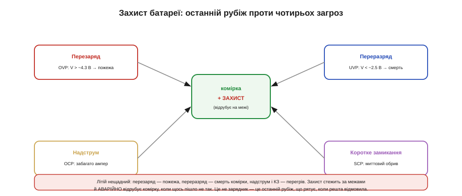
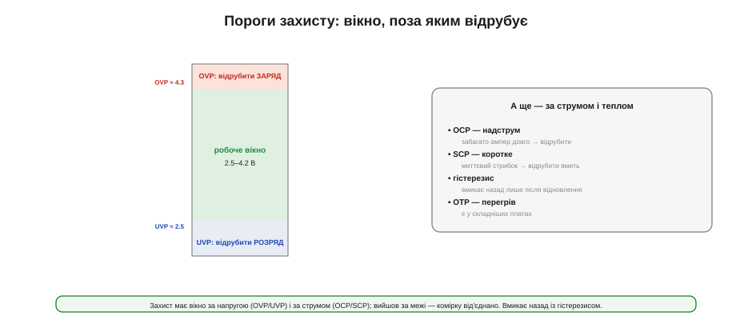
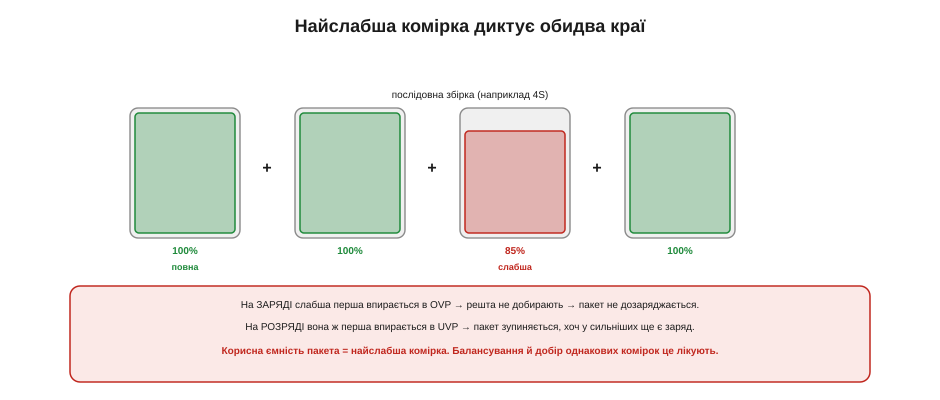

# Захист і BMS: від комірки до батареї

Усе, що відомо про [правильний заряд](book:electronics/li-ion-charger) і [дбайливий режим](book:electronics/battery-aging), справджується, **поки все йде як слід**. Але зарядник може вийти з ладу й погнати в комірку забагато; навантаження — закоротити; користувач — устромити батарею навпаки. Літій таких подій не пробачає: перезаряд здатен спричинити пожежу, глибокий розряд — убити комірку, коротке замикання — розжарити її до займання. Тому кожна літієва батарея потребує **вартового** — електроніки, що нічого не робить у нормі, але **аварійно відрубує** комірку, щойно щось вийшло за безпечні межі. Ось які пороги стереже захист, як влаштована найпростіша захисна плата, навіщо балансувати багатокоміркові збірки й де закінчується «плата за долар» і починається повноцінна **BMS**.

Ключова думка теми: **захист — це окремий, незалежний рівень оборони**, а не частина зарядника чи паливоміра. Зарядник дбає про норму, паливомір рахує заряд, а захист — це останній рубіж, що спрацьовує, коли все інше відмовило. Плутати ці ролі — типова й небезпечна помилка.

### Чотири загрози і вартовий

Захист стереже комірку від чотирьох головних бід, і кожна має свою абревіатуру, яку варто впізнавати в даташитах.


*Рис. Чотири загрози й вартовий, що відрубує комірку на межі: **OVP** (перенапруга — перезаряд, ризик пожежі), **UVP** (зниження напруги — глибокий розряд, смерть комірки), **OCP** (надструм) і **SCP** (коротке замикання). Захист — це не зарядник, а останній рубіж, що рятує, коли решта відмовила.*

Перелічимо їх. **OVP** (*over-voltage protection*) ловить **перезаряд**: якщо напруга комірки перевищила безпечну (десь 4.25–4.35 В), захист **розмикає заряд**, поки несправний зарядник не спалив комірку. **UVP** (*under-voltage protection*) ловить **глибокий розряд**: коли напруга впала нижче ~2.5 В, захист **розмикає розряд**, рятуючи комірку від незворотного пошкодження (саме тому глибоко розряджений пристрій інколи «не вмикається й не заряджається» — захист його від'єднав). **OCP** (*over-current*) реагує на надмірний струм, а **SCP** (*short-circuit*) — на миттєвий стрибок при короткому замиканні, відрубуючи комірку **вмить**. Спільне в усіх чотирьох — захист **не керує** нормальною роботою, він лише **обриває** ланцюг на аварії й знову з'єднує, коли загроза минула.

Корисно уявляти, що саме фізично коїться за кожною абревіатурою. **Перезаряд** заганяє в комірку забагато заряду: на електроді осідає металевий літій, електроліт розкладається з виділенням газу й тепла — звідси здуття й ризик займання. **Глибокий розряд** руйнує структуру: за надто низької напруги починає розчинятися мідний струмознімач, і комірка деградує незворотно. **Надструм і коротке** — це просте джоулеве тепло (I²R): великий струм миттєво розжарює комірку й провідники. У всіх випадках кінцева біда — **неконтрольований нагрів**, тож завдання захисту по суті одне: не дати комірці перейти межу, за якою тепло вже не спинити.

### Захисна плата за долар

Найдешевше втілення цього вартового висить буквально на кожному літієвому акумуляторі — це крихітна **захисна плата** (*protection board*, PCB/PCM). Усередині неї всього два класи компонентів, і знати їх корисно.


*Рис. Захисна плата вмикає в мінусову лінію комірки **два послідовні MOSFET** (окремий для заряду й для розряду) і **захисний чип** (DW01-клас), що міряє напругу комірки та струм (через опір самих ключів) і керує затворами. Вийшла напруга чи струм за межі — чип розмикає відповідний ключ, від'єднуючи комірку.*

Працює це елегантно просто. Два **MOSFET** (зазвичай у спареному корпусі, 8205-клас) стоять послідовно в лінії комірки — один відповідає за шлях заряду, другий за шлях розряду, тож кожен напрям можна обірвати **окремо**. Захисний чип (DW01-клас) увесь час міряє напругу комірки та струм (зручно — прямо за падінням на відкритих MOSFET, які заразом служать шунтом) і порівнює з порогами. Норма — обидва ключі відкриті, струм тече вільно. Перевищення OVP — чип закриває ключ заряду; UVP — ключ розряду; надструм чи КЗ — обриває все. Жодної прошивки, жодного налаштування: уся логіка зашита в аналоговий чип, і коштує таке копійки.

Є один підступний наслідок UVP, об який спотикаються новачки. Коли захист спрацював на глибокому розряді й розімкнув ключ, на **клемах** пакета напруга падає до нуля — хоча сама комірка ще жива на своїх ~2.5 В. Звичайний зарядник, побачивши «0 В», вирішує, що батарея мертва чи відсутня, і відмовляється заряджати. Через це «захищена» батарея здається безнадійно сівшою, хоч насправді це лише спрацював захист. Виходів кілька: деякі зарядники вміють дати короткий «будильний» імпульс, щоб захист відпустив; інколи комірку оживляють обережним малим струмом. Головне — пам'ятати, що 0 В на клемах захищеного пакета означають не «смерть», а «захист від'єднав».

Конкретні представники цього класу — захисний чип **DW01** і спарений MOSFET **8205**: саме їх найчастіше знаходять усередині дешевих 1S-пакетів, і їхній даташит показує закладені пороги напруги та струму.

### Пороги: вікно напруги й струму

Уся робота захисту зводиться до кількох **порогів**, і їх варто уявляти як «вікно», поза яким комірку від'єднують.


*Рис. Захист тримає комірку у вікні: вище OVP (~4.3 В) — обрив заряду, нижче UVP (~2.5 В) — обрив розряду, між ними — вільна робота. До напруги додаються пороги за струмом (OCP — тривалий надструм, SCP — миттєве КЗ) і в складніших платах за температурою (OTP). Вмикає назад захист із **гістерезисом**.*

Важлива деталь — **гістерезис**: пороги ввімкнення й вимкнення **не збігаються**. Захист спрацьовує на 4.3 В, але знову дозволяє заряд лише коли напруга впала помітно нижче; так само після UVP розряд відновлюється не на тому самому порозі, а вище. Без цього зазору захист «деренчав» би — вмикав і вимикав комірку на самій межі. Пороги за струмом теж мають свою логіку: **OCP** терпить помірне перевищення короткий час (щоб не реагувати на [законні струмові піки навантаження](book:electronics/battery-sag)), а **SCP** на справжнє коротке замикання відповідає миттєво. Складніші плати додають ще й **OTP** (захист за температурою). Усе це разом і є те «вікно» безпеки, у якому комірці дозволено жити.

Самі пороги — теж частина **хімії**, не універсальна константа. Усі числа вище (4.3 / 2.5 В) — для звичайного Li-ion. У **LiFePO4** робоче вікно інше (заряд лише до 3.65 В), тож і захист має інші пороги — OVP близько 3.8, UVP близько 2.0–2.5 В. Поставити «літієву» захисну плату на LiFePO4 (чи навпаки) — означає або дозволити перезаряд, або відрубати комірку завчасно. Тому захист добирають **під конкретну хімію**, рівно як і [зарядник](book:electronics/li-ion-charger): цифри порогів — не дрібниця, а паспорт безпеки саме цієї комірки.

### Захист — не зарядник і не паливомір

Варто окремо й твердо засвоїти межі ролей, бо їх постійно плутають. **Захисна плата не заряджає** комірку — вона лише дозволяє чи забороняє струм; зарядом керує окремий [зарядний чип](book:electronics/li-ion-charger) за алгоритмом CC/CV. **Захисна плата не рахує заряд** — для «скільки відсотків» є [паливомір](book:electronics/state-of-charge). Захист — це **запобіжник**, а не менеджер: він мовчить, поки все гаразд, і втручається лише в аварії.

Звідси практичний висновок: повний вузол живлення літієвого пристрою — це **три окремі речі**, що працюють разом: зарядник (нормальний заряд), захист (аварійний обрив) і, за потреби, паливомір (облік). У дешевих пристроях зарядник і захист можуть жити на різних платках, у дорожчих — інтегруватися в один чип, але **функції лишаються трьома**. Покладатися на захист як на «зарядник, що сам зупиниться на 4.2» — груба помилка: захист спрацює аж на 4.3, а це вже стрес для комірки. Захист — страхувальна сітка, а не нормальний робочий механізм.

Поза цими чотирма порогами трапляються й інші біди, від яких боронять окремо. **Переполюсування** (вставили батарею навпаки) здатне спалити і пристрій, і захист, тож на вході часто ставлять діод чи інший бар'єр — окремий рівень захисту живлення. А механічне **пошкодження** комірки електроніка вже не врятує: проколений чи розчавлений літій горить незалежно від того, що каже захисний чип, — тут до справи стає вже [конструкція й механіка батареї](book:electronics/battery-mechanics).

### Балансування: коли комірок кілька

Доки комірка одна (1S), захисту досить. Та щойно їх з'єднують **послідовно** (2S, 3S, 4S — [щоб дістати вищу напругу](book:electronics/li-ion-charger)), виникає нова біда: комірки **дрейфують** одна від одної. Навіть однакові спершу, з часом вони заряджаються трохи по-різному — і пакет потребує **балансування**, що вирівнює їхній заряд.


*Рис. **Пасивне** балансування зливає надлишок із повніших комірок через резистори в тепло — просто й дешево, та марнотратно й повільно. **Активне** переносить заряд із повних комірок у порожніші — ефективно, але складно й дорого. Без балансування послідовний пакет старіє нерівномірно й недодає ємності.*

Способів два, і вони — класичний компроміс «просто проти ефективно». **Пасивне** балансування на комірках, що зарядилися першими, **зливає** надлишок крізь резистори, перетворюючи його на тепло, поки відстаючі дотягнуться. Це просто й дешево (резистор плюс ключ на комірку), але енергію ми марнуємо, та й вирівнювання повільне. **Активне** балансування натомість **переносить** заряд із повних комірок у порожніші, нічого не палячи, — це ефективно, але потребує куди складнішої електроніки й коштує дорожче. У масовій техніці частіше бачимо пасивне (його досить); активне беруть там, де кожен відсоток і кожен джоуль на рахунку, — у великих тягових пакетах.

Варто знати й **коли** та **скільки** балансують. Найзручніший момент — кінець заряду ([фаза CV](book:electronics/li-ion-charger)): комірки близькі до повного, і дрейф між ними найвидніший, тож пасивні балансири саме тоді й зливають надлишок із тих, що вирвалися вперед. Струми балансування зазвичай **скромні** — десятки міліампер, — бо вирівнюють невелику різницю, накопичену за один цикл; через це повне вирівнювання сильно розбалансованого пакета може зайняти не один цикл. Тому балансування — це повільне, але невпинне підтримання ладу, а не разовий ривок: воно щодня потроху тримає комірки разом, а не «лагодить» пакет за раз.

### Найслабша диктує обидва краї

Чому ж балансування таке важливе? Бо в послідовному пакеті **найслабша комірка диктує поведінку всього пакета** — і на заряді, і на розряді.


*Рис. У послідовній збірці найслабша (чи найповніша) комірка першою впирається в межу: на заряді вона перша сягає OVP — і заряд спиняється, лишивши решту недозарядженими; на розряді вона перша падає до UVP — і пакет стає, хоч у сильніших ще є заряд. Тому корисна ємність пакета дорівнює найслабшій комірці.*

**Приклад (що відбирає розбаланс).** Візьмемо 4S пакет із комірок по 2000 мА·год, де одна трохи слабша.

```
Комірки: 2000, 2000, 1700 (слабша), 2000 мА·год

Без балансування — слабша диктує обидва краї:
   заряд:  слабша перша впирається в OVP → решта недозаряджені
   розряд: слабша перша впирається в UVP → пакет стає
   корисна ємність пакета ≈ 1700 (а не 2000) — мінус 15%

З балансуванням:
   заряд комірок вирівняно → пакет працює близько до 2000
   слабшу не «продавлюють» за межі → вона ще й старіє повільніше
```

Висновок подвійний. По-перше, **без балансування пакет недодає ємності** — він обмежений найслабшою ланкою, як конвой швидкістю найповільнішого. По-друге (і це важливіше), розбаланс **прискорює старіння**: слабшу комірку щоразу заганяють до самих меж, а робота на межі — це саме той [стрес, що вбиває літій](book:electronics/battery-aging). Тому балансування не лише повертає ємність, а й продовжує життя всьому пакету. До того ж самі комірки в збірку варто **добирати однаковими** — близькими за ємністю й опором, — щоб дрейф був меншим від початку.

### Спектр: від плати за долар до BMS

Зведімо все в єдину картину — **спектр** засобів захисту, від найпростішого до найскладнішого.


*Рис. Зліва направо: проста **захисна плата** (1S, чип + 2 FET, ~$1); **захист із балансуванням** для кількох комірок (плюс моніторинг кожної); і повноцінна **BMS** для великих пакетів — з обліком SoC/SoH, зв'язком (телеметрія) і тепловим керуванням. Чим більший і відповідальніший пакет — тим складніший потрібен рівень.*

Логіка вибору проста. Для **однієї комірки** (1S — переважна більшість малих пристроїв) досить простої захисної плати, яка часто вже **вбудована** в саму комірку (особливо в LiPo-пакетах). Для **кількох комірок послідовно** до захисту обов'язково додається **балансування** й помірний моніторинг кожної комірки. А для **великих пакетів** (транспорт, накопичувачі енергії) потрібна повноцінна **BMS** (*Battery Management System*) — система, що поєднує захист, балансування, облік [SoC](book:electronics/state-of-charge)/[SoH](book:electronics/battery-aging), зв'язок із рештою системи (телеметрія, аварійні відключення) і нерідко керування охолодженням чи підігрівом. По суті BMS — це «мозок» батареї, тоді як захисна плата — лише її рефлекс. Чим більший і відповідальніший пакет, тим вище по цьому спектру доводиться підніматись.

У повноцінній BMS додається й те, чого нема в простій платі, — **зв'язок**. Розумна батарея вміє доповісти системі свій заряд, здоров'я, температуру й помилки (часто по шині на кшталт I²C чи SMBus — так звана *smart battery*), а у великих пакетах BMS ще й керує силовим **контактором**, що від'єднує всю батарею в аварії чи на стоянці. Тобто з ростом пакета захист із пасивного рефлексу перетворюється на активного учасника системи, який не лише обриває струм, а й **розмовляє** з рештою пристрою. Саме цим — обліком, зв'язком і керуванням — повноцінна BMS і відрізняється від мовчазної плати за долар, хоч коріння в них спільне.

> 🔧 **Навіщо це.** Практичне правило одне: **жодного «голого» літію без захисту**. Навіть найдешевший пристрій із LiPo мусить мати захисну плату — це питання не зручності, а безпеки. Для багатокоміркових збірок до захисту обов'язково додають балансування, інакше пакет і ємність втратить, і швидко постаріє. А коли бачите в специфікації «BMS», уточніть, що саме вона вміє: просту захисну плату теж інколи гучно звуть BMS, хоча до справжнього менеджера батареї їй далеко.

### Підсумок теми

Кожен літій потребує **захисту** — вартового, що в нормі мовчить, а в аварії **відрубує** комірку. Він стереже чотири пороги: **OVP** (перезаряд), **UVP** (глибокий розряд), **OCP** (надструм) і **SCP** (коротке), з **гістерезисом** на ввімкнення. Найпростіше втілення — **захисна плата за долар**: чип (DW01-клас) плюс два послідовні MOSFET (8205-клас), що обривають заряд чи розряд окремо. Захист — це **окрема роль**, не [зарядник](book:electronics/li-ion-charger) (той веде CC/CV) і не [паливомір](book:electronics/state-of-charge) (той рахує); повний вузол поєднує всі три. Коли комірок **кілька послідовно**, додається **балансування** (пасивне — зливає надлишок у тепло; активне — переливає заряд), бо інакше **найслабша комірка** диктує обидва краї, відбираючи в пакета ємність і прискорюючи його старіння. А весь арсенал лягає в **спектр**: проста плата (1S) → захист із балансом (nS) → повна **BMS** із моніторингом, зв'язком і теплом (великі пакети). Залізне правило — **ніколи не лишати літій без захисту**. А поряд із електричним боком батарея має ще й **фізичний** — [механіку, конектори та поведінку при відмові](book:electronics/battery-mechanics), де електроніка вже безсила.
