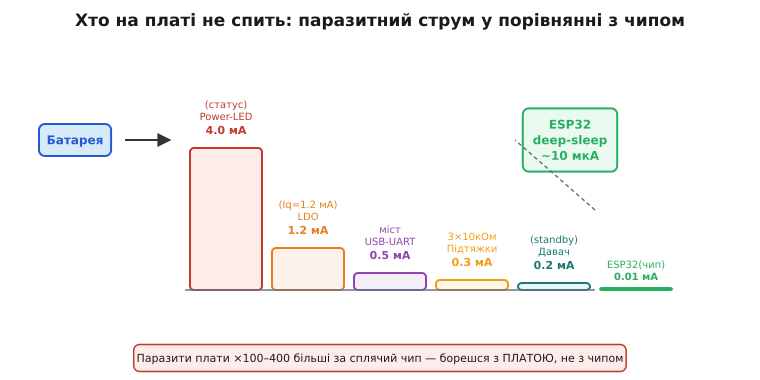
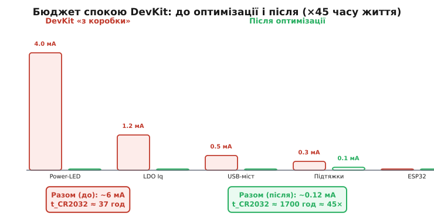

# Плата теж їсть: LDO, світлодіоди, підтяжки, давачі

Коли [виміряти струм спокою](book:electronics/measure-consumption) реальної плати, виявляється прикре: у спокої тече більше, ніж мав би чип сам. Винна — **плата навколо чипа**. Кожен її компонент потроху п'є струм, і вночі, коли чип спить у мікроамперах, ці «паразити» починають домінувати. Звідси гірка правда: зручна DevKit-плата для розробки майже ніколи не годиться для роботи від батареї.

**LDO-стабілізатор** — перший і найбільший підозрюваний. Лінійний стабілізатор має власний струм спокою Iq (quiescent current): він тече навіть коли чип нічого не споживає. Дешевий LDO може мати Iq = 1–5 мА. При чипі у deep-sleep з 8 мкА — LDO-паразит у сто разів більший. Спеціальні «low-Iq» LDO (Texas Instruments TLV702, Torex XC6220 тощо) мають Iq у одиниці мікроампер — різниця в тисячу разів. Вибір LDO часто є **найбільшим одиничним рішенням** у батарейному проєкті.

**Світлодіоди живлення і статусу** — «power LED» на DevKit горить завжди, споживаючи 1–5 мА залежно від резистора. Це у сто–п'ятсот разів більше, ніж сплячий чип. Перший пункт при переході від прототипу до батарейного виробу: викусити або не встановлювати power-LED.

**USB-UART міст**: чип-перетворювач (CP2102, CH340, FTDI) на DevKit живиться від тієї ж лінії 3.3 В і споживає кілька сотень мікроампер–кілька міліампер, навіть коли USB-кабель не підключений. У готовому виробі цього компонента немає — але на DevKit він є завжди. Деталі анатомії DevKit — у [🔌 ch20-s5-c-devkit.md](book:programming/esp32-architecture/comp-devkit.md).

**Підтяжки (pull-up/pull-down)**: кожен активний пін із підтяжкою через резистор тягне струм. Пін у стані HIGH і підтяжка 10 кОм до GND: I = 3.3 В / 10 кОм = 330 мкА. Десяток таких пінів — вже кілька мА. Зайві або занадто низькоомні підтяжки — часта пастка. Правило: у батарейному пристрої підтяжки або відключаються уві сні (через GPIO в режим Hi-Z), або обираються номінально 100 кОм і вище. Розрахунок оптимального номіналу — у [🧮 ch22-s4-m-pullup-value.md](book:electronics/floating-pullups/math-pullup-value.md).

**Давачі й периферія в standby**: зовнішній давач температури, акселерометр, барометр — усі мають власний режим standby зі своїм струмом споживання. Якісний давач у standby тягне 100–500 нА; дешевий або неправильно налаштований — може тягнути мікроампери або навіть сотні мікроампер. Перед deep-sleep треба явно переводити кожен давач у найглибший power-down командою через шину. Деталі — у [🔌 r13-s2-c-sensor-standby.md](book:programming/current-paths/comp-sensor-standby.md).



*Рис. Стовпчики паразитного струму від кожного компонента DevKit у спокої. Чип (крайній праворуч) майже невидимий — 0.01 мА. Сума паразитів — 6+ мА: у 600 разів більше.*

> 🔧 **Навіщо це.** Перший крок батарейного проєкту — поглянути на плату і спитати «що тут НЕ спить?». Power-LED і щедрий LDO з'їдять усе перш, ніж чип устигне поекономити. Бюджет спокою плати рахують поряд із бюджетом чипа — інакше місяці перетворюються на дні.

**Стратегії усунення паразитів.** Прибрати або відключити power-LED. Обрати low-Iq LDO (Iq < 10 мкА) — детальніше в [🔌 r13-s8-c-ldo-vs-buck.md](comp-ldo-vs-buck.md). Знеструмлювати цілі гілки плати через load switch або MOSFET на час сну — вся «зовнішня» периферія відключається від живлення, а будить чип зовнішній сигнал на RTC-GPIO (про [джерела пробудження](book:programming/wakeup-sources) докладніше, а апаратна частина — у [🔌 r13-s4-c-wake-hw.md](book:programming/wakeup-sources/comp-wake-hw.md)). Переводити кожен давач у power-down перед deep-sleep. Перевірити кожну підтяжку: чи дійсно потрібна, і чи не занадто низький номінал.

> 🔌 LDO проти buck-конвертора для батарейного пристрою — [r13-s8-c-ldo-vs-buck.md](comp-ldo-vs-buck.md). Quiescent current вирішує при мікроамперному навантаженні.

**Worked-приклад. Бюджет спокою DevKit.**

```
Компоненти DevKit у режимі спокою ESP32 (deep-sleep):

  Power-LED  (з резистором 330 Ом від 3.3 В): ~4.0 мА
  LDO Iq     (типовий AMS1117):               ~1.2 мА
  USB-UART міст (CP2102 без USB-кабелю):      ~0.5 мА
  3× підтяжки 10 кОм (лінії в активному стані): ~0.33 мА
  ESP32 deep-sleep:                            ~0.010 мА

  Разом:                                       ~6.04 мА
  Частка чипа:  0.010 / 6.04 ≈ 0.2%

Час від CR2032 (220 мА·год): 220 / 6.04 ≈ 36 год ≈ 1.5 доби

━━━━━━━━━━━━━━━━━━━━━━━━━━━━━━━━━━━━━━━━━━━━━━━
Після оптимізації:
  Power-LED:   прибрано                        → 0 мА
  LDO Iq:      замінено на low-Iq (TLV70233)  → 0.005 мА
  USB-UART:    немає в готовому виробі         → 0 мА
  Підтяжки:    замінено на 100 кОм             → 0.033 мА
  Давач:       standby після налаштування      → 0.0005 мА
  ESP32:                                       → 0.010 мА

  Разом:                                       ~0.048 мА = 48 мкА

Час від CR2032: 220 / 0.048 ≈ 4583 год ≈ 191 доба ≈ 6.3 місяця

Виграш: 4583 / 36 ≈ 127 разів — лише від плати, без зміни прошивки!
```



*Рис. Стовпчиковий бюджет до (ліворуч) і після оптимізації (праворуч). Основний виграш — power-LED та LDO. Після оптимізації чип стає помітним внеском, а не нанометровою смужкою на дні.*

---
