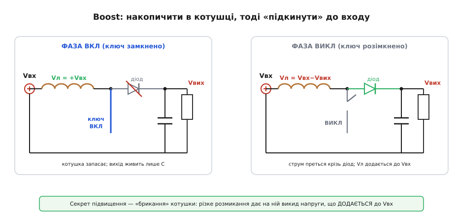
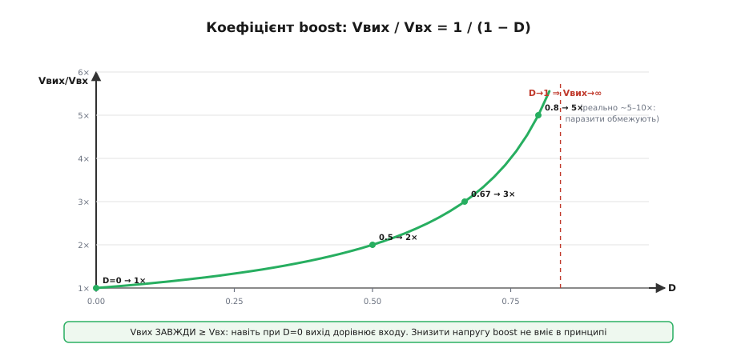
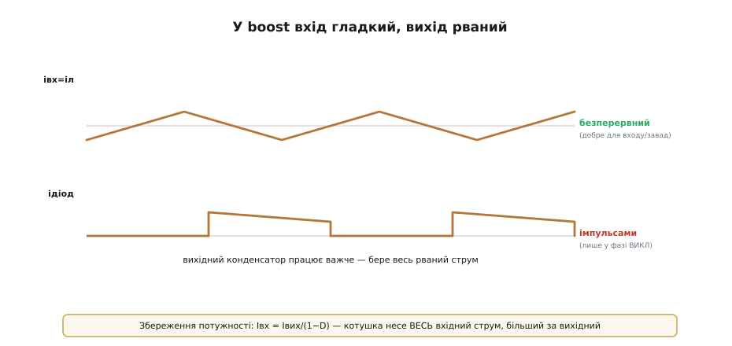
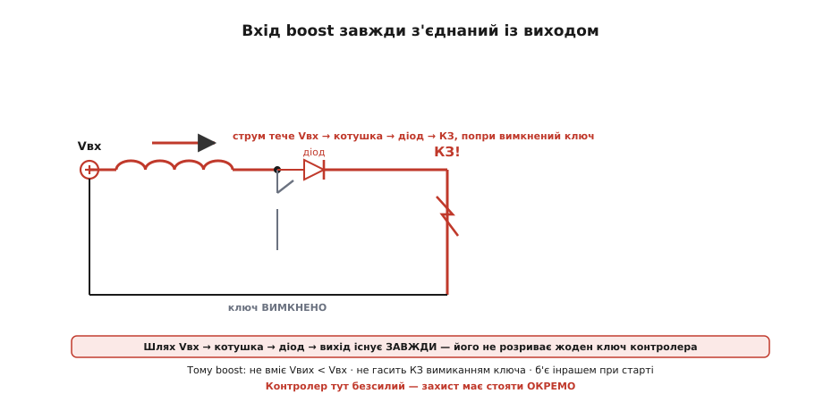
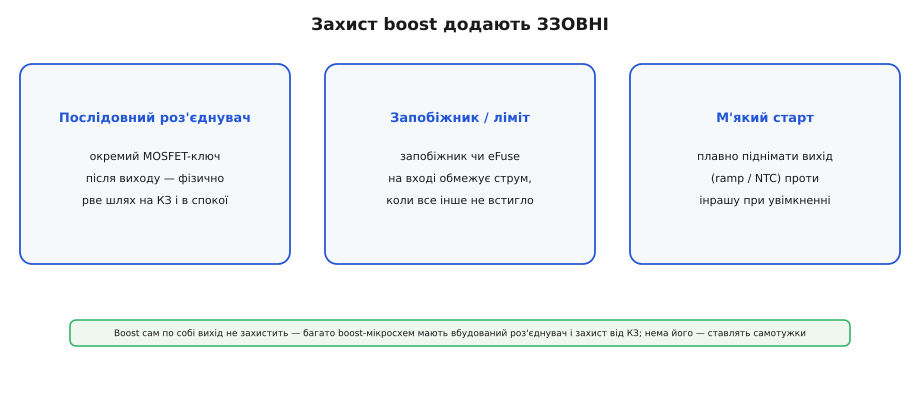

# Boost-перетворювач

Знизити напругу легко й інтуїтивно: рубаємо вхід на шматочки й усереднюємо менше. А ось задача на перший погляд парадоксальна: дістати на виході напругу **вищу**, ніж на вході. З однієї батарейки 3.7 В зробити 5 В для USB; з 5 В — 12 В для давача. Звідки взятися «зайвим» вольтам? Перетворювач, що це вміє, називають **boost** (англ. *boost* — «підняти, підсилити»; його ще звуть підвищувальним).

Одразу заспокоїмо інтуїцію: дарма́ нічого не береться. Енергію не порушено — boost **міняє струм на напругу**: піднімаючи напругу вдвічі, він удвічі зменшує доступний струм (потужність на вході ≈ потужність на виході). А механізм цього обміну — **[«брикання» котушки](book:electronics/inductor-kickback)**, той самий викид напруги, що псує ключі при різкому розмиканні струму. У boost його приборкано й поставлено на службу. Але разом із корисним трюком boost несе й підступну ваду, яку мусить знати кожен, хто його ставить.

### Дві фази: накопичити, тоді «підкинути»

Розкладка boost така: котушка стоїть **першою**, одразу за входом, а ключ кидає її вільний кінець на землю. Дві фази працюють так:


*Фаза ВКЛ: ключ замикає кінець котушки на землю, до неї прикладено всю Vвх — струм наростає, котушка запасає енергію; діод при цьому закритий, а вихід живить лише конденсатор. Фаза ВИКЛ: ключ розмикається, та струм котушки не уривається — він преться крізь діод у вихід, і напруга котушки тепер додається до Vвх, тож вихід бачить більше за вхід.*

- **Фаза ВКЛ** (ключ замкнено): вільний кінець котушки сидить на землі, тож до неї прикладено всю вхідну напругу, Vл = +Vвх. Струм лінійно наростає, котушка **запасає** [енергію магнітного поля](book:electronics/inductor-energy). Діод у цей час **закритий** (вихід стоїть вище, ніж вузол перемикання), і навантаження живиться самим вихідним конденсатором.
- **Фаза ВИКЛ** (ключ розімкнено): струмові котушки нема куди подітися, окрім як крізь **діод** у вихід. Тепер котушка ввімкнена **послідовно** з джерелом, і її викид напруги **додається** до Vвх — вихід отримує Vвх плюс «брикання». Напруга на котушці стала від'ємною: Vл = Vвх − Vвих (бо Vвих > Vвх).

Образно: у фазі ВКЛ ми **розганяємо** струм у котушці, запасаючи в ній енергію; у фазі ВИКЛ — різко «відпускаємо» його туди, де він додається до входу. Котушка працює помпою, що накачує енергію на вищий рівень порціями.

Звідки ж беруться «зайві» вольти? Ключ у тому, що у фазі ВИКЛ котушка перетворюється на **джерело напруги, увімкнене послідовно з батареєю**. Котушка так чинить [опір зміні струму](book:electronics/inductor-kickback), що готова сама створити будь-яку напругу, аби струм не урвався. Коли ключ розмикається, вона «бачить» спробу обнулити струм — і виставляє рівно таку напругу свого «брикання», щоб проштовхнути той самий струм далі, у вихід. Ця напруга додається до Vвх послідовно, як дві батарейки в ряд, — і вихід піднімається вище за вхід. Вищий вихід вимагає більшого «брикання», тобто крутішого спаду струму, — а його забезпечують довшою фазою ВКЛ, тобто більшою **шпаруватістю** D (англ. *duty cycle* — частка періоду, коли ключ відкрито). Ось чому що більший D, то вища напруга.

### Закон дає коефіцієнт: Vвих = Vвх/(1−D)

Жодних нових формул запам'ятовувати не треба — застосуймо **вольт-секундний баланс**: в усталеному режимі котушка за період не накопичує енергії, тож сума «вольт-секунд» (напруга × тривалість) за два такти дорівнює нулю. Напишемо напругу на котушці у двох фазах і прирівняймо вольт-секунди до нуля:

```
фаза ВКЛ (частка D):    Vл = Vвх
фаза ВИКЛ (частка 1−D): Vл = Vвх − Vвих

баланс (сума вольт-секунд = 0):
   Vвх · D  +  (Vвх − Vвих) · (1 − D)  =  0
   Vвх · D  +  Vвх − Vвих − Vвх·D + Vвих·D  =  0
   Vвх − Vвих · (1 − D)  =  0
   ⇒  Vвих = Vвх / (1 − D)
```


*Vвих/Vвх = 1/(1−D). При D=0 вихід дорівнює входу, при D=0.5 — подвоюється, при D=0.8 — уп'ятеро, а коли D наближається до одиниці, коефіцієнт теоретично злітає в нескінченність. На практиці паразитні опори обмежують реальне підвищення приблизно 5–10 разами. Головне: Vвих **завжди ≥ Vвх** — нижче входу boost не вміє.*

Формула одразу пояснює характер boost. При D=0 (ключ ніколи не вмикається) Vвих = Vвх — тобто навіть «нічого не роблячи», boost пропускає вхід на вихід. Зі зростанням D вихід росте, а біля D→1 теоретично прямує в нескінченність — насправді ж паразитні опори котушки й ключа зрізають реальну стелю до ~5–10×.

**Приклад (boost із літію в USB).** Одна банка LiPo (3.7 В номінал) → 5 В:

```
Vвих = Vвх / (1 − D)   ⇒   1 − D = Vвх / Vвих = 3.7 / 5 = 0.74
   D = 0.26   (ключ відкрито 26% циклу)

струм: при ККД ≈ 90% віддати 5 В × 1 А = 5 Вт
   треба з входу  ≈ 5 / 0.9 / 3.7 ≈ 1.5 А
   тобто вхідний струм у ~1.5 раза більший за вихідний
```

Останній рядок — важливий: boost **піднімає напругу, але опускає струм**. Котушка несе весь цей більший **вхідний** струм (Iвх = Iвих/(1−D)), і саме під нього її добирають, а не під вихідний.

Це та сама логіка [«перетворювача як DC-трансформатора»](book:electronics/switching-converter), лише обернена. [Buck](book:electronics/buck) схожий на трансформатор, що знижує напругу й піднімає струм; boost — на той, що **підвищує напругу й знижує струм**. В обох потужність майже не змінюється (енергію ж не порушено), просто перерозподіляється між «вольтами» й «амперами». Тому, проєктуючи boost, завжди звіряйтеся з боку входу: щоб віддати скромні 5 Вт на підвищеній напрузі, перетворювач може смоктати з низьковольтної батареї помітно більший струм — і це б'є по дротах, роз'ємах і самій батареї ([просадка напруги під навантаженням](book:electronics/battery-sag)).

Звідси й практична стеля коефіцієнта. Теоретично D→1 дає нескінченне підвищення, та в житті вище ~5–10× boost ідуть рідко, і ось чому. По-перше, зі зростанням D вхідний струм Iвх = Iвих/(1−D) злітає — а на ньому паразитні опори (котушки, ключа, дроту) палять усе більше, тож ККД помітно падає. По-друге, ключ і діод мусять витримувати повну вихідну напругу, яка тим часом росте. По-третє, чим ближче D до одиниці, то менше лишається часу фази ВИКЛ, щоб устигнути перекинути всю накопичену енергію у вихід. Тому глибоке підвищення роблять не одним boost, а інакше — двокаскадно або іншою топологією.

> 🔧 **Навіщо це.** Boost усюди, де джерело нижче за потрібну напругу: одна банка літію (3.0–4.2 В) → стабільні 5 В; живлення ланцюжка світлодіодів, яким сумарно треба десятки вольт; підсвітка, біас давачів, невеликі високовольтні шини. Скрізь тут діє те саме правило: дивіться на **вхідний** струм і пам'ятайте, що такий вузол не знизить напругу й не захистить себе від КЗ — це визначає і добір котушки, і потребу в зовнішньому роз'єднувачі.

### Вхід гладкий, вихід рваний

У boost є ще одна риса, дзеркальна до [buck](book:electronics/buck). Котушка тут стоїть на **вході** й проводить струм **безперервно** — тож вхідний струм гладкий, що добре для джерела й для завад. А от **вихід** дістає струм лише у фазі ВИКЛ, коли відкривається діод, — імпульсами.


*Вхідний (він же котушковий) струм гладкий, а у вихід енергія йде ривками — лише поки відкритий діод. У buck дзеркально: гладкий вихід, рваний вхід. Тому вихідний конденсатор у boost працює важче й має ковтати весь цей рваний струм.*

> 🔧 **Навіщо це.** Дві практичні поради добору. Котушку boost рахують під **вхідний** струм (він більший за вихідний — Iвх = Iвих/(1−D)), інакше вона насититься. А вихідний конденсатор боїться рваного струму — туди ставлять якісну кераміку з низьким ESR і добрим запасом за пульсаційним струмом, бо весь діодний імпульс лягає на нього.

### Чому boost вредніший у керуванні

Є в boost і тонкість, через яку його зворотний зв'язок налаштовувати важче, ніж у buck, — і зрозуміти її можна суто на пальцях, без жодної теорії керування. Уявіть, що навантаження зросло й вихід просів — контролер хоче його **підняти**. Природний хід: збільшити шпаруватість D. Але подивімося, що означає довша фаза ВКЛ: довше ключ тримає котушку на землі, а в цей час вихід **відрізаний** від котушки й живиться **лише конденсатором**. Тобто, збільшивши D, контролер у перший момент не підняв вихід, а **ще дужче його просадив** — і аж потім, коли накопичена в котушці енергія ринула у вихід, напруга пішла вгору.

Виходить «зворотна реакція»: правильна дія дає спершу неправильний, протилежний результат, а потрібний — із запізненням. Така система схильна **розгойдуватися**, тож контур boost навмисно роблять повільнішим і обережнішим, ніж у buck. Рахувати тут нічого не доведеться — досить практичного критерію [«реакція на стрибок без дзвону»](book:electronics/feedback-stability), — але корисно знати причину: якщо boost на платі схильний дзвеніти на перехідних, винна саме ця вроджена «вредність» підвищувальної топології, а не лише погані номінали.

### Чому boost не можна вимкнути: прозорість для КЗ

А тепер — найважливіша практична засторога цієї теми, та сама вада. Придивіться до схеми boost: від входу до виходу веде ланцюжок **Vвх → котушка → діод → вихід**. І цей ланцюжок існує **завжди** — він не проходить крізь ключ. Хоч би що робив контролер зі своїм транзистором, котушка з діодом лишаються прямим дротом від входу до виходу.


*Шлях Vвх → котушка → діод → вихід не розриває жоден ключ контролера. Тому замкніть вихід — і струм поллється просто з входу крізь котушку й діод у коротке замикання, навіть коли ключ вимкнено. Контролер не може цьому зарадити: його транзистор стоїть збоку від цього шляху.*

З цього випливають **три** наслідки, кожен із яких кусає на практиці:

1. **Boost не вміє знизити напругу.** Навіть при D=0 вихід дорівнює входу (через ту саму котушку й діод). Якщо вхід раптом підскочив вище за ціль — boost безсилий його опустити.
2. **Boost не гасить КЗ на виході.** Замкнули вихід — і вимикання ключа **нічого не дає**: вхід жене струм крізь котушку й діод у коротке замикання, обмежений лише опором джерела й дроту. Прикиньмо в числах: джерело 5 В, а весь шлях (опір котушки + діод + дроти) — якісь 0.1 Ом. Тоді струм КЗ ≈ 5 / 0.1 = **50 А** — у рази понад розрахунок діода й котушки, тож вони згоряють за мить. Контролер тут безсилий: його транзистор стоїть осторонь цього шляху.
3. **Boost б'є інрашем при старті.** У момент увімкнення вихід ще на нулі, тож вихідний конденсатор заряджається крізь котушку й діод одним великим кидком струму — таким пусковим кидком (англ. *inrush* — «вкид, напливання»).

> 🔧 **Навіщо це.** Запам'ятайте як аксіому: **boost не захищає власний вихід**. Ніколи не розраховуйте, що «контролер вимкне ключ і врятує від КЗ» — він не врятує. Якщо вашому пристрою потрібен захист виходу від замикання чи можливість його знеструмити — це доведеться будувати окремо.

### Що з цим робити

Раз сам boost вихід не захистить, захист **додають зовні**:


*Три типові засоби: послідовний ключ-роз'єднувач (окремий MOSFET, що фізично рве шлях на КЗ і в режимі спокою), запобіжник чи eFuse на вході (обмежує струм, коли все інше не встигло), і м'який старт проти інрашу. Багато boost-мікросхем уже містять роз'єднувальний MOSFET — варто перевірити даташит.*

- **Послідовний роз'єднувач** (*disconnect / load switch*): окремий MOSFET після виходу, який можна **фізично розімкнути** при аварії чи в режимі спокою — він і рве шлях для КЗ.
- **Запобіжник чи eFuse на вході**: остання лінія, що обмежує струм, коли захист не встиг.
- **М'який старт** (*soft-start*): плавно піднімати вихід при ввімкненні (ramp, NTC чи поступове відкривання послідовного ключа), щоб прибрати інраш.

Багато сучасних boost-мікросхем уже містять вбудований роз'єднувальний MOSFET і захист від КЗ — тоді половина цих турбот знята. Але якщо чип «голий», усе перелічене лягає на плечі розробника.

### Коли самого boost замало

Уся ця механіка тримається на одному обмеженні: boost уміє гнати напругу **лише вгору**. Поки джерело завжди нижче за ціль — одна банка літію під 5 В шини — цього досить. Та щойно вхід **гуляє навколо** виходу (заряджена батарея вище за ціль, розряджена — нижче), boost безсилий: опустити він не вміє, а прямий шлях Vвх → котушка → діод усе одно протече вихід наскрізь. Тоді потрібна топологія, що працює в **обидва** боки — [buck-boost](book:electronics/buck-boost): вона тримає сталий вихід, хай вхід вищий чи нижчий за нього.

---
