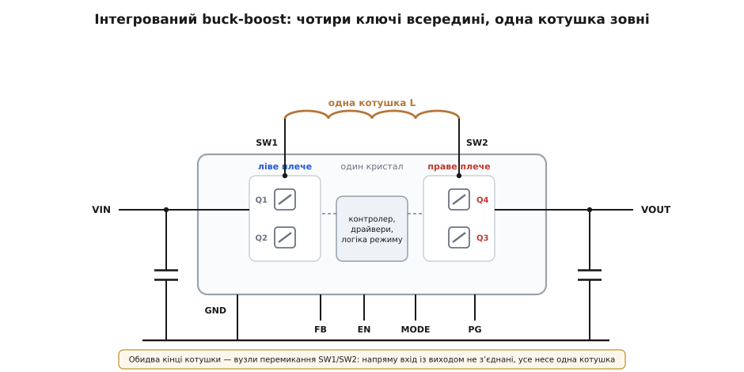
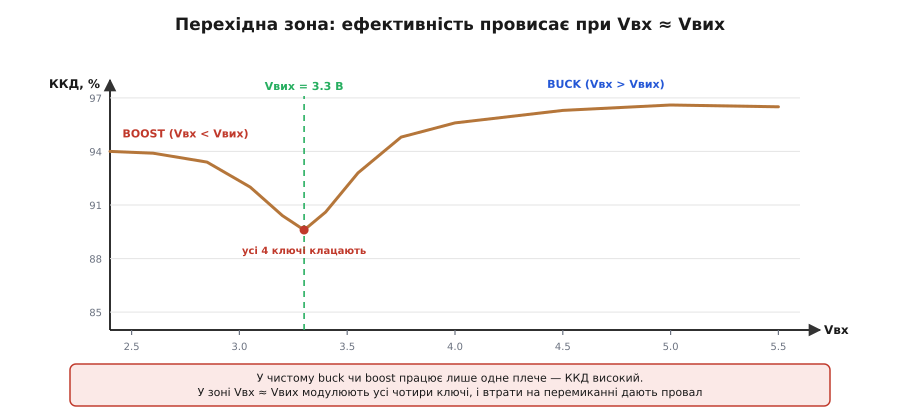

# 🔌 Інтегрований buck-boost регулятор

> [Чотириключова buck-boost топологія](topic:electronics/buck-boost) — два півмости довкола однієї котушки — на практиці майже завжди приходить **однією мікросхемою**: усі чотири ключі, їхні драйвери й логіка вибору режиму вже зведені на одному кристалі. Назовні ти даєш лише **одну котушку** (між двома вузлами перемикання), вхідний та вихідний конденсатори й дільник, що задає вихідну напругу, — а чип сам вирішує, працювати йому buck, boost чи у змішаному режимі, поки вхід повзе крізь вихід. Тут — як така мікросхема підключена, що роблять її ніжки, як вона сама обирає режим і де цей клас спотикається.

## Що ховає корпус

Розкривши такий регулятор, побачиш зібраний і узгоджений ще на заводі весь силовий каскад чотириключового перетворювача:

- **чотири силові MOSFET** — два півмости, ліве й праве плече: той самий місток, що в дискретній схемі довелося б паяти з окремих [транзисторів](topic:electronics/mosfet-power-switch);
- **драйвери затворів** із bootstrap для верхніх ключів і вивіреним **мертвим часом**, щоб у жодному плечі верхній і нижній ключ не відкрилися разом і не дали наскрізний струм;
- **контролер зі зворотним зв'язком** — зазвичай струмового типу, з поцикловим лімітом струму;
- **логіка режиму** — схема, що стежить за співвідношенням входу й виходу й перемикає стратегію buck ↔ boost ↔ змішаний.

Чому це варто інтегрувати, а не зібрати з розсипу? Бо найделікатніше в чотириключовому перетворювачі — не самі ключі, а **узгодження між ними**: мертвий час одразу на двох півмостах, плавна передача естафети від buck-режиму до boost-режиму без провалу на виході, поцикловий захист струму. Звести це дискретно — означає вручну припасувати драйвери, компаратори переходу й [компенсацію петлі](topic:electronics/feedback-stability) так, щоб вони не сварилися; найменша похибка тут легко обертається або наскрізним струмом у плечі, або дзвоном на самій межі режимів. Виробник робить цю інженерію раз, вивіряє її на кристалі — і продає готовою. Дискретний чотириключовий контролер із зовнішніми MOSFET теж існує (для десятків ват, де все тепло не звести в один корпус), але у звичному діапазоні портативного живлення — від часток до одиниць ампера — править саме інтегрований регулятор.

> 🔧 **Навіщо це.** Коли треба тримати **додатні** 3.3 чи 5 В з джерела, що гуляє навколо цілі — одна банка літію, бортова мережа, довгий USB-кабель, — інтегрований buck-boost закриває задачу одним корпусом і однією котушкою. Ти не розводиш чотири затвори й не виставляєш мертвий час: береш готовий, перевірений силовий каскад і дбаєш лише про обв'язку довкола. На прототипі й малій серії це майже завжди найрозумніший шлях.

## Котушка між двома вузлами перемикання

Ось перша річ, що збиває з пантелику, коли вперше розводиш таку мікросхему. У звичайному [понижувачі](topic:electronics/buck) котушка йде від вузла перемикання до **виходу**; у [підвищувачі](topic:electronics/boost) — від **входу** до вузла перемикання. А тут котушку вмикають **між двома ніжками самого чипа** — SW1 і SW2, — і жодна з них не сидить ні на вході, ні на виході напряму.

Причина проста, щойно згадати топологію. Єдина котушка чотириключової схеми стоїть **між двома плечима**: її лівий кінець — це середня точка лівого півмоста, правий кінець — середня точка правого. Мікросхема ховає обидва плечі всередині, а назовні виводить рівно ці **дві середні точки** як SW1 і SW2. Тобі лишається покласти впоперек них одну котушку — і силовий каскад замкнено.


*Чотири ключі двома плечима сидять на кристалі; назовні виходять лише дві середні точки — SW1 і SW2, — і одна котушка лягає між ними. Вхід заходить у ліве плече, вихід знімається з правого, а контролер із логікою режиму керує обома. Котушка нікого не з'єднує з входом чи виходом напряму — вона єдиний місток, як і в дискретній схемі.*

З цього випливає практичний наслідок, про який легко забути: **обидва** кінці котушки — це вузли перемикання, що смикаються щотакту. У понижувачі один кінець котушки спокійний (сидить на виході крізь конденсатор), у підвищувачі — інший (на вході). Тут спокійних кінців немає: і SW1, і SW2 — гарячі, з крутими фронтами напруги. Тому й [розводити](topic:electronics/converter-layout) треба **обидва** вузли коротко і щільно, тримати мідь під котушкою помірною (вузол перемикання — випромінювач завад), а не сподіватися, що «один бік усе одно тихий».

## Ніжки й що вони роблять

Зовні регулятор навмисне простий — жменя ніжок, і майже всі ті самі від виробника до виробника:

```
VIN        вхід живлення; сюди вхідний конденсатор, упритул до ніжки
SW1, SW2   два вузли перемикання; між ними — ОДНА зовнішня котушка
VOUT       вихід; сюди вихідний конденсатор (і вхід для зворотного зв'язку)
GND/PGND   сигнальна й силова земля
FB         feedback: вхід зворотного зв'язку; дільник від VOUT задає напругу
EN         enable: «1» вмикає чип і запускає м'який старт
MODE       режим на легкому навантаженні (сталий PWM проти енергоощадного)
PG         power-good: чип сам каже «вихід у нормі»
```

**FB** працює так само, як у будь-якому стабілізаторі: дільник від виходу задає напругу, а контролер тримає на FB свою опорну Vfb. Звідси й вихідна напруга:

```
Vвих = Vfb·(1 + Rверх/Rниз)
напр.  Vfb = 0.8 В, Rниз = 10 кОм, Vвих = 3.3 В:
Rверх = Rниз·(Vвих/Vfb − 1) = 10·(3.3/0.8 − 1) ≈ 31.3 кОм
```

Частина регуляторів — із **фіксованим виходом**: FB заведено прямо на VOUT, а дільник сидить усередині. Упізнаєш такий за відсутністю ніжки FB і за фіксованим числом у назві — підбирати резистори не треба, але й посунути напругу не вийде.

**EN** — це не просто вмикач. Поріг на EN дає старт «за входом» (поки VIN не піднявся, чип спить), а сам перехід у роботу йде через **м'який старт**: опорна напруга наростає не миттєво, а за визначений час. Навіщо саме так — нижче, у граблях про кидок струму.

**MODE** задає поведінку на **легкому навантаженні**. У режимі сталого PWM (forced-PWM) чип перемикає з фіксованою частотою завжди, навіть коли віддає міліампери: частота передбачувана (добре, коли поряд чутливе радіо), але на спокої він марно ганяє струм крізь ключі. У енергоощадному режимі (PFM/PSM) на малому струмі чип **пропускає такти**, прокидаючись лише підкинути заряд у вихід, — струм спокою падає на порядок, але частота гуляє і в спектрі з'являються низькі складові. Один пін, а різниця для живлення «сплячого» пристрою — між тижнем і місяцем від тієї самої банки.

**PG** — відкритий стік, що підтягується вгору, коли вихід вийшов на норму; цим сигналом дозволяють старт наступного вузла в системі.

У прошивці аналоговий регулятор нічим не «програмують» — він працює сам, а код торкається лише дискретних ліній EN і PG:

```c
// Увімкнути buck-boost-шину 3.3 В і дочекатися підтвердження норми.
gpio_set(BB_EN, 1);                   // дозвіл на ніжку EN — пішов м'який старт

uint32_t t0 = millis();
while (!gpio_read(BB_PG)) {            // чекаємо power-good від регулятора
    if (millis() - t0 > 8) {          // 8 мс не піднявся — несправність шини
        fault(FAULT_RAIL_3V3);
        return;
    }
}
// PG = 1 → 3.3 В у межах; далі можна будити решту системи
```

## Як чип сам перемикає buck / boost / змішаний

Уся хитрість регулятора — у тому, що ніхто йому ззовні не каже, який зараз режим. Він **сам** дивиться на співвідношення входу й виходу (прямо чи опосередковано — за тим, чи не вперлася скважність у свою межу) і обирає стратегію:

- **Vвх помітно > Vвих** — ліве плече перемикає як чистий buck, а праве тримає наскрізний прохід (верхній ключ правого плеча просто відкритий). Працює одне плече — як звичайний понижувач.
- **Vвх помітно < Vвих** — навпаки: праве плече перемикає як boost, ліве тримає прохід. Знов одне плече — як звичайний підвищувач.
- **Vвх ≈ Vвих** — жодне плече саме не дотягує, тож обидва модулюють у **змішаному** режимі, передаючи одне одному естафету.

Щоб на самій межі чип не «торохтів», перескакуючи туди-сюди щотакту, перемикання роблять із **гістерезисом**: поріг переходу вниз і вгору рознесено. І, що головне для ефективності, добра логіка намагається **проскочити** змішану зону якомога швидше й не сидіти в ній без потреби — бо саме там, де клацають усі чотири ключі, ККД найнижчий.

Твій важіль тут лише один, і його закладають **на етапі вибору**: діапазон входу, на який ти проєктуєш. Якщо номінальна робоча точка припадає рівно на Vвх ≈ Vвих, перетворювач більшість часу житиме у найгіршій для себе зоні. Тому котушку, частоту й сам регулятор підбирають так, щоб типовий вхід лежав упевнено в buck- або boost-області, а змішану зону система **проминала**, а не оселялася в ній.

**Приклад (струм насичення котушки).** Одна банка літію → 3.3 В, Iвих = 1 А. Найгірший для котушки випадок — **найнижчий вхід**, Vвх = 2.7 В (глибокий boost), ККД ≈ 0.9, котушка L = 2.2 мкГн, частота fsw = 1.2 МГц:

```
У boost-режимі котушка несе ВХІДНИЙ струм — а він вищий за вихідний:
Pвих = Vвих·Iвих   = 3.3 · 1            = 3.3 Вт
Iвх  = Pвих/(η·Vвх) = 3.3 / (0.9 · 2.7)  ≈ 1.36 А      ← середній струм котушки

Пульсація котушки (boost, D = 1 − Vвх/Vвих = 1 − 2.7/3.3 = 0.182):
ΔIL  = Vвх·D/(L·fsw) = 2.7 · 0.182 / (2.2e-6 · 1.2e6) ≈ 0.19 А

Піковий струм котушки:
IL,пік = Iвх + ΔIL/2 = 1.36 + 0.09 ≈ 1.45 А

Запас над піком (і над лімітом струму чипа) ~1.3×:
Isat ≥ 1.3 · 1.45 ≈ 1.9 А   → котушка на Isat ≈ 2 А
```

Висновок прямий: котушку треба брати **за піком у boost-режимі**, а не за вихідним 1 А. Тут піковий струм у півтора раза вищий за струм навантаження — і це **до** запасу. Візьмеш «на 1 А під вихід» — і на сідаючій банці котушка [насититься](topic:electronics/converter-inductor): її індуктивність обвалиться, струм стрибне, і далі або спрацює поцикловий захист (живлення «ікає»), або згорять ключі.

## Типові граблі класу

- **Робоча точка в перехідній зоні.** Якщо номінальний вхід припадає на Vвх ≈ Vвих, перетворювач сидить там, де клацають усі чотири ключі, а [втрати на перемиканні](topic:electronics/gate-capacitance) найбільші. На графіку ефективності з даташита це видно як провал рівно на межі buck/boost — і нагрів там, де його не чекав. Лікується вибором діапазону: хай типова точка лежить у чистому buck або boost, а змішану зону система проминає.


*ККД від вхідної напруги при фіксованому виході 3.3 В. У чистому buck (вхід вищий) і чистому boost (вхід нижчий) працює лише одне плече — ефективність висока й рівна. У вузькій зоні Vвх ≈ Vвих модулюють усі чотири ключі, і втрати на перемиканні дають характерний провал. Тому робочу точку проєктують **подалі** від цієї зони.*

- **Котушку беруть за середнім струмом, а не за піком у boost.** Класична причина «чомусь насичується»: пік у boost-режимі помітно вищий за струм навантаження (приклад вище). Рахуй Isat за найнижчим входом і додавай запас над лімітом струму чипа.
- **Недооцінені конденсатори.** На відміну від чистого buck (де вихідний струм безперервний) чи чистого boost (де безперервний вхідний), у buck-boost **обидва** боки бачать рваний струм у різних фазах циклу. Тому й вхідний, і вихідний [конденсатори](topic:electronics/converter-caps) мають бути керамікою з малим ESR, розрахованою на свій пульсаційний струм, і стояти впритул до VIN/PGND та VOUT/PGND. Замалий вхідний конденсатор дає просадки на вході в boost-фазі, замалий вихідний — пульсацію на виході.
- **Кидок струму при вмиканні.** Подаси «1» на EN без оглядки — і регулятор кинеться заряджати вихідний конденсатор та всю ємність за ним одним махом. Цей кидок або провалює слабке джерело, або б'є в поцикловий захист, і старт зривається в «ікавку». Рятує **м'який старт**: він розтягує наростання опорної напруги в часі, обмежуючи струм заряду. На велику вихідну ємність м'який старт іноді доводиться навмисне подовжувати (зовнішнім конденсатором на відповідній ніжці, якщо чип це дозволяє).
- **Не той режим на легкому навантаженні.** Лишиш forced-PWM під «сплячий» пристрій — даремно палиш струм спокою; лишиш PFM під чутливе до завад радіо — впускаєш у спектр низькочастотну пульсацію від пропуску тактів. Пін MODE обирають **під конкретну шину**, а не «як вийшло».

> 🔧 **Навіщо це.** Більшість «незрозумілих» бід інтегрованого buck-boost — це одна з п'яти вище: котушка за струмом не та, конденсатор замалий, робоча точка в провалі ефективності, кидок на старті або хибний режим спокою. Жодна не вимагає лізти всередину чипа — усі лікуються обв'язкою й вибором діапазону. Тому перше, що варто перевірити на гарячому чи «ікаючому» регуляторі, — саме ці п'ять, по черзі.

## Як упізнати такий компонент

Готових родин на ринку багато, і всі влаштовані однаково — різняться лише струмом, входом та корпусом. У переліку їх видно за словами «buck-boost» і «4-switch», за **діапазоном входу, що накриває вихід** (типове «2.5–5.5 В на вході → 3.3 В на виході» — прикмета саме buck-boost, а не buck чи boost окремо), і за парою ніжок SW1/SW2 (іноді підписаних L1/L2) під **одну** котушку. Керування — звичні EN, FB, MODE, PG; контролер і [частоту](topic:electronics/controller-fsw) зашито всередині. Конкретні партномери з їхніми числами — струмом, входом, частотою, корпусом — це вже матеріал каталогу, а не цієї статті: тут важливий **сам клас** і те, як він влаштований. Принцип — один корпус, одна котушка між двома вузлами перемикання, автоматичний вибір режиму — однаковий для будь-якого виробника.
