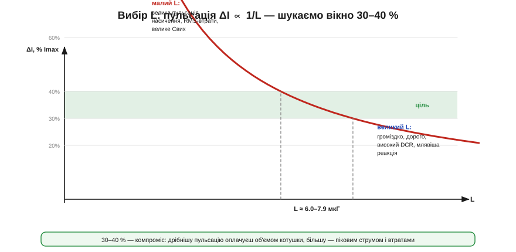

# 🧮 Пульсації струму котушки: вибір L через ΔI = 30–40 %

> Математична вставка про [buck-перетворювач](book:electronics/buck): як із пульсації струму ΔI покроково дістати **індуктивність** котушки — найперше число при проєктуванні buck.

### Означення

Котушку в перетворювачі добирають не «навмання», а від цільової **пульсації струму** ΔI. Правило-орієнтир: пульсація має бути **30–40 % від максимального струму навантаження**:

```
ΔIціль = (0.3 … 0.4) · Iнаван,макс
```

Звідси й рахують потрібну індуктивність. Пульсація струму в [buck-перетворювачі](book:electronics/buck) дорівнює:

```
ΔI = (Vвх − Vвих) · D / (L · f),     де D = Vвих/Vвх
```

Розв'язавши відносно L:

```
L = (Vвх − Vвих) · D / (ΔIціль · f)
```

### Інтуїція: чому саме 30–40 %

Чому не зробити пульсацію якомога меншою? Бо за все платять. **Замала** ΔI вимагає **великого** L (формула: L ∝ 1/ΔI), а велика котушка — це об'єм, ціна, більший опір дроту (DCR, а отже втрати й нагрів) і повільніша реакція на стрибок навантаження. **Завелика** ΔI теж кусає: пікове значення струму росте (а з ним ризик **насичення** осердя й RMS-втрати), і вихідному конденсатору важче згладити велику пульсацію. Між цими двома бідами й лежить вікно 30–40 % — практичний компроміс, перевірений десятиліттями.


*Пульсація обернено пропорційна до L (ΔI ∝ 1/L). Цільова смуга 30–40 % перетинає криву у вузькому **вікні L**: лівіше (малий L) — завелика пульсація з насиченням і втратами, правіше (великий L) — громіздко й дорого. Беруть найближчий стандартний номінал усередині вікна.*

### Формальний апарат: наскрізний розрахунок

Один тонкий момент: для buck пульсація **найбільша за найвищої вхідної напруги**. Підставивши D = Vвих/Vвх, маємо ΔI = Vвих·(Vвх−Vвих)/(Vвх·L·f) — і зі зростанням Vвх цей вираз росте. Тому котушку рахують для **найгіршого випадку — максимального Vвх**.

**Приклад.** Buck від 4S-батареї (12.0–16.8 В) до 5 В, максимальний струм Iнаван = 3 А, частота f = 500 кГц. Цілимо в ΔI = 40 % від 3 А = 1.2 А, найгірший Vвх = 16.8 В:

```
D (при Vвх=16.8) = Vвих/Vвх = 5 / 16.8 = 0.298
L = (Vвх − Vвих)·D / (ΔIціль·f)
  = (16.8 − 5)·0.298 / (1.2 · 500·10³)
  = 11.8 · 0.298 / 600000
  = 3.516 / 600000 ≈ 5.86·10⁻⁶ Гн ≈ 5.9 мкГ
```

Беремо найближчий стандартний номінал **6.8 мкГ** і перераховуємо реальну пульсацію:

```
ΔI = (16.8 − 5)·0.298 / (6.8·10⁻⁶ · 500·10³)
   = 3.516 / 3.4 ≈ 1.03 А   (≈ 34 % від 3 А — у вікні ✓)
```

### Наслідки вибору L: пік і насичення

Вибором L робота не закінчується — далі **пікове** значення струму, за яким перевіряють котушку на насичення:

```
Iпік = Iнаван,макс + ΔI/2 = 3 + 1.03/2 ≈ 3.5 А
```

Струм насичення котушки (Isat) має бути **з запасом** вищий за Iпік — інакше на піку індуктивність обвалиться, і пульсація лавиноподібно зросте. Для нашого прикладу беруть котушку з Isat ≳ 4–4.5 А — те саме число знадобиться й коли [добираєш котушку за даташитом](book:electronics/converter-inductor). А ще пульсація задає **межу DCM** (струм котушки торкається нуля при Iнаван = ΔI/2 ≈ 0.5 А) та потрібну ємність вихідного конденсатора. Тобто одне рішення про ΔI тягне за собою і L, і вибір котушки за насиченням, і поведінку на легкому навантаженні — тому з нього й починають.
