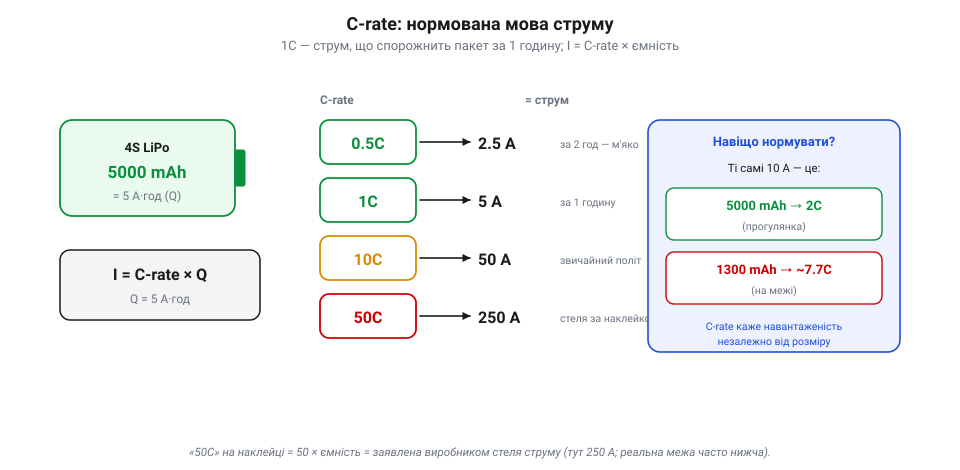
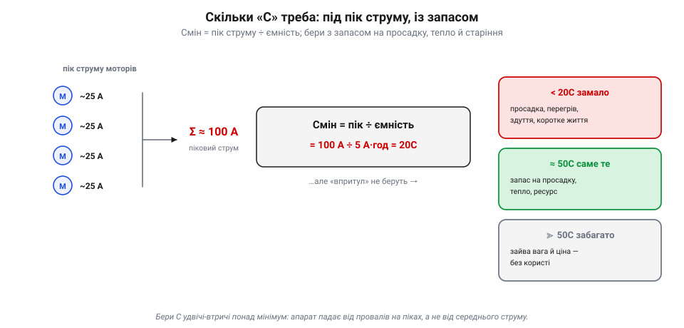

# C-rate, внутрішній опір, просадка

Паспорт батареї — номінал, ємність, енергія, крива розряду — описує її «у спокої». Але апарат бере струм **поривами** — і саме під навантаженням батарея показує свою справжню вдачу. Тут діють три пов'язані речі: **C-rate** — нормована мова, якою міряють струм відносно ємності; **внутрішній опір** — мала, але вперта завада всередині комірки; і **просадка** — провал напруги, що з того опору випливає. Хто їх плутає, той дивується, чому «повна» батарея раптом перезавантажує контролер на ривку газу. Розберімо по черзі.

### C-rate: нормована мова струму

Скільки струму — «багато»? Сама по собі цифра в амперах нічого не каже: 10 А — дрібниця для великого пакета й непосильний тягар для крихітного. Тому струм батареї міряють не в голих амперах, а в **C-rate** — кратно до ємності. Одиниця тут проста:

> **1C** — це струм, що спорожнив би батарею рівно за **одну годину**. Чисельно 1C (в амперах) дорівнює ємності (в ампер-годинах).

Звідси вся арифметика одним рядком: **I = C-rate × ємність**. Для пакета 5000 mAh (= 5 А·год):

```
1C   = 1   × 5 =   5 А     (розряд за 1 годину)
0.5C = 0.5 × 5 = 2.5 А     (за 2 години — м'яко)
10C  = 10  × 5 =  50 А
50C  = 50  × 5 = 250 А     (це і є «50C» на наклейці)
```


*C-rate — це струм, нормований до ємності. Ліворуч пакет 5000 mAh (= 5 А·год) і формула I = C-rate × Q. Посередині драбинка: 1C = 5 А (спорожнення за годину), 10C = 50 А, 50C = 250 А — це і є «стеля» з наклейки. Праворуч — нащо взагалі нормувати: ті самі 10 А для пакета 5000 mAh — лагідні 2C, а для крихітного 1300 mAh — люті ~7.7C. C-rate одразу каже, **наскільки важко** батареї, незалежно від її розміру.*

Тепер «50C» на наклейці читається без загадок: це **заявлений виробником максимум** струму віддачі — 50 × ємність. Для нашого пакета 5000 mAh це 250 А. (Тільки пам'ятай: у RC-LiPo ці цифри часто **оптимістичні** — справжню межу диктують нагрів, просадка, внутрішній опір і охолодження, тож реально виходить помітно нижче.) Часто пишуть два числа — **тривалий** і **піковий** («burst», на кілька секунд): тривалий тримають довго, піковий дозволяють лише на короткий ривок. Та сама мова годиться й для **заряду**: «заряд 1C» означає струм, що наповнить пакет приблизно за годину (докладніше — [безпечний заряд CC/CV](topic:electronics/cc-cv-bms)).

І головне, навіщо взагалі ця морока з кратністю: C-rate показує **навантаженість режиму незалежно від розміру** пакета. Ті самі 10 А — це прогулянкові 2C для пакета 5000 mAh, але люті ~7.7C для крихітного 1300 mAh. Один і той самий струм для одного — забавка, для іншого — на межі. C-rate стирає цю різницю й одразу показує, **наскільки важко** батареї.

> 🔧 **Навіщо це.** Перш ніж брати пакет, прикинь свій **пік струму** й перелічи його в C для цієї ємності. Якщо мотори на піку просять 100 А, а пакет 5000 mAh, то це 20C — і брати треба з добрим запасом понад 20C, а не «впритул». Наклейка «50C» — не реклама заради реклами, а обіцянка, скільки струму пакет віддасть, не задихнувшись.

### Внутрішній опір: чому напруга провалюється

Чому ж не можна просто взяти струм «під саму наклейку»? Бо жодна батарея не є ідеальним джерелом. Усередині кожної комірки, окрім «рушія» — хімічної електрорушійної сили (EMF), — сидить маленький **внутрішній опір** (Rвн): опір електроліту, електродів, з'єднань. Він крихітний — одиниці-десятки **міліом** на комірку, — але саме він псує всю ідилію під струмом.

Модель проста: реальна батарея — це ідеальне джерело EMF **плюс послідовний резистор** Rвн. А на резисторі, щойно крізь нього тече струм, падає напруга. Тому на клемах ми бачимо не повну EMF, а:

```
Vклем = EMF − I × Rвн
```


*Реальна батарея = ідеальне джерело EMF + послідовний опір Rвн. У спокої (струм майже нульовий) на клемах уся EMF — 16.0 В. Та щойно мотори потягли 100 А, на опорі «провалюється» Vпр = I × Rвн = 100 × 0.012 = 1.2 В, і на клемах лишається 14.8 В. Та сама втрата гріє пакет **зсередини**: P = I²·Rвн = 120 Вт. Квадрат струму — тому подвоїв струм, а тепла вчетверо більше.*

Порахуймо на живому прикладі. Здоровий 4S-пакет має внутрішній опір десь **12 мОм** (сумарно по чотирьох комірках). У спокої він показує, скажімо, 16.0 В. Даємо газ — і мотори тягнуть 100 А:

```
просадка:   Vпр   = I × Rвн = 100 А × 0.012 Ом = 1.2 В
на клемах:  Vклем = 16.0 − 1.2 = 14.8 В
```

Цілий вольт із гаком просто зник на внутрішньому опорі, щойно пішов струм. А куди він подівся? У **тепло**: на тому ж опорі розсіюється потужність **P = I²·Rвн = 100² × 0.012 = 120 Вт**, що гріють пакет **зсередини**. Ось чому батарея після злого польоту тепла на дотик, а близька до межі — навіть гаряча. І ось чому залежність квадратична: подвоїв струм — учетверо більше тепла.

> 📜 Ще 1897 року німецький інженер **Вільгельм Пойкерт** (*Wilhelm Peukert*) помітив на свинцевих акумуляторах: що більший струм розряду, то **менше** корисної ємності встигаєш узяти. Чим швидше «висмоктуєш» батарею, тим більше губиш на внутрішніх втратах — частина енергії йде в тепло, а не в роботу. Тому ємність на наклейці міряють за **малого** струму; на великому C доступних ампер-годин завжди трохи менше. Закон Пойкерта старший за літій на ціле століття, а правда його та сама: батарею не можна квапити безкарно.

> 🔧 **Навіщо це.** Внутрішній опір — це і просадка, і тепло, і втрачена ємність воднораз. Пакет із **малим** Rвн (свіжий, якісний, теплий) тримає напругу під газом і менше гріється; пакет із **великим** Rвн (старий, дешевий, холодний) провалюється й перегрівається на тому самому струмі. Тому зарядки й вимірюють Rвн кожної комірки — це найчесніший показник **здоров'я** батареї.

### Просадка під навантаженням

Тепер з'єднаймо це з польотом. Газ на апараті не стоїть рівно — він **сіпається**: завис, ривок угору, різкий маневр. І за кожним ривком струму напруга на клемах **провалюється** на I × Rвн, а коли газ слабшає — вертається назад. Це і є **просадка** (sag): жива напруга в польоті гойдається синхронно з газом, осідаючи на піках і підіймаючись на холостому.


*Просадка в часі. Угорі — газ (струм), що стрибає ривками; унизу — напруга на клемах, яка на кожному ривку провалюється на I × Rвн і вертається. Здорова батарея (зелена) робить малий провал і лишається вище порога. А втомлена чи холодна (червона) має більший Rвн — і її дно **провалюється нижче критичного порога** (3.3 В/комірку), де спрацьовує failsafe або контролер геть перезавантажується (brownout) посеред маневру.*

Поки пакет здоровий, просадка невелика, і дно провалу лишається вище порога — усе гаразд. Але є дві пастки. Перша — **втомлена** батарея: з віком Rвн росте, тож та сама сотня ампер провалює напругу вже не на вольт, а на два-три. Друга — **холод**: на морозі хімія млявіша, Rвн підскакує, і навіть свіжий пакет просідає глибше. У будь-якому з цих випадків дно ривка може **впасти нижче критичного порога** — і тоді контролер бачить миттєву недонапругу: у кращому разі спрацьовує [захисна реакція польотного контролера](topic:programming/flight-controller) (наприклад, повернення додому за низьким зарядом), у гіршому — мікроконтролер просто **перезавантажується** (brownout) посеред маневру. Класична загадка «повна батарея, а апарат упав на різкому газі» — це майже завжди вона, просадка втомленого чи холодного пакета.

Звідси й корисний бік просадки: вона — **діагностика**. Якщо напруга валиться від найменшого газу, пакет або старий, або змерз, або недостатній за C — час придивитися. Досвідчені оператори навіть навмисне «вантажать» батарею, дивлячись, наскільки глибоко вона сяде: малий провал — здорова, глибокий — на пенсію.

> 🔧 **Навіщо це.** Поріг failsafe став з оглядкою на просадку, а не на напругу спокою: він має ловити **дно ривка**, інакше апарат «клюватиме» носом у браунаут на кожному піку. Узимку давай батареї прогрітися й закладай більший запас — холодний пакет бреше вниз дужче. А якщо напруга під газом раптом валиться глибше, ніж раніше, — це сигнал, що пакет здає.

### Скільки «C» треба: вибір під пік струму

Лишилося звести все в просте інженерне рішення: **який C-rate брати?** Відповідь — від **піку струму**, а не від середнього. Порахуй найбільший струм, який апарат може попросити воднораз: для квадрокоптера це приблизно сума максимальних струмів усіх моторів.


*Вибір C-rate робиться під **пік** струму. Чотири мотори на піку тягнуть по ~25 А — разом ~100 А. Тоді Cмін = пік ÷ ємність = 100 ÷ 5 = 20C. Та «впритул» не беруть: замалий C карає просадкою, перегрівом, здуттям і коротким життям; завеликий — це лише зайва вага й ціна. Тому беруть **із запасом** — 50C там, де треба 20.*

Нехай чотири мотори на піку тягнуть по ~25 А — разом це ~100 А. Тоді мінімальний C для пакета 5000 mAh:

```
Cмін = пік струму ÷ ємність = 100 А ÷ 5 А·год = 20C
```

Але «впритул» брати не можна — бо біля своєї стелі пакет максимально просідає й гріється. Тому беруть **із запасом**: 50C там, де треба 20C. Що дає запас? Менший Rвн відносно струму, отже — менша просадка, менше тепла, більший ресурс і витриваліша напруга під газом. Недостатній C карає одразу всім: глибока просадка (браунаути), перегрів, **здуття** комірок і коротке життя. А завеликий C — це переважно зайва **вага** й ціна (потужніші пакети важчі), тож і тут є золота середина, як і з [вибором ємності пакета](topic:electronics/batteries).

> 🔧 **Навіщо це.** Підбирай пакет за піком, не за «середнім»: апарат падає не від середнього струму, а від провалів на піках. Бери C з запасом удвічі-втричі понад розрахунковий мінімум — це найдешевша страховка від браунаутів і здуття. І пам'ятай: справжній C реальних пакетів зазвичай **оптимістичніший** за наклейку, тож запас рятує ще й від маркетингу.

### Підсумок теми

Під навантаженням батарея перестає бути ідеальною — і три поняття пояснюють чому. **C-rate** дає нормовану мову струму: 1C спорожнює пакет за годину, а I = C-rate × ємність, тож «50C» на 5000 mAh — це 250 А стелі. **Внутрішній опір** (одиниці-десятки міліом) — причина всіх бід під струмом: на ньому напруга падає як Vпр = I × Rвн, а потужність I²·Rвн іде в тепло. **Просадка** — видимий наслідок: напруга гойдається з газом і може провалитися нижче порога, надто у втомленого чи холодного пакета, спричиняючи failsafe або браунаут. А вибір **C-rate** робиться під пік струму із запасом — щоб просадка, тепло й старіння лишалися в безпечних межах. Це повна картина того, як батарея **віддає** енергію під навантаженням; дзеркальна задача — як її [безпечно повертати](topic:electronics/cc-cv-bms) (заряд CC/CV, баланс банок, захист BMS) — підкоряється тій самій фізиці внутрішнього опору й нагріву.

---
