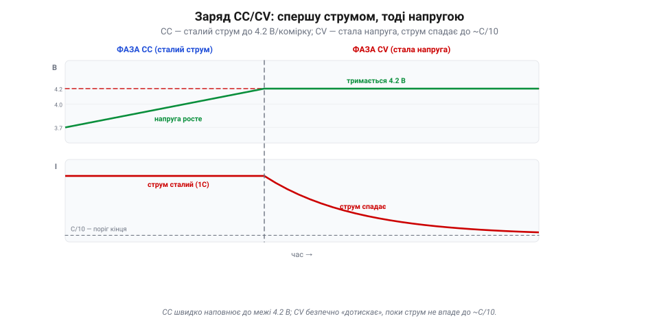
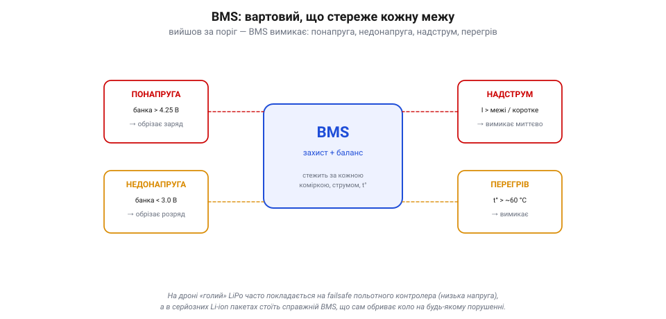
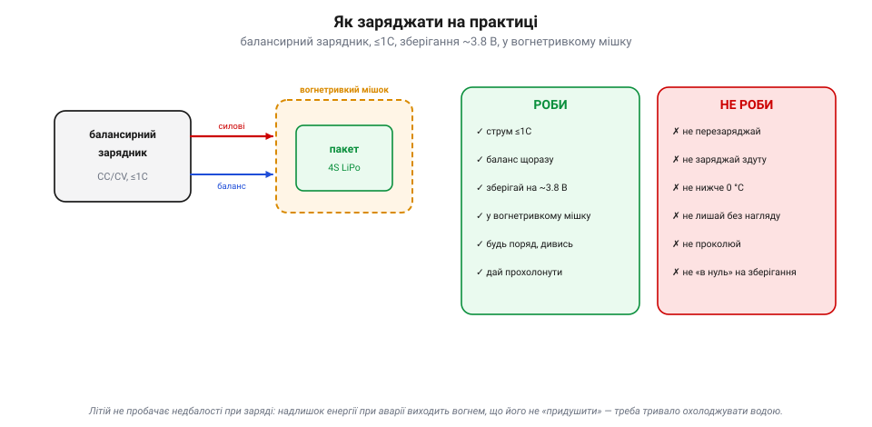

# Заряд CC/CV, баланс, захист (BMS)

Те, як батарея **віддає** енергію, описує її [струмова віддача](book:electronics/c-rate); тепер постає дзеркальна задача: як її **повертати**, та ще й безпечно. Заряджати літій — не те саме, що доливати воду в бак: переллєш струму чи напруги — і комірка не просто зіпсується, а може спалахнути. Тому заряд літію — це строгий **протокол**, а не «під'єднав і забув». У ньому три дійові особи: метод **CC/CV** (як саме подавати струм і напругу), **баланс** (щоб усі банки йшли в ногу) і **BMS** — вартовий, що стереже межі. Розберімо кожного.

### Заряд CC/CV: дві фази

Чому не можна просто подати на батарею потрібну напругу? Бо на майже порожній комірці різниця з джерелом велика, а [внутрішній опір комірки малий](book:electronics/c-rate), тож струм ринув би катастрофічний. А подавати малий сталий струм аж до повного — означало б у кінці **перевищити** безпечні 4.2 В і влаштувати перезаряд. Тому заряд літію роблять у **дві фази**, і зветься це **CC/CV** — *constant current / constant voltage*.

*Дві фази заряду. **CC**: зарядник жене незмінний струм (типово 1C), а напруга комірки росте, поки не впреться в стелю 4.2 В — тут набирається 70–80% заряду, і то швидко. **CV**: далі зарядник тримає рівно 4.2 В, і струм сам собою спадає по спадній; коли він падає до ~C/10, пакет повний і заряд спиняють. Струм спадає сам, бо зарядник тримає стелю напруги; але заряд **зупиняє зарядник** за порогом струму (*termination*), а не «втомлена» комірка.*

**Фаза CC (сталий струм).** Зарядник жене **незмінний** струм — типово 1C (5 А для пакета 5000 mAh), а напруга на комірці потроху **росте**, поки не впреться в стелю 4.2 В. Тут набирається левова частка заряду — десь 70–80%, і то швидко.

**Фаза CV (стала напруга).** Щойно напруга дійшла 4.2 В, зарядник перемикається: тепер він **тримає** рівно 4.2 В і вже не дає напрузі рости. Комірка наповнюється, її «апетит» до струму спадає — і струм сам собою **зменшується** по спадній. Коли він падає десь до **C/10** (однієї десятої від ємності), пакет вважають повним і заряд **припиняють**. Струм згасає сам, бо зарядник тримає стелю напруги; але **зупиняє** заряд за порогом струму сам зарядник, а не «втомлена» комірка — лишена надовго фаза CV чи завищена напруга вже шкодять, тож це не «самозахист» батареї.

Чому не лити більший струм, щоб швидше? Бо великий зарядний струм — це той самий [I²·R-нагрів](book:electronics/c-rate) плюс прискорене старіння. Тому стандарт — заряд **≤1C**; «швидкі» пакети дозволяють більше, але платять ресурсом. І ще: заряд завжди до **стелі своєї хімії** — для звичайного Li-ion/LiPo це **4.2 В/комірку**, ані на десяту вище, бо понад це починається небезпечна хімія. (В інших хімій стеля інша: LiFePO4 — ~3.6 В, «високовольтні» LiHV — ~4.35 В; тож звіряйся з типом пакета.)

> 🔧 **Навіщо це.** Заряджай балансирним зарядником на струмі **≤1C** і ніколи не «підкручуй» напругу понад 4.2 В/комірку. Якщо хочеш, щоб пакет жив роками, став навіть 0.5C — повільніший заряд менше його зношує. А «дотискання» в кінці (фаза CV із малим струмом) — нормальне: останні відсотки завжди заходять повільно.

### Баланс: пакет міцний, як найслабша банка

У багатобаночному пакеті (4S — чотири послідовно) комірки **не однакові**: вони злегка різняться від народження й по-різному старіють. А заряд тече крізь усі **по черзі**, тим самим струмом. Тому одна, трохи повніша банка дійде 4.2 В **раніше** за інші — і якби заряд тривав, вона **перезарядилася** б, поки сусіди ще не повні. І навпаки при розряді: найслабша першою впаде до межі. Виходить, увесь пакет **обмежений найгіршою коміркою**.

*Чому потрібен баланс. Ліворуч — пакет до балансу: одна банка відстала (4.05 В проти 4.20). При заряді вона дійде межі останньою, при розряді — першою впаде, і саме вона обмежує весь пакет. Праворуч — після балансу: балансир зцідив надлишок із повніших банок, усі стоять на рівних 4.20 В, і пакет віддає всю ємність. Для цього в LiPo є окремий **балансирний роз'єм** із виводом від кожної банки (для 4S — п'ять дротів).*

Розв'язок — **балансування**. Саме тому в LiPo, окрім двох силових дротів, є ще окремий тонкий **балансирний роз'єм** з виводом від **кожної** банки (для 4S — п'ять дротів). Через нього зарядник бачить напругу **кожної** комірки нарізно й під час заряду **вирівнює** їх: зціджує надлишок із тих, що вирвалися вперед (пасивний баланс — крізь резистори, «у тепло»), доки відсталі не наздоженуть. Наприкінці всі банки стоять на однакових 4.2 В — і пакет віддає всю свою ємність, а не стільки, скільки дозволяє найгірша.

Ось чому **завжди** заряджають через балансирний роз'єм, а не лише через силові дроти: без балансу банки поступово **розбігаються**, аж доки одна не вийде за межу — у перезаряд (небезпечно) чи в глибокий розряд (псує). Дисбаланс видно прямо: добрий зарядник показує напругу кожної банки, і якщо одна помітно відстає — пакет старіє нерівномірно й проситься на пенсію.

> 🔧 **Навіщо це.** Підключай балансирний роз'єм щоразу й позирай на напруги банок: різниця в кілька сотих вольта — норма, а от десяті — тривога. «Роздута» різниця між банками — рання ознака, що пакет здає; такий не варто ганяти на межі.

### BMS: вартовий батареї

CC/CV й баланс — це як **правильно** заряджати. Але потрібен ще й той, хто **стереже**, щоб ніхто не вийшов за межу — при заряді, розряді й узагалі завжди. Це робота **BMS** (*Battery Management System*) — невеликої електроніки-наглядача, що міряє кожну банку, струм і температуру й **обриває коло**, щойно щось виходить за безпечні рамки.

*BMS стереже чотири межі: **понапругу** (банка вище ~4.25 В → обрізає заряд), **недонапругу** (банка нижче ~3.0 В → обрізає розряд, рятуючи від глибокого висаджування), **надструм** (струм понад межу чи коротке → вимикає миттєво) і **перегрів** (t° понад ~60 °C). Часто той самий вузол ще й балансує банки. На «голому» LiPo цю роль ділять зарядник і польотний контролер; у Li-ion пакетах стоїть повноцінний BMS.*

BMS стереже чотири межі: **понапругу** (банка вище ~4.25 В → обрізає заряд), **недонапругу** (банка нижче ~3.0 В → обрізає розряд, рятуючи від [глибокого висаджування](book:electronics/batteries)), **надструм** (струм понад межу чи коротке → вимикає миттєво) і **перегрів** (температура понад ~60 °C → вимикає). Часто той самий вузол ще й **балансує** банки. По суті, BMS — це автоматика безпеки, що робить літій придатним для щоденного вжитку: без неї одна помилка означала б пожежу.

Тут є нюанс саме для дронів. Гоночний чи польотний **LiPo** часто буває «голий» — без власного BMS, заради ваги; його захист розподілений: **зарядник** робить CC/CV й баланс, а [**польотний контролер**](book:programming/flight-controller) та ESC стережуть низьку напругу в польоті (failsafe). А от у серйозніших системах — великих **Li-ion** складанках, павербанках, електротранспорті — стоїть повноцінний BMS, що сам обриває коло на будь-якому порушенні. Тобто захист **намагаються** мати завжди, питання лише — вбудований він у пакет чи розкладений по заряднику й контролеру. Тільки не плутай **моніторинг** з апаратним захистом: зарядник і автопілот стежать за напругою, та вони **не замінять** апаратного захисту від короткого, проколу чи миттєвого надструму на голому польотному LiPo. І навпаки — BMS, що **різко відрубить** силовий пакет у польоті, сам може спричинити **падіння**, тож для летючих систем його поведінку добирають окремо (краще м'яке попередження, ніж раптовий обрив).

> 📜 Перший комерційний літій-іонний акумулятор випустила **Sony 1991 року** — і не «голим». Інженери чудово знали про норовистість літію (історія розділу!), тож від початку продавали комірки **разом зі схемою захисту** — платою, що обриває коло при перезаряді, перерозряді й короткому. Саме ця непомітна електроніка-наглядач, прабатько сучасного BMS, і зробила літій безпечним для кишені пересічної людини. Без неї геніальна хімія Йосіно так і лишилася б лабораторною небезпекою.

> 🔧 **Навіщо це.** Знай, **хто** в твоїй системі стереже межі. Якщо літієвий пакет «голий», то поза зарядником його єдиний захист у польоті — це правильно налаштований failsafe контролера; постав його сумлінно. А пакет із вбудованим BMS, що раптом «вимкнувся» під навантаженням, — це не поломка, а спрацював захист: шукай причину (просадка, холод, надструм), а не «обходь» його.

### Як заряджати на практиці

Зведімо все в коротку практику. Заряд літію — чи не єдина операція, де недбалість карається не лагом, а **вогнем**, тож тут діють тверді правила.

*Практика заряду. Балансирний зарядник підключають до пакета **двома** джгутами — силовим і балансирним, — а сам пакет кладуть у вогнетривкий мішок. Праворуч — звід правил «роби / не роби»: заряд ≤1C, баланс щоразу, зберігання на ~3.8 В, нагляд — проти перезаряду, заряду здутого пакета, морозу й залишення без догляду. Кожне «не роби» — це запобіжник проти теплової втечі.*

**Роби:** заряджай **балансирним** зарядником, струмом **≤1C**, **щоразу** через балансирний роз'єм; став пакет у **вогнетривкий** мішок чи короб; **будь поряд** і поглядай; давай гарячому після польоту пакету **прохолонути** перед зарядом. Для тривалого зберігання тримай **storage-напругу** ~3.8 В/комірку (добрі зарядники мають режим «storage»), бо і повний, і порожній літій старіє швидше.

**Не роби:** не **перезаряджай** (понад 4.2 В/комірку); не заряджай **здуту** чи пошкоджену комірку — її утилізують, а не «дотягують»; не заряджай на **морозі** (нижче 0 °C); не лишай заряд **без нагляду** на ніч; не **проколюй** і не тисни пакет; не лишай **висадженим у нуль** на зберігання. Кожне з цих «не» — запобіжник проти [теплової втечі](book:electronics/batteries): коротким заливанням її не спинити (комірка сама постачає й паливо, і окисник) — тут потрібне **тривале охолодження великою кількістю води**.

> 🔧 **Навіщо це.** Більшість «пожеж від літію» — це не зла доля, а порушене одне з цих правил: перезаряд, заряд здутого пакета чи кинутий без нагляду зарядник. Дотримуйся протоколу — і батарея служитиме роками тихо й безпечно; знехтуй — і одна ніч може коштувати майстерні.

### Підсумок теми

Заряджати літій — означає шанувати протокол. **CC/CV** дає правильну форму заряду: спершу сталий струм (≤1C) піднімає напругу до 4.2 В/комірку, тоді стала напруга «дотискає», поки струм не впаде до ~C/10. **Баланс** через окремий роз'єм тримає всі послідовні банки рівними, бо пакет міцний лише настільки, наскільки міцна найслабша. А **BMS** — вартовий, що обриває коло при понапрузі, недонапрузі, надструмі чи перегріві; на «голому» LiPo його роль ділять зарядник і польотний контролер. І над усім — тверда практика безпеки, бо ціна помилки тут вогонь. Уміючи безпечно й читати батарею, і віддавати з неї енергію, і повертати її назад, лишається звести запас у [енергетичний бюджет](book:electronics/energy-budget) — чи вистачить його на весь політ.

---
