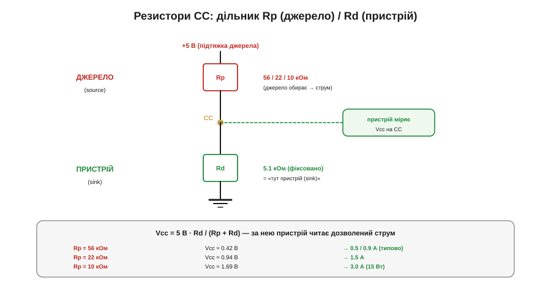

# 🔌 Резистори CC: 56 / 22 / 10 кОм — як sink дізнається про ампери

У [Type-C без PD](book:electronics/type-c-cc) рівень дозволеного струму кодується резисторами на лінії CC. Тут — точні значення, напруги й розпаювання «по-інженерному».

### Що це за «вузол»

Це не чип, а найдешевший у світі спосіб домовитися — **два резистори**. Джерело вішає на лінію CC підтяжку вгору **Rp** (*pull-up*), пристрій — підтяжку вниз **Rd** (*pull-down*) на землю. Разом вони утворюють звичайний дільник напруги: джерело вибором свого Rp **задає** напругу на CC, а пристрій цю напругу **міряє** й читає з неї дозволений струм. Жодного протоколу, тактів чи коду — сама статика двох опорів.

Чому так примітивно? Бо завдання тут мінімальне: лише оголосити «скільки ампер я готовий дати» й переконатися, що на іншому кінці справді є пристрій, а не порожній роз'єм. Для цього не потрібен ні мікроконтролер, ні кварц, ні лінія даних — досить, щоб обидві сторони погодилися на спільну фізику: одна тягне напругу вгору з відомою силою, друга тягне вниз із відомою силою, і **точка рівноваги** між ними однозначно кодує намір. Усе, що складніше за три рівні струму (узгодження 9/15/20 В, реверс потужності, цифровий діалог), вимагає вже протоколу **PD** з активним приймачем-передавачем на тій самій лінії CC — але це інша тема. Поки джерело й пристрій спілкуються лише опорами, помилитися майже нема де: немає станів, немає таймінгів, немає прошивки, яку можна завісити.

> 🔧 **Навіщо це.** Будь-який ваш embedded-пристрій із роз'ємом Type-C, що живиться від порту (плата на ESP32, давач, відлагоджувальний модуль), **зобов'язаний** мати ці два резистори Rd — інакше зарядка-Type-C або ноутбук просто не подадуть на нього VBUS. Це найдешевша частина схеми живлення й одночасно та, що найчастіше «вбиває» прототип: забув дві копійчані деталі — плата не вмикається від сучасного блока, хоча від старого USB-A заводилась.

### Схема дільника


*Rp (джерело, до 5 В) і Rd (пристрій, до землі) утворюють дільник. Напруга на CC: Vcc = 5 В · Rd/(Rp+Rd). Пристрій вибирає Rd = 5.1 кОм завжди, а джерело — один із трьох Rp (56/22/10 кОм), і саме цей вибір задає напругу на CC, а отже й дозволений струм: 0.5/0.9, 1.5 чи 3.0 А.*

Чому саме дільник, а не, скажімо, замикання лінії на землю чи коротка цифрова посилка? Бо дільник — це єдина пасивна схема, яка перетворює **вибір одного з кількох опорів** на **вибір однієї з кількох напруг**, причому неперервно й без живлення логіки. Джерело має три «гирі» Rp, пристрій — одну фіксовану «гирю» Rd, і там, де вони врівноважуються, з'являється напруга, яку легко виміряти будь-яким входом АЦП. Резистор Rp у джерелі підключений до внутрішніх 5 В (тих самих, що згодом стануть VBUS), Rd у пристрої — до землі. Струм тече з 5 В через Rp, через лінію CC, через Rd у землю, і на Rd падає та частка п'яти вольтів, яку диктує співвідношення опорів.

### Розрахунок дільника

Тепер пройдімо ці числа руками — щоб «≈ 0.42 В» не було магією, а виводилося з закону Ома за десять секунд. Формула одна, та сама, що в підписі до рисунка:

```
Vcc = Vpull · Rd / (Rp + Rd)
```

де Vpull — напруга підтяжки джерела (для класичного варіанта 5 В), Rd = 5.1 кОм, а Rp — обраний джерелом номінал. Підставмо всі три випадки:

```
56 кОм:  Vcc = 5 · 5.1 / (56 + 5.1)  = 5 · 5.1 / 61.1  = 25.5 / 61.1  ≈ 0.417 В
22 кОм:  Vcc = 5 · 5.1 / (22 + 5.1)  = 5 · 5.1 / 27.1  = 25.5 / 27.1  ≈ 0.941 В
10 кОм:  Vcc = 5 · 5.1 / (10 + 5.1)  = 5 · 5.1 / 15.1  = 25.5 / 15.1  ≈ 1.689 В
```

Звідси видно, **чому** номінали Rp такі дивні на вигляд (56/22/10, а не круглі 50/20/10): їх підбирали не за красою, а так, щоб три отримані напруги впевнено лягли в три **різні смуги** з широкими «коридорами безпеки» між ними. Перша смуга біля 0.42 В, друга біля 0.94 В, третя біля 1.69 В — відстань між сусідніми рівнями понад 0.5 В, тож навіть похибка резисторів ±5 %, шум на лінії й падіння на довгому кабелі не зсунуть вимір у чужу смугу. Якби номінали стояли ближче, межі смуг злиплися б, і пристрій плутав би «1.5 А» з «3.0 А» — а це вже або недобір потужності, або перевантаження порту.

І ще одна причина саме **5.1 кОм** для Rd, а не «приблизно 5»: це стандартний номінал ряду E96, найближчий до розрахункового, тож такий резистор є в кожного виробника й коштує копійки. Точність тут важлива, бо Rd входить і в чисельник, і в знаменник формули: якби пристрої ставили хто 4.7, хто 6.8 кОм, напруги «попливли» б, і та сама смуга в одного пристрою читалась би інакше, ніж в іншого. Фіксована константа робить вимір сумісним між будь-яким джерелом і будь-яким пристроєм у світі.

### Значення резисторів

Запам'ятати треба чотири числа:

```
Rd (пристрій) = 5.1 кОм  — ЗАВЖДИ, фіксовано: «тут sink»

Rp (джерело), підтяжка до 5 В:
   56 кОм → Vcc ≈ 0.42 В → 0.5 / 0.9 А (типовий USB)
   22 кОм → Vcc ≈ 0.94 В → 1.5 А
   10 кОм → Vcc ≈ 1.69 В → 3.0 А (15 Вт)
```

Rd — священна константа: рівно **5.1 кОм**. Саме її шукає джерело, щоб переконатися, що на іншому кінці справді пристрій, а не порожній роз'єм чи кабель. Працює це так: на порожньому роз'ємі лінія CC ні до чого не підтягнута знизу, тож підтяжка Rp джерела підтягує її майже до повних 5 В — і джерело читає «нічого не підключено, VBUS не вмикаю». Щойно з'являється Rd на 5.1 кОм, напруга падає в одну з робочих смуг — і це для джерела сигнал «є пристрій, можна подавати живлення». Тобто Rd виконує одразу дві ролі: і вмикає VBUS самим фактом своєї присутності, і (через вибір Rp на тому кінці) дозволяє прочитати стелю струму. Rp натомість обирає джерело — і тим оголошує, скільки ампер готове дати.

### Підключення

На боці **пристрою** все просто: Rd = 5.1 кОм з кожного піна CC на землю. Саме **з кожного** — і CC1, і CC2, — бо [роз'єм реверсивний](book:electronics/type-c-cc), і наперед не відомо, який із пінів з'єднає кабель. На боці **джерела** — підтяжка Rp обраного номіналу від внутрішніх 5 В до CC. Більше нічого: ні живлення чипа, ні прошивки.

Чому Rd ставлять **на обидва** CC, а не один спільний на з'єднані разом піни? Бо з'єднувати CC1 і CC2 не можна: у повноцінному кабелі другий контакт CC (той, що не несе сигнал орієнтації) перетворюється на лінію **VCONN** для живлення електроніки кабелю, і якщо ви замкнули обидва піни одним резистором, ви закоротили VCONN на свій Rd. Тому канон — **два окремі** резистори по 5.1 кОм, кожен на свій пін. Активним стане лише той, до якого кабель реально під'єднав CC джерела; другий просто висітиме на 5.1 кОм до землі й нікому не заважатиме.

Ось як це виглядає в розпаюванні плати-пристрою на типовому роз'ємі Type-C (показано тільки вузол CC, силові й даних-піни опущено):

```
  Роз'єм Type-C (гніздо)            Плата-пристрій
  ┌───────────────┐
  │  CC1 ●────────┼──────────┬───────────────► до МК (АЦП/GPIO), опційно
  │               │          │
  │               │         [Rd1] 5.1 кОм
  │               │          │
  │               │         ═╧═ GND
  │               │
  │  CC2 ●────────┼──────────┬───────────────► до МК (АЦП/GPIO), опційно
  │               │          │
  │               │         [Rd2] 5.1 кОм
  │               │          │
  │               │         ═╧═ GND
  └───────────────┘
```

Гілки «до МК» у дужках — це вже наступний рівень: якщо пристрій хоче не просто отримати живлення, а ще й **прочитати**, скільки струму дозволено, він заводить лінію CC на вхід АЦП мікроконтролера (наприклад, на ADC-пін ESP32). Якщо ж пристрою байдуже до стелі струму й він і так бере мало — гілки до МК нема взагалі, лишаються самі два Rd, і це повністю робоча, найпоширеніша конфігурація «дай 5 В і не питай».

### «Перший байт»

«Заговорити» тут — це **виміряти**. Пристрій заводить лінію CC на компаратор або вхід АЦП і дивиться, у яку зі смуг потрапила напруга: нижче ~0.66 В — типовий струм, між ~0.66 і ~1.23 В — 1.5 А, вище — 3.0 А. Прочитав смугу — знає стелю струму й більше за неї не бере. Усе «спілкування» — одне аналогове вимірювання на під'єднанні.

Звідки взялися саме пороги 0.66 і 1.23 В? Це **середини коридорів** між робочими напругами з дільника: 0.42 і 0.94 В дають межу ≈ 0.66 В (точніше — трохи зміщену вгору за специфікацією), а 0.94 і 1.69 В дають межу ≈ 1.23 В. Поріг ставлять посередині між сусідніми рівнями навмисно — так він максимально далеко від обох робочих точок, і будь-яка реальна похибка (розкид резисторів, шум, падіння на кабелі) не дотягнеться до межі. Це класичний прийом порогового детектора: смуга «своя», поки вимір ближче до її центру, ніж до сусіднього.

> 🔧 **Навіщо це.** Якщо ваш пристрій споживає більше за 0.5 А (зарядка акумулятора, потужний радіомодуль, мотор), ви **мусите** прочитати CC й переконатися, що порт обіцяє хоча б 1.5 А, перш ніж вмикати навантаження. Інакше на слабкому порту VBUS просяде, BOR-схема ESP32 спрацює, і пристрій піде в нескінченний reboot-цикл. Прочитати — це один `analogRead` по лінії CC на старті.

### Worked example: читання смуги струму на ESP32

**Умова.** Плата на ESP32 живиться від Type-C і на старті хоче дізнатися, скільки струму обіцяє порт, щоб вирішити, чи можна вмикати зарядку акумулятора (тягне 1.2 А). Лінія CC заведена на ADC-пін через простий дільник 1:1 (два резистори по 100 кОм), бо вхід АЦП ESP32 надійно працює приблизно до 2.5 В, а ми хочемо запас. Який код прочитає смугу?

Спершу полічімо, які напруги АЦП відповідають кожній смузі. Дільник 1:1 ділить напругу CC навпіл, тож на вхід АЦП приходить рівно половина Vcc:

```
смуга «типова» (0.42 В на CC) → 0.42 / 2 ≈ 0.21 В на АЦП
смуга «1.5 А»  (0.94 В на CC) → 0.94 / 2 ≈ 0.47 В на АЦП
смуга «3.0 А»  (1.69 В на CC) → 1.69 / 2 ≈ 0.85 В на АЦП

пороги (середини коридорів), перераховані на вхід АЦП:
   нижній поріг: 0.66 / 2 ≈ 0.33 В
   верхній поріг: 1.23 / 2 ≈ 0.62 В
```

Тепер код прошивки. ESP32 читає АЦП у мілівольтах через `analogReadMilliVolts`, тож пороги беремо прямо в мВ (330 і 620 мВ), а далі — порівняння й рішення. Та сама логіка в C++ (Arduino-ESP32) і в MicroPython (`machine.ADC`):

:::tabs

```cpp
// Поріги на вході АЦП після дільника 1:1 (мВ)
#define CC_TH_LOW   330   // межа «типова» / «1.5 А»
#define CC_TH_HIGH  620   // межа «1.5 А» / «3.0 А»

#define CC1_ADC_PIN  34
#define CC2_ADC_PIN  35

// Повертає стелю струму порту в міліамперах
int read_cc_current_limit(void) {
    // Беремо більшу з двох CC: активна та, де кабель з'єднав CC джерела.
    int v1 = analogReadMilliVolts(CC1_ADC_PIN);
    int v2 = analogReadMilliVolts(CC2_ADC_PIN);
    int v  = (v1 > v2) ? v1 : v2;

    if (v >= CC_TH_HIGH) return 3000;   // 3.0 А
    if (v >= CC_TH_LOW)  return 1500;   // 1.5 А
    return 900;                         // типовий USB: 0.5–0.9 А
}

void setup() {
    int limit_mA = read_cc_current_limit();

    // Зарядка тягне 1200 мА — вмикаємо лише якщо порт обіцяє запас.
    if (limit_mA >= 1500) {
        enable_battery_charger();       // безпечно: 1.2 А < 1.5 А
    } else {
        // Порт дає максимум 0.9 А — заряджати не можна, просяде VBUS.
        run_low_power_only();
    }
}
```

```python
# MicroPython на ESP32
from machine import ADC, Pin

# Поріги на вході АЦП після дільника 1:1 (мВ)
CC_TH_LOW  = 330   # межа «типова» / «1.5 А»
CC_TH_HIGH = 620   # межа «1.5 А» / «3.0 А»

cc1 = ADC(Pin(34))
cc2 = ADC(Pin(35))
for adc in (cc1, cc2):
    adc.atten(ADC.ATTN_11DB)           # діапазон входу ~0…2.5 В

def read_cc_current_limit():
    """Стеля струму порту в міліамперах."""
    # Беремо більшу з двох CC: активна та, де кабель з'єднав CC джерела.
    v = max(cc1.read_uv() // 1000, cc2.read_uv() // 1000)  # мкВ → мВ

    if v >= CC_TH_HIGH:
        return 3000                     # 3.0 А
    if v >= CC_TH_LOW:
        return 1500                     # 1.5 А
    return 900                          # типовий USB: 0.5–0.9 А

limit_mA = read_cc_current_limit()

# Зарядка тягне 1200 мА — вмикаємо лише якщо порт обіцяє запас.
if limit_mA >= 1500:
    enable_battery_charger()            # безпечно: 1.2 А < 1.5 А
else:
    # Порт дає максимум 0.9 А — заряджати не можна, просяде VBUS.
    run_low_power_only()
```

:::

**Висновок.** На зарядці-Type-C з Rp = 22 кОм АЦП покаже ≈ 470 мВ — це між 330 і 620, отже смуга «1.5 А», і `read_cc_current_limit()` поверне 1500. Оскільки 1500 ≥ 1500, зарядка вмикається, бо 1.2 А вкладається в обіцяні 1.5 А із запасом 0.3 А. На звичайному комп'ютерному порту з Rp = 56 кОм АЦП покаже ≈ 210 мВ (нижче 330) → функція поверне 900 → зарядка лишиться вимкненою, і пристрій працюватиме лише в режимі низького споживання, рятуючи VBUS від просадки. Уся «домовленість» звелася до двох `analogReadMilliVolts` і пари порівнянь — жодного протоколу.

### Типові граблі

- **Забув Rd.** Без 5.1 кОм джерело не бачить пристрою й тримає VBUS вимкненим — «нічого не вмикається». Механізм: без підтяжки вниз лінія CC сидить біля 5 В через Rp, що для джерела означає «порожній роз'єм», і воно навмисно не подає живлення — захист, щоб не пускати 5 В на голі контакти роз'єму.
- **Rd лише на одному CC.** Тоді пристрій працює тільки одним боком штекера, а перевернутим — ні, бо в одній орієнтації кабель з'єднає той CC, де Rd є, а в іншій — той, де його немає, і джерело знову бачить «порожньо».
- **Припустив 3 А.** Узяв повний струм, не глянувши на CC, а порт давав 0.9 А — просадка й перевантаження. Механізм: VBUS слабкого порту обмежений, і за надспоживання він або просяде нижче порога BOR (пристрій ребутиться), або спрацює захист порту й живлення зникне зовсім.
- **Поплутав номінал.** 5.1 кОм — це Rd; не сплутати з Rp чи з підтяжками інших шин. Дрібна помилка в номіналі збиває всю смугу, бо Rd стоїть і в чисельнику, і в знаменнику формули дільника — підставите 10 кОм замість 5.1, і напруга «типової» смуги зсунеться так, що джерело прочитає її як іншу.
- **Завів CC прямо на АЦП без дільника на 3 А.** На смузі 3.0 А напруга CC доходить до ≈ 1.7 В — це ще в межах входу ESP32, але на лінії CC під час PD-узгодження можуть бути вищі рівні; без дільника й захисту легко перевищити допустиму напругу входу й пошкодити пін.

### Варіації

Той самий дільник джерело може реалізувати інакше: підтяжкою до **3.3 В** іншими номіналами (36 / 12 / 4.7 кОм) або взагалі **джерелом струму** (80 / 180 / 330 мкА) — у всіх випадках на CC виходять ті самі три смуги напруги. Чому результат однаковий, хоч схема різна? Бо пристрій міряє лише **кінцеву напругу** на CC, а не те, як вона утворилася: виробник джерела вільний обрати будь-яку реалізацію, аби точки рівноваги лягли в ті самі три смуги. Варіант із джерелом струму навіть точніший — напруга на Rd там дорівнює просто струм·Rd і не залежить від Vpull, тож смуги виходять стабільнішими за різних внутрішніх напруг джерела.

[Дворольовий порт](book:electronics/powerbank-source) (**DRP**) почергово виставляє то Rp, то Rd, поки не з'ясує роль, — бо наперед не знає, ким стане: джерелом чи споживачем, і «промацує» обидві можливості. Старий перехідник A→C тримає на CC ту саму підтяжку **56 кОм**, чесно кажучи Type-C-пристрою «це звичайний USB, бери типовий струм» — інакше пристрій, не побачивши Rp взагалі, вирішив би, що його ні до чого не під'єднано. А кабель зі своєю електронікою показує на піні VCONN окремий резистор **Ra** (≈ 1 кОм) — щоб система відрізнила «активний кабель» від звичайного пристрою з Rd і подала на нього живлення для e-marker. Поріг тут той самий принцип смуг: 1 кОм дає на CC напругу нижчу за будь-яке Rd, тож джерело однозначно читає «це не пристрій, а кабель» і вмикає VCONN замість того, щоб трактувати лінію як sink.
