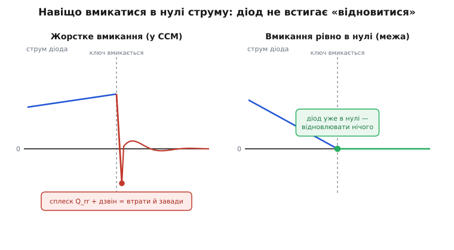
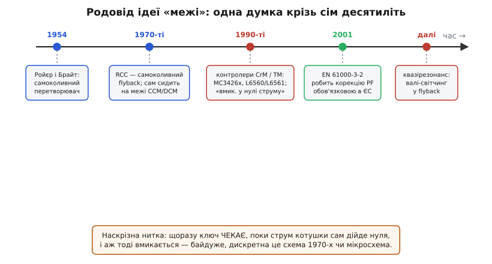

# 📜 Як народилася думка «вмикатися рівно в нулі струму»

Є ідеї, що з'являються не з осяяння одного генія, а з того, що кільком інженерам незалежно набридло те саме. Ідея «межового режиму» — саме така. Її суть можна вимовити одним реченням: **не вмикай ключ будь-коли, а дочекайся миті, коли струм у котушці сам щойно впав до нуля, і аж тоді вмикай — ні миттю раніше, ні пізніше.** Звучить як дрібна деталь керування. Але саме з цієї дрібниці виросли два величезні класи серійної техніки — коректори коефіцієнта потужності в кожному блоці живлення й дешеві обернені (flyback) перетворювачі в кожній зарядці, — і саме навколо неї збіглася ціла купа різних назв: **межовий**, **критичний**, **прикордонний**, **перехідний**. Ця вставка — про те, звідки взялася сама думка, чому в неї стільки імен і чому вона виявилася настільки корисною, що інженери спершу натрапляли на неї випадково, а потім почали заганяти в неї схеми навмисне.

Почнімо з того, що ця ідея має дві зовсім різні мотивації, які лише згодом злилися в одну техніку. Перша мотивація — **лінива**: коли перетворювач будують якнайпростіше, без хитрого керування, він **сам собою** сповзає на межу CCM/DCM, бо там йому природно. Друга мотивація — **інженерна й корислива**: у цій точці зникає одне з найгидкіших джерел втрат і завад у силовій електроніці — **зворотне відновлення діода**. Перша мотивація дала світові дешевий самоколивний flyback ще до появи спеціальних мікросхем. Друга — перетворила межовий режим на осмислений вибір розробника й породила цілу родину контролерів. Розберімо обидві нитки й побачимо, де вони сходяться.

## Найлінивіший перетворювач сам знаходить межу

Щоб відчути, звідки ідея взагалі могла з'явитися «сама», треба уявити найпростіший можливий імпульсний перетворювач — такий, у якому немає ні окремого генератора частоти, ні складного контролера, а є один транзистор, трансформатор і жменя пасивних деталей. Такі схеми будували ще тоді, коли інтегральних керувальних мікросхем не існувало взагалі, і будують досі там, де кожен цент на лічбі.

Класичний представник цього роду — **самоколивний обернений перетворювач**, у західній літературі відомий як **ringing choke converter** (RCC, дослівно «перетворювач на дзвінкій котушці»). Ідея його геніально проста. Транзистор відкривається, струм у первинній обмотці трансформатора наростає трикутником, запасаючи енергію в осерді. У певну мить транзистор закривають — і вся запасена енергія перекидається у вторинну обмотку, живлячи вихід. А тепер найцікавіше: **звідки схема знає, коли вмикати транзистор знову?** У RCC для цього використовують окрему допоміжну обмотку, яка стежить за розмагнічуванням осердя. Поки вторинна обмотка віддає струм, на допоміжній тримається одна напруга; щойно струм спав до нуля й осердя повністю розмагнітилося, ця напруга **перекидається** — і сам цей перекид відмикає транзистор, запускаючи новий цикл.

Вдумаймося, що це означає. Схема **не має** заданої частоти. Вона вмикає ключ **рівно тоді, коли струм у трансформаторі щойно дійшов нуля**, — тобто працює точно на межі між безперервним і переривчастим режимом, автоматично, без жодного датчика струму й без жодного розрахунку. Межовий режим тут — не задум конструктора, а **природний наслідок** того, що схему зробили якнайпростішою: вона сама себе тримає на межі, бо саме туди її штовхає зворотний зв'язок через розмагнічування.

> 🔧 **Навіщо це.** Ось перший і головний урок історії: у найдешевших перетворювачів межовий режим не «увімкнули» — він **завівся сам**. Тому коли ви дивитеся на копійчану зарядку від телефона і бачите, що частота в ній «гуляє» з навантаженням, — це не поломка й не поганий дизайн, а прикмета того, що всередині сидить самоколивна схема, яка щоцикла чекає на нульовий струм. Розуміти цю поведінку — означає не лякатися, коли осцилограф показує «плавучу» частоту там, де ви очікували стабільну.

Самоколивні перетворювачі — не новина космічної доби. Їхнє коріння тягнеться до транзисторних генераторів на насичуваному трансформаторі 1950-х. Тут варто назвати конкретний доказово підтверджений факт, бо його часто розмивають. У **квітні 1954 року** двоє інженерів компанії **Westinghouse** — **Річард Л. Брайт** (Richard L. Bright) і **Джордж Г. Ройєр** (George H. Royer) — подали патентну заявку на самоколивний транзисторний інвертор із насичуваним трансформатором (патент США № 2 783 384, виданий 26 лютого 1957 року); того ж 1954 року Ройєр із співавторами описав схему в статті «Transistors as On-Off Circuits in Saturable Core Circuits» (журнал *Electrical Manufacturing*, грудень 1954). Ця конструкція увійшла в історію як **осцилятор Ройєра**, хоча, як бачимо, точніше було б казати «Брайта–Ройєра» — обоє стоять на патенті співавторами.

*(Статус фактів: усталений. Авторство, номер і дати патенту звірені за патентною базою й кількома незалежними джерелами; співавторство Брайта підтверджене — приписувати схему одному лише Ройєрові було б неточністю, дарма що прижилася саме назва «Royer».)*

Осцилятор Ройєра сам по собі — це двотактний перетворювач, а не flyback, і межового режиму в теперішньому сенсі там ще немає. Але він заклав спосіб мислення, який усе й породив: **нехай сама схема, через магнітний зворотний зв'язок, вирішує, коли перемикати ключ**. RCC успадкував цю філософію й довів її до flyback: у ньому мить перемикання диктує не таймер, а фізика розмагнічування осердя — тобто момент, коли струм дійшов нуля. Так у найдешевшому кутку силової електроніки межовий режим оселився ще до того, як хтось узагалі дав йому назву. Ці самоколивні flyback у 1970-х розповзлися по дешевій техніці — від блоків живлення до заряджалок, — і в мільйонах таких схем ключ уже вмикався «в нулі струму», хоча ніхто це так не називав і не робив навмисно.

## Друга нитка: чому інженери зненавиділи зворотне відновлення діода

Тепер відкладімо ліниві схеми й перейдімо до другої, зовсім іншої мотивації — тієї, що перетворила межовий режим із випадковості на **свідомий інженерний вибір**. Ця мотивація народилася з болю, і біль цей звався **зворотним відновленням діода** (reverse recovery).

Щоб зрозуміти цей біль, треба на мить зазирнути всередину звичайного кремнієвого діода, коли той працює на високій частоті. Поки крізь діод тече прямий струм, його база наповнена рухомими носіями заряду — це вони й проводять струм. І ось настає мить, коли схема хоче діод **закрити** (наприклад, у підвищувальному перетворювачі це стається, коли знову вмикають нижній ключ і напруга на діоді розвертається). Здавалося б, діод мав би просто перестати проводити. Але не тут було: усі ті носії, що наповнили базу, **не зникають миттєво**. Перш ніж діод справді закриється, їх треба звідти вимести — і поки їх вимітає, крізь діод протікає короткий, але **зворотний** струм, у зворотний бік. Діод на кілька десятків чи сотень наносекунд стає майже коротким замиканням «навпаки».

Цей зворотний кидок — справжня катастрофа в мініатюрі. По-перше, він тече крізь щойно ввімкнений ключ, додаючи до його струму гострий пік, — і саме в цей момент на ключі ще стоїть повна напруга шини, тож добуток «струм × напруга» дає **спалах втрат** просто в кристалі. По-друге, коли носії нарешті виметено й діод раптово таки закривається, цей обрив струму збуджує паразитний коливальний контур із індуктивностей монтажу й ємностей — і по схемі йде **високочастотний дзвін**, потужне джерело електромагнітних завад. Що вища робоча частота, то частіше цей спалах повторюється, то гарячіший ключ і брудніший спектр.


*Уся шкода зворотного відновлення береться з того, що ключ вмикають, поки крізь діод ще тече струм. Якщо ж вмикати рівно тоді, коли струм діода вже сам дійшов нуля, вимітати з бази нема чого — зникають і сплеск втрат, і подальший дзвін.*

І тут напрошується рятівна думка, проста до зухвалості. Уся шкода бере початок з одного: ключ вмикають тоді, коли **крізь діод ще тече чималий струм**, і саме цей струм доводиться силою обривати. А що, як не обривати нічого? Що, як вмикати ключ **рівно в ту мить, коли струм у діоді вже сам, природно, дійшов нуля**? Тоді в базі діода носіїв уже нема — вимітати нічого, зворотному кидку взятися нізвідки, дзвону — не з чого зродитися. Проблема не розв'язується хитрим снабером чи швидшим діодом — вона **просто зникає**, бо зникає її причина.

А коли настає ця блаженна мить, коли струм у діоді сам дійшов нуля? Рівно на **межі CCM/DCM**. Саме там нижній край трикутного струму котушки торкається нуля — тобто струм у діоді (який у другій фазі й несе цей спадний край) якраз доходить до нуля наприкінці циклу. Отже, дві зовсім різні лінії думки — «як зробити перетворювач найпростішим» і «як позбутися зворотного відновлення» — вказують **в одну й ту саму точку**. Робота на межі не лише природна для лінивої схеми; вона ще й **корисна**, бо дарує чисте, безкоштовне вимикання діода. Ось де випадковість перетворюється на задум: якщо ти й так опиняєшся на межі, чому б не сидіти на ній **навмисно** й не збирати цю користь щоцикла?

> 🔧 **Навіщо це.** Це друга половина відповіді на питання «навіщо межовий режим». Перша — «бо дешево й само виходить». Друга — «бо в цій точці діод вимикається задарма й тихо». Тому в застосунках, де діод швидкий і завади болять (а це саме коректори потужності на високій напрузі), інженери обирають межу не з ліні, а свідомо: вона рятує і ККД, і електромагнітну сумісність одним рухом.

## Коли корекція коефіцієнта потужності стала обов'язковою

Друга нитка — боротьба зі зворотним відновленням — довго лишалася приватною турботою розробників дорогих джерел. Щоб вона вибухнула масовою технікою, знадобився зовнішній поштовх, і поштовх цей був **регуляторний**. Тут історія межового режиму несподівано впирається в європейське законодавство про якість електромережі.

Річ у тім, що звичайний блок живлення з мостовим випрямлячем і великим конденсатором після нього споживає струм із мережі **не синусоїдою, а короткими гострими сплесками** — конденсатор підхоплює заряд лише на вершинах синусоїди напруги. Такий рваний струм напханий гармоніками, які гуляють мережею, гріють нейтраль, псують форму напруги для сусідів і взагалі отруюють спільну мережу. Коли таких блоків стали мільйони — у кожному телевізорі, комп'ютері, лампі-баласті, — це перестало бути дрібницею.

Європа відповіла нормою. Стандарт **IEC 555-2** (уперше опублікований ще 1982 року, з переглядами 1984, 1986 і 1991 років) обмежив гармоніки струму, які прилад має право впорскувати в мережу; згодом його замінив ширший **EN 61000-3-2** (він же IEC 61000-3-2). І — ключова дата — **з 1 січня 2001 року** відповідність EN 61000-3-2 стала **обов'язковою** для практично всієї електронної техніки в Євросоюзі зі струмом до 16 А на фазу. Раптом кожен виробник блоків живлення й ламп-баластів опинився перед вимогою: споживай із мережі **майже синусоїдний** струм — або не продавай товар у Європі.

*(Статус фактів: усталений. Дати першого видання IEC 555-2 (1982) і його переглядів, а також дату обов'язковості EN 61000-3-2 (1 січня 2001) звірено за кількома незалежними джерелами, включно з нормативними оглядами.)*

А зробити споживаний струм синусоїдним і означає поставити перед блоком живлення **коректор коефіцієнта потужності** (PFC) — окремий підвищувальний перетворювач, який змушує вхідний струм повторювати форму вхідної напруги. І ось тут дві наші нитки нарешті сплітаються з третьою: раптом виникла **масова потреба** в мільйонах дешевих PFC-каскадів. Дорогі рішення з повним керуванням струму годилися для потужних промислових джерел, але для лампи-баласта чи невеликого блоку потрібне було щось **просте й копійчане**. І межовий режим підійшов ідеально — з причини, яка заслуговує окремого захвату.

## Чому межовий режим виявився ідеальним для дешевого PFC

Щоб оцінити елегантність, згадаймо, чого взагалі хоче коректор потужності: щоб **усереднений вхідний струм** щомиті був пропорційний вхідній напрузі. Для підвищувального перетворювача це означає, що середній струм котушки має повторювати синусоїду випрямленої мережевої напруги — від нуля на початку півхвилі до максимуму на її вершині й назад.

У «дорослому» підході (безперервний режим, CCM) для цього тримають окремий **помножувач**: спеціальний вузол усередині мікросхеми бере форму вхідної напруги, множить її на сигнал помилки за виходом і формує **опорну криву** для струму котушки, за якою слідкує швидкий струмовий контур. Це працює чудово, дає малі пульсації й підходить для великих потужностей — але помножувач, датчик струму й точний контур коштують і кремнію, і зусиль розробника.

А тепер погляньмо, що відбувається в **межовому режимі** з простим правилом «тримай тривалість увімкнення сталою». Якщо котушку щоцикла заряджають **однаковий час** t_on від вхідної напруги v_вх, то піковий струм котушки за цикл виходить:

```
I_пік = v_вх · t_on / L
```

Тобто піковий струм **сам собою пропорційний вхідній напрузі** — де напруга вища (на вершині синусоїди), там і пік вищий; де напруга близька до нуля, там і пік малий. А в межовому режимі струм котушки — це трикутник від нуля до піку й назад до нуля, тож його **середнє за цикл дорівнює рівно половині піку**:

```
I_сер = I_пік / 2 = (v_вх · t_on) / (2·L)
```

Дивимося на результат і не віримо очам: **середній вхідний струм автоматично повторює форму вхідної напруги** — саме те, чого хоче PFC, — і для цього **не треба жодного помножувача**, жодної опорної кривої, жодного слідкувального контуру за струмом. Досить тримати t_on сталим протягом усієї півхвилі мережі (повільно підправляючи його від циклу до циклу, щоб тримати вихідну напругу), а котушка й геометрія трикутника зроблять корекцію самі. Коефіцієнт потужності при цьому виходить близько **0.99** — практично одиниця.

> 🔧 **Навіщо це.** Ось чому саме межовий режим захопив дешевий PFC, а не якийсь інший. У ньому корекція виходить **майже задарма**: проста мікросхема зі сталим часом увімкнення й детектором нуля струму дає коефіцієнт потужності 0.99 без помножувача й без струмового контуру. Плюс — безкоштовне тихе вимикання діода (нуль струму ж!). Мінус — змінна частота, бо схема щоразу чекає природного нуля, тож період «плаває» і з миттєвою напругою мережі, і з навантаженням; це ускладнює вхідний фільтр завад, який доводиться рахувати на весь діапазон частот. Але для потужностей десь до кількасот ват цей розмін окупається сповна.

Ця ж таки арифметика пояснює, чому дешевий PFC природно живе саме до кількасот ват, а далі поступається безперервному режиму: у межовому режимі струм щоцикла злітає від нуля до подвоєного середнього, тож піки й пульсації великі, і на великих потужностях вони починають дорого коштувати в нагріві котушки та ключа. Малій і середній потужності ці піки байдужі — там виграє простота; великій — ні, там повертаються до CCM із помножувачем.

## Контролери, що канонізували ідею, — і чому в неї стільки імен

Тепер ми готові пояснити найзагадковіше: чому та сама точка роботи має аж чотири поширені назви. Відповідь суто історична — **різні виробники мікросхем прийшли до неї майже одночасно й кожен назвав її по-своєму**, а ринок потім змирився з усіма назвами відразу.

Один із перших дедикованих контролерів цього типу — родина **MC34261 / MC34262** (і їхні «холодніші» двійники MC33261/MC33262) від **Motorola** (пізніше цей підрозділ став ON Semiconductor). У їхньому даташиті режим прямо названо **critical conduction** — «критична провідність», а спосіб керування описано дослівно як «сталий час увімкнення й змінний час вимкнення» (fixed on-time, variable off-time) з окремим **детектором нуля струму** (zero current detector), що й запускає наступний цикл. Це буквально та сама арифметика зі сталим t_on, яку ми щойно вивели, відлита в кремній: чип призначали саме для електронних баластів і офлайн-передперетворювачів — тобто рівно під нову регуляторну потребу.

Приблизно тоді ж і в тій самій ніші з'явилася європейська відповідь — **L6560**, а за ним його поліпшена версія **L6561** від **SGS-Thomson** (нині **STMicroelectronics**). Тут той самий режим названо інакше — **transition mode** (перехідний режим), TM. L6561 прямо описують як покращений L6560 з кращим помножувачем для роботи в широкому діапазоні вхідної напруги; сімейство продовжили L6562/L6563, що жили в серії роками. Це знову той самий межовий режим — але під іншим ярликом, бо його дала інша фірма.


*Ідея «дочекайся, поки струм котушки сам дійде нуля, і аж тоді вмикай» проходить наскрізною ниткою через усю історію — байдуже, дискретна це схема 1970-х чи спеціальна мікросхема 1990-х.*

Тепер зберімо назви докупи й побачимо, що всі вони — про **одну й ту саму точку** I = ΔI/2, лише названу з різних боків:

```
critical conduction (CrM/CrCM)  — «критична»: критична точка між CCM і DCM
boundary conduction (BCM)       — «межова»: рівно межа двох режимів
borderline conduction           — «прикордонна»: те саме, синонім boundary
transition mode (TM)            — «перехідна»: перехід між CCM і DCM
```

- **Critical** (критична) наголошує, що це **критична межа**, за якою один режим переходить в інший, — ярлик, який обрала Motorola.
- **Boundary / borderline** (межова / прикордонна) описує ту саму точку буквально як **межу** двох областей — цей термін розповсюдився ширше, і саме він дав абревіатуру BCM.
- **Transition mode** (перехідний) підкреслює, що схема сидить у **точці переходу** з CCM у DCM, — ярлик STMicroelectronics.

Жоден із термінів не «правильніший» за інші — це просто сліди того, що ідею комерціалізували кілька фірм паралельно, і кожна лишила по слову. Тому в даташитах різних виробників ту саму мікросхему опишуть то як CrM, то як BCM, то як TM, а розробник мусить просто знати, що це синоніми. Історія тут повчальна саме тим, що **не має єдиного автора-героя**: немає «того, хто винайшов межовий режим», є конвергенція — самоколивні схеми, що століттями лізли на межу самі, зустрілися з регуляторною потребою в дешевому PFC, і кілька конструкторських команд майже одночасно вилили це в спеціальні контролери, назвавши хто як.

*(Статус фактів: описи режимів («critical conduction», «fixed on-time», «zero current detector» у MC3426x; «transition mode», спорідненість L6561 з L6560 у ST) звірені за самими даташитами й нотами застосування виробників — це усталено. А от точний рік першого виходу кожного чипа за відкритими джерелами надійно не датується, тож коректно говорити про появу цих сімейств у **межах 1990-х**, а не називати єдину «дату винаходу»; самої такої дати-події не існує, бо режим не винайшли одномоментно — до нього зійшлися.)*

## Останній виток: від «нуля струму» до «нуля напруги»

Історія на цьому не спинилася, бо в самій ідеї «дочекайся, поки величина сама дійде до нуля, і лише тоді перемикай» ховався ще один, тонший виграш — і його теж помітили й забрали. Цей виток особливо гарний у дешевому flyback, і саме він породив назву, яка теж часто стоїть поруч із межовим режимом: **квазірезонансний** (quasi-resonant).

Придивімося до тієї миті в переривчастому flyback, коли струм у трансформаторі щойно дійшов нуля й осердя розмагнітилося. Ключ ще закритий, вторинна обмотка вже нічого не віддає — і паразитний коливальний контур із первинної індуктивності та ємності на стоці ключа лишається **сам на себе**. Він починає **дзвеніти**: напруга на стоці ключа гойдається синусоїдою вгору-вниз. І ось тонкість: якщо ввімкнути ключ **не абиколи, а точно в найнижчій точці цього дзвону** — у «долині» (valley) напруги, — то на стоці в цю мить напруга **найменша**, а отже, паразитна ємність стоку заряджена найслабше. Розряджати крізь канал майже нічого — і втрати на вмиканні падають майже до нуля.

Це **валі-світчинг** (valley switching) — вмикання в долині напруги. За духом він — рідний брат межового режиму, тільки з іншим героєм: там ми чекали, поки до нуля дійде **струм** котушки (щоб чисто вимкнути діод), а тут чекаємо, поки до мінімуму дійде **напруга** на ключі (щоб чисто ввімкнути ключ). Обидва — про одне: **не рубай навмання, дочекайся, поки природа сама підведе величину до вигідної точки**. Контролер квазірезонансного flyback саме це й робить: він стежить за дзвоном (через ту саму допоміжну обмотку, що й у старому RCC!) і вмикає ключ у першій долині — там, де вимикання діода вже чисте (струм у нулі), а вмикання ключа найм'якше (напруга в мінімумі).

> 🔧 **Навіщо це.** Побачили в даташиті flyback-контролера слова «quasi-resonant», «valley switching», «QR mode» — знайте: це той самий межовий режим, доведений до розуму. Схема не лише чекає нуля струму (чисте вимикання діода), а й додатково ловить долину напруги на стоці (найм'якше вмикання ключа). Плата — та сама змінна частота, ще й трохи «стрибуча», бо на різних навантаженнях контролер може ловити то першу, то другу, то дальшу долину. Але ККД і завади від цього виграють помітно, тому дешеві зарядки й адаптери масово роблять саме так.

І тут коло історії гарно замикається. Найдешевший самоколивний RCC 1970-х уже вмикав ключ через магнітний зворотний зв'язок від розмагнічування — тобто вже сидів на межі струму. Сучасний квазірезонансний контролер робить те саме, лише розумніше: чекає не просто перекиду напруги, а саме **долини**. Одна ідея, народжена з ліні дешевих схем і з ненависті до зворотного відновлення діода, пройшла шлях від випадкової властивості копійчаного перетворювача до свідомо обраної основи цілих класів серійної техніки — і по дорозі обросла чотирма іменами, з яких жодне не бреше, бо всі вони описують ту саму точку з різних боків.

## Що варто винести з цієї історії

Думка «вмикати ключ рівно тоді, коли струм котушки сам щойно впав до нуля» народилася не з одного винаходу, а зі **сходження двох мотивацій**. Перша — **простота**: найдешевші самоколивні перетворювачі (ringing choke converter, нащадок самоколивного інвертора **Брайта–Ройєра** 1954 року) сповзають на межу CCM/DCM **самі**, бо мить перемикання їм диктує магнітний зворотний зв'язок від розмагнічування осердя, а не таймер. Друга — **боротьба зі зворотним відновленням діода**: якщо вмикати ключ рівно в нулі струму, у базі діода нема носіїв, які треба вимітати, тож зникають і сплеск втрат, і високочастотний дзвін завад — проблема не гаситься, а просто не виникає. Обидві мотивації вказують в одну точку — межу I = ΔI/2.

Масовою цю ідею зробив **регуляторний тиск**: норма IEC 555-2 (з 1982 року) і її наступник EN 61000-3-2, обов'язковий у ЄС **із 1 січня 2001 року**, змусили мільйони блоків живлення й баластів споживати з мережі синусоїдний струм — тобто ставити перед собою коректор потужності. Межовий режим підійшов на цю роль ідеально, бо в ньому сталий час увімкнення **автоматично** робить середній вхідний струм пропорційним напрузі (I_сер = v_вх·t_on/2L) — коефіцієнт потужності близько 0.99 **без помножувача й струмового контуру**. Ідею канонізували кілька виробників паралельно, і саме тому в неї стільки імен: **Motorola** назвала її **critical conduction** (MC3426x), **STMicroelectronics** — **transition mode** (L6560/L6561), а ширший ужиток закріпив **boundary / borderline** (BCM). Єдиного «винахідника» немає — є конвергенція, і всі чотири назви описують ту саму точку роботи. Останнім витком та сама логіка «чекай, поки величина сама дійде до вигідної точки» перейшла зі струму на напругу — **валі-світчинг** квазірезонансного flyback, що вмикає ключ у долині напруги на стоці, — замкнувши коло від дешевого RCC до сучасних контролерів однією наскрізною думкою.
