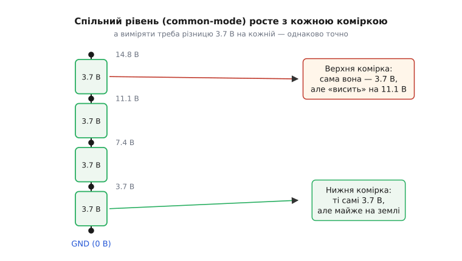
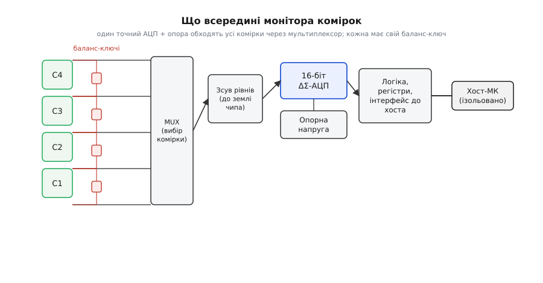
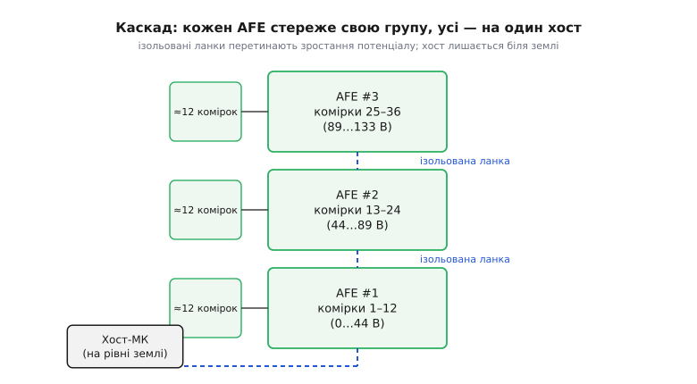

# Мікросхема-монітор комірок (Cell Monitor IC)

Одну літієву комірку виміряти легко: причепив вольтметр між її плюсом і мінусом — і ось тобі 3.7 В. Але щойно комірок стає багато й вони з'єднані **послідовно**, ця легкість зникає. У пакеті електромобіля сотня комірок у стосі, і напруга на самому верху — вольтів чотириста. Питання, яке здається дитячим — «скільки вольтів на комірці номер 87?» — раптом стає інженерною задачею, бо ця комірка «висить» за триста вольтів над землею, а виміряти на ній треба ті самі 3.7 В з точністю до одного міліампера напруги. **Монітор комірок** (англ. *cell monitor IC*, у побуті — *battery monitor* або *AFE*, від *analog front-end*) — це спеціалізована мікросхема, яка саме цю задачу й розв'язує: точно міряє напругу **кожної** комірки у високовольтному послідовному стосі та ще й керує їхнім балансуванням. Це вимірювальні очі великої батареї.

Щоб зрозуміти, навіщо взагалі окремий клас мікросхем на таку, здавалося б, просту роботу, треба спершу побачити, чому послідовне з'єднання перетворює звичайний вимір напруги на щось важке. Тоді стане ясно, чому в чипі саме такий набір блоків — і де закінчується його робота й починається робота решти батарейної системи.

## Чому вимір «плаває»: спільний рівень росте

Уся складність — в одному слові: **різницевий** вимір на високому спільному рівні. Візьмімо стос із чотирьох комірок по 3.7 В. Нижня комірка стоїть майже на землі: її мінус — це нуль, плюс — 3.7 В. З нею проблем нема. Але друга комірка вже мінусом сидить на 3.7 В, а плюсом — на 7.4 В. Третя — між 7.4 і 11.1 В. І щоб дізнатися напругу **на самій** третій комірці, треба відняти два великі й майже однакові числа: 11.1 − 7.4. Обидва «плавають» високо над землею, а різниця між ними — маленька.


*Кожна комірка дає ті самі 3.7 В, але «спільний рівень» під нею росте з висотою в стосі: у верхньої обидві клеми на десятки вольтів над землею, у нижньої — майже на нулі. Виміряти треба саме різницю 3.7 В — однаково точно на всіх, попри те що рівень під ними геть різний.*

Ось звідки береться термін **спільний рівень**, або **синфазна напруга** (англ. *common-mode voltage*) — це той спільний «п'єдестал», на якому обидві клеми комірки стоять над землею. У третьої комірки він близько 7–11 В; у сотої комірки тягового пакета — сотні вольтів. А вимірювальна схема, АЦП, живиться від скромних 3–5 В і рахує все відносно **своєї** землі. Просто завести на її вхід 11 В (а тим паче 400) не можна — це або вб'є вхід, або лежить далеко поза його діапазоном.

Постає й друга біда, тонша за першу. Навіть якби ми вміли витримати таку напругу, точність різницевого виміру на високому п'єдесталі — окрема мука. Уяви, що п'єдестал 300 В злегка «здригнувся» — на 0.1 %. Це 0.3 В зсуву спільного рівня. Якщо вимірювальна схема хоч трохи по-різному реагує на верхню й нижню клему (а ідеально однаково не буває), ці 0.3 В просочуються в результат — і твої дорогоцінні міліампери напруги комірки тонуть у похибці від здригання п'єдесталу. Здатність схеми **ігнорувати** синфазний рух і бачити лише різницю зветься **придушенням синфазного сигналу** (англ. *common-mode rejection*), і саме вона — головна чеснота, яку монітор комірок мусить мати вбудованою.

> 🔧 **Навіщо це.** Це не академічна тонкість, а причина, чому не можна «зекономити» й почепити на кожну комірку стосу окремий дешевий АЦП зі спільною землею. Такий АЦП або згорить від синфазної напруги, або втратить точність від її дрейфу. Монітор комірок платять саме за те, що він уміє точно міряти маленьку різницю, яка сидить високо й нестійко над землею, — а це набагато важче, ніж виміряти ту саму комірку окремо на столі.

## Що всередині: мультиплексор, зсув, точний АЦП

Тепер, коли зрозуміло **що** важко, стає ясно, **чому** чип збудований саме так. Найпряміше рішення напрошується марнотратне: поставити на кожну комірку окремий точний АЦП із власним придушенням синфазного сигналу. У стосі на сотню комірок це сто дорогих АЦП. Замість цього монітор комірок робить хитріше: він тримає **один** дуже точний АЦП і **по черзі під'єднує** його до кожної комірки через перемикач. АЦП дорогий і точний — тож він один; перемикач дешевий — тож він на кожну комірку.


*Один точний АЦП і одна опорна напруга обходять усі комірки через мультиплексор: вибрана комірка спершу зсувається до землі чипа, тоді оцифровується. Кожна комірка має свій баланс-ключ. Готові числа лягають у регістри, звідки їх забирає хост через ізольований інтерфейс.*

Розберімо ланцюг зліва направо, бо кожен блок стоїть тут із конкретної причини.

**Мультиплексор** (лат. *multiplex* — багаторазовий) — це керована матриця перемикачів, яка з усіх входів стосу обирає **одну** пару клем і пропускає її далі. Хочеш комірку 3 — мультиплексор замикає її плюс і мінус на вхід АЦП, решту відрубає. Наступний такт — комірку 4. За кілька сотень мікросекунд чип так обходить увесь стос. Ідея та сама, що й у будь-якому [мультиплексорі](topic:electronics/multiplexer): дорогий ресурс (тут — АЦП) розділяється в часі між багатьма джерелами.

**Зсув рівнів.** Оце — серце розв'язку синфазної проблеми. Обрана мультиплексором пара клем усе ще «висить» високо над землею чипа. Перш ніж віддати її АЦП, схема **зсуває** цю різницю вниз, до землі чипа, зберігаючи саме різницю й відкидаючи п'єдестал. Реалізацій кілька — від різницевого підсилювача з точно підібраними опорами до схеми з «летючим» конденсатором, що заряджається від комірки нагорі, тоді відключається й розряджається вже внизу, на вході АЦП, донісши напругу, але не донісши синфазний рівень. Хай яка схема, робота одна: перетворити «3.7 В, що сидять на 300 В» на «3.7 В відносно землі чипа». Спорідненість із загальним [зсувом рівнів між різними доменами напруги](topic:electronics/level-shifting) тут пряма, лише ставка на точність — куди вища.

**Точний АЦП з опорною напругою.** Тепер, коли на вході чиста різниця відносно землі, її оцифровує [аналого-цифровий перетворювач](topic:electronics/adc). І він тут не абиякий: у моніторах комірок майже завжди стоїть **дельта-сигма** АЦП (грец. літери Δ, Σ) на 16 біт. Чому саме він? Бо дельта-сигма бере точністю й придушенням шуму, а не швидкістю, — а моніторові швидкість менш важлива за точність: пів мілісекунди на весь стос цілком досить, зате похибка має бути мізерна. Наскільки мізерна — видно з паспортів: сумарна похибка виміру в цього класу тримається на рівні **одиниць мілівольтів** (типово 1–3 мВ на всьому діапазоні комірки). Це усталений факт, спільний для чипів усіх великих виробників.

Але АЦП сам по собі лише порівнює вхід зі своїм **еталоном** — [опорною напругою](topic:electronics/voltage-reference). Якщо еталон «попливе» на 0.1 %, попливуть і всі виміри — незалежно від того, який гарний АЦП. Тому в моніторі комірок опора — не дешевий стабілітрон, а прецизійне джерело з малим дрейфом від температури й часу. Її стабільність прямо перекладається в точність усіх ста комірок: еталон один, помилка в ньому — помилка скрізь. Ось чому в даташитах моніторів окремим рядком гордо стоїть саме параметр опори.

**Логіка й інтерфейс.** Оцифровані напруги лягають у внутрішні **регістри**. Далі цифрове ядро віддає їх назовні — хостовому мікроконтролеру, який зчитує весь стос і вирішує, що робити. Про зв'язок — трохи згодом, бо він тут із родзинкою.

## Балансування: не лише міряти, а й вирівнювати

Монітор комірок рідко буває суто вимірювальним. Майже завжди він ще й **балансує** — вирівнює заряд між комірками стосу. Причина проста й невблаганна: у послідовному пакеті [найслабша комірка диктує поведінку всього](topic:electronics/bms). Комірки, навіть однакові з виду, з часом дрейфують: одна заряджається трохи повніше за сусідок. На заряді вона перша впирається у верхню межу — і заряд усього пакета спиняється, лишивши решту недозарядженими. Без вирівнювання пакет недодає ємності й швидше старіє.

> 🔧 **Навіщо це.** Саме тому монітор і балансир так природно живуть в одному чипі. Щоб вирівняти комірки, треба спершу **знати**, яка з них попереду, — а це рівно те, що монітор і так міряє. Мати точні напруги всіх комірок і не мати чим зрівняти найповнішу було б безглуздо; тому чип, який уже все виміряв, заразом і зливає надлишок із тих, що вирвались уперед.

Найпоширеніше — **пасивне** балансування: на кожну комірку чип має свій **баланс-ключ** (польовий транзистор), який під'єднує до неї розрядний резистор і зливає надлишок у тепло, поки відстаючі комірки дотягнуться. Просто й дешево, тож так роблять у переважній більшості. Резистор буває **зовнішній** (тоді через ключ можна пропускати помітний струм, до сотень міліампер) або **внутрішній** (менший струм, зате зовсім без зайвих деталей). Ключі, резистори, вибір моменту — це вже деталі загального [балансування комірок](topic:electronics/battery-balancing); монітор дає для нього і вимір, і виконавчі ключі в одному корпусі.

Ось як виглядає рішення, кого зливати, у прошивці хоста, що читає напруги з монітора й вмикає потрібні баланс-ключі:

:::tabs

```cpp
// хост прочитав напруги всіх комірок стосу з монітора;
// вмикаємо баланс-ключ на кожній, що втекла вперед від найнижчої
#define N_CELLS        12u
#define BAL_THRESH_MV  15u      // поріг розбалансу, мВ

// повертає маску: біт i == 1 → зливати комірку i
uint16_t balance_decide(const uint16_t v_mV[N_CELLS]) {
    uint16_t v_min = v_mV[0];
    for (uint8_t i = 1; i < N_CELLS; i++)      // знайти найнижчу комірку
        if (v_mV[i] < v_min) v_min = v_mV[i];

    uint16_t mask = 0;
    for (uint8_t i = 0; i < N_CELLS; i++)
        if (v_mV[i] - v_min > BAL_THRESH_MV)    // втекла більш ніж на поріг
            mask |= (uint16_t)(1u << i);

    return mask;                                // цю маску хост запише в чип
}
```

```python
BAL_THRESH_MV = 15      # поріг розбалансу, мВ

def balance_decide(v_mV):
    """v_mV — напруги всіх комірок стосу з монітора, у мВ.
    Повертає маску: біт i == 1 → зливати комірку i."""
    v_min = min(v_mV)                       # найнижча комірка

    mask = 0
    for i, v in enumerate(v_mV):
        if v - v_min > BAL_THRESH_MV:       # втекла більш ніж на поріг
            mask |= 1 << i

    return mask                             # цю маску хост запише в чип
```

:::

Хост лише вирішує; сам розряд робить чип, замикаючи баланс-ключі за отриманою маскою. Тонкість, про яку легко забути: коли комірку **зливають** через її ж баланс-ключ, падіння на розрядному резисторі спотворює вимір саме цієї комірки. Тому точні системи на час виміру балансування **вимикають** — або чип уміє це робити сам. Дрібниця, а переплутаєш — і найповніша комірка здаватиметься нижчою, ніж є.

## Каскад: як зміряти сто комірок

Один монітор комірок покриває обмежену пачку — типово від кількох до 12–18 комірок. Але тяговий пакет — це сотні комірок. Ставити один гігантський чип на все не вийде: він мусив би витримувати всю напругу пакета одразу, а це вже не «десятки», а «сотні вольтів» на входах — інша ліга ізоляції. Рішення інше й елегантне: **каскад** (франц. *cascade* — водоспад).


*Стос ділять на групи; над кожною групою сидить свій монітор (AFE) на своєму рівні напруги. Монітори з'єднані ізольованими ланками у вертикальний ланцюг, а вниз від нього одна ланка йде до хоста, що лишається біля землі. Так один хост читає весь пакет, не торкаючись його високої напруги.*

Стос ділять на **групи** по десятку-два комірок, і над кожною групою сидить **свій** монітор. Кожен чип бачить лише «свою» напругу — скромні 40–70 В своєї групи, а не всі 400 пакета. А от між собою чипи з'єднані **послідовним ланцюгом** (англ. *daisy chain* — «ланцюжок стокроток»), і команди й дані біжать цим ланцюгом угору-вниз до єдиного хоста внизу.

Уся хитрість — у тому, **як** передавати сигнал через ланцюг, адже кожен наступний монітор сидить на десятки вольтів вище за попередній. Звичайний дріт тут не годиться: земля верхнього чипа — це вже не земля нижнього. Тому ланки роблять **ізольованими**: сигнал перестрибує різницю потенціалів через бар'єр, що пропускає дані, але не пропускає постійну напругу — найчастіше через трансформатор (імпульсний зв'язок крізь маленьку котушку). Такий ізольований послідовний зв'язок дозволяє зчитати всі сто комірок пакета **однією** парою дротів, що приходить на хост, який спокійно сидить біля землі й ніколи не торкається високої напруги стосу. Гальванічна розв'язка тут — не забаганка, а те саме, що й в іншому місці вимагає [ізольованого зв'язку між доменами з різним рівнем землі](topic:electronics/level-shifter), лише піднесене до масштабу сотень вольтів.

Це — головна відмінність монітора комірок від скромного [паливоміра](topic:electronics/fuel-gauge) чи [однокоміркового захисту](topic:electronics/battery-protection): ті працюють з однією коміркою на рівні землі, а монітор із самого початку скроєний під **багато комірок, що плавають високо**, і під те, щоб їх можна було зчитати каскадом.

## Де кінчається монітор і починається система

Найважливіше — не сплутати монітор комірок із сусідніми ролями, бо назви в маркетингу часто накладають одну на одну. Проведімо межі твердо.

**Монітор — це вимірювач, а не захист.** Його робота — точно **знати** напруги (і часто температури через входи для термісторів), а не самому рвати коло на аварії. Рішення «відрубати пакет» ухвалює хостовий мікроконтролер за прочитаними числами, а виконує його силовий **контактор** чи ключі — окрема силова частина. Багато моніторів, щоправда, мають вбудований і незалежний **аварійний поріг**: якщо якась комірка вискочила за межу, чип сам смикне тривожну лінію, не чекаючи хоста. Але це радше вбудований сторож на додачу, а не головна функція. Справжній останній рубіж — окремий незалежний [захист](topic:electronics/battery-protection), який стоїть поряд і спрацьовує, навіть коли й монітор, і хост осліпнуть.

**Монітор — це вимір напруги, а не облік заряду.** Він каже, скільки **вольтів** на кожній комірці, але не веде рахунку, скільки заряду втекло. Перевести напруги в «скільки відсотків лишилось» — робота [оцінки стану заряду](topic:electronics/state-of-charge), яку виконує хост або окремий паливомір, часто ще й інтегруючи струм через [шунт](topic:electronics/kelvin-shunt), якого в самому моніторі зазвичай нема. Монітор дає сирі, але точні дані; висновки з них робить система вище.

**Монітор — це частина BMS, а не вся BMS.** [Система керування батареєю](topic:electronics/bms) — це весь мозок: облік заряду й здоров'я, керування зарядом, зв'язок, тепловий менеджмент, аварійні відключення. Монітор комірок — її **вимірювальний орган**, очі, що дивляться на кожну комірку. Потужна BMS — це хост-мікроконтролер плюс каскад моніторів плюс силова частина плюс окремий захист. Назвати сам монітор «BMS» — все одно що назвати очі людиною.

> 🔧 **Навіщо це.** Практичне правило при читанні специфікації: коли бачиш «battery monitor», «cell monitor» чи «AFE», уточнюй, що саме чип уміє — лише міряти, міряти й балансувати, чи ще й має аварійні пороги. І ніколи не покладайся на монітор як на захист: точний вимір і надійний обрив кола — різні задачі, і в серйозному пакеті їх свідомо роблять **різні** мікросхеми, щоб відмова однієї не осліпила іншу.

Отже, монітор комірок — це прецизійні очі великої послідовної батареї: він точно міряє напругу кожної комірки попри високий і хиткий спільний рівень, балансує їх, і каскадом віддає всю картину одному хостові. Він не заряджає, не рахує відсотки й сам не рятує пакет — він **бачить**, а бачити точно кожну ланку високовольтного стосу і є та єдина важка річ, без якої вся решта керування батареєю була б сліпою.
