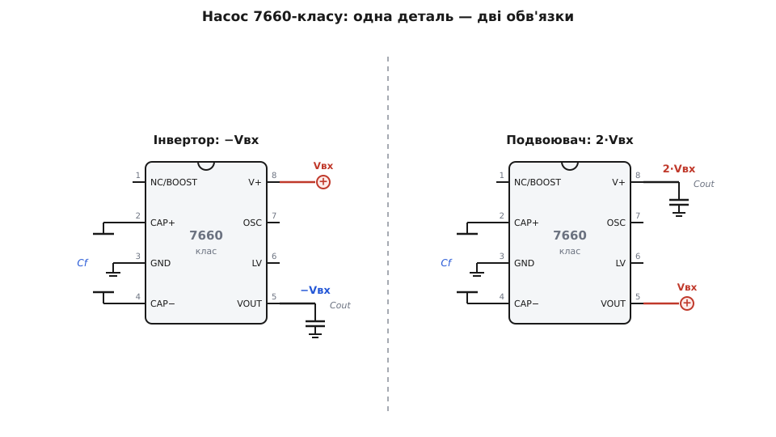

# 🔌 Помпи ICL7660-класу: −5 В із +5 В на двох конденсаторах

Колись, щоб дістати від'ємну шину для операційного підсилювача чи RS-232, на платі тримали окремий трансформатор або другий випрямляч. На початку 1980-х Intersil випустила крихітну CMOS-мікросхему **ICL7660** — за документованими даними, **перший монолітний** перетворювач на перемикальних конденсаторах, що вмістив усю потрібну схему в один кристал. Вона робила те саме самими конденсаторами: давала −5 В із +5 В, поміщалася у 8-вивідний корпус і коштувала копійки. Схема виявилася настільки вдалою, що стала фактичним стандартом — пін-сумісні аналоги випустили інші виробники (Linear Technology **LTC1044**, пізніше Maxim **MAX1044**, Telcom/Microchip **TC7660**), а назва «7660» досі означає «той самий інвертор живлення на двох конденсаторах». Розберімо цей клас як готовий компонент: що в нього на виводах, як його обв'язати на дві типові задачі й де він боляче підводить.

Усередині мікросхеми [зарядної помпи](book:electronics/charge-pump-conv) сидять чотири ключі та генератор, які перекидають зовнішній **летючий конденсатор** між входом і виходом, — це апаратне втілення того самого перекидання. Нас тут цікавить готова деталь: її виводи, обв'язка й граблі.

## Що на виводах

Майже всі помпи 7660-класу повторюють однакову 8-вивідну розпіновку (корпус DIP-8 або SOIC-8). Запам'ятавши її раз, ви впізнаєте чип на будь-якій платі.

```
        ICL7660 / MAX1044 / TC7660  (вид згори, DIP-8)
        ┌─────────∪─────────┐
  NC/BOOST │ 1           8 │ V+      ← вхідне живлення (+1.5…+10 В)
     CAP+  │ 2           7 │ OSC     ← вивід генератора (зовн. такт / конденсатор)
      GND  │ 3           6 │ LV      ← вибір низьковольтного режиму
     CAP−  │ 4           5 │ VOUT    ← вихід (−Vвх у режимі інвертора)
        └───────────────────┘
```

Перекинемо по одному:

- **V+ (вив. 8)** — вхідне живлення. Робочий діапазон класичного 7660 — від **1.5 до 10 В**; саме від нього помпа й «відштовхується».
- **GND (вив. 3)** — спільна земля.
- **CAP+ (вив. 2)** і **CAP− (вив. 4)** — сюди вмикають **летючий конденсатор** Cf. Це той самий конденсатор, який ключі всередині перекидають десятки тисяч разів на секунду; без нього помпа мертва.
- **VOUT (вив. 5)** — вихід. У режимі інвертора тут з'являється **−Vвх**; до нього вішають **вихідний (резервуарний) конденсатор** Cout на землю, який і живить навантаження між пакетами заряду.
- **OSC (вив. 7)** — вивід вбудованого генератора. Лишений вільним, він задає внутрішню частоту (у 7660 типово **≈ 10 кГц**). Сюди можна або повісити конденсатор, щоб **знизити** частоту, або подати зовнішній такт, щоб **синхронізувати** помпу з рештою схеми (корисно, коли її свист на 10 кГц заважає).
- **LV (вив. 6)** — вибір низьковольтного режиму. Для живлення **нижче ≈ 3.5 В** його з'єднують із землею (вимикають внутрішній стабілізатор зміщення); для вищої напруги лишають **вільним**. Це найчастіша причина, чому «нова плата не запускається від 3 В»: забули посадити LV на землю.
- **NC / BOOST (вив. 1)** — у класичного ICL7660 це **NC** (не під'єднано). А от у **MAX1044** на цей вивід вивели функцію **BOOST**: з'єднавши його з V+, ви піднімаєте частоту генератора **в шість разів** (приблизно з 10 до 60 кГц). Навіщо — побачимо нижче, коли йтиметься про пульсації та розмір конденсаторів.

> 🔧 **Навіщо це.** Уся обв'язка помпи 7660-класу — це **два конденсатори** (летючий Cf і вихідний Cout, обидва зазвичай 10 мкФ) плюс, за потреби, дріт із LV на землю. Жодної котушки, жодного діода. Якщо на платі ви бачите 8-вивідну мікросхему з двома однаковими конденсаторами поряд і без котушки — це майже напевно помпа, і шукати її вихід треба на виводі 5.

## Дві обв'язки: інвертор і подвоювач

Та сама мікросхема робить **дві** різні речі залежно від того, куди підключити входи й вихід. Це найважливіше, що дає клас на практиці.


*Зліва — стандартний інвертор: живлення на V+, два конденсатори, вихід −Vвх знімають із VOUT (так роблять класичні −5 В із +5 В). Справа — подвоювач: вхід подають на VOUT, а подвоєну напругу 2·Vвх знімають уже з виводу V+. Корпус і деталі ті самі — змінюється лише, який вивід вхід, а який вихід.*

**Інвертор (−Vвх із +Vвх).** Це «рідна» схема 7660. Живлення +Vвх — на V+ (вив. 8); летючий конденсатор — між CAP+ і CAP−; вихідний конденсатор — з VOUT (вив. 5) на землю. На VOUT з'являється **−Vвх**. Подавши +5 В, дістаєте −5 В; подавши +3.3 В — −3.3 В. Саме так роблять від'ємну шину для операційного підсилювача чи зсув ЖК-дисплея.

**Подвоювач (2·Vвх).** Та сама мікросхема, але ввімкнена «навиворіт»: вхідне живлення подають **на вивід VOUT (вив. 5)**, а **подвоєну** напругу знімають уже з виводу **V+ (вив. 8)**. Помпа тут переставляє заряджений летючий конденсатор так, що його напруга **додається** до входу. З +5 В дістаєте близько +10 В (мінус неминуча просадка) — зручно, коли одну дрібну шину треба підняти, а другого перетворювача заводити не хочеться.

```
Інвертор:   Vвх → V+ (вив.8),  Vвих = −Vвх    на VOUT (вив.5)
Подвоювач:  Vвх → VOUT (вив.5), Vвих = +2·Vвх  на V+ (вив.8)
```

## Граблі класу: струм, просадка, пульсації, свист

Помпа 7660-класу — деталь з характером. Її обмеження прямо випливають із того, що вона переносить заряд **пакетами**, тож вони однакові для будь-якого виробника.

**Малий струм.** Класичний 7660 віддає **одиниці міліампер** при розумній просадці (≈ 10 мА на 0.5 В просадки виходу; гранично — до 40 мА, але вже з помітним падінням). Це не помилка конкретного чипа, а стеля принципу: вихідний струм дорівнює Cf·ΔV·f, а всі три множники малі. Тому 7660 — для **допоміжних** шин (живлення ОП, зсув, RS-232), а не для живлення логіки чи світлодіодів.

**Просадка під навантаженням.** Помпа поводиться як **джерело з послідовним вихідним опором** Rвих ≈ 1/(Cf·f). У класичного 7660 на 10 кГц цей опір — **десятки ом**, тож −5 В під кількома міліамперами легко перетворюються на −4.5 В.

```
ICL7660:  Vвих = −Vвх − Iвих · Rвих,  Rвих ≈ 50…100 Ом  (на 10 кГц)
LM2662:   те саме, але Rвих ≈ 3.5 Ом  (бо f ≈ 150 кГц і потужніші ключі)
```

> 🔧 **Навіщо це.** −5 В на холостому ходу й −5 В під навантаженням — різні речі. Закладаючи помпу, **рахуйте просадку**: помножте свій струм на Rвих із даташита й перевірте, чи вистачить того, що лишиться. Якщо потрібні стабільні −5 В незалежно від струму — ставте після помпи лінійний стабілізатор або беріть регульований чип (нижче).

**Пульсації та свист.** Вихід помпи не гладкий: щопакет заряду напруга трохи стрибає, тож на VOUT сидять **пульсації** на частоті перемикання. На 10 кГц вони ще й потрапляють у **чутний діапазон** — конденсатори можуть тихо пищати. Два важелі: побільшити вихідний конденсатор (згладжує пульсації) і **підняти частоту**. Саме для цього в MAX1044 є вивід **BOOST**: посадивши його на V+, ви женете генератор на ≈ 60 кГц — пульсації меншають, частота йде з чутного діапазону, та й конденсатори можна взяти дрібніші. Той самий ефект дає сучасніший клас із заводською частотою в сотні кілогерц — мегагерц.

## Коли брати потужнішого або регульованого родича

7660 — родоначальник, але не межа класу. Якщо його **струму чи стабільності** замало, не кидайте помпу зовсім — візьміть сучаснішого родича з тією самою ідеєю:

- **LM2662 / LM2663** (TI) — той самий інвертор-подвоювач, але на **150 кГц** і з потужнішими ключами: віддає до **200 мА** при вихідному опорі **≈ 3.5 Ом** і ККД понад **90 %**. Робочий діапазон вужчий (1.5…5.5 В), зате струму на порядок більше. Беруть, коли від'ємна шина має тягнути не міліампери, а сотні міліампер. Кілька таких можна ввімкнути **паралельно**, щоб іще зменшити вихідний опір.
- **LM27762** (TI) — коли треба **тихо й стабільно**. Це вже не гола помпа, а помпа **плюс лінійні стабілізатори** на обох виходах: дає **регульовані** ±1.5…±5 В до **±250 мА**, працює на **2 МГц** (крихітні конденсатори, малі пульсації) і видає низькошумне живлення, придатне для аналогових ланцюгів. Платить за це складнішою обв'язкою й вужчим входом (2.7…5.5 В).

Спосіб вибору простий і випливає з граблів вище: **струм до ~10 мА, байдуже до просадки** — класичний ICL7660/MAX1044; **струм до сотень мА** — LM2662-клас; **треба стабільні низькошумні рейки** — інтегрована помпа-з-LDO на кшталт LM27762. А де потрібен ще більший струм або високий ККД на проміжній напрузі — помпа вже не помічник, там працюють котушкові [buck](book:electronics/buck) і [boost](book:electronics/boost).
