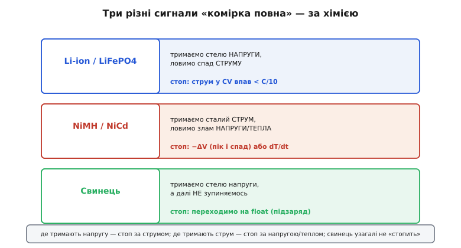
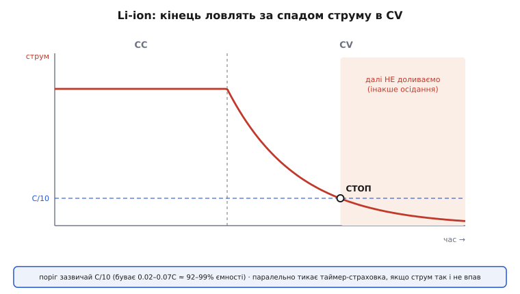
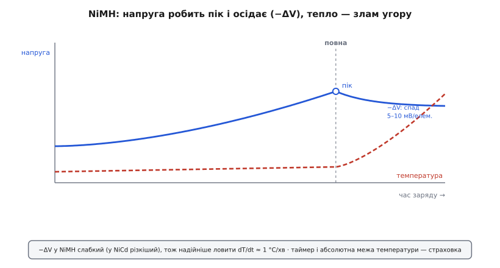
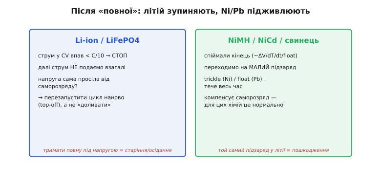

# Методи термінації заряду

Наповнити батарею — половина справи; друга половина, і часто складніша, — вчасно **зупинитися**. Термінація (лат. *terminus* — межа, край) заряду — це рішення «комірка повна, вимикай», і від того, як його ухвалено, залежить, чи проживе батарея роки, а чи спухне й спалахне за пів сотні циклів. Підступність у тому, що батарея не має «поплавка», який сам би сплив і перекрив кран. Ознака повноти прихована: її треба **вивести** з напруги, струму, температури чи часу — і кожна хімія ховає її по-своєму. Хто переносить спосіб зупинки з однієї хімії на іншу, зазвичай псує батарею, а з літієм — ризикує пожежею.

Тому термінація — це не одна кнопка, а **набір критеріїв**, кожен зі своєю фізикою, надійністю й пасткою. Розберімо їх окремо: за струмом, за напругою, за її спадом (−ΔV), за температурою (dT/dt) і за часом — а тоді зберемо в реальну логіку зупинки, яку виконує зарядний чип чи прошивка. Наскрізна думка проста: **сигнал кінця живе там, де хімія лишає стабільну величину**, і завдання інженера — знайти цей сигнал і не переплутати його з шумом.

### Чому «повна» — це не очевидно

Здавалося б, повнота мала б читатися прямо з напруги: залив до стелі — готово. Але напруга під струмом **бреше**. На клемах ми бачимо не рівноважний потенціал комірки, а його разом із падінням `I × R` на внутрішньому опорі (та сама [просадка, що з'їдає напругу під навантаженням](topic:electronics/battery-sag)). Поки тече зарядний струм, клеми показують більше, ніж комірка «насправді» має. Тому виміряти справжній стан наповнення прямо посеред заряду не вийде — доводиться або тримати одну величину сталою й стежити за іншою, або ловити тонку прикмету, що з'являється рівно в мить повноти.

Звідси й розкол за хіміями. Він зводиться до одного питання: **що зарядник тримає, а за чим стежить**.


*Де тримають напругу (літій) — повноту ловлять за спадом струму. Де тримають струм (нікель) — за зламом напруги чи температури. Свинець після стелі напруги взагалі не «зупиняється», а переходить на підзаряд. Однакового «стопа» для всіх немає — критерій диктує хімія.*

У літію зарядник **тримає стелю напруги** (у фазі сталої напруги), тож напруга вже не інформативна — вона зафіксована. Зате струм у цій фазі сам спадає, і його спад — чесний сигнал наповнення. У нікелевих хімій навпаки: зарядник **жене сталий струм**, напруга вільна — і саме вона (точніше, її злам) видає повноту. А свинець узагалі не шукає моменту «стоп»: наситившись, він переходить у режим вічного підживлення. Тобто спосіб термінації — прямий наслідок того, яку величину алгоритм заряду зробив сталою. Далі — кожен критерій зокрема.

### Термінація за струмом: спад у фазі сталої напруги

Це головний метод для літію (Li-ion, LiPo, LiFePO4). Він працює всередині фази **сталої напруги** канонічного алгоритму [CC/CV](topic:electronics/li-ion-charger), де зарядник тримає на комірці незмінну верхню напругу (для звичайного Li-ion — 4.2 В). Комірка наповнюється, її «апетит» до струму згасає, і струм сам собою спадає по спадній. Ось цей спад і читають.

Логіка зупинки: щойно зарядний струм у фазі сталої напруги падає **нижче заданого порога**, комірку вважають повною й заряд вимикають. Класичний поріг — **C/10**, десята частина від ємності: для комірки 2000 мА·год це 200 мА. Різні виробники беруть від приблизно **0.02C до 0.07C** — нижчий поріг доливає повніше (ближче до 100% ємності), але хвіст тягнеться довше; C/10 зупиняє десь на 92% ємності, зате швидше.


*У фазі сталого струму струм тримається на максимумі, у фазі сталої напруги — спадає по спадній. Коли він падає нижче порога (зазвичай C/10 ≈ 92% ємності, буває 0.02–0.07C), заряд зупиняють. Після стопу літій НЕ доливають: підзаряд у повну комірку веде до осідання. Паралельно тикає таймер-страховка — на випадок, якщо струм так і не впаде.*

Чому саме спад струму — надійний сигнал? Бо він прямо відображає, скільки заряду ще «влазить»: чим повніша комірка, тим менша різниця між прикладеною напругою й рівноважним потенціалом, тим менший струм вона бере. На відміну від напруги, цей показник не спотворений `I × R` — навпаки, він і є наслідком наповнення. Тому термінація за струмом дає повторюваний результат від циклу до циклу.

> 🔧 **Навіщо це.** Обираючи зарядний чип, знайдіть у даташиті поле *termination current* (часто позначене I_TERM або I_STDBY) і спосіб його задати — резистором чи регістром по I²C. Це напряму керує тим, до скількох відсотків заряджається ваша батарея. Хочете щадити ресурс — ставте вищий поріг (C/5): комірка зупиниться трохи «недо-повною», зате менше часу простоїть під граничною напругою, а це прямо подовжує життя.

Ось як цей критерій виглядає в прошивці, коли струм і напругу міряє мікроконтролер (наприклад, коли зарядом керує сам МК, а не автономний чип):

**Приклад (термінація за струмом у фазі CV).** Зупиняємо, коли струм тримається нижче C/10 підряд кілька вимірів (щоб не спрацювати на випадковий провал).

:::tabs

```cpp
// Термінація Li-ion за спадом струму у фазі сталої напруги.
#define CAP_MAH        2000      // ємність комірки, мА·год
#define I_TERM_MA      (CAP_MAH / 10)   // поріг C/10 = 200 мА
#define V_CV_MV        4200      // стеля напруги фази CV
#define DEBOUNCE_N     3         // скільки вимірів поспіль під порогом

static uint8_t below_cnt = 0;

// Повертає true, коли заряд треба зупинити.
bool charge_done(uint16_t vcell_mv, uint16_t icharge_ma) {
    // Термінація за струмом чинна ЛИШЕ у фазі CV: напруга вже на стелі.
    if (vcell_mv < V_CV_MV - 20)         // ще у фазі CC — рано
        return false;
    if (icharge_ma < I_TERM_MA) {
        if (++below_cnt >= DEBOUNCE_N)   // стабільно нижче порога
            return true;                 // → повна, вимикаємо
    } else {
        below_cnt = 0;                   // струм підскочив — лічильник назад
    }
    return false;
}
```

```python
# Термінація Li-ion за спадом струму у фазі сталої напруги.
CAP_MAH    = 2000            # ємність комірки, мА·год
I_TERM_MA  = CAP_MAH // 10   # поріг C/10 = 200 мА
V_CV_MV    = 4200            # стеля напруги фази CV
DEBOUNCE_N = 3               # скільки вимірів поспіль під порогом

_below_cnt = 0               # стан між викликами

def charge_done(vcell_mv, icharge_ma):
    """Повертає True, коли заряд треба зупинити."""
    global _below_cnt
    # Термінація за струмом чинна ЛИШЕ у фазі CV: напруга вже на стелі.
    if vcell_mv < V_CV_MV - 20:          # ще у фазі CC — рано
        return False
    if icharge_ma < I_TERM_MA:
        _below_cnt += 1
        if _below_cnt >= DEBOUNCE_N:     # стабільно нижче порога
            return True                  # → повна, вимикаємо
    else:
        _below_cnt = 0                   # струм підскочив — лічильник назад
    return False
```

:::

Висновок: критерій — не миттєвий, а стійкий (кілька вимірів під порогом), і чинний **тільки** у фазі сталої напруги, бо в фазі сталого струму струм великий за визначенням, і перевіряти його на C/10 було б безглуздо.

### Термінація за напругою: коли зупиняє стеля

Найпростіший на вигляд критерій: заряд іде, поки напруга не дійде цільового значення, — і стоп. Він природний для хімій, де є чітка **напруга-стеля**, за яку не можна: для літію це небезпечна межа (перевищиш 4.2 В — стрес, нагрів, ризик [теплового розгону](topic:electronics/battery-mechanics)).

Тут криється поширена плутанина, яку варто розвести раз і назавжди. У літію напруга-стеля (4.2 В) **не** є сигналом «зупинись» — вона є сигналом «**перемкнись** зі сталого струму на сталу напругу». Досягнення 4.2 В означає лише кінець першої фази, а не кінець заряду; після нього комірка ще довго доливається у фазі сталої напруги, і зупиняє її вже спад струму, розглянутий вище. Якби літій вимикали прямо по 4.2 В, він недобирав би відсотків двадцять ємності, бо в мить дотику до стелі всередині ще повно «місця».

Проте як **самостійна** термінація зупинка за напругою теж існує — там, де немає окремої фази сталої напруги. Простий заряд свинцевого акумулятора малим струмом можна вести до цільової напруги й на ній зупиняти. І майже завжди зупинка за напругою служить **аварійною межею**: хоч би що показували інші критерії, якщо напруга перевищила абсолютний максимум — заряд рубають негайно, це остання лінія захисту від перезаряду.

> 🔧 **Навіщо це.** У власній прошивці заряду завжди тримайте зупинку за напругою як жорсткий запобіжник поверх основного критерію: `if (vcell_mv > V_MAX_HARD) stop();`. Основну термінацію робить спад струму, але якщо давач струму збрехав чи петля керування зірвалася, саме абсолютна межа напруги врятує комірку від перезаряду. Один рядок — а це різниця між зіпсованою платою й пожежею.

### Термінація за спадом напруги (−ΔV): прикмета нікелю

Нікелеві хімії (NiMH, NiCd) заряджають інакше — **сталим струмом** до кінця, без фази сталої напруги. Напруга при цьому вільно росте, і зупиняти за досягненням якоїсь стелі не можна: у нікелю немає різкої небезпечної межі по напрузі, зате є тонка прикмета повноти в **формі кривої**.

Ось що відбувається. Поки комірка приймає заряд, енергія йде на корисну реакцію, і напруга поволі повзе вгору. Коли комірка наповнилася, приймати заряд у ту саму реакцію більше нема куди — і струм, що далі тече, починає йти на **побічні процеси** (усередині рекомбінує кисень, комірка гріється). Через це напруга спершу виходить на **пік**, а тоді трохи **осідає** — на кілька мілівольтів. Цей крихітний спад після піка й зветься **−ΔV** (negative delta-V, від'ємний приріст напруги): щойно похідна напруги за часом стала від'ємною, комірку вважають повною.


*Під сталим струмом напруга NiMH поволі росте, робить пік у мить повноти й трохи осідає (−ΔV, типово 5–10 мВ на елемент). Одночасно температура, що ледь мінялася, після повноти круто йде вгору — це другий, надійніший сигнал (dT/dt ≈ 1 °C/хв). Понад те тримають таймер і абсолютну межу температури як страховку.*

Величина спаду мала — для NiMH це **приблизно 5–10 мВ на елемент** (у NiCd −ΔV виражений різкіше, тому історично метод відточили саме на кадмієвих комірках). І тут одразу видно слабкість критерію: ловити падіння в кілька мілівольтів на тлі шуму, контактних опорів і температурного дрейфу — важко. У NiMH пік ще й пологіший, ніж у NiCd, тож −ΔV для нього **ненадійний сам по собі**: легко або проскочити (перезаряд), або спрацювати завчасно. Саме тому історія цього методу — окрема повчальна історія про те, [як −ΔV народився на NiCd і мало не зламався на NiMH](topic:electronics/charge-termination/hist-delta-v.md), і чому знадобився надійніший критерій.

### Термінація за температурою (dT/dt): коли напруга ненадійна

Надійніший критерій для нікелю ховається не в напрузі, а в **теплі**. Логіка та сама, що з −ΔV, але сигнал сильніший. Поки комірка приймає заряд у корисну реакцію, вона гріється мало. Коли ж вона повна й енергія струму йде на побічні процеси, ця енергія майже вся перетворюється на **тепло** — і температура, доти майже рівна, різко йде вгору.

Ключ — не абсолютна температура (вона залежить від того, у теплі чи на морозі стоїть пристрій), а **швидкість її зростання**, dT/dt (похідна температури за часом). Для NiMH поріг — приблизно **1 °C за хвилину** (у джерелах трапляється 0.9 ±0.2 °C/хв): щойно комірка почала грітися швидше за цей темп, заряд зупиняють. Це працює навіть там, де −ΔV губиться в шумі, бо злам температури виражений куди чіткіше, ніж мілівольтовий провал напруги. Тому dT/dt — **основний** критерій для NiMH, а −ΔV лишається як допоміжний.

**Приклад (термінація NiMH за швидкістю нагріву).** Раз на кілька секунд рахуємо приріст температури; перевищив поріг — стоп.

:::tabs

```cpp
// Термінація NiMH за dT/dt: ловимо різкий нагрів у мить повноти.
#define DTDT_STOP_DC_PER_MIN  10    // поріг 1.0 °C/хв, у десятих °C
#define SAMPLE_S              5     // період вимірювання температури, с

static int16_t  t_prev_dc = 0;      // попередня температура, десяті °C
static uint32_t t_prev_ms = 0;

// cell_temp_dc — температура комірки в десятих градуса (напр., 253 = 25.3 °C)
bool nimh_done(int16_t cell_temp_dc, uint32_t now_ms) {
    if (t_prev_ms == 0) {           // перший виклик — лише запам'ятати
        t_prev_dc = cell_temp_dc;
        t_prev_ms = now_ms;
        return false;
    }
    if (now_ms - t_prev_ms < SAMPLE_S * 1000UL)
        return false;               // ще рано міряти нахил

    int32_t d_temp = cell_temp_dc - t_prev_dc;             // приріст, десяті °C
    int32_t d_min  = (now_ms - t_prev_ms) / 60000;         // час, хвилини (цілі)
    t_prev_dc = cell_temp_dc;
    t_prev_ms = now_ms;

    // нахил у десятих °C за хвилину; ділення бережемо від нуля
    if (d_min > 0 && d_temp / d_min >= DTDT_STOP_DC_PER_MIN)
        return true;                // комірка різко гріється → повна
    return false;
}
```

```python
# Термінація NiMH за dT/dt: ловимо різкий нагрів у мить повноти.
DTDT_STOP_DC_PER_MIN = 10    # поріг 1.0 °C/хв, у десятих °C
SAMPLE_S             = 5     # період вимірювання температури, с

_t_prev_dc = 0              # попередня температура, десяті °C
_t_prev_ms = 0             # стан між викликами

def nimh_done(cell_temp_dc, now_ms):
    # cell_temp_dc — температура комірки в десятих градуса (напр., 253 = 25.3 °C)
    global _t_prev_dc, _t_prev_ms
    if _t_prev_ms == 0:             # перший виклик — лише запам'ятати
        _t_prev_dc = cell_temp_dc
        _t_prev_ms = now_ms
        return False
    if now_ms - _t_prev_ms < SAMPLE_S * 1000:
        return False                # ще рано міряти нахил

    d_temp = cell_temp_dc - _t_prev_dc          # приріст, десяті °C
    d_min  = (now_ms - _t_prev_ms) // 60000     # час, хвилини (цілі)
    _t_prev_dc = cell_temp_dc
    _t_prev_ms = now_ms

    # нахил у десятих °C за хвилину; ділення бережемо від нуля
    if d_min > 0 and d_temp // d_min >= DTDT_STOP_DC_PER_MIN:
        return True                 # комірка різко гріється → повна
    return False
```

:::

Висновок: критерій дивиться на **нахил**, а не на рівень, тож він однаково працює і в холодній кімнаті, і в теплій. Термістор при цьому має тулитися **до самої комірки** — інакше він міряє нагрів повітря, а не літію чи нікелю, і пропускає момент.

> 🔧 **Навіщо це.** Якщо колись доведеться заряджати NiMH-збірку самотужки (радіокерована модель, старий інструмент), не покладайтеся на −ΔV — беріть чип чи алгоритм із dT/dt і фізично приклейте термістор до банок. Дешеві «зарядки» без давача температури тримаються лише на таймері й помаленьку вбивають акумулятори перезарядом. Термістор тут — не опція, а те, що відрізняє живу збірку від здутої.

### Термінація за часом: страховка, а не основа

Найгрубіший критерій — просто **таймер**: заряджали задану кількість годин — стоп. Сам по собі він поганий, бо не знає стану комірки: недозарядить свіжу батарею й перезарядить пошкоджену. Але як **страховка** поверх точного критерію таймер незамінний.

Уявіть, що основний критерій завис. Струм у фазі сталої напруги через дефект комірки чи витік ніяк не спадає до C/10; або −ΔV так і не з'явився, бо контакт поганий. Без запобіжника заряд ішов би вічно, женучи комірку в перезаряд. Таймер це рубає: «хоч би що там із струмом, за N годин зупинись». Тому в кожному серйозному зарядному алгоритмі таймер стоїть **паралельно** основному методу — не щоб визначати повноту, а щоб обмежити збиток, коли основний сигнал не спрацював. Часто таймерів кілька: окремий короткий — на фазу передзаряду (глибоко сіла комірка мусить вийти з небезпечної зони за розумний час, інакше вона несправна), окремий довгий — на весь цикл.

### Після зупинки: чому літій не «доливають»

Термінація — це не лише «коли зупинити», а й «що робити далі». І тут проходить найважливіший вододіл між хіміями, на якому найлегше обпектися.


*Літій після термінації зупиняють остаточно й струму більше не подають; просіла напруга — перезапускають цикл наново (top-off), а не доливають потроху. Нікель і свинець, навпаки, переходять на постійний малий підзаряд (trickle / float), що компенсує саморозряд. Той самий підзаряд, корисний для Ni/Pb, у літії веде до пошкодження.*

Свинець і нікель можна тримати на **підзаряді** нескінченно: після повноти на них подають крихітний струм (свинцевий *float*, нікелевий *trickle* — краплинний, від англ. *trickle* — струмочок), що просто компенсує саморозряд і тримає комірку «під зав'язку». Для цих хімій це штатний, здоровий режим.

З **літієм так не можна**, і це фундаментальна відмінність. Тримати повністю заряджену літієву комірку під постійною напругою — означає прискорювати її [старіння](topic:electronics/battery-aging); а доливати струм у вже повну комірку небезпечно — це шлях до [осідання металевого літію на аноді](topic:electronics/fast-charging), незворотної втрати ємності й дендритів. Тому літій заряджають до повного й **остаточно зупиняють**. Якщо з часом напруга сама просіла від саморозряду, зарядник не «доливає потихеньку», а **перезапускає весь цикл наново** (це зветься top-off, дозаряд): чекає, поки напруга впаде до порога поновлення (типово близько 4.0–4.1 В), і тоді проганяє коротку фазу сталої напруги ще раз. Порційно, а не безперервно — щоб комірка більшість часу відпочивала нижче стелі.

Ця відмінність — одна з найчастіших пасток для тих, хто переносить звички зі свинцевих чи нікелевих систем на літій: підзаряд, що там рятував, тут повільно вбиває. Дзеркально й зберігання: залишати літій «на полиці» повністю зарядженим — чи не найгірше, бо повна комірка старіє найшвидше; для тривалого зберігання її лишають зарядженою приблизно наполовину (~3.7–3.8 В), і розумні зарядники самі вміють доводити до такого рівня замість повного.

### Як критерії поєднують у реальному чипі

Наостанок варто побачити, що в живому зарядному пристрої термінація — не один критерій, а **кілька разом**, і рішення «стоп» ухвалюється за принципом «спрацював будь-який». Ідея проста: кожен окремий сигнал має свою сліпу пляму, тож їх накладають, щоб дірку одного закривав інший.

Для літію це виглядає так: **основний** критерій — спад струму до C/10; поверх нього **жорстка межа напруги** (перезаряд рубати негайно); поверх усього — **таймер** на випадок, якщо струм застряг; і паралельно — **температурне вікно** (нижче 0 °C заряд не починати, у спеку зупиняти), яке галузь звела в настанови JEITA. Спрацював будь-який стоп-критерій — заряд вимикається. Для нікелю набір інший: **основний** dT/dt, **допоміжний** −ΔV, і та сама пара запобіжників — таймер плюс абсолютна межа температури.

:::tabs

```cpp
// Рішення «стоп» для Li-ion: спрацював БУДЬ-ЯКИЙ критерій.
bool li_ion_terminate(uint16_t vcell_mv, uint16_t icharge_ma,
                      int16_t temp_dc, uint32_t elapsed_s) {
    if (vcell_mv > 4250)                 return true;  // аварія: перезаряд по напрузі
    if (temp_dc  > 450 || temp_dc < 0)   return true;  // поза вікном (>45 °C або <0 °C)
    if (elapsed_s > 6UL * 3600)          return true;  // таймер-страховка: 6 год
    return charge_done(vcell_mv, icharge_ma);          // основне: спад струму до C/10
}
```

```python
# Рішення «стоп» для Li-ion: спрацював БУДЬ-ЯКИЙ критерій.
def li_ion_terminate(vcell_mv, icharge_ma, temp_dc, elapsed_s):
    if vcell_mv > 4250:                  return True   # аварія: перезаряд по напрузі
    if temp_dc > 450 or temp_dc < 0:     return True   # поза вікном (>45 °C або <0 °C)
    if elapsed_s > 6 * 3600:             return True   # таймер-страховка: 6 год
    return charge_done(vcell_mv, icharge_ma)           # основне: спад струму до C/10
```

:::

Висновок: надійна термінація — це **шар критеріїв**, де точний метод визначає нормальну повноту, а грубі (напруга, температура, час) страхують від збою. Саме тому готовий зарядний чип містить усе це всередині, а розробнику лишається задати пороги під свою комірку й хімію — і, головне, не сплутати, який сигнал кінця чинний для якої батареї.

### Підсумок теми

Термінація заряду — це рішення «комірка повна, стоп», і сигнал кінця живе там, де хімія лишає стабільну прикмету. Напруга під струмом бреше через `I × R`, тож прямо читати повноту не можна. Літій заряджають, тримаючи **стелю напруги**, і зупиняють за **спадом струму** у фазі сталої напруги (поріг зазвичай C/10, буває 0.02–0.07C); досягнення 4.2 В — це не «стоп», а перемикання фаз, а сама зупинка за напругою служить аварійною межею. Нікель заряджають **сталим струмом** і ловлять повноту за зламом кривої: слабким **−ΔV** (5–10 мВ/елемент, ненадійний для NiMH) або, надійніше, за **швидкістю нагріву dT/dt** (~1 °C/хв). **Таймер** — не основа, а страховка від зависання основного критерію. Після зупинки проходить головний вододіл: свинець і нікель тримають на вічному **підзаряді** (float / trickle), а літій **остаточно зупиняють** і при потребі перезапускають цикл (top-off), бо підзаряд у повний літій веде до старіння й осідання. У реальному чипі критерії **накладають** (спрацював будь-який), щоб сліпу пляму одного закривав інший. Головна пастка — перенести спосіб термінації з однієї хімії на іншу: те, що рятує нікель, псує літій.
