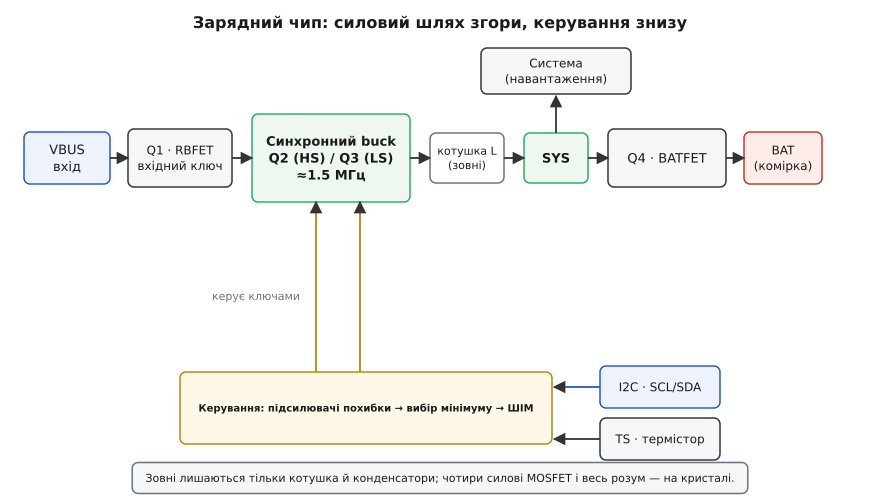
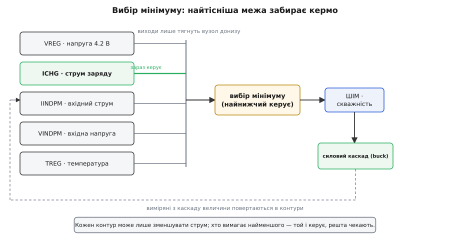
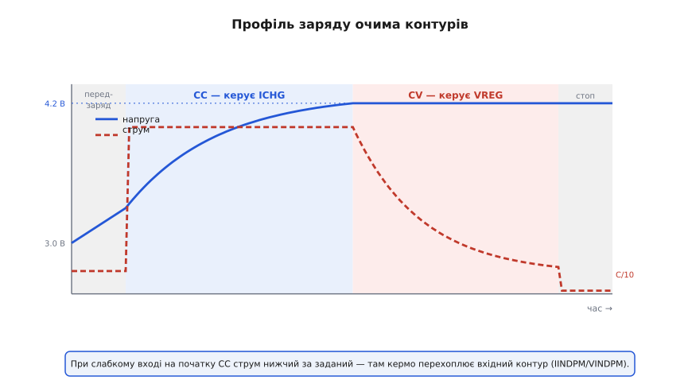

# Архітектура зарядного чипа (клас BQ24xxx/MP2625)

<preknowlist>
- [Зарядка Li-ion](topic:electronics/li-ion-charger) — алгоритм CC/CV: спершу сталий струм, тоді стала напруга 4.2 В і термінація. Саме його чип і виконує залізом.
- [Buck-перетворювач](topic:electronics/buck) — синхронний понижувальний перетворювач: верхній і нижній ключі, котушка, керування скважністю, звідки береться ККД. Це силове ядро зарядного чипа.
- [Power path](topic:electronics/power-path) — вхід одночасно живить систему й заряджає батарею через ключі; звідки береться вузол SYS і чому потрібні MOSFET, а не діоди.
- [Підсилювач похибки](topic:electronics/error-amplifier) — контур регулювання порівнює величину з опорною і підправляє керування. У зарядному чипі таких контурів кілька, і в цьому вся сіль.
</preknowlist>

Телефон під час заряду мусить робити чотири речі заразом, і кожну — правильно. Залити в літієву комірку точний струм, а тоді точну напругу 4.2 В: крок убік — зіпсована ємність або пожежа. Живити власну систему — екран, процесор, радіо — навіть коли комірка сіла в нуль або її взагалі нема в гнізді. Брати живлення з будь-якого входу: кволого USB-порту на 0.5 А, доброго адаптера на 3 А, а після [узгодження USB-PD](topic:electronics/usb-pd) — і з 9 чи 12 вольт. І не перегрітися, роблячи все це в корпусі 3×3 мм. Зібрати таке з окремих деталей — це десятки компонентів і безперервний програмний нагляд. Відповідь індустрії інша: **однокристальний зарядний чип** ковтає перетворювач, силові ключі, давачі, контури й захист в одну мікросхему, якою керуєш парою проводів.

Але справжня хитрість тут не «багато всього в одному корпусі». Хитрість у тому, що **один силовий каскад змушують коритися багатьом межам одночасно — і завжди слухатися найтіснішої**. Саме ця думка відрізняє зарядний чип від звичайного перетворювача напруги, і з неї виростає вся його будова. [З'явився цей клас не одразу, а коли струми телефонів переросли лінійний тепловий бюджет](topic:electronics/charger-ic-architecture/hist-charger-ic-lineage.md) — і разом із ним прийшла назва «bq», що тягнеться від фірми Benchmarq.

### Що лежить на кристалі

Розберімо чип на блоки — не за списком, а за тим, який шлях проходить енергія від штекера до комірки.

Вхід (USB, позначають **VBUS**) заходить у чип через **вхідний блокувальний ключ** — польовий транзистор, який (нім. відповідник тут ні до чого; англ. *reverse-blocking FET*, RBFET) уміє миттєво розірвати вхід, якщо напруга стрибнула надто високо або пішла у зворотний бік. Далі — серце: **синхронний buck-перетворювач**, зібраний із двох силових ключів. Верхній (*high-side FET*, HSFET) під'єднує вузол комутації до входу, нижній (*low-side FET*, LSFET) — до землі; вони по черзі відкриваються з частотою близько 1.5 МГц, а зовнішня котушка згладжує ці імпульси в рівний струм. Це той самий [buck](topic:electronics/buck), лише з обома ключами всередині кристала. За перетворювачем стоїть вузол системи **SYS**, а між SYS і клемою батареї — четвертий силовий транзистор, **BATFET** (*battery FET*), що прокладає [power path](topic:electronics/power-path).

Отже, силова частина — це **чотири інтегровані MOSFET** (вхідний, два перетворювачевих і батарейний) плюс жменька зовнішньої обв'язки: котушка та вхідний і вихідний конденсатори. Усе інше на кристалі — це **розум**, що керує цими ключами: набір контурів регулювання, опорна [бандгеп-напруга](topic:electronics/voltage-reference-sources), захист і цифровий блок із регістрами, до якого чіпляється шина I2C.


*Енергія йде зліва направо: VBUS → вхідний ключ Q1 → синхронний buck (Q2/Q3) → котушка → вузол SYS, звідки живиться система. BATFET (Q4) з'єднує SYS із коміркою. Знизу — керування: кілька контурів зводяться в один сигнал скважності, що відкриває Q2/Q3. I2C задає уставки й читає стан, вивід TS стежить за температурою комірки.*

Порівняйте це з найпростішим лінійним зарядником ([TP4056-клас](topic:electronics/tp4056)): там усередині один прохідний транзистор і один контур, система висить прямо на клемах батареї, а зайву напругу чип палить теплом. Зарядний чип цього класу — інша порода: замість «керованого резистора» в ньому повноцінний імпульсний перетворювач, а замість одного контуру — цілий їх колектив.

### Чому buck, а не лінійний прохідний ключ

Перш ніж дійти до контурів, варто зрозуміти, **навіщо взагалі городити всередині перетворювач**. Лінійний зарядник простий і дешевий — то чому телефони пішли на складніший імпульсний?

Причина перша — тепло. Лінійний зарядник — це керований опір між входом і коміркою; весь надлишок напруги він розсіює на собі.

**Приклад (лінійний заряд, 2 А).** Вхід 5 В, комірка 3.6 В, струм заряду 2 А.

```
Розсіяна потужність:  P = (Uвх − Uком) · I = (5 − 3.6) · 2 = 2.8 Вт
ККД:                  η = Uком / Uвх = 3.6 / 5 = 0.72  (72%)
```

2.8 вата на кристалі кілька міліметрів завширшки — це кипляча пляма. Чип перегріється й **сам зменшить струм**, а заряд затягнеться. Імпульсний buck ту саму енергію переносить із ККД близько 90%, розсіюючи вже ~0.8 Вт, — і тут відбувається друге, менш очевидне диво.

Buck **знижує напругу і водночас підвищує струм**: він бере з входу менший струм, ніж віддає в батарею. Лінійний так не вміє в принципі — у нього струм входу дорівнює струму заряду.

**Приклад (той самий заряд через buck).** Віддати в комірку 3.6 В × 2 А = 7.2 Вт при ККД 90%:

```
Потрібна вхідна потужність:  Pвх = 7.2 / 0.9 = 8.0 Вт
Струм із входу:              Iвх = 8.0 / 5 = 1.6 А
```

Із входу тече **1.6 А, а в батарею — 2 А**. Цей «підйом струму» — головна причина, чому серйозні зарядники імпульсні: [докладніше баланс потужності й тепловий відкат — окремо](topic:electronics/charger-ic-architecture/math-charger-power-balance.md). Він також означає, що з кволого джерела можна витягти більше, ніж здається: 1 А з USB-порту на 5 В обертається приблизно на 1.25 А в комірку. Але щоб не перевищити те, що джерело здатне дати, чип мусить **стежити за входом** — а це вже перший з його контурів.

### Серце архітектури: багато контурів, один силовий каскад

Ось де ховається головна ідея. Звичайний buck регулює **одну** величину — вихідну напругу. Зарядний buck мусить одночасно не порушити **кількох** меж, і в різні миті заряду головною стає різна.

Порахуймо, чого він боїться:

- **Напруга комірки** не має перевищити 4.2 В — інакше перезаряд (контур VREG, фаза CV).
- **Струм заряду** не має перевищити заданої безпечної величини (контур ICHG, фаза CC).
- **Струм із входу** не має перевищити того, що дозволило джерело, — ліміт вхідного струму (контур IINDPM; DPM — *dynamic power management*, динамічне керування потужністю).
- **Напруга на вході** не має просісти нижче порога: якщо джерело слабке й під навантаженням «сідає», треба зменшити відбір, поки вхід не відновиться (контур VINDPM).
- **Напруга SYS** не має впасти нижче мінімуму, потрібного системі (контур VSYSMIN) — навіть коли комірка порожня.
- **Температура кристала** не має перевищити межі; інакше струм заряду відкочують (теплове регулювання, TREG).

Шість вимог — і всі тягнуть скважність buck у свій бік. Як їх поєднати? Наївно було б написати логіку «якщо…то», але аналог робить це елегантніше й миттєво. Кожна вимога — це окремий [підсилювач похибки](topic:electronics/error-amplifier): він порівнює свою величину з опорою й видає сигнал «додати чи прибрати струм». Виходи всіх підсилювачів зводять на **один спільний вузол** так, що кожен може тільки **тягнути скважність донизу** (через діод у спільну точку). У результаті вузол опиняється там, куди його стягнув **найнижчий** голос — той контур, чия межа зараз найтісніша.

Це і є **вибір мінімуму** (*lowest wins*): хто вимагає найменшого струму, той і керує, решта мовчки чекають своєї черги. Ніякого арбітра — сама схема бере мінімум.


*Кожна межа — свій підсилювача похибки з власною опорою: напруга комірки, струм заряду, вхідний струм, вхідна напруга, температура. Усі виходи стягуються в один вузол, де перемагає найнижчий. Той контур, чия межа зараз найтісніша, забирає кермо над скважністю; щойно ситуація змінюється — кермо без стрибка переходить до іншого.*

Краса в тому, що передача керма **безшовна**. Поки комірка недозаряджена, найтісніший — струм: керує ICHG, іде фаза CC. Напруга дорослішає до 4.2 В — і найтіснішим стає вже VREG: він плавно перехоплює кермо, струм починає спадати, це фаза CV. Ніхто нічого не «перемикав» — просто інший голос став найнижчим.

> 🔧 **Навіщо це.** Коли на столі заряд «упирається» не туди, куди ви чекали (струм менший за заданий, хоча батарея ще порожня), майже завжди винен **не** контур заряду, а якийсь із вхідних: джерело просіло й спрацював VINDPM, або чип гарячий і втрутився TREG. Знаючи про вибір мінімуму, ви шукаєте не «поламаний заряд», а **який контур зараз найтісніший** — і майже завжди це слабкий адаптер чи тонкий кабель, а не сам чип.

### Профіль заряду очима контурів

Знайома крива CC/CV набуває глибшого сенсу, якщо дивитися на неї як на **естафету контурів**, а не як на дві фази.


*Та сама крива струму й напруги, але розфарбована за активним контуром. Глибоко розряджена комірка → передзаряд малим струмом → CC (керує ICHG) → CV (керує VREG, струм спадає) → термінація. Якщо джерело слабке, на початку врізається вхідний контур (IINDPM/VINDPM) і тримає струм нижче заданого, поки вистачає входу.*

Глибоко сіла комірка (нижче ~3 В) починає з **передзаряду**: маленький струм, поки напруга не підніметься до безпечної зони — тут керує окремий поріг. Далі повний струм, **CC**, кермо у ICHG. Напруга дійшла 4.2 В — кермо переходить до VREG, це **CV**, струм сам спадає. Коли струм у CV впав нижче порога термінації (близько C/10), чип [припиняє заряд](topic:electronics/charge-termination) і далі лише стежить, чи не треба долити. А якщо джерело квартируване (слабкий порт, довгий кабель), то на самому початку струм у батарею тримає не ICHG, а вхідний контур: він не дасть відібрати з входу більше, ніж той витримує, тож видима «поличка» струму буде нижчою за задану — і це не хвороба, а правильна робота IINDPM/VINDPM.

### Power path: жити з мертвою або відсутньою коміркою

Вузол **SYS** — це те, що робить зарядний чип не просто зарядником. Система живиться **не з батареї, а з SYS**, а SYS отримує енергію напряму від входу через buck. Батарея ж підвішена до SYS через BATFET збоку. Такий устрій кличуть **вузьким VDC** (*narrow VDC*, NVDC): чип тримає SYS трохи вище за напругу комірки, тож система завжди має чисте живлення, а комірка спокійно заряджається паралельно.

Звідси три властивості, яких лінійний зарядник не дає в принципі. По-перше, **миттєвий старт**: навіть із геть розрядженою або відсутньою коміркою чип піднімає SYS до мінімуму VSYSMIN просто від входу — і система вмикається, не чекаючи батареї. По-друге, **доповнення струму** (*supplement*): якщо система в піку хоче більше, ніж дозволяє джерело, BATFET відкривається у зворотний бік і батарея підкидає різницю в SYS. По-третє, чиста **розв'язка**: BATFET можна повністю закрити — у режимі зберігання (*ship mode*), щоб на полиці комірка не розряджалася через паразитні струми плати. Механіку цих перемикань — [окремо в темі про power path](topic:electronics/power-path); тут важливо, що SYS і BATFET — не додаток, а частина тієї самої архітектури контурів (VSYSMIN — один із голосів у виборі мінімуму).

### Захист і цифровий мозок

Оскільки зарядний чип стоїть просто на вході від зовнішнього штекера, він мусить пережити **погане джерело**. Вхідний блокувальний ключ разом із захистом по перенапрузі витримує кидок на вході до двох-трьох десятків вольт замість очікуваних п'яти — щоб дешевий адаптер, який «стрельнув», не спалив плату. Додаються захист комірки по перенапрузі, [запобіжні таймери](topic:electronics/li-ion-charger) (якщо заряд триває підозріло довго — стоп), теплове вимкнення й теплове регулювання, про яке вже йшлося.

Окремий вивід **TS** (*temperature sense*) міряє температуру самої комірки через притиснутий до неї термістор. За нею чип реалізує профіль JEITA: на холоді зменшує струм, на спеці знижує цільову напругу або теж прибирає струм — бо [заряд літію на морозі особливо небезпечний](topic:electronics/fast-charging). Це ще один контур безпеки, тільки повільний.

І над усім цим — **цифровий блок із регістрами**, до якого веде [I2C](topic:electronics/smbus-smart-battery). Через нього господар плати (контролер живлення телефона чи звичайний МК) задає уставки — ліміт вхідного струму, струм і напругу заряду, поріг термінації, таймери — і читає стан: у якій фазі заряд, який контур активний, які спрацювали захисти. Це те, що робить чип **гнучким**: після того, як USB-PD домовився про 9 В на вході, система тут-таки переписує в регістрі новий, більший ліміт вхідного струму — і заряд прискорюється без жодної зміни заліза. [Повну карту цих регістрів — адреси, поля й кодування уставок «мА/мВ → біти» — зведено окремо](topic:electronics/charger-ic-architecture/api-bq2419x-registers.md), а [робочий приклад драйвера такого чипа по I2C — з ініціалізацією, годуванням watchdog і читанням фолтів — розібрано в окремому прикладі](topic:electronics/charger-ic-architecture/proj-bq2419x-driver.md).

> 🔧 **Навіщо це.** Ліміт вхідного струму в регістрі — найважливіша уставка, яку легко проґавити. Виставите завелику для наявного джерела — і при першому ж піку навантаження VBUS просяде, чип смикне VINDPM, а в найгіршому разі впаде живлення всієї плати й контролер перезавантажиться посеред заряду. Тому послідовність завжди така: спершу дізнатися, скільки джерело реально дає, і **аж потім** дозволяти чипу відбір — не навпаки.

### Що з усього цього складається

Зарядний чип класу BQ2419x/BQ2589x чи MP2625 — це не «зарядник із наворотами». Це **силовий каскад під керуванням парламенту меж**: синхронний buck, який щомиті слухає найтісніший з півдесятка контурів, живить систему напряму через вузол SYS, страхує себе від поганого входу й гарячого кристала — і робить усе це під наглядом програмного коду через I2C. Зрозумівши цей кістяк — buck усередині, вибір мінімуму над ним, power path збоку й регістри згори, — ви читаєте документацію будь-якого такого чипа не як довжелезний список функцій, а як варіації однієї стрункої ідеї.
