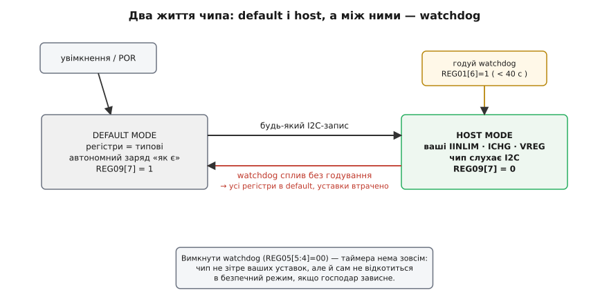
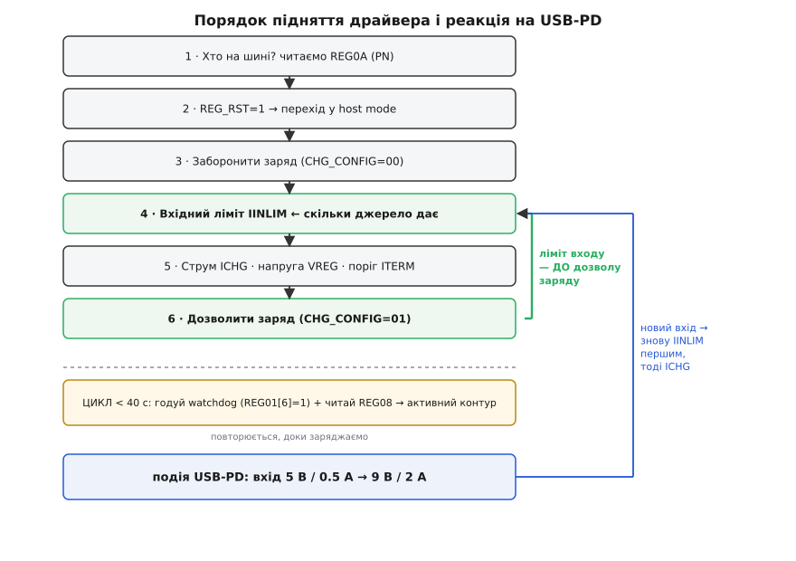

# ⚙️ Драйвер зарядного чипа по I2C: підняти bq2419x із МК

**Задача.** На платі стоїть зарядний чип класу bq2419x (візьмімо конкретний bq24192) і мікроконтролер поруч. Треба написати драйвер мовою C, який: знайде чип на шині, приведе його у відомий стан, виставить ліміт вхідного струму під те, що реально дає джерело, задасть струм і напругу заряду, увімкне заряд, а далі — читатиме, у якій фазі заряд і який захист спрацював, і правильно відреагує, коли [USB-PD](book:electronics/usb-pd) домовиться про інший вхід. Усе це — через дві ниточки, SCL і SDA.

Здавалося б, чого тут писати: «зарядити батарею» — це ж одна команда. Але в цього чипа немає команди «заряджай на 1.5 ампера». Є банк регістрів, і в кожному — закодовані поля. Ви не наказуєте, ви **описуєте залізу межі**, у яких йому дозволено працювати, а мовчазний аналоговий мозок усередині сам вибирає, якою з них зараз коритися. Драйвер — це перекладач між вашими «1.5 А, 4.2 В» і байтами, які це означають, плюс дисципліна їх виставляння в правильному порядку. Саме порядок і дрібні недомовки регістрів роблять різницю між «заряджається як слід» і «телефон перезавантажується посеред заряду».

Самі адреси регістрів, поля й формули кодування «мА/мВ → біти» винесені в [реєстрову карту чипа](book:electronics/charger-ic-architecture/api-bq2419x-registers.md): драйвер нижче спирається на заголовок `bq2419x_regs.h` звідти — іменовані регістри `BQ_REG00…`, маски полів `REG0x_*` і кодувальники `iinlim_code`, `ichg_reg`, `vreg_reg`, `iterm_code`. Тут — усе інше: як цими регістрами користуватися правильно.

## Чип має два життя: default mode і host mode

Є річ, яку конче треба тримати в голові, бо на ній ламається половина перших драйверів. **Чип має два життя.** Одразу після подачі живлення (або після того, як спрацював його сторожовий таймер) він — у *default mode*: усі регістри в типових значеннях, і він заряджає автономно, «як з коробки», ні на кого не чекаючи. Перший же ваш запис у будь-який регістр переводить його в *host mode*: тепер діють ваші уставки. І ось пастка — щоб **лишитися** в host mode, ви мусите регулярно «годувати» його сторожовий таймер ([watchdog](book:programming/watchdog)); проґавите — і чип мовчки скине всі регістри назад у типові й повернеться в автономний режим, стерши ваші старанно виставлені 1.5 А та 4.2 В.


*Після ввімкнення чип у default mode (заряджає сам, REG09[7]=1). Перший запис переводить у host mode — діють ваші уставки. Тримає в host лише регулярне годування watchdog (REG01[6]=1 частіше, ніж раз на 40 с). Не погодували — усі регістри скидаються в типові, і ваша конфігурація зникає.*

Ця картинка — половина всього драйвера. Друга половина — строгий порядок, у якому уставки виставляють; до нього дійдемо, щойно закладемо фундамент доступу до шини.

## Порт-шар: дві функції, і драйвер переносний

Почнемо знизу — з єдиного місця, що залежить від заліза. Весь драйвер спирається на дві функції: записати байт у регістр і прочитати байт із регістра. Напишете їх під свою шину — решта коду поїде на будь-якому МК без змін.

```c
#include "bq2419x_regs.h"       /* адреси, маски полів, кодувальники мА/мВ→біти */
#include <stdint.h>
#include <stdbool.h>

/* Порт-шар: 0 при успіху, ≠0 при NACK/таймауті шини.
   Реалізуєте під свою платформу — це єдина залежність від заліза. */
int bq_i2c_write(uint8_t reg, uint8_t val);
int bq_i2c_read (uint8_t reg, uint8_t *val);
void bq_delay_ms(uint32_t ms);
```

Ось, наприклад, порт під STM32 HAL. Зверніть увагу на `BQ_ADDR << 1`: HAL хоче 8-бітну адресу, тож 7-бітну `0x6B` зсуваємо ліворуч, отримуючи `0xD6`. Це найпоширеніша перша помилка — чип «не відповідає» лише тому, що адресу не зсунули:

```c
extern I2C_HandleTypeDef hi2c1;

int bq_i2c_write(uint8_t reg, uint8_t val) {
    return HAL_I2C_Mem_Write(&hi2c1, BQ_ADDR << 1, reg,
                             I2C_MEMADD_SIZE_8BIT, &val, 1, 50) == HAL_OK ? 0 : -1;
}
int bq_i2c_read(uint8_t reg, uint8_t *val) {
    return HAL_I2C_Mem_Read(&hi2c1, BQ_ADDR << 1, reg,
                            I2C_MEMADD_SIZE_8BIT, val, 1, 50) == HAL_OK ? 0 : -1;
}
```

Майже кожна уставка — це зміна кількох бітів у регістрі, де решту бітів чіпати не можна. Тож найкорисніший помічник — «прочитати-змінити-записати»: він читає поточний байт, накладає нове значення лише під маскою і пише назад.

```c
/* Змінити тільки біти під маскою mask, решту зберегти. */
static int bq_update(uint8_t reg, uint8_t mask, uint8_t val)
{
    uint8_t cur;
    int rc = bq_i2c_read(reg, &cur);
    if (rc) return rc;
    cur = (uint8_t)((cur & ~mask) | (val & mask));
    return bq_i2c_write(reg, cur);
}
```

## Ініціалізація: порядок, який не можна плутати

Тепер найважливіше — послідовність підняття. Тут кожен крок стоїть перед наступним не випадково, і переставити їх місцями означає впіймати одну з класичних хвороб. Логіка така: спершу з'ясувати, що це взагалі наш чип; тоді скинути його у відомий стан; **заборонити заряд**, поки не виставлені всі межі; виставити вхідний ліміт (він захищає джерело) — і аж потім струм та напругу заряду; і лише в самому кінці **дозволити заряд**.

```c
typedef struct {
    uint16_t input_ma;    /* скільки джерело дозволяє відібрати з входу */
    uint16_t charge_ma;   /* цільовий струм заряду */
    uint16_t charge_mv;   /* цільова напруга заряду, напр. 4200 */
    uint16_t term_ma;     /* поріг струму термінації */
} bq_cfg_t;

int bq_init(const bq_cfg_t *cfg)
{
    uint8_t id;

    /* 1. Хто на шині? PN у REG0A[5:3]: 100 = bq24190, 101 = bq24192. */
    if (bq_i2c_read(BQ_REG0A, &id)) return -1;
    uint8_t pn = (id >> 3) & 0x07;
    if (pn != 0x4 && pn != 0x5) return -2;         /* не той чип або битий зв'язок */

    /* 2. Скинути все у типовий стан (це вже запис → перехід у host mode). */
    if (bq_i2c_write(BQ_REG01, REG01_REG_RST)) return -3;
    bq_delay_ms(10);                                /* дати скиданню відпрацювати */

    /* 3. ЗАБОРОНИТИ заряд, поки не виставлені межі (CHG_CONFIG = 00). */
    if (bq_update(BQ_REG01, REG01_CHG_CONFIG_MASK, 0x00)) return -4;

    /* 4. ВХІДНИЙ ЛІМІТ — першим зі струмів: він оберігає джерело. */
    if (bq_update(BQ_REG00, REG00_IINLIM_MASK, iinlim_code(cfg->input_ma))) return -5;

    /* 5. Струм і напруга заряду, поріг термінації. */
    if (bq_update(BQ_REG02, REG02_ICHG_MASK,  ichg_reg(cfg->charge_ma)))  return -6;
    if (bq_update(BQ_REG04, REG04_VREG_MASK,  vreg_reg(cfg->charge_mv)))  return -7;
    if (bq_update(BQ_REG03, REG03_ITERM_MASK, iterm_code(cfg->term_ma)))  return -8;
    if (bq_update(BQ_REG05, REG05_EN_TERM, REG05_EN_TERM))                return -9;

    /* 6. ТЕПЕР дозволити заряд. */
    if (bq_update(BQ_REG01, REG01_CHG_CONFIG_MASK, REG01_CHG_ENABLE))     return -10;
    return 0;
}
```

Крок 2 вартий окремого слова. Запис `REG_RST=1` скидає REG00–REG07 у типові значення й **сам по собі** переводить чип у host mode (бо це запис). Після скидання watchdog уже тікає з типовими 40 секундами — тож далі його треба годувати, або вимкнути; про це нижче. А ще після скидання CHG_CONFIG повертається в «01» (заряд дозволено) — тому крок 3, де ми його явно глушимо, не зайвий: він гарантує, що чип не почне тягнути повний струм заряду в ту секунду, поки ми ще не сказали йому, скільки можна брати з входу.


*Кроки підняття йдуть згори вниз; зелена дужка позначає непорушне правило — вхідний ліміт виставляємо ДО дозволу заряду. Унизу — цикл обслуговування (годуй watchdog, читай активний контур), а подія USB-PD заводить нас назад у той самий крок «вхідний ліміт»: новий вхід — знову спершу ліміт, тоді струм.*

## Годування watchdog і цикл обслуговування

Сторожовий таймер — не примха, а страховка: якщо господар зависне, чип за 40 секунд сам відкотиться в безпечний автономний режим. Ціна цієї страховки — ви мусите регулярно подавати ознаку життя, інакше він відкотиться й у вас, стерши уставки. Годування — це одиниця в REG01[6] (біт самоскидний):

```c
int bq_watchdog_kick(void)
{
    uint8_t r;
    if (bq_i2c_read(BQ_REG01, &r)) return -1;
    r |= REG01_WD_RST;                    /* біт 6, самоскидний */
    /* Даташит просить писати одиницю двічі — пишемо двічі поспіль. */
    if (bq_i2c_write(BQ_REG01, r)) return -1;
    if (bq_i2c_write(BQ_REG01, r)) return -1;
    return 0;
}
```

Викликаєте це з періодом, помітно коротшим за вікно — скажімо, раз на 10 секунд при вікні 40. Той самий тик зручно використати, щоб заразом глянути на стан заряду:

```c
/* Викликати періодично, з періодом < вікна watchdog (тут ~10 с). */
void bq_service(void)
{
    bq_watchdog_kick();

    bq_status_t st;
    if (bq_read_status(&st) == 0) {
        if (st.phase == CHG_FAST && st.in_dpm) {
            /* Заряд упирається у ВХІД, не в ICHG:
               слабке джерело або тонкий кабель — не «поламаний» заряд. */
        }
    }
}
```

Якщо watchdog вам заважає (наприклад, у виробі, де МК гарантовано живий і сам стежить за всім), його можна просто вимкнути, записавши `00` у REG05[5:4]. Тоді таймер не тікає й уставок ніхто не зітре — але зникає й страховка: зависне господар — чип так і лишиться з вашими останніми уставками, замість відкотитися в безпечний режим. У носимому пристрої зазвичай лишають watchdog і чесно годують; у стенді чи промисловому вузлі з власним наглядом — інколи вимикають.

## Читати активний контур зі статусу, а не вгадувати

Найкорисніше, що вміє драйвер, — це не виставляти уставки, а **правильно читати, чому заряд іде саме так**. Усередині чипа кілька контурів змагаються за керування, і в кожну мить кермує лише найтісніший (найнижчий) із них. Регістр статусу REG08 прямо каже, хто це зараз, — не треба вгадувати за симптомами.

```c
typedef enum { CHG_IDLE, CHG_PRECHARGE, CHG_FAST, CHG_DONE } bq_phase_t;

typedef struct {
    bq_phase_t phase;      /* фаза заряду з CHRG_STAT */
    uint8_t    vbus_type;  /* 0 нема/невідомо, 1 USB-хост, 2 адаптер, 3 OTG */
    bool       power_good; /* вхід придатний */
    bool       in_dpm;     /* активний ВХІДНИЙ контур (VINDPM або IINDPM) */
    bool       in_thermal; /* активне теплове регулювання (гарячий кристал) */
    bool       in_vsysmin; /* комірка нижча за VSYSMIN */
} bq_status_t;

int bq_read_status(bq_status_t *s)
{
    uint8_t r;
    int rc = bq_i2c_read(BQ_REG08, &r);
    if (rc) return rc;
    s->vbus_type  = (r >> 6) & 0x03;
    s->phase      = (bq_phase_t)((r >> 4) & 0x03);
    s->in_dpm     = (r >> 3) & 1;
    s->power_good = (r >> 2) & 1;
    s->in_thermal = (r >> 1) & 1;
    s->in_vsysmin = (r >> 0) & 1;
    return 0;
}
```

Ось де це рятує години налагодження. Класична скарга: «заряд іде струмом меншим, ніж я задав, хоча батарея ще порожня». Спокуса — лізти перевіряти ICHG. Але `in_dpm == true` одразу каже: керує не струмовий контур заряду, а **вхідний** — джерело просіло або кабель тонкий, і чип чесно тримає струм нижчим, щоб не посадити вхід. `in_thermal == true` — інша причина: кристал гарячий, спрацювало теплове регулювання. Замість «чому зламаний заряд?» ви ставите точне питання «який контур зараз найтісніший?» — і статус на нього відповідає.

## Фолти: регістр, який треба читати двічі

Регістр фолтів REG09 має підступну особливість, задокументовану в даташиті: він **фіксує попередній фолт і скидає його лише після читання**. Тобто перше читання після події віддає стан на момент *минулого* читання, а не поточний. Щоб дізнатися, що коїться *зараз*, REG09 читають двічі поспіль і беруть друге значення:

```c
/* Повертає ПОТОЧНИЙ стан фолтів (друге читання). */
int bq_read_fault(uint8_t *fault)
{
    uint8_t a, b;
    if (bq_i2c_read(BQ_REG09, &a)) return -1;   /* латч попереднього стану */
    if (bq_i2c_read(BQ_REG09, &b)) return -1;    /* справжній поточний стан */
    *fault = b;
    return 0;
}

/* Розбір поля CHRG_FAULT[5:4] */
const char *bq_chrg_fault_str(uint8_t fault)
{
    switch ((fault >> 4) & 0x03) {
        case 0: return "норма";
        case 1: return "вхідний фолт (OVP або поганий вхід)";
        case 2: return "теплове вимкнення";
        case 3: return "сплив запобіжний таймер";
    }
    return "?";
}
```

Прочитаєте REG09 лише раз — і будете реагувати на фолт, якого вже нема (або проґавите свіжий). Бітове поле `WATCHDOG_FAULT[7]`, до речі, — це той самий сигнал, що чип у default mode: одиниця там означає «я скинувся, ваші уставки, можливо, вже не діють». Побачили її поза межами штатного циклу — саме час перевірити, чи не проспали ви годування.

## Реакція на зміну входу після USB-PD

Тепер найцікавіше — те, заради чого чип узагалі керований програмно. Спершу телефон під'єднали до кволого порту: [BC1.2-детекція](book:electronics/legacy-charging) (яку чип запускає сам при вставлянні) розпізнала SDP і виставила скромні 500 мА. Ви це поважаєте й тримаєте ліміт низьким. Аж ось [USB-PD](book:electronics/usb-pd) домовився з адаптером про новий контракт — скажімо, 9 В при 2 А замість 5 В при 0.5 А. Вхід фізично змінився; драйвер має це відобразити.

Що робити? Підняти вхідний ліміт (тепер джерело дає більше) і, за потреби, струм заряду. А от VINDPM чіпати не треба: bq24192 працює з входом аж до 17 В, а поріг VINDPM у нього не вищий за 5.08 В — на 9-вольтовому вході він завжди задоволений, тож вхід тепер обмежує тільки IINLIM.

```c
/* Викликати після узгодження USB-PD (або зміни адаптера).
   ПОРЯДОК той самий: спершу вхідний ліміт, тоді струм заряду. */
int bq_on_input_changed(uint16_t new_input_ma, uint16_t new_charge_ma)
{
    int rc = bq_update(BQ_REG00, REG00_IINLIM_MASK, iinlim_code(new_input_ma));
    if (rc) return rc;
    return bq_update(BQ_REG02, REG02_ICHG_MASK, ichg_reg(new_charge_ma));
}
```

Порахуймо, що це дає, і заодно побачимо, як **міняється активний контур**. Buck знижує напругу й піднімає струм: із входу тече менше, у комірку більше. Візьмімо ККД ≈ 0.9 і комірку 3.8 В.

```
До PD (вхід 5 В, ліміт 0.5 А):
  Pвх = 5 · 0.5 = 2.5 Вт ;  у комірку 2.5·0.9 = 2.25 Вт
  Iзар ≈ 2.25 / 3.8 = 0.59 А     ← упираємось у ВХІД: DPM_STAT (REG08[3]) = 1

Після PD (вхід 9 В / 2 А):
  Pвх = 9 · 2 = 18 Вт ;  у комірку 18·0.9 = 16.2 Вт
  «стеля входу» = 16.2 / 3.8 = 4.26 А  — але комірці стільки не можна!
  тож піднімаємо ICHG до безпечних, скажімо, 3.0 А
  → тепер керує СТРУМ заряду: DPM_STAT = 0, CHRG_STAT = «fast charging»
```

Ось воно, наочно: до PD заряд «упирався» у вхід (0.59 А — джерело не давало більше), і `in_dpm` це показував. Після PD вхід уже може пропхати 4.26 А, але стільки в комірку лити не можна — тож найтіснішою межею стає ваш власний ICHG, і кермо переходить до нього. `in_dpm` гасне, з'являється чиста фаза швидкого заряду. Драйвер не «перемикав режими» — він лише підняв дві уставки, а чип сам переставив, який контур головний. Тому й важливо після кожної зміни входу знову пройти той самий порядок: спершу ліміт входу, тоді струм.

> 🔧 **Навіщо це.** Три уставки — вхідний ліміт, ICHG, VREG — і три способи стрельнути собі в ногу. Виставите вхідний ліміт завеликим для наявного джерела ще до того, як воно підтвердило свою спроможність, — і при першому піку навантаження VBUS просяде, чип смикне вхідний контур, а в найгіршому разі провалиться живлення всієї плати. Проґавите годування watchdog — і посеред заряду ваші 1.5 А тихо стануть типовими, бо чип відкотився в автономний режим. Прочитаєте REG09 лише раз — і ганятиметесь за фолтом-привидом. Усі три пастки — не про хитре залізо, а про дисципліну драйвера.

## Складність і пастки — стисло

Драйвер bq2419x короткий, і майже вся його «складність» — це не рядки коду, а невидимі домовленості чипа, кожна з яких карає за зневагу:

- **Ліміт входу — до дозволу відбору.** Спершу дізнайтеся, скільки джерело дає (BC1.2/PD), виставте IINLIM, і лише тоді вмикайте заряд або піднімайте ICHG. Ніколи не навпаки. Пам'ятайте, що чип сам запускає детекцію входу при вставлянні й може попередньо виставити свій IINLIM — ваше явне значення має лягти **після** того, як ви справді знаєте межу.
- **Watchdog годуйте або вимикайте свідомо.** Замовчана пастка: усе працює на столі кілька секунд, а тоді уставки «самі скидаються». Це не глюк — це сплив сторожовий таймер. Або годуйте частіше за вікно (REG01[6]=1), або вимкніть його (REG05[5:4]=00), розуміючи, що втрачаєте автоматичний відкіт.
- **Активний контур читайте зі статусу.** REG08 прямо каже, хто керує (DPM_STAT — вхід, THERM_STAT — тепло, VSYS_STAT — порожня комірка, CHRG_STAT — фаза). Не діагностуйте заряд за здогадами, коли чип сам вам усе повідомляє.
- **Регістр фолтів читайте двічі.** REG09 віддає латч минулого стану першим читанням; поточний — другим.
- **Округлення уставок — донизу.** І струм, і особливо напругу кодуйте так, щоб фактичне значення було **не вище** цілі: 1472 замість 1536 мА, 4192 замість 4208 мВ. Для літію перебір напруги дорожчий за недобір струму.
- **Адресу не забудьте зсунути.** `0x6B` — семибітна; API, що хочуть восьмибітну (як STM32 HAL), потребують `0x6B << 1 = 0xD6`. «Чип не відповідає» — найчастіше саме це.

Розібравши цей кістяк — дві функції порту, кодувальники «мА→біти», строгий порядок підняття, годування watchdog і читання активного контуру, — ви пишете драйвер будь-якого чипа цього класу (bq24190/2/5, bq2589x, MP2625) майже механічно: змінюються числа в кодувальниках і кілька адрес регістрів, а логіка й пастки лишаються ті самі. Заряд Li-ion за схемою [CC/CV](book:electronics/li-ion-charger) і [термінацію по струму](book:electronics/charge-termination) залізо робить саме; ваш код лише правильно розставляє межі й чесно слухає, яку з них чип зараз тримає.
