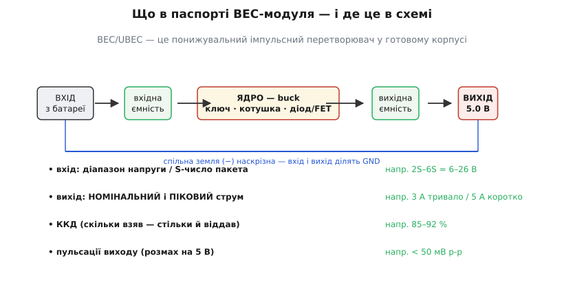
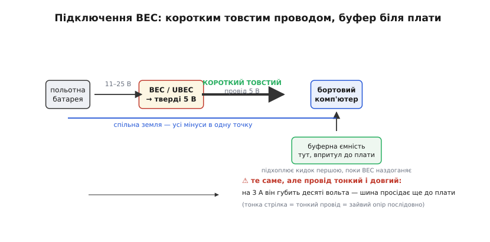

# 🔌 BEC/UBEC — модуль «батарея → тверді 5 В»

Коли на апараті вже є польотна батарея — пакет літію на 11, 15, а то й 25 вольтів, — а поряд просить живлення бортовий комп'ютер, приймач, серва чи камера, яким треба **рівно 5 вольтів**, між ними ставлять маленьку плату-посередника. У світі моделізму вона зветься **BEC** *(Battery Eliminator Circuit — «схема замість батарейки»)*, а її сучасний різновид-цеглинка — **UBEC** *(Universal BEC)*. По суті це [понижувальний імпульсний перетворювач](book:electronics/buck) *(buck)*, зібраний і продуманий саме під одну роль: **зробити з польотної батареї тверді 5 В** для чутливої електроніки. Тут — не про конкретну модель, а про **весь клас** таких модулів: як їх читати, як вмикати й де вони найчастіше підводять.

Спокуса поставитися до BEC як до «дрібнички» — головна причина, чому апарати падають від, здавалося б, дурниці. Це не дрібничка: це вузьке горло, крізь яке проходить **усе** живлення розуму апарата, і якщо горло вузьке чи брудне, розум починає збоїти саме тоді, коли працює найтяжче. Тож розберімо цей клас так, щоб бачити його наскрізь.

## Що це за клас і навіщо він узагалі є

Питання перше й найпростіше: чому не запхати регулятор прямо в кожен пристрій, а виносити його окремою платою? Бо **одну добру знижувальну плату дешевше й чистіше зробити раз**, ніж повторювати її в кожному споживачі. Приймачу, серві, камері й одноплатнику всім треба однакові 5 В — то нехай один модуль роздає їх усім, а кожен споживач лише бере готове.

Питання друге: чому саме імпульсний, а не простий [лінійний стабілізатор](book:electronics/ldo)? Бо перепад великий. Пакет 4S дає ≈14.8 В, а треба 5 В — різницю майже в десять вольтів лінійна схема **спалила б на собі теплом**, і на кількох амперах це десятки марних ватів (докладний розрахунок, чому лінійний тут програє, — у [темі про енергію й тепло](book:electronics/companion-power-thermal)). Імпульсний buck опускає напругу не спалюючи різницю, а **швидко перемикаючи ключ** і згладжуючи результат котушкою, тож віддає 85–92 % узятого. Тому будь-який серйозний BEC на кілька ампер — **імпульсний**.

> 🔧 **Навіщо це.** BEC — це не «якийсь стабілізатор», а **готовий buck-модуль під роль «польотна батарея → 5 В»**. Купуючи його, ти купуєш не магію, а вирішену задачу: вхід широкий (пакет 2S–6S), вихід твердий (5 В під струмом), корпус компактний. Усе, що лишається тобі, — **правильно його вибрати за паспортом і правильно підключити**. Обидва кроки й розберемо.

Історично клас народився з простої незручності. У ранніх електричних радіокерованих моделях доводилося везти **дві** батареї: одну на мотор, другу — окремий тримач із чотирьох пальчикових елементів — суто щоб живити приймач. Це була зайва вага й зайвий об'єм. Ідея BEC — **прибрати другу батарею**, узявши для приймача живлення з головної через маленький перетворювач; звідси й назва «схема замість батарейки» *(усталено; підтверджено кількома незалежними джерелами моделізму)*. Перші BEC вбудовували просто в приймач, згодом — у регулятор ходу мотора *(ESC)*, а коли знадобилося більше струму, з'явилися окремі клацани-модулі — **UBEC**, «універсальні», бо їх можна доточити до будь-якої системи. Сьогодні «UBEC» на ярлику означає найчастіше саме **окремий імпульсний модуль**, а не вбудований у щось вузол.

## Що всередині: блок-схема

Розкривши будь-який BEC, побачиш той самий кістяк — кістяк buck-перетворювача, лише зменшений і без зайвого. Знати ці вузли корисно: за ними читається, чого від модуля чекати й де його межі.

*Що в паспорті BEC-модуля — і де це в схемі. Зверху ліворуч направо тече енергія: вхід із батареї, вхідна ємність, ядро-buck (ключ + котушка + діод чи нижній FET), вихідна ємність, твердий вихід 5 В. Знизу — наскрізна спільна земля: мінус входу й мінус виходу — це одна точка. Праворуч чотири числа, які й треба вміти читати в паспорті: діапазон входу (S-число пакета), номінальний і піковий струм виходу, ККД, пульсації.*

Тракт короткий:

- **Вхід і вхідна ємність.** Дроти від батареї заходять на конденсатор, що згладжує вхід і живить ключ у моменти, коли той рвучко бере струм. На вході часто стоїть і захист від переполюсування — але не завжди, і покладатися на нього наосліп не варто.
- **Ядро — buck.** Серце модуля: **ключ** (MOSFET) рубає вхідну напругу десятки-сотні тисяч разів на секунду, **котушка** згладжує ці рубання в рівний струм, а **діод або нижній MOSFET** замикає струм котушки, поки ключ закритий. Чим модуль дорожчий, тим імовірніше нижню фазу несе синхронний MOSFET, а не діод, — [це помітно піднімає ККД](book:electronics/buck/comp-sync-vs-async.md).
- **Вихідна ємність і вихід.** Конденсатор на виході згладжує залишок пульсацій, і звідси виходять чисті 5 В на плату.
- **Спільна земля.** Мінус входу й мінус виходу з'єднані — це **одна** земля, наскрізна. Дрібниця, але важлива: BEC **не ізолює** (на відміну від [мережевого адаптера з трансформатором](book:electronics/flyback-isolated/comp-wall-adapter.md)). Живлення й батарея ділять спільний нуль; ніякого бар'єра між ними немає й не передбачено.

Ось і все нутро. Простота цього кістяка — причина, чому BEC дешевий і чому його легко зіпсувати економією: усе тримається на кількох деталях, і на кожній виробник може заощадити.

## Як читати паспорт: чотири числа, що вирішують

Модулів на ринку сотні, ярлики різні, але вибір зводиться до **чотирьох** чисел. Навчися читати їх — і будь-який BEC стане прозорим.

**Перше — діапазон входу, він же «S-число» пакета.** BEC приймає не будь-яку напругу, а вікно: «2–6S», «5.5–26 В» тощо. Літера **S** *(series — «послідовно»)* — це число банок літію, з'єднаних послідовно; кожна банка дає номінально ≈3.7 В (повністю заряджена — 4.2 В). Тож «6S» — це до 6·4.2 ≈ 25 В на вході. Правило: **твій пакет має лягати всередину вікна із запасом на обох краях**. Свіжозаряджений 6S дає 25.2 В — модуль «2–6S» це витримує, а от «2–4S» (до ≈17 В) від нього згорить. І навпаки: занизьку напругу деякі buck не тягнуть, бо їм треба, щоб вхід був вищий за вихід із запасом на роботу ключа.

**Друге — вихідний струм, і тут ховається головна пастка: номінальний проти пікового.** Модуль підписаний «5 В / 3 А». Але **3 А чого** — тривало чи на мить? Добрий паспорт розрізняє **номінальний** (тривалий, continuous) струм і **піковий** (короткочасний, peak/burst). Дешевий ярлик пише одне число — і майже завжди це піковий, гарніший для реклами. Практичне правило: **закладай навантаження на номінал, а не на пік**, а якщо число одне — вважай його піковим і бери модуль із запасом. Бортовий комп'ютер бере струм ривками (рвонув інференс — струм підстрибнув удвічі), тож піковий струм модуля має покривати ці ривки, а номінальний — тривале споживання.

**Третє — ККД.** Скільки з узятого від батареї модуль віддає в плату, а скільки перетворює на власне тепло. Добрий імпульсний BEC — це 85–92 %. Число важливе не заради економії батареї (хоча й це), а заради **тепла**: втрачені відсотки гріють сам модуль, і чим нижчий ККД, тим гарячіший BEC за того самого струму. З дешевими модулями без радіатора це прямий шлях до перегріву.

**Четверте — пульсації виходу.** Імпульсний перетворювач не дає ідеально рівних 5 В — на них лишається дрібне «тремтіння» на частоті перемикання, **пульсації** *(ripple)*. Паспорт дає їх розмах: типово «< 50 мВ p-p» *(peak-to-peak — від низу до верху)* для пристойного модуля *(усталено; типові значення з документації модулів моделізму — від ≈30 до ≈50 мВ p-p за струму 2 А)*. Для одноплатника кілька десятків мілівольтів пульсацій байдужі — його власні конденсатори їх дожують. А от для аналогового відео чи приймача GPS ці пульсації можуть лізти шумом у сигнал — і тоді число раптом стає критичним.

> 🔧 **Навіщо це.** Вибираючи BEC, читай **чотири числа** саме в цьому порядку: (1) чи лягає мій пакет у вікно входу із запасом; (2) чи покриває **номінальний** струм тривале споживання, а піковий — ривки; (3) який ККД (нижчий → гарячіший модуль); (4) чи не завеликі пульсації для моїх чутливих споживачів. Пропустиш будь-яке — і граблі знайдуть тебе самі: то згорілий від перенапруги входу модуль, то перегрів під струмом, то шум у відео.

Одна поширена підступність із **другим** числом варта окремого слова — **дерейтинг лінійних BEC за вищої напруги пакета**. Це стосується саме *лінійних* (не імпульсних) BEC, які ще трапляються вбудованими в дешеві ESC. У лінійного BEC увесь надлишок напруги гріє кристал, тож його дозволений струм **падає зі зростанням S-числа**: той самий вбудований «3 А» лінійний BEC на 2S дійсно дасть майже 3 А, а на 4S — уже від сили півтора, бо решту з'їсть тепло *(усталено; типове правило моделізму, підтверджене кількома джерелами)*. Ось чому для потужних споживачів на високовольтних пакетах беруть **імпульсний** BEC: у нього струм майже не залежить від вхідної напруги, бо він не спалює різницю, а перемикає.

## Порти й «розпіновка» класу

Партномерів у класу немає, а от типова «розпіновка» — цілком. Майже кожен окремий BEC-модуль має рівно **два боки**.

- **Вхід** — дві жили, часто товщі: **плюс** (від батареї, «+», нерідко червоний) і **мінус** («−», чорний). Сюди заходить напруга пакета. Полярність тут **критична**: переполюсування — найшвидший спосіб убити модуль (докладніше — у граблях).
- **Вихід** — дві або три жили: **+5 В**, **земля** й іноді **сигнальна** лінія. У моделізмі вихід часто оформлений стандартним **сервороз'ємом** *(тризубець: сигнал · +5 В · земля)*, бо історично BEC годував саме серви. Сигнальний контакт у ролі суто живлення не використовують — беруть лише +5 В і землю.

Деякі модулі мають ще **перемичку або перемикач вибору напруги** — 5 В / 6 В / 7.4 В. Це спадок від серв, яким буває треба 6 В чи навіть 7.4 В *(HV-серви)*. **Для одноплатника чи будь-якої 5-вольтової логіки перемикач має стояти рівно на 5 В** — 6 чи 7.4 В спалять таку плату. Це перше, що варто перевірити мультиметром **до** підключення споживача, а не після.

Головне про порти — **напрям і полярність**. Вхід і вихід у BEC **не взаємозамінні**: подаси батарею на вихід — і модуль у кращому разі просто не працюватиме, у гіршому — згорить. А в межах кожного боку не переплутай плюс і мінус. Звучить банально, доки не згадаєш, що половина «мертвих при першому вмиканні» BEC — це саме переплутана полярність.

## Типове підключення

Тепер зберемо вузол докупи. Задача типова: **та сама польотна батарея живить і силову частину апарата, і — через BEC — бортовий комп'ютер**.

*Підключення BEC коротким товстим проводом, буфер біля плати. Батарея (11–25 В) заходить на BEC, той віддає тверді 5 В, і від нього **коротким товстим проводом** живлення йде на плату. Буферна ємність стоїть впритул до плати — підхоплює кидок струму першою, поки BEC наздоганяє. Усі мінуси сходяться в одну точку — спільна земля. Знизу — граблі: той самий провід, але тонкий і довгий, губить на 3 А десяті вольта, і шина просідає, ще не дійшовши до плати.*

Порядок такий:

**1. Вхід BEC — на батарею (паралельно силовій частині).** Плюс BEC до плюса пакета, мінус до мінуса. Часто BEC чіпляють до тієї ж плати розведення живлення *(PDB)*, звідки живиться решта. Полярність перевір **двічі**.

**2. Спершу виміряй вихід — потім чіпляй споживача.** Подав живлення, узяв мультиметр, переконався: на виході рівно **5.0 В** (а не 6, не 7.4 і не 0). Лише тоді під'єднуй бортовий комп'ютер. Цей крок рятує плати від згоряння через забутий перемикач напруги.

**3. Вихід BEC — на плату коротким товстим проводом.** Це не формальність. На кількох амперах [опір самого проводу](book:electronics/wire-gauge) стає відчутним: тонкий довгий кабель губить на собі десяті частки вольта, і 5 В на виході BEC перетворюються на 4.7 В на платі — а це вже [просадка нижче порога недовольтажу](book:electronics/battery-sag). Тому провід 5 В беруть **коротким і товстим**, а не «як лежав».

**4. Буферна ємність — впритул до плати.** Набір конденсаторів прямо біля споживача [підхоплює кидок струму першим](book:electronics/decoupling), поки котушка BEC наздоганяє (вона не вміє змінити струм миттєво). Часто досить кількох сотень мікрофарад електроліту плюс кераміки; ставити його треба **близько до плати**, а не біля BEC — інакше провід між ними знецінить увесь буфер. Тут доречні [конденсатори з низьким ESR](book:electronics/esr-capacitor), бо саме вони встигають віддати струм швидко.

**5. Земля — в одну точку.** Мінус BEC, мінус батареї, земля плати — усе сходиться спільним нулем. Це не лише про роботу: розкидані по колу землі роблять **земляні петлі**, крізь які шум перемикання лізе в сигнальні лінії. Одна спільна точка землі — просте й дієве правило проти цього.

## Перший байт: увімкнув — що перевірити

«Перший байт» BEC — це не рядок коду, а **перше вмикання під мультиметром**, поки чутливий споживач ще не підключений. Кілька хвилин тут рятують години пошуку «чому плата поводиться дивно».

- **Напруга виходу без навантаження.** Рівно 5.0 В (±кілька сотих). Показує 6 чи 7.4 — перемикач стоїть не там; 0 чи стрибає — модуль битий або вхід поза вікном. **Споживача не чіпай, доки тут не 5 В.**
- **Напруга під навантаженням.** Тепер підключи плату й повтори вимір **під струмом**, найкраще під важким. Якщо під навантаженням 5 В просіли до 4.7 — модуль заслабкий по струму, або провід тонкий/довгий, або буфера бракує. Тверда шина тримається біля 5 В і під ривком.
- **Температура модуля рукою.** Дай попрацювати під струмом хвилину-дві й **торкнися** BEC. Ледь теплий — норма. Гарячий так, що не втримати палець, — модуль на межі: або струм завеликий для нього, або ККД низький, або немає радіатора. Гарячий BEC довго не живе.
- **Пульсації — якщо є осцилограф.** Для звичайного одноплатника не обов'язково, а от коли поряд аналогове відео чи GPS — глянь розмах пульсацій на 5 В. Десятки мілівольтів — норма; сотні — модуль шумний, чутливому споживачеві зле.

> 🔧 **Навіщо це.** Дисципліна «перший байт» проста: **виміряй вихід без навантаження → під навантаженням → температуру → (за потреби) пульсації** — і лише тоді довіряй модулю живити щось цінне. Більшість «загадкових» збоїв апарата — недовиміряний BEC: то забутий перемикач на 7.4 В, то просадка під струмом, то перегрів. Мультиметр за п'ять хвилин чесніший за годину здогадів.

## Типові граблі класу

Ці помилки повторюються з апарата в апарат, бо всі вони — наслідок простоти класу й спокуси заощадити. Кожна тут — з механізмом, а не просто «буває».

**Недостатній піковий струм.** Найчастіша й найпідступніша. Модуль підписаний «3 А», споживач у спокої бере 2 А — начебто із запасом. Але коли ядра бортового комп'ютера рвонули на важке обчислення, струм за частку мілісекунди підстрибнув до 4 А — вище за те, що модуль здатен віддати. BEC не встигає, вихід просідає, плата ловить [недовольтаж](book:electronics/power-rails) і скидає частоту саме під навантаженням. Найгидкіше — що в спокої все ідеально, а сиплеться **лише під пік**, тож помилку важко впіймати. Ліки: рахувати за **піком плюс запас**, а не за середнім, і не вірити одному рекламному числу на ярлику.

**Тонкий/довгий провід і просадка.** Модуль дає чесні 5 В, а плата бачить 4.7 — і винен не BEC, а **провід між ними**. На 3 А навіть метр тонкого дроту губить на своєму опорі помітні десяті вольта, і ця втрата з'їдає запас до порога недовольтажу. Класична пастка: гарний дорогий BEC зведений нанівець копійчаним тонким кабелем. Ліки: провід 5 В **короткий і товстий**; якщо довгий неминучий — товщий переріз або вимір напруги **на платі**, а не на BEC.

**Перегрів дешевого модуля без радіатора.** BEC розсіює свій відсоток тепла (втрата — це та частка переданої потужності, що дорівнює 1−ККД), і на кількох амперах це кілька ватів у крихітному корпусі. Дорогий модуль має радіатор чи мідний поліг; дешевий — голу мікросхему, яка [за тепловим законом Ома](book:electronics/companion-power-thermal) швидко доходить до захисту або згоряння. Симптом — модуль пече палець, вихід «плаває» чи вимикається під навантаженням (спрацював тепловий захист). Ліки: брати модуль **із запасом по струму** (менший струм — менше тепла), із радіатором, і ставити його на продув, а не в глухий закуток.

**Шум і пульсації на 5 В.** Імпульсний BEC — це джерело **шуму** на частоті перемикання й вище. Одноплатнику байдуже, а от аналоговому відео, приймачу чи GPS — ні: пульсації й наведення лізуть у сигнал горизонтальними смугами на екрані чи втратою супутників. Причина подвійна: власні пульсації виходу модуля **плюс** наведення через спільні дроти й земляні петлі. Ліки перевірені практикою: чутливі споживачі живити **окремим** тихим BEC (не спільним із моторами), тримати сигнальні дроти **подалі** від силових, зводити землі в **одну** точку, а на живлення камери чи відеопередавача ставити фільтр — феритову намистину або LC-ланку *(усталено; стандартна практика проти шуму у відео на дронах)*. Іноді для геть чутливого вузла ставлять навіть **лінійний** пост-регулятор після BEC — саме тому, що лінійний майже не шумить, хоч і гріється; за малого струму це прийнятна ціна за чисте живлення.

**Переполюсування входу.** Швидка смерть модуля: подав плюс на мінус — і без захисту вхідний ключ пробиває миттєво. Частина BEC має захист (діод чи P-MOSFET), частина — ні, і вгадувати не варто. Ліки: полярність **двічі** перед подачею, а на відповідальному апараті — [захист від переполюсування](book:electronics/ideal-diode) окремо.

**Забутий перемикач напруги.** Модуль із вибором 5/6/7.4 В прийшов налаштованим на 6 чи 7.4 В (для серв), а його підключили до 5-вольтової плати — і спалили її першим же вмиканням. Ліки: та сама дисципліна «спершу виміряй вихід» — вона ловить цю помилку до жертв.

## Варіації класу

Клас єдиний за принципом, але має кілька осей, за якими модулі різняться, — і назви корисно впізнавати.

За **типом регулятора**: **лінійний BEC** (простий, тихий, але гріється й дерейтиться з напругою — живе переважно вбудованим у дешеві ESC на малий струм) проти **імпульсного** — його ще звуть **SBEC** *(Switching BEC)* чи просто UBEC. Для будь-якого серйозного струму на високовольтному пакеті — тільки імпульсний.

За **місцем**: **вбудований BEC** (усередині ESC, годує приймач «за компанію») проти **окремого модуля** (той самий UBEC — доточується куди треба, зазвичай із запасом по струму на серви й периферію). Окремий модуль беруть, коли вбудованого не вистачає або коли живлення розуму хочуть **відв'язати** від шумного силового тракту.

За **виходом**: фіксовані 5 В проти модуля з **вибором 5/6/7.4 В** (спадок серв). За **синхронністю ядра**: дешевший асинхронний (котушка + діод) проти [синхронного](book:electronics/buck/comp-sync-vs-async.md) (два MOSFET, вищий ККД, менше тепла). За **струмом**: від крихітних 0.5–1 А під приймач до 10 А під важку периферію.

Окремо стоїть межа самого класу. **Якщо перепаду напруги немає** — батарея вже близько до 5 В (наприклад, 2S сідає до ≈6 В наприкінці розряду), — чистого buck може не вистачити, бо йому треба вхід вищий за вихід із запасом. Тоді беруть [buck-boost](book:electronics/buck-boost) — перетворювач, що вміє й опускати, й піднімати, тримаючи 5 В навіть коли вхід просів **нижче** за них. А якщо навпаки треба **розв'язати** живлення від батареї гальванічно — це вже не BEC, а [ізольований перетворювач](book:electronics/flyback-isolated): BEC за визначенням спільноземельний і бар'єра не дає.

Спільна нитка всіх варіацій одна: **BEC — це готовий buck під роль «польотна батарея → тверді 5 В»**, і вся інженерія тут — вибрати його за чотирма числами паспорта й підключити коротким товстим проводом із буфером і спільною землею. Зробиш це — і розум апарата дістане чисте, тверде живлення й працюватиме на повну; поставишся як до дрібнички — і апарат ловитиме просадки й шум рівно тоді, коли розум найпотрібніший.
