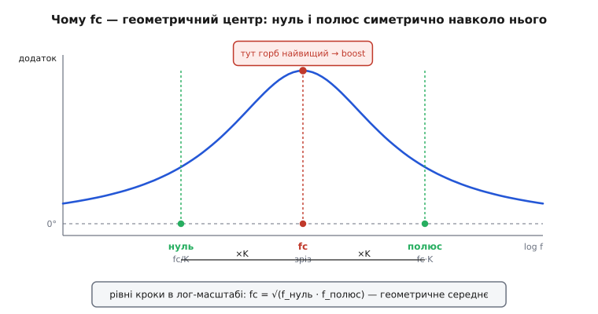
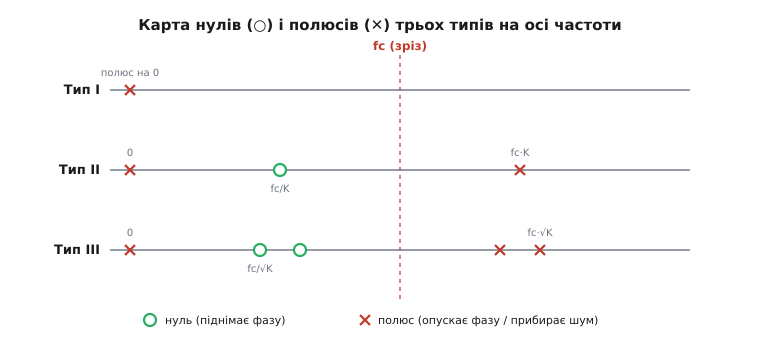

# 🧮 Метод K-factor: від бажаної фази до номіналів

Розставити нуль і полюс компенсатора «нижче зрізу, щоб фаза була піднята» — порада правильна, але руки самі тягнуться крутити номінали наздогад. Метод K-factor перетворює цю пораду на **арифметику**: ви кажете, яку частоту зрізу хочете й скільки запасу фази, а метод повертає, де саме мають сидіти нуль і полюс. Тут ми виведемо його **з нуля** — не подамо формули, а покажемо, звідки береться кожна, чому центральна формула саме `K = tan(45° + boost/2)`, чому Тип III дає вдвічі більший підйом за те саме K, і як від частот перейти до конкретних R та C — окремо для операційного підсилювача (грає відношення імпедансів) і для крутісного OTA (грають абсолютні номінали через gm).

Метод — не безіменна народна мудрість. Його опублікував 1983 року американський інженер **Г. Дін Венейбл** (H. Dean Venable) у статті «The K Factor: A New Mathematical Tool for Stability Analysis and Synthesis» на конференції Powercon 10; згодом його ж стаття «Optimum Feedback Amplifier Design for Control Systems» узагальнила підхід на всі три типи компенсатора. Терміни «Тип I / II / III» пішли саме звідти й закріпились у галузі як стандартні (доказовий статус: підтверджено первинними публікаціями Venable Industries і численними вторинними джерелами — TI, аналітичними оглядами).

## Що таке K і навіщо він

Почнімо з задачі, яку метод розв'язує. У вас є силова частина перетворювача — від шпаруватості до виходу — з відомою фазою на бажаній частоті зрізу. Назвемо цю фазу φ_силовоі (число від'ємне: скажімо, −120°). Ви хочете, щоб на частоті зрізу fc повний контур мав запас фази ЗФ_ціль — здорові 45…60°. Компенсатор мусить **докинути фазу**, щоб дотягти від того, що дає силова частина, до бажаного запасу. Скільки саме докинути — це число, яке метод називає **підйомом фази** (*phase boost*).

Виведемо його чесно. Запас фази — це відстань повної фази контуру від −180° на частоті зрізу:

```
ЗФ = 180° + φ_повна(fc)
```

Повна фаза — сума силової частини й компенсатора:

```
φ_повна = φ_силовоі + φ_комп
```

Компенсатор завжди починається з інтегратора (полюс на нулі частоти), а той відкручує рівно −90° по всьому діапазону. Понад ці −90° компенсатор докидає нагору свій **підйом** від нулів і полюсів — назвемо його boost. Тобто:

```
φ_комп = −90° + boost
```

Підставмо все в запас фази й розв'яжемо відносно boost:

```
ЗФ_ціль = 180° + φ_силовоі + (−90° + boost)
boost   = ЗФ_ціль − φ_силовоі − 90°
```

Ось звідки береться та формула, що виглядає як заклинання. Вона не постульована — вона **випливає** з означення запасу фази й того факту, що інтегратор коштує −90°. Читається просто: *підйом, який мусить дати пара нуль-полюс, дорівнює бажаному запасу мінус фаза, яку лишила силова частина, мінус 90° штрафу за інтегратор.*

**Приклад підрахунку boost.**
Нехай силова частина на зрізі дає φ_силовоі = −115° (характерно для напруго-режимного buck, де подвійний полюс LC уже сильно з'їв фазу), а ми хочемо запас 50°:

```
boost = 50 − (−115) − 90 = 50 + 115 − 90 = 75°
```

Компенсатор має підняти фазу на 75° понад −90° інтегратора. Один нуль такого не подужає (він дає максимум +90°, але не миттєво й не безкоштовно вгорі), тож уже видно: тут не обійтися Типом II — знадобиться Тип III. Але спершу розберемо, як з цього числа народжується K.

> 🔧 **Навіщо це.** Формула boost — це місток між тим, що ви **вимірюєте** (фаза силової частини на бажаному зрізі — з діаграми Боде чи з аналізатора), і тим, що ви **проєктуєте** (розстановка нулів). Помилитесь у φ_силовоі на 20° — і весь компенсатор стане не там. Тому спершу чесно знайдіть фазу силової частини на fc, а вже потім рахуйте boost.

## Геометрична серцевина: чому fc — центр між нулем і полюсом

Тепер головна ідея методу, і вона суто **геометрична**. Пара «нуль-полюс» разом дає горб фази: нуль піднімає фазу, полюс за ним її знову опускає. Цей горб має максимум десь **між** нулем і полюсом. Питання: де саме поставити нуль і полюс, щоб максимум горба припав **точно на fc** — туди, де нам потрібен запас?

Розберемо фазу одиночного нуля й одиночного полюса. Нуль на частоті f_z додає до фази:

```
φ_нуль(f) = +arctan(f / f_z)
```

Полюс на частоті f_p віднімає:

```
φ_полюс(f) = −arctan(f / f_p)
```

Сумарний додаток пари (понад інтегратор):

```
boost(f) = arctan(f / f_z) − arctan(f / f_p)
```

Ми хочемо, щоб ця функція мала **максимум** на f = fc. Візьмемо похідну по частоті й прирівняймо до нуля. Похідна arctan(f/a) по f дорівнює a/(a² + f²). Тоді:

```
d(boost)/df = f_z/(f_z² + f²) − f_p/(f_p² + f²) = 0
```

Прирівнявши й трохи поперекладавши (перемноживши навхрест), дійдемо до напрочуд чистого результату:

```
f_z · (f_p² + f²) = f_p · (f_z² + f²)
f_z·f_p² + f_z·f²  = f_p·f_z² + f_p·f²
f_z·f_p·(f_p − f_z) = f²·(f_p − f_z)
f² = f_z · f_p
```

Максимум горба сидить там, де **f = √(f_z · f_p)** — на **геометричному середньому** нуля й полюса. Це і є ключ до всього методу. Щоб максимум припав на fc, треба поставити нуль і полюс так, щоб fc був їхнім геометричним середнім:

```
fc = √(f_z · f_p)
```

На діаграмі Боде вісь частоти логарифмічна, а геометричне середнє в лінійному масштабі — це **арифметичне середнє в логарифмічному**. Тобто на екрані Боде fc опиняється **рівно посередині** між нулем і полюсом. Ось чому кажуть «нуль і полюс симетрично навколо fc»: не приблизно, а строго — однакова кількість декад ліворуч і праворуч.


*Максимум фазового горба сидить на геометричному середньому нуля й полюса. Поставивши нуль на fc/K і полюс на fc·K, ми робимо fc центром симетрії — і саме там горб найвищий. Це не наближення: похідна дає точну рівність fc = √(f_нуль · f_полюс).*

Тепер введемо K. Раз усе симетричне навколо fc, зручно параметризувати розсув **одним** числом: наскільки нуль стоїть нижче fc, настільки полюс — вище. Хай це буде множник K:

```
f_нуль  = fc / K
f_полюс = fc · K
```

Перевірмо, що fc справді лишається геометричним центром: √(f_нуль · f_полюс) = √((fc/K)·(fc·K)) = √(fc²) = fc. Сходиться тотожно, за будь-якого K. Отже, **K — це і є той єдиний важіль, що керує шириною пари**: K = 1 злютовує нуль і полюс у точку (жодного підйому), великий K розсуває їх на багато декад (великий підйом).

> 🔧 **Навіщо це.** Уся хитрість «геометричного центру» практична: якби нуль і полюс стояли несиметрично, максимум фази поїхав би вбік від fc — і ви дістали б менше запасу саме там, де він критичний. Симетрія навколо fc гарантує, що **весь наявний підйом фізично зосереджений на частоті зрізу**, а не розмазаний повз неї. K-factor — це найощадливіший спосіб витратити наявну фазу.

## Звідки береться K = tan(45° + boost/2)

Тепер зв'яжемо важіль K із бажаним підйомом boost. Підставмо f = fc, f_z = fc/K, f_p = fc·K у формулу підйому пари:

```
boost = arctan(fc / f_нуль) − arctan(fc / f_полюс)
      = arctan(fc / (fc/K)) − arctan(fc / (fc·K))
      = arctan(K) − arctan(1/K)
```

Гарно спростилося: підйом на зрізі залежить **лише** від K, а не від абсолютної fc. Тепер згадаймо тотожність: arctan(K) + arctan(1/K) = 90° для будь-якого K > 0 (кут і його доповнення до прямого). Звідси arctan(1/K) = 90° − arctan(K), і:

```
boost = arctan(K) − (90° − arctan(K)) = 2·arctan(K) − 90°
```

Розв'яжемо відносно K:

```
2·arctan(K) = 90° + boost
arctan(K)   = 45° + boost/2
K           = tan(45° + boost/2)
```

Ось воно. Формула `K = tan(45° + boost/2)` — не емпіричне підганяння, а **точний розв'язок** задачі «розсунь нуль і полюс так, щоб на геометричному центрі підйом дорівнював boost». Кожен її шматок тепер має сенс: 45° — це половина від 90° інтегратора; boost/2 — половина потрібного підйому, бо нуль і полюс ділять роботу порівну (кожен відхиляється від fc на однакову логарифмічну відстань); tan перетворює кут назад у множник частоти.

Перевіримо на межах, щоб відчути формулу руками:

```
boost = 0°   →  K = tan(45°)  = 1      (нуль і полюс збігаються — підйому нема)
boost = 45°  →  K = tan(67.5°) ≈ 2.41  (помірний розсув)
boost = 76°  →  K = tan(83°)  ≈ 8.14   (широкий розсув)
boost → 90°  →  K = tan(90°)  → ∞      (полюс тікає в нескінченність!)
```

Остання межа — фізична стеля Типу II. Щоб дістати підйом 90°, довелося б відсунути полюс нескінченно далеко (а нуль — до нуля частоти), тобто прибрати полюс зовсім. Практично Тип II виснажується вже коло **70…80°**: за цією межею K стає такий великий, що полюс залазить у область комутаційного шуму й перестає його гасити, а виграш на низах провалюється. Ось **чому Тип II докидає «до ~90°», але ніколи їх не досягає** — це видно прямо з tan, що йде в нескінченність.

![Дві криві K від boost: Тип II tan(45+b/2) стрімко тікає вгору й розходиться коло 90 градусів; Тип III [tan(45+b/4)] у квадраті росте вдвічі повільніше й дозволяє boost аж до 180 градусів](/book/electronics/power-electronics/control-loop-compensation/img/k-vs-boost.svg)
*K як важіль. Для Типу II (синє) K злітає в нескінченність, коли boost наближається до 90° — це стеля одної пари нуль-полюс. Тип III (червоне) за те саме значення K дає **вдвічі** більший підйом, тож дотягує аж до ~180°, потрібних проти крутого подвійного полюса LC. Ціна великого K однакова для обох: що ширший розсув, то нижчий виграш контуру на низьких частотах.*

## Тип I: самий інтегратор, K тут не потрібен

Перш ніж до нулів, розберемо найпростіший тип — щоб було з чим порівнювати. Тип I — це **лише** інтегратор, без жодної пари нуль-полюс. Його передатна функція:

```
        ωI          1
G(s) = ────  =  ─────────
         s        s / ωI
```

де ωI = 2π·fI — частота, на якій виграш інтегратора падає до одиниці (0 дБ). На Боде це пряма −20 дБ/декаду по всьому діапазону й **стала фаза −90°** усюди. Підйому нема: boost = 0. Тому Тип I годиться лише там, де силова частина **сама** фазу майже не з'їдає — керування коефіцієнтом потужності, драйвери світлодіодів, повільні зарядні контури, де подвійного полюса LC у робочому діапазоні просто немає.

Єдиний вільний параметр Типу I — де саме поставити ту частоту одиничного виграшу fI, тобто як високо підняти всю криву. Її обирають так, щоб повний контур перетнув 0 дБ на бажаній fc. Для операційного підсилювача з вхідним резистором R1 і зворотним конденсатором C1:

```
G(s) = 1 / (s·R1·C1)     →     fI = 1 / (2π·R1·C1)
```

Один резистор, один конденсатор. Уся «математика K-factor» для Типу I вироджується в один крок: поставити fI туди, де треба перетнути нуль дБ. K тут ні до чого — його важіль вмикається аж із появою пари нуль-полюс у Типі II.

## Тип II: інтегратор плюс одна пара нуль-полюс

Тепер робоча конячка. Тип II додає до інтегратора **одну** пару нуль-полюс. Його передатна функція — добуток інтегратора, нуля й полюса:

```
        ωI      (1 + s/ωz)
G(s) = ────  ·  ──────────
         s      (1 + s/ωp)
```

де ωz = 2π·f_нуль, ωp = 2π·f_полюс. Прочитаймо цю функцію як три ефекти, що додаються на Боде:

- множник **ωI/s** — інтегратор: нахил −20 дБ/дек і фаза −90° скрізь;
- множник **(1 + s/ωz)** — нуль: від f_нуль нахил рівняється до 0 дБ/дек (виграш перестає падати), а фаза підіймається до +90°;
- множник **1/(1 + s/ωp)** — полюс: від f_полюс нахил знову йде на −20 дБ/дек, а фаза опускається назад до −90°.

Між нулем і полюсом крива має **пласку поличку** виграшу (нахил ~0) — ось той «робочий виграш», що задає рівень контуру. А фаза на цій поличці задирається горбом, максимум якого ми навмисне поставили на fc.

Тепер рецепт K-factor для Типу II зшивається в п'ять кроків:

```
Тип II — розстановка:
   boost   = ЗФ_ціль − φ_силовоі − 90°
   K       = tan(45° + boost/2)
   f_нуль  = fc / K
   f_полюс = fc · K
   рівень контуру задають виграшем полички (нижче — через R/C)
```

### Номінали Типу II на операційному підсилювачі

У операційного підсилювача на виході **напруга**, тож мережа компенсації замикається з виходу назад на інвертувальний вхід — «обгортає» підсилювач. Тоді підсилення від входу до виходу дорівнює **відношенню імпедансів**: Z_зворотний / Z_вхідний. Класична схема Типу II: вхідний резистор R1 (частина дільника ЗЗ), а в зворотному колі — R2 послідовно з C1, і все це в паралель із C2.

Розберемо, який елемент яку особливість дає — через **сталі часу**, кожна з яких «вмикається» на своїй частоті:

```
Тип II на ОП (R1 вхідний; R2+C1 і ‖ C2 у зворотному):
   інтегратор:  ωI  = 1 / (R1 · (C1 + C2))     ≈ 1/(R1·C1),  бо C1 ≫ C2
   нуль:        ωz  = 1 / (R2 · C1)
   полюс:       ωp  = (C1 + C2)/(R2·C1·C2)      ≈ 1/(R2·C2),  бо C1 ≫ C2
```

Звідки вони беруться фізично. На дуже низьких частотах C1 і C2 — майже розрив, зворотний імпеданс великий, працює чистий інтегратор із сумарною ємністю (C1+C2). Дійшовши до f_нуль = 1/(2π·R2·C1), конденсатор C1 «дозаряджається» так, що його опір падає до рівня R2 — далі зворотний імпеданс уже не росте (R2 його обмежує), виграш перестає падати: це нуль. Ще вище, коло f_полюс = 1/(2π·R2·C2), уже й C2 закорочує R2 — зворотний імпеданс знову починає падати, виграш валиться: це полюс, який гасить шум.

Порядок розрахунку від цілей до деталей:

```
1. R1 задано дільником ЗЗ (Vоп/Vвих): R1 = R_low · (Vвих/Vоп − 1)  — або взято як даність.
2. Виграш полички Amid визначає рівень контуру; часто Amid ≈ R2/R1.
   Обери R2 = Amid · R1 (з умови потрібного зрізу на 0 дБ).
3. C1 = 1 / (2π · R2 · f_нуль)     — ставить нуль.
4. C2 = 1 / (2π · R2 · f_полюс)    — ставить полюс.
```

Тут і криється чому «важать відношення, а не абсолюти»: виграш полички — це R2/R1, а частоти нуля й полюса задають добутки R2·C. Помножте R1, R2 на десять і поділіть C1, C2 на десять — усі частоти й виграш лишаться ті самі. Тому абсолютний рівень опорів обирають з інших міркувань (шум, струм зміщення входу, навантаження на вихід ОП), а форму контуру — з відношень.

### Номінали Типу II на крутісному OTA

У OTA на виході **струм**, пропорційний різниці входів через крутість gm: i_вих = gm·(V+ − V−). Цей струм тече у вивід COMP, а мережа компенсації стоїть **від COMP на землю**. Тепер вихідна напруга — це струм, помножений на **імпеданс навантаження на землю**: V_comp = gm·V_похибки · Z_нав. Форму контуру задає вже сам Z_нав, а не відношення. Схема Типу II на OTA: послідовна ланка R2+C1 від COMP на землю, плюс малий C2 паралельно (теж на землю).

```
Тип II на OTA (R2+C1 послідовно від COMP на землю; C2 ‖ на землю):
   виграш полички: Amid = gm · R2          ← АБСОЛЮТНЕ значення, не відношення
   нуль:           ωz   = 1 / (R2 · C1)
   полюс:          ωp   = 1 / (R2 · C2)      (при C1 ≫ C2)
```

Логіка та сама послідовність сталих часу, але роль «виграшу» тепер грає добуток **gm·R2** — абсолютна величина. Це докорінна відмінність: у OTA не можна безкарно масштабувати опори, бо gm — фіксована паспортна величина мікросхеми, і виграш gm·R2 «прив'язаний» до абсолютного R2. Порядок:

```
1. R2 = Amid / gm         — з потрібного виграшу полички (gm бере з даташита).
2. C1 = 1 / (2π · R2 · f_нуль)    — нуль.
3. C2 = 1 / (2π · R2 · f_полюс)   — полюс.
```

Це рівно та арифметика, що стоїть за worked-прикладом у тілі теми. Різниця «ОП проти OTA» — не косметична: та сама мережа R2+C1, повішена «навколо» замість «на землю», дала б зовсім інші частоти, бо в одному разі рахує відношення, а в іншому — абсолют через gm.

> 🔧 **Навіщо це.** Побачивши в даташиті вивід COMP і слово «transconductance» чи «gm» — знаєте: рахуйте виграш як gm·R, а мережу ведіть на землю. Побачивши повноцінний підсилювач похибки з доступом до інвертувального входу — мережа обгортає його, і в грі відношення R2/R1. Формула типу (boost → K → f_нуль/f_полюс) спільна, а переклад частот у деталі — різний.

## Тип III: дві пари нуль-полюс і чому виходить до 180°

Коли силова частина з'їдає більше ніж ~70° (напруго-режимний buck із крутим подвійним полюсом LC, керамічний вихід із мізерним ESR), одної пари замало. Тип III додає **другу** пару нуль-полюс. Його передатна функція має **два** нулі й **три** полюси (один з них — на нулі частоти, інтегратор):

```
        ωI      (1 + s/ωz1)(1 + s/ωz2)
G(s) = ────  ·  ──────────────────────
         s      (1 + s/ωp1)(1 + s/ωp2)
```

Тепер головне питання: **чому два нулі дають до 180°, а один — лише до 90°?** Відповідь пряма з арифметики фаз. Кожен нуль додає максимум +90°, кожен полюс віднімає максимум 90°. Але на частоті зрізу нулі вже спрацювали (вони нижче fc), а полюси ще майже ні (вони вище fc). Тож на fc два нулі встигають докинути вдвічі більше за один — аж до +180° у ідеалі.

У K-factor для Типу III зазвичай роблять **збіжні** пари: обидва нулі в одну точку f_нуль, обидва полюси в одну точку f_полюс, і fc — геометричний центр між ними. Тоді підйом на зрізі — це подвоєний підйом одної пари:

```
boost = 2·[arctan(K') − arctan(1/K')] = 2·(2·arctan(K') − 90°)
```

де K' — множник розсуву для Типу III (f_нуль = fc/K', f_полюс = fc·K'). Прирівняймо це до потрібного boost і розв'яжімо:

```
boost/2 = 2·arctan(K') − 90°
arctan(K') = 45° + boost/4
K' = tan(45° + boost/4)
```

А в багатьох джерелах і калькуляторах уживають **квадрат** цього K' і звуть його одним числом K (щоб формула розсуву лишалась симетричною відносно √K):

```
K = [tan(45° + boost/4)]²
f_нуль  = fc / √K
f_полюс = fc · √K
```

Обидва запаси еквівалентні — це той самий розсув, просто в одному записі K означає повний множник частоти (тоді ділять на √K), а в іншому K' — множник на одну пару (тоді ділять на K'). Важливий висновок незмінний: **boost ділиться між чотирма елементами (два нулі, два полюси), тож boost/4 у куті замість boost/2** — саме тому Тип III за те саме K дає вдвічі ширший підйом і дотягує аж до ~180°.

Перевіримо межу так само, як для Типу II:

```
boost = 90°   →  K' = tan(45° + 22.5°) = tan(67.5°) ≈ 2.41  (цілком помірний розсув!)
boost = 150°  →  K' = tan(45° + 37.5°) = tan(82.5°) ≈ 7.6
boost → 180°  →  K' = tan(90°) → ∞     (стеля Типу III)
```

Порівняйте: підйом 90°, який Типу II дається лише ціною нескінченного K, Тип III дає скромним K' ≈ 2.41. Ось математична причина, чому для крутого LC беруть саме Тип III — не через «більше деталей заради надійності», а тому що **одна пара фізично впирається в 90° раніше, ніж силова частина перестає їсти фазу**.


*Карта нулів і полюсів. Тип I — самий полюс на нулі частоти. Тип II — плюс одна пара навколо fc (нуль на fc/K, полюс на fc·K). Тип III — плюс друга пара: обидва нулі коло fc/√K, обидва полюси коло fc·√K. Що більше нулів встигло спрацювати нижче зрізу, то вищий фазовий горб на самому зрізі.*

### Номінали Типу III на операційному підсилювачі

Тип III на ОП потребує **двох** RC-груп: одна в зворотному колі (як у Типі II — R2+C1 ‖ C2), а друга — **паралельно вхідному резистору** R1 (додатковий R3+C3). Саме ця друга група й дає **другий** нуль і другий полюс — ту зайву пару, якої не було в Типі II. Сталі часу:

```
Тип III на ОП (R2, C1, C2 у звороті; R1 та R3+C3 паралельно на вході):
   інтегратор:  ωI   ≈ 1 / (R1 · C1)
   нуль 1:      ωz1  = 1 / (R2 · C1)
   нуль 2:      ωz2  = 1 / ((R1 + R3) · C3)   ≈ 1/(R1·C3),  якщо R3 ≪ R1
   полюс 1:     ωp1  ≈ 1 / (R2 · C2)
   полюс 2:     ωp2  = 1 / (R3 · C3)
```

Прочитаймо, яку особливість дає нова група R3+C3. На низах C3 — розрив, вхідний імпеданс — просто R1. Дійшовши до f_z2 = 1/(2π·R1·C3), конденсатор C3 починає шунтувати R1 — вхідний імпеданс падає, а раз підсилення є Z_звор/Z_вх, воно **росте**: це нуль (падіння знаменника задирає дріб). Ще вище, коло f_p2 = 1/(2π·R3·C3), шунт упирається в R3 і вхідний імпеданс перестає падати — підсилення знову рівняється: це полюс. Ось так друга пара «нуль-полюс» народжується з боку **входу**, тоді як перша пара живе у **звороті**.

Порядок розрахунку (для збіжних пар f_нуль/f_полюс за K-factor):

```
1. R1, R_low — дільник ЗЗ (задано напругами).
2. C1 = 1/(2π·R2·f_нуль); R2 з потрібного виграшу полички.
3. C2 = 1/(2π·R2·f_полюс).
4. C3 = 1/(2π·R1·f_нуль);  R3 = 1/(2π·C3·f_полюс).
```

І знову — грають **відношення** та добутки R·C, тож абсолютний рівень опорів вільний (у межах шуму й навантаження).

### Номінали Типу III на OTA — і чому так рідко

На OTA Тип III зробити **важче**, і в природі він трапляється рідко — ось чому. Друга пара нуль-полюс Типу III класично народжується з боку **вхідного дільника** (шунт R3+C3 навколо R1). Але у OTA-контролері вхідний дільник ЗЗ часто **всередині мікросхеми** й недоступний, а вихід — це струм у один вузол COMP на землю. Повісити другу RC-групу «на вхід» ніде. Тому OTA-контролери майже завжди розраховані на Тип II; коли треба більше фази, або міняють топологію (струмовий режим, де силова частина простіша), або ставлять зовнішній операційний підсилювач похибки саме заради Типу III. Якщо ж друга пара робиться на OTA іншим включенням, її нуль і полюс усе одно задаються через **абсолютні** gm·R і C — за тією ж логікою, що й у Типі II на OTA, лише з двома ланками. Практичний висновок: **побачили вимогу Типу III — очікуйте операційний підсилювач, не OTA.**

## Ціна великого K: чому не «взяти запас із запасом»

Спокуса: раз більший boost дає більший запас фази, чому не задерти boost про запас? Бо за широкий розсув платить **виграш контуру на низьких частотах**, а з ним — точність і швидкість реакції. Подивімось, звідки ця плата.

Робочий виграш полички (між нулем і полюсом) фіксований рівнем контуру. Але сам інтегратор нижче нуля має нахил −20 дБ/дек. Що нижче опустився f_нуль (більший K → f_нуль = fc/K далі вниз), то з **більшої** висоти інтегратор мусив спадати, щоб дійти до тієї самої полички, — отже, на будь-якій фіксованій низькій частоті виграш **менший**. Кількісно: піднявши K, ви опускаєте f_нуль у K разів, і виграш на частотах нижче нуля падає приблизно в K разів (на 20·log₁₀K дБ):

```
K = 2   →  f_нуль удвічі нижче  →  виграш на низах  −6 дБ
K = 5   →  f_нуль у 5 разів нижче →  виграш на низах  −14 дБ
K = 10  →  на порядок нижче      →  виграш на низах  −20 дБ
```

А низькочастотний виграш — це те, що душить статичну похибку й повільні збурення (просад від дрейфу навантаження, пульсацію входу). Взяли boost «із запасом» — розсунули K — і контур став **млявіший** там, де мав бути найсильніший. Тому boost беруть **рівно стільки, скільки треба** для здорового запасу (45…60°), і ні градусом більше: кожен зайвий градус підйому оплачений втраченим виграшем на низах. Це прямий математичний компроміс, а не питання смаку.

> 🔧 **Навіщо це.** Ось чому «більше запасу фази» не завжди краще. Понад ~60° запасу ви вже майже не виграєте у демпфуванні перехідного процесу, зате помітно втрачаєте низькочастотний виграш (точність) і смугу. K-factor тому й цінний, що дає **найменший** K для потрібного запасу — тобто максимум виграшу на низах за заданої стійкості.

## Межі методу: де K-factor мовчить

Насамкінець — чесно про те, чого метод **не** робить, щоб не покладатись на нього наосліп.

По-перше, K-factor вважає фазовий горб **симетричним** навколо fc. Це точно так лише для збіжних пар і в припущенні, що інші полюси-нулі силової частини далеко. Якщо поряд із fc сидить нуль ESR або правопівплощинний нуль boost (він фазу **опускає**, як полюс, але виграш при цьому **піднімає**, як нуль — підступна пара), справжній горб перекошується, і максимум зсувається з fc. Тоді розстановку доводять руками або числовою оптимізацією поверх K-factor-стартів.

По-друге, метод оперує **малосигнальною** моделлю: він нічого не знає про насичення підсилювача похибки, обмеження шпаруватості, субгармонічні коливання струмового режиму. Ці явища живуть за межами лінійної теорії, і їх ловлять уже на живій платі.

По-третє, увесь розрахунок стоїть на **вимірі φ_силовоі** на fc. Помилка у моделі котушки, ємності чи ESR перекручує φ_силовоі — і весь ланцюг boost → K → f_нуль/f_полюс промахується. Тому K-factor дає **першу, дуже добру відправну точку**, а останнє слово завжди за виміряною характеристикою: аналізатор частотної характеристики на реальному контурі, у кутах діапазону (мінімальний і максимальний вхід, мале й повне навантаження, гарячий і холодний стан). Метод перетворює компенсацію з ворожіння на інженерію — але не заміняє перевірку, а лише робить її **підтвердженням**, а не пошуком навпомацки.

Що забрати. Метод K-factor — це три ланки, кожна з чесним виведенням: **boost = ЗФ_ціль − φ_силовоі − 90°** (з означення запасу фази й −90° інтегратора), **K із симетрії навколо fc** (бо максимум фазового горба сидить на геометричному середньому нуля й полюса, а fc робимо цим середнім), і **переклад частот у номінали** через сталі часу R·C. Для Типу II кут ділиться навпіл (`K = tan(45° + boost/2)`, стеля 90°), для Типу III — на чотири (`K = [tan(45° + boost/4)]²`, стеля 180°), бо чотири елементи замість двох ділять роботу. На операційному підсилювачі номінали задають **відношення** імпедансів (масштаб опорів вільний), на OTA — **абсолютні** через gm·R (масштаб прив'язаний до паспортної крутості). І пам'ятайте про плату: більший K купує фазу ціною виграшу на низах, тож беруть найменший K, що дає потрібний запас.
