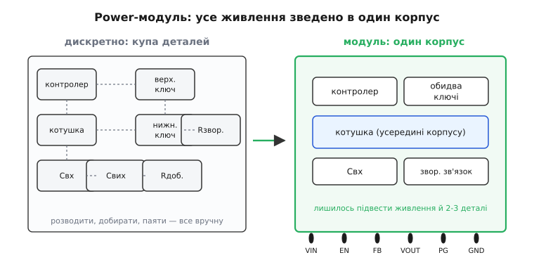

# 🔌 Power-модулі «все в одному»

Уяви, що цілий понижувальний перетворювач — контролер, обидва силові ключі, котушка, ба навіть частина конденсаторів і резистор зворотного зв'язку — хтось уже зібрав, узгодив між собою й запаяв в один корпус завбільшки з нігтик. Лишається підвести вхід, землю, сказати, скільки вольтів хочеш на виході, — і шина готова. Це і є **power-модуль** (англ. *power module*, від лат. *modulus* — «мірка, готова частка»): не мікросхема, а **готовий вузол живлення** в корпусі мікросхеми. Часто його звуть ще **point-of-load**-модулем (PoL, «біля самого споживача»), бо такий блок ставлять упритул до того чипа, який він годує.

Щоб зрозуміти, навіщо він узагалі існує, варто згадати, що звичайний [інтегрований switcher](topic:electronics/buck) ховає всередину лише контролер і ключі, а **котушку** й конденсатори ти все одно мусиш дібрати, купити, розвести й запаяти сам. Саме котушка — найнезручніша деталь перетворювача: її обирають за даташитом, вона займає місце, і помилка з нею легко псує і ккд, і стабільність. Power-модуль робить останній крок інтеграції — **затягує котушку всередину корпусу** разом з усім іншим.

*Зліва — дискретне рішення: контролер, два ключі, котушка, вхідні й вихідні конденсатори та резистори зворотного зв'язку стоять окремими деталями, і кожну треба розвести й запаяти. Справа — той самий перетворювач, зведений в один корпус: назовні лишилися кілька ніжок і два-три зовнішні конденсатори.*

## Що саме сидить усередині

Розкривши такий корпус, побачиш чотири складники одного перетворювача, припасовані один до одного ще на заводі:

- **контролер** — мозок із зворотним зв'язком; майже завжди [струмового типу](topic:electronics/feedback-stability) з вродженим поцикловим лімітом струму;
- **два силові ключі** — верхній і нижній MOSFET синхронного [понижувача](topic:electronics/buck), уже з узгодженим драйвером затвора й bootstrap для верхнього ключа;
- **котушка** — головна родзинка модуля; підібрана рівно під ту fsw і той струм, на які розрахований чип;
- **частина обв'язки** — компенсація зворотного зв'язку, дрібні конденсатори, іноді й вихідний.

Ключове тут не «їх багато», а що вони **узгоджені між собою**. У дискретному рішенні ти сам відповідаєш, щоб котушка пасувала до частоти, компенсація — до котушки, а розведення силової петлі не дзвеніло. У модулі цю інженерію вже зроблено й перевірено: котушка, ключі й контур стабілізації підігнані одне до одного на конвеєрі, а не в тебе на столі.

> 🔧 **Навіщо це.** Power-модуль — це куплений час інженера. Замість тижня на розрахунок котушки, компенсацію, розведення силової петлі та боротьбу з дзвоном ти ставиш один корпус і три конденсатори — і шина працює передбачувано з першої плати. На прототипі чи малій серії, де дорогий саме час, це часто найрозумніший вибір.

## Чим платимо: ціна й гнучкість

За готовність розплачуєшся двома речами, і обидві треба чесно зважити.

**Ціна штуки.** Модуль майже завжди **дорожчий** за дискретне рішення на тому самому струмі — усередині сидить котушка, а її намотування й вкладання в корпус коштують. Тут криється пастка наївного порівняння: якщо рахувати лише ціну однієї мікросхеми, контролер виграє завжди. Але повна ціна шини — це ще й **монтаж кожної деталі** (поставити й запаяти десяток компонентів), **закупівля й склад** усього переліку, **ризик зриву постачання** будь-якої з позицій і час на розведення та налагодження плати. Коли цих прихованих витрат багато — на прототипі, на малій серії, на платі з **двома десятками** живлень, кожне з яких довелося б розводити окремо, — дорожчий за штуку модуль виходить **дешевшим за весь проєкт**.

**Гнучкість.** Модуль — це фіксований вибір. Частота комутації в ньому **зашита** й непідвладна тобі: котушку дібрали саме під неї, тож «посунути fsw геть від смуги приймача» вже не можна — це треба було закласти вибором самого модуля. Так само наперед задані тип котушки, режим керування, межі струму. Компенсацію зворотного зв'язку теж зроблено за тебе: зручно, бо не треба її рахувати, але й тонко підлаштувати петлю під незвичне навантаження ти майже не можеш. Ти береш готовий компроміс — і втрачаєш ручки, які дає дискретна схема.

## Коли краще дискретно

З цього прямо випливає, де модуль **не** твій вибір:

- **Велика серія, де кожна копійка множиться на мільйон.** Тут окупається контролер із зовнішніми ключами: найдешевша обв'язка за штуку переважить вищу вартість розробки.
- **Великий струм — десятки ампер.** Модуль зводить усе тепло в один корпус; за кількадесят ампер відвести його стає нічим, і виграють зовнішні MOSFET із власними тепловими площадками — тепло ставить ту саму стелю за струмом, що обмежує будь-яку інтеграцію.
- **Потрібен повний контроль над fsw, петлею чи нетиповий профіль.** Якщо вузол стоїть упритул до чутливого радіо й частоту треба точно відстроїти від його смуги, або навантаження вимагає нестандартної [компенсації зворотного зв'язку](topic:electronics/feedback-stability), — бери дискрет, де ці ручки в тебе.
- **Жорсткий тепловий бюджет.** Уся розсіювана потужність виходить через дрібний корпус модуля; на межі це штовхає чип у термозахист, і дискретне рішення з рознесеним теплом дихає вільніше.

> 🔧 **Навіщо це.** Правило-орієнтир просте: **малий струм + дорогий час інженера + мала чи середня серія → модуль**; **великий струм, велика серія або потреба в тонкому контролі → дискрет**. Модуль купує швидкість і передбачуваність ціною грошей за штуку й свободи; дискрет — навпаки. ТЗ (струм, серійність, бюджет, сусідство з радіо) майже однозначно підказує, куди хилитися.

## Як упізнати такий компонент

Готових родин на ринку багато, і всі вони влаштовані однаково — різняться лише струмом, входом і корпусом. У переліку їх видно за словами «power module» та «integrated inductor» (котушка всередині): приміром, родини TPSM і LMZ від Texas Instruments, µModule від Analog Devices (раніше Linear), RAA210xx від Renesas. Аналогові варіанти тягнуть типово від часток ампера до кількох ампер і керуються кількома ніжками EN/FB/PG (їхня розпіновка й «перший байт» запуску — у [довідці про ніжки модуля](topic:electronics/controller-fsw/api-power-module-pins.md)); потужніші цифрові (на кшталт 25-амперних PMBus-модулів) уже спілкуються по шині. Конкретні партномери з їхніми числами — це вже матеріал каталогу, а не цієї статті: тут важливий **сам клас** і те, як він влаштований і коли його брати. Принцип — один корпус, готовий компроміс, фіксована fsw — однаковий для будь-якого виробника.
