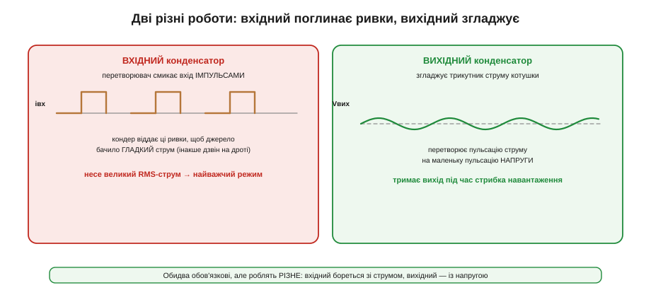
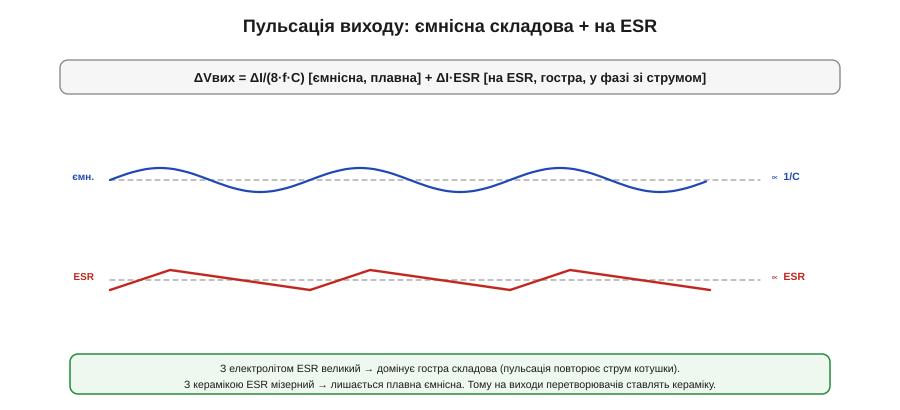
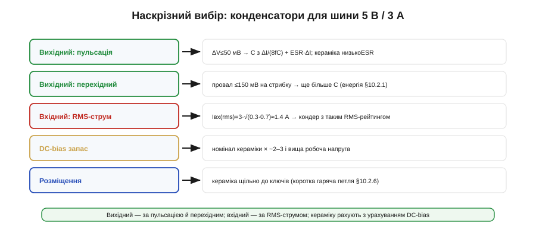

# Конденсатори входу й виходу: ESR і пульсації

Котушка не працює сама — обабіч перетворювача стоять [конденсатори](book:electronics/capacitor), і їх **двоє різних**, із геть різними завданнями. Вихідний бореться з пульсацією **напруги**; вхідний — із ривками **струму**, і саме він, усупереч інтуїції, опиняється в найважчому режимі. А спільний лиходій обох — паразитний опір ESR.

### Дві ролі: вхідний і вихідний


*Рис. Вхідний конденсатор: перетворювач смикає вхід імпульсами, і кондер віддає ці ривки, щоб джерело бачило гладкий струм (інакше дзвін на дроті й завади). Несе великий RMS-струм — найважчий режим. Вихідний конденсатор: згладжує трикутник струму котушки в маленьку пульсацію напруги й тримає вихід під час стрибка навантаження.*

Ці дві ролі легко сплутати, бо «конденсатор для згладжування» звучить однаково. Та **вихідний** конденсатор працює з **напругою**: він приймає змінну частину струму котушки й перетворює її на дрібну пульсацію вихідної напруги, а ще тримає вихід у перші миті стрибка навантаження. **Вхідний** же працює зі **струмом**: buck смикає з входу різкі імпульси (повний струм, поки ключ відкритий, і нуль, поки закритий), і вхідний кондер мусить ці імпульси віддавати локально, щоб батарея чи джерело бачили гладкий струм. Розберімо кожен.

### Вихідний: ESR і пульсація напруги

Вихідну пульсацію [понижувального перетворювача](book:electronics/buck) задають **дві** складові, і ESR — ключ до розуміння, яка домінує.


*Рис. Повна пульсація = ємнісна (ΔI/8fC, плавна, спадає з більшою C) + на ESR (ΔI·ESR, гостра, у фазі зі струмом котушки). З електролітом ESR великий і домінує гостра складова; з керамікою ESR мізерний і лишається плавна ємнісна. Тому на виходи перетворювачів ставлять кераміку.*

```
ΔVвих = ΔI/(8·f·C)   [ємнісна]   +   ΔI·ESR   [на ESR]
```

Перша складова спадає з більшою ємністю, друга — з меншим ESR. У старих **електролітичних** конденсаторах ESR великий (десятки-сотні міліом), тож пульсація напруги майже повторює трикутник струму — домінує доданок на ESR. У сучасній **кераміці** ESR мізерний (одиниці міліом), і лишається переважно плавна ємнісна складова. Саме тому на виходи перетворювачів ставлять кераміку: вона прибирає гостру складову майже повністю.

**Приклад (вихідна пульсація).** Наш вузол: ΔI ≈ 1.03 А, f = 500 кГц, кераміка з ESR ≈ 3 мОм:

```
на ESR:   ΔV = ΔI·ESR = 1.03·0.003 ≈ 3 мВ        (крихітна!)
ємнісна:  щоб ΔVємн ≈ 20 мВ:  C = ΔI/(8·f·ΔV)
          = 1.03 / (8·500·10³·0.02) ≈ 13 мкФ
```

З керамікою доданок на ESR (3 мВ) майже не видно, а пульсацію визначає ємність: ~13 мкФ дають ~20 мВ — у межах ТЗ (≤50 мВ).

> 🧮 **Числове порівняння у вставці.** Наскільки по-різному поводяться кераміка й електроліт (7.7 мВ ємнісної проти 136 мВ на ESR — попри ×10 ємності!) і яку стратегію зменшення пульсації обрати для кожного — у математичній вставці [🧮 Дві складові пульсації](math-ripple-esr.md).

### Вихідний і перехідний процес

Та пульсацією добір вихідного кондера не закінчується. За [технічним завданням](book:electronics/converter-spec) на стрибку навантаження вихід не сміє провалитися глибше за ΔVмакс. У перші миті стрибка, поки контур ще не відреагував, **увесь** додатковий струм віддає саме вихідний конденсатор — за рахунок запасеної енергії. Тому вимога на перехідний процес часто диктує **більшу** ємність, ніж сама пульсація.

Прикиньмо: стрибок 0.5 → 3 А (ΔIнаван = 2.5 А), контур реагує за ~10 мкс, провал ≤ 150 мВ. Грубо конденсатор має віддати цей струм за час реакції, не просівши понад межу:

```
C ≳ ΔIнаван · Δt / ΔV = 2.5 · 10·10⁻⁶ / 0.15 ≈ 167 мкФ
```

Це **на порядок** більше за 13 мкФ, потрібні для самої пульсації. Отже, вихідну ємність визначає **жорсткіша** з двох вимог — і тут це перехідний процес, а не пульсація. Звідси й практика: кілька керамічних конденсаторів у паралель, щоб набрати і ємність для перехідного, і низький ESR для пульсації.

> 🔧 **Навіщо це.** Рахуючи вихідний конденсатор, перевірте **обидві** вимоги — пульсацію й перехідний процес — і візьміть більшу ємність. Найчастіша помилка: підібрати C лише за пульсацією, а тоді ловити просадки й перезавантаження на стрибках навантаження, бо запасеної енергії забракло.

### Вхідний: найважчий режим

Тепер — несподіванка цієї теми. Найбільш навантажена деталь живлення — часто саме **вхідний** конденсатор. Чому?


*Рис. Buck смикає з входу струм ІМПУЛЬСАМИ: повний струм навантаження, поки ключ відкритий, і нуль, поки закритий. Джерело має давати лише середнє (D·Iнаван), а всю різницю — гострі ривки — бере на себе вхідний конденсатор. Він несе великий RMS-струм Iнаван·√(D(1−D)), і цей струм гріє його через ESR.*

Buck бере з входу **рваний** струм, а батарея чи джерело з довгим дротом такого не люблять (дріт має [індуктивність](book:electronics/inductance), і на ривках виникає дзвін і завади). Тому вхідний кондер ставлять **локально**, щоб він віддавав ці імпульси сам, а джерело бачило гладкий середній струм. Платою є великий **RMS-струм пульсації**, що тече крізь кондер:

```
Iвх(rms) ≈ Iнаван · √(D·(1−D))   — максимум при D=0.5 (≈ 0.5·Iнаван)
```

**Приклад (RMS вхідного).** Vвх = 16.8 В, Vвих = 5 В, D = 0.30, Iнаван = 3 А:

```
Iвх(rms) ≈ 3 · √(0.30·0.70) = 3 · √0.21 ≈ 3 · 0.46 ≈ 1.4 А
```

Цей струм тече крізь ESR конденсатора й **гріє** його (Irms²·ESR), тож вхідний добирають **за RMS-струмом**, а не лише за ємністю. Конденсатор із замалим рейтингом RMS-струму перегріється й помре першим — і це найчастіша причина «несподіваної» відмови живлення. Часто доводиться ставити **кілька** конденсаторів у паралель, щоб розподілити цей струм.

Є й друга причина, чому вхідний кондер критичний, — **швидкість** цих ривків. Струм перемикається за наносекунди, а будь-який дріт чи доріжка має [індуктивність](book:electronics/inductance); різкий di/dt на цій індуктивності дає викид напруги (V = L·di/dt) і **дзвін** на вході. Якщо вхідний кондер далеко від ключів, петля струму довга, її індуктивність велика — і дзвін б'є по входу й випромінюється завадами. Тому вхідну кераміку тулять **впритул** до ключів, замикаючи цю гарячу [петлю струму](book:electronics/converter-layout) якомога коротше. Вхідний кондер — це не лише запас заряду, а й глушник високочастотного дзвону.

> 🔧 **Навіщо це.** Не недооцінюйте вхідний конденсатор: за RMS-струмом він нерідко найважче навантажена деталь усього вузла. Дивіться в даташит не лише ємність, а й **допустимий пульсаційний струм** (та ще й при робочій температурі — у спеку він нижчий), і беріть із запасом. Згоріла «на рівному місці» зарядка — часто це засохлий чи перегрітий вхідний кондер.

### Типи: кераміка, полімер, електроліт, тантал

Який конденсатор куди — залежить від типу.


*Рис. Кераміка (MLCC): крихітний ESR і розмір, але просідає під напругою. Полімерний: малий ESR, стабільний, дорожчий. Електроліт: велика ємність, але великий ESR і старіння. Тантал: компактний, та горить при перенапрузі. Часто комбінують об'ємний (електроліт/полімер) із керамікою поряд.*

- **Кераміка (MLCC)** — крихітний ESR, малий розмір, дешева; ідеальна для пульсації й високих частот. Вада — просідання ємності під напругою (про це нижче) і схильність до мікротріщин і «співу».
- **Полімерний** — малий стабільний ESR, велика ємність, не висихає; чудовий, але дорожчий. Часто заміняє електроліт там, де важить ESR.
- **Електролітичний (алюмінієвий)** — велика ємність дешево, але **великий ESR**, старіння й висихання (особливо в спеку). Для об'ємного накопичення, не для високих частот.
- **Тантал** — компактний за ємністю, середній ESR; небезпечний тим, що при перенапрузі може **загорітися**, тож вимагає запасу за напругою.

Як і [з котушкою](book:electronics/converter-inductor), тут діє правило **запасу за напругою**: конденсатор на 25 В не ставлять на 25-вольтову шину — беруть із запасом, типово ×1.5–2, бо реальні сплески перевищують номінал, а близька до межі деталь старіє швидше (тантал так і поготів). Окрема історія — **ресурс електроліта**: він поступово **висихає**, і то швидше, що гарячіше (кожні +10 °C приблизно вдвічі коротять життя). Тому в гарячому вузлі електроліт — слабка ланка надійності, і там, де можна, його заміняють полімером чи керамікою.

Звідси поширена практика — **комбінувати**: великий об'ємний конденсатор (електроліт чи полімер) тримає низькочастотну енергію, а дрібна кераміка поряд гасить високочастотну пульсацію й ривки. Так дістають і ємність, і низький ESR на всіх частотах.

Чому саме разом? Бо в кожного конденсатора **імпеданс залежить від частоти**, і жоден не добрий на всьому діапазоні. Великий електроліт має багато ємності, але його власна індуктивність і ESR роблять його «глухим» на високих частотах — швидкий ривок він не встигає віддати. Дрібна кераміка навпаки: ємності мало, зате імпеданс малий аж до десятків мегагерц — вона миттєво гасить гострі фронти. Поставивши їх **у паралель**, дістають низький імпеданс і на низах (об'ємний тримає енергію), і на верхах (кераміка ловить фронти) — рівно те, що треба перетворювачу, який працює одразу на багатьох частотах.

### Підступ кераміки: просідання під напругою

Кераміка має одну пастку, на якій спотикаються всі новачки, — **просідання ємності під напругою** (*DC bias*).


*Рис. Ємність MLCC падає зі зростанням прикладеної напруги: конденсатор, маркований «10 мкФ», при робочій напрузі може дати лише ~3 мкФ. Тому беруть кераміку на ВИЩУ номінальну напругу й більший номінал, ніж потрібно «на папері».*

Маркована ємність MLCC — це значення при **нулі** вольт. Прикладіть робочу напругу — і ємність **обвалюється**: «10 мкФ» при напрузі, близькій до номінальної, можуть стати 3–4 мкФ. Причина — у властивостях діелектрика, що змінюється під полем. Наслідок жорсткий: якщо ви порахували, що треба 13 мкФ, і поставили один «10 мкФ» — реально матимете втричі менше, і пульсація вийде поза ТЗ.

Рятунок — **запас**: брати кераміку на **вищу** робочу напругу (де просідання менше) і **більший** номінал, ніж потрібно за розрахунком (типово ×2–3). І завжди звіряти не з маркуванням, а з **кривою ємність-напруга** в даташиті — як і [з котушкою](book:electronics/converter-inductor), правду кажуть лише графіки.

У кераміки є й дрібніші підступи. По-перше, **спів**: MLCC п'єзоелектрична, тож пульсація напруги змушує її механічно вібрувати, і на чутних частотах конденсатор тоненько **пищить** — той самий ефект, що й «спів» котушки. По-друге, **тріщини**: керамічне тіло крихке, і згин плати (від кріплення, удару, теплового розширення) може його надламати — а тріщина в конденсаторі живлення дає або обрив, або поступове коротке замикання. Тому крупні MLCC ставлять подалі від країв і отворів плати, а часом беруть варіанти з гнучкими виводами. По-третє, кераміка **стабільна з роками** (на відміну від електроліта, що висихає в спеку), та її параметри плавають із температурою — що теж дивляться в даташиті.

### Наскрізний вибір конденсаторів


*Рис. Вихідний добирають за пульсацією (ємність + ESR) і за перехідним процесом (бере більше); вхідний — за RMS-струмом пульсації; кераміку рахують з урахуванням DC-bias; і все це розміщують щільно до ключів (коротка гаряча петля).*

Зведімо процедуру для нашого вузла 5 В / 3 А: **вихідний** — кераміка, ємність за жорсткішою з вимог (тут ~167 мкФ за перехідним, не 13 за пульсацією), низький ESR; набираємо кількома MLCC з урахуванням DC-bias. **Вхідний** — кераміка з сумарним RMS-рейтингом ≥ 1.4 А (із запасом — кілька штук у паралель), на робочу напругу 16.8 В + запас. **DC-bias** — номінали кераміки беремо із запасом ×2–3. А [**розміщення**](book:electronics/converter-layout) не менш важливе за номінали: кераміку тулять щільно до ключів, бо саме там біжать найгарячіші імпульсні струми.

### Підсумок теми

Обабіч перетворювача — два конденсатори з різними завданнями. **Вихідний** бореться з пульсацією напруги (ΔV = ємнісна ΔI/8fC + на ESR ΔI·ESR; з керамікою домінує ємнісна), але його розмір частіше диктує **перехідний процес**, що вимагає більшої ємності, ніж сама пульсація. **Вхідний** — несподівано найважча деталь: buck смикає вхід імпульсами, і кондер несе великий RMS-струм Iнаван·√(D(1−D)) (для нас ≈ 1.4 А), що гріє його через ESR, — тож його добирають за пульсаційним струмом, а не ємністю. **Типи** різняться: кераміка (низький ESR, але DC-bias-просідання), полімер (стабільний), електроліт (об'ємний, але ESR і старіння), тантал (компактний, та горючий); часто їх комбінують. І головний підступ кераміки — **просідання ємності під напругою**, через що беруть запас ×2–3 і вищу робочу напругу; до цього додаються спів, тріщини, запас за напругою й висихання електролітів у спеку. Через ці компроміси конденсатори часто **комбінують** — об'ємний плюс кераміка — щоб дістати низький імпеданс на всіх частотах. А коли котушку й конденсатори підібрано, не менш важливо правильно їх з'єднати: у [розводці перетворювача](book:electronics/converter-layout) гаряча петля стає головним героєм, а близькість вхідної кераміки до ключів — критичною.

---
