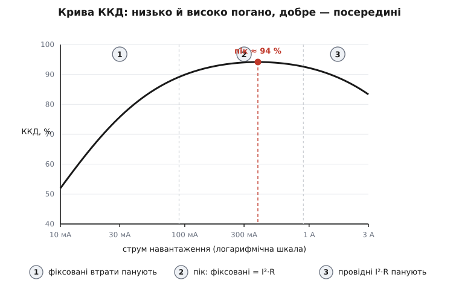
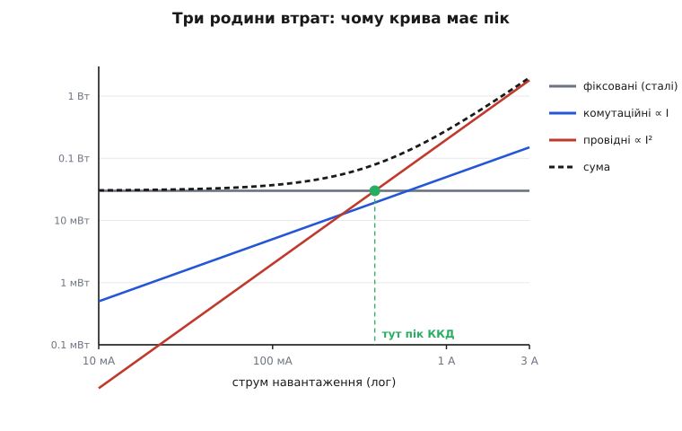
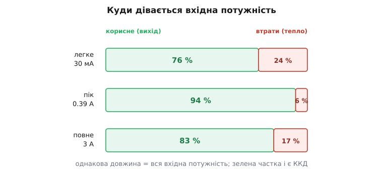

# Крива ефективності перетворювача

<preknowlist>
- [Імпульсний перетворювач](book:electronics/switching-converter) — як ключ, котушка й конденсатор переносять енергію порціями, а не «спалюють» надлишок; чому в ідеалі це майже без втрат.
- [Втрати перемикання в силових ключах](book:electronics/switching-losses) — енергія, що гине на кожному вмиканні-вимиканні ключа, і чому вона росте з частотою.
- [Силовий ключ](book:electronics/mosfet-power-switch) — опір відкритого каналу R_ds(on) і провідні втрати I²·R на ньому.
</preknowlist>

Виробник пише на перетворювачі гордо: «ККД 94 %». Ви ставите його в пристрій, міряєте — виходить 78 %. Ніхто не збрехав: обидва числа справжні, просто зняті за різного струму навантаження. Ефективність (лат. *efficientia*, від *efficere* — «доводити до результату») перетворювача — не одне число, а **крива**: вона повзе вгору на малому струмі, виходить на пологий горб десь посередині й м'яко сповзає донизу під повним навантаженням. Уся інженерія живлення крутиться навколо того, де на цій кривій опиниться саме ваше навантаження.

Щоб зрозуміти форму кривої, досить одного означення й одного питання. Означення: ефективність — це частка вхідної потужності, що дійшла до виходу.

```
η = P_вих / P_вх = P_вих / (P_вих + P_втрат)
```

Оскільки вхід — це вихід плюс усе, що згинуло дорогою, уся гра зводиться до P_втрат. Питання одне: **як втрати залежать від струму?** Відповідь на нього і намалює криву.

## Три родини втрат

Втрати падають на три купки, і кожна по-своєму реагує на струм навантаження — саме ця відмінність і робить криву такою, якою вона є.

**Фіксовані втрати — не залежать від струму зовсім.** Контролер живиться власним струмом спокою I_q незалежно від того, віддає перетворювач міліампер чи три ампери. Драйвер щоразу перезаряджає ємність затвора ключа — це заряд Q_g на кожен цикл, помножений на частоту; скільки ампер тече через сам ключ, драйверові байдуже. Осердя котушки перемагнічується туди-сюди з тією ж частотою. Складіть це — вийде майже стала потужність P_фікс, яку перетворювач з'їдає, навіть коли на виході нічого немає.

**Провідні втрати — ростуть як квадрат струму.** Струм тече крізь відкритий канал ключа з опором R_ds(on), крізь мідь котушки, крізь доріжки й ESR конденсаторів. На кожному опорі гине I²·R. Подвоїли струм — учетверо більше провідних втрат. Це найважливіша купка під навантаженням.

**Комутаційні втрати — десь між ними.** Поки ключ перемикається, він частку наносекунди тримає й напругу, й струм одночасно — і на цьому перекритті гине енергія. За фіксовану частоту такі втрати ростуть зі струмом приблизно лінійно: не так круто, як квадратичні провідні, але й не сталі, як фіксовані.

Отже, три доданки з різним характером:

```
P_втрат(I) = P_фікс  +  k·I   +  R·I²
             (стала)   (лінійна)  (квадратична)
```

## Чому крива має пік

Тепер форма випливає сама. Візьмімо ефективність і подивімося, що діється на кінцях діапазону.



*Той самий перетворювач: зліва фіксовані втрати з'їдають майже все, справа квадратичні провідні тягнуть криву донизу, а найкраще — у горбі посередині.*

**Мале навантаження.** Вихідна потужність P_вих = V_вих·I крихітна, а P_фікс сидить на місці — та сама, що й завжди. Ділимо мале на «мале плюс стала» — виходить жалюгідно: перетворювач витрачає більше на власне життя, ніж віддає навантаженню. Ось чому лівий край кривої лежить низько. Що більший струм — то на більшу порцію корисної роботи розмазується та сама фіксована втрата, і ефективність швидко дереться вгору.

**Велике навантаження.** Тут править I²·R. Провідні втрати ростуть квадратично, а вихід — лише лінійно, тож частка втрат знову збільшується, і крива м'яко сповзає. До того ж R_ds(on) сам росте з температурою: під повним струмом ключ гарячішає, опір ще підповзає — правий край падає трохи крутіше, ніж обіцяв би чистий I²·R.

**Пік — там, де ці двоє зрівнялися.** Ефективність найвища, коли сумарні втрати найменші відносно виходу, а це стається рівно там, де **фіксовані втрати дорівнюють провідним**. Інтуїція проста: на малому струмі домінує стала P_фікс, на великому — квадратична R·I²; десь між ними вони перетинаються, і саме там відношення втрат до виходу проходить мінімум. Прирівнявши P_фікс = R·I², дістаємо струм піка:

```
I_пік = √(P_фікс / R)
```



*Точка, де горизонталь фіксованих втрат перетинає параболу провідних, стоїть рівно під піком кривої ефективності — це той самий струм.*

Це не збіг. Повне виведення оптимуму, з урахуванням і лінійного комутаційного доданка, який трохи зсуває пік ліворуч, — в [окремій виносці](book:electronics/converter-efficiency-curve/math-efficiency-optimum.md).

## Порахуймо

**Умова.** Синхронний [buck-перетворювач](book:electronics/buck) на 3.3 В. Контролер зі своїм оточенням з'їдає сталі P_фікс = 0.030 Вт. Сумарний послідовний опір (два ключі, котушка, доріжки) R = 0.20 Ом. Комутаційний доданок k = 0.05 Вт/А. Порахуймо ККД на трьох струмах.

```
модель:   P_вих = 3.3·I      P_втрат = 0.030 + 0.05·I + 0.20·I²

I = 0.03 А  (легке):
  P_вих   = 3.3 · 0.03               = 0.099 Вт
  P_втрат = 0.030 + 0.0015 + 0.00018 = 0.0317 Вт
  η       = 0.099 / (0.099 + 0.0317) = 75.8 %

I = 0.387 А  (пік, бо √(0.030 / 0.20) = 0.387):
  P_вих    = 3.3 · 0.387             = 1.277 Вт
  провідні = 0.20 · 0.387²  = 0.030 Вт   ← дорівнюють фіксованим!
  P_втрат  = 0.030 + 0.0194 + 0.030 = 0.0793 Вт
  η        = 1.277 / (1.277 + 0.0793) = 94.2 %

I = 3.0 А  (повне):
  P_вих    = 3.3 · 3.0              = 9.90 Вт
  провідні = 0.20 · 9.0     = 1.80 Вт    ← панують
  P_втрат  = 0.030 + 0.15 + 1.80   = 1.98 Вт
  η        = 9.90 / (9.90 + 1.98)  = 83.3 %
```

**Висновок.** Той самий перетворювач: 76 % на 30 мА, 94 % на 0.39 А, 83 % на трьох амперах. Число «94 %» правдиве — але лише в горбі. Занесіть цей чип у пристрій, що дрімає на 30 мА, — і майже чверть того, що береться від джерела, піде теплом у плату, а не в навантаження.



*Кожна смуга — вся потужність, узята від джерела; зелена частка і є ККД. У горбі майже все йде на вихід, на обох кінцях червоної частки помітно більше.*

> 🔧 **Навіщо це.** Даташит показує пік — а живе ваше навантаження. Годинник чи давач, що більшість часу спить на одиницях міліампер, живіть від перетворювача, чий горб зсунуто вліво (малий струм спокою, помірна частота), інакше батарея сяде на власному споживанні контролера. Силовий каскад, що тягне ампери, навпаки хоче низького R_ds(on) — щоб правий край не провалювався. Вибір перетворювача — це підгонка його горба під ваш робочий струм, а не гонитва за найбільшим числом на обкладинці.

## Як зсувають криву

Два кінці кривої псуються з різних причин — і лікуються різними засобами. Це два окремі завдання, не одне.

**Лівий кінець (малий струм) підіймають, прибираючи фіксовані втрати.** Головний прийом — перестати перемикатися даремно. На легкому навантаженні контролер переходить у [режим пропуску імпульсів](book:electronics/pfm-burst-mode): віддає енергію короткими пачками, а між ними майже все вимикає й засинає, лишивши тільки компаратор стежити за просіданням виходу. Частота падає з фіксованих сотень кілогерц до одиниць — і разом з нею гинуть фіксовані втрати на затворі й осерді. Загальна назва прийому — частотно-імпульсна модуляція (PFM), або пропуск циклів; свою реалізацію Linear Technology закріпила під торговою маркою Burst Mode™. Поряд перетворювач природно входить у [переривчастий режим струму котушки](book:electronics/ccm-dcm-boundary), коли струм устигає спасти до нуля між імпульсами. Платня — більші пульсації й змінна частота завад; за неї купуються зайві відсотки ККД саме там, де пристрій проводить більшість життя.

**Правий кінець (великий струм) підіймають, зменшуючи R.** Ставлять ключі з нижчим R_ds(on), товщу мідь, кращу котушку. Ключове рішення — [синхронний випрямляч](book:electronics/sync-rectifier): замість діода, на якому завжди падає 0.3–0.7 В (і гине I·V_діода), ставлять другий MOSFET із опором у міліоми. На десяти амперах це різниця між кількома ватами тепла й часткою вата. Коли й цього мало, струм ділять між кількома паралельними фазами, щоб на кожному ключі текла лише частина — I²·R від того падає квадратично.

## Проти лінійного регулятора

Корисно побачити, з чим порівнюємо. У [лінійного регулятора (LDO)](book:electronics/ldo) ефективність не має горба взагалі — вона просто дорівнює відношенню напруг:

```
η_LDO ≈ V_вих / V_вх
```

Він гасить різницю напруг, як резистор, тож зробити з 12 В рівно 3.3 В означає викинути майже три чверті енергії теплом — хоч на міліампері, хоч на ампері. Імпульсний перетворювач саме тому й переміг там, де відношення напруг велике: його крива тримається над 90 % на цілих порядках струму, тоді як LDO приречений цим відношенням. Ціна — складність, котушка й та сама крива з піком, яку доводиться підганяти.

## Де її взяти

Криву не треба виводити щоразу — виробник друкує її в даташиті, зазвичай сімейством ліній для різних вхідних напруг. Але свій пристрій, свою котушку й свою розводку варто **зміряти самому**: [прогін електронним навантаженням](book:electronics/converter-measure) від міліампер до максимуму дає вашу власну криву, і вона майже завжди трохи нижча за даташитну, бо там ідеальна плата. І пам'ятайте, куди діваються всі ці втрати: вони стають теплом, тож правий, високострумний край кривої — це водночас **тепловий** край. Кожен ват втрат, помножений на [тепловий опір](book:physics/thermal-resistance) переходу, дає підвищення температури кристала; часто перетворювач упирається не в електрику, а в те, що більше тепла нікуди дівати. Хто хоче побудувати всю криву з коефіцієнтів або, навпаки, витягти P_фікс, k і R із трьох виміряних точок — [невеликий код](book:electronics/converter-efficiency-curve/proj-efficiency-model.md) робить і те, і те.

Крива ефективності — це відбиток бюджету втрат перетворювача, згорнутий в одну лінію. Низький лівий край кричить «забагато фіксованих втрат», спад праворуч — «завеликий I²·R», а горб між ними стоїть рівно там, де ці двоє зрівнялися. Навчившись читати цю лінію на своєму робочому струмі, ви за секунду бачите те, чого жодне одне число на обкладинці не скаже.
