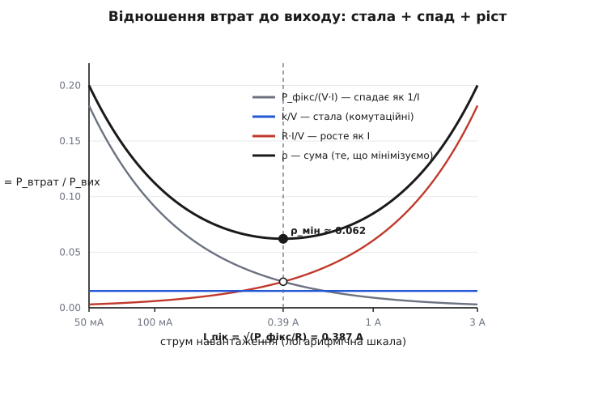
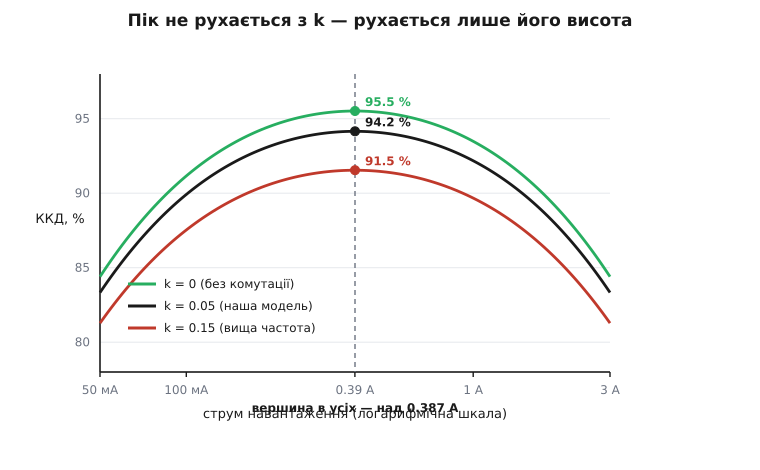

# 🧮 Струм піка: строге виведення оптимуму

Пік ефективності стоїть там, де фіксовані втрати зрівнялися з провідними, і струм цього піка дорівнює √(P_фікс / R). Так стверджує око, що дивиться на графік втрат. Тут ми це доведемо — з нуля, з похідної — і дорогою наштовхнемося на річ, яку око не помічає: **лінійний комутаційний доданок k·I, попри всю свою присутність у бюджеті втрат, не має жодного голосу в тому, ДЕ опиниться пік. Тільки в тому, як високо він дістане.** Це не наближення й не збіг — це випадає з алгебри саме собою, і варто побачити, чому.

## Означення: максимум ККД — це мінімум відношення

Ефективність визначена як частка вхідної потужності, що дійшла до виходу. Перепишімо її так, щоб струм навантаження не ховався в двох місцях одразу:

```
η = P_вих / (P_вих + P_втрат) = 1 / (1 + P_втрат/P_вих)
```

Уся залежність від струму тепер сидить в одному відношенні — ρ ≡ P_втрат/P_вих. І η — **строго спадна** функція цього ρ: що більша частка втрат на кожен ват виходу, то нижчий ККД, монотонно, без винятків. Звідси проста, але звільняльна думка: **шукати максимум η — те саме, що шукати мінімум ρ.** Максимізувати дріб із струмом і в чисельнику, і в знаменнику незручно; мінімізувати відношення втрат до виходу — легко, бо воно, як зараз побачимо, розпадається на доданки, кожен зі своєю простою долею.

> 🔧 **Навіщо це.** Переходом до ρ ми не спрощуємо арифметику заради арифметики — ми розплутуємо фізику. У дробі η три родини втрат злиплися в один знаменник і тягнуть криву спільно, годі сказати, чия зараз черга. У відношенні ρ вони роз'їжджаються на окремі, додавані доданки: кожна родина стоїть сама по собі, зі своїм показником степеня струму. Мінімум суми таких доданків читається з першого погляду — і читається як баланс двох сил, а не як безлика точка на кривій.

## Розкладаємо відношення на три долі

Вихідна потужність проста: напругу тримає стабілізація, тож P_вих = V·I, де V = V_вих стале. Втрати — три доданки з брифу теми: стала P_фікс, лінійний комутаційний k·I (енергія [перекриття струму й напруги при перемиканні](book:electronics/switching-losses), помножена на частоту), квадратичний провідний R·I² (тепло на [опорі відкритого каналу R_ds(on)](book:electronics/rds-on) та решті послідовного опору). Поділімо кожен на P_вих = V·I:

```
      P_фікс + k·I + R·I²      P_фікс      k       R·I
ρ(I) = ─────────────────── = ────────  +  ───  +  ─────
           V·I                 V·I          V        V
        (спад як 1/I)       (СТАЛА!)   (ріст як I)
```

Ось воно. Три доданки з трьома різними долями:

- **Перший, P_фікс/(V·I), спадає як 1/I** — гіпербола. На малому струмі він величезний (стала фіксована втрата розмазується на крихітний вихід), на великому — гине. Це він тримає лівий край кривої ККД унизу.
- **Другий, k/V, — стала.** Оце ключ. Ділячи лінійний доданок k·I на лінійний же вихід V·I, струм скорочується начисто — від комутаційних втрат у відношенні лишається **сталий зсув k/V, той самий на будь-якому струмі.** Він піднімає всю чашу ρ на однакову висоту, але не змінює її форми.
- **Третій, R·I/V, росте як I** — пряма з нуля. На великому струмі він панує й тягне праву гілку ρ вгору (а криву ККД — донизу).

Наслідок уже видно, ще до всякої похідної: **форму чаші ρ — а отже, і те, де лежить її дно, — вирішують лише два доданки, спадний 1/I та висхідний I.** Сталий середній доданок піднімає дно, але посунути його вбік не може: додати однакову висоту до кожної точки не зрушить абсцису мінімуму. Комутаційні втрати змінюють, наскільки глибока чаша, — не де вона стоїть.



*Те, що насправді мінімізується. Стала k/V лише піднімає всю чашу; дно стоїть там, де спадна гілка перетинає висхідну — рівно при I = √(P_фікс / R).*

## Мінімум: дві дороги до одного числа

Позначмо, щоб не тягати літери: a = P_фікс/V, b = R/V, c = k/V. Тоді

```
ρ(I) = a/I  +  c  +  b·I
```

і мінімізувати треба лише a/I + b·I, бо c — стала, що на місце мінімуму не впливає. До цього мінімуму ведуть дві дороги, і кожна щось показує.

**Дорога перша — нерівність, без похідних.** Сума «щось поділене на I» плюс «щось помножене на I» має природне дно, і воно бачиться з чистої алгебри. Для будь-яких додатних a, b, I:

```
a/I + b·I − 2·√(a·b) = (√(a/I) − √(b·I))²  ≥  0
```

Праворуч — повний квадрат, він невід'ємний завжди. Отже a/I + b·I ≥ 2·√(a·b), і **рівність — тільки коли квадрат обертається на нуль**, тобто √(a/I) = √(b·I), звідки a/I = b·I. Це і є умова мінімуму: спадний доданок дорівнює висхідному. Розв'яжімо a/I = b·I щодо струму:

```
a/I = b·I   →   I² = a/b   →   I_пік = √(a/b) = √( (P_фікс/V) / (R/V) ) = √(P_фікс / R)
```

Напруга V скоротилася. А сама умова a/I = b·I у первісних величинах читається P_фікс/(V·I) = R·I/V, тобто **P_фікс = R·I²: фіксовані втрати дорівнюють провідним.** Ось звідки береться те правило з ока — воно і є умовою нуля повного квадрата.

**Дорога друга — похідна.** Той самий висновок [через нуль похідної](book:math/extrema), і він потрібен, щоб переконатися, що це саме мінімум, а не якийсь інший критичний струм:

```
dρ/dI = −a/I² + b = 0     →   b = a/I²   →   I² = a/b   →   I_пік = √(a/b) = √(P_фікс / R)

d²ρ/dI² = 2a/I³ > 0   для будь-якого I > 0   →   це справді мінімум (чаша опукла)
```

Зверніть увагу, чого немає в dρ/dI: там немає c. Стала при диференціюванні зникає, тож комутаційний доданок навіть не потрапляє в рівняння на I_пік. Обидві дороги привели до однакового √(P_фікс / R), і обидві однаково байдужі до k.

А наскільки глибоке дно — тобто чому дорівнює найменше відношення втрат — випадає теж одразу. Підставмо мінімум a/I + b·I = 2√(ab) і повернімо сталу:

```
ρ_мін = c + 2·√(a·b) = k/V + 2·√(P_фікс·R)/V = (k + 2·√(P_фікс·R)) / V

η_пік = 1 / (1 + ρ_мін)
```

Ось де сховався k: **у висоті дна, не в його положенні.** Комутаційний доданок додає до ρ_мін рівно k/V — підіймає всю чашу, опускає стелю ККД, — але множник √(P_фікс·R), що задає решту втрат у піку, і сам струм піка від нього не залежать.

## Пік не залежить від k — навіть коли максимізуємо ККД напряму

Можна засумніватися: а раптом байдужість до k — артефакт того, що ми мінімізували відношення, а не саму η? Перевірмо в лоба — продиференціюймо ефективність як є. Нехай η = N/D, де N = V·I, D = V·I + P_фікс + k·I + R·I². Максимум N/D (при додатних N, D) — там, де відносні швидкості зростання чисельника й знаменника зрівнялися, N′/N = D′/D:

```
N′/N = V / (V·I) = 1/I
D′/D = (V + k + 2R·I) / D

1/I = (V + k + 2R·I)/D   →   D = I·(V + k + 2R·I) = V·I + k·I + 2R·I²
```

Але ж D = V·I + P_фікс + k·I + R·I². Прирівняймо два вирази для D:

```
V·I + P_фікс + k·I + R·I²  =  V·I + k·I + 2R·I²
```

Члени V·I і k·I стоять по обидва боки й скорочуються — **k зникає, не лишивши сліду** — а що лишилося, згортається до

```
P_фікс = R·I²      →      I_пік = √(P_фікс / R)
```

Той самий струм, здобутий без жодного трюку з відношенням, прямо з максимуму ККД. Отже це теорема моделі, а не наслідок способу розв'язання: **у межах втрат виду P_фікс + k·I + R·I² лінійний доданок задає, наскільки високий пік, і ніколи — де він.** Проведіть три криві ККД з різним k — вони підуть на різній висоті, але горб у всіх трьох стане над однією й тією ж абсцисою.



*Комутаційна стеля рухається, струм піка — ні. Три перетворювачі з утричі різним k мають вершину над тим самим √(P_фікс / R): k опускає весь горб, але не зсуває його.*

## Порахуймо з числами теми

Візьмімо параметри з умови теми: V = 3.3 В, P_фікс = 0.030 Вт, k = 0.05 Вт/А, R = 0.20 Ом.

```
I_пік = √(P_фікс / R) = √(0.030 / 0.20) = √0.15 = 0.387 А

перевірка балансу:  R·I_пік² = 0.20 · 0.387² = 0.20 · 0.150 = 0.030 Вт = P_фікс  ✓
                    (провідні рівно зрівнялися з фіксованими)

ρ_мін = (k + 2·√(P_фікс·R)) / V = (0.05 + 2·√(0.030·0.20)) / 3.3
      = (0.05 + 2·√0.006) / 3.3 = (0.05 + 0.1549) / 3.3 = 0.2049 / 3.3 = 0.0621

η_пік = 1 / (1 + 0.0621) = 0.9415 = 94.2 %
```

І, для внутрішньої узгодженості, той самий пік через абсолютні потужності: P_вих = 3.3·0.387 = 1.277 Вт, P_втрат = 0.030 + 0.05·0.387 + 0.030 = 0.0794 Вт, η = 1.277/1.356 = 94.2 %. Обидва шляхи сходяться — 0.387 А і 94.2 %, як і в прозі теми.

Зверніть увагу на розклад втрат у самому піку: 0.030 фіксованих, 0.030 провідних, і 0.019 комутаційних посередині. Фіксовані й провідні рівні — це і є умова піка; комутаційні сидять збоку, не впливаючи на положення.

## Чому реальний пік трохи інший

Теорема чиста, але спирається на два припущення, і реальний перетворювач злегка порушує обидва — тому виміряний пік майже завжди трохи лівіший за √(P_фікс / R), а права гілка провалюється крутіше, ніж обіцяла парабола.

**Комутаційний доданок насправді не ідеально лінійний.** k·I — це локальна пряма, підігнана до реальних втрат перемикання; сама енергія за цикл росте зі струмом не строго пропорційно. Погляньмо, що станеться, якщо показник степеня трохи відхилити від одиниці: нехай комутаційні втрати ~ k·I^p. Тоді у відношенні цей доданок дає (k/V)·I^(p−1), і похідна оптимуму стає

```
dρ/dI = −a/I² + (k/V)·(p−1)·I^(p−2) + b = 0
```

При p = 1 середній член обертається на нуль — сталий доданок, пік рівно на √(a/b), як і вивели. Але:

- якщо p > 1 (комутаційні ростуть **над**лінійно — напруга на ключі під час перемикання лишається високою, доки струм росте), середній член додатний і додається до b: ефективний нахил висхідної гілки більший, баланс зсувається на **менший** струм — **пік їде вліво**;
- якщо p < 1 (**під**лінійно) — навпаки, вправо.

p = 1 — це лезо ножа, єдиний показник, за якого доданок не рухає піка зовсім. На практиці високострумний край перемикання радше надлінійний, тож реальний горб сідає трохи нижче за 0.387 А. Величина зсуву — рівно міра того, наскільки крива втрат перемикання відхилилася від прямої (p − 1), не більше.

**R_ds(on) росте з температурою, а температура — зі струмом.** Друге, вагоміше порушення. Ми брали R сталим, та [опір відкритого каналу підповзає з нагрівом](book:electronics/rds-on) — для кремнієвих MOSFET додатний температурний коефіцієнт близько 0.4–0.8 % на градус. А нагрів сам залежить від втрат: перегрів кристала над середовищем ≈ P_втрат · R_θ, де R_θ — [тепловий опір переходу](book:physics/thermal-resistance). Виходить петля з додатним зв'язком: більший струм → більше I²·R → гарячіше → вищий R → ще більше I²·R. Порахуймо, наскільки це кусає, з ілюстративним R_θ = 50 °C/Вт:

```
У піку (I = 0.387 А):  P_втрат ≈ 0.079 Вт  →  ΔT ≈ 0.079 · 50 ≈ 4 °C   (мізер)
Під повним (I = 3 А):  P_втрат ≈ 1.98 Вт   →  ΔT ≈ 1.98 · 50 ≈ 99 °C
        R(гарячий) ≈ 0.20 · (1 + 0.006·99) ≈ 0.32 Ом   (замість холодних 0.20)
        провідні при 3 А ≈ 0.32 · 9 ≈ 2.87 Вт   (замість 1.80 Вт за холодним R)
```

Ось чому правий, високострумний край кривої падає помітно крутіше за чисту I²·R-параболу: під навантаженням R сам виріс наполовину, і квадратичний доданок росте вже швидше, ніж I². А що ефективний R біля робочої точки більший, то й баланс P_фікс = R·I² настає раніше — **пік іще трохи зсувається вліво.** Але зауважте асиметрію: **у самому піку самонагрів мізерний** (кілька градусів), тож холодне √(P_фікс / R) лишається доброю оцінкою положення; спотворюється переважно права гілка, де ват тепла багато. Високострумний край кривої — це водночас тепловий край, і саме там модель зі сталим R найбільше бреше на користь оптимізму.

## Що з цього виносить проєктувальник

Строге виведення дає не лише число, а три важелі, кожен зі своєю адресою:

- **Місце піка залежить лише від ВІДНОШЕННЯ P_фікс/R, не від абсолютних втрат.** Половиньте разом і P_фікс, і R — струм піка не зрушиться (√(P_фікс/R) не змінилось), а вся крива підскочить угору. Дешевший перетворювач з удвічі більшими фіксованими й провідними втратами матиме пік на тому самому струмі, лише нижчий.
- **Щоб поставити пік на свій робочий струм I_роб, підганяйте P_фікс/R = I_роб².** Пристрій, що живе на десятках міліампер, хоче малих P_фікс (низький струм спокою, помірна частота); силовий каскад на амперах — малого R. Це прямо випливає з √(P_фікс/R) = I_роб, і це два різні прийоми на два різні кінці кривої.
- **Комутаційний доданок k — окремий важіль: він задає стелю, а не адресу.** Зменшуючи втрати перемикання, ви піднімаєте весь горб (ρ_мін падає на k/V), майже не рухаючи його вбік. Тому «підняти ККД» і «пересунути пік» — дві незалежні дії, і плутати їх, крутячи частоту в надії посунути горб, — марно: горб стоятиме, де стояв, на √(P_фікс/R), просто трохи вище або нижче.

Пік ефективності — не примха кривої, а корінь простого рівняння P_фікс = R·I², і струм цього кореня, √(P_фікс/R), тримається на балансі рівно двох сил. Усе інше — комутаційна стеля, температурний прогин правого краю — накладається на цей кістяк, зсуваючи пік на дещицю, але не скасовуючи його арифметики.
