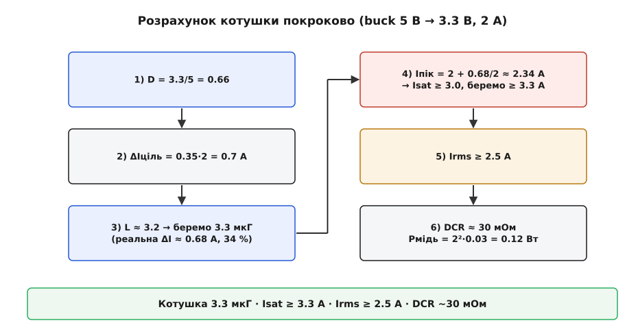

# 🧮 Вибір котушки покроково: наскрізний розрахунок buck 5 В → 3.3 В

> Тут проганяємо весь розрахунок [котушки для перетворювача](book:electronics/converter-inductor) на конкретному вузлі — від першого числа до готового рядка специфікації.

### Означення

Добір котушки — це шість кроків, кожен дає одне число специфікації: **L** (з пульсації), **Isat** (з піка струму), **Irms** (з тривалого струму), **DCR** (з допустимих втрат). Пройдімо їх для типового вузла: buck **5 В → 3.3 В**, навантаження **2 А**, частота **500 кГц**, цільова пульсація **35 %**.

### Інтуїція

Чому саме такий порядок, а не якийсь інший? Бо кожен крок дає число, потрібне наступному, — це не довільний список, а ланцюг залежностей. Почати можна лише з пульсації: вона єдина задана прямо вимогою (ми самі обираємо, який розмах ΔI допускаємо). З неї випливає **індуктивність** — бо саме L визначає, наскільки круто струм наростає за такт. L, своєю чергою, задає форму **трикутника струму** в котушці: середнє значення трикутника — це струм навантаження, а половина розмаху ΔI/2 додається зверху й знизу. Звідси одразу два різні числа: **пік** (середнє + ΔI/2), за яким перевіряють Isat — магнітну межу, і **діюче (RMS)** значення, близьке до середнього, за яким перевіряють Irms — теплову межу. Останнім стоїть **DCR**: він не впливає на форму струму, лише перетворює той самий струм на тепло, тож рахується наприкінці.

Через цю залежність жоден крок не можна пропустити чи переставити: пропустиш пульсацію — не буде L; знехтуєш піком — проґавиш Isat і котушка [насититься на повному навантаженні](book:electronics/converter-inductor); забудеш про RMS — недобереш Irms і котушка перегріється за кілька хвилин роботи. Найчастіше провалюють саме одну зі струмових перевірок, бо обидві ховаються за тим самим словом «струм», а означають різні фізичні межі.

### Формальний апарат: шість кроків


*Наскрізний розрахунок: шпаруватість → цільова пульсація → індуктивність (із перерахунком на стандартний номінал) → пік і Isat → тривалий струм і Irms → DCR і мідні втрати. Унизу — готовий рядок специфікації котушки.*

Тут **шпаруватість** D (англ. *duty cycle* — «робоча частка») — це частка періоду, коли ключ увімкнено; для buck вона дорівнює відношенню вихідної напруги до вхідної.

```
1) Шпаруватість:
     D = Vвих / Vвх = 3.3 / 5 = 0.66

2) Цільова пульсація (30–40 % від навантаження):
     ΔIціль = 0.35 · 2 А = 0.7 А

3) Індуктивність:
     L = (Vвх − Vвих) · D / (ΔIціль · f)
       = (5 − 3.3) · 0.66 / (0.7 · 500·10³)
       = 1.122 / 350000 ≈ 3.2 мкГ      → беремо стандартні 3.3 мкГ
   перерахунок реальної ΔI при 3.3 мкГ:
     ΔI = 1.122 / (3.3·10⁻⁶ · 500·10³) ≈ 0.68 А  (34 % — у вікні ✓)

4) Пік струму → Isat (магнітна межа):
     Iпік = Iнаван + ΔI/2 = 2 + 0.68/2 ≈ 2.34 А
     Isat ≥ Iпік · 1.3 ≈ 3.0 А          → беремо Isat ≥ 3.3 А

5) Тривалий струм → Irms (теплова межа):
     Iнаван(rms) ≈ 2 А                   → беремо Irms ≥ 2.5 А

6) DCR → мідні втрати:
     DCR ≈ 30 мОм
     Pмідь = Iнаван² · DCR = 2² · 0.03 = 0.12 Вт
```

**Результат:** котушка **3.3 мкГ**, **Isat ≥ 3.3 А**, **Irms ≥ 2.5 А**, **DCR ~30 мОм** — і [екранована, якщо поряд радіо](book:electronics/converter-inductor).

### Звідки беруться запаси

У розрахунку три «магічні» числа — 35 % пульсації, множник 1.3 на Isat і +0.5 А на Irms. Жодне з них не випадкове, і варто розуміти, що стоїть за кожним.

**Пульсація 30–40 %.** Це компроміс, а не закон. Більша пульсація означає меншу L (отже, дрібнішу й дешевшу котушку), але водночас вищий пік струму (треба більший Isat) і більші втрати в осерді (∝ ΔI). Менша пульсація — навпаки: котушка спокійніша, зате більша й дорожча. Вікно 30–40 % — це точка, де ці тиски приблизно врівноважені; 35 % беруть як зручну середину. Поза вікном теж працює, просто плата за крайнощі росте.

**Множник 1.3 на пік.** Запас 30 % понад піковий струм покриває одразу кілька «брехень» паспорта. Перша: Isat у даташиті — це вже точка, де L впала на 10–30 %, тобто початок обриву, а не його дно. Друга: Isat **падає з нагрівом**, тож гаряча котушка насичується за меншого струму, ніж обіцяє паспорт при 25 °C. Третя: кидок струму при старті чи стрибку навантаження на мить перевищує розрахунковий пік. Запас 1.3 тримає робочу точку в пласкій частині кривої з оглядкою на всі три.

**Запас на Irms.** Тут запас скромніший (2 А → 2.5 А, тобто +25 %), бо теплова межа «прощає» куди легше за магнітну: перевищення Irms означає лише поступовий перегрів, а не миттєвий обвал. Проте нехтувати ним не можна — паспортний Irms часто дають для нагріву на +40 °C над **кімнатними** 25 °C, а в нагрітому корпусі дрона чи блока та сама розсіяна потужність дасть вищу абсолютну температуру. Запас лишає котушці місце дихати в реальному, а не лабораторному оточенні.

### Що робить розрахунок чесним

Кілька зауваг, без яких числа збрехали б. По-перше, **найгірший Vвх**: тут Vвх ≈ 5 В фіксований (USB), але якщо він має розкид (5 В ± 5 %), пульсацію рахують за [**максимальним** Vвх](book:electronics/converter-spec), де вона найбільша. Чому за максимальним? Бо в buck розмах пульсації росте з різницею (Vвх − Vвих): що більший вхід, то крутіше струм наростає за такт, то ширший трикутник — а отже, вищий пік. Порахуєш за номінальним входом — занизиш пік і недобереш Isat саме тоді, коли мережа віддає верхню межу.

По-друге, **гарячий Isat**: паспортний Isat при 25 °C на робочій температурі нижчий, тож запас 1.3 беруть саме від [гарячого значення](book:electronics/converter-inductor). По-третє, **DCR теж росте з нагрівом**: опір міді збільшується приблизно на 0.4 % на кожен градус, тож гаряча обмотка (скажімо, +60 °C над кімнатою) має DCR відсотків на чверть вищий за паспортний — і мідні втрати разом із ним. Реальний нагрів завжди трохи більший за наївний розрахунок при 25 °C. По-четверте, **перевірка кривими**: остаточно котушку звіряють не із заголовним числом, а з кривими L(I) і нагріву в даташиті, бо різні виробники визначають «номінальний струм» по-різному — хтось за нагрівом +40 °C, хтось +20 °C; два числа «4 А» можуть означати геть різні котушки.

І остання пастка цього розрахунку — **округлення L не в той бік**. Стандартний номінал беруть **угору** від обчисленого (3.2 → 3.3 мкГ), а не вниз: більша L дає меншу пульсацію, тобто запас іде в безпечний бік. Узяти найближчий номінал **донизу** (скажімо, 2.7 мкГ) — означає мовчки збільшити ΔI понад розрахунок, а з ним і пік струму, і ризик насичення. Тож із двох сусідніх стандартних значень для котушки перетворювача майже завжди обирають більше.

### Від числа до реальної кривої

Маючи рядок специфікації, котушку ще треба знайти в каталозі — і тут заголовні числа лише звужують пошук, а вирішують **графіки**. Для нашого прикладу відкриваємо два:

- **L від струму.** Ведемо вертикаль від нашого піка 2.34 А й дивимося, де вона перетинає криву. Якщо в цій точці L ще тримається біля номіналу (впала менш ніж на 10 %) — котушка в пласкій зоні, запас є. Якщо крива вже хилиться вниз — пік сидить на схилі насичення, і таку котушку відкидаємо, навіть якщо її паспортний Isat формально «більший за 3.3 А» (бо той Isat міг бути взятий за 30-відсотковим падінням).
- **Нагрів від струму.** Ведемо вертикаль від тривалих 2 А й читаємо обіцяний приріст температури. Якщо виходить, скажімо, +30 °C — додаємо це до робочої температури корпуса й перевіряємо, чи лишаємося в межах матеріалу. Саме ця крива, а не заголовний Irms, каже правду про теплову поведінку.

Дві котушки з однаковим рядком специфікації можуть мати помітно різні криві — тому остаточний вибір завжди за графіком, а число в таблиці лише відсіює явно непридатне.

Цей самий шестикроковий розрахунок працює для будь-якого [buck](book:electronics/buck) — міняються лише числа. Формула пульсації (крок 3) спирається на [вибір L за пульсацією](book:electronics/buck/math-inductor-ripple.md); пік і дві межі — на [добір котушки](book:electronics/converter-inductor); а DCR-втрати ведуть до [теплової перевірки готового вузла](book:electronics/converter-measure). Так одна котушка проходить шлях від рядка ТЗ до перевіреного компонента.
