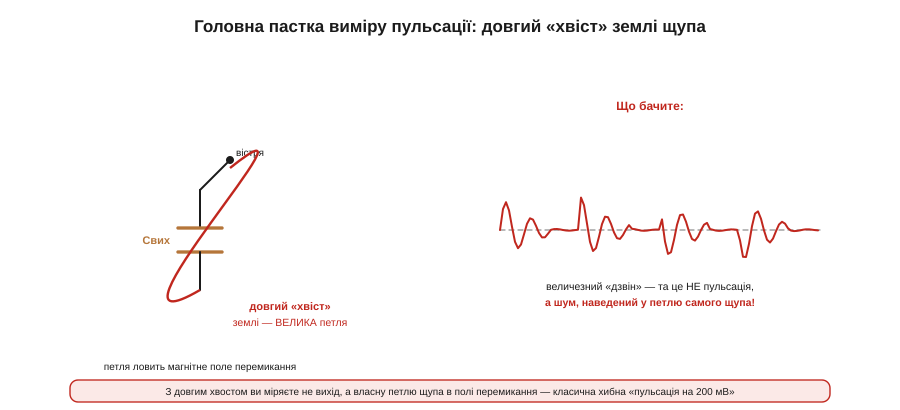
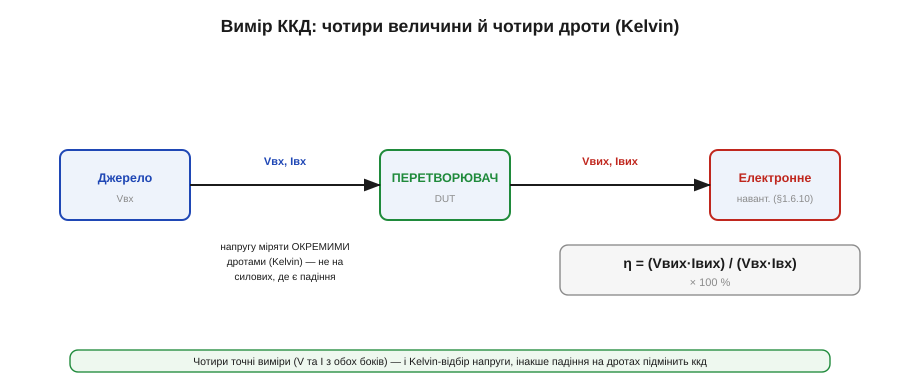

# Вимірювання: пульсації правильно, ККД, теплова карта

Перетворювач зібрано — час **довести**, що він відповідає [технічному завданню](book:electronics/converter-spec). Та вимірювання живлення підступне: поміряєш неправильно — і обдуриш сам себе, побачивши або неіснуючу проблему, або неіснуюче благополуччя. Розберімо три головні виміри — пульсацію (її найлегше зміряти хибно), ккд (його міряють сіткою, а не однією точкою) і теплову карту — а тоді **замкнемо коло**, звіривши кожне число з відповідним рядком ТЗ.

### Пульсація: пастка «хвоста» щупа

Найчастіша помилка всього курсу вимірювань — міряти пульсацію виходу звичайним щупом з довгим **«хвостом»** землі (тим дротиком із крокодилом).


*Рис. Довгий земляний «хвіст» щупа утворює велику петлю просто в полі перемикання. Ця петля ловить магнітне поле гарячого вузла комутації — і на екрані з'являється величезний «дзвін». Та це не пульсація виходу, а шум, наведений у петлю **самого щупа**. Класична хибна «пульсація на 200 мВ».*

Механізм такий самий, як у [гарячої петлі розводки](book:electronics/converter-layout), тільки тепер петлю робите **ви** своїм щупом. Довгий хвіст плюс вістря утворюють велику рамку; ви підносите її до перетворювача, де гуляє потужне змінне магнітне поле перемикання, — і це поле наводить у рамці напругу (закон індукції). На екрані — гострий дзвін на десятки чи сотні мілівольт, який лякає новачка. Та якщо прибрати щуп подалі від плати, «пульсація» зменшиться — певна ознака, що ви міряли не вихід, а власну антену.

### Правильно: пружинка просто на виводах

Лік один — **прибрати петлю щупа**. Замість крокодила на хвості беруть **пружинку** (*spring tip*) на [щуп осцилографа](book:electronics/oscilloscope): знімають пластиковий обідок щупа, оголюючи кільце землі поряд із вістрям, і притискають вістря та пружинку **прямо до двох виводів** вихідного конденсатора.


*Рис. Пружинка робить петлю щупа крихітною й притискає його прямо до виводів Cвих — туди, де живе справжня пульсація. На екрані лишається маленька правдива хвиля. Додатково: міряти на самих виводах конденсатора, увімкнути AC-зв'язок (прибрати постійні 5 В) і обмежити смугу осцилографа (≈20 МГц), щоб голки фронтів не маскували пульсацію.*

З крихітною петлею наведення зникає, і ви бачите **справжню** пульсацію — ту маленьку хвилю, що її задають [ємність і ESR вихідного конденсатора](book:electronics/converter-caps). Кілька додаткових правил: міряти саме на **виводах** вихідного конденсатора (а не десь на доріжці); увімкнути **AC-зв'язок** осцилографа, щоб прибрати постійні 5 В і розтягнути дрібну пульсацію на весь екран; і **обмежити смугу** осцилографа (типово 20 МГц), щоб гострі високочастотні голки фронтів перемикання не маскували саму пульсацію.

Чому саме обмеження смуги, а не «що ширша, то правдивіша»? Бо справжня пульсація, яку бачить навантаження, живе на частоті комутації (сотні кГц) і її перших гармоніках — це повільна хвиля. А гострі голки на фронтах перемикання сягають сотень мегагерц і навіть гігагерців; на повній смузі осцилограф покаже їх велетенськими, і вони замаскують саму пульсацію, хоч навантаженню до них байдуже (вони не «доходять» крізь індуктивності й гасяться локально). Тому стандарт виміру пульсації — смуга ≈20 МГц: вона лишає реальну хвилю й відрізає оманливі голки. Лише після всього цього виміряне число можна чесно звіряти з ТЗ.

> 🔧 **Навіщо це.** Якщо ваша «пульсація» залежить від того, як ви тримаєте щуп, — ви міряєте щуп, а не схему. Перш ніж лякатися дзвону на виході, поставте пружинку й приберіть хвіст: дев'ять із десяти «жахливих пульсацій» зникають разом із петлею щупа. Це перше, що перевіряють, побачивши підозріло великий шум.

### ККД: чотири величини й Kelvin

Другий вимір — **коефіцієнт корисної дії**. Тут формула очевидна, а пастка — у точності.


*Рис. ККД = (Vвих·Iвих)/(Vвх·Iвх). Потрібні чотири точні виміри — напруга й струм з обох боків. Напругу беруть **окремими** дротами (Kelvin) прямо на клемах, а не на силових, де є падіння: інакше втрати на дротах вліплять у результат і ккд вийде хибним. Навантаження задає електронне навантаження.*

```
η = Pвих / Pвх = (Vвих · Iвих) / (Vвх · Iвх) × 100 %
```

Потрібні **чотири** виміри: Vвх, Iвх, Vвих, Iвих. І головна тонкість — **Kelvin-відбір напруги** (як у [правильній розводці](book:electronics/converter-layout) для кола зворотного зв'язку): напругу міряють окремими тонкими дротами **прямо на клемах** перетворювача, а не на тих самих товстих дротах, що несуть струм. Бо на силових дротах є падіння (I·R), і якщо зміряти напругу на них, ви приплюсуєте втрати **дротів** до втрат перетворювача — і ккд вийде заниженим і неправдивим. Струм же задають **електронним навантаженням**, що вміє тримати точний струм у заданій точці.

Є й тонші пастки ккд. По-перше, **прогрів**: гарячий перетворювач має інший ккд, ніж холодний (опори ростуть із температурою), тож читають усталене значення, давши вузлу прогрітися, а не одразу після ввімкнення. По-друге, **власне споживання** контролера (струм спокою, Iq): на малому навантаженні навіть кілька міліампер, що чип їсть на себе, помітно з'їдають ккд — і це чесна частина виміру, а не похибка. По-третє, **точність приладів**: ккд — це різниця двох близьких потужностей, тож похибка вимірювача струму прямо лягає в результат; для пристойного виміру беруть точні шунти чи ватметри, а не «приблизний» мультиметр.

> 🔌 **Інструмент у вставці.** Що таке електронне навантаження, його режими (CC/CR/CP) і навіщо воно поруч із лабораторним БЖ — у компонентній вставці [🔌 Електронне навантаження](book:electronics/converter-measure/comp-electronic-load.md).

### Сітка точок навантаження

Одне число ккд нічого не варте: ккд **залежить від навантаження** (крива ефективності [понижувального перетворювача](book:electronics/buck) не плоска). Тому міряють **сітку**.


*Рис. Електронним навантаженням проходять сітку струмів (і кілька значень Vвх) — і будують криву ккд від навантаження. Видно і провал на малому струмі, і максимум посередині. Кожну вимогу ТЗ перевіряють у відповідній точці, а не лише в одній зручній.*

Беруть кілька значень Iвих (скажімо, 0.1, 0.3, 1, 2, 3 А) і для кожного — кілька значень Vвх (мінімум, номінал, максимум), у кожній точці заміряючи ккд. Виходить **крива** (чи родина кривих), що показує і провал ефективності на малому навантаженні, і максимум посередині, і поведінку на краях входу. Лише така карта дозволяє чесно сказати «ккд ≥ 90 % @ 3 А і ≥ 80 % @ 0.3 А» — обидва числа з ТЗ перевірені у своїх точках. Прогнати таку сітку вручну марудно, тому її **автоматизують**.

> ⚙️ **Автоматизація у вставці.** Як скриптом прогнати сітку Vвх × Iвих програмованим навантаженням і зібрати криву ккд автоматично — в алгоритмічній вставці [⚙️ Автоматизація вимірів ККД](proj-efficiency-sweep.md).

### Теплова карта

Третій вимір — **тепло**. Усі пораховані втрати (ключі, котушка, конденсатори) десь виділяються, і треба переконатися, що жодна деталь не перегрівається.


*Рис. Тепловізором (чи термопарою по точках) знімають карту нагріву: видно гарячі ключі, теплу котушку, вхідний конденсатор. Кожну деталь звіряють із її межею — і обов'язково в НАЙГІРШОМУ режимі: максимальне навантаження, максимальний Vвх, гаряче довкілля (Tамб із ТЗ).*

**Тепловізор** дає карту відразу: видно, що найгарячіше (зазвичай ключі), що тепле (котушка, вхідний конденсатор), що холодне. Де тепловізора нема — міряють **термопарою** по точках. Два нюанси самого виміру: по-перше, дати вузлу вийти на **усталений** тепловий режим (нагрів сповзає кілька хвилин, поки не врівноважиться), а не читати одразу; по-друге, тепловізор бреше на блискучих металевих корпусах (низька випромінність), тож ключі чи екран котушки інколи здаються холоднішими, ніж є, — тоді покривають їх матовою фарбою чи звіряють термопарою. Головне — два правила. По-перше, кожну деталь звіряють із **її** межею: ключі проти своєї максимальної температури, котушка проти своєї, конденсатор проти своєї (а [електролітичний конденсатор у спеку](book:electronics/converter-caps) — слабка ланка). По-друге, міряти треба в **найгіршому режимі**: максимальне навантаження, максимальний Vвх (де найбільші втрати), за максимальної температури довкілля з ТЗ. Деталь, що ледь тепла на столі за 25 °C і малого струму, може перегрітися в закритому корпусі за 60 °C на повному газі.

### Перехідний процес і пуск: що ще зняти

Три головні виміри — не все. **Перехідний процес** (відгук на стрибок навантаження, що його задає [зворотний зв'язок і стабільність петлі](book:electronics/feedback-stability)) знімають так: електронне навантаження з швидким фронтом (або MOSFET, що вмикає резистор) різко стрибає зі скромного струму на повний, а осцилограф ловить провал виходу. Дивляться глибину провалу й час відновлення — і чи нема дзвону. **Пуск** перевіряють окремо: вмикають живлення й дивляться, як вихід плавно піднімається (м'який старт) без перельоту, а вхід — без надмірного кидка струму (інраш). Корисно глянути й **вимкнення**: чи не дає вузол викидів, коли його знеструмлюють.

І ще один вимір — **здоров'я розводки**. Той самий щуп із пружинкою чіпляють до вузла перемикання SW і дивляться на фронти: помірний викид — норма, а величезний дзвін видає завелику [гарячу петлю розводки](book:electronics/converter-layout). Так осцилограф стає не лише приладом звірки з ТЗ, а й діагностом самої плати: за формою на SW видно, добре чи погано вона розведена.

### Замкнути коло: звірка з ТЗ

І ось навіщо все це: вимірювання має сенс лише як **звірка з ТЗ**. Кожен рядок [специфікації перетворювача](book:electronics/converter-spec) має бути підтверджений числом.


*Рис. Коло проєктування замикається: ТЗ → проєкт → вимір → підтвердження. Пульсація ≤ 50 мВ — зміряна пружинкою (32 мВ ✓); ккд ≥ 90 % — із сітки (92 % ✓); перехідний ≤ 150 мВ — стрибком навантаження (120 мВ ✓); нагрів ≤ +40 °C — з теплової карти (+35 °C ✓). Не зійшлося — назад на доопрацювання.*

Так замикається все коло проєктування: **ТЗ → проєкт → вимір → підтвердження**. Беремо [специфікацію](book:electronics/converter-spec) рядок за рядком і ставимо проти кожного виміряне число: пульсація — пружинкою, ккд — сіткою, перехідний процес — стрибком навантаження, нагрів — тепловою картою. Якщо всі рядки зійшлися — вузол готовий. Якщо якийсь ні — повертаємося на доопрацювання (інша котушка, більший конденсатор, краща розводка) і міряємо знову. Без цієї звірки проєкт не завершено: «начебто працює» — це не «відповідає ТЗ».

І останнє, що вирізняє інженера, — **чесність виміру**. Спокусливо знайти зручну точку, де все добре, і відзвітувати нею; але ТЗ задає **найгірший** випадок, тож і міряти треба там, де найважче: максимальне навантаження для нагріву, максимальний Vвх для пульсації струму, мінімальний — для здійсненності, гаряче довкілля для теплової карти. Вузол, що проходить ТЗ у найгіршому куті, працюватиме скрізь; вузол, «перевірений» лише в зручній точці, підведе в полі. Міряйте те, що є, а не те, що хочеться побачити, — і записуйте чесно, навіть коли число не подобається.

> 🔧 **Навіщо це.** Вимір без ТЗ — це цифри в нікуди. Завжди міряйте **проти специфікації**: не «яка тут пульсація?», а «чи ≤ 50 мВ, як вимагає ТЗ?». Так ви одразу бачите, готовий вузол чи ні, і де саме він не дотягує. Це й перетворює купу осцилограм на інженерний висновок «придатний / непридатний».

### Підсумок теми

Зібраний перетворювач **вимірюють**, щоб довести відповідність ТЗ, — і самі виміри мають пастки. **Пульсацію** міряють пружинкою прямо на виводах Cвих (а не довгим хвостом щупа, що ловить власну петлю в полі перемикання), з AC-зв'язком і обмеженою смугою. **ККД** = (Vвих·Iвих)/(Vвх·Iвх) рахують із чотирьох точних вимірів і Kelvin-відбором напруги, а беруть його **сіткою** точок Vвх × Iвих (електронним навантаженням), будуючи криву, а не одне число. **Теплову карту** знімають тепловізором у найгіршому режимі й звіряють кожну деталь із її межею. Окремо знімають перехідний процес, пуск і навіть здоров'я розводки (за дзвоном на SW), а міряти все це належить **чесно й у найгіршому куті**, а не в зручній точці. А головне — усе це **звіряють із кожним рядком ТЗ**, замикаючи коло «ТЗ → проєкт → вимір → підтвердження»: не зійшлося — назад на доопрацювання. Лише така звірка перетворює купу осцилограм на інженерний висновок «придатний / непридатний» і доводить, що спроєктований перетворювач справді відповідає своєму завданню.

---
