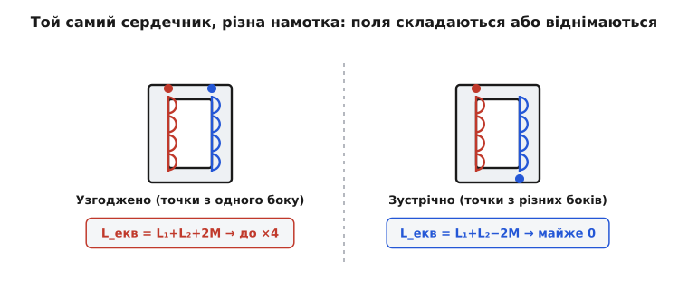
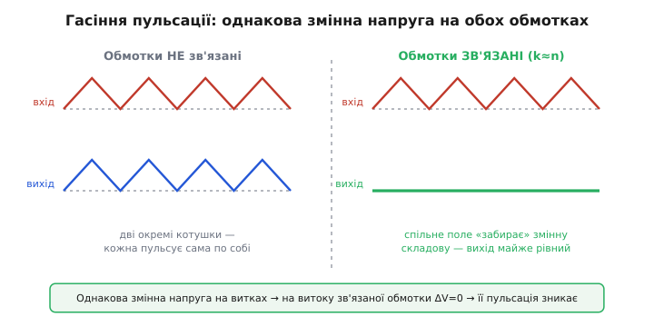
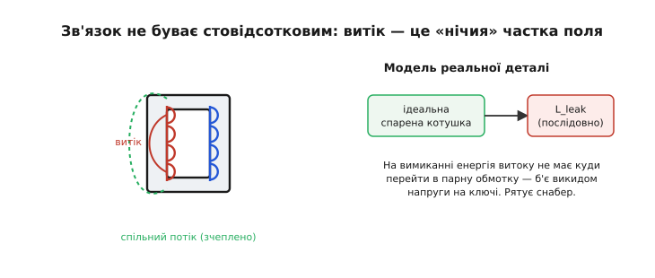

# Спарені котушки: взаємоіндукція в перетворювачах

Візьміть дві котушки й намотайте їх на **одне** осердя. Здавалося б, дрібниця — але цим одним рухом ви даєте перетворювачеві три здатності, яких у нього не було з окремими котушками: **запасати** енергію й віддавати її крізь ізоляційний бар'єр, **зганяти** пульсацію струму з однієї шини на іншу, і **живити кілька виходів** з одного магніту. Усі три виростають з одного явища — **взаємоіндукції** (*mutual inductance*): коли поле однієї обмотки пронизує сусідку, вони перестають бути незалежними й починають ділити струм, енергію й напругу за спільними правилами.

Спарена котушка (*coupled inductor*) — це не трансформатор у звичному розумінні. Мережевий [трансформатор](topic:electronics/mutual-inductance) передає енергію **наскрізь і миттєво**: скільки зайшло в первинну, стільки в ту ж мить вийшло з вторинної, а сам він майже нічого не запасає. Спарена ж котушка в імпульсному перетворювачі часто робить прямо протилежне — **накопичує** енергію в осерді в одній фазі й **віддає** в іншій, як звичайна [котушка](topic:electronics/inductor-coil), тільки з двома виводами замість одного. Ця відмінність — накопичення проти наскрізної передачі — і є ключ до всього, що нижче.

> 🔧 **Навіщо це.** На платі перетворювача спарену котушку впізнають за **чотирма** (чи більше) виводами замість двох у звичайного дроселя й за позначкою полярності — крапкою біля одного виводу кожної обмотки. Побачивши таку деталь, одразу знаєш: тут не просто накопичувач, а вузол, де дві обмотки навмисне зв'язані — заради ізоляції, гасіння пульсації чи кількох виходів. Плутати її зі звичайною котушкою не можна: увімкнувши обмотки не в тому напрямку, легко дістати замість ×4 індуктивності майже нуль.

### Одна деталь — три ролі

Перш ніж занурюватись, окиньмо оком, **навіщо** взагалі зв'язувати котушки. Одна фізична деталь — дві обмотки на спільному сердечнику — служить трьом різним цілям, і кожна варта окремої розмови.


*Та сама деталь у трьох ролях. Ліворуч — накопичувач: осердя з зазором копить енергію в одній фазі й віддає в іншій (серце [flyback](book:electronics/flyback-isolated)). Посередині — керування пульсацією: спільне поле «зганяє» змінну складову струму з однієї обмотки в іншу (SEPIC, [Ćuk](book:electronics/cuk-converter)). Праворуч — багатовихідне живлення: один магнітний потік наводить кілька напруг, по обмотці на шину. Різні задачі — а деталь одна.*

Спільне в усіх трьох — те, що дві обмотки **бачать один потік**. Різне — що ми з цим потоком робимо: запасаємо в ньому енергію, гасимо через нього пульсацію чи знімаємо з нього кілька напруг. Розберімо спершу саму механіку зв'язку, а тоді пройдемо по ролях.

### Крапка вирішує все: поля складаються чи гасяться

Почнімо з найголовнішого й найпідступнішого — з **напрямку** намотки. Дві обмотки на спільному осерді можна намотати так, що їхні поля **складаються**, а можна так, що **віднімаються**. Різниця колосальна, а на схемі її позначає одна крихітна деталь — **крапка полярності** (*dot convention*: крапка біля виводу означає, що струм, який **втікає** в позначений вивід, додає потоку в осерді).

Чому це так важить? Індуктивність котушки бере свою величину з магнітного поля, яке струм створює в осерді. Якщо друга обмотка своїм струмом **підсилює** це поле, вона ніби додає котушці ще й свою індуктивність плюс подвоєний зв'язок; якщо **гасить** — забирає його.


*Дві однакові обмотки на спільному осерді. Ліворуч (крапки з одного боку, поля складаються): якщо з'єднати їх послідовно-узгоджено, ефективна індуктивність L₁+L₂+2M — при рівних тісно зв'язаних обмотках це аж ×4 від однієї. Праворуч (крапки з різних боків, поля гасяться): L₁+L₂−2M — при тісному зв'язку майже нуль. Одна й та сама пара котушок, різниця лише в напрямку намотки — а індуктивність відрізняється в рази.*

Кількісно взаємну «допомогу» вимірює **взаємна індуктивність** M, зв'язана з власними індуктивностями через **коефіцієнт зв'язку** k (наскільки повно поле однієї обмотки пронизує іншу; k від 0 до 1):

```
M = k · √(L₁ · L₂)
```

І тоді послідовне з'єднання двох обмоток дає:

```
узгоджено (поля складаються):  L_екв = L₁ + L₂ + 2M
зустрічно  (поля гасяться):    L_екв = L₁ + L₂ − 2M
```

Для двох однакових обмоток (L₁ = L₂ = L) з ідеальним зв'язком (k = 1, тобто M = L) узгоджене з'єднання дає L + L + 2L = **4L**, а зустрічне — L + L − 2L = **0**. Одна пара котушок, а індуктивність гуляє від нуля до чотирикратної — залежно **лише** від того, з якого боку крапка.

> 🔧 **Навіщо це.** Ось чому в спареній котушці не можна плутати виводи. Переплутавши напрямок однієї обмотки, ви замість накопичувача з великою індуктивністю дістанете майже коротке замикання для змінного струму — і перетворювач або не запуститься, або спалить ключ струмовим кидком. У даташиті спареної котушки завжди є **схема виводів із крапками**; на платі їх треба з'єднувати рівно так, як велить топологія. Це та сама [дотова конвенція](topic:electronics/dot-convention), що керує будь-якими зв'язаними обмотками.

Оце керування «складати чи гасити» і є фізична основа всіх трьох ролей. У накопичувачі обмотки вмикають так, щоб у робочій фазі одна мовчала, поки інша працює. У гасінні пульсації — так, щоб змінні складові струму взаємно віднімались. Розберімо по черзі.

### Роль перша: накопичувач через бар'єр (flyback)

Найвідоміша спарена котушка ховається в кожному зарядному «кубику» — це трансформатор [зворотноходового (flyback) перетворювача](topic:electronics/flyback-isolated). Слово «трансформатор» тут оманливе: він **не** передає енергію наскрізь, як мережевий. Він її **накопичує**.

Погляньмо, як він працює, очима двох фаз. Коли ключ **замкнено**, до первинної обмотки прикладено вхідну напругу, струм у ній лінійно росте, і осердя **набирає** [магнітну енергію](topic:electronics/inductor-energy) ½·L·I². Обмотки намотані так (за крапками), що вторинний діод у цю мить **закритий** — енергія копиться, назовні не виходить. Коли ключ **розмикається**, струм первинної урвано, але запасена в осерді енергія мусить кудись подітися — і вона «відлітає» у вторинну обмотку, відкриває її діод і вливається у вихід. Запасли в одній обмотці — віддали через іншу.

Дві речі роблять цей накопичувач особливим. Перша — **осердя з зазором**. Звичайний трансформатор передає енергію миттєво й сам майже нічого не запасає; якби він спробував накопичувати, його осердя швидко б [насичувалося](topic:electronics/converter-inductor). Flyback же **мусить** накопичувати, тож у його осердя навмисне вставляють **повітряний зазор** — і парадоксально, але саме в цьому проміжку живе більшість запасеної енергії. Зазор перетворює трансформатор на котушку з двома обмотками. Друга особливість — **гальванічна розв'язка**: між первинною й вторинною обмотками немає ані дроту, лише магнітний зв'язок крізь осердя. Тому небезпечні сотні вольтів мережі лишаються «по той бік», а безпечні 5 В — «по цей». Той самий магнітний зв'язок, що переносить енергію, водночас будує ізоляційну стіну.

І ще один задарма отриманий важіль: розрізавши котушку на дві обмотки з **різним** числом витків, ми дістаємо **коефіцієнт витків** Ns/Np — груба шкала напруги, якої нема в простих [buck](topic:electronics/buck) чи [boost](topic:electronics/boost). Мало витків вторинної — велике зниження (325 В мережі → 5 В одним магнітом); багато — підвищення. Це та сама [взаємоіндукція й трансформація](topic:electronics/mutual-inductance), тільки поставлена на службу накопиченню, а не наскрізній передачі.

**Приклад (спарена котушка як накопичувач).** Flyback має первинну індуктивність Lp = 400 мкГ, працює на fsw = 100 кГц зі шпаруватістю D = 0.4 від Vвх = 24 В. Скільки енергії осердя запасає й віддає щоцикл? Спершу — піковий струм первинної наприкінці фази ВКЛ (струм росте від нуля за законом di/dt = V/L):

```
tвкл = D / fsw = 0.4 / 100000 = 4.0 мкс
Iпік = Vвх · tвкл / Lp = 24 · 4.0e-6 / 400e-6 = 0.24 А
E    = ½ · Lp · Iпік² = 0.5 · 400e-6 · 0.24² = 1.15e-5 Дж = 11.5 мкДж
```

Ці 11.5 мкДж осердя набирає у фазі ВКЛ і повністю віддає у вторинну у фазі ВИКЛ. Помножмо на частоту — дістанемо передану потужність:

```
P = E · fsw = 11.5e-6 · 100000 ≈ 1.15 Вт
```

Ось де ховається обмеження flyback за потужністю: осердя мусить **вмістити всю** передану за цикл енергію, а магнітної енергії в шматок фериту влазить небагато. Хочете більше вати — більше осердя. Саме тому спарена котушка-накопичувач панує на **малій** потужності (до сотні ват), а для кіловат беруть топології, де магніт передає енергію наскрізь і тому може бути дрібнішим.

### Роль друга: зганяти пульсацію (SEPIC, Ćuk)

Тепер — роль тонша й красивіша. Уявіть перетворювач, у якого **дві** котушки: одна на вході, одна на виході (так улаштовані [SEPIC](topic:electronics/sepic) і [Ćuk](topic:electronics/cuk-converter)). Кожна котушка має свою пульсацію струму — ту саму трикутну «пилку», що гуляє вгору-вниз щоцикл. Пульсація вхідної котушки означає рвучкий струм із джерела (і завади в мережу живлення); пульсація вихідної — брижі на виході. З обома треба боротися.

Звичайний шлях — ставити котушки більшими: що вища індуктивність, то менша пульсація. Але є хитріший трюк. У цих топологіях так стається, що на **обидві** котушки прикладено **однакову** змінну напругу — форма й розмах «пилки» напруги на них збігаються. А коли на двох котушках однакова змінна напруга, їх можна намотати на **спільне осердя** — і тоді відбувається щось майже чарівне.


*Ліворуч — окремі котушки: і вхід, і вихід пульсують кожен сам по собі. Праворуч — обмотки на спільному осерді, підібрані під умову зв'язку: спільне поле «забирає» змінну складову, і пульсація однієї з обмоток (тут вихідної) майже зникає — стає рівною лінією. Однакова змінна напруга на обох витках робить чисту напругу на індуктивності витоку нульовою, і струм цієї обмотки перестає гойдатися.*

Механізм варто зрозуміти, бо він неочевидний. Кожна реальна обмотка — це «ідеальна» тісно зв'язана частина **плюс** маленька незв'язана **[індуктивність витоку](topic:electronics/inductor-parasitics)** (та частка поля, що не доходить до сусідки). Пульсацію струму в обмотці жене саме напруга на цій **витоковій** індуктивності — бо зв'язана частина «замкнена» на сусідку й напруга на ній нав'язана згори. І ось хитрість: у SEPIC/Ćuk обидві обмотки бачать **однакову** змінну напругу, тож якщо звести їхній зв'язок до потрібного значення, **чиста змінна напруга на індуктивності витоку однієї обмотки стає нульовою** — а нема напруги на витоку, нема й пульсації через нього. Струм тієї обмотки перестає гойдатися: пульсацію «зіштовхнули» в парну обмотку.

Кількісно умова цього **нуля пульсації** проста на подив: коефіцієнт зв'язку має дорівнювати коефіцієнту витків, k = n. Оскільки цілими витками точно виставити k важко, на практиці беруть однакові обмотки (n = 1) і тонко підганяють зв'язок **положенням повітряного зазору** в осерді — зазор ближче до однієї обмотки перекидає її витік у пару, і пульсація тієї обмотки падає до нуля. Це й зветься **керуванням пульсацією** (*ripple steering*): змінну складову струму навмисне «зганяють» туди, де вона не шкодить.

> 🔧 **Навіщо це.** Зв'язати дві котушки на одному осерді в SEPIC чи Ćuk вигідно двічі. По-перше, дешевше й компактніше: одна деталь замість двох, і потрібна індуктивність нижча (спільне поле й так тримає пульсацію). По-друге — і головне — можна **прибрати пульсацію** з тієї шини, де вона найбільше заважає: зробити майже ідеально рівний вхідний струм (менше завад у живлення) або майже рівний вихід (менше брижів для навантаження). Це реальний інструмент боротьби з [EMI](topic:electronics/controller-fsw), а не теорія: ним щодня користуються в автомобільній та радіочастотній електроніці, де чистота живлення критична.

Саме заради цього трюку [Слободан Ћук](topic:electronics/coupled-inductor/hist-cuk.md) (серб.-амер. інженер, Caltech) і придумав у 1970-х свою топологію: її фірмова риса — зв'язана котушка, здатна прибрати пульсацію **водночас** із входу й виходу.

### Роль третя: багато виходів з одного магніту

Третя роль — найпростіша ідейно, зате всюдисуща. Якщо на осерді вже є одна обмотка, що бачить змінний потік, ніщо не заважає додати **ще** обмоток — і кожна наведе свою напругу, пропорційну числу її витків. Один магнітний потік — кілька виходів.

Так роблять **багатовихідні** блоки живлення: одна первинна обмотка, а вторинних кілька — на +5 В, на +12 В, на −12 В. Скільки витків намотав, така й напруга шини; усі вони «прив'язані» до спільного потоку, тож рухаються разом. Дешево й компактно: замість трьох перетворювачів — один магніт із трьома обмотками.

Той самий прийом дає **допоміжну обмотку** для живлення самого контролера. Мережевий flyback стоїть перед задачею: контролер треба чимось живити, а брати живлення прямо з 325 В марнотратно. Рішення — маленька третя обмотка того ж трансформатора: вона знімає з осердя кілька вольт і живить контролер задарма, «з відходів» основного потоку. Заразом ця обмотка дає контролерові **приблизну копію вихідної напруги** — адже всі обмотки бачать один потік, тож напруга допоміжної повторює вихідну через відношення витків. Це дозволяє стабілізувати вихід **без** [оптопари через ізоляційний бар'єр](topic:electronics/flyback-isolated) — контролер «підглядає» вихід крізь власну обмотку. Метод так і звуть — *primary-side regulation*, регулювання з боку первинної.

Тонкість, про яку варто знати: виходи багатовихідного магніту стабілізуються **не однаково добре**. Зворотний зв'язок звичайно тримає лише **одну** шину (головну), а решта йдуть за нею через відношення витків — і «пливуть» залежно від навантаження, бо індуктивність витоку кожної обмотки трохи розв'язує їх від головної. Тому допоміжні виходи багатовихідного блока — «м'які»: під зміну навантаження їхня напруга гуляє на відсотки, і якщо шині потрібна точність, після неї ставлять окремий [лінійний стабілізатор](topic:electronics/ldo).

### Платня за зв'язок: індуктивність витоку

За всі три ролі спарена котушка бере одну спільну ціну, і про неї мусить знати кожен, хто її ставить. Реальні обмотки зчеплені **не на 100 %**: частина потоку однієї обмотки не доходить до іншої. Ця «нічия» частка поводиться як окрема маленька котушка, послідовна з обмоткою, — **індуктивність витоку** (*leakage inductance*).


*Спільний потік (зелений) зчіплює обмотки — саме він переносить енергію й наводить напруги. Але частина поля (червона дуга) замикається повз парну обмотку — це витік. Реальну деталь моделюють як ідеальну спарену котушку плюс послідовну L_leak. У ролі-накопичувачі саме ця незчеплена енергія на вимиканні ключа не має куди перейти в пару — і б'є викидом напруги, від якого рятує снабер.*

У ролі гасіння пульсації витік — **друг**: саме ним і «керують», зганяючи пульсацію (умова k = n — це про баланс витоків). Але в ролі накопичувача (flyback) витік — **ворог**. Коли ключ вимикається, основна енергія осердя йде у вторинну обмотку, а от енергія витокової індуктивності перейти в пару **не може** (вона ж незчеплена!). Як будь-яка [котушка, чий струм рвуть](topic:electronics/inductor-kickback), витік викидає різкий **сплеск напруги** на стоку ключа — здатний його пробити. Рятунок — **снабер** (*snubber*): RCD-ланка чи захисний діод, що поглинає енергію викиду й підрізає пік. У flyback снабер не розкіш, а обов'язкова деталь: без нього ключ живе лічені цикли.

> 🔧 **Навіщо це.** Індуктивність витоку — перше, про що згадують, ставлячи спарену котушку. Вона визначає, чи потрібен снабер (у накопичувачі — так), наскільки добре гаситься пульсація (у SEPIC/Ćuk — прямо нею й керують) і як сильно «пливуть» допоміжні виходи (витік розв'язує їх від головної шини). Тому в даташиті спареної котушки шукають не лише індуктивність і струм, а й коефіцієнт зв'язку k (чи саму L витоку) — це число вирішує половину поведінки.

### Спарена котушка проти трансформатора

Наостанок зведімо різницю, з якої почали, — бо саме її найчастіше плутають. І спарена котушка, і трансформатор — це дві обмотки на спільному осерді, магнітно зв'язані. Але працюють вони протилежно.

**Трансформатор** передає енергію **наскрізь і водночас**: поки в первинну тече струм, з вторинної тече струм — енергія проходить крізь осердя в ту ж мить, майже нічого в ньому не затримуючись. Його осердя роблять **без зазору** й із високою проникністю, щоб зв'язок був якнайтісніший, а сам магніт запасав якнайменше. Він живе на змінному струмі й перетворює напругу відношенням витків.

**Спарена котушка** в накопичувальній ролі робить навпаки: **запасає** енергію в одній фазі й **віддає** в іншій, а не пропускає наскрізь. Її осердя навмисне має **зазор** — щоб було де накопичити енергію, не насичуючись. Тому в flyback первинний і вторинний струми течуть **не одночасно**: спершу набір, тоді віддача. Це вже не «трансформатор напруги», а «котушка з двома обмотками».

Межа буває розмита — те саме залізо в різних топологіях грає то накопичувач, то наскрізний передавач, а в SEPIC/Ćuk спарена котушка взагалі стоїть окремо від передачі енергії й служить лише керуванню пульсацією. Але правило-орієнтир просте: **є зазор і струми обмоток течуть по черзі — це накопичувач (спарена котушка); нема зазору й струми течуть разом — це трансформатор.** Слово одне, фізика різна.

### Підсумок теми

Зв'язати дві котушки на спільному осерді — простий рух із трьома наслідками. Механіка зв'язку тримається на **крапковій конвенції**: залежно від напрямку намотки поля обмоток **складаються** (L_екв = L₁+L₂+2M, до ×4) або **гасяться** (L₁+L₂−2M, майже нуль) — переплутати виводи не можна. З цього виростають три ролі. **Накопичувач** (flyback): осердя з зазором копить енергію в одній фазі й віддає крізь ізоляційний бар'єр в іншій, а коефіцієнт витків дає важіль напруги; ціна — індуктивність витоку, що жене ставити снабер. **Керування пульсацією** (SEPIC, Ćuk): однакова змінна напруга на обох обмотках дозволяє «зігнати» пульсацію струму з однієї шини на іншу аж до нуля, підганяючи зв'язок положенням зазору (умова k = n). **Багато виходів**: один потік наводить кілька напруг — багатовихідні блоки, допоміжна обмотка для контролера й регулювання без оптопари. І наскрізна нитка всіх трьох — те, чим спарена котушка **відрізняється** від трансформатора: не пропускає енергію наскрізь, а запасає й віддає по черзі; не має тісного зв'язку без зазору, а навмисне копить у зазорі. Одне явище — взаємоіндукція — поставлене на службу перетворенню енергії трьома різними способами.

---
