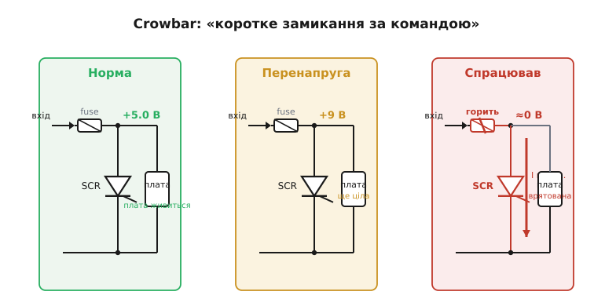
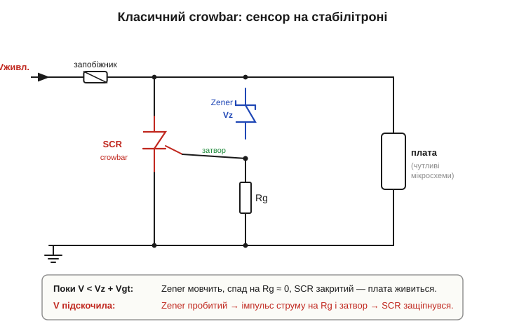

# 🔌 Тиристор у crowbar-захисті: «коротке замикання за командою»

> Каталог «Компоненти» · сектор `protection`.

### Що це за клас захисту

**Crowbar** (*crowbar overvoltage protection*) — це **аварійний захист від перенапруги** (*overvoltage protection, OVP*). Логіка обеззброююче проста: якщо напруга живлення вийшла за безпечну межу, краще миттєво **посадити шину в нуль** і спалити запобіжник, ніж дозволити завищеній напрузі дійти до навантаження. Жертвуємо запобіжником (і кількома секундами роботи), зате рятуємо плату, де згоріли б десятки дорожчих мікросхем, які потім не випаяти вручну.

Чому саме [тиристор](book:electronics/triac) (*SCR*)? Бо потрібен ключ, який від короткого імпульсу **замкнеться повністю й залишиться замкнутим** — навіть якщо причина перенапруги зникла на мить. Транзисторний ключ довелося б тримати відкритим активно; тиристорна защіпка робить це сама, фізикою своєї чотиришарової структури. Щойно спрацював — тримає коротке, поки запобіжник остаточно не обірве лінію.

*Рис. Ліворуч — норма: SCR закритий, плата живиться. Посередині — на вхід прорвалася завищена напруга, але детектор ще не дав команду. Праворуч — поріг перевищено, на затвор пішов імпульс, SCR замкнув шину на землю; великий струм просаджує напругу майже в нуль і спалює запобіжник, відрізаючи вхід. Плата врятована.*

### Блок-схема: сенсор + защіпка

Лишилося з'ясувати, хто дає тиристору команду замкнутися. Класичний crowbar складається з двох частин: **детектора порога** і **силової защіпки**. Найдешевший детектор — [стабілітрон](book:electronics/zener-schottky) (*Zener*): поки напруга нижча за його Vz, він мовчить і струму майже не проводить. Щойно шина підскакує вище Vz, стабілітрон пробивається, через резистор затвора Rg біжить струм — і на затворі тиристора з'являється потрібна напруга запуску.

*Рис. Стабілітрон стежить за шиною; поки V < Vz + Vgt, на Rg майже нема спаду і SCR закритий. Коли V перевищує поріг, Zener пробивається, на Rg падає напруга, тиристор отримує імпульс на затвор і защіпується — шунтуючи живлення на землю перед платою. Запобіжник у вхідній лінії після цього розриває коло.*

### Розпіновка тиристора

Тиристор у crowbar має три виводи — ті самі, що в будь-якого [тиристора](book:electronics/triac):

- **A** (*anode*, анод) — на плюсову шину живлення (її й треба замкнути);
- **K** (*cathode*, катод) — на землю;
- **G** (*gate*, затвор) — на сенсор через резистор Rg.

У типових корпусах (TO-220 і подібних) три ніжки часто йдуть у порядку **K–A–G** або **A–K–G** — конкретний розклад звіряють із даташитом, тут вгадувати не можна. Металева пластина корпусу зазвичай електрично з'єднана з анодом.

### Як підключити й підібрати

Знаючи виводи, зберемо схему навколо них. Силова частина: анод — до плюса захищуваної шини, катод — до землі, а **в розрив вхідної лінії** (до точки підключення crowbar) обов'язково ставлять **запобіжник** чи струмообмежувач. Без нього замкнутий тиристор просто перетворить усю енергію джерела на тепло й згорить сам.

Сенсор підбирають так, щоб поріг спрацювання був **вище** робочої напруги, але **нижче** того, що витримає навантаження. Для шини 5 В типовий поріг — близько 6.2 В: беруть стабілітрон Vz ≈ 5.6 В і додають напругу запуску затвора Vgt (≈ 0.6–0.8 В). Резистор Rg задає струм у затвор: достатній, щоб надійно запустити, але не такий, щоб стабілітрон чи затвор перегрілися.

### «Перший запуск»

Перевіряти crowbar бойовою перенапругою на живій платі — погана ідея. Безпечніше **тимчасово занизити поріг**: поставити стабілітрон трохи нижчий за робочу напругу — і шина мусить миттєво «сісти», а запобіжник згоріти. Або подати на затвор короткий керований імпульс і переконатися, що тиристор защіпнувся й напруга впала. Головна ознака успіху — різкий провал напруги на шині майже до нуля і обірваний запобіжник; саме цього й чекаємо.

### Типові граблі

- **Немає запобіжника — згорить тиристор.** Crowbar без послідовного обмежувача струму самовбивчий: защіпка тримає коротке вічно, тепло нікуди подіти.
- **Хибні спрацювання від шуму.** Гострий короткий викид на шині може защіпнути тиристор без реальної біди. Лікують невеликим конденсатором на затворі або RC-затримкою — щоб реагувати лише на тривале перевищення, а не на голку.
- **Поріг надто близько до робочого.** Якщо Vz майже дорівнює напрузі живлення, crowbar «стрілятиме» від звичайних пульсацій. Лишають запас між робочою напругою і порогом.
- **Точність простого стабілітрона невисока.** Розкид Vz і [дрейф із температурою](book:electronics/zener-schottky) розмивають поріг. Де треба точність — сенсор будують на опорній напрузі й компараторі замість «голого» Zener.
- **Тиристор має встигнути за струмом.** Прилад добирають так, щоб він витримав піковий струм короткого замикання до того, як спрацює запобіжник.

### Варіації класу

Простий **Zener + SCR** дешевий і надійний для грубого захисту. Де потрібен чіткий поріг, ставлять **спеціалізовану мікросхему OVP-супервізора**, що точно стежить за напругою і сама керує затвором тиристора. Для **дуже швидких і коротких** ударів (ESD, наведення) crowbar завеликий і повільний — там працює супресор [TVS](book:pcb-board/tvs-esd), що затискає напругу, а не садить її в нуль. А сучасні **електронні запобіжники** (*eFuse*) поєднують стеження й розрив в одному корпусі без жертовного плавкого елемента. Crowbar лишається там, де головне — **гарантовано** не пустити завищену напругу далі, навіть ціною спаленого запобіжника.

> 🔧 **Навіщо це.** Crowbar — остання лінія оборони на вході живлення: якщо стабілізатор «пробило» і на плату пішла завищена напруга, тиристор миттєво садить шину в нуль і рве запобіжник, рятуючи дорогі мікросхеми ціною дешевого плавкого елемента. Збирається з трьох копійчаних деталей — стабілітрон, резистор, тиристор, — але закон один: **обов'язково послідовний запобіжник**, поріг із запасом над робочою напругою і захист затвора від хибних спрацювань. Де треба точність чи швидкість — беруть OVP-супервізор, TVS або eFuse.
